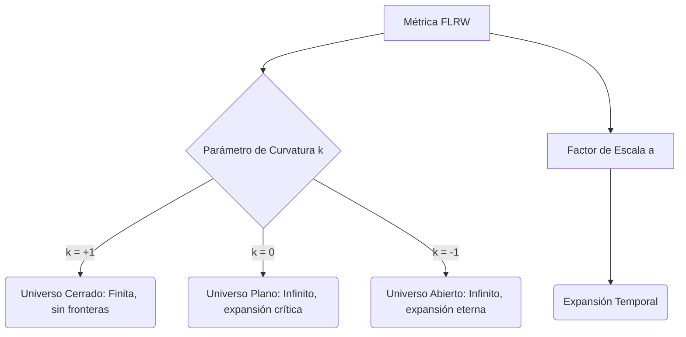

# Cosmología del Big Bang

La Cosmología del Big Bang es el modelo estándar sobre el origen y evolución del universo, que postula que este comenzó en un estado extremadamente caliente y denso hace unos 13.800 millones de años, y ha estado expandiéndose y enfriándose desde entonces.

## 📜 Contexto Histórico

En la década de 1920, las soluciones a las ecuaciones de la Relatividad General de Einstein por parte de Alexander Friedmann (1922) y Georges Lemaître (1927) sugerían que el universo no era estático, sino dinámico (pudiendo expandirse o contraerse). Einstein, prefiriendo un universo estático, introdujo la Constante Cosmológica para forzar esta quietud.

Sin embargo, en 1929, Edwin Hubble descubrió la **Ley de Hubble-Lemaître**: las galaxias se alejan de nosotros con una velocidad proporcional a su distancia, la primera prueba empírica de la expansión del universo. Lemaître propuso la teoría del "Átomo Primigenio", sugiriendo que si hoy el universo se expande, en el pasado debió estar concentrado en un punto.

El modelo rival de Estado Estacionario (Fred Hoyle, 1948) perdió apoyo definitivamente cuando en 1964 Arno Penzias y Robert Wilson descubrieron accidentalmente el **Fondo Cósmico de Microondas (CMB)**, el remanente térmico previsto por la teoría del Big Bang. En los 90s, el estudio de supernovas tipo Ia reveló que esta expansión está acelerada debido a la llamada **Energía Oscura**.

---

## 🧮 Desarrollo Teórico Profundo

El modelo cosmológico estándar, basado en la Relatividad General, se sustenta en el **Principio Cosmológico**, que establece que a gran escala, el universo es homogéneo e isótropo (igual en todas partes y en todas direcciones).

### 1. La Métrica FLRW

La única geometría del espacio-tiempo que satisface este principio es descrita por la **Métrica de Friedmann-Lemaître-Robertson-Walker (FLRW)**. En coordenadas comóviles $(t, r, \theta, \phi)$, el elemento de línea es:

$$ ds^2 = c^2 dt^2 - a^2(t) \left[ \frac{dr^2}{1 - kr^2} + r^2 (d\theta^2 + \sin^2\theta d\phi^2) \right] $$

- $t$ es el tiempo cósmico, medido por un observador comóvil (en reposo respecto a la expansión local).
- $a(t)$ es el **factor de escala**, que parametriza la expansión del universo (usualmente normalizado para que $a(t_0) = 1$ en el presente).
- $k$ es la constante de curvatura espacial:
  - $k = +1$: Geometría esférica (universo cerrado).
  - $k = 0$: Geometría euclidiana (universo plano).
  - $k = -1$: Geometría hiperbólica (universo abierto).

### 2. Las Ecuaciones de Friedmann

Al insertar la métrica FLRW y un tensor de energía-impulso para un fluido perfecto ($T^\mu_\nu = \text{diag}(\rho c^2, -P, -P, -P)$) en las ecuaciones de campo de Einstein, obtenemos las dos **Ecuaciones de Friedmann**.

**Primera Ecuación de Friedmann (Ecuación de la Expansión):**
Derivada de la componente temporal de las ecuaciones de Einstein, gobierna la tasa de expansión:
$$ H^2 \equiv \left(\frac{\dot{a}}{a}\right)^2 = \frac{8\pi G}{3}\rho - \frac{kc^2}{a^2} + \frac{\Lambda c^2}{3} $$
Donde $H(t)$ es el Parámetro de Hubble, $\rho$ es la densidad total de materia/radiación y $\Lambda$ es la constante cosmológica.

**Segunda Ecuación de Friedmann (Ecuación de Aceleración o de Raychaudhuri):**
Derivada de las componentes espaciales:
$$ \frac{\ddot{a}}{a} = -\frac{4\pi G}{3} \left( \rho + \frac{3P}{c^2} \right) + \frac{\Lambda c^2}{3} $$
Esta ecuación muestra que tanto la masa-energía ($\rho$) como la presión ($P$) contribuyen a frenar la expansión cósmica (de ahí el signo menos), a menos que predomine el término $\Lambda$.

### 3. Ecuación de Continuidad y Evolución de las Especies Cósmicas

Por conservación de la energía ($\nabla_\mu T^{\mu 0} = 0$), obtenemos la ecuación termodinámica del fluido cósmico:
$$ \dot{\rho} + 3\frac{\dot{a}}{a}\left(\rho + \frac{P}{c^2}\right) = 0 $$

El comportamiento de $\rho(a)$ depende de la **Ecuación de Estado** termodinámica $P = w \rho c^2$, donde $w$ es un parámetro adimensional:

- **Materia no relativista (Polvo):** Partículas moviéndose muy por debajo de $c$, como galaxias y materia oscura. Tienen $w = 0 \implies P = 0$.
  Integrando la ecuación de continuidad: $\rho_m \propto a^{-3}$ (se diluye con el volumen).
- **Radiación (y materia ultra-relativista):** Tienen $w = 1/3$.
  Integrando: $\rho_r \propto a^{-4}$. Cae más rápido que la materia debido a que el factor de escala no solo diluye la densidad numérica, sino que estira la longitud de onda de cada fotón (desplazamiento al rojo cosmológico $E \propto 1/a$).
- **Energía Oscura (Constante Cosmológica):** Tiene presión negativa $w = -1 \implies P = -\rho_\Lambda c^2$.
  Integrando: $\rho_\Lambda = \text{constante}$. La densidad no cambia a pesar de la expansión cósmica.

### 4. Parámetros de Densidad y el Universo Concordante

Es útil dividir la densidad por la **Densidad Crítica** $\rho_c$, que es la densidad exacta necesaria para un universo plano ($k=0, \Lambda=0$):
$$ \rho_c(t) = \frac{3H(t)^2}{8\pi G} $$

Definimos los parámetros de densidad adimensionales $\Omega_i = \rho_i / \rho_c$. La primera ecuación de Friedmann puede escribirse como una regla de suma:
$$ \Omega_m + \Omega_r + \Omega_\Lambda + \Omega_k = 1 $$
Donde $\Omega_k = -kc^2 / (a^2 H^2)$. Las observaciones actuales (como la misión Planck) indican que nuestro universo es plano ($\Omega_k \approx 0$), compuesto aproximadamente por $\Omega_\Lambda \approx 0.68$, $\Omega_m \approx 0.32$ (materia oscura + bariónica), y una cantidad insignificante de radiación $\Omega_r \sim 10^{-4}$ en la era actual.

---

## 🛠 Ejemplo Práctico

**Problema:** Calcula la edad del Universo asumiendo un modelo plano ($k=0$) dominado únicamente por materia ($\Omega_m = 1$). Si la constante de Hubble actual es $H_0 \approx 70 \text{ km s}^{-1} \text{ Mpc}^{-1}$, ¿cuál es la edad en años?

**Solución paso a paso:**
1. En un universo dominado por la materia, $\rho(t) \propto a^{-3}$. Específicamente, $\rho = \rho_0 a^{-3}$ asumiendo $a_0 = 1$.
2. La ecuación de Friedmann es:
   $$ \left(\frac{\dot{a}}{a}\right)^2 = \frac{8\pi G}{3} \frac{\rho_0}{a^3} \implies \dot{a}^2 = \frac{H_0^2}{a} $$
   Donde hemos usado que en $t_0$, $H_0^2 = \frac{8\pi G}{3} \rho_0$.
3. Despejamos $dt$:
   $$ \dot{a} = \frac{da}{dt} = H_0 a^{-1/2} \implies dt = \frac{1}{H_0} a^{1/2} da $$
4. Integramos desde el Big Bang ($t=0, a=0$) hasta hoy ($t=t_0, a=1$):
   $$ \int_0^{t_0} dt = \frac{1}{H_0} \int_0^1 a^{1/2} da $$
   $$ t_0 = \frac{1}{H_0} \left[ \frac{2}{3} a^{3/2} \right]_0^1 = \frac{2}{3 H_0} $$
5. Convertimos $H_0$ a unidades SI ($s^{-1}$). Sabemos que $1 \text{ Mpc} = 3.086 \times 10^{19} \text{ km}$.
   $$ H_0 = \frac{70 \text{ km/s}}{1 \text{ Mpc}} = \frac{70}{3.086 \times 10^{19}} \text{ s}^{-1} \approx 2.268 \times 10^{-18} \text{ s}^{-1} $$
6. El inverso de la constante de Hubble, conocido como el *Tiempo de Hubble*, es:
   $$ t_H = \frac{1}{H_0} \approx \frac{1}{2.268 \times 10^{-18} \text{ s}^{-1}} \approx 4.409 \times 10^{17} \text{ s} $$
7. Convertimos a años ($1 \text{ año} \approx 3.154 \times 10^7 \text{ s}$):
   $$ t_H = \frac{4.409 \times 10^{17}}{3.154 \times 10^7} \approx 13.98 \times 10^9 \text{ años} = 13.98 \text{ mil millones de años} $$
8. La edad para un universo puramente dominado por materia es $t_0 = \frac{2}{3} t_H$:
   $$ t_0 = \frac{2}{3} \times 13.98 \times 10^9 \approx 9.32 \text{ mil millones de años} $$
9. **Conclusión:** Este resultado ($9.32 \times 10^9$ años) es notablemente inferior a la edad observada de los cúmulos estelares más antiguos ($\sim 13$ mil millones). Fue la adición de la energía oscura (que cambia la relación integral de $t_0$) la que resolvió el "problema de la edad", arrojando el valor exacto de $13.8$ mil millones de años.

---

## 📚 Recursos Específicos

### 🎓 Cursos y Clases Recomendadas
1. **[Stanford University: Cosmology (Leonard Susskind)](https://theoreticalminimum.com/courses/cosmology/2013/winter)** - Parte del "Theoretical Minimum", explica en detalle las métricas y ecuaciones de Friedmann usando la relatividad general.
2. **[MIT 8.286 The Early Universe](https://ocw.mit.edu/courses/8-286-the-early-universe-fall-2013/)** - Curso completo por Alan Guth, el creador de la teoría de la inflación cósmica, disponible en MIT OpenCourseWare.
3. **[Perimeter Institute Seminars](https://pirsa.org/)** - Grabaciones gratuitas de conferencias avanzadas debatiendo el estado actual del modelo estándar cosmológico.
4. **[Coursera: From the Big Bang to Dark Energy](https://www.coursera.org/learn/big-bang)** - Curso de la Universidad de Tokio (Hitoshi Murayama) que cubre la formación de estructuras, inflación y energía oscura.
5. **[UC Irvine - Physics 20B: Cosmology (James Bullock)](https://www.youtube.com/playlist?list=PLqOZ6FD_RQ7nwb-mX-Z6G5fFv9yO-F18i)** - Clases fundamentales de pregrado que enseñan la historia térmica del universo y materia oscura.

### 📝 Artículos e Interactivos Interesantes
1. [Planck Legacy Archive (ESA)](http://pla.esac.esa.int/) - Acceso a los mapas e imágenes reales del fondo cósmico de microondas obtenidos por la misión Planck.
2. [Ned Wright's Cosmology Tutorial & Calculator](http://www.astro.ucla.edu/~wright/CosmoCalc.html) - Herramienta clave e interactiva para calcular tiempos, distancias y escalas según el corrimiento al rojo ($z$).
3. [Wikipedia: Timeline of the early universe](https://en.wikipedia.org/wiki/Timeline_of_the_early_universe) - Un repaso cronológico profundo y detallado de las primeras fracciones de segundo.
4. [NASA WMAP Science](https://map.gsfc.nasa.gov/universe/) - Recurso educativo sobre la misión WMAP que estableció de forma precisa la edad del universo (13.77 mil millones de años).
5. [The Dark Energy Survey (DES)](https://www.darkenergysurvey.org/) - Página oficial con los hallazgos y metodologías para trazar la historia de expansión cósmica.
6. [Scholarpedia: Inflationary Cosmology](http://www.scholarpedia.org/article/Cosmic_inflation) - Un análisis riguroso escrito por expertos sobre cómo la inflación resuelve los problemas del Big Bang clásico.
7. [Cosmic Microwave Background Simulator](http://lambda.gsfc.nasa.gov/) - Herramientas de simulación y bases de datos del LAMBDA (Legacy Archive for Microwave Background Data Analysis).
8. [Supernova Cosmology Project](http://scp.berkeley.edu/) - Datos históricos y explicaciones sobre el descubrimiento de la energía oscura usando supernovas Tipo Ia.

### 📖 Referencias Útiles y Bibliografía
- **["Cosmology" - Steven Weinberg](https://global.oup.com/academic/product/cosmology-9780198526827)**: Un texto fundamental y riguroso; es el estándar de oro en cursos de posgrado.
- **["Introduction to Cosmology" - Barbara Ryden](https://www.cambridge.org/highereducation/books/introduction-to-cosmology/A7080DA9D6A9C5D089E4670DAB5259B2)**: Posiblemente el libro de introducción a la cosmología más claro y accesible para nivel de pregrado, excelente para entender la Ecuación de Friedmann.
- **["The First Three Minutes" - Steven Weinberg](https://www.basicbooks.com/titles/steven-weinberg/the-first-three-minutes/9780465024377/)**: Un clásico de divulgación que explica de manera brillante la termodinámica del universo temprano.
- **["Modern Cosmology" - Scott Dodelson](https://shop.elsevier.com/books/modern-cosmology/dodelson/978-0-12-815948-4)**: Texto avanzado muy utilizado que se enfoca en las perturbaciones cosmológicas y el análisis del CMB.
- **["An Introduction to Modern Cosmology" - Andrew Liddle](https://www.wiley.com/en-us/An+Introduction+to+Modern+Cosmology%2C+3rd+Edition-p-9781118502143)**: Otra opción fenomenal, un poco más breve que Ryden, para cursos introductorios universitarios.
