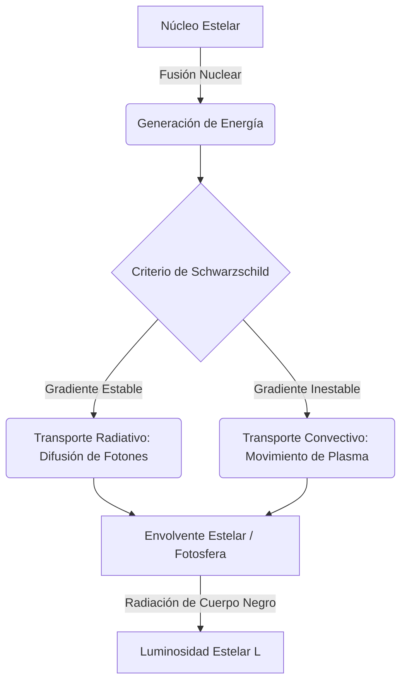

# Física Estelar

La Física Estelar es la rama de la astrofísica que estudia la formación, evolución, estructura interna y muerte de las estrellas, aplicando los principios de la mecánica cuántica, la termodinámica, el electromagnetismo y la relatividad.

## 📜 Contexto Histórico

La comprensión moderna de las estrellas comenzó a finales del siglo XIX y principios del XX. Cecilia Payne-Gaposchkin (1925) demostró que el Sol y las estrellas están compuestas principalmente de hidrógeno y helio, refutando la creencia previa de que su composición era similar a la de la Tierra. 

Hans Bethe (1939) describió los procesos de fusión nuclear (la cadena protón-protón y el ciclo CNO) que proporcionan la energía que hace brillar a las estrellas. Subrahmanyan Chandrasekhar (1930) dedujo el límite máximo de masa para una enana blanca (Límite de Chandrasekhar, $\sim 1.4 M_\odot$), estableciendo que estrellas más masivas debían colapsar en estrellas de neutrones o agujeros negros. El desarrollo del **Diagrama de Hertzsprung-Russell** (HR) por Ejnar Hertzsprung y Henry Norris Russell en 1910 permitió a los astrónomos clasificar las estrellas y entender su ciclo vital visualmente.

---

## 🧮 Desarrollo Teórico Profundo

El interior de una estrella en equilibrio es un plasma caliente donde las fuerzas gravitacionales (que tienden a colapsar la estrella) se equilibran exactamente con las fuerzas de presión (que tienden a expandirla). Este estado se describe mediante **cuatro ecuaciones diferenciales fundamentales de la estructura estelar**.

### 1. Ecuación de Equilibrio Hidrostático

La condición primordial para la estabilidad estelar es el equilibrio hidrostático. Consideremos un elemento de volumen de masa esférica con densidad $\rho$, área $dA$ y grosor $dr$. La diferencia de presión entre la cara inferior y superior crea una fuerza neta hacia afuera $dP \cdot dA$ que debe equilibrar la gravedad local:

$$ dP = -\frac{G M_r}{r^2} (\rho dr) \implies \frac{dP}{dr} = -\frac{GM_r \rho}{r^2} $$

Donde:
- $P(r)$ es la presión total (presión del gas iónico + presión de radiación fotónica + presión de degeneración, si aplica).
- $M_r$ es la masa encerrada dentro del radio $r$.

### 2. Ecuación de Continuidad de Masa

La variación de la masa encerrada al aumentar el radio en $dr$ es simplemente el volumen de la capa esférica multiplicado por la densidad local:

$$ dM_r = 4\pi r^2 \rho dr \implies \frac{dM_r}{dr} = 4\pi r^2 \rho $$

### 3. Ecuación de Conservación (o Generación) de Energía

Para que la estrella brille constantemente, la energía que fluye a través de una capa esférica de radio $r$ (luminosidad local $L_r$) debe incrementarse en la cantidad de energía nuclear que se genera en esa capa. Si $\epsilon$ es la tasa de producción de energía por unidad de masa (en W/kg):

$$ dL_r = (4\pi r^2 \rho dr) \epsilon \implies \frac{dL_r}{dr} = 4\pi r^2 \rho \epsilon $$

El valor de $\epsilon$ depende de la densidad y, muy fuertemente, de la temperatura. Por ejemplo, en el Sol (cadena p-p), $\epsilon_{pp} \propto \rho T^4$. En estrellas más masivas (ciclo CNO), $\epsilon_{CNO} \propto \rho T^{17}$.

### 4. Transporte de Energía

La energía generada en el núcleo debe viajar a la superficie. El gradiente de temperatura que se establece depende del mecanismo de transporte dominante:

**Transporte Radiativo:**
Si la energía fluye principalmente por difusión de fotones, la opacidad $\kappa$ (resistencia de la materia al paso de la radiación) determina la pendiente de la temperatura:
$$ \frac{dT}{dr} = -\frac{3\kappa \rho L_r}{64\pi \sigma_{SB} r^2 T^3} $$
Donde $\sigma_{SB}$ es la constante de Stefan-Boltzmann.

**Transporte Convectivo:**
Si la opacidad es muy alta o la dependencia de $\epsilon$ con la temperatura es muy pronunciada (creando un gradiente térmico muy abrupto), el fluido se vuelve inestable frente a la convección (Criterio de Schwarzschild). Burbujas macroscópicas de plasma caliente ascienden adiabáticamente. El gradiente térmico es entonces dictado por la relación adiabática:
$$ \frac{dT}{dr} = \left( 1 - \frac{1}{\gamma} \right) \frac{T}{P} \frac{dP}{dr} $$
Donde $\gamma$ es el índice adiabático del gas (5/3 para un gas monoatómico ideal).

### Ecuación de Estado Estelar

Para cerrar el sistema de ecuaciones, necesitamos relacionar la presión, la densidad y la temperatura. En la mayoría de las estrellas de secuencia principal (como el Sol), el plasma se comporta como un **gas ideal**, y la radiación también aporta presión:

$$ P = P_{\text{gas}} + P_{\text{rad}} = \frac{\rho k_B T}{\mu m_H} + \frac{1}{3} a T^4 $$

Donde $\mu$ es el peso molecular medio, $m_H$ es la masa del átomo de hidrógeno, $k_B$ es la constante de Boltzmann, y $a$ es la constante de densidad de radiación.

En remanentes estelares compactos (Enanas Blancas, Estrellas de Neutrones), la presión está dominada por el principio de exclusión de Pauli (mecánica cuántica), dando lugar a la **Presión de Degeneración**, que sorprendentemente depende de la densidad pero no de la temperatura: $P \propto \rho^{5/3}$ (no relativista) o $P \propto \rho^{4/3}$ (relativista).

---

## 🛠 Ejemplo Práctico

**Problema:** Calcula el **Tiempo de Kelvin-Helmholtz** ($t_{KH}$) para el Sol. Esta es la escala de tiempo que el Sol podría brillar irradiando únicamente su energía potencial gravitatoria acumulada (sin fusión nuclear). 
Datos del Sol: $M_\odot \approx 2 \times 10^{30} \text{ kg}$, $R_\odot \approx 7 \times 10^8 \text{ m}$, $L_\odot \approx 3.8 \times 10^{26} \text{ W}$, $G = 6.674 \times 10^{-11} \text{ m}^3 \text{ kg}^{-1} \text{ s}^{-2}$.

**Solución paso a paso:**
1. La energía potencial gravitatoria $U$ de una esfera de masa $M$ y radio $R$ (asumiendo densidad constante como una aproximación burda) viene dada por el teorema del virial:
   $$ U \approx -\frac{3GM^2}{5R} $$
2. El tiempo de Kelvin-Helmholtz es la cantidad de energía disponible dividida por la tasa a la que se gasta (luminosidad):
   $$ t_{KH} = \frac{|U|}{L_\odot} = \frac{3GM^2}{5R L_\odot} $$
3. Sustituimos los valores numéricos:
   - Numerador: $3 \times (6.674 \times 10^{-11}) \times (2 \times 10^{30})^2$
   - $3 \times 6.674 \times 10^{-11} \times 4 \times 10^{60} \approx 80.088 \times 10^{49} \text{ Joules}$
   - Denominador: $5 \times (7 \times 10^8) \times (3.8 \times 10^{26})$
   - $5 \times 7 \times 3.8 \times 10^{34} = 133 \times 10^{34} \text{ Joules/s}$
4. Calculamos $t_{KH}$ en segundos:
   $$ t_{KH} = \frac{80.088 \times 10^{49}}{133 \times 10^{34}} \approx 0.602 \times 10^{15} \text{ s} = 6.02 \times 10^{14} \text{ s} $$
5. Convertimos a años ($1 \text{ año} \approx 3.15 \times 10^7 \text{ s}$):
   $$ t_{KH} \approx \frac{6.02 \times 10^{14}}{3.15 \times 10^7} \approx 1.9 \times 10^7 \text{ años} = 19 \text{ millones de años} $$
6. **Conclusión:** Lord Kelvin calculó este tiempo a finales del siglo XIX y concluyó que el Sol (y por ende la Tierra) no podía tener más de $\sim 20$ millones de años. Esto contradecía drásticamente la evidencia geológica y biológica (Darwin), que requería cientos de millones de años. La discrepancia solo se resolvió cuando se descubrió la verdadera fuente de energía del Sol: la fusión nuclear, que permite al Sol brillar por unos $10,000$ millones de años.

---

## 📚 Recursos Específicos

### 🎓 Cursos y Clases Recomendadas
1. **[Yale Courses: ASTR 160 Frontiers and Controversies in Astrophysics](https://oyc.yale.edu/astronomy/astr-160)** - Profundización impartida por Charles Bailyn, cubriendo evolución estelar, agujeros negros y exoplanetas.
2. **[Ohio State University: Astronomy 1144 / 871 (Richard Pogge)](http://www.astronomy.ohio-state.edu/~pogge/Ast871/)** - Notas de clase excepcionales que detallan de manera accesible pero rigurosa la estructura y vida estelar.
3. **[Coursera: Astronomy: Exploring Time and Space](https://www.coursera.org/learn/astro)** - (Universidad de Arizona) El módulo dedicado a estrellas y su clasificación es altamente ilustrativo.
4. **[MIT 8.284 Modern Astrophysics](https://ocw.mit.edu/courses/8-284-modern-astrophysics-spring-2006/)** - Clases y materiales disponibles vía OCW que cubren las ecuaciones de equilibrio hidrostático y transporte radiativo.
5. **[ANU - Astrophysics: Cosmology & Astrophysics (edX)](https://www.edx.org/micromasters/anu-astrophysics)** - Impartido por Paul Francis y Brian Schmidt, con énfasis en supernovas, remanentes estelares y métodos observacionales.

### 📝 Artículos e Interactivos Interesantes
1. [Naap Labs: Hertzsprung-Russell Diagram Explorer](https://astro.unl.edu/naap/hr/hr_background1.html) - Magnífico simulador interactivo de la Universidad de Nebraska para entender cómo varían luminosidad, temperatura y radio a lo largo de la evolución.
2. [Naap Labs: Eclipsing Binary Simulator](https://astro.unl.edu/naap/ebs/ebs.html) - Herramienta interactiva para entender cómo se miden empíricamente las masas estelares.
3. [Artículo original de Hans Bethe (1939)](https://journals.aps.org/pr/abstract/10.1103/PhysRev.55.434) - "Energy Production in Stars", la publicación histórica que desentrañó la fusión nuclear (ciclo CNO y p-p).
4. [Scholarpedia: Stellar Evolution](http://www.scholarpedia.org/article/Stellar_evolution) - Resumen detallado sobre las diferentes etapas vitales (secuencia principal, gigantes rojas, nebulosas planetarias).
5. [The MESA Project (Modules for Experiments in Stellar Astrophysics)](https://docs.mesastar.org/) - Código open-source de uso profesional para simular la evolución estelar; incluye excelentes tutoriales.
6. [Chandra X-ray Observatory: Supernovas & Supernova Remnants](https://chandra.harvard.edu/xray_sources/supernovas.html) - Galería, datos y artículos sobre las espectaculares muertes de estrellas masivas.
7. [Hubble Site: Stars](https://hubblesite.org/science/stars-and-nebulas) - Artículos y observaciones directas de discos protoplanetarios y enanas blancas.
8. [Wikipedia: Stellar nucleosynthesis](https://en.wikipedia.org/wiki/Stellar_nucleosynthesis) - Cómo los elementos de la tabla periódica se forjan dentro de los núcleos estelares.

### 📖 Referencias Útiles y Bibliografía
- **["An Introduction to Modern Astrophysics" - Bradley W. Carroll y Dale A. Ostlie (El "BOB")](https://www.cambridge.org/highereducation/books/an-introduction-to-modern-astrophysics/8C2B3C2B3A6C5B3E6B4A6C8D8E9F6B5C)**: El texto estándar definitivo de astrofísica a nivel universitario. Tiene un extenso volumen dedicado a física estelar.
- **["Stellar Structure and Evolution" - Rudolf Kippenhahn, Alfred Weigert, y Achim Weiss](https://link.springer.com/book/10.1007/978-3-642-30304-3)**: El clásico absoluto para la teoría avanzada de interiores estelares y el modelado computacional.
- **["Black Holes, White Dwarfs, and Neutron Stars" - Stuart L. Shapiro y Saul A. Teukolsky](https://onlinelibrary.wiley.com/doi/book/10.1002/9783527617661)**: La biblia de la física de objetos compactos y los remanentes finales del colapso estelar.
- **["Evolution of Stars and Stellar Populations" - Maurizio Salaris y Santi Cassisi](https://onlinelibrary.wiley.com/doi/book/10.1002/047009219X)**: Excelente recurso para entender tanto estrellas individuales como cúmulos estelares.
- **["Astrophysics in a Nutshell" - Dan Maoz](https://press.princeton.edu/books/hardcover/9780691164793/astrophysics-in-a-nutshell)**: Excelente para repasar rápidamente de manera concisa pero profunda los principios físicos clave detrás del funcionamiento del sol y otras estrellas.
