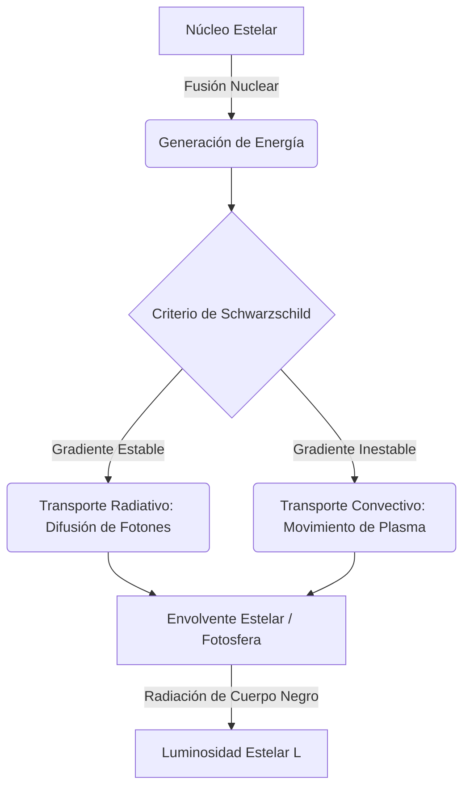

# Física Estelar

La Física Estelar es la rama de la astrofísica que estudia la formación, evolución, estructura interna y muerte de las estrellas, aplicando los principios de la mecánica cuántica, la termodinámica, el electromagnetismo y la relatividad.

## 📜 Contexto Histórico

La comprensión moderna de las estrellas comenzó a finales del siglo XIX y principios del XX. Cecilia Payne-Gaposchkin (1925) demostró que el Sol y las estrellas están compuestas principalmente de hidrógeno y helio, refutando la creencia previa de que su composición era similar a la de la Tierra. 

Hans Bethe (1939) describió los procesos de fusión nuclear (la cadena protón-protón y el ciclo CNO) que proporcionan la energía que hace brillar a las estrellas. Subrahmanyan Chandrasekhar (1930) dedujo el límite máximo de masa para una enana blanca (Límite de Chandrasekhar, $\sim 1.4 M_\odot$), estableciendo que estrellas más masivas debían colapsar en estrellas de neutrones o agujeros negros. El desarrollo del **Diagrama de Hertzsprung-Russell** (HR) por Ejnar Hertzsprung y Henry Norris Russell en 1910 permitió a los astrónomos clasificar las estrellas y entender su ciclo vital visualmente.

---

## 🧮 Desarrollo Teórico Profundo

El interior de una estrella en equilibrio es un plasma caliente donde las fuerzas gravitacionales (que tienden a colapsar la estrella) se equilibran exactamente con las fuerzas de presión (que tienden a expandirla). Este estado se describe mediante **cuatro ecuaciones diferenciales fundamentales de la estructura estelar**.

### 1. Ecuación de Equilibrio Hidrostático

La condición primordial para la estabilidad estelar es el equilibrio hidrostático. Consideremos un elemento de volumen de masa esférica con densidad $\rho$, área $dA$ y grosor $dr$. La diferencia de presión entre la cara inferior y superior crea una fuerza neta hacia afuera $dP \cdot dA$ que debe equilibrar la gravedad local:

$$ dP = -\frac{G M_r}{r^2} (\rho dr) \implies \frac{dP}{dr} = -\frac{GM_r \rho}{r^2} $$

Donde:
- $P(r)$ es la presión total (presión del gas iónico + presión de radiación fotónica + presión de degeneración, si aplica).
- $M_r$ es la masa encerrada dentro del radio $r$.

### 2. Ecuación de Continuidad de Masa

La variación de la masa encerrada al aumentar el radio en $dr$ es simplemente el volumen de la capa esférica multiplicado por la densidad local:

$$ dM_r = 4\pi r^2 \rho dr \implies \frac{dM_r}{dr} = 4\pi r^2 \rho $$

### 3. Ecuación de Conservación (o Generación) de Energía

Para que la estrella brille constantemente, la energía que fluye a través de una capa esférica de radio $r$ (luminosidad local $L_r$) debe incrementarse en la cantidad de energía nuclear que se genera en esa capa. Si $\epsilon$ es la tasa de producción de energía por unidad de masa (en W/kg):

$$ dL_r = (4\pi r^2 \rho dr) \epsilon \implies \frac{dL_r}{dr} = 4\pi r^2 \rho \epsilon $$

El valor de $\epsilon$ depende de la densidad y, muy fuertemente, de la temperatura. Por ejemplo, en el Sol (cadena p-p), $\epsilon_{pp} \propto \rho T^4$. En estrellas más masivas (ciclo CNO), $\epsilon_{CNO} \propto \rho T^{17}$.

### 4. Transporte de Energía

La energía generada en el núcleo debe viajar a la superficie. El gradiente de temperatura que se establece depende del mecanismo de transporte dominante:

**Transporte Radiativo:**
Si la energía fluye principalmente por difusión de fotones, la opacidad $\kappa$ (resistencia de la materia al paso de la radiación) determina la pendiente de la temperatura:
$$ \frac{dT}{dr} = -\frac{3\kappa \rho L_r}{64\pi \sigma_{SB} r^2 T^3} $$
Donde $\sigma_{SB}$ es la constante de Stefan-Boltzmann.

**Transporte Convectivo:**
Si la opacidad es muy alta o la dependencia de $\epsilon$ con la temperatura es muy pronunciada (creando un gradiente térmico muy abrupto), el fluido se vuelve inestable frente a la convección (Criterio de Schwarzschild). Burbujas macroscópicas de plasma caliente ascienden adiabáticamente. El gradiente térmico es entonces dictado por la relación adiabática:
$$ \frac{dT}{dr} = \left( 1 - \frac{1}{\gamma} \right) \frac{T}{P} \frac{dP}{dr} $$
Donde $\gamma$ es el índice adiabático del gas (5/3 para un gas monoatómico ideal).



### Ecuación de Estado Estelar

Para cerrar el sistema de ecuaciones, necesitamos relacionar la presión, la densidad y la temperatura. En la mayoría de las estrellas de secuencia principal (como el Sol), el plasma se comporta como un **gas ideal**, y la radiación también aporta presión:

$$ P = P_{\text{gas}} + P_{\text{rad}} = \frac{\rho k_B T}{\mu m_H} + \frac{1}{3} a T^4 $$

Donde $\mu$ es el peso molecular medio, $m_H$ es la masa del átomo de hidrógeno, $k_B$ es la constante de Boltzmann, y $a$ es la constante de densidad de radiación.

En remanentes estelares compactos (Enanas Blancas, Estrellas de Neutrones), la presión está dominada por el principio de exclusión de Pauli (mecánica cuántica), dando lugar a la **Presión de Degeneración**, que sorprendentemente depende de la densidad pero no de la temperatura: $P \propto \rho^{5/3}$ (no relativista) o $P \propto \rho^{4/3}$ (relativista).

---

## 🛠 Ejemplo Práctico

**Problema:** Calcula el **Tiempo de Kelvin-Helmholtz** ($t_{KH}$) para el Sol. Esta es la escala de tiempo que el Sol podría brillar irradiando únicamente su energía potencial gravitatoria acumulada (sin fusión nuclear). 
Datos del Sol: $M_\odot \approx 2 \times 10^{30} \text{ kg}$, $R_\odot \approx 7 \times 10^8 \text{ m}$, $L_\odot \approx 3.8 \times 10^{26} \text{ W}$, $G = 6.674 \times 10^{-11} \text{ m}^3 \text{ kg}^{-1} \text{ s}^{-2}$.

**Solución paso a paso:**
1. La energía potencial gravitatoria $U$ de una esfera de masa $M$ y radio $R$ (asumiendo densidad constante como una aproximación burda) viene dada por el teorema del virial:
   $$ U \approx -\frac{3GM^2}{5R} $$
2. El tiempo de Kelvin-Helmholtz es la cantidad de energía disponible dividida por la tasa a la que se gasta (luminosidad):
   $$ t_{KH} = \frac{|U|}{L_\odot} = \frac{3GM^2}{5R L_\odot} $$
3. Sustituimos los valores numéricos:
   - Numerador: $3 \times (6.674 \times 10^{-11}) \times (2 \times 10^{30})^2$
   - $3 \times 6.674 \times 10^{-11} \times 4 \times 10^{60} \approx 80.088 \times 10^{49} \text{ Joules}$
   - Denominador: $5 \times (7 \times 10^8) \times (3.8 \times 10^{26})$
   - $5 \times 7 \times 3.8 \times 10^{34} = 133 \times 10^{34} \text{ Joules/s}$
4. Calculamos $t_{KH}$ en segundos:
   $$ t_{KH} = \frac{80.088 \times 10^{49}}{133 \times 10^{34}} \approx 0.602 \times 10^{15} \text{ s} = 6.02 \times 10^{14} \text{ s} $$
5. Convertimos a años ($1 \text{ año} \approx 3.15 \times 10^7 \text{ s}$):
   $$ t_{KH} \approx \frac{6.02 \times 10^{14}}{3.15 \times 10^7} \approx 1.9 \times 10^7 \text{ años} = 19 \text{ millones de años} $$
6. **Conclusión:** Lord Kelvin calculó este tiempo a finales del siglo XIX y concluyó que el Sol (y por ende la Tierra) no podía tener más de $\sim 20$ millones de años. Esto contradecía drásticamente la evidencia geológica y biológica (Darwin), que requería cientos de millones de años. La discrepancia solo se resolvió cuando se descubrió la verdadera fuente de energía del Sol: la fusión nuclear, que permite al Sol brillar por unos $10,000$ millones de años.

---

## 📝 Guía de Ejercicios Resueltos

**Problema 1: Perfil de Presión en una Estrella de Densidad Constante**
Utilice la ecuación de equilibrio hidrostático para derivar el perfil de presión interno $P(r)$ de una estrella esférica asumiendo un modelo extremadamente simplificado donde la densidad de masa es constante $\rho(r) = \rho_0$ en toda la estrella de masa $M$ y radio $R$. Demuestre que la presión central se puede expresar como $P_c = \frac{3GM^2}{8\pi R^4}$.

**Solución paso a paso:**
1. **Masa encerrada:**
   Si la densidad es constante, la masa interior al radio $r$ es $M_r = \frac{4}{3}\pi r^3 \rho_0$.
2. **Ecuación de equilibrio hidrostático:**
   $\frac{dP}{dr} = -\frac{GM_r \rho_0}{r^2} = -\frac{G (\frac{4}{3}\pi r^3 \rho_0) \rho_0}{r^2} = -\frac{4\pi}{3} G \rho_0^2 r$.
3. **Integración:**
   Integramos desde el radio $r$ hasta la superficie $R$, asumiendo $P(R) = 0$:
   $\int_{P(r)}^0 dP = \int_r^R -\frac{4\pi}{3} G \rho_0^2 r dr$.
   $-P(r) = -\frac{4\pi}{3} G \rho_0^2 \left[ \frac{r^2}{2} \right]_r^R = -\frac{2\pi}{3} G \rho_0^2 (R^2 - r^2)$.
   Por tanto, $P(r) = \frac{2\pi}{3} G \rho_0^2 (R^2 - r^2)$.
4. **Presión Central:**
   Evaluamos en $r = 0$: $P_c = \frac{2\pi}{3} G \rho_0^2 R^2$.
   Usando $\rho_0 = \frac{M}{\frac{4}{3}\pi R^3}$, sustituimos:
   $P_c = \frac{2\pi}{3} G \left( \frac{3M}{4\pi R^3} \right)^2 R^2 = \frac{2\pi}{3} G \frac{9M^2}{16\pi^2 R^6} R^2 = \frac{3GM^2}{8\pi R^4}$.

**Problema 2: Ecuación de Estado de un Gas de Electrones Degenerado**
Derive la relación de proporcionalidad entre la presión de degeneración y la densidad de masa para una enana blanca no relativista ($P \propto \rho^{5/3}$) usando principios de mecánica cuántica y el espacio de fase.

**Solución paso a paso:**
1. **Espacio de Fases de Fermi:**
   En el cero absoluto idealizado, los electrones llenan los estados de energía más bajos hasta el momento de Fermi $p_F$.
   El principio de exclusión de Pauli dicta un máximo de $2$ electrones por volumen cuántico $h^3$.
   Densidad numérica: $n_e = \int_0^{p_F} \frac{2}{h^3} 4\pi p^2 dp = \frac{8\pi p_F^3}{3h^3} \implies p_F \propto n_e^{1/3}$.
2. **Presión microscópica:**
   La presión ejercida por un gas isótropo es $P = \frac{1}{3} \int n(p) v(p) p dp$.
   Para el régimen no relativista, $v(p) = p / m_e$.
   $P \propto \int_0^{p_F} p^2 \cdot \frac{p}{m_e} \cdot p dp \propto \int_0^{p_F} p^4 dp \propto p_F^5$.
3. **Relación final:**
   Sustituyendo $p_F \propto n_e^{1/3}$, obtenemos $P \propto (n_e^{1/3})^5 = n_e^{5/3}$.
   Asumiendo neutralidad de carga, la masa de la estrella viene dada por los nucleones (protones y neutrones), por lo que la densidad de masa $\rho \propto n_e$.
   Por tanto, $P_{deg} \propto \rho^{5/3}$.

**Problema 3: Límite de la masa de Eddington**
Determine la luminosidad máxima (Límite de Eddington) que una estrella de masa $M$ puede sostener antes de que la presión de la radiación expulse sus capas exteriores de hidrógeno. Exprese el resultado dependiente de la opacidad de dispersión de electrones (Thomson).

**Solución paso a paso:**
1. **Fuerza gravitatoria sobre un par electrón-protón:**
   A una distancia $r$, la fuerza gravitatoria entrante sobre el átomo de hidrógeno (aproximado por la masa del protón $m_p$, ya que $m_p \gg m_e$) es:
   $F_{grav} = \frac{GM m_p}{r^2}$.
2. **Fuerza de la radiación:**
   El flujo radiativo en la superficie $r$ es $F_{rad} = \frac{L}{4\pi r^2}$.
   La radiación ejerce presión (momento transferido) sobre los electrones (que dominan la opacidad por dispersión de Thomson $\sigma_T$). Como protones y electrones están acoplados electrostáticamente, esta fuerza arrastra al plasma.
   La fuerza repulsiva de radiación es $F_{rad} = \frac{dp}{dt} = \frac{\sigma_T F_{rad}}{c} = \frac{\sigma_T L}{4\pi r^2 c}$.
3. **Condición límite:**
   La estrella empieza a disgregarse cuando $F_{rad} \ge F_{grav}$.
   Igualando ambas fuerzas:
   $\frac{\sigma_T L_{Edd}}{4\pi r^2 c} = \frac{GM m_p}{r^2}$.
   Nótese que la dependencia radial $r^2$ se cancela.
4. **Despejando el Límite de Eddington:**
   $L_{Edd} = \frac{4\pi G c m_p}{\sigma_T} M$.
   Insertando constantes, se obtiene $\approx 3.2 \times 10^4 \left(\frac{M}{M_\odot}\right) L_\odot$. Estrellas por encima de esta luminosidad sufrirían vientos extremos que limitarían su crecimiento.

## 💻 Simulaciones Computacionales

La siguiente simulación en Python modela el interior de una estrella simplificada de secuencia principal (una politropa $n=3$, que aproxima una estrella con transporte radiativo) integrando la ecuación de Lane-Emden.

```python
import numpy as np
import matplotlib.pyplot as plt
from scipy.integrate import solve_ivp

def lane_emden(xi, y, n):
    """
    Ecuación de Lane-Emden para politropas: 
    (1/xi^2) * d/dxi(xi^2 * dtheta/dxi) = -theta^n
    Sistema de ODEs de primer orden:
    dtheta/dxi = u
    du/dxi = -theta^n - 2*u/xi
    """
    theta, u = y
    
    # Manejar singularidad en xi = 0
    if xi == 0:
        dtheta_dxi = 0
        du_dxi = -1/3
    else:
        # Prevenir potencias fraccionarias de negativos
        if theta < 0: theta = 0 
        dtheta_dxi = u
        du_dxi = -(theta**n) - (2/xi)*u
        
    return [dtheta_dxi, du_dxi]

# Condición límite en el centro estelar (xi = 0)
# theta(0) = 1, theta'(0) = 0
y0 = [1.0, 0.0]

# Pequeño desplazamiento inicial para evitar dividir por 0
xi_span = (1e-5, 10.0)
xi_eval = np.linspace(1e-5, 10.0, 500)

plt.figure(figsize=(9, 6))

# Índices politrópicos comunes
indices = [1.5, 3.0] # 1.5: convectiva (gas ideal), 3.0: radiativa (estrella típica Eddington)

for n in indices:
    sol = solve_ivp(lane_emden, xi_span, y0, args=(n,), t_eval=xi_eval, method='RK45')
    
    # Encontrar la superficie de la estrella (donde theta cae a 0)
    theta = sol.y[0]
    surface_idx = np.where(theta <= 0)[0]
    
    if len(surface_idx) > 0:
        idx = surface_idx[0]
        xi_star = sol.t[:idx]
        theta_star = theta[:idx]
    else:
        xi_star = sol.t
        theta_star = theta
        
    # Densidad proporcional a theta^n
    rho_norm = theta_star**n
    
    plt.plot(xi_star, rho_norm, label=f'Polítropa n={n}', lw=2)

plt.title('Perfil de Densidad Interna Estelar (Soluciones de Lane-Emden)')
plt.xlabel('Radio Normalizado $\\xi$')
plt.ylabel('Densidad Normalizada $\\rho / \\rho_c$')
plt.legend()
plt.grid(True)
plt.show()
```

## 📚 Recursos Específicos

### 🎓 Cursos y Clases Recomendadas
1. **[Yale Courses: ASTR 160 Frontiers and Controversies in Astrophysics](https://oyc.yale.edu/astronomy/astr-160)** - El Profesor Charles Bailyn impartió estas brillantes clases que exploran empíricamente el diagrama H-R, evolución estelar y la formación y observación de remanentes (agujeros negros y cuásares).
2. **[Ohio State University: Astronomy 1144 / 871 (Richard Pogge)](http://www.astronomy.ohio-state.edu/~pogge/Ast871/)** - Sus notas de clase gratuitas son de los mejores recursos públicos online, detallando rigurosamente el equilibrio hidrostático y termodinámico, el transporte radiativo y modelos atmosféricos.
3. **[MIT OpenCourseWare: 8.284 Modern Astrophysics](https://ocw.mit.edu/courses/8-284-modern-astrophysics-spring-2006/)** - Las clases universitarias abordan magistralmente los mecanismos físicos estelares (polítropas estelares, opacidades de Kramers, límites de degeneración) junto con la base observacional fotométrica.
4. **[Coursera: Astronomy: Exploring Time and Space](https://www.coursera.org/learn/astro)** - Curso de la Universidad de Arizona, con una profunda y accesible dedicación a las diferentes clasificaciones espectrales de estrellas de secuencia principal, nebulosas planetarias y supernovas.

### 📝 Artículos Científicos Históricos y Avanzados

1. **Energy Production in Stars (Producción de Energía en las Estrellas)**  
   *Hans A. Bethe (1939)*. [Physical Review, 55(5), 434-456](https://journals.aps.org/pr/abstract/10.1103/PhysRev.55.434).  
   **Importancia Teórica:** Con este majestuoso artículo (por el cual Bethe ganó el Premio Nobel en 1967), se resolvió el eterno misterio de cómo las estrellas como el Sol generan la abrumadora energía necesaria para mantenerse estables y no sucumbir a su propia gravedad durante miles de millones de años, descartando los simples tiempos de Kelvin-Helmholtz.  
   **Fondo Matemático:** En combinación parcial con el trabajo previo de Weizsäcker, Bethe dedujo rigurosamente los índices de reacción dependientes de túnel cuántico para el ciclo carbono-nitrógeno-oxígeno (CNO). En este ciclo catalítico, el carbono-12 finaliza intacto tras forjar un núcleo de helio con altísima dependencia térmica:
   $$ \epsilon_{\text{CNO}} \propto \rho T^{17} $$
   **Implicaciones Físicas:** Demostró que las estrellas masivas consumen su hidrógeno de forma explosivamente rápida a través del ciclo CNO, mientras que estrellas más livianas como el Sol (o menos) transitan primariamente la serie cadena protón-protón ($\epsilon \propto \rho T^4$), cimentando la teoría de núcleos y vidas estelares divergentes en función de la masa.

2. **The Highly Collapsed Configurations of a Stellar Mass (Las Configuraciones Altamente Colapsadas de una Masa Estelar)**  
   *S. Chandrasekhar (1931)*. [Monthly Notices of the Royal Astronomical Society, 91(5), 456-466](https://academic.oup.com/mnras/article/91/5/456/985043).  
   **Importancia Teórica:** El descubrimiento genial de un estudiante paquistaní/indio de 19 años (Subrahmanyan Chandrasekhar) durante un viaje en barco hacia Europa que trastocó violentamente a la comunidad astrofísica mundial del siglo XX (especialmente a A. Eddington).  
   **Fondo Matemático:** Combinó astutamente las leyes de politropas termodinámicas gravitacionales (de Lane-Emden, con índice $n=3$) con la ecuación de estado que deriva de una distribución relativista del gas de electrones fermiónico de Pauli. Así, dedujo matemáticamente que una enana blanca es sostenida exclusivamente por la degeneración electrónica $P \propto \rho^{4/3}$ a densidades super altas y calculó un umbral asintótico:
   $$ M_{\text{Ch}} \approx 1.44 M_\odot $$
   **Implicaciones Físicas:** Dictó la fatalidad estelar: una estrella es incapaz de volverse una Enana Blanca estable si el remanente de masa supera este crítico "Límite de Chandrasekhar". Si es mayor, los electrones se asimilan en neutrones, o se aplasta irremediablemente formando agujeros negros, garantizando que el cosmos estuviera plagado de explosiones violentísimas y remanentes hiperdensos, en contraposición directa a la intuición de la época.

3. **Synthesis of the Elements in Stars (Síntesis de los Elementos en las Estrellas, $B^2FH$)**  
   *E. M. Burbidge, G. R. Burbidge, W. A. Fowler, F. Hoyle (1957)*. [Reviews of Modern Physics, 29(4), 547-650](https://journals.aps.org/rmp/abstract/10.1103/RevModPhys.29.547).  
   **Importancia Teórica:** Uno de los artículos monográficos más trascendentales y citados de toda la astrofísica histórica, apodado "el artículo $B^2FH$". Definió de un plumazo definitivo cómo casi toda la química del universo complejo emergió de reacciones nucleares dentro del corazón de las estrellas gigantes extintas y moribundas.  
   **Fondo Matemático:** Detallan todos los ritmos microscópicos probables de capturas radiactivas cuánticas lentas y rápidas (los procesos termonucleares $s$, $r$, $p$). Probaron que luego de quemar Helio (Triple-Alfa), los estallidos gravitacionales escalonados aumentan temperatura ($T > 10^9\text{ K}$) detonando la quema y nucleosíntesis estelar pesada (Neón, Oxígeno, Silicio) finalizando inexorablemente en el pico de estabilidad nuclear termodinámico: Fe-56 (Hierro).  
   **Implicaciones Físicas:** Demostró poética y rigurosamente que todos los átomos complejos que componen la biología terrestre ("polvo de estrellas", como lo popularizaría Sagan) provienen de los núcleos estelares calientes esparcidos al cosmos mediante furiosas explosiones de supernova galácticas (proceso-$r$).

### 📖 Referencias Útiles y Bibliografía
1. **Bradley W. Carroll & Dale A. Ostlie - [An Introduction to Modern Astrophysics (Cambridge)](https://www.cambridge.org/highereducation/books/an-introduction-to-modern-astrophysics/8C2B3C2B3A6C5B3E6B4A6C8D8E9F6B5C)** - El texto estándar global para estudiantes universitarios, apodado cariñosamente "The BOB" (Big Orange Book); su enorme sección de evolución estelar es inigualable pedagógicamente en pregrado, abarcando atmósferas y pulsaciones estelares.
2. **Rudolf Kippenhahn, Alfred Weigert & Achim Weiss - [Stellar Structure and Evolution (Springer)](https://link.springer.com/book/10.1007/978-3-642-30304-3)** - El tratado analítico moderno superior y enciclopédico de física computacional y teórica estelar. Es imperdible en posgrado, cubriendo códigos numéricos y física de fases.
3. **Stuart L. Shapiro & Saul A. Teukolsky - [Black Holes, White Dwarfs, and Neutron Stars (Wiley)](https://onlinelibrary.wiley.com/doi/book/10.1002/9783527617661)** - "La biblia" teórica indiscutible para remanentes compactos superdensos. Abarca fluidos relativistas, magnetares y un detallado tratamiento formal sobre degeneración de materia condensada.
