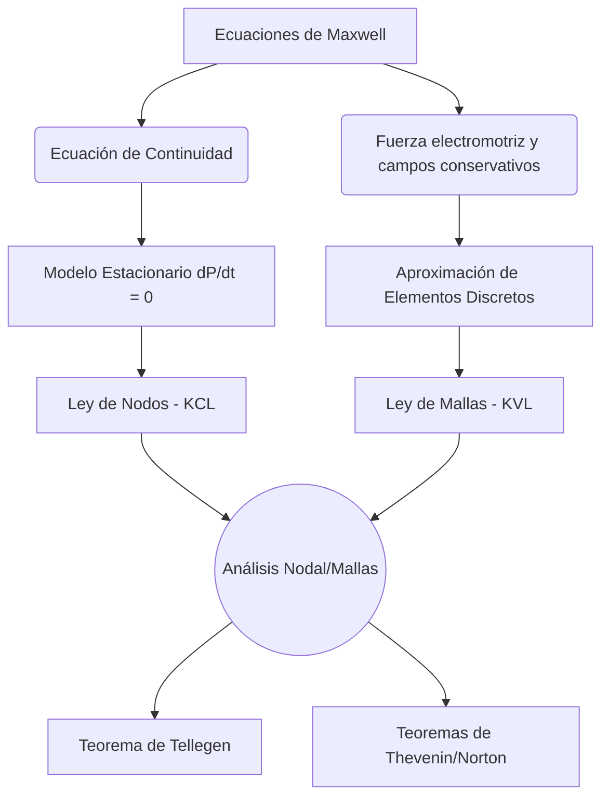

# Circuitos y Corriente

El estudio de circuitos y corriente eléctrica se ocupa del movimiento macroscópico continuo de cargas eléctricas a través de conductores y componentes pasivos o activos. Es la base tecnológica de toda la electrónica moderna.

## 📜 Contexto Histórico
A finales del siglo XVIII, Luigi Galvani descubrió la "electricidad animal" en patas de rana, lo cual inspiró a Alessandro Volta a inventar en 1800 la primera pila eléctrica (pila voltaica), proporcionando una fuente de corriente continua y estable. En 1827, el físico alemán Georg Simon Ohm publicó su famosa ley que relaciona voltaje y corriente, basándose en analogías con el flujo de calor de Fourier. En 1845, Gustav Kirchhoff generalizó el análisis de topologías de circuitos complejos al deducir sus famosas leyes (Leyes de Kirchhoff) basadas en la conservación de carga y energía. 

---

## 🧮 Desarrollo Teórico Profundo

El estudio analítico de los circuitos eléctricos requiere una inmersión profunda en la teoría de transporte de carga y la conservación de la energía en medios materiales. A diferencia del vacío, los medios conductores están repletos de portadores de carga que interactúan térmicamente con la red cristalina.

### 1. Ecuación de Continuidad y Conservación de la Carga
La piedra angular de toda la teoría de circuitos es la conservación de la carga eléctrica, expresada localmente mediante la ecuación de continuidad. Consideremos un volumen arbitrario $V$ delimitado por una superficie cerrada $S$. La tasa de disminución de la carga neta $Q$ en este volumen debe ser exactamente igual al flujo de carga que atraviesa $S$:
$$ \oint_S \vec{J} \cdot d\vec{A} = -\frac{d}{dt} \int_V \rho_e \, dV $$
Aplicando el Teorema de la Divergencia de Gauss al lado izquierdo:
$$ \int_V (\nabla \cdot \vec{J}) \, dV = \int_V \left( -\frac{\partial \rho_e}{\partial t} \right) \, dV $$
Dado que esto se cumple para cualquier volumen $V$, obtenemos la **Ecuación de Continuidad Diferencial**:
$$ \nabla \cdot \vec{J} + \frac{\partial \rho_e}{\partial t} = 0 $$
En condiciones estacionarias (corriente continua, DC), la densidad de carga no varía con el tiempo ($\partial \rho_e / \partial t = 0$), lo que implica que el campo vectorial de la densidad de corriente es solenoidal:
$$ \nabla \cdot \vec{J} = 0 $$

### 2. Modelo de Drude para la Conducción Eléctrica
El flujo de corriente macroscópico está intrínsecamente ligado al movimiento microscópico de los electrones. El modelo clásico de Drude asume un "gas de electrones" libres que sufren colisiones inelásticas con la red de iones positivos. 

La ecuación de movimiento para un electrón promedio, sometido a un campo eléctrico externo $\vec{E}$ y sujeto a una fuerza de fricción visco-elástica debida a colisiones (caracterizada por un tiempo medio entre colisiones $\tau$), es:
$$ m_e \frac{d\vec{v}_d}{dt} = -e\vec{E} - \frac{m_e \vec{v}_d}{\tau} $$
En régimen estacionario ($d\vec{v}_d/dt = 0$), la velocidad de deriva $\vec{v}_d$ alcanza un valor terminal:
$$ \vec{v}_d = -\frac{e \tau}{m_e} \vec{E} $$
La densidad de corriente está dada por $\vec{J} = -n e \vec{v}_d$, donde $n$ es la densidad numérica de electrones de conducción. Sustituyendo $\vec{v}_d$:
$$ \vec{J} = \left( \frac{n e^2 \tau}{m_e} \right) \vec{E} $$
Definimos la **conductividad eléctrica** $\sigma$ como:
$$ \sigma = \frac{n e^2 \tau}{m_e} $$
Lo cual nos lleva a la forma microscópica de la Ley de Ohm:
$$ \vec{J} = \sigma \vec{E} $$

### 3. Condiciones de Contorno en Conductores
Para resolver problemas complejos de circuitos distribuidos, debemos aplicar condiciones de contorno en las interfaces entre dos materiales de conductividades $\sigma_1$ y $\sigma_2$. 

Asumiendo que no hay acumulación de carga interfacial constante en el tiempo en estado estacionario, la componente normal de $\vec{J}$ debe ser continua:
$$ J_{1n} = J_{2n} \implies \sigma_1 E_{1n} = \sigma_2 E_{2n} $$
Dado que el campo eléctrico conservativo cumple $\oint \vec{E} \cdot d\vec{l} = 0$, la componente tangencial de $\vec{E}$ también es continua:
$$ E_{1t} = E_{2t} \implies \frac{J_{1t}}{\sigma_1} = \frac{J_{2t}}{\sigma_2} $$
Estas condiciones determinan cómo las líneas de corriente se refractan al pasar de un material a otro, un fenómeno análogo a la refracción óptica, siguiendo la ley:
$$ \frac{\tan \theta_1}{\tan \theta_2} = \frac{\sigma_1}{\sigma_2} $$

### 4. Derivación Macroscópica de Resistencia y Capacidad
Considere un material conductor acotado con terminales en potenciales $V_1$ y $V_2$. La diferencia de potencial y la corriente total están dadas por:
$$ V = V_1 - V_2 = \int_1^2 \vec{E} \cdot d\vec{l} $$
$$ I = \int_S \vec{J} \cdot d\vec{A} = \int_S (\sigma \vec{E}) \cdot d\vec{A} $$
La resistencia $R$ queda definida rigurosamente como el cociente integral:
$$ R = \frac{\int_1^2 \vec{E} \cdot d\vec{l}}{\oint_S \sigma \vec{E} \cdot d\vec{A}} $$
Existe una profunda dualidad entre conductancia ($G = 1/R$) y capacitancia ($C$). Dado que para un dieléctrico de permitividad $\varepsilon$, la carga es $Q = \oint \varepsilon \vec{E} \cdot d\vec{A}$, obtenemos la relación fundamental para la misma geometría:
$$ R C = \frac{\varepsilon}{\sigma} $$

### 5. Teoremas de Redes y Topología de Circuitos
Para redes con elementos discretos (Lumped Element Model), las leyes de conservación se reducen a grafos topológicos, originando las Leyes de Kirchhoff y múltiples teoremas de simplificación.

#### A. Formalismo de Grafos de Nodos
Sea una red con $N$ nodos y $B$ ramas. Se define la matriz de incidencia reducida $\mathbf{A}$ de tamaño $(N-1) \times B$. La Ley de Corrientes de Kirchhoff (KCL) se expresa matricialmente:
$$ \mathbf{A} \mathbf{i} = \mathbf{0} $$
donde $\mathbf{i}$ es el vector columna de corrientes de rama. La relación entre voltajes de nodo $\mathbf{v}_n$ y voltajes de rama $\mathbf{v}_b$ es:
$$ \mathbf{v}_b = \mathbf{A}^T \mathbf{v}_n $$

#### B. Teorema de Tellegen
El Teorema de Tellegen es una consecuencia puramente topológica que garantiza la conservación de la potencia en cualquier circuito que obedezca KCL y KVL, independientemente de la naturaleza lineal o no lineal de los componentes:
$$ \sum_{k=1}^B v_k i_k = \mathbf{v}_b^T \mathbf{i} = (\mathbf{A}^T \mathbf{v}_n)^T \mathbf{i} = \mathbf{v}_n^T (\mathbf{A} \mathbf{i}) = 0 $$
Esto afirma que la suma de todas las potencias absorbidas o entregadas por cada elemento de una red cerrada siempre es exactamente cero.



### 6. Trabajo y Termodinámica del Efecto Joule
El trabajo realizado por el campo eléctrico sobre un portador de carga $q$ que se mueve una distancia $d\vec{l}$ es $dW = q\vec{E} \cdot d\vec{l}$. La potencia volumétrica disipada $p$ (potencia por unidad de volumen) se obtiene sumando sobre todos los portadores:
$$ p = \frac{1}{dt \, dV} \sum q \vec{E} \cdot d\vec{l} = \vec{E} \cdot \left( \sum \frac{q \vec{v}_d}{dV} \right) = \vec{E} \cdot \vec{J} $$
Aplicando la Ley de Ohm local $\vec{J} = \sigma \vec{E}$:
$$ p = \sigma |\vec{E}|^2 = \frac{|\vec{J}|^2}{\sigma} $$
Esta energía se transfiere a los iones de la red cristalina a través de las colisiones descritas en el Modelo de Drude, incrementando la energía cinética vibracional de la red, lo que macroscópicamente se manifiesta como un aumento de temperatura (Efecto Joule).

---

## 🛠 Ejemplo Práctico
**Problema:** Un circuito RC en serie consta de una fuente de voltaje continuo $\mathcal{E}$, una resistencia $R$, y un condensador de capacitancia $C$, inicialmente descargado. El circuito se cierra mediante un interruptor en $t=0$. Encontrar la carga del condensador $q(t)$ como función del tiempo.

**Solución paso a paso:**
1. **Aplicar la Ley de Mallas de Kirchhoff:**
   Al recorrer el circuito, tenemos el aumento de la fuente, la caída en el resistor y la caída en el condensador:
   $$ \mathcal{E} - I R - \frac{q}{C} = 0 $$
2. **Expresar la corriente:** Sabemos que $I = \frac{dq}{dt}$, luego:
   $$ R \frac{dq}{dt} + \frac{q}{C} = \mathcal{E} $$
3. **Resolver la ecuación diferencial:**
   Esta es una ecuación diferencial lineal de primer orden separable:
   $$ \frac{dq}{dt} = \frac{\mathcal{E} C - q}{R C} \implies \frac{dq}{q - \mathcal{E} C} = -\frac{dt}{R C} $$
   Integrando desde $t=0$ (con $q(0)=0$) hasta $t$:
   $$ \ln \left( \frac{q(t) - \mathcal{E} C}{-\mathcal{E} C} \right) = -\frac{t}{R C} $$
4. **Despejar $q(t)$:**
   $$ q(t) - \mathcal{E} C = -\mathcal{E} C e^{-t/(RC)} $$
   $$ q(t) = C \mathcal{E} \left( 1 - e^{-t/\tau} \right) $$
   Donde $\tau = R C$ es la constante de tiempo del circuito. La carga crece asintóticamente hasta el valor máximo $Q_{\max} = C \mathcal{E}$.

---

## 📝 Guía de Ejercicios Resueltos

**Problema 1: Modelo de conducción de Drude en estado transitorio**
Un bloque metálico sin campo eléctrico interno es expuesto abruptamente en $t=0$ a un campo eléctrico uniforme $\vec{E}_0$ estático. Demuestre a través de la ecuación diferencial de Drude cómo la corriente eléctrica evoluciona transitoriamente antes de alcanzar la Ley de Ohm estacionaria.
**Solución paso a paso:**
1. La ecuación fundamental de movimiento para un electrón promedio en el modelo de Drude, incluyendo el arrastre de colisiones, es:
   $m_e \frac{d\vec{v}_d}{dt} = -e\vec{E}_0 - \frac{m_e}{\tau}\vec{v}_d$.
2. Esto es una ecuación diferencial ordinaria lineal de primer orden para $\vec{v}_d(t)$. Podemos reordenarla:
   $\frac{d\vec{v}_d}{dt} + \frac{1}{\tau}\vec{v}_d = -\frac{e}{m_e}\vec{E}_0$.
3. La solución a la EDO homogénea es $\vec{v}_{h}(t) = \vec{A} e^{-t/\tau}$.
4. Una solución particular para el término constante es $\vec{v}_{p} = -\frac{e\tau}{m_e}\vec{E}_0$.
5. La solución general es $\vec{v}_d(t) = \vec{A} e^{-t/\tau} - \frac{e\tau}{m_e}\vec{E}_0$.
6. Usamos la condición inicial en $t=0$, donde la deriva era nula $\vec{v}_d(0) = \vec{0}$:
   $\vec{0} = \vec{A} - \frac{e\tau}{m_e}\vec{E}_0 \implies \vec{A} = \frac{e\tau}{m_e}\vec{E}_0$.
7. Sustituyendo de vuelta:
   $\vec{v}_d(t) = -\frac{e\tau}{m_e}\vec{E}_0 \left( 1 - e^{-t/\tau} \right)$.
8. La densidad de corriente está dada por $\vec{J}(t) = -n e \vec{v}_d(t)$:
   $\vec{J}(t) = \left( \frac{n e^2 \tau}{m_e} \right) \vec{E}_0 \left( 1 - e^{-t/\tau} \right) = \sigma_0 \vec{E}_0 \left( 1 - e^{-t/\tau} \right)$.
9. El estado estacionario ohmico $\vec{J} = \sigma_0 \vec{E}_0$ se alcanza asintóticamente tras unos pocos tiempos de relajación $\tau$ (típicamente femtosegundos para metales).

**Problema 2: Puente de Wheatstone no equilibrado por análisis matricial de Nodos**
Considere un puente de Wheatstone con resistencias $R_1, R_2$ (brazo izquierdo) y $R_3, R_4$ (brazo derecho) formando el rombo, y un galvanómetro de resistencia interna $R_g$ conectado transversalmente entre los brazos. El circuito es alimentado por una fuente $V_s$. Determine rigurosamente la caída de voltaje en el galvanómetro planteando la matriz de conductancias.
**Solución paso a paso:**
1. Definimos el nodo inferior como tierra ($V_0 = 0V$). El nodo superior está conectado al potencial $V_s$.
2. Quedan dos nodos intermedios de incógnita:
   $V_A$: Nodo entre $R_1$ (superior) y $R_2$ (inferior).
   $V_B$: Nodo entre $R_3$ (superior) y $R_4$ (inferior).
   El galvanómetro $R_g$ une $V_A$ y $V_B$.
3. Planteamos la Ley de Corrientes de Kirchhoff (KCL) en el nodo $A$:
   $\frac{V_A - V_s}{R_1} + \frac{V_A - 0}{R_2} + \frac{V_A - V_B}{R_g} = 0$.
4. Planteamos KCL en el nodo $B$:
   $\frac{V_B - V_s}{R_3} + \frac{V_B - 0}{R_4} + \frac{V_B - V_A}{R_g} = 0$.
5. Reagrupamos términos en conductancias $G_i = 1/R_i$:
   $V_A (G_1 + G_2 + G_g) - V_B G_g = V_s G_1$.
   $-V_A G_g + V_B (G_3 + G_4 + G_g) = V_s G_3$.
6. Esto es un sistema lineal $2 \times 2$:
   $\begin{pmatrix} G_1+G_2+G_g & -G_g \\ -G_g & G_3+G_4+G_g \end{pmatrix} \begin{pmatrix} V_A \\ V_B \end{pmatrix} = \begin{pmatrix} V_s G_1 \\ V_s G_3 \end{pmatrix}$.
7. Para encontrar la diferencia $\Delta V = V_A - V_B$, usamos la regla de Cramer para hallar $V_A$ y $V_B$:
   $\Delta = (G_1+G_2+G_g)(G_3+G_4+G_g) - G_g^2$.
8. $V_A = \frac{V_s G_1(G_3+G_4+G_g) + V_s G_3 G_g}{\Delta}$.
   $V_B = \frac{V_s G_3(G_1+G_2+G_g) + V_s G_1 G_g}{\Delta}$.
9. Restando directamente:
   $\Delta V = \frac{V_s [ G_1 G_3 + G_1 G_4 + G_1 G_g + G_3 G_g - G_3 G_1 - G_3 G_2 - G_3 G_g - G_1 G_g ]}{\Delta} = \frac{V_s (G_1 G_4 - G_2 G_3)}{\Delta}$.
10. La corriente en el galvanómetro es nula (puente equilibrado) si y sólo si $G_1 G_4 - G_2 G_3 = 0 \implies \frac{1}{R_1 R_4} = \frac{1}{R_2 R_3} \implies \frac{R_1}{R_2} = \frac{R_3}{R_4}$.

**Problema 3: Red resistiva infinita plana cuadrada**
Se tiene una malla infinita de resistencias idénticas $R$ dispuestas en forma de retícula cuadrada 2D (cada nodo conecta con 4 vecinos). Determine la resistencia equivalente entre dos nodos adyacentes usando el principio de superposición.
**Solución paso a paso:**
1. Imagine que inyectamos una corriente continua $I_0$ en un solo nodo $A$ y la extraemos por una frontera en el infinito.
2. Por pura simetría radial isotrópica geométrica de la red cuadrada infinita, la corriente inyectada se divide equitativamente entre las 4 ramas conectadas al nodo $A$. La corriente en la rama $A \to B$ es $i_1 = \frac{I_0}{4}$.
3. Ahora considere el caso opuesto: inyectamos $I_0$ en el infinito y la extraemos por el nodo adyacente $B$. De nuevo por simetría, la corriente de convergencia que llega por cada rama hacia $B$ es igual. La corriente en la rama $A \to B$ para este subproblema es $i_2 = \frac{I_0}{4}$.
4. Como los circuitos de resistencias son sistemas lineales pasivos, podemos aplicar el **Principio de Superposición**. Superponemos los dos escenarios: inyectar en $A$ y extraer simultáneamente en $B$.
5. La corriente neta que atraviesa directamente la rama que conecta $A$ y $B$ (resistencia $R$) es la suma directa:
   $i_{AB} = i_1 + i_2 = \frac{I_0}{4} + \frac{I_0}{4} = \frac{I_0}{2}$.
6. La caída de voltaje estricta a través de esa rama central es por la Ley de Ohm de un solo componente:
   $V_{AB} = i_{AB} R = \left(\frac{I_0}{2}\right) R$.
7. Macroscópicamente, la definición de resistencia equivalente (medida desde los terminales $A$ y $B$) está dada por $R_{eq} = \frac{V_{AB}}{I_0}$.
8. Sustituimos $V_{AB}$:
   $R_{eq} = \frac{(I_0/2) R}{I_0} = \mathbf{\frac{R}{2}}$. 

## 💻 Simulaciones Computacionales

Análisis de la respuesta transitoria de un circuito RLC en serie alimentado por un pulso de voltaje escalón. Se utiliza una Ecuación Diferencial de segundo orden.

```python
import numpy as np
import matplotlib.pyplot as plt
from scipy.integrate import solve_ivp

# Parámetros del circuito
R = 2.0     # Ohms
L = 1.0     # Henrys
C = 0.1     # Farads
V0 = 5.0    # Voltaje del escalón

def rlc_circuit(t, state):
    # state = [Carga q, Corriente i]
    q, i = state
    # L(di/dt) + Ri + q/C = V(t)
    di_dt = (V0 - R*i - q/C) / L
    return [i, di_dt]

t_span = (0, 10)
t_eval = np.linspace(*t_span, 500)
sol = solve_ivp(rlc_circuit, t_span, [0, 0], t_eval=t_eval)

q = sol.y[0]
i = sol.y[1]
v_c = q / C

plt.figure(figsize=(10, 5))
plt.plot(sol.t, v_c, label='Voltaje en Capacitor $V_c(t)$', color='blue')
plt.plot(sol.t, i, label='Corriente $I(t)$', color='red')
plt.title('Respuesta Transitoria de un Circuito RLC subamortiguado')
plt.xlabel('Tiempo (s)')
plt.ylabel('Amplitud')
plt.axhline(V0, color='gray', linestyle='--', label='Voltaje Fuente')
plt.legend()
plt.grid(True)
plt.show()
```

## 🚀 Fronteras de Investigación y Problemas Abiertos

En 2026, la microelectrónica ha alcanzado sus límites cuánticos, haciendo que la teoría de circuitos clásica deba transformarse hacia la **electrónica cuántica topológica** y el uso de materiales de Dirac. Adicionalmente, el modelado preciso del **transporte balístico de electrones** en nanohilos, interconexiones fotónicas integradas en chip y arquitecturas neuromórficas tridimensionales analógicas representan los retos de investigación abierta más candentes para la supercomputación del futuro.

## 📐 Formalismo Matemático Avanzado (Nivel Posgrado/Doctorado)

A un nivel axiomático avanzado, la teoría de circuitos clásica es una manifestación discreta de la **Topología Algebraica**, en particular de la Homología de Complejos Simpliciales, operando sobre grafos dirigidos $G = (V, E)$.

Las Leyes de Kirchhoff no son más que afirmaciones sobre los operadores de borde topológicos. Sea $C_0$ el grupo de cadenas de nodos, $C_1$ el grupo de ramas y $C_2$ las mallas superficiales. El operador de borde $\partial_1: C_1 \to C_0$ mapea corrientes de rama $I$ a corrientes nodales, y su matriz asociada es la Matriz de Incidencia Reducida $A$. La **LCA de Kirchhoff** es puramente la afirmación topológica de que la corriente es un flujo divergencia nula:

$$ \partial_1 I = 0 \implies I \in \text{Ker}(\partial_1) = H_1(G) $$

Donde $H_1(G)$ es el primer grupo de homología (el espacio de lazos del grafo). Simultáneamente, la **LCV de Kirchhoff** estipula que las diferencias de potencial de los nodos $v \in C_0$ inducen voltajes de rama $V \in C_1$ a través del operador coborde (gradiente en el grafo) $\partial_1^*$:

$$ V = \partial_1^* v \implies V \in \text{Im}(\partial_1^*) $$

Dado que el núcleo y la imagen son ortogonales, $\langle V, I \rangle = \langle \partial_1^* v, I \rangle = \langle v, \partial_1 I \rangle = 0$. Esta es una prueba topológica irrefutable del **Teorema de Tellegen**, que garantiza la conservación estricta de la potencia en cualquier red, independientemente de si sus componentes son lineales, no lineales, activos o pasivos.

## 📚 Recursos Específicos de Circuitos y Corriente

### 🎓 Cursos y Clases Recomendadas
2. [PhET - Circuit Construction Kit: AC](https://phet.colorado.edu/en/simulations/circuit-construction-kit-ac): Ideal para ver cómo se comportan capacitores e inductores frente a estímulos alternos.
3. [Falstad Circuit Simulator](http://www.falstad.com/circuit/): Un emulador de topologías de circuitos en el navegador web altamente avanzado, visual, interactivo y en tiempo real.
4. [Wikipedia: Ley de Ohm](https://es.wikipedia.org/wiki/Ley_de_Ohm): Recorrido detallado de la base conceptual que rige a la conducción eléctrica en materiales.
5. [Wikipedia: Leyes de Kirchhoff](https://es.wikipedia.org/wiki/Leyes_de_Kirchhoff): Detalles formales y métodos sistemáticos de nodos y mallas, fundamentales en el diseño eléctrico.
6. [All About Circuits - Textbook](https://www.allaboutcircuits.com/textbook/): Interfaz moderna con lecciones gratuitas sobre componentes, hojas de datos y aplicaciones analógicas.
7. [Electronics Tutorials - DC Circuits](https://www.electronics-tutorials.ws/dccircuits/dcp_1.html): Artículos, guías y tutoriales bien escritos para aprender a reducir redes y utilizar puentes Wheatstone.
8. [LibreTexts - Electric Current and Circuits](https://phys.libretexts.org/Bookshelves/University_Physics/Book%3A_University_Physics_(OpenStax)/Map%3A_University_Physics_II_-_Thermodynamics_Electricity_and_Magnetism_(OpenStax)/10%3A_Direct-Current_Circuits): Colección enorme y libre de conceptos sobre conducción, resistencia equivalente e instrumentos de medición.

### 📖 Referencias Útiles y Bibliografía
1. [Introduction to Electrodynamics - David J. Griffiths](https://www.cambridge.org/highereducation/books/introduction-to-electrodynamics/971275E590D0DE07E9CD0DB4F2C2FA04): El texto de referencia por excelencia (estándar de oro) para estudiantes de pregrado en física, claro y didáctico.
2. [Classical Electrodynamics - John David Jackson](https://www.wiley.com/en-us/Classical+Electrodynamics%2C+3rd+Edition-p-9780471309321): Obra matemática y avanzada requerida en todos los posgrados y doctorados del mundo físico.
3. [Electricity and Magnetism - Edward M. Purcell & David J. Morin](https://www.cambridge.org/highereducation/books/electricity-and-magnetism/C16C976ADCD2F4A96DD8DD3DDAB303CE): Magnífico abordaje donde el magnetismo emerge naturalmente como consecuencia de la relatividad especial.
4. [Física Universitaria (Vol. 2) - Sears y Zemansky](https://www.pearson.com/store/p/fisica-universitaria-vol-2/P200000000305/9786073244404): Libro fundamental de primer año que incluye un tratamiento fenomenológico completo de los circuitos.
5. [Fundamentos de Circuitos Eléctricos - Sadiku](https://www.mheducation.com/highered/product/fundamentals-electric-circuits-alexander-sadiku/M9781260226409.html): Un referente internacional fundamental que cubre cada teorema importante desde cero con problemas prácticos.
