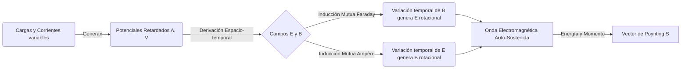

# Ecuaciones de Maxwell y Ondas Electromagnéticas

Las Ecuaciones de Maxwell representan la obra magna del electromagnetismo clásico, unificando la electricidad, el magnetismo y la óptica en un marco teórico elegante y autoconsistente. Son el equivalente en electromagnetismo a las Leyes de Newton en mecánica clásica.

## 📜 Contexto Histórico
A mediados del siglo XIX, las leyes de Gauss, Ampère y Faraday existían como principios empíricos desconectados o parcialmente incompatibles. James Clerk Maxwell, inspirado en las intuiciones visuales de Faraday sobre las "líneas de fuerza", desarrolló un modelo matemático unificado en la década de 1860. Maxwell descubrió una inconsistencia en la Ley de Ampère al aplicarla a condensadores, y añadió la "corriente de desplazamiento". Esto no solo salvó la conservación de la carga, sino que predijo la existencia de ondas electromagnéticas que viajaban a la velocidad de la luz. En 1887, Heinrich Hertz demostró experimentalmente la existencia de estas ondas. Oliver Heaviside fue quien reformuló matemáticamente las 20 ecuaciones de Maxwell originales en la notación vectorial (gradiente, divergencia, rotacional) que usamos hoy.

---

## 🧮 Desarrollo Teórico Profundo

El tratamiento riguroso de las Ecuaciones de Maxwell requiere el uso del cálculo tensorial y análisis vectorial avanzado. En esta sección derivaremos no solo las ecuaciones fundamentales, sino también las leyes de conservación de energía y momento asociadas.

### 1. Las Ecuaciones Diferenciales y sus Potenciales
Las cuatro ecuaciones de Maxwell acopladas en un medio con densidad de carga $\rho$ y densidad de corriente $\vec{J}$ son:

1. **Ley de Gauss:** $\nabla \cdot \vec{E} = \frac{\rho}{\varepsilon_0}$
2. **Ley de Gauss Magnética:** $\nabla \cdot \vec{B} = 0$
3. **Ley de Faraday:** $\nabla \times \vec{E} + \frac{\partial \vec{B}}{\partial t} = 0$
4. **Ley de Ampère-Maxwell:** $\nabla \times \vec{B} - \mu_0 \varepsilon_0 \frac{\partial \vec{E}}{\partial t} = \mu_0 \vec{J}$

La ley (2) garantiza que $\vec{B}$ puede expresarse como el rotacional de un potencial vector magnético $\vec{A}$:
$$ \vec{B} = \nabla \times \vec{A} $$
Sustituyendo esto en (3):
$$ \nabla \times \left( \vec{E} + \frac{\partial \vec{A}}{\partial t} \right) = 0 $$
Dado que el rotacional es nulo, el término entre paréntesis debe ser el gradiente de un potencial escalar $-V$:
$$ \vec{E} = -\nabla V - \frac{\partial \vec{A}}{\partial t} $$

Sustituyendo estos potenciales en (1) y (4), obtenemos un par de ecuaciones acopladas de segundo orden. Podemos desacoplarlas imponiendo un *Gauge* o calibre. En el **Gauge de Lorenz** ($\nabla \cdot \vec{A} + \mu_0 \varepsilon_0 \frac{\partial V}{\partial t} = 0$), las ecuaciones se simplifican a ecuaciones de onda no homogéneas (ecuaciones de d'Alembert):
$$ \Box^2 V = \nabla^2 V - \frac{1}{c^2} \frac{\partial^2 V}{\partial t^2} = -\frac{\rho}{\varepsilon_0} $$
$$ \Box^2 \vec{A} = \nabla^2 \vec{A} - \frac{1}{c^2} \frac{\partial^2 \vec{A}}{\partial t^2} = -\mu_0 \vec{J} $$
donde $c = 1/\sqrt{\mu_0 \varepsilon_0}$. Sus soluciones son los potenciales retardados, demostrando que los cambios en las fuentes se propagan a la velocidad $c$.

### 2. Teorema de Poynting y Conservación de Energía
Para derivar el balance energético, partimos de la fuerza de Lorentz ejercida sobre portadores en un volumen $V$:
$$ \frac{dW_{mec}}{dt} = \int_V \vec{J} \cdot \vec{E} \, dV $$
Utilizando la Ley de Ampère-Maxwell para despejar $\vec{J}$:
$$ \vec{J} = \frac{1}{\mu_0} \nabla \times \vec{B} - \varepsilon_0 \frac{\partial \vec{E}}{\partial t} $$
Por lo tanto:
$$ \vec{J} \cdot \vec{E} = \frac{1}{\mu_0} \vec{E} \cdot (\nabla \times \vec{B}) - \varepsilon_0 \vec{E} \cdot \frac{\partial \vec{E}}{\partial t} $$
Aplicando la identidad vectorial $\nabla \cdot (\vec{E} \times \vec{B}) = \vec{B} \cdot (\nabla \times \vec{E}) - \vec{E} \cdot (\nabla \times \vec{B})$ y la Ley de Faraday ($\nabla \times \vec{E} = -\frac{\partial \vec{B}}{\partial t}$), tenemos:
$$ \vec{J} \cdot \vec{E} = -\nabla \cdot \left( \frac{\vec{E} \times \vec{B}}{\mu_0} \right) - \left[ \varepsilon_0 \vec{E} \cdot \frac{\partial \vec{E}}{\partial t} + \frac{1}{\mu_0} \vec{B} \cdot \frac{\partial \vec{B}}{\partial t} \right] $$
Esto se puede reescribir como la **Ecuación del Teorema de Poynting**:
$$ \frac{\partial u}{\partial t} + \nabla \cdot \vec{S} = -\vec{J} \cdot \vec{E} $$
donde $\vec{S} = \frac{1}{\mu_0} (\vec{E} \times \vec{B})$ es el vector de Poynting (flujo de energía electromagnética por unidad de área), y $u = \frac{1}{2} \left( \varepsilon_0 |\vec{E}|^2 + \frac{1}{\mu_0} |\vec{B}|^2 \right)$ es la densidad de energía electromagnética.

### 3. Propagación en Medios Materiales y Condiciones de Frontera
Cuando la luz o cualquier campo electromagnético atraviesa materia macroscópica polarizable y magnetizable, introducimos los vectores Desplazamiento Eléctrico $\vec{D}$ y Campo Magnético Auxiliar $\vec{H}$:
$$ \vec{D} = \varepsilon_0 \vec{E} + \vec{P} \quad , \quad \vec{H} = \frac{\vec{B}}{\mu_0} - \vec{M} $$
Las ecuaciones de Maxwell en medios materiales se convierten en:
1. $\nabla \cdot \vec{D} = \rho_f$
2. $\nabla \cdot \vec{B} = 0$
3. $\nabla \times \vec{E} = -\frac{\partial \vec{B}}{\partial t}$
4. $\nabla \times \vec{H} = \vec{J}_f + \frac{\partial \vec{D}}{\partial t}$
donde el subíndice $f$ denota "cargas/corrientes libres". En una interfaz bidimensional libre de cargas o corrientes superficiales, esto resulta en las siguientes condiciones de contorno que rigen la reflexión y refracción ópticas (Ecuaciones de Fresnel):
- $D_{1n} - D_{2n} = \sigma_f$
- $B_{1n} - B_{2n} = 0$
- $\vec{E}_{1t} - \vec{E}_{2t} = 0$
- $\vec{H}_{1t} - \vec{H}_{2t} = \vec{K}_f \times \hat{n}$



### 4. Tensor Electromagnético y Covariancia Relativista
La unificación definitiva del electromagnetismo se logra a través de la Relatividad Especial. Los campos eléctricos y magnéticos no son entes separados, sino componentes de un único tensor asimétrico de rango 2, el tensor de Faraday $F^{\mu\nu}$:
$$ F^{\mu\nu} = \partial^\mu A^\nu - \partial^\nu A^\mu = \begin{pmatrix} 0 & -E_x/c & -E_y/c & -E_z/c \\ E_x/c & 0 & -B_z & B_y \\ E_y/c & B_z & 0 & -B_x \\ E_z/c & -B_y & B_x & 0 \end{pmatrix} $$
donde $A^\mu = (V/c, \vec{A})$ es el cuadripotencial.
Las cuatro ecuaciones de Maxwell se reducen gloriosamente a tan solo dos ecuaciones covariantes tensoriales:
1. Ecuaciones inhomogéneas (Gauss y Ampère-Maxwell):
   $$ \partial_\mu F^{\mu\nu} = \mu_0 J^\nu $$
   donde $J^\nu = (c\rho, \vec{J})$ es la cuadricorriente.
2. Ecuaciones homogéneas (Gauss Magnética y Faraday), representadas por la identidad de Bianchi:
   $$ \partial_\lambda F_{\mu\nu} + \partial_\mu F_{\nu\lambda} + \partial_\nu F_{\lambda\mu} = 0 $$
   o alternativamente, usando el tensor dual $\tilde{F}^{\mu\nu} = \frac{1}{2}\epsilon^{\mu\nu\alpha\beta} F_{\alpha\beta}$:
   $$ \partial_\mu \tilde{F}^{\mu\nu} = 0 $$

---

## 🛠 Ejemplo Práctico
**Problema:** Una onda electromagnética plana viaja en el vacío en la dirección $+z$. Si el campo eléctrico está dado por $\vec{E}(z,t) = E_0 \cos(kz - \omega t) \hat{i}$, deducir el vector campo magnético $\vec{B}(z,t)$.

**Solución paso a paso:**
1. **Usar la Ley de Faraday en el vacío:** $\nabla \times \vec{E} = -\frac{\partial \vec{B}}{\partial t}$
2. **Calcular el rotacional de $\vec{E}$:**
   Como $\vec{E}$ solo tiene componente $x$ y solo depende de $z$ y $t$:
   $$ \nabla \times \vec{E} = \left| \begin{matrix} \hat{i} & \hat{j} & \hat{k} \\ \frac{\partial}{\partial x} & \frac{\partial}{\partial y} & \frac{\partial}{\partial z} \\ E_x & 0 & 0 \end{matrix} \right| = \frac{\partial E_x}{\partial z} \hat{j} $$
   Derivando $E_x(z,t) = E_0 \cos(kz - \omega t)$ respecto a $z$:
   $$ \frac{\partial E_x}{\partial z} = -k E_0 \sin(kz - \omega t) $$
   Por tanto, $\nabla \times \vec{E} = -k E_0 \sin(kz - \omega t) \hat{j}$.
3. **Igualar y resolver para $\vec{B}$:**
   $$ -\frac{\partial \vec{B}}{\partial t} = -k E_0 \sin(kz - \omega t) \hat{j} \implies \frac{\partial \vec{B}}{\partial t} = k E_0 \sin(kz - \omega t) \hat{j} $$
   Integrando con respecto al tiempo:
   $$ \vec{B}(z,t) = \int k E_0 \sin(kz - \omega t) dt \, \hat{j} = \frac{k}{\omega} E_0 \cos(kz - \omega t) \hat{j} $$
4. **Relación entre $E_0$ y $B_0$:**
   Sabiendo que $c = \frac{\omega}{k}$, el campo magnético resulta:
   $$ \vec{B}(z,t) = \frac{E_0}{c} \cos(kz - \omega t) \hat{j} $$
   Note que $\vec{E}$ y $\vec{B}$ oscilan en fase y son ortogonales entre sí y ortogonales a la dirección de propagación.

---

## 📝 Guía de Ejercicios Resueltos

**Problema 1: Paradoja de Ampère-Maxwell en carga de condensador de placas circulares**
Un condensador de placas paralelas circulares de radio $R$ y separación $d$ está siendo cargado por una corriente constante $I(t) = I_0$. Considere un bucle amperiano circular de radio $r < R$ paralelo a las placas y ubicado en medio del condensador. Demuestre que calcular el campo magnético usando la corriente de desplazamiento produce exactamente el mismo resultado que calcularlo construyendo una superficie esférica curva enorme que atraviese los alambres externos, salvaguardando la invarianza topológica.
**Solución paso a paso:**
1. **Método 1: Superficie plana entre las placas (Corriente de Desplazamiento)**
   La superficie plana enmarcada por el bucle no intercepta ninguna corriente de conducción ($I_{enc} = 0$). Solo actúa el término de Maxwell $\mu_0 \varepsilon_0 \frac{d\Phi_E}{dt}$.
   Asumiendo campo eléctrico uniforme $E = \frac{\sigma}{\varepsilon_0} = \frac{Q}{\pi R^2 \varepsilon_0}$ entre las placas.
   El flujo eléctrico encerrado es $\Phi_E = E (\pi r^2) = \frac{Q r^2}{\varepsilon_0 R^2}$.
   Su derivada es $\frac{d\Phi_E}{dt} = \frac{r^2}{\varepsilon_0 R^2} \frac{dQ}{dt} = \frac{r^2}{\varepsilon_0 R^2} I_0$.
   La Ley de Ampère-Maxwell: $\oint \vec{B} \cdot d\vec{l} = \mu_0 \varepsilon_0 \left( \frac{r^2}{\varepsilon_0 R^2} I_0 \right) \implies B (2\pi r) = \mu_0 I_0 \frac{r^2}{R^2}$.
   $B = \frac{\mu_0 I_0 r}{2\pi R^2}$.
2. **Método 2: Superficie en forma de globo (Corriente de Conducción)**
   Definimos topológicamente la superficie delimitada por el mismo bucle $r$, pero la deformamos curvándola como un globo (superficie de bolsa) hasta que el hilo de cobre externo la perfore.
   Ahora $I_{enc} = I_0$. ¡Pero el campo magnético no ha cambiado porque la frontera (el bucle) es la misma!
   ¿Por qué cuadra? Porque la corriente de desplazamiento saliendo por los flancos de la "bolsa" dentro del dieléctrico compensa matemáticamente la corriente de conducción entrante.
   Analíticamente: Corriente de desplazamiento a través de la bolsa parabólica fuera del cilindro de radio $r$. El flujo eléctrico exterior en la bolsa (de $r$ a $R$) es negativo (atraviesa al revés la Normal externa del recinto).
   $\Phi_{E,\text{extra}} = E \pi (R^2 - r^2)$.
   $I_{disp,\text{extra}} = \varepsilon_0 \frac{d\Phi}{dt} = I_0 \left(1 - \frac{r^2}{R^2}\right)$.
   La corriente *neta* perforando la bolsa hacia adelante es: $I_{neta} = I_0 (\text{conduccion}) - I_{disp,\text{extra}} = I_0 - I_0(1 - \frac{r^2}{R^2}) = I_0 \frac{r^2}{R^2}$.
   Evaluando en Ampère: $\oint \vec{B} \cdot d\vec{l} = \mu_0 \left(I_0 \frac{r^2}{R^2}\right) \implies B = \frac{\mu_0 I_0 r}{2\pi R^2}$.
3. Ambas superficies dan idéntico resultado matemático, demostrando la genial consistencia de Maxwell ante deformaciones topológicas homólogas.

**Problema 2: Reflexión y transmisión con incidencia normal (Ecuaciones de Fresnel)**
Una onda electromagnética plana en el vacío ($n_1=1$) incide normalmente perpendicularmente sobre un medio dieléctrico transparente infinito de índice de refracción $n_2$. Plantee las condiciones de contorno electrodinámicas para deducir el coeficiente de reflexión de potencia $R$.
**Solución paso a paso:**
1. Definimos los campos. Onda incidente (viaja en $+z$): $\vec{E}_I = E_{I0} e^{i(k_1 z - \omega t)} \hat{x}$, $\vec{B}_I = \frac{1}{v_1} E_{I0} e^{i(k_1 z - \omega t)} \hat{y}$. ($v_1 = c$).
2. Onda reflejada (viaja en $-z$): $\vec{E}_R = E_{R0} e^{i(-k_1 z - \omega t)} \hat{x}$, $\vec{B}_R = -\frac{1}{v_1} E_{R0} e^{i(-k_1 z - \omega t)} \hat{y}$. (Ojo al signo negativo en $\vec{B}_R$ por el producto $\vec{k} \times \vec{E}$).
3. Onda transmitida (viaja en $+z$): $\vec{E}_T = E_{T0} e^{i(k_2 z - \omega t)} \hat{x}$, $\vec{B}_T = \frac{1}{v_2} E_{T0} e^{i(k_2 z - \omega t)} \hat{y}$. ($v_2 = c/n_2$).
4. Las condiciones de frontera en $z=0$ (sin cargas ni corrientes libres en la interfaz dieléctrica):
   I. Continuidad de $E_{tangencial}$: $E_I + E_R = E_T$.
   II. Continuidad de $H_{tangencial} = \frac{B_{tangencial}}{\mu}$: Asumiendo dieléctricos no magnéticos ($\mu_1 \approx \mu_2 \approx \mu_0$), tenemos continuidad de $B_{tangencial}$: $B_I + B_R = B_T$.
5. Sustituimos las magnitudes de campo magnético por las eléctricas:
   $\frac{1}{v_1} E_{I0} - \frac{1}{v_1} E_{R0} = \frac{1}{v_2} E_{T0} \implies E_{I0} - E_{R0} = \frac{v_1}{v_2} E_{T0}$.
6. Sabemos por óptica que $v = c/n$, así que $\frac{v_1}{v_2} = \frac{c/n_1}{c/n_2} = \frac{n_2}{n_1}$. Sea $\beta = \frac{n_2}{n_1} = n_2$ (ya que $n_1=1$).
   $E_{I0} - E_{R0} = n_2 E_{T0}$.
7. Tenemos un sistema: $E_{I0} + E_{R0} = E_{T0}$ y $E_{I0} - E_{R0} = n_2 E_{T0}$.
8. Sustituyendo $E_{T0}$ en la segunda:
   $E_{I0} - E_{R0} = n_2 (E_{I0} + E_{R0}) \implies E_{I0}(1 - n_2) = E_{R0}(1 + n_2)$.
9. El coeficiente de amplitud reflejada es $r = \frac{E_{R0}}{E_{I0}} = \frac{1 - n_2}{1 + n_2}$.
10. La reflectancia (potencia) relaciona vectores de Poynting, dependientes de amplitud al cuadrado: $R = |r|^2 = \left( \frac{n_1 - n_2}{n_1 + n_2} \right)^2$. Para luz de aire a vidrio de $n_2=1.5$, esto resulta en $\sim 4\%$.

**Problema 3: Momento electromagnético y presión de radiación láser**
Un láser industrial emite un haz cilíndrico de potencia media $P = 5\text{ kW}$. El rayo incide ortogonalmente sobre un bloque perfecto absorbente (cuerpo negro). Calcule la magnitud de la fuerza ejercida por la presión de radiación de la luz (momentum fields) sobre el objeto.
**Solución paso a paso:**
1. A nivel macroscópico continuo, el vector de Poynting promedio relaciona el flujo de energía direccional: $\langle S \rangle = \frac{P}{A}$, donde $A$ es la sección del haz.
2. La densidad de momento electromagnético $\vec{g}_{em}$ almacenado en los campos está dada universalmente por: $\vec{g}_{em} = \frac{1}{c^2} \vec{S}$.
3. Al incidir a velocidad $c$ contra el bloque, la cantidad de momento que transfiere el volumen luminoso cada segundo (y por unidad de área) es la presión de radiación $P_{rad}$.
   Flujo de momento incidente $P_{rad} = c \langle g_{em} \rangle = c \left( \frac{1}{c^2} \langle S \rangle \right) = \frac{\langle S \rangle}{c}$.
4. Como la superficie es $100\%$ absorbente, el haz se detiene por completo cediendo todo su momento. (Si fuera reflejante perfecta, sería el doble debido al rebote elástico fotónico).
5. La fuerza neta ejercida $F_{rad}$ es el producto de la presión por el Área transversal:
   $F_{rad} = P_{rad} \cdot A = \left(\frac{\langle S \rangle}{c}\right) A = \frac{P/A}{c} A = \frac{P}{c}$.
6. Evaluando con números:
   $F_{rad} = \frac{5000 \text{ J/s}}{3 \times 10^8 \text{ m/s}} = 1.67 \times 10^{-5} \text{ Newtons}$.
7. Esta microscópica pero firme e inexorable fuerza de radiación es el motor teórico tras los diseños de las velas solares interplanetarias (IKAROS).

## 💻 Simulaciones Computacionales

Simulación de propagación de una Onda Electromagnética unidimensional (1D) en el vacío mediante el método FDTD (Diferencias Finitas en el Dominio del Tiempo) resolviendo las ecuaciones rotacionales acopladas.

```python
import numpy as np
import matplotlib.pyplot as plt

# Parámetros de simulación FDTD 1D
nz = 200        # Nodos espaciales
c = 1.0         # Velocidad de la luz normalizada
dt = 0.5        # Paso temporal (Courant condition = 0.5)
dz = 1.0        # Paso espacial

E = np.zeros(nz)
B = np.zeros(nz)

history_E = []

# Bucle en el tiempo
for t in range(300):
    # Actualizar B (Faraday)
    for k in range(nz - 1):
        B[k] = B[k] + (dt / dz) * (E[k + 1] - E[k])
        
    # Actualizar E (Ampère-Maxwell)
    for k in range(1, nz):
        E[k] = E[k] + (dt / dz) * (B[k] - B[k - 1])
        
    # Inyectar una perturbación gaussiana en el centro
    E[nz // 2] += np.exp(-0.5 * ((t - 30) / 8.0)**2)
    
    if t % 3 == 0:
        history_E.append(E.copy())

# Graficar un instante de tiempo
plt.figure(figsize=(8, 4))
plt.plot(history_E[-20], color='purple')
plt.title('Propagación de Pulso Electromagnético (FDTD)')
plt.xlabel('Eje Z (Espacio)')
plt.ylabel('Campo Eléctrico $E_x$')
plt.grid(True)
plt.show()
```

## 🚀 Fronteras de Investigación y Problemas Abiertos

Las Ecuaciones de Maxwell continúan inspirando descubrimientos en 2026, particularmente en el área de la **fotónica topológica** (donde la luz se propaga de forma robusta e unidireccional evadiendo la retrodispersión) y los **metamateriales espacio-temporales**. En estos metamateriales activos, los parámetros $\epsilon$ y $\mu$ son modulados rápidamente en el tiempo, rompiendo la reciprocidad temporal e induciendo fenómenos fascinantes como la amplificación paramétrica de campos magnéticos e índices de refracción negativos dinámicos.

## 📐 Formalismo Matemático Avanzado (Nivel Posgrado/Doctorado)

Las ecuaciones de Maxwell adquieren una forma supremamente elegante e invariante al expresarse mediante las **Formas Diferenciales (Cálculo Exterior de Cartan)** sobre una variedad espaciotemporal tetradimensional.

Definiendo el cuadripotencial como una 1-forma $A = A_\mu dx^\mu$, el tensor de campo electromagnético es exactamente su derivada exterior, una 2-forma exacta conocida como la 2-forma de Faraday:

$$ F = dA = \frac{1}{2} F_{\mu\nu} dx^\mu \wedge dx^\nu $$

En el lenguaje de las formas diferenciales y utilizando el operador estrella de Hodge $\star$, las cuatro complejas ecuaciones vectoriales de Maxwell se reducen a dos identidades geométricas de sobrecogedora belleza matemática:

$$ dF = 0 $$
$$ d\star F = \mu_0 \star J $$

donde $J$ es la 1-forma cuadricorriente. La primera ecuación ($d^2A = 0$) es la Identidad de Bianchi que engloba la Ley de Faraday y la ausencia de monopolos magnéticos. La segunda incorpora las fuentes: la Ley de Gauss y la Ley de Ampère-Maxwell. Este formalismo no solo hace transparente la invarianza de Lorentz del electromagnetismo, sino que lo categoriza formalmente como una Teoría de Gauge Abeliana con grupo de simetría local $U(1)$, sembrando la semilla para el Modelo Estándar de la física de partículas elementales.

## 📚 Recursos Específicos

### 🎓 Cursos y Clases Recomendadas
1. [MIT 8.02 - Electricity and Magnetism](https://ocw.mit.edu/courses/8-02-physics-ii-electricity-and-magnetism-spring-2007/): Las últimas sesiones en video demuestran la unificación de Faraday y Ampère, revelando ondas electromagnéticas en pleno vuelo.
2. [Stanford - Special Relativity (Leonard Susskind)](https://theoreticalminimum.com/courses/special-relativity-and-electrodynamics/2012/spring): Conecta las ecuaciones de Maxwell de forma que la invariancia Lorentziana brilla, fundamental para comprender el entrelazado de campos.
3. [Coursera - Electrodynamics: Analysis of Electric Fields](https://www.coursera.org/learn/electrodynamics): Un estudio riguroso de cálculo vectorial sobre divergencia y rotacional aplicados a los teoremas integrales de las ecuaciones.
4. [edX - E&M: Maxwell's Equations](https://www.edx.org/course/electricity-and-magnetism-maxwells-equations): Disertación moderna y activa enfocada directamente en la derivación empírica y teórica de las cuatro leyes unificadas.
5. [Feynman Lectures on Physics - Vol II, Ch 18: The Maxwell Equations](https://www.feynmanlectures.caltech.edu/II_18.html): Quizá la explicación más lúcida, hermosa e intuitiva jamás escrita sobre cómo surge matemáticamente el concepto de onda luminosa.
6. [NPTEL - Electromagnetic Waves in Guided and Wireless Media](https://nptel.ac.in/courses/108104087): Trata en profundidad sobre las soluciones ondulatorias de las ecuaciones y la propagación de radiación en guías de onda.

### 📝 Artículos e Interactivos Interesantes
1. [PhET - Radiating Charge (Ondas de Radio)](https://phet.colorado.edu/en/simulations/radio-waves): Simulador brillante que ayuda a visualizar con precisión y vectores cómo una carga acelerada irradia y propaga frentes de ondas.
2. [Wikipedia: Ecuaciones de Maxwell](https://es.wikipedia.org/wiki/Ecuaciones_de_Maxwell): La enciclopedia de referencia que expone el formalismo diferencial, el formalismo integral, y las versiones relativas a la materia macroscópica.
1. **[MIT 8.02: Electricity and Magnetism (Walter Lewin)](https://ocw.mit.edu/courses/8-02-physics-ii-electricity-and-magnetism-spring-2007/)**: Las clases finales magistrales donde el profesor integra Gauss, Ampère y Faraday, explicando cómo la corriente de desplazamiento permite la existencia conceptual abstracta de un fotón auto-sostenido.
2. **[Stanford - Special Relativity & Electrodynamics (Susskind)](https://theoreticalminimum.com/courses/special-relativity-and-electrodynamics/2012/spring)**: Un salto brutal hacia la matemática covariante pura. Demuestra cómo las 4 ecuaciones asimétricas escalares de Maxwell se contraen unificadas hermosamente en 1 única ecuación tensorial usando espaciotiempo tetradimensional plano $\partial_\mu F^{\mu\nu} = \mu_0 J^\nu$.
3. **[NPTEL: Electromagnetic Waves in Guided Media (IIT Kanpur)](https://nptel.ac.in/courses/108104087)**: Análisis ultra-matemático riguroso y fenomenal de las condiciones de contorno y la resolución vectorial de las ecuaciones de onda 3D dentro de estructuras dieléctricas macroscópicas limitadas (guías de onda de cobre y fibra óptica).

### 📝 Artículos, Publicaciones y Teoría Avanzada
1. **[A Dynamical Theory of the Electromagnetic Field (J. Clerk Maxwell, 1865)](https://royalsocietypublishing.org/doi/10.1098/rstl.1865.0008)**
   - *Importancia Teórica*: El *Magnum Opus*, el documento fundacional de toda la historia que marca formal y pragmáticamente la cima máxima intelectual de la física teórica clásica del siglo XIX al ensamblar los componentes heterogéneos aislados en una sinfonía acoplada general.
   - *Contexto Matemático*: Maxwell notó teóricamente que el rotacional asimétrico integral de Ampère $\nabla \times \vec{B} = \mu_0 \vec{J}$ contradecía la ecuación local implacable universal de continuidad $\nabla \cdot \vec{J} = -\partial\rho/\partial t$, dado que la divergencia funcional geométrica de un rotacional matemático es matemáticamente 0 ($\nabla \cdot (\nabla \times \vec{B}) \equiv 0$). El arreglo genio fue postular una misteriosa corriente virtual extra añadida, la *Corriente de Desplazamiento* $\varepsilon_0 \partial\vec{E}/\partial t$.
   - *Implicaciones*: La predicción teórica audaz y ciega del surgimiento mágico ondulatorio cruzado transversal y oscilatorio transversal que se retroalimenta sin atenuación: $\Box^2 \vec{E} = 0 \implies v_{fase} = \frac{1}{\sqrt{\mu_0 \varepsilon_0}} \approx 3 \times 10^8 \text{ m/s} = c$. ¡La luz es radiación de campo electromagnético!.
2. **[On the Electrodynamics of Moving Bodies (Albert Einstein, 1905)](https://einsteinpapers.press.princeton.edu/vol2-trans/154)**
   - *Importancia Teórica*: El paper fundador del cambio de paradigma y relatividad especial, el cual argumenta tajantemente de inicio que *las Ecuaciones de Maxwell son las verdaderas formas universales de la física, no el grupo de transformaciones de Galileo y Newton*.
   - *Contexto Matemático*: Si todos los marcos referenciales de laboratorio que se trasladan rectilíneamente a constante velocidad $\vec{v}$ deben concordar que Maxwell opera invíolado (y la velocidad de luz $c$ es invariable en todo el espacio de mediciones), entonces las transformaciones que rigen las longitudes $x$ y tiempos $t$ deben ser transformaciones contraccionarias rotacionales hiperbólicas cruzadas (Grupo de Lorentz-Poincaré) y no traslaciones galileanas sumativas algebraicas clásicas. El Cuadripotencial de campo $A^\mu = (\Phi/c, \vec{A})$ transformado covariantemente, produce un tensor de campo $F^{\mu\nu}$ invariable y rotado.
   - *Implicaciones*: Genera todo el esquema fundacional y conceptual analítico y teórico donde el campo Magnético $\vec{B}$ ontológicamente resulta no ser más que simplemente la *manifestación inercial y relativista transversal directa por corrección espaciotemporal retardada* que brota en el éter vacío cuando un ente observador pasa y se desplaza midiendo un campo puramente Eléctrico Coulombiano primario y transversal polarizado constante continuo infinito pre-existente $\vec{E}$.
3. **[Poynting's Theorem and the Flow of Energy (J. H. Poynting, 1884)](https://royalsocietypublishing.org/doi/10.1098/rstl.1884.0016)**
   - *Importancia Teórica*: Deducción estricta analítica del principio funcional universal subyacente que rige a la energía del campo macroscópico continuo y a la transferencia o momentum termodinámico empuje ejercido por medio del espacio del campo cuántico mismo per se, al carecer de una macroestructura masiva subyacente material pesada aparente tangible para guardar momento o inercia mecánica masiva $p = mv$.
   - *Contexto Matemático*: Por un balance de integrales y transformadas del campo, la tasa neta y rotunda disipativa por trabajo del volumen completo local (Joule Heating) acoplada internamente con la radiación perdida hacia una cavidad cerrada y vacía, se simplifica mediante identidades vectoriales acopladas a la forma $\nabla \cdot (\vec{E} \times \vec{B})$. Poynting postula el vector general fundamental direccional asintótico $\vec{S} = \frac{1}{\mu_0}(\vec{E} \times \vec{B})$.
   - *Implicaciones*: Define el vector direccional y densidad de momentum irradiado continuo cruzado que la luz de fotones impone ejerciendo repulsión empuje real por Presión de Radiación ($P = \langle S \rangle / c$).

### 📖 Referencias Útiles y Bibliografía
- **[Introduction to Electrodynamics - David J. Griffiths](https://www.cambridge.org/highereducation/books/introduction-to-electrodynamics/971275E590D0DE07E9CD0DB4F2C2FA04)**: El estándar internacional para pregrado que introduce impecablemente las condiciones limitantes (Boundary Value Problems) y derivadas ondulatorias con polarizaciones esféricas.
- **[Classical Electrodynamics - John David Jackson](https://www.wiley.com/en-us/Classical+Electrodynamics%2C+3rd+Edition-p-9780471309321)**: El tratado monumental masivo temible insuperable ultra-avanzado y profundo en todos los posgrados de física teórica universitaria, con matemáticas durísimas tensoriales para radiación dipolar acelerada, Guías de Ondas Resonantes de Fibra, Radiación Sincontrón Larmor-Lienard, Dispersiones Scattering de Thomson, y Electromagnetismo Relativista puro formal complejo con Funciones de Bessel y Armónicos Esféricos.
