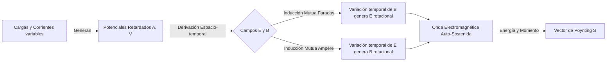

# Ecuaciones de Maxwell y Ondas Electromagnéticas

Las Ecuaciones de Maxwell representan la obra magna del electromagnetismo clásico, unificando la electricidad, el magnetismo y la óptica en un marco teórico elegante y autoconsistente. Son el equivalente en electromagnetismo a las Leyes de Newton en mecánica clásica.

## 📜 Contexto Histórico
A mediados del siglo XIX, las leyes de Gauss, Ampère y Faraday existían como principios empíricos desconectados o parcialmente incompatibles. James Clerk Maxwell, inspirado en las intuiciones visuales de Faraday sobre las "líneas de fuerza", desarrolló un modelo matemático unificado en la década de 1860. Maxwell descubrió una inconsistencia en la Ley de Ampère al aplicarla a condensadores, y añadió la "corriente de desplazamiento". Esto no solo salvó la conservación de la carga, sino que predijo la existencia de ondas electromagnéticas que viajaban a la velocidad de la luz. En 1887, Heinrich Hertz demostró experimentalmente la existencia de estas ondas. Oliver Heaviside fue quien reformuló matemáticamente las 20 ecuaciones de Maxwell originales en la notación vectorial (gradiente, divergencia, rotacional) que usamos hoy.

---

## 🧮 Desarrollo Teórico Profundo

El tratamiento riguroso de las Ecuaciones de Maxwell requiere el uso del cálculo tensorial y análisis vectorial avanzado. En esta sección derivaremos no solo las ecuaciones fundamentales, sino también las leyes de conservación de energía y momento asociadas.

### 1. Las Ecuaciones Diferenciales y sus Potenciales
Las cuatro ecuaciones de Maxwell acopladas en un medio con densidad de carga $\rho$ y densidad de corriente $\vec{J}$ son:

1. **Ley de Gauss:** $\nabla \cdot \vec{E} = \frac{\rho}{\varepsilon_0}$
2. **Ley de Gauss Magnética:** $\nabla \cdot \vec{B} = 0$
3. **Ley de Faraday:** $\nabla \times \vec{E} + \frac{\partial \vec{B}}{\partial t} = 0$
4. **Ley de Ampère-Maxwell:** $\nabla \times \vec{B} - \mu_0 \varepsilon_0 \frac{\partial \vec{E}}{\partial t} = \mu_0 \vec{J}$

La ley (2) garantiza que $\vec{B}$ puede expresarse como el rotacional de un potencial vector magnético $\vec{A}$:
$$ \vec{B} = \nabla \times \vec{A} $$
Sustituyendo esto en (3):
$$ \nabla \times \left( \vec{E} + \frac{\partial \vec{A}}{\partial t} \right) = 0 $$
Dado que el rotacional es nulo, el término entre paréntesis debe ser el gradiente de un potencial escalar $-V$:
$$ \vec{E} = -\nabla V - \frac{\partial \vec{A}}{\partial t} $$

Sustituyendo estos potenciales en (1) y (4), obtenemos un par de ecuaciones acopladas de segundo orden. Podemos desacoplarlas imponiendo un *Gauge* o calibre. En el **Gauge de Lorenz** ($\nabla \cdot \vec{A} + \mu_0 \varepsilon_0 \frac{\partial V}{\partial t} = 0$), las ecuaciones se simplifican a ecuaciones de onda no homogéneas (ecuaciones de d'Alembert):
$$ \Box^2 V = \nabla^2 V - \frac{1}{c^2} \frac{\partial^2 V}{\partial t^2} = -\frac{\rho}{\varepsilon_0} $$
$$ \Box^2 \vec{A} = \nabla^2 \vec{A} - \frac{1}{c^2} \frac{\partial^2 \vec{A}}{\partial t^2} = -\mu_0 \vec{J} $$
donde $c = 1/\sqrt{\mu_0 \varepsilon_0}$. Sus soluciones son los potenciales retardados, demostrando que los cambios en las fuentes se propagan a la velocidad $c$.

### 2. Teorema de Poynting y Conservación de Energía
Para derivar el balance energético, partimos de la fuerza de Lorentz ejercida sobre portadores en un volumen $V$:
$$ \frac{dW_{mec}}{dt} = \int_V \vec{J} \cdot \vec{E} \, dV $$
Utilizando la Ley de Ampère-Maxwell para despejar $\vec{J}$:
$$ \vec{J} = \frac{1}{\mu_0} \nabla \times \vec{B} - \varepsilon_0 \frac{\partial \vec{E}}{\partial t} $$
Por lo tanto:
$$ \vec{J} \cdot \vec{E} = \frac{1}{\mu_0} \vec{E} \cdot (\nabla \times \vec{B}) - \varepsilon_0 \vec{E} \cdot \frac{\partial \vec{E}}{\partial t} $$
Aplicando la identidad vectorial $\nabla \cdot (\vec{E} \times \vec{B}) = \vec{B} \cdot (\nabla \times \vec{E}) - \vec{E} \cdot (\nabla \times \vec{B})$ y la Ley de Faraday ($\nabla \times \vec{E} = -\frac{\partial \vec{B}}{\partial t}$), tenemos:
$$ \vec{J} \cdot \vec{E} = -\nabla \cdot \left( \frac{\vec{E} \times \vec{B}}{\mu_0} \right) - \left[ \varepsilon_0 \vec{E} \cdot \frac{\partial \vec{E}}{\partial t} + \frac{1}{\mu_0} \vec{B} \cdot \frac{\partial \vec{B}}{\partial t} \right] $$
Esto se puede reescribir como la **Ecuación del Teorema de Poynting**:
$$ \frac{\partial u}{\partial t} + \nabla \cdot \vec{S} = -\vec{J} \cdot \vec{E} $$
donde $\vec{S} = \frac{1}{\mu_0} (\vec{E} \times \vec{B})$ es el vector de Poynting (flujo de energía electromagnética por unidad de área), y $u = \frac{1}{2} \left( \varepsilon_0 |\vec{E}|^2 + \frac{1}{\mu_0} |\vec{B}|^2 \right)$ es la densidad de energía electromagnética.

### 3. Propagación en Medios Materiales y Condiciones de Frontera
Cuando la luz o cualquier campo electromagnético atraviesa materia macroscópica polarizable y magnetizable, introducimos los vectores Desplazamiento Eléctrico $\vec{D}$ y Campo Magnético Auxiliar $\vec{H}$:
$$ \vec{D} = \varepsilon_0 \vec{E} + \vec{P} \quad , \quad \vec{H} = \frac{\vec{B}}{\mu_0} - \vec{M} $$
Las ecuaciones de Maxwell en medios materiales se convierten en:
1. $\nabla \cdot \vec{D} = \rho_f$
2. $\nabla \cdot \vec{B} = 0$
3. $\nabla \times \vec{E} = -\frac{\partial \vec{B}}{\partial t}$
4. $\nabla \times \vec{H} = \vec{J}_f + \frac{\partial \vec{D}}{\partial t}$
donde el subíndice $f$ denota "cargas/corrientes libres". En una interfaz bidimensional libre de cargas o corrientes superficiales, esto resulta en las siguientes condiciones de contorno que rigen la reflexión y refracción ópticas (Ecuaciones de Fresnel):
- $D_{1n} - D_{2n} = \sigma_f$
- $B_{1n} - B_{2n} = 0$
- $\vec{E}_{1t} - \vec{E}_{2t} = 0$
- $\vec{H}_{1t} - \vec{H}_{2t} = \vec{K}_f \times \hat{n}$

### 4. Tensor Electromagnético y Covariancia Relativista
La unificación definitiva del electromagnetismo se logra a través de la Relatividad Especial. Los campos eléctricos y magnéticos no son entes separados, sino componentes de un único tensor asimétrico de rango 2, el tensor de Faraday $F^{\mu\nu}$:
$$ F^{\mu\nu} = \partial^\mu A^\nu - \partial^\nu A^\mu = \begin{pmatrix} 0 & -E_x/c & -E_y/c & -E_z/c \\ E_x/c & 0 & -B_z & B_y \\ E_y/c & B_z & 0 & -B_x \\ E_z/c & -B_y & B_x & 0 \end{pmatrix} $$
donde $A^\mu = (V/c, \vec{A})$ es el cuadripotencial.
Las cuatro ecuaciones de Maxwell se reducen gloriosamente a tan solo dos ecuaciones covariantes tensoriales:
1. Ecuaciones inhomogéneas (Gauss y Ampère-Maxwell):
   $$ \partial_\mu F^{\mu\nu} = \mu_0 J^\nu $$
   donde $J^\nu = (c\rho, \vec{J})$ es la cuadricorriente.
2. Ecuaciones homogéneas (Gauss Magnética y Faraday), representadas por la identidad de Bianchi:
   $$ \partial_\lambda F_{\mu\nu} + \partial_\mu F_{\nu\lambda} + \partial_\nu F_{\lambda\mu} = 0 $$
   o alternativamente, usando el tensor dual $\tilde{F}^{\mu\nu} = \frac{1}{2}\epsilon^{\mu\nu\alpha\beta} F_{\alpha\beta}$:
   $$ \partial_\mu \tilde{F}^{\mu\nu} = 0 $$

---

## 🛠 Ejemplo Práctico
**Problema:** Una onda electromagnética plana viaja en el vacío en la dirección $+z$. Si el campo eléctrico está dado por $\vec{E}(z,t) = E_0 \cos(kz - \omega t) \hat{i}$, deducir el vector campo magnético $\vec{B}(z,t)$.

**Solución paso a paso:**
1. **Usar la Ley de Faraday en el vacío:** $\nabla \times \vec{E} = -\frac{\partial \vec{B}}{\partial t}$
2. **Calcular el rotacional de $\vec{E}$:**
   Como $\vec{E}$ solo tiene componente $x$ y solo depende de $z$ y $t$:
   $$ \nabla \times \vec{E} = \left| \begin{matrix} \hat{i} & \hat{j} & \hat{k} \\ \frac{\partial}{\partial x} & \frac{\partial}{\partial y} & \frac{\partial}{\partial z} \\ E_x & 0 & 0 \end{matrix} \right| = \frac{\partial E_x}{\partial z} \hat{j} $$
   Derivando $E_x(z,t) = E_0 \cos(kz - \omega t)$ respecto a $z$:
   $$ \frac{\partial E_x}{\partial z} = -k E_0 \sin(kz - \omega t) $$
   Por tanto, $\nabla \times \vec{E} = -k E_0 \sin(kz - \omega t) \hat{j}$.
3. **Igualar y resolver para $\vec{B}$:**
   $$ -\frac{\partial \vec{B}}{\partial t} = -k E_0 \sin(kz - \omega t) \hat{j} \implies \frac{\partial \vec{B}}{\partial t} = k E_0 \sin(kz - \omega t) \hat{j} $$
   Integrando con respecto al tiempo:
   $$ \vec{B}(z,t) = \int k E_0 \sin(kz - \omega t) dt \, \hat{j} = \frac{k}{\omega} E_0 \cos(kz - \omega t) \hat{j} $$
4. **Relación entre $E_0$ y $B_0$:**
   Sabiendo que $c = \frac{\omega}{k}$, el campo magnético resulta:
   $$ \vec{B}(z,t) = \frac{E_0}{c} \cos(kz - \omega t) \hat{j} $$
   Note que $\vec{E}$ y $\vec{B}$ oscilan en fase y son ortogonales entre sí y ortogonales a la dirección de propagación.

---

## 📚 Recursos Específicos

### 🎓 Cursos y Clases Recomendadas
1. [MIT 8.02 - Electricity and Magnetism](https://ocw.mit.edu/courses/8-02-physics-ii-electricity-and-magnetism-spring-2007/): Las últimas sesiones en video demuestran la unificación de Faraday y Ampère, revelando ondas electromagnéticas en pleno vuelo.
2. [Stanford - Special Relativity (Leonard Susskind)](https://theoreticalminimum.com/courses/special-relativity-and-electrodynamics/2012/spring): Conecta las ecuaciones de Maxwell de forma que la invariancia Lorentziana brilla, fundamental para comprender el entrelazado de campos.
3. [Coursera - Electrodynamics: Analysis of Electric Fields](https://www.coursera.org/learn/electrodynamics): Un estudio riguroso de cálculo vectorial sobre divergencia y rotacional aplicados a los teoremas integrales de las ecuaciones.
4. [edX - E&M: Maxwell's Equations](https://www.edx.org/course/electricity-and-magnetism-maxwells-equations): Disertación moderna y activa enfocada directamente en la derivación empírica y teórica de las cuatro leyes unificadas.
5. [Feynman Lectures on Physics - Vol II, Ch 18: The Maxwell Equations](https://www.feynmanlectures.caltech.edu/II_18.html): Quizá la explicación más lúcida, hermosa e intuitiva jamás escrita sobre cómo surge matemáticamente el concepto de onda luminosa.
6. [NPTEL - Electromagnetic Waves in Guided and Wireless Media](https://nptel.ac.in/courses/108104087): Trata en profundidad sobre las soluciones ondulatorias de las ecuaciones y la propagación de radiación en guías de onda.

### 📝 Artículos e Interactivos Interesantes
1. [PhET - Radiating Charge (Ondas de Radio)](https://phet.colorado.edu/en/simulations/radio-waves): Simulador brillante que ayuda a visualizar con precisión y vectores cómo una carga acelerada irradia y propaga frentes de ondas.
2. [Wikipedia: Ecuaciones de Maxwell](https://es.wikipedia.org/wiki/Ecuaciones_de_Maxwell): La enciclopedia de referencia que expone el formalismo diferencial, el formalismo integral, y las versiones relativas a la materia macroscópica.
3. [Royal Society - A Dynamical Theory of the Electromagnetic Field (1865)](https://royalsocietypublishing.org/doi/10.1098/rstl.1865.0008): El documento fundacional histórico del propio Maxwell, un hito del desarrollo del pensamiento deductivo en física (PDF abierto).
4. [HyperPhysics - Maxwell's Equations](http://hyperphysics.phy-astr.gsu.edu/hbase/electric/maxeq.html): Un mapa interactivo detallando conceptualmente cada una de las cuatro leyes de la naturaleza que cimentan el modelo.
5. [YouTube - Demostración de las Ondas de Hertz](https://www.youtube.com/watch?v=cXXE-WwM964): Un vistazo fenomenológico e histórico espectacular de cómo Hertz comprobó usando resonadores y chispas que Maxwell tenía razón.
6. [Wikipedia: Corriente de Desplazamiento](https://es.wikipedia.org/wiki/Corriente_de_desplazamiento): Analiza de forma profunda la pieza faltante que salvó la consistencia y acopló para siempre ambos campos.
7. [Física Práctica: Onda Electromagnética](https://www.fisicapractica.com/ondas-electromagneticas.php): Una excelente recopilación sobre cómo de las ecuaciones acopladas en el vacío se extrae la ecuación de d'Alembert.
8. [LibreTexts - Maxwell's Equations and Electromagnetic Waves](https://phys.libretexts.org/Bookshelves/University_Physics/Book%3A_University_Physics_(OpenStax)/Map%3A_University_Physics_II_-_Thermodynamics_Electricity_and_Magnetism_(OpenStax)/16%3A_Electromagnetic_Waves): Módulo extenso, de uso libre y libre de costo, sobre las propiedades transversales de estas ondas.

### 📖 Referencias Útiles y Bibliografía
1. [Introduction to Electrodynamics - David J. Griffiths](https://www.cambridge.org/highereducation/books/introduction-to-electrodynamics/971275E590D0DE07E9CD0DB4F2C2FA04): El texto de referencia por excelencia (estándar de oro) para estudiantes de pregrado en física, claro y didáctico.
2. [Classical Electrodynamics - John David Jackson](https://www.wiley.com/en-us/Classical+Electrodynamics%2C+3rd+Edition-p-9780471309321): Obra matemática y avanzada requerida en todos los posgrados y doctorados del mundo físico.
3. [Electricity and Magnetism - Edward M. Purcell & David J. Morin](https://www.cambridge.org/highereducation/books/electricity-and-magnetism/C16C976ADCD2F4A96DD8DD3DDAB303CE): Magnífico abordaje donde el magnetismo emerge naturalmente como consecuencia de la relatividad especial.
4. [Física Universitaria (Vol. 2) - Sears y Zemansky](https://www.pearson.com/store/p/fisica-universitaria-vol-2/P200000000305/9786073244404): Un libro que cubre integralmente este contenido, explicando las ecuaciones para perfiles de primeros años.
5. [Classical Electricity and Magnetism - Panofsky & Phillips](https://store.doverpublications.com/products/9780486439242): El puente clásico ideal, extremadamente valorado para estudios sistemáticos previos a Jackson sobre formulación de campos.
