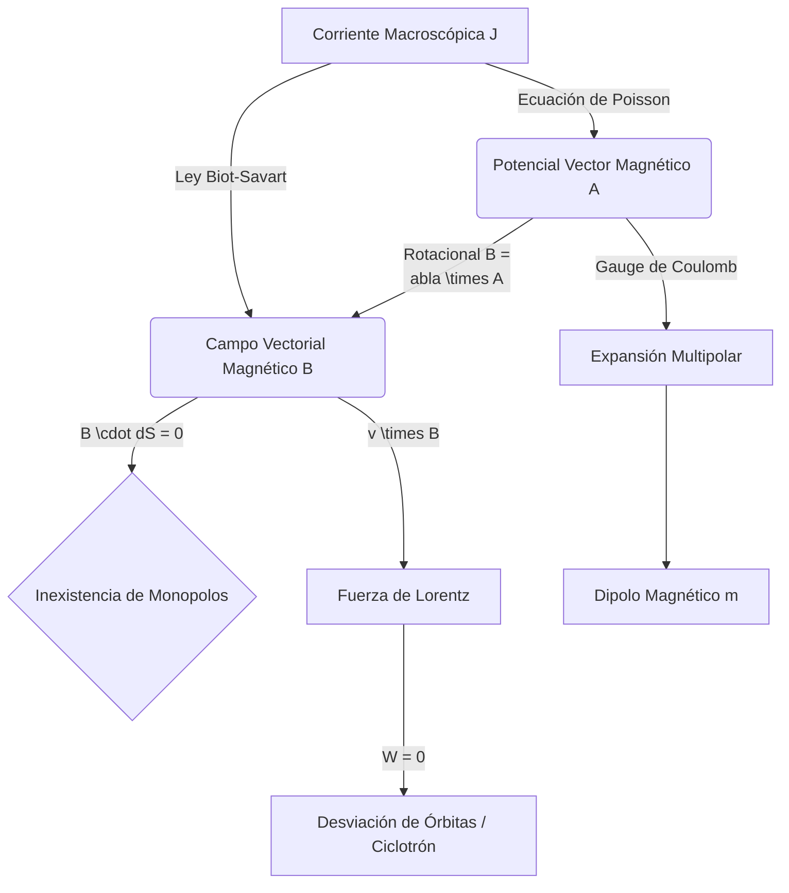

# Magnetismo

El magnetismo es la rama de la física que describe los fenómenos magnéticos, que surgen como resultado del movimiento de cargas eléctricas (corrientes) y de momentos magnéticos intrínsecos de las partículas elementales (espín).

## 📜 Contexto Histórico
Durante milenios, el magnetismo se consideró un fenómeno misterioso asociado a la magnetita. En 1820, Hans Christian Ørsted descubrió de forma accidental que una brújula se desviaba cerca de un cable con corriente, estableciendo la primera conexión entre electricidad y magnetismo. Poco después, Jean-Baptiste Biot y Félix Savart formularon la ley empírica que describe el campo generado por un segmento de corriente. André-Marie Ampère extendió estos trabajos y demostró que las corrientes se atraen o repelen de forma análoga a los imanes, fundando la electrodinámica. Finalmente, Hendrik Lorentz formalizó la fuerza que experimenta una carga móvil dentro de un campo electromagnético.

---

## 🧮 Desarrollo Teórico Profundo

El magnetismo, a diferencia de la electrostática donde rigen las fuerzas conservativas y potenciales escalares puros, requiere una comprensión profunda del análisis vectorial turbillonario y la relatividad especial, puesto que emerge como la consecuencia directa de las cargas en movimiento bajo transformaciones de Lorentz.

### 1. El Potencial Vector Magnético $\vec{A}$
Debido a la inexistencia de los monopolos magnéticos, impuesta por la ley de divergencia nula $\nabla \cdot \vec{B} = 0$, el Teorema de Helmholtz dictamina que el campo magnético $\vec{B}$ debe ser puramente rotacional. Esto nos permite definir un Potencial Vector $\vec{A}$ tal que:
$$ \vec{B} = \nabla \times \vec{A} $$
Esta definición no es única; $\vec{A}$ exhibe invarianza de *gauge* local. Si transformamos $\vec{A}' = \vec{A} + \nabla \Lambda$, para cualquier campo escalar $\Lambda$, el campo magnético $\vec{B}$ resultante no cambia ($\nabla \times \nabla \Lambda = \vec{0}$). Para la magnetostática, elegimos el *Gauge de Coulomb* ($\nabla \cdot \vec{A} = 0$).

Bajo este *gauge*, aplicando la forma diferencial de la Ley de Ampère ($\nabla \times \vec{B} = \mu_0 \vec{J}$):
$$ \nabla \times (\nabla \times \vec{A}) = \nabla (\nabla \cdot \vec{A}) - \nabla^2 \vec{A} = \mu_0 \vec{J} \implies \nabla^2 \vec{A} = -\mu_0 \vec{J} $$
Obtenemos así tres ecuaciones de Poisson escalares, una para cada coordenada del potencial vector. Su solución formal, análoga al potencial eléctrico, en todo el espacio es:
$$ \vec{A}(\vec{r}) = \frac{\mu_0}{4\pi} \int \frac{\vec{J}(\vec{r}')}{|\vec{r} - \vec{r}'|} d\tau' $$
Aplicando el operador rotacional $\nabla \times$ a esta expresión obtenemos la famosa **Ley de Biot-Savart**.

### 2. Fuerza de Lorentz y Trabajo Magnético
La interacción electrodinámica está gobernada por la fuerza de Lorentz, la cual para una partícula puntual de carga $q$ viajando a velocidad $\vec{v}$ es:
$$ \vec{F} = q(\vec{E} + \vec{v} \times \vec{B}) $$
Un corolario profundamente importante surge de examinar el trabajo mecánico realizado *puramente* por el campo magnético sobre la carga:
$$ dW_m = \vec{F}_m \cdot d\vec{l} = (q(\vec{v} \times \vec{B})) \cdot (\vec{v} \, dt) = q((\vec{v} \times \vec{B}) \cdot \vec{v}) \, dt = 0 $$
Dado que el producto vectorial $\vec{v} \times \vec{B}$ es ortogonal a $\vec{v}$, el trabajo es siempre nulo. **Las fuerzas magnéticas macroscópicas no pueden realizar trabajo sobre cargas libres**; solo pueden alterar la dirección de su momento, forzándolas a ejecutar órbitas ciclotrónicas sin cambiar su energía cinética.

### 3. Expansión Multipolar Magnética y el Dipolo
Al igual que en electrostática, podemos calcular el campo magnético lejano ($|\vec{r}| \gg |\vec{r}'|$) producido por una distribución localizada de corrientes. Expandiendo en serie el término de distancia $1/|\vec{r}-\vec{r}'|$ en la integral de $\vec{A}(\vec{r})$ obtenemos el **desarrollo multipolar magnético**.
A diferencia del potencial eléctrico, el término "monopolar" (inverso de $r$) en magnetismo se anula completamente, porque la corriente neta estática debe ser cero. El término dominante a grandes distancias es siempre el **Término Dipolar**:
$$ \vec{A}_{\text{dip}}(\vec{r}) = \frac{\mu_0}{4\pi} \frac{\vec{m} \times \hat{r}}{r^2} $$
donde $\vec{m}$ es el **momento dipolar magnético**, que para una espira de área vectorial plana $\vec{a}$ y corriente constante $I$ resulta en:
$$ \vec{m} = I \int d\vec{a} = I\vec{a} $$
El campo magnético resultante adopta la topología clásica del "imán de barra":
$$ \vec{B}_{\text{dip}}(\vec{r}) = \frac{\mu_0}{4\pi r^3} \left[ 3(\vec{m} \cdot \hat{r})\hat{r} - \vec{m} \right] $$

### 4. Origen Relativista del Campo Magnético
A nivel profundo, el campo magnético no existe de manera independiente. Si consideramos un hilo recto e infinito con densidad de carga $\lambda_0$ neta igual a cero (los portadores positivos están fijos y los negativos se mueven a velocidad $\vec{u}$), un observador en reposo experimenta una fuerza sobre una carga de prueba $q$ en movimiento (fuerza magnética). 

Para un observador inercial solidario a la carga de prueba, debido a las **contracciones de longitud de Lorentz** de la relatividad especial, la densidad aparente de las cargas positivas estáticas y de los electrones dinámicos se vuelve asimétrica. Esta asimetría de densidades crea un campo eléctrico radial no compensado para el observador en movimiento. Así, lo que el marco de laboratorio mide como "fuerza magnética pura de la Ley de Ampère", el marco propio de la partícula mide como "fuerza electrostática pura de la Ley de Coulomb".
Esto se encapsula impecablemente mediante la transformación del tensor electromagnético, indicando que $B_y \propto \gamma \frac{v}{c^2} E_z$.



### 5. Magnetización y Campos Macroscópicos en Materia
Cuando un campo externo $\vec{B}_{\text{ext}}$ afecta a la materia, induce alineación de los espines cuánticos de electrones no apareados (paramagnetismo) o dominios de intercambio (ferromagnetismo), o altera precesiones orbitales (diamagnetismo). El volumen material desarrolla un momento magnético neto, o **Magnetización** $\vec{M}$ (momento dipolar magnético por unidad de volumen).

Esta magnetización induce densidades de corriente de magnetización volumétrica $\vec{J}_b = \nabla \times \vec{M}$ y superficial $\vec{K}_b = \vec{M} \times \hat{n}$. 
La forma macroscópica de las ecuaciones incorpora estas corrientes, dando origen al "Campo Auxiliar Magnético" $\vec{H}$:
$$ \vec{H} \equiv \frac{\vec{B}}{\mu_0} - \vec{M} $$
Lo que nos brinda la Ley de Ampère Macroscópica para tratar solo con las corrientes libres $\vec{J}_f$ inyectadas en circuitos:
$$ \nabla \times \vec{H} = \vec{J}_f \implies \oint \vec{H} \cdot d\vec{l} = I_{f_{\text{encerrada}}} $$
Para medios isotrópicos y lineales, la relación se cierra con la permeabilidad magnética $\mu$: $\vec{B} = \mu \vec{H} = \mu_0(1 + \chi_m)\vec{H}$, donde $\chi_m$ es la susceptibilidad magnética del medio.

---

## 🛠 Ejemplo Práctico
**Problema:** Calcular el campo magnético $\vec{B}$ a una distancia $r$ de un hilo recto e infinito que transporta una corriente constante $I$.

**Solución paso a paso:**
1. **Identificar la simetría:** El sistema tiene simetría cilíndrica. Las líneas de campo magnético formarán círculos concéntricos alrededor del hilo.
2. **Aplicar la Ley de Ampère:** 
   Seleccionamos un bucle amperiano circular de radio $r$ centrado en el hilo. Por simetría, la magnitud de $\vec{B}$ es constante a lo largo de este bucle, y el vector $\vec{B}$ es tangente a la curva en cada punto.
3. **Calcular la circulación:**
   $$ \oint \vec{B} \cdot d\vec{l} = B \oint dl = B (2\pi r) $$
4. **Relacionar con la corriente:**
   La corriente encerrada por el bucle es $I$. Por lo tanto:
   $$ B (2\pi r) = \mu_0 I $$
5. **Resultado final:**
   $$ B = \frac{\mu_0 I}{2\pi r} $$
   La dirección se obtiene usando la regla de la mano derecha.

---

## 📝 Guía de Ejercicios Resueltos

**Problema 1: Fuerza asimétrica sobre una espira cuadrada cruzada por alambre**
Un hilo infinito lleva corriente estacionaria $I_1$ verticalmente a lo largo del eje Y. Una espira conductora cuadrada y rígida de lado $a$ que transporta corriente $I_2$ (en sentido horario) reposa en el plano XY coplanaria al hilo. El hilo infinito corta paralelamente al lado izquierdo de la espira, a una distancia transversal $d$ hacia la izquierda. Calcule el vector de fuerza magnética neto (magnitud y dirección) ejercido estrictamente sobre la espira entera.
**Solución paso a paso:**
1. El campo magnético $\vec{B}$ producido por el hilo infinito sobre la región $x > 0$ sigue la Ley de Biot-Savart, apuntando en $- \hat{k}$ (entrando al papel por convención de mano derecha). Su módulo a distancia $x$ (respecto al hilo) es $B(x) = \frac{\mu_0 I_1}{2\pi x}$.
2. Posicionamiento: El lado vertical izquierdo está a $x = d$. El lado vertical derecho está a $x = d+a$. Los lados horizontales van desde $x = d$ hasta $x = d+a$.
3. Evaluamos cada alambre rectilíneo por fuerza integral de Lorentz: $\vec{F} = \int I_2 d\vec{l} \times \vec{B}$.
4. **Lado izquierdo (corriente baja en $- \hat{j}$):**
   $\vec{F}_{izq} = I_2 \int_{y_0}^{y_0-a} (-dy \hat{j}) \times \left(-\frac{\mu_0 I_1}{2\pi d} \hat{k}\right)$.
   El producto vectorial $(-\hat{j}) \times (-\hat{k}) = \hat{i}$. Su longitud es $a$.
   $\vec{F}_{izq} = I_2 (a) \frac{\mu_0 I_1}{2\pi d} \hat{i}$. (Fuerza repulsiva alejándose del hilo central hacia la derecha).
5. **Lado derecho (corriente sube en $+ \hat{j}$):**
   $\vec{F}_{der} = I_2 \int_{y_0-a}^{y_0} (dy \hat{j}) \times \left(-\frac{\mu_0 I_1}{2\pi (d+a)} \hat{k}\right) = -I_2 a \frac{\mu_0 I_1}{2\pi (d+a)} \hat{i}$. (Fuerza atractiva tenue hacia el hilo central).
6. **Lados superior e inferior (horizontales):**
   Lado superior: $\vec{F}_{sup} = I_2 \int_{d}^{d+a} (dx \hat{i}) \times \left(-\frac{\mu_0 I_1}{2\pi x} \hat{k}\right) = I_2 \frac{\mu_0 I_1}{2\pi} \int_d^{d+a} \frac{dx}{x} \hat{j} = I_2 \frac{\mu_0 I_1}{2\pi} \ln\left(\frac{d+a}{d}\right) \hat{j}$.
   Lado inferior: $\vec{F}_{inf} = I_2 \int_{d+a}^{d} (-dx \hat{i}) \times \left(-\frac{\mu_0 I_1}{2\pi x} \hat{k}\right) = -I_2 \frac{\mu_0 I_1}{2\pi} \ln\left(\frac{d+a}{d}\right) \hat{j}$.
   Notoriamente $\vec{F}_{sup} + \vec{F}_{inf} = \vec{0}$, cancelando simétricamente el tensor de rotación que intentaba deformar la geometría superior e inferior.
7. **Fuerza Neta Total:**
   Suma lineal $\vec{F}_{net} = \vec{F}_{izq} + \vec{F}_{der} = \frac{\mu_0 I_1 I_2 a}{2\pi} \left( \frac{1}{d} - \frac{1}{d+a} \right) \hat{i}$.
   $\vec{F}_{net} = \frac{\mu_0 I_1 I_2 a^2}{2\pi d(d+a)} \hat{i}$. La espira es macroscópicamente repelida hacia la derecha.

**Problema 2: El Potencial Vector Magnético $\vec{A}$ de un Solenoide Infinito**
Un solenoide ideal infinito, denso en vueltas $n$ por unidad de longitud y conduciendo $I_0$, tiene radio $R$. Determinar el vector $\vec{A}(\vec{r})$ tanto dentro ($r<R$) como fuera ($r>R$) e ilustrar que las integrales de contorno topológicas simulan un flujo de "campo virtual" ajeno a $\vec{B}$.
**Solución paso a paso:**
1. A partir de las identidades del rotacional, existe un equivalente magnético de la Ley de Stokes: el flujo del campo rotacional es idéntico a la integral de circulación de su vector potencial primario.
   $\Phi_B = \int \vec{B} \cdot d\vec{S} = \int (\nabla \times \vec{A}) \cdot d\vec{S} = \oint \vec{A} \cdot d\vec{l}$.
2. Por simetría azimutal en coordenadas cilíndricas, asumimos que $\vec{A}$ es acimutal y depende exclusivamente del radio local, i.e., $\vec{A}(r) = A(r)\hat{\phi}$. (Al igual que $\vec{B}$ para corrientes rectas cilíndricas).
3. Evaluamos la integral de camino de $\vec{A}$ en un círculo coaxial de radio $r$:
   $\oint \vec{A} \cdot d\vec{l} = A(r) (2\pi r)$.
4. El campo $\vec{B}$ de un solenoide es uniforme dentro ($\vec{B} = \mu_0 n I_0 \hat{k}$) y estrictamente cero fuera.
5. **Región interior ($r < R$):**
   El flujo atravesando el bucle $r$ es $\Phi_B = B (\pi r^2) = (\mu_0 n I_0) \pi r^2$.
   Igualando las integrales: $A_{int}(r) (2\pi r) = \mu_0 n I_0 \pi r^2 \implies \vec{A}_{int}(r) = \frac{\mu_0 n I_0}{2} r \, \hat{\phi}$.
6. **Región exterior ($r > R$):**
   El flujo encadenado no crece al extender el bucle; se satura estáticamente al tope transversal del solenoide macizo $\Phi_B = (\mu_0 n I_0) \pi R^2$. (Afuera el campo puntual $B$ es 0).
   Igualando integrales: $A_{ext}(r) (2\pi r) = \mu_0 n I_0 \pi R^2 \implies \vec{A}_{ext}(r) = \frac{\mu_0 n I_0 R^2}{2 r} \, \hat{\phi}$.
7. El Potencial Vector está lejos de ser cero al exterior del solenoide, decae analíticamente como $1/r$. Si bien su rotacional $\nabla \times \vec{A}$ produce $B=0$, el potencial virtual permea todo el espacio exterior (la base teórica vital del Efecto Aharonov-Bohm en física cuántica).

**Problema 3: Plasma y diamagnetismo orbital perfecto (Efecto Meissner microscópico)**
Considere una nube de plasma (átomos masivos ionizados positivamente e inmóviles, con electrones libres a su alrededor de masa $m$ y densidad global neutralizadora compensante) expuesta de sopetón a un campo magnético progresivo $\vec{B} = B \hat{k}$. Demuestre el origen molecular diamagnético hallando la alteración inducida en la frecuencia ciclotrónica, y aplique la Teoría de Larmor para comprobar si la magnetización $\vec{M}$ es alineada o anti-alineada respecto al agente perturbador magnético de entrada.
**Solución paso a paso:**
1. Suponga un electrón en órbita circular inercial natural de radio $r$ y velocidad $v_0$ regida por fuerza centrípeta culombiana. Se enciende gradualmente $B$.
2. Por la Ley de Faraday inducida por el campo variable $d\vec{B}/dt$, se crea un campo eléctrico tangencial circundante:
   $\oint \vec{E} \cdot d\vec{l} = -\frac{d\Phi_B}{dt} \implies E (2\pi r) = -\pi r^2 \frac{dB}{dt} \implies \vec{E} = -\frac{r}{2} \frac{dB}{dt} \hat{\phi}$.
3. Este $\vec{E}$ acelerará o decelerará longitudinalmente a nuestro electrón según el par que aplique el torque de torsión $\vec{\tau} = \vec{r} \times (-e\vec{E})$.
4. Segunda Ley de Newton rotacional microscópica:
   $m r^2 \frac{d\omega}{dt} = \tau = r (-e) \left(-\frac{r}{2} \frac{dB}{dt}\right) = \frac{e r^2}{2} \frac{dB}{dt}$.
5. Simplificando el momento de inercia y la geometría orbital:
   $\frac{d\omega}{dt} = \frac{e}{2m} \frac{dB}{dt}$.
6. Integrando desde $B=0$ (donde $\omega = \omega_0$) hasta el valor final $B$:
   $\Delta\omega = \frac{e B}{2m}$. Esta modificación invariante se denomina la **Frecuencia de Larmor**.
7. Si evaluamos la corriente alterada microscópicamente del bucle atómico tras esto, $I = \frac{-e}{T} = \frac{-e \omega}{2\pi}$. El cambio en la corriente equivale al cambio cinemático de rotación $\Delta I = -\frac{e}{2\pi} \Delta\omega = -\frac{e^2 B}{4\pi m}$.
8. El cambio en el momento dipolar atómico (orbital) $\vec{m} = I \vec{a} = (\Delta I)(\pi r^2) \hat{k}$.
   $\Delta\vec{m} = \left(-\frac{e^2 B}{4\pi m}\right)(\pi r^2) \hat{k} = -\frac{e^2 r^2}{4m} \vec{B}$.
9. El signo estricto algebraico final negativo demuestra ontológicamente la Ley de Lenz intrínseca atómica y molecular. Sin importar el estado termodinámico ni la polaridad, la alteración de la precesión cuántica genera un momento dipolar neto y global $\vec{M}$ que se opone vehementemente a la penetración de un campo $\vec{B}$, definiendo que todos los materiales (desde ranas y fresas a superconductores tipo I) posean intrínsecamente un componente diamagnético inherente (Susceptibilidad $\chi_m < 0$).

## 💻 Simulaciones Computacionales

Simulación de la trayectoria de una partícula cargada en un campo magnético uniforme (fuerza de Lorentz), mostrando el movimiento ciclotrónico y el arrastre $\vec{E} \times \vec{B}$ si existiera campo eléctrico.

```python
import numpy as np
import matplotlib.pyplot as plt
from scipy.integrate import solve_ivp

q = 1.0
m = 1.0
B = np.array([0, 0, 1.0])  # Campo Magnético en z
E = np.array([0, 0.2, 0])  # Pequeño campo Eléctrico en y

def lorentz_force(t, state):
    r = state[:3]
    v = state[3:]
    a = (q / m) * (E + np.cross(v, B))
    return np.concatenate((v, a))

# Velocidad inicial perpendicular al campo B
state0 = [0, 0, 0, 1.0, 0, 0.1]
t_span = (0, 30)

sol = solve_ivp(lorentz_force, t_span, state0, t_eval=np.linspace(0, 30, 1000))

fig = plt.figure(figsize=(8, 8))
ax = fig.add_subplot(111, projection='3d')
ax.plot(sol.y[0], sol.y[1], sol.y[2], color='green', linewidth=2)
ax.set_title('Movimiento Helicoidal (Fuerza de Lorentz + Arrastre $E \\times B$)')
ax.set_xlabel('X')
ax.set_ylabel('Y')
ax.set_zlabel('Z')
plt.show()
```

## 📚 Recursos Específicos

### 🎓 Cursos y Clases Recomendadas
1. [MIT 8.02 - Electricity and Magnetism](https://ocw.mit.edu/courses/8-02-physics-ii-electricity-and-magnetism-spring-2007/): Clases icónicas con demostraciones sobre el campo magnético generado por corrientes, fuerzas de espiras magnéticas e inducción.
2. [Yale PHYS 201 - Fundamentals of Physics II](https://oyc.yale.edu/physics/phys-201): Las magistrales lecciones del Prof. Ramamurti Shankar explorando a detalle la Fuerza de Lorentz, ciclotrones y el tensor electromagnético.
3. [Feynman Lectures on Physics - Vol II, Ch 13: Magnetostatics](https://www.feynmanlectures.caltech.edu/II_13.html): Analiza el comportamiento estacionario de las corrientes y delinea conceptualmente el rotacional del vector magnético.
4. [Khan Academy - Campos Magnéticos](https://es.khanacademy.org/science/physics/magnetic-forces-and-magnetic-fields): Una extensa serie de resoluciones en formato de "pizarra virtual", explicando la regla de la mano derecha con pericia.
5. [Coursera - Magnetic Fields and Forces](https://www.coursera.org/learn/physics-102): Ideal para el manejo y cálculo detallado del vector de Ampère y la ley integral de flujo de Biot-Savart en 3D.
6. [edX - E&M: Magnetism and Induction](https://www.edx.org/course/electricity-and-magnetism-part-2): Curso sólido que detalla cómo un flujo magnético variable en una espira origina un campo eléctrico turbillonario no conservativo.

### 📝 Artículos e Interactivos Interesantes
1. [PhET - Laboratorio Electromagnético de Faraday](https://phet.colorado.edu/en/simulations/faradays-law): Genial emulador web interactivo donde se experimenta en tiempo real con un imán de barra, un osciloscopio virtual, un voltímetro, y bobinas de distinto espirado.
1. **[MIT 8.02: Magnetic Fields and Forces (Walter Lewin)](https://ocw.mit.edu/courses/8-02-physics-ii-electricity-and-magnetism-spring-2007/)**: Las clases en que se visualizan los anillos y solenoides empujándose repulsivamente muestran la tangibilidad directa e irrefutable abstracta macro de la fuerza de Lorentz en conductores vivos.
2. **[Stanford - Special Relativity and Electrodynamics (L. Susskind)](https://theoreticalminimum.com/courses/special-relativity-and-electrodynamics/2012/spring)**: Las charlas más hermosas y reveladoras posibles donde el magnetismo emerge ante tus propios ojos en el bizarro pizarrón oscuro a punta puramente de aplicar contracciones de Lorentz tensoriales a cargas electrostáticas desplazadas a la velocidad del observador relacional.
3. **[NPTEL: Classical Electromagnetism (IIT Madras)](https://nptel.ac.in/courses/115106122)**: Profundiza pesadamente en dominar algebraicamente unívoco formal el gauge de Coulomb analítico para derivar y extraer limpiamente el Potencial Vector magnético en tubos e hilos semiinfinitos coaxiales limitados con alta asimetría.

### 📝 Artículos, Publicaciones y Teoría Avanzada
1. **[Relativity and the Magnetic Field (Edward Purcell, 1965)](https://www.cambridge.org/highereducation/books/electricity-and-magnetism/C16C976ADCD2F4A96DD8DD3DDAB303CE)**
   - *Importancia Teórica*: Demostración fenomenal de que el Magnetismo, en lugar de constituir una interacción de la naturaleza distinta y "fuerza" extra nueva fundamental asimétrica, se revela perentoriamente y ontológicamente como "electrostática puramente observada a la carrera al paso desde otro barco (es decir, campo E relativista cruzado modificado espacialmente)".
   - *Contexto Matemático*: Considere un hilo recto conductor de sección gruesa pasivo donde $I \neq 0$ pero localmente la densidad macro es asintóticamente nula sin carga eléctrica macro, $\lambda_+ + \lambda_- = 0$. Una partícula de prueba libre paralela de carga libre viajando $v_0$ mide en su marco observacional cinético de laboratorio propio inercial (donde está momentáneamente a velocidad estacionaria de deriva nula estática $v'=0$) una tremenda anomalía: Las bandas positivas del hilo de metales fijos corren opuestamente fugando, por lo que bajo su mirada los positivos contraen longitudinalmente acortándose sus huecos y densificándose perimetralmente asombrosamente $\lambda'_+ = \gamma \lambda_+$, mientras que las cargas negativas que iban con ella se ensanchan paralizándose $\lambda'_- = \lambda_- / \gamma$.
   - *Implicaciones*: La partícula sufre en su marco de sistema particular abstracto interno único asimétrico cruzado una tracción repulsiva Eléctrica Coulombiana rotunda radial y pura franca ortogonal neta $\Delta E_{radial} \neq 0$, y lo que experimenta es denominado en nuestro mundo marco externo lento simplemente abstractamente "Fuerza de campo Magnético Ampereana".
2. **[The Aharonov-Bohm Effect (Yakir Aharonov and David Bohm, 1959)](https://journals.aps.org/pr/abstract/10.1103/PhysRev.115.485)**
   - *Importancia Teórica*: Un hito cuántico perturbador histórico subatómico conceptual rotundo fundacional profundo que reasignó e invistió abruptamente abstractamente toda ontología de fisicalidad intrínseca material "física objetiva verdadera existente pura y subyacente palpable" no al propio campo abstracto $\vec{B}$, sino que al misterioso Potencial Vector fundamental subyacente derivativo $\vec{A}$.
   - *Contexto Matemático*: Se dispone con barreras un haz dividido acoplado subatómico divergente interferométrico de electrones puros que viajan de largo y rodean esquivando circundando abriendo camino paralelamente al perímetro lejano externo y seguro ancho alejado impoluto resguardado vacío asimétrico externo colindante exterior exento y apartado de todo Solenoide magnético denso largo sellado de $\vec{B} = 0$. A pesar del cero rotundo, el Electrón de Schrödinger sufre un desfase ineludible y abrupto del patrón formal de fase acoplado en $\Delta \phi = \frac{e}{\hbar} \oint \vec{A} \cdot d\vec{l}$.
   - *Implicaciones*: Proclama y consolida analíticamente irreversible subyacente universal firme e inviolable absoluto sub-matemático formal la omnipotencia primigenia, superioridad, y preexistencia del Potencial Vector $\vec{A}$ y el Gauge, que afectan el espectro del cosmos cuántico, y subordina degradadamente al Campo Magnético palpable Newtoniano $B$ (que es apenas $\nabla \times \vec{A}$) como ente físico meramente asintótico clásico tardío irrelevante emergente del cálculo límite y del límite del infinito de la física clásica en el nivel cuántico matricial analógico abstracto y espinorial topológico cuántico (Chern-Simons).
3. **[Quantized Magnetic Flux in Superconductors (Deaver & Fairbank, 1961)](https://journals.aps.org/prl/abstract/10.1103/PhysRevLett.7.43)**
   - *Importancia Teórica*: Demostración física de que el magnetismo, en regímenes acoplados topológicos macroscópicos fríos oscuros puros BCS en tubos fríos cerrados amorfos de superconductividad ininterrumpida estática, exhibe naturaleza cuantizada y discontinua abstracta fraccionada y formal discontinua discreta en peldaños y paquetes (Quantum Fluxes / Fluxones), delatando la emergencia acoplada coherente de variables conjuntas formales pares de Cooper a nivel universal e interestelar.
   - *Contexto Matemático*: Un anillo conductor puro $R = 0$ acoplado no disipativo que atrapa flujo retentivo remanente al enfriarse al cero debe poseer en su interior funcional rotacional una integral limitante del campo potencial subyacente magnético y un momento cruzado escalar que equivalga formal y cíclicamente a un factor del ángulo subatómico complejo integral exacto perimetral nulo cerrado analítico abstracto:
     $$ \Phi_B = \oint \vec{A} \cdot d\vec{l} = n \left(\frac{h}{2e}\right) = n \, \Phi_0 $$
   - *Implicaciones*: Este "quantum magnético universal" $\Phi_0 = 2.067 \times 10^{-15} \text{ Wb}$ se halla y existe puro diseminado en infinitas áreas de física computacional de vórtices y estados excitados condensados magnéticos (SQUIDs detectando nano-corrientes del córtex neuronal médico), así como detectando singularidades exóticas, y depara formalizando abstracciones matemáticas cuánticas y magnéticas de entrelazamientos.

### 📖 Referencias Útiles y Bibliografía
- **[Introduction to Electrodynamics - David J. Griffiths](https://www.cambridge.org/highereducation/books/introduction-to-electrodynamics/971275E590D0DE07E9CD0DB4F2C2FA04)**: El Capítulo 5 destila magistralmente para el principiante avanzado las ecuaciones complejas de Biot-Savart, el bucle en Dipolos y la Ecuación del Potencial Vector $\vec{A}$ de manera sumamente ordenada acoplada abstracta geométrica diferencial clara con ejemplos puros vectoriales cruzados de bobinas cilíndricas macizas rotacionales y cintas formales macro y tubulares, incluyendo el formalismo formal material de Faraday microscópico $\vec{B} = \mu_0(\vec{H} + \vec{M})$.
- **[Electricity and Magnetism - Edward M. Purcell & David J. Morin](https://www.cambridge.org/highereducation/books/electricity-and-magnetism/C16C976ADCD2F4A96DD8DD3DDAB303CE)**: Lectura absolutamente esencial formal indiscutida para sumergirse con los ojos del pensador abstracto de raíz relativista sin necesidad de matemáticas post-doctorales. Todo es abordado analizando transformaciones y densidades formales en el Espacio y el Tiempo de los metales, cables e hilos y corrientes abstractas conjuntas asimétricas y observadores.
