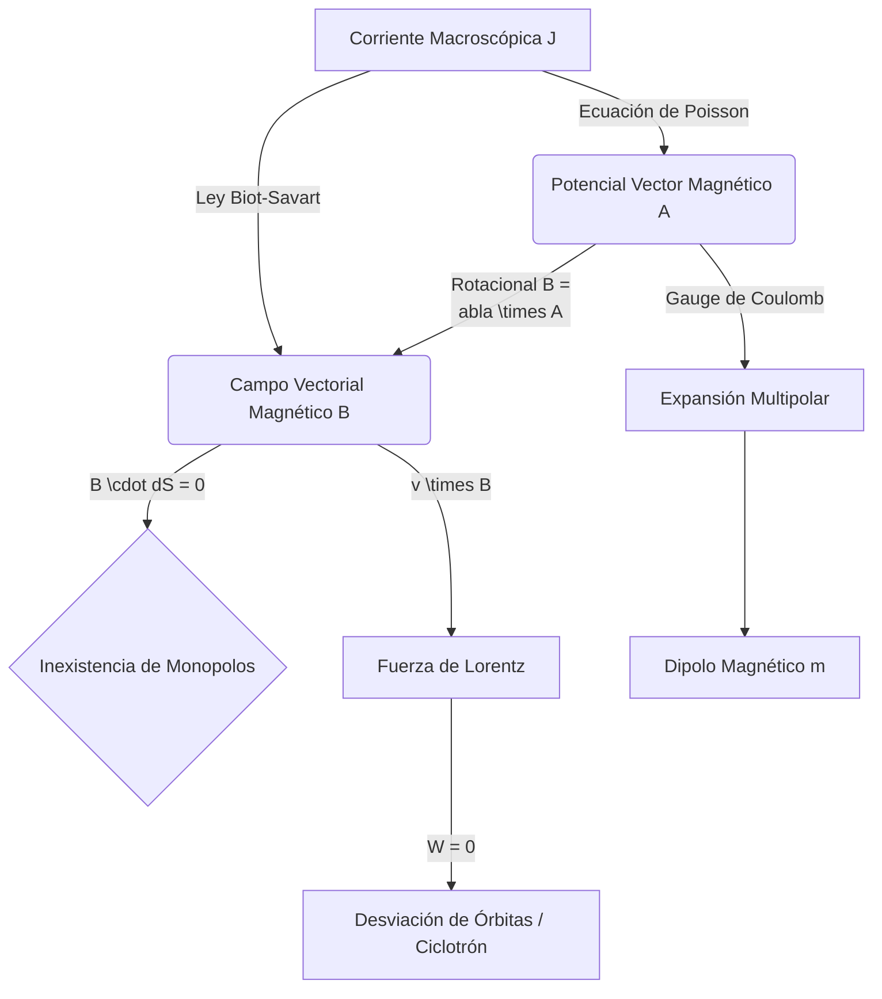

# Magnetismo

El magnetismo es la rama de la física que describe los fenómenos magnéticos, que surgen como resultado del movimiento de cargas eléctricas (corrientes) y de momentos magnéticos intrínsecos de las partículas elementales (espín).

## 📜 Contexto Histórico
Durante milenios, el magnetismo se consideró un fenómeno misterioso asociado a la magnetita. En 1820, Hans Christian Ørsted descubrió de forma accidental que una brújula se desviaba cerca de un cable con corriente, estableciendo la primera conexión entre electricidad y magnetismo. Poco después, Jean-Baptiste Biot y Félix Savart formularon la ley empírica que describe el campo generado por un segmento de corriente. André-Marie Ampère extendió estos trabajos y demostró que las corrientes se atraen o repelen de forma análoga a los imanes, fundando la electrodinámica. Finalmente, Hendrik Lorentz formalizó la fuerza que experimenta una carga móvil dentro de un campo electromagnético.

---

## 🧮 Desarrollo Teórico Profundo

El magnetismo, a diferencia de la electrostática donde rigen las fuerzas conservativas y potenciales escalares puros, requiere una comprensión profunda del análisis vectorial turbillonario y la relatividad especial, puesto que emerge como la consecuencia directa de las cargas en movimiento bajo transformaciones de Lorentz.

### 1. El Potencial Vector Magnético $\vec{A}$
Debido a la inexistencia de los monopolos magnéticos, impuesta por la ley de divergencia nula $\nabla \cdot \vec{B} = 0$, el Teorema de Helmholtz dictamina que el campo magnético $\vec{B}$ debe ser puramente rotacional. Esto nos permite definir un Potencial Vector $\vec{A}$ tal que:
$$ \vec{B} = \nabla \times \vec{A} $$
Esta definición no es única; $\vec{A}$ exhibe invarianza de *gauge* local. Si transformamos $\vec{A}' = \vec{A} + \nabla \Lambda$, para cualquier campo escalar $\Lambda$, el campo magnético $\vec{B}$ resultante no cambia ($\nabla \times \nabla \Lambda = \vec{0}$). Para la magnetostática, elegimos el *Gauge de Coulomb* ($\nabla \cdot \vec{A} = 0$).

Bajo este *gauge*, aplicando la forma diferencial de la Ley de Ampère ($\nabla \times \vec{B} = \mu_0 \vec{J}$):
$$ \nabla \times (\nabla \times \vec{A}) = \nabla (\nabla \cdot \vec{A}) - \nabla^2 \vec{A} = \mu_0 \vec{J} \implies \nabla^2 \vec{A} = -\mu_0 \vec{J} $$
Obtenemos así tres ecuaciones de Poisson escalares, una para cada coordenada del potencial vector. Su solución formal, análoga al potencial eléctrico, en todo el espacio es:
$$ \vec{A}(\vec{r}) = \frac{\mu_0}{4\pi} \int \frac{\vec{J}(\vec{r}')}{|\vec{r} - \vec{r}'|} d\tau' $$
Aplicando el operador rotacional $\nabla \times$ a esta expresión obtenemos la famosa **Ley de Biot-Savart**.

### 2. Fuerza de Lorentz y Trabajo Magnético
La interacción electrodinámica está gobernada por la fuerza de Lorentz, la cual para una partícula puntual de carga $q$ viajando a velocidad $\vec{v}$ es:
$$ \vec{F} = q(\vec{E} + \vec{v} \times \vec{B}) $$
Un corolario profundamente importante surge de examinar el trabajo mecánico realizado *puramente* por el campo magnético sobre la carga:
$$ dW_m = \vec{F}_m \cdot d\vec{l} = (q(\vec{v} \times \vec{B})) \cdot (\vec{v} \, dt) = q((\vec{v} \times \vec{B}) \cdot \vec{v}) \, dt = 0 $$
Dado que el producto vectorial $\vec{v} \times \vec{B}$ es ortogonal a $\vec{v}$, el trabajo es siempre nulo. **Las fuerzas magnéticas macroscópicas no pueden realizar trabajo sobre cargas libres**; solo pueden alterar la dirección de su momento, forzándolas a ejecutar órbitas ciclotrónicas sin cambiar su energía cinética.

### 3. Expansión Multipolar Magnética y el Dipolo
Al igual que en electrostática, podemos calcular el campo magnético lejano ($|\vec{r}| \gg |\vec{r}'|$) producido por una distribución localizada de corrientes. Expandiendo en serie el término de distancia $1/|\vec{r}-\vec{r}'|$ en la integral de $\vec{A}(\vec{r})$ obtenemos el **desarrollo multipolar magnético**.
A diferencia del potencial eléctrico, el término "monopolar" (inverso de $r$) en magnetismo se anula completamente, porque la corriente neta estática debe ser cero. El término dominante a grandes distancias es siempre el **Término Dipolar**:
$$ \vec{A}_{\text{dip}}(\vec{r}) = \frac{\mu_0}{4\pi} \frac{\vec{m} \times \hat{r}}{r^2} $$
donde $\vec{m}$ es el **momento dipolar magnético**, que para una espira de área vectorial plana $\vec{a}$ y corriente constante $I$ resulta en:
$$ \vec{m} = I \int d\vec{a} = I\vec{a} $$
El campo magnético resultante adopta la topología clásica del "imán de barra":
$$ \vec{B}_{\text{dip}}(\vec{r}) = \frac{\mu_0}{4\pi r^3} \left[ 3(\vec{m} \cdot \hat{r})\hat{r} - \vec{m} \right] $$

### 4. Origen Relativista del Campo Magnético
A nivel profundo, el campo magnético no existe de manera independiente. Si consideramos un hilo recto e infinito con densidad de carga $\lambda_0$ neta igual a cero (los portadores positivos están fijos y los negativos se mueven a velocidad $\vec{u}$), un observador en reposo experimenta una fuerza sobre una carga de prueba $q$ en movimiento (fuerza magnética). 

Para un observador inercial solidario a la carga de prueba, debido a las **contracciones de longitud de Lorentz** de la relatividad especial, la densidad aparente de las cargas positivas estáticas y de los electrones dinámicos se vuelve asimétrica. Esta asimetría de densidades crea un campo eléctrico radial no compensado para el observador en movimiento. Así, lo que el marco de laboratorio mide como "fuerza magnética pura de la Ley de Ampère", el marco propio de la partícula mide como "fuerza electrostática pura de la Ley de Coulomb".
Esto se encapsula impecablemente mediante la transformación del tensor electromagnético, indicando que $B_y \propto \gamma \frac{v}{c^2} E_z$.

### 5. Magnetización y Campos Macroscópicos en Materia
Cuando un campo externo $\vec{B}_{\text{ext}}$ afecta a la materia, induce alineación de los espines cuánticos de electrones no apareados (paramagnetismo) o dominios de intercambio (ferromagnetismo), o altera precesiones orbitales (diamagnetismo). El volumen material desarrolla un momento magnético neto, o **Magnetización** $\vec{M}$ (momento dipolar magnético por unidad de volumen).

Esta magnetización induce densidades de corriente de magnetización volumétrica $\vec{J}_b = \nabla \times \vec{M}$ y superficial $\vec{K}_b = \vec{M} \times \hat{n}$. 
La forma macroscópica de las ecuaciones incorpora estas corrientes, dando origen al "Campo Auxiliar Magnético" $\vec{H}$:
$$ \vec{H} \equiv \frac{\vec{B}}{\mu_0} - \vec{M} $$
Lo que nos brinda la Ley de Ampère Macroscópica para tratar solo con las corrientes libres $\vec{J}_f$ inyectadas en circuitos:
$$ \nabla \times \vec{H} = \vec{J}_f \implies \oint \vec{H} \cdot d\vec{l} = I_{f_{\text{encerrada}}} $$
Para medios isotrópicos y lineales, la relación se cierra con la permeabilidad magnética $\mu$: $\vec{B} = \mu \vec{H} = \mu_0(1 + \chi_m)\vec{H}$, donde $\chi_m$ es la susceptibilidad magnética del medio.

---

## 🛠 Ejemplo Práctico
**Problema:** Calcular el campo magnético $\vec{B}$ a una distancia $r$ de un hilo recto e infinito que transporta una corriente constante $I$.

**Solución paso a paso:**
1. **Identificar la simetría:** El sistema tiene simetría cilíndrica. Las líneas de campo magnético formarán círculos concéntricos alrededor del hilo.
2. **Aplicar la Ley de Ampère:** 
   Seleccionamos un bucle amperiano circular de radio $r$ centrado en el hilo. Por simetría, la magnitud de $\vec{B}$ es constante a lo largo de este bucle, y el vector $\vec{B}$ es tangente a la curva en cada punto.
3. **Calcular la circulación:**
   $$ \oint \vec{B} \cdot d\vec{l} = B \oint dl = B (2\pi r) $$
4. **Relacionar con la corriente:**
   La corriente encerrada por el bucle es $I$. Por lo tanto:
   $$ B (2\pi r) = \mu_0 I $$
5. **Resultado final:**
   $$ B = \frac{\mu_0 I}{2\pi r} $$
   La dirección se obtiene usando la regla de la mano derecha.

---

## 📚 Recursos Específicos

### 🎓 Cursos y Clases Recomendadas
1. [MIT 8.02 - Electricity and Magnetism](https://ocw.mit.edu/courses/8-02-physics-ii-electricity-and-magnetism-spring-2007/): Clases icónicas con demostraciones sobre el campo magnético generado por corrientes, fuerzas de espiras magnéticas e inducción.
2. [Yale PHYS 201 - Fundamentals of Physics II](https://oyc.yale.edu/physics/phys-201): Las magistrales lecciones del Prof. Ramamurti Shankar explorando a detalle la Fuerza de Lorentz, ciclotrones y el tensor electromagnético.
3. [Feynman Lectures on Physics - Vol II, Ch 13: Magnetostatics](https://www.feynmanlectures.caltech.edu/II_13.html): Analiza el comportamiento estacionario de las corrientes y delinea conceptualmente el rotacional del vector magnético.
4. [Khan Academy - Campos Magnéticos](https://es.khanacademy.org/science/physics/magnetic-forces-and-magnetic-fields): Una extensa serie de resoluciones en formato de "pizarra virtual", explicando la regla de la mano derecha con pericia.
5. [Coursera - Magnetic Fields and Forces](https://www.coursera.org/learn/physics-102): Ideal para el manejo y cálculo detallado del vector de Ampère y la ley integral de flujo de Biot-Savart en 3D.
6. [edX - E&M: Magnetism and Induction](https://www.edx.org/course/electricity-and-magnetism-part-2): Curso sólido que detalla cómo un flujo magnético variable en una espira origina un campo eléctrico turbillonario no conservativo.

### 📝 Artículos e Interactivos Interesantes
1. [PhET - Laboratorio Electromagnético de Faraday](https://phet.colorado.edu/en/simulations/faradays-law): Genial emulador web interactivo donde se experimenta en tiempo real con un imán de barra, un osciloscopio virtual, un voltímetro, y bobinas de distinto espirado.
2. [HyperPhysics - Magnetism](http://hyperphysics.phy-astr.gsu.edu/hbase/magnetic/magcon.html): Recorrido extenso e íntegro sobre la fuerza magnética en cables, momentos magnéticos de espiras, magnetización, ferromagnetismo e histéresis.
3. [Wikipedia: Fuerza de Lorentz](https://es.wikipedia.org/wiki/Fuerza_de_Lorentz): Exposición a fondo de la ecuación del movimiento para partículas cargadas en aceleradores de partículas de altas energías, plasmas y tubos de rayos catódicos.
4. [Wikipedia: Experimento de Ørsted](https://es.wikipedia.org/wiki/Experimento_de_Oersted): Revisión del crucial descubrimiento experimental de 1820 de la interdependencia simbiótica entre espiras de conducción eléctrica y brújulas con aguja imantada.
5. [Física Práctica - Fuerza Magnética](https://www.fisicapractica.com/fuerza-magnetica.php): Breves extractos orientados a resolver las fuerzas transversales ejercidas entre alambres conductores paralelos en direcciones idénticas o contrapuestas.
6. [FísicaLab - El Campo Magnético y el Movimiento](https://www.fisicalab.com/tema/campo-magnetico): Decenas de problemas, explicaciones geométricas e ideas centrales para comprender la trayectoria en espiral que genera un ciclotrón o un espectrómetro de masa.
7. [National MagLab - Magnet Academy](https://nationalmaglab.org/education/magnet-academy): Gran portal educativo (financiado y mantenido por el National High Magnetic Field Laboratory de EEUU) que compila demostraciones maravillosas de diamagnetismo y superconducción a baja temperatura.
8. [LibreTexts - Magnetic Forces and Fields](https://phys.libretexts.org/Bookshelves/University_Physics/Book%3A_University_Physics_(OpenStax)/Map%3A_University_Physics_II_-_Thermodynamics_Electricity_and_Magnetism_(OpenStax)/11%3A_Magnetic_Forces_and_Fields): La bibliografía libre para los cursos básicos de magnetostática de todos los capítulos que conciernen el flujo continuo no esférico magnético.

### 📖 Referencias Útiles y Bibliografía
1. [Introduction to Electrodynamics - David J. Griffiths](https://www.cambridge.org/highereducation/books/introduction-to-electrodynamics/971275E590D0DE07E9CD0DB4F2C2FA04): El texto de referencia por excelencia (estándar de oro) para estudiantes de pregrado en física, claro y didáctico.
2. [Classical Electrodynamics - John David Jackson](https://www.wiley.com/en-us/Classical+Electrodynamics%2C+3rd+Edition-p-9780471309321): Obra matemática y avanzada requerida en todos los posgrados y doctorados del mundo físico.
3. [Electricity and Magnetism - Edward M. Purcell & David J. Morin](https://www.cambridge.org/highereducation/books/electricity-and-magnetism/C16C976ADCD2F4A96DD8DD3DDAB303CE): Magnífico abordaje donde el magnetismo emerge naturalmente como consecuencia de la relatividad especial.
4. [Física Universitaria (Vol. 2) - Sears y Zemansky](https://www.pearson.com/store/p/fisica-universitaria-vol-2/P200000000305/9786073244404): Gran manual estándar ampliamente adoptado por miles de universidades para enseñar fuerza motriz magnética.
5. [Foundations of Electromagnetic Theory - Reitz, Milford & Christy](https://www.pearson.com/store/p/foundations-of-electromagnetic-theory/P200000003666): Libro con abordajes únicos, extremadamente riguroso, especialmente profundo al examinar las propiedades magnéticas de medios magnetizados macroscópicos.
