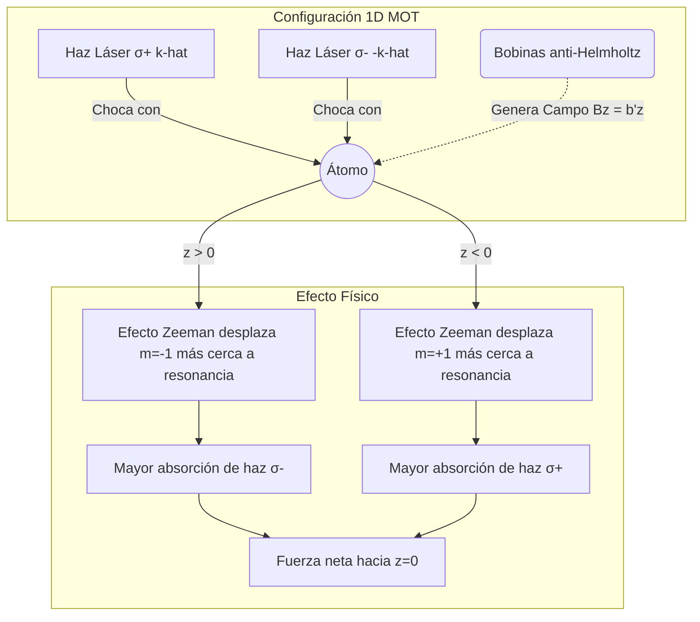

# Átomos Fríos y Óptica Cuántica

Esta es una de las fronteras más activas de la física moderna. Combina técnicas de enfriamiento y atrapamiento de átomos con el estudio cuántico de la luz para crear sistemas extremadamente controlables, donde se puede observar coherencia macroscópica, manipular qubits y probar modelos fundamentales.

## Conceptos Fundamentales

- **Enfriamiento láser**: Reduce el momento promedio de los átomos usando fuerzas radiativas.
- **Trampas magneto-ópticas**: Combinan campos magnéticos y luz para confinar átomos.
- **Átomos ultrafríos**: Regímenes donde la longitud de onda de de Broglie se vuelve macroscópica.
- **Condensado de Bose-Einstein**: Estado colectivo cuántico con ocupación macroscópica del estado fundamental.
- **Óptica cuántica**: Estudia fotones individuales, estados comprimidos, coherencia y entrelazamiento.

## Ideas Clave

### 1. Control experimental fino
Se pueden ajustar interacciones, geometrías y estados internos con una precisión extraordinaria.

### 2. Simulación cuántica
Estos sistemas permiten imitar materiales, redes y modelos difíciles de resolver teóricamente.

### 3. Aplicaciones
Relojes atómicos, sensores inerciales, metrología cuántica y computación cuántica óptica o atómica.

## 🧮 Desarrollo Teórico Profundo

El estudio de los átomos ultrafríos y la óptica cuántica requiere un riguroso tratamiento de la interacción entre la materia y la radiación electromagnética. En este capítulo exploraremos la derivación matemática paso a paso de los fenómenos fundamentales, desde el tratamiento semiclásico hasta la descripción completamente mecanocuántica.

### 1. Interacción Átomo-Luz: El Modelo de Dos Niveles

Consideremos un átomo con dos estados internos relevantes: el estado fundamental $|g\rangle$ y el estado excitado $|e\rangle$, separados por una energía $\hbar\omega_0$. El hamiltoniano atómico libre es:

$$
\hat{H}_A = \frac{\hbar\omega_0}{2} (|e\rangle\langle e| - |g\rangle\langle g|) = \frac{\hbar\omega_0}{2} \hat{\sigma}_z
$$

donde $\hat{\sigma}_z$ es la matriz de Pauli. Cuando este átomo interactúa con un campo electromagnético clásico monocromático $\mathbf{E}(\mathbf{r},t) = \mathbf{E}_0 \cos(\omega_L t - \mathbf{k}\cdot\mathbf{r})$, la interacción dipolar en la aproximación dipolar eléctrica viene dada por:

$$
\hat{H}_I = -\hat{\mathbf{d}} \cdot \mathbf{E}(\mathbf{r}_A, t)
$$

donde $\hat{\mathbf{d}} = -e\hat{\mathbf{r}}$ es el operador momento dipolar. Asumiendo que los estados atómicos tienen paridad definida, los elementos de matriz diagonales se anulan ($\langle e|\hat{\mathbf{d}}|e\rangle = \langle g|\hat{\mathbf{d}}|g\rangle = 0$). Por lo tanto, el operador momento dipolar toma la forma:

$$
\hat{\mathbf{d}} = \mathbf{d}_{eg} (|e\rangle\langle g| + |g\rangle\langle e|) = \mathbf{d}_{eg} (\hat{\sigma}^+ + \hat{\sigma}^-)
$$

El hamiltoniano total del sistema átomo-luz es $\hat{H} = \hat{H}_A + \hat{H}_I$. Sustituyendo $\mathbf{E}$ explícitamente:

$$
\hat{H}_I = -\mathbf{d}_{eg} \cdot \mathbf{E}_0 \cos(\omega_L t) (\hat{\sigma}^+ + \hat{\sigma}^-) = -\frac{\hbar\Omega_0}{2} \left(e^{i\omega_L t} + e^{-i\omega_L t}\right) (\hat{\sigma}^+ + \hat{\sigma}^-)
$$

donde hemos definido la **Frecuencia de Rabi** $\Omega_0 \equiv \frac{\mathbf{d}_{eg} \cdot \mathbf{E}_0}{\hbar}$ y asumimos $\mathbf{r}_A = 0$ por simplicidad. Expandiendo el producto, vemos que surgen términos oscilando a frecuencias $\omega_L$ y $-\omega_L$.

**Demostración Paso a Paso: Aproximación de Onda Rotante (RWA)**

1. Cambiamos al marco rotatorio de interacción. Un estado $|\psi(t)\rangle$ se transforma como $|\psi_I(t)\rangle = \hat{U}_0^\dagger(t)|\psi(t)\rangle$ con $\hat{U}_0(t) = \exp(-i\hat{H}_A t/\hbar) = \exp(-i\omega_0 t \hat{\sigma}_z / 2)$.
2. El hamiltoniano en el panorama de interacción es $\hat{H}_{I}(t) = \hat{U}_0^\dagger \hat{H}_I \hat{U}_0$.
3. Las matrices de Pauli se transforman como:
   $$
   \hat{U}_0^\dagger \hat{\sigma}^+ \hat{U}_0 = \hat{\sigma}^+ e^{i\omega_0 t}, \quad \hat{U}_0^\dagger \hat{\sigma}^- \hat{U}_0 = \hat{\sigma}^- e^{-i\omega_0 t}
   $$
4. Sustituyendo en $\hat{H}_{I}$:
   $$
   \hat{H}_{I}(t) = -\frac{\hbar\Omega_0}{2} \left( \hat{\sigma}^+ e^{i(\omega_0 + \omega_L)t} + \hat{\sigma}^+ e^{-i(\omega_L - \omega_0)t} + \hat{\sigma}^- e^{i(\omega_L - \omega_0)t} + \hat{\sigma}^- e^{-i(\omega_0 + \omega_L)t} \right)
   $$
5. La **Aproximación de Onda Rotante** nos indica que los términos oscilando a $\omega_0 + \omega_L$ son tan rápidos que promedian a cero en cualquier escala de tiempo experimental relevante (despreciables). Los descartamos, quedándonos solo con los términos de desintonización ("detuning") lenta $\Delta \equiv \omega_L - \omega_0$.
6. El hamiltoniano efectivo RWA resultante es:
   $$
   \hat{H}_{I}^{\text{RWA}} = -\frac{\hbar\Omega_0}{2} \left( \hat{\sigma}^+ e^{-i\Delta t} + \hat{\sigma}^- e^{i\Delta t} \right)
   $$

Con este hamiltoniano simplificado, podemos resolver la ecuación de Schrödinger. Suponiendo $|\psi(t)\rangle = c_g(t)|g\rangle + c_e(t)|e\rangle$, el sistema de ecuaciones diferenciales acopladas resulta en:

$$
i\dot{c}_e = -\frac{\Omega_0}{2} e^{-i\Delta t} c_g, \quad i\dot{c}_g = -\frac{\Omega_0}{2} e^{i\Delta t} c_e
$$

Para un estado inicial puramente fundamental ($c_g(0)=1, c_e(0)=0$), la probabilidad de estar en estado excitado es:

$$
P_e(t) = |c_e(t)|^2 = \frac{\Omega_0^2}{\Omega_0^2 + \Delta^2} \sin^2\left( \frac{\sqrt{\Omega_0^2 + \Delta^2}}{2} t \right)
$$

A esto se le conoce como **Oscilaciones de Rabi generalizadas**, con frecuencia $\Omega' = \sqrt{\Omega_0^2 + \Delta^2}$.

### 2. Fuerza de Dispersión y Enfriamiento Láser (Melaza Óptica)

El enfriamiento láser utiliza la fuerza radiativa de dispersión para reducir el impulso atómico de forma paulatina. Cada vez que un átomo absorbe un fotón del láser, recibe un "patadón" (kick) de momento $\hbar \mathbf{k}$. Cuando el átomo decae espontáneamente, emite un fotón en una dirección aleatoria. Tras $N$ ciclos, el momento transferido neto en la dirección de la emisión espontánea es $\sim \sqrt{N}\hbar k$, lo que crece más despacio que el momento direccional $\sim N\hbar k$ transferido por absorciones.

La fuerza media de dispersión es:

$$
\mathbf{F}_{sc} = \hbar \mathbf{k} \Gamma_{sc}
$$

donde $\Gamma_{sc}$ es la tasa de dispersión (probabilidad por segundo de completar un ciclo de absorción/emisión). Resolviendo las **Ecuaciones Ópticas de Bloch** para el elemento de la matriz densidad del estado excitado en el estado estacionario estacionario ($\rho_{ee}$), obtenemos:

$$
\Gamma_{sc} = \Gamma \rho_{ee} = \frac{\Gamma}{2} \frac{I/I_{sat}}{1 + I/I_{sat} + (2\Delta/\Gamma)^2}
$$

donde $I$ es la intensidad del láser, $I_{sat} = \hbar\omega_0^3 \Gamma / 12\pi c^2$ es la intensidad de saturación, y $\Gamma$ es la tasa de desintegración natural del átomo. 

**Enfriamiento Doppler 1D**

Consideremos ahora un átomo moviéndose a velocidad $v$ interactuando con dos haces láser contra-propagantes. Por efecto Doppler, el átomo "ve" la frecuencia del láser desfasada:
- Haz que viaja hacia $+x$ (el átomo lo enfrenta si $v < 0$): $\Delta_{eff}^+ = \Delta - kv$
- Haz que viaja hacia $-x$ (el átomo lo enfrenta si $v > 0$): $\Delta_{eff}^- = \Delta + kv$

La fuerza total experimentada en el eje $x$ es la suma de las fuerzas de dispersión de ambos haces (asumiendo campo débil $I \ll I_{sat}$ para minimizar acoplamientos):

$$
F_{Doppler} = F_{sc}(\Delta - kv) - F_{sc}(\Delta + kv)
$$

Si el átomo viaja lentamente ($kv \ll \Gamma$), expandimos en serie de Taylor de primer orden:

$$
F_{Doppler} \approx -2 \frac{\partial F_{sc}}{\partial \omega} k v \equiv -\alpha v
$$

Derivando de $\Gamma_{sc}$, obtenemos el coeficiente de fricción $\alpha$:

$$
\alpha = 4\hbar k^2 \frac{I}{I_{sat}} \frac{-2\Delta / \Gamma}{[1 + (2\Delta/\Gamma)^2]^2}
$$

Para tener enfriamiento ($\alpha > 0$, una fuerza que se oponga a la velocidad $v$), requerimos explícitamente $\Delta < 0$, es decir, **desintonización al rojo** (el láser está configurado ligeramente a menor frecuencia que la resonancia atómica).

### 3. Trampas Magneto-Ópticas (MOT)

Una fuerza viscosa $-\alpha v$ como la obtenida en enfriamiento láser (melaza óptica) frena a los átomos, pero no define un origen de coordenadas ni evita su difusión espacial. Para crear una trampa es necesario un gradiente de campo magnético acoplado a la estructura hiperfina atómica.

Sea un átomo con transición $J_g = 0 \to J_e = 1$. Los estados del nivel excitado $|m_e = -1, 0, 1\rangle$ se degeneran en energía para campo magnético $B=0$. Bajo el gradiente $B(z) = b' z$, se levanta esta degeneración mediante efecto Zeeman:

$$
\Delta E_{Zeeman} = \mu_B g_F m_e B(z) \implies \Delta\omega_{Zeeman} = \frac{\mu_B g_F b'}{\hbar} z \equiv \beta z
$$

Los dos láseres contrapropagantes tienen ahora diferente polarización: uno $\sigma^+$ excitando hacia $m_e = 1$ y el otro $\sigma^-$ excitando hacia $m_e = -1$.
- La desintonización efectiva del haz $\sigma^+$ será: $\Delta^+ = \Delta - k v - \beta z$
- La desintonización efectiva del haz $\sigma^-$ será: $\Delta^- = \Delta + k v + \beta z$

Insertando esto en la suma de las dos fuerzas y asumiendo $kv, \beta z \ll \Gamma$, volvemos a expandir en Taylor obteniendo una fuerza dependiente linealmente tanto de la posición como de la velocidad:

$$
F_{MOT} \approx -\alpha v - \kappa z
$$

donde la constante del muelle restaurador vale:

$$
\kappa = \alpha \frac{\beta}{k} = \alpha \frac{\mu_B g_F b'}{\hbar k}
$$

El átomo obedece la ecuación de un oscilador fuertemente sobreamortiguado que decae lentamente al centro de la trampa. Una trampa MOT en 3D requiere 3 pares de haces y una configuración de bobinas cuadrupolar esférica.

### 4. Condensados de Bose-Einstein: Teoría de Campo Medio y GP

Cuando confinamos átomos en una trampa magnética $\left(V_{ext}(\mathbf{r})\right)$ y los sobre-enfriamos por evaporación hasta el régimen de nanokelvin, sus paquetes de onda térmicos de de Broglie ($\lambda_{th} = \sqrt{2\pi\hbar^2/mk_BT}$) empiezan a traslaparse. Matemáticamente, cuando la degeneración en espacio de fases alcanza la condición:

$$
n \lambda_{th}^3 \ge 2.612 \quad \text{(Para potencial cúbico armónico 3D)}
$$

una fracción macroscópica de los bosones se condensa en el estado cuántico fundamental.

**Demostración Paso a Paso: La Ecuación de Gross-Pitaevskii**

Consideremos el hamiltoniano de N bosones interactuantes en segunda cuantización en términos del operador de campo de bosón $\hat{\Psi}(\mathbf{r})$:

$$
\hat{H} = \int d^3r \hat{\Psi}^\dagger(\mathbf{r}) \left[ -\frac{\hbar^2}{2m}\nabla^2 + V_{ext}(\mathbf{r}) \right] \hat{\Psi}(\mathbf{r}) + \frac{1}{2} \int d^3r \int d^3r' \hat{\Psi}^\dagger(\mathbf{r})\hat{\Psi}^\dagger(\mathbf{r}') V(\mathbf{r}-\mathbf{r}') \hat{\Psi}(\mathbf{r}')\hat{\Psi}(\mathbf{r})
$$

1. A temperaturas extremadamente frías, las colisiones interatómicas se dan exclusivamente mediante el canal de dispersión "onda-s", que es isótropo. Esto permite modelar el potencial interatómico como un pseudo-potencial de contacto asintótico de Fermi:
   $$
   V(\mathbf{r}-\mathbf{r}') = \frac{4\pi \hbar^2 a_s}{m} \delta^{(3)}(\mathbf{r} - \mathbf{r}') \equiv g \delta(\mathbf{r} - \mathbf{r}')
   $$
   donde $a_s$ es la longitud de esparcimiento en onda $s$.

2. Sustituyendo este pseudo-potencial en el hamiltoniano, el término de interacción se vuelve local:
   $$
   \hat{H}_{int} = \frac{g}{2} \int d^3r \hat{\Psi}^\dagger(\mathbf{r})\hat{\Psi}^\dagger(\mathbf{r})\hat{\Psi}(\mathbf{r})\hat{\Psi}(\mathbf{r})
   $$

3. Aplicamos la **Aproximación de Bogoliubov (Campo Medio)**, asumiendo que casi todas las partículas están en un estado macroscópico. Separamos el operador de campo en una función clásica $\psi(\mathbf{r}, t)$ (el parámetro de orden del BEC) y un operador perturbativo de fluctuaciones cuánticas $\delta\hat{\psi}(\mathbf{r}, t)$:
   $$
   \hat{\Psi}(\mathbf{r}, t) = \psi(\mathbf{r}, t) + \delta\hat{\psi}(\mathbf{r}, t)
   $$
   Dado que $N_0 \gg 1$, el conmutador $[\hat{\Psi}, \hat{\Psi}^\dagger] = \delta$ es pequeño frente a $|\psi|^2 \approx n$, por lo que tratamos $\hat{\Psi}$ como el c-número complejo $\psi(\mathbf{r},t)$.

4. La acción o funcional de energía se aproxima al escalar clásico:
   $$
   E[\psi, \psi^*] = \int d^3r \left( \frac{\hbar^2}{2m}|\nabla \psi|^2 + V_{ext}(\mathbf{r})|\psi|^2 + \frac{g}{2}|\psi|^4 \right)
   $$

5. Para la dinámica dependiente del tiempo, aplicamos el principio de acción estacionaria variacional $i\hbar \partial_t \psi = \delta E / \delta \psi^*$. Calculando la derivada funcional respecto al conjugado:
   $$
   \frac{\delta E}{\delta \psi^*} = -\frac{\hbar^2}{2m}\nabla^2\psi + V_{ext}(\mathbf{r})\psi + g|\psi|^2\psi
   $$

Esto nos conduce a la **Ecuación de Gross-Pitaevskii (GPE)**:

$$
i\hbar \frac{\partial \psi(\mathbf{r}, t)}{\partial t} = \left[ -\frac{\hbar^2}{2m}\nabla^2 + V_{ext}(\mathbf{r}) + g |\psi(\mathbf{r}, t)|^2 \right] \psi(\mathbf{r}, t)
$$

Esta es una ecuación de Schrödinger No Lineal. Las repulsiones ($g > 0$) causan un ensanchamiento de la nube atómica; las atracciones ($g < 0$) pueden conducir al colapso gravitatorio equivalente (Bosenova).

Para el estado estacionario $\psi(\mathbf{r}, t) = \phi(\mathbf{r})e^{-i\mu t/\hbar}$, donde $\mu$ es el potencial químico, recuperamos la GPE independiente del tiempo:

$$
\mu \phi = \left( -\frac{\hbar^2}{2m}\nabla^2 + V_{ext}(\mathbf{r}) + g |\phi|^2 \right) \phi
$$

**Aproximación de Thomas-Fermi**

Para un gran número de partículas, el término de repulsión interactiva $g|\phi|^2$ domina sobre la energía cinética "de presión cuántica" $\frac{\hbar^2}{2m}\nabla^2 \phi$. Despreciando el término cinético, la densidad $n(\mathbf{r}) = |\phi(\mathbf{r})|^2$ se despeja trivialmente en la **parábola de Thomas-Fermi**:

$$
n(\mathbf{r}) \approx \frac{\mu - V_{ext}(\mathbf{r})}{g} \quad (\text{si } \mu > V_{ext})
$$

Esta forma parabólica invertida, fuertemente contrastante con el perfil gaussiano de un gas térmico de Maxwell-Boltzmann, es la evidencia principal reportada en las primeras condensaciones por Cornell, Wieman y Ketterle (Premio Nobel 2001).

## 📚 Recursos Específicos

### Cursos Específicos
1. [Atomic and Optical Physics I - MIT OCW](https://ocw.mit.edu/courses/8-421-atomic-and-optical-physics-i-spring-2014/)
2. [Atomic and Optical Physics II - MIT OCW](https://ocw.mit.edu/courses/8-422-atomic-and-optical-physics-ii-spring-2013/)
3. [Quantum Optics - École Polytechnique (Coursera)](https://www.coursera.org/learn/quantum-optics-1)
4. [Laser Cooling and Trapping - UMD Physics](https://jqi.umd.edu/research/laser-cooling-and-trapping)
5. [Ultracold Quantum Gases - Collège de France](https://www.college-de-france.fr/site/en-jean-dalibard/index.htm)

### Artículos y Simulaciones
1. [Chu, S. (1998). *The manipulation of neutral particles*. Rev. Mod. Phys.](https://journals.aps.org/rmp/abstract/10.1103/RevModPhys.70.685)
2. [Cohen-Tannoudji, C. (1998). *Manipulating atoms with photons*. Rev. Mod. Phys.](https://journals.aps.org/rmp/abstract/10.1103/RevModPhys.70.707)
3. [Phillips, W. D. (1998). *Laser cooling and trapping of neutral atoms*. Rev. Mod. Phys.](https://journals.aps.org/rmp/abstract/10.1103/RevModPhys.70.721)
4. [Ketterle, W. (2002). *When atoms behave as waves: Bose-Einstein condensation and the atom laser*. Rev. Mod. Phys.](https://journals.aps.org/rmp/abstract/10.1103/RevModPhys.74.1131)
5. [Cornell, E. A., & Wieman, C. E. (2002). *Bose-Einstein condensation in a dilute gas*. Rev. Mod. Phys.](https://journals.aps.org/rmp/abstract/10.1103/RevModPhys.74.875)
6. [PhET Simulation: Quantum Interference](https://phet.colorado.edu/en/simulations/quantum-interference)
7. [PhET Simulation: Lasers](https://phet.colorado.edu/en/simulations/lasers)
8. [Bloch, I., Dalibard, J., & Zwerger, W. (2008). *Many-body physics with ultracold gases*. Rev. Mod. Phys.](https://journals.aps.org/rmp/abstract/10.1103/RevModPhys.80.885)

### 📖 Referencias Útiles y Bibliografía
- [Foot, C. J. (2005). *Atomic Physics*. Oxford University Press.](https://global.oup.com/academic/product/atomic-physics-9780198506966)
- [Metcalf, H. J., & van der Straten, P. (1999). *Laser Cooling and Trapping*. Springer.](https://link.springer.com/book/10.1007/978-1-4612-1470-0)
- [Pethick, C. J., & Smith, H. (2002). *Bose-Einstein Condensation in Dilute Gases*. Cambridge University Press.](https://www.cambridge.org/core/books/boseeinstein-condensation-in-dilute-gases/9B70C6558661E6DE9A1C63B4895D31D2)
- [Scully, M. O., & Zubairy, M. S. (1997). *Quantum Optics*. Cambridge University Press.](https://www.cambridge.org/core/books/quantum-optics/2C0485908FA5E1E66678C62A860F5E8E)
