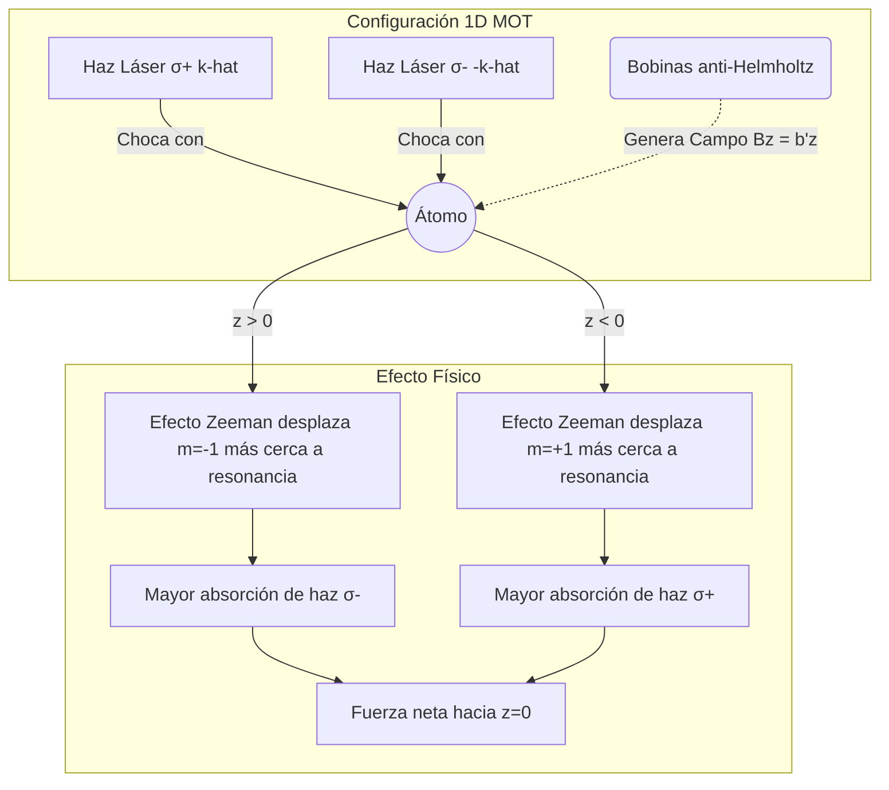

# Átomos Fríos y Óptica Cuántica

Esta es una de las fronteras más activas de la física moderna. Combina técnicas de enfriamiento y atrapamiento de átomos con el estudio cuántico de la luz para crear sistemas extremadamente controlables, donde se puede observar coherencia macroscópica, manipular qubits y probar modelos fundamentales.

## Conceptos Fundamentales

- **Enfriamiento láser**: Reduce el momento promedio de los átomos usando fuerzas radiativas.
- **Trampas magneto-ópticas**: Combinan campos magnéticos y luz para confinar átomos.
- **Átomos ultrafríos**: Regímenes donde la longitud de onda de de Broglie se vuelve macroscópica.
- **Condensado de Bose-Einstein**: Estado colectivo cuántico con ocupación macroscópica del estado fundamental.
- **Óptica cuántica**: Estudia fotones individuales, estados comprimidos, coherencia y entrelazamiento.

## Ideas Clave

### 1. Control experimental fino
Se pueden ajustar interacciones, geometrías y estados internos con una precisión extraordinaria.

### 2. Simulación cuántica
Estos sistemas permiten imitar materiales, redes y modelos difíciles de resolver teóricamente.

### 3. Aplicaciones
Relojes atómicos, sensores inerciales, metrología cuántica y computación cuántica óptica o atómica.

## 🧮 Desarrollo Teórico Profundo

El estudio de los átomos ultrafríos y la óptica cuántica requiere un riguroso tratamiento de la interacción entre la materia y la radiación electromagnética. En este capítulo exploraremos la derivación matemática paso a paso de los fenómenos fundamentales, desde el tratamiento semiclásico hasta la descripción completamente mecanocuántica.

### 1. Interacción Átomo-Luz: El Modelo de Dos Niveles

Consideremos un átomo con dos estados internos relevantes: el estado fundamental $|g\rangle$ y el estado excitado $|e\rangle$, separados por una energía $\hbar\omega_0$. El hamiltoniano atómico libre es:

$$
\hat{H}_A = \frac{\hbar\omega_0}{2} (|e\rangle\langle e| - |g\rangle\langle g|) = \frac{\hbar\omega_0}{2} \hat{\sigma}_z
$$

donde $\hat{\sigma}_z$ es la matriz de Pauli. Cuando este átomo interactúa con un campo electromagnético clásico monocromático $\mathbf{E}(\mathbf{r},t) = \mathbf{E}_0 \cos(\omega_L t - \mathbf{k}\cdot\mathbf{r})$, la interacción dipolar en la aproximación dipolar eléctrica viene dada por:

$$
\hat{H}_I = -\hat{\mathbf{d}} \cdot \mathbf{E}(\mathbf{r}_A, t)
$$

donde $\hat{\mathbf{d}} = -e\hat{\mathbf{r}}$ es el operador momento dipolar. Asumiendo que los estados atómicos tienen paridad definida, los elementos de matriz diagonales se anulan ($\langle e|\hat{\mathbf{d}}|e\rangle = \langle g|\hat{\mathbf{d}}|g\rangle = 0$). Por lo tanto, el operador momento dipolar toma la forma:

$$
\hat{\mathbf{d}} = \mathbf{d}_{eg} (|e\rangle\langle g| + |g\rangle\langle e|) = \mathbf{d}_{eg} (\hat{\sigma}^+ + \hat{\sigma}^-)
$$

El hamiltoniano total del sistema átomo-luz es $\hat{H} = \hat{H}_A + \hat{H}_I$. Sustituyendo $\mathbf{E}$ explícitamente:

$$
\hat{H}_I = -\mathbf{d}_{eg} \cdot \mathbf{E}_0 \cos(\omega_L t) (\hat{\sigma}^+ + \hat{\sigma}^-) = -\frac{\hbar\Omega_0}{2} \left(e^{i\omega_L t} + e^{-i\omega_L t}\right) (\hat{\sigma}^+ + \hat{\sigma}^-)
$$

donde hemos definido la **Frecuencia de Rabi** $\Omega_0 \equiv \frac{\mathbf{d}_{eg} \cdot \mathbf{E}_0}{\hbar}$ y asumimos $\mathbf{r}_A = 0$ por simplicidad. Expandiendo el producto, vemos que surgen términos oscilando a frecuencias $\omega_L$ y $-\omega_L$.

**Demostración Paso a Paso: Aproximación de Onda Rotante (RWA)**

1. Cambiamos al marco rotatorio de interacción. Un estado $|\psi(t)\rangle$ se transforma como $|\psi_I(t)\rangle = \hat{U}_0^\dagger(t)|\psi(t)\rangle$ con $\hat{U}_0(t) = \exp(-i\hat{H}_A t/\hbar) = \exp(-i\omega_0 t \hat{\sigma}_z / 2)$.
2. El hamiltoniano en el panorama de interacción es $\hat{H}_{I}(t) = \hat{U}_0^\dagger \hat{H}_I \hat{U}_0$.
3. Las matrices de Pauli se transforman como:
   $$
   \hat{U}_0^\dagger \hat{\sigma}^+ \hat{U}_0 = \hat{\sigma}^+ e^{i\omega_0 t}, \quad \hat{U}_0^\dagger \hat{\sigma}^- \hat{U}_0 = \hat{\sigma}^- e^{-i\omega_0 t}
   $$
4. Sustituyendo en $\hat{H}_{I}$:
   $$
   \hat{H}_{I}(t) = -\frac{\hbar\Omega_0}{2} \left( \hat{\sigma}^+ e^{i(\omega_0 + \omega_L)t} + \hat{\sigma}^+ e^{-i(\omega_L - \omega_0)t} + \hat{\sigma}^- e^{i(\omega_L - \omega_0)t} + \hat{\sigma}^- e^{-i(\omega_0 + \omega_L)t} \right)
   $$
5. La **Aproximación de Onda Rotante** nos indica que los términos oscilando a $\omega_0 + \omega_L$ son tan rápidos que promedian a cero en cualquier escala de tiempo experimental relevante (despreciables). Los descartamos, quedándonos solo con los términos de desintonización ("detuning") lenta $\Delta \equiv \omega_L - \omega_0$.
6. El hamiltoniano efectivo RWA resultante es:
   $$
   \hat{H}_{I}^{\text{RWA}} = -\frac{\hbar\Omega_0}{2} \left( \hat{\sigma}^+ e^{-i\Delta t} + \hat{\sigma}^- e^{i\Delta t} \right)
   $$

Con este hamiltoniano simplificado, podemos resolver la ecuación de Schrödinger. Suponiendo $|\psi(t)\rangle = c_g(t)|g\rangle + c_e(t)|e\rangle$, el sistema de ecuaciones diferenciales acopladas resulta en:

$$
i\dot{c}_e = -\frac{\Omega_0}{2} e^{-i\Delta t} c_g, \quad i\dot{c}_g = -\frac{\Omega_0}{2} e^{i\Delta t} c_e
$$

Para un estado inicial puramente fundamental ($c_g(0)=1, c_e(0)=0$), la probabilidad de estar en estado excitado es:

$$
P_e(t) = |c_e(t)|^2 = \frac{\Omega_0^2}{\Omega_0^2 + \Delta^2} \sin^2\left( \frac{\sqrt{\Omega_0^2 + \Delta^2}}{2} t \right)
$$

A esto se le conoce como **Oscilaciones de Rabi generalizadas**, con frecuencia $\Omega' = \sqrt{\Omega_0^2 + \Delta^2}$.

### 2. Fuerza de Dispersión y Enfriamiento Láser (Melaza Óptica)

El enfriamiento láser utiliza la fuerza radiativa de dispersión para reducir el impulso atómico de forma paulatina. Cada vez que un átomo absorbe un fotón del láser, recibe un "patadón" (kick) de momento $\hbar \mathbf{k}$. Cuando el átomo decae espontáneamente, emite un fotón en una dirección aleatoria. Tras $N$ ciclos, el momento transferido neto en la dirección de la emisión espontánea es $\sim \sqrt{N}\hbar k$, lo que crece más despacio que el momento direccional $\sim N\hbar k$ transferido por absorciones.

La fuerza media de dispersión es:

$$
\mathbf{F}_{sc} = \hbar \mathbf{k} \Gamma_{sc}
$$

donde $\Gamma_{sc}$ es la tasa de dispersión (probabilidad por segundo de completar un ciclo de absorción/emisión). Resolviendo las **Ecuaciones Ópticas de Bloch** para el elemento de la matriz densidad del estado excitado en el estado estacionario estacionario ($\rho_{ee}$), obtenemos:

$$
\Gamma_{sc} = \Gamma \rho_{ee} = \frac{\Gamma}{2} \frac{I/I_{sat}}{1 + I/I_{sat} + (2\Delta/\Gamma)^2}
$$

donde $I$ es la intensidad del láser, $I_{sat} = \hbar\omega_0^3 \Gamma / 12\pi c^2$ es la intensidad de saturación, y $\Gamma$ es la tasa de desintegración natural del átomo. 

**Enfriamiento Doppler 1D**

Consideremos ahora un átomo moviéndose a velocidad $v$ interactuando con dos haces láser contra-propagantes. Por efecto Doppler, el átomo "ve" la frecuencia del láser desfasada:
- Haz que viaja hacia $+x$ (el átomo lo enfrenta si $v < 0$): $\Delta_{eff}^+ = \Delta - kv$
- Haz que viaja hacia $-x$ (el átomo lo enfrenta si $v > 0$): $\Delta_{eff}^- = \Delta + kv$

La fuerza total experimentada en el eje $x$ es la suma de las fuerzas de dispersión de ambos haces (asumiendo campo débil $I \ll I_{sat}$ para minimizar acoplamientos):

$$
F_{Doppler} = F_{sc}(\Delta - kv) - F_{sc}(\Delta + kv)
$$

Si el átomo viaja lentamente ($kv \ll \Gamma$), expandimos en serie de Taylor de primer orden:

$$
F_{Doppler} \approx -2 \frac{\partial F_{sc}}{\partial \omega} k v \equiv -\alpha v
$$

Derivando de $\Gamma_{sc}$, obtenemos el coeficiente de fricción $\alpha$:

$$
\alpha = 4\hbar k^2 \frac{I}{I_{sat}} \frac{-2\Delta / \Gamma}{[1 + (2\Delta/\Gamma)^2]^2}
$$

Para tener enfriamiento ($\alpha > 0$, una fuerza que se oponga a la velocidad $v$), requerimos explícitamente $\Delta < 0$, es decir, **desintonización al rojo** (el láser está configurado ligeramente a menor frecuencia que la resonancia atómica).

### 3. Trampas Magneto-Ópticas (MOT)

Una fuerza viscosa $-\alpha v$ como la obtenida en enfriamiento láser (melaza óptica) frena a los átomos, pero no define un origen de coordenadas ni evita su difusión espacial. Para crear una trampa es necesario un gradiente de campo magnético acoplado a la estructura hiperfina atómica.



Sea un átomo con transición $J_g = 0 \to J_e = 1$. Los estados del nivel excitado $|m_e = -1, 0, 1\rangle$ se degeneran en energía para campo magnético $B=0$. Bajo el gradiente $B(z) = b' z$, se levanta esta degeneración mediante efecto Zeeman:

$$
\Delta E_{Zeeman} = \mu_B g_F m_e B(z) \implies \Delta\omega_{Zeeman} = \frac{\mu_B g_F b'}{\hbar} z \equiv \beta z
$$

Los dos láseres contrapropagantes tienen ahora diferente polarización: uno $\sigma^+$ excitando hacia $m_e = 1$ y el otro $\sigma^-$ excitando hacia $m_e = -1$.
- La desintonización efectiva del haz $\sigma^+$ será: $\Delta^+ = \Delta - k v - \beta z$
- La desintonización efectiva del haz $\sigma^-$ será: $\Delta^- = \Delta + k v + \beta z$

Insertando esto en la suma de las dos fuerzas y asumiendo $kv, \beta z \ll \Gamma$, volvemos a expandir en Taylor obteniendo una fuerza dependiente linealmente tanto de la posición como de la velocidad:

$$
F_{MOT} \approx -\alpha v - \kappa z
$$

donde la constante del muelle restaurador vale:

$$
\kappa = \alpha \frac{\beta}{k} = \alpha \frac{\mu_B g_F b'}{\hbar k}
$$

El átomo obedece la ecuación de un oscilador fuertemente sobreamortiguado que decae lentamente al centro de la trampa. Una trampa MOT en 3D requiere 3 pares de haces y una configuración de bobinas cuadrupolar esférica.

### 4. Condensados de Bose-Einstein: Teoría de Campo Medio y GP

Cuando confinamos átomos en una trampa magnética $\left(V_{ext}(\mathbf{r})\right)$ y los sobre-enfriamos por evaporación hasta el régimen de nanokelvin, sus paquetes de onda térmicos de de Broglie ($\lambda_{th} = \sqrt{2\pi\hbar^2/mk_BT}$) empiezan a traslaparse. Matemáticamente, cuando la degeneración en espacio de fases alcanza la condición:

$$
n \lambda_{th}^3 \ge 2.612 \quad \text{(Para potencial cúbico armónico 3D)}
$$

una fracción macroscópica de los bosones se condensa en el estado cuántico fundamental.

**Demostración Paso a Paso: La Ecuación de Gross-Pitaevskii**

Consideremos el hamiltoniano de N bosones interactuantes en segunda cuantización en términos del operador de campo de bosón $\hat{\Psi}(\mathbf{r})$:

$$
\hat{H} = \int d^3r \hat{\Psi}^\dagger(\mathbf{r}) \left[ -\frac{\hbar^2}{2m}\nabla^2 + V_{ext}(\mathbf{r}) \right] \hat{\Psi}(\mathbf{r}) + \frac{1}{2} \int d^3r \int d^3r' \hat{\Psi}^\dagger(\mathbf{r})\hat{\Psi}^\dagger(\mathbf{r}') V(\mathbf{r}-\mathbf{r}') \hat{\Psi}(\mathbf{r}')\hat{\Psi}(\mathbf{r})
$$

1. A temperaturas extremadamente frías, las colisiones interatómicas se dan exclusivamente mediante el canal de dispersión "onda-s", que es isótropo. Esto permite modelar el potencial interatómico como un pseudo-potencial de contacto asintótico de Fermi:
   $$
   V(\mathbf{r}-\mathbf{r}') = \frac{4\pi \hbar^2 a_s}{m} \delta^{(3)}(\mathbf{r} - \mathbf{r}') \equiv g \delta(\mathbf{r} - \mathbf{r}')
   $$
   donde $a_s$ es la longitud de esparcimiento en onda $s$.

2. Sustituyendo este pseudo-potencial en el hamiltoniano, el término de interacción se vuelve local:
   $$
   \hat{H}_{int} = \frac{g}{2} \int d^3r \hat{\Psi}^\dagger(\mathbf{r})\hat{\Psi}^\dagger(\mathbf{r})\hat{\Psi}(\mathbf{r})\hat{\Psi}(\mathbf{r})
   $$

3. Aplicamos la **Aproximación de Bogoliubov (Campo Medio)**, asumiendo que casi todas las partículas están en un estado macroscópico. Separamos el operador de campo en una función clásica $\psi(\mathbf{r}, t)$ (el parámetro de orden del BEC) y un operador perturbativo de fluctuaciones cuánticas $\delta\hat{\psi}(\mathbf{r}, t)$:
   $$
   \hat{\Psi}(\mathbf{r}, t) = \psi(\mathbf{r}, t) + \delta\hat{\psi}(\mathbf{r}, t)
   $$
   Dado que $N_0 \gg 1$, el conmutador $[\hat{\Psi}, \hat{\Psi}^\dagger] = \delta$ es pequeño frente a $|\psi|^2 \approx n$, por lo que tratamos $\hat{\Psi}$ como el c-número complejo $\psi(\mathbf{r},t)$.

4. La acción o funcional de energía se aproxima al escalar clásico:
   $$
   E[\psi, \psi^*] = \int d^3r \left( \frac{\hbar^2}{2m}|\nabla \psi|^2 + V_{ext}(\mathbf{r})|\psi|^2 + \frac{g}{2}|\psi|^4 \right)
   $$

5. Para la dinámica dependiente del tiempo, aplicamos el principio de acción estacionaria variacional $i\hbar \partial_t \psi = \delta E / \delta \psi^*$. Calculando la derivada funcional respecto al conjugado:
   $$
   \frac{\delta E}{\delta \psi^*} = -\frac{\hbar^2}{2m}\nabla^2\psi + V_{ext}(\mathbf{r})\psi + g|\psi|^2\psi
   $$

Esto nos conduce a la **Ecuación de Gross-Pitaevskii (GPE)**:

$$
i\hbar \frac{\partial \psi(\mathbf{r}, t)}{\partial t} = \left[ -\frac{\hbar^2}{2m}\nabla^2 + V_{ext}(\mathbf{r}) + g |\psi(\mathbf{r}, t)|^2 \right] \psi(\mathbf{r}, t)
$$

Esta es una ecuación de Schrödinger No Lineal. Las repulsiones ($g > 0$) causan un ensanchamiento de la nube atómica; las atracciones ($g < 0$) pueden conducir al colapso gravitatorio equivalente (Bosenova).

Para el estado estacionario $\psi(\mathbf{r}, t) = \phi(\mathbf{r})e^{-i\mu t/\hbar}$, donde $\mu$ es el potencial químico, recuperamos la GPE independiente del tiempo:

$$
\mu \phi = \left( -\frac{\hbar^2}{2m}\nabla^2 + V_{ext}(\mathbf{r}) + g |\phi|^2 \right) \phi
$$

**Aproximación de Thomas-Fermi**

Para un gran número de partículas, el término de repulsión interactiva $g|\phi|^2$ domina sobre la energía cinética "de presión cuántica" $\frac{\hbar^2}{2m}\nabla^2 \phi$. Despreciando el término cinético, la densidad $n(\mathbf{r}) = |\phi(\mathbf{r})|^2$ se despeja trivialmente en la **parábola de Thomas-Fermi**:

$$
n(\mathbf{r}) \approx \frac{\mu - V_{ext}(\mathbf{r})}{g} \quad (\text{si } \mu > V_{ext})
$$

Esta forma parabólica invertida, fuertemente contrastante con el perfil gaussiano de un gas térmico de Maxwell-Boltzmann, es la evidencia principal reportada en las primeras condensaciones por Cornell, Wieman y Ketterle (Premio Nobel 2001).

## 📝 Guía de Ejercicios Resueltos

### Ejercicio 1: Efecto Stark Lineal en el Átomo de Hidrógeno
Considere un átomo de hidrógeno en el primer estado excitado ($n=2$) sometido a un campo eléctrico externo uniforme $\vec{\mathcal{E}} = \mathcal{E}_0 \hat{z}$. Calcule el corrimiento de los niveles de energía utilizando la teoría de perturbaciones degenerada de primer orden.

**Solución paso a paso:**
1. Los estados degenerados para $n=2$ son $|2,0,0\rangle$, $|2,1,0\rangle$, $|2,1,1\rangle$, y $|2,1,-1\rangle$ en la base $|n,l,m\rangle$.
2. El Hamiltoniano de perturbación es $H' = e \mathcal{E}_0 z = e \mathcal{E}_0 r \cos\theta$.
3. Los elementos de matriz de $H'$ solo son no nulos si $\Delta m = 0$ y $\Delta l = \pm 1$ debido a las reglas de selección.
4. Por lo tanto, el único elemento no diagonal no nulo es entre $|2,0,0\rangle$ y $|2,1,0\rangle$:
   $$ \langle 2,0,0 | H' | 2,1,0 \rangle = e \mathcal{E}_0 \int d^3r \psi_{200}^* z \psi_{210} = -3 e \mathcal{E}_0 a_0 $$
   donde $a_0$ es el radio de Bohr.
5. La matriz de perturbación en la sub-base $\{|2,0,0\rangle, |2,1,0\rangle, |2,1,1\rangle, |2,1,-1\rangle\}$ es:
   $$ H' = \begin{pmatrix} 0 & -3ea_0\mathcal{E}_0 & 0 & 0 \\ -3ea_0\mathcal{E}_0 & 0 & 0 & 0 \\ 0 & 0 & 0 & 0 \\ 0 & 0 & 0 & 0 \end{pmatrix} $$
6. Los autovalores son $\Delta E = \pm 3 e a_0 \mathcal{E}_0$ y $0$ (doblemente degenerado).

### Ejercicio 2: Espectro Rotovibracional de la Molécula de Diatómica
Derive la expresión para los niveles de energía rotovibracionales de una molécula diatómica tratada como un oscilador armónico y rotor rígido acoplados, incluyendo la corrección de distorsión centrífuga. 

**Solución paso a paso:**
1. El Hamiltoniano molecular efectivo es $H = \frac{P^2}{2\mu} + \frac{L^2}{2\mu R^2} + V(R)$.
2. Expandiendo el potencial alrededor del mínimo $R_e$: $V(R) \approx \frac{1}{2} k (R - R_e)^2$.
3. La energía a orden cero es $E_{v,J} = \hbar \omega \left(v + \frac{1}{2}\right) + B_e J(J+1)$, donde $B_e = \frac{\hbar^2}{2\mu R_e^2}$.
4. Para la distorsión centrífuga, el mínimo efectivo de la energía potencial efectiva $V_{\text{eff}}(R) = V(R) + \frac{\hbar^2 J(J+1)}{2\mu R^2}$ se desplaza.
5. Minimizando $V_{\text{eff}}$: $k(R_c - R_e) - \frac{\hbar^2 J(J+1)}{\mu R_c^3} = 0 \implies \Delta R \approx \frac{\hbar^2 J(J+1)}{k \mu R_e^3}$.
6. Sustituyendo de nuevo en la energía, el término de corrección es $-D_e J^2(J+1)^2$, donde $D_e = \frac{4B_e^3}{\hbar^2 \omega^2}$.
7. La energía final es $E_{v,J} = \hbar \omega \left(v + \frac{1}{2}\right) + B_e J(J+1) - D_e J^2(J+1)^2$.

### Ejercicio 3: Condensación de Bose-Einstein en una Trampa Armónica
Determine la temperatura crítica $T_c$ para la condensación de Bose-Einstein de un gas ideal de $N$ bosones atrapados en un potencial armónico tridimensional isotrópico $V(r) = \frac{1}{2} m \omega^2 r^2$.

**Solución paso a paso:**
1. La densidad de estados para un oscilador armónico 3D es $g(E) = \frac{E^2}{2(\hbar\omega)^3}$.
2. El número total de partículas en estados excitados viene dado por la integral:
   $$ N_{ex} = \int_0^\infty \frac{g(E)}{e^{\beta (E-\mu)} - 1} dE $$
3. En la temperatura crítica $T_c$, el potencial químico $\mu \to 0$ y $N_{ex} = N$.
4. Reemplazando $g(E)$ e introduciendo $x = E/k_B T_c$:
   $$ N = \frac{(k_B T_c)^3}{2(\hbar\omega)^3} \int_0^\infty \frac{x^2}{e^x - 1} dx $$
5. La integral es conocida como $\Gamma(3)\zeta(3) = 2 \times 1.202$.
6. Resolviendo para $T_c$:
   $$ N = \left( \frac{k_B T_c}{\hbar\omega} \right)^3 \zeta(3) \implies T_c = \frac{\hbar\omega}{k_B} \left( \frac{N}{\zeta(3)} \right)^{1/3} $$

## 💻 Simulaciones Computacionales

Este script resuelve la ecuación no lineal de Gross-Pitaevskii (GPE) para el estado fundamental de un Condensado de Bose-Einstein (BEC) atrapado en un potencial armónico 1D, simulando el efecto de las repulsiones atómicas usando un método de evolución en tiempo imaginario.

```python
import numpy as np
import matplotlib.pyplot as plt

# Parámetros del grid y de simulación
N = 512
x_max = 10.0
x = np.linspace(-x_max, x_max, N)
dx = x[1] - x[0]
dt = 0.005  # Paso de tiempo imaginario
steps = 2000

# Potencial Armónico de la Trampa Magnética
V = 0.5 * x**2

# Fuerza de interacción entre átomos (parámetro no lineal g)
# g > 0 implica repulsión (ensanchamiento del condensado)
g_values = [0.0, 10.0, 50.0]

plt.figure(figsize=(10, 6))
plt.plot(x, V, 'k--', label='Potencial de Trampa $V(x)$')

for g in g_values:
    # Estado inicial gaussiano de prueba
    psi = np.exp(-0.5 * x**2)
    psi /= np.sqrt(np.sum(np.abs(psi)**2) * dx)
    
    # Evolución en tiempo imaginario (psi -> exp(-H*tau) psi)
    # Utilizamos el método Split-Step Fourier
    k = np.fft.fftfreq(N, d=dx) * 2 * np.pi
    T_op = np.exp(-0.5 * k**2 * dt)
    
    for _ in range(steps):
        # Medio paso espacial (Potencial + Interacción no lineal)
        V_eff = V + g * np.abs(psi)**2
        psi *= np.exp(-0.5 * V_eff * dt)
        
        # Paso en el espacio de momentos (Energía cinética)
        psi = np.fft.fft(psi)
        psi *= T_op
        psi = np.fft.ifft(psi)
        
        # Medio paso espacial restante
        V_eff = V + g * np.abs(psi)**2
        psi *= np.exp(-0.5 * V_eff * dt)
        
        # Renormalización obligatoria en tiempo imaginario
        psi /= np.sqrt(np.sum(np.abs(psi)**2) * dx)
        
    densidad = np.abs(psi)**2
    plt.plot(x, densidad, lw=2, label=f'BEC Densidad (g={g})')

plt.xlim(-6, 6)
plt.ylim(0, 1.2)
plt.xlabel('Posición x')
plt.ylabel('Densidad $|\psi(x)|^2$')
plt.title('Estado Fundamental de un BEC (Ecuación de Gross-Pitaevskii)')
plt.legend()
plt.grid(alpha=0.3)
plt.tight_layout()
# plt.show()
```

## 🚀 Fronteras de Investigación y Problemas Abiertos

La física de átomos fríos y óptica cuántica en 2026 representa la plataforma más poderosa y madura de simulación cuántica analógica y digital. La frontera más activa actual es el uso de **Arreglos de Pinzas Ópticas (Optical Tweezer Arrays) con Átomos de Rydberg**. La interacción a larga distancia de van der Waals (escalando como $1/r^6$) permite implementar compuertas multiqubit con precisiones por encima del 99.9%, abordando dinámicas de spin glasses, caos cuántico y modelado de lattice gauge theories de física de altas energías. Asimismo, la consecución e investigación de fases de materia extrañas es abrumadora: las Fases Supersólidas (un estado paradójico de la materia que es superfluido y rompe la simetría de traslación simultáneamente) son sondadas en condensados dipolares (Erbio, Disprosio). Además, los microscopios de gas cuántico con resolución a nivel de un solo átomo permiten la medición de entropías de entrelazamiento puro midiendo directamente réplicas del estado (protocolos de interferometría de muchos cuerpos).

## 📐 Formalismo Matemático Avanzado (Nivel Posgrado/Doctorado)

El tratamiento riguroso de gases cuánticos y sistemas abiertos interaccionando con fotones y disipación térmica recurre al **Formalismo de Integrales de Camino de Keldysh-Schwinger** para dinámicas fuera de equilibrio. Un sistema atómico acoplado a un baño térmico markoviano se describe no por vectores de estado, sino mediante operadores de matriz densidad reducida $\hat{\rho}$ regidos por la **Ecuación Maestra de Lindblad**, generadora de un semigrupo dinámico cuántico que garantiza mapas completamente positivos y preservadores de traza (CPTP):

$$ \frac{\partial \hat{\rho}}{\partial t} = -\frac{i}{\hbar}[\hat{H}, \hat{\rho}] + \sum_i \gamma_i \left( \hat{L}_i \hat{\rho} \hat{L}_i^\dagger - \frac{1}{2} \{ \hat{L}_i^\dagger \hat{L}_i, \hat{\rho} \} \right) $$

Donde los operadores de salto $\hat{L}_i$ inducen decoherencia, bombeo láser o emisión espontánea fotónica con tasas $\gamma_i$. 

Para la manipulación en redes ópticas, cuando los átomos se enfrían por debajo de la brecha de banda a los estados de Wannier en la banda más baja, el hamiltoniano de campo medio diverge en una teoría de granos correlacionados dada por el **Modelo de Bose-Hubbard**:

$$ \hat{H}_{\text{BH}} = -t \sum_{\langle i,j \rangle} \left(\hat{b}_i^\dagger \hat{b}_j + \text{h.c.}\right) + \frac{U}{2}\sum_i \hat{n}_i(\hat{n}_i - 1) - \mu \sum_i \hat{n}_i $$

La transición de fase cuántica entre un estado Superfluido (SF) delocalizado y un Aislante de Mott (MI) localizado a $T=0$ no está regida por fluctuaciones térmicas, sino por el ratio parámetro de interacción $U/t$. Analizando la acción euclídea acoplada y realizando una expansión teórica de perturbaciones en grupos de renormalización cuántica, se detecta un comportamiento de clase de universalidad XY-$d+1$ en el régimen en el que los cuasigujeros de Mott colapsan bajo presión de potencial químico (condición incompresible $\partial \langle n \rangle / \partial \mu = 0$).

## 📚 Recursos Específicos
### 🎓 Cursos y Clases Recomendadas
1. [MIT OCW 8.421 Atomic and Optical Physics I (Wolfgang Ketterle)](https://ocw.mit.edu/courses/8-421-atomic-and-optical-physics-i-spring-2014/): Curso profundo impartido por un Premio Nobel sobre las interacciones átomo-fotón, osciladores de Rabi y fuerzas dispersivas.
2. [MIT OCW 8.422 Atomic and Optical Physics II](https://ocw.mit.edu/courses/8-422-atomic-and-optical-physics-ii-spring-2013/): Continuación enfocada en el enfriamiento láser, atrapamiento y el estudio de los gases degenerados de Bose y Fermi.
3. [Collège de France - Ultracold Quantum Gases (Jean Dalibard)](https://www.college-de-france.fr/site/en-jean-dalibard/index.htm): Conferencias magistrales avanzadas sobre fluidos cuánticos y gases ultrafríos.

### 📝 Artículos Científicos Clave
1. **Anderson, M. H., Ensher, J. R., Matthews, M. R., Wieman, C. E., & Cornell, E. A. (1995). "Observation of Bose-Einstein Condensation in a Dilute Atomic Vapor"**. *Science*, 269(5221), 198-201. [DOI: 10.1126/science.269.5221.198](https://doi.org/10.1126/science.269.5221.198)
   *Importancia Teórica y Matemática:* Demuestra por primera vez un BEC en un gas térmico tridimensional confinado armónicamente. La dinámica obedece la teoría de campo medio de Gross-Pitaevskii:
   $$ \left( -\frac{\hbar^2}{2m}\nabla^2 + V_{\text{ext}} + g|\psi|^2 \right) \psi = \mu \psi $$
   *Implicaciones Físicas:* Premio Nobel de Física en 2001. Comprobó la predicción de Einstein sobre el surgimiento de coherencia macroscópica masiva bajo $T_c \approx 170$ nK, instaurando un sistema modelo para la simulación de física de materia condensada.

2. **Chu, S. (1998). "The manipulation of neutral particles"**. *Rev. Mod. Phys.*, 70(3), 685-706. [DOI: 10.1103/RevModPhys.70.685](https://doi.org/10.1103/RevModPhys.70.685)
   *Importancia Teórica y Matemática:* Artículo de conferencia Nobel que destila la base de las fuerzas de dispersión atómicas y los coeficientes de fricción sub-Doppler:
   $$ F_{\text{Doppler}} \approx -4\hbar k^2 \frac{I}{I_{\text{sat}}} \frac{-2\Delta/\Gamma}{(1+(2\Delta/\Gamma)^2)^2} v \equiv -\alpha v $$
   *Implicaciones Físicas:* Desarrolló conceptualmente el mecanismo de la "melaza óptica" tridimensional, permitiendo enfriar gases neutrales hasta la barrera del límite Doppler e infranqueando el camino al condensado de Bose-Einstein.

3. **Raab, E. L., Prentiss, M., Cable, A., Chu, S., & Pritchard, D. E. (1987). "Trapping of Neutral Sodium Atoms with Radiation Pressure"**. *Phys. Rev. Lett.*, 59(23), 2631-2634. [DOI: 10.1103/PhysRevLett.59.2631](https://doi.org/10.1103/PhysRevLett.59.2631)
   *Importancia Teórica y Matemática:* Presenta el desarrollo de la Trampa Magneto-Óptica (MOT), uniendo los efectos radiativos (enfriamiento Doppler) con un gradiente cuadrupolar magnético:
   $$ \Delta_{\text{eff}}^{\pm} = \Delta \mp kv \mp \frac{\mu_B g_F}{\hbar} b' z $$
   *Implicaciones Físicas:* La MOT generó simultáneamente confinamiento espacial ($-\kappa z$) y disipación de momento ($-\alpha v$). Hoy en día representa el estándar dorado en los laboratorios de átomos fríos y cuánticos.

### 📖 Referencias Útiles y Bibliografía
1. **Libro**: [Foot, C. J. (2005). *Atomic Physics*. Oxford University Press](https://global.oup.com/academic/product/atomic-physics-9780198506966). Referencia definitiva para enfriamiento láser y trampa magnetoóptica.
2. **Libro**: [Metcalf, H. J., & van der Straten, P. (1999). *Laser Cooling and Trapping*. Springer](https://link.springer.com/book/10.1007/978-1-4612-1470-0).
3. **Libro**: [Pethick, C. J., & Smith, H. (2002). *Bose-Einstein Condensation in Dilute Gases*. Cambridge University Press](https://www.cambridge.org/core/books/boseeinstein-condensation-in-dilute-gases/9B70C6558661E6DE9A1C63B4895D31D2). Deriva detalladamente la ecuación de Gross-Pitaevskii.
