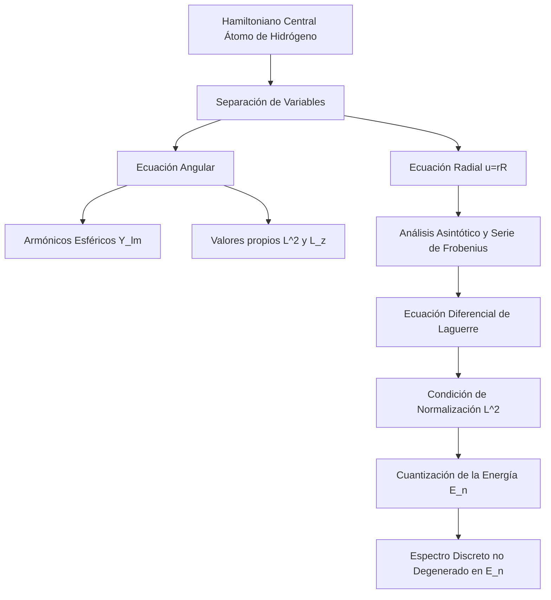

# Estructura Atómica

La estructura atómica se ocupa de la organización de electrones, protones y neutrones dentro del átomo, utilizando la mecánica cuántica como herramienta principal para describir el comportamiento electrónico.

## 📜 Contexto Histórico

Desde el modelo planetario de Rutherford (1911) hasta la cuantización propuesta por Niels Bohr (1913), la estructura atómica revolucionó la física. En 1925-1926, Heisenberg y Schrödinger formularon la mecánica cuántica moderna. Posteriormente, Dirac introdujo la relatividad en 1928, prediciendo la existencia del espín del electrón y la antimateria.

## 🧮 Desarrollo Teórico Profundo

La formulación de la mecánica cuántica aplicada a la estructura atómica constituye uno de los pilares de la física moderna. Su abordaje riguroso comienza resolviendo exactamente el átomo hidrogenoide (un núcleo de carga $+Ze$ y un solo electrón) y luego empleando técnicas perturbativas y métodos variacionales para extender el tratamiento a sistemas multielectrónicos complejos.

### 1. El Hamiltoniano Central y la Separación de Variables

Para un átomo hidrogenoide no relativista, modelamos el sistema como dos masas interactuantes: un núcleo de masa $M$ y un electrón de masa $m_e$. Adoptando un marco de referencia en el centro de masa del sistema, el problema de dos cuerpos se reduce al movimiento de una sola partícula ficticia con una **masa reducida** $\mu = \frac{m_e M}{m_e + M}$. Dado que $M \gg m_e$, $\mu \approx m_e$.

El Hamiltoniano que rige el sistema cuántico sometido al potencial central electromagnético (fuerza de Coulomb) es:

$$ \hat{H} = - \frac{\hbar^2}{2\mu} \nabla^2 - \frac{Z e^2}{4 \pi \epsilon_0 r} $$

La ecuación fundamental de Schrödinger independiente del tiempo es $\hat{H}\psi(\mathbf{r}) = E\psi(\mathbf{r})$. Aprovechando la simetría esférica intrínseca del potencial central, transformamos el laplaciano $\nabla^2$ a coordenadas esféricas $(r, \theta, \phi)$:

$$ \nabla^2 = \frac{1}{r^2} \frac{\partial}{\partial r} \left( r^2 \frac{\partial}{\partial r} \right) + \frac{1}{r^2 \sin\theta} \frac{\partial}{\partial \theta} \left( \sin\theta \frac{\partial}{\partial \theta} \right) + \frac{1}{r^2 \sin^2\theta} \frac{\partial^2}{\partial \phi^2} $$

Reconociendo que los últimos dos términos corresponden precisamente al operador cuadrado del momento angular orbital $\hat{L}^2$ dividido por $\hbar^2 r^2$, reescribimos:

$$ \hat{H} = -\frac{\hbar^2}{2\mu} \frac{1}{r^2} \frac{\partial}{\partial r} \left( r^2 \frac{\partial}{\partial r} \right) + \frac{\hat{L}^2}{2\mu r^2} - \frac{Z e^2}{4\pi\epsilon_0 r} $$

Al conmutar el Hamiltoniano central con el momento angular total $[\hat{H}, \hat{L}^2] = 0$ y su componente z $[\hat{H}, \hat{L}_z] = 0$, aseguramos la existencia de una base común de autoestados. Esto justifica invocar el método de separación de variables:

$$ \psi(r, \theta, \phi) = R(r) Y_{l}^{m_l}(\theta, \phi) $$

Donde $Y_{l}^{m_l}(\theta, \phi)$ denota los **Armónicos Esféricos**. Al satisfacer la relación de valores propios:
$$ \hat{L}^2 Y_{l}^{m_l}(\theta, \phi) = \hbar^2 l(l+1) Y_{l}^{m_l}(\theta, \phi) $$
Donde $l = 0, 1, 2, \dots$ es el número cuántico azimutal y $m_l = -l, -l+1, \dots, l$ es el número cuántico magnético.

### 2. Solución Analítica de la Ecuación Radial

Al reemplazar el *Ansatz* en la ecuación de Schrödinger y dividir por la función de onda, la contribución angular se desacopla enteramente, originando la **ecuación diferencial radial**:

$$ \left[ -\frac{\hbar^2}{2\mu} \frac{1}{r^2} \frac{d}{dr} \left( r^2 \frac{d}{dr} \right) + \frac{\hbar^2 l(l+1)}{2\mu r^2} - \frac{Z e^2}{4 \pi \epsilon_0 r} \right] R(r) = E R(r) $$

Podemos transformar esta ecuación a la forma unidimensional estándar introduciendo la función radial auxiliar $u(r) = r R(r)$. Las derivadas radiales se reducen de $\frac{1}{r^2}\frac{d}{dr}\left(r^2 \frac{dR}{dr}\right)$ a simplemente $\frac{1}{r}\frac{d^2u}{dr^2}$, obteniendo:

$$ - \frac{\hbar^2}{2\mu} \frac{d^2 u}{dr^2} + \underbrace{ \left[ - \frac{Z e^2}{4 \pi \epsilon_0 r} + \frac{\hbar^2 l(l+1)}{2\mu r^2} \right] }_{V_{\text{efectivo}}(r)} u(r) = E u(r) $$

El potencial efectivo posee un *término centrífugo* positivo que crea una repulsión prohibitiva en el origen para órbitas con $l > 0$. Para encontrar los estados ligados, analizamos los regímenes asintóticos:
- **Para $r \to \infty$**: El potencial se desvanece, obteniendo $\frac{d^2 u}{dr^2} = -\frac{2\mu E}{\hbar^2} u$. Para estados con $E < 0$, definimos un factor de decaimiento real $\kappa = \frac{\sqrt{-2\mu E}}{\hbar}$, resultando en la caída exponencial normalizable $u(r) \sim e^{-\kappa r}$.
- **Para $r \to 0$**: El término de momento angular domina la barrera centrífuga, dictando la condición en el origen de que $u(r) \sim r^{l+1}$.

Motivados por estas dos condiciones asintóticas extremas, realizamos un cambio de variable adimensional introduciendo $\rho = 2 \kappa r$. Buscamos entonces una solución que contemple ambos comportamientos asintóticos factorizados por una serie de potencias desconocida $v(\rho)$:

$$ u(\rho) = \rho^{l+1} e^{-\rho/2} v(\rho) $$

Sustituyendo esto en la ecuación radial adimendional, obtenemos para $v(\rho)$ la **ecuación diferencial de Laguerre asociada**. Para evitar que la función de onda diverja y pierda la interpretabilidad de probabilidad finita, la serie de Frobenius empleada para hallar $v(\rho)$ debe truncarse tras un determinado polinomio de grado $n_r \ge 0$. 
Esta severa condición matemática para el truncamiento fuerza la emergencia de un nuevo número entero conocido como el **número cuántico principal**, definido como:

$$ n = n_r + l + 1 \quad \text{con} \quad n = 1, 2, 3, \dots $$

Este criterio de contorno de Dirichlet que exige la normalización es lo que verdaderamente "cuantiza" la energía.

#### Cuantización Energética de Bohr

La energía impuesta por el truncamiento de la serie depende puramente del número cuántico $n$ (una notable degeneración temporal y espacial conocida como "degeneración accidental" dictada por la simetría extra de Lenz-Runge). La serie de energías del átomo de hidrógeno es:

$$ E_n = - \left[ \frac{\mu e^4}{32 \pi^2 \epsilon_0^2 \hbar^2} \right] \frac{Z^2}{n^2} = - \frac{13.6 \, \text{eV} \cdot Z^2}{n^2} $$

### 3. Estructura Fina: Relatividad y el Espín

El modelo anterior es fenomenal para el modelado a primer orden del átomo, pero falla bajo instrumentación espectroscópica fina. Las discrepancias teóricas requirieron la incorporación empírica del espín electrónico introducido por Goudsmit y Uhlenbeck, formalizado posteriormente mediante la ecuación del electrón relativista de **Paul Dirac**. 

Tomando el límite no relativista de la Ecuación de Dirac se recupera el Hamiltoniano de Schrödinger, adicionando un operador de perturbaciones de *estructura fina* $\hat{H}_{fs}$ formado por tres aportes sutiles:

$$ \hat{H}_{fs} = \hat{H}_{rel} + \hat{H}_{SO} + \hat{H}_{Darwin} $$

1. **Corrección Relativista de la Energía Cinética ($\hat{H}_{rel}$):**
   La expansión de la energía en relatividad especial se escribe como:
   $$ T = \sqrt{p^2 c^2 + (mc^2)^2} - mc^2 = \frac{p^2}{2m} - \frac{p^4}{8m^3 c^2} + \dots $$
   El término perturbativo es $\hat{H}_{rel} = - \frac{\hat{p}^4}{8m^3 c^2}$. En el esquema de perturbaciones independientes del tiempo de primer orden, su contribución a la energía rompe la degeneración en $l$:
   $$ \Delta E_{rel} = \langle nlm | \hat{H}_{rel} | nlm \rangle = - \frac{E_n^2}{2mc^2} \left[ \frac{4n}{l + 1/2} - 3 \right] $$

2. **Acoplamiento Espín-Órbita ($\hat{H}_{SO}$):**
   Un electrón orbitando experimenta, desde su marco inercial de referencia en reposo, un protón en órbita alrededor de él, originando un campo magnético aparente de Biot-Savart proporcional al momento angular orbital $\mathbf{L}$. El momento magnético intrínseco del espín $\mathbf{S}$ interacciona con dicho campo. Tomando en consideración la corrección cinemática relativista de precesión de Thomas, se obtiene el hamiltoniano de interacción perturbativo:
   $$ \hat{H}_{SO} = \frac{1}{2 m^2 c^2} \left( \frac{1}{r} \frac{dV}{dr} \right) \hat{\mathbf{S}} \cdot \hat{\mathbf{L}} $$
   El producto escalar de operadores requiere usar la base de acoplamiento del **Momento Angular Total** $\hat{\mathbf{J}} = \hat{\mathbf{L}} + \hat{\mathbf{S}}$. Elevando al cuadrado para eliminar el término de cruce obtenemos la famosa identidad $\hat{\mathbf{S}} \cdot \hat{\mathbf{L}} = \frac{1}{2} (\hat{J}^2 - \hat{L}^2 - \hat{S}^2)$. Al evaluar su valor propio:
   $$ \langle \hat{\mathbf{S}} \cdot \hat{\mathbf{L}} \rangle = \frac{\hbar^2}{2} \left[ j(j+1) - l(l+1) - s(s+1) \right] $$
   Esta corrección vincula el espectro energético finamente a una combinación inseparable de números orbitales y de espín intrínseco.

3. **Corrección de Darwin ($\hat{H}_{Darwin}$):**
   Una peculiaridad rigurosamente derivada de la mecánica relativista cuántica de Dirac es el temblor o agitación subyacente de la partícula (Zitterbewegung). Esta fluctuación posicional implica que el electrón no puede confinarse a volúmenes puramente puntuales, suavizando el potencial en torno al origen. Solo aplica a órbitas con presencia no nula en el núcleo central, restringiéndose casi puramente a estados *s* ($l=0$).

La energía atómica de estructura fina reensambla los tres términos proporcionando un ajuste preciso dependiente tanto de $n$ como de $j$:

$$ E_{nj} = E_n \left[ 1 + \frac{(Z\alpha)^2}{n} \left( \frac{1}{j+1/2} - \frac{3}{4n} \right) \right] $$

Donde $\alpha = \frac{e^2}{4\pi \epsilon_0 \hbar c} \approx \frac{1}{137}$ es la legendaria **Constante de Estructura Fina**.

### 4. Átomos Multielectrónicos y la Teoría de Hartre-Fock

Para un átomo arbitrario con carga nuclear $Z$ y albergando un enjambre de $N$ electrones, la simple aditividad de términos de momento angular se quiebra debido al campo eléctrico de repulsión correlacionado electrón-electrón:

$$ \hat{H} = \underbrace{ \sum_{i=1}^{N} \left( -\frac{\hbar^2}{2m} \nabla_i^2 - \frac{Z e^2}{4\pi\epsilon_0 r_i} \right) }_{\hat{H}_{\text{núcleo}}} + \underbrace{ \sum_{i=1}^{N} \sum_{j > i}^{N} \frac{e^2}{4\pi\epsilon_0 | \mathbf{r}_i - \mathbf{r}_j |} }_{\hat{H}_{\text{repulsión}}} $$

Dado que la función de potencial de repulsión mezcla implícitamente las coordenadas conjuntas de múltiples partículas interdependientes, la imposibilidad generalizada de alcanzar una solución analítica dio lugar a los formidables cimientos de los métodos computacionales algebraicos cuánticos.

#### El Principio de Pauli y Los Determinantes de Slater

Como requerimiento intrínseco del postulado de simetrización fermiónico impuesto en mecánica cuántica, la **Función de Onda Polielectrónica** total debe ser estrictamente antisimétrica ante la permutación y cruce arbitrario de las variables espaciales y de espín de cualquier par de electrones constituyentes:
$$ \Psi(\dots, \mathbf{x}_i, \dots, \mathbf{x}_j, \dots) = - \Psi(\dots, \mathbf{x}_j, \dots, \mathbf{x}_i, \dots) $$

Con el objeto de satisfacer tal restricción, la aproximación orbital expresa la función a partir del **Determinante de Slater**. Un determinante nulo emana de poseer dos columnas idénticas correspondientes al mismo estado cuántico; la manifestación rigurosa del **Principio de Exclusión de Pauli**:

$$ \Psi(\mathbf{x}_1, \dots, \mathbf{x}_N) = \frac{1}{\sqrt{N!}} \begin{vmatrix} \phi_1(\mathbf{x}_1) & \phi_2(\mathbf{x}_1) & \dots & \phi_N(\mathbf{x}_1) \\ \phi_1(\mathbf{x}_2) & \phi_2(\mathbf{x}_2) & \dots & \phi_N(\mathbf{x}_2) \\ \vdots & \vdots & \ddots & \vdots \\ \phi_1(\mathbf{x}_N) & \phi_2(\mathbf{x}_N) & \dots & \phi_N(\mathbf{x}_N) \end{vmatrix} $$

#### La Aproximación de Hartree-Fock

El método fundacional propuesto para deducir los estados estacionarios de mínima energía es el **Método de Hartree-Fock**, el cual invoca explícitamente el teorema variacional. Minimizar el funcional de la energía sujeta a constricciones de ortonormalidad de las funciones de espín-orbitales bases genera un arreglo acoplado de ecuaciones integro-diferenciales. En ellas se manifiesta el operador de interacciones de Coulomb y un nuevo operador de intercambio. El marco requiere una solución cíclica recursiva denominada **Campo Autoconsistente (SCF)**.

### 5. Configuración Electrónica en Terminos de Russell-Saunders

En el dominio atómico ligero y de mediana masa, el acoplamiento magnético LS o de Russell-Saunders predomina asumiendo la suma vectorial estricta orbital $\mathbf{L} = \sum \mathbf{l}_i$ así como de la correlación angular intrínseca de espines totales $\mathbf{S} = \sum \mathbf{s}_i$. Los subniveles originan agrupamientos denominados términos espectroscópicos:
$$ ^{2S+1}L_{J} $$
La energía preferida fundamental es inferida deductivamente recurriendo a las **Reglas de Hund**.

---

## 🛠 Ejemplo Computacional Práctico

**Problema:** Un átomo de hidrógeno, estimulado en el sistema de transición de Balmer, emite la línea espectral ultra característica Alpha de Hidrógeno ($H_\alpha$). Derivemos matemáticamente la magnitud ondulatoria de propagación transversal de su longitud de onda ($\lambda$), al desescalar desde la capa $n=3$ al nivel transitorio $n=2$.

**Demostración y Solución Formal paso a paso:**

1. **Fronteras de energía:**
   Las capas degeneradas arrojan una cuantificación energética discrecional:
   $$ E_n = -\frac{13.60569 \, \text{eV}}{n^2} $$

2. **Evaluación de Eigen-energías para el Estado Inicial ($n_i = 3$) y Final ($n_f = 2$):**
   $$ E_3 = -\frac{13.60569}{3^2} = -1.51174 \, \text{eV} $$
   $$ E_2 = -\frac{13.60569}{2^2} = -3.40142 \, \text{eV} $$

3. **Emisión de Fotones:**
   Evaluamos la energía desprendida cuantificada de la fluctuación electromagnética:
   $$ \Delta E = E_3 - E_2 = -1.51174 - (-3.40142) = 1.88968 \, \text{eV} $$

4. **Conversión MKS para Joules ($J$):**
   Aprovechando $1 \text{ eV} = 1.602176634 \times 10^{-19} \, \text{J}$:
   $$ \Delta E = (1.88968) \times (1.602176634 \times 10^{-19}) = 3.0276 \times 10^{-19} \, \text{J} $$

5. **Derivación de Longitud de Onda Fundacional ($\lambda$):**
   Usando $E = h \nu$ y $\nu = c / \lambda \implies \lambda = \frac{hc}{\Delta E}$:
   $$ \lambda = \frac{(6.626070 \times 10^{-34}) (2.99792458 \times 10^8)}{3.0276 \times 10^{-19}} $$
   $$ \lambda \approx \frac{1.986445 \times 10^{-25}}{3.0276 \times 10^{-19}} \approx 6.561 \times 10^{-7} \, \text{m} = 656.1 \, \text{nm} $$

**(Nota Científica:)** La corrección marginal experimentada de la línea analítica $H_\alpha = 656.3 \, \text{nm}$ (en vacío) reside principalmente debido a los minúsculos efectos estructurales acoplados y al ensanchamiento Doppler de las correcciones de estructura fina discutidas teóricamente arriba.

## 📚 Recursos Específicos

### Cursos Específicos
1. [Atomic Structure - MIT OCW](https://ocw.mit.edu/courses/8-04-quantum-physics-i-spring-2013/)
2. [Quantum Mechanics - Stanford (YouTube)](https://www.youtube.com/playlist?list=PL84C10A9CB1D13841)
3. [Physical Chemistry - NPTEL](https://nptel.ac.in/courses/104104085)
4. [Quantum Mechanics and Atomic Physics - MIT (OCW)](https://ocw.mit.edu/courses/8-04-quantum-physics-i-spring-2013/)
5. [Exploring Quantum Physics - Coursera](https://www.coursera.org/learn/quantum-physics)

### Artículos y Simulaciones
1. [Bohr, N. (1913). *On the Constitution of Atoms and Molecules*. Phil. Mag.](https://www.tandfonline.com/doi/abs/10.1080/14786441308634955)
2. [PhET Simulation: Build an Atom](https://phet.colorado.edu/en/simulations/build-an-atom)
3. [PhET Simulation: Hydrogen Atom Models](https://phet.colorado.edu/en/simulations/hydrogen-atom)
4. [Hartree, D. R. (1928). *The Wave Mechanics of an Atom with a Non-Coulomb Central Field*.](https://www.cambridge.org/core/journals/mathematical-proceedings-of-the-cambridge-philosophical-society/article/wave-mechanics-of-an-atom-with-a-noncoulomb-central-field/564BEEA1EB919DE476DA06BE7B2E7852)
5. [Schrödinger, E. (1926). *An Undulatory Theory of the Mechanics of Atoms and Molecules*. Phys. Rev.](https://journals.aps.org/pr/abstract/10.1103/PhysRev.28.1049)
6. [Pauli, W. (1925). *On the Connexion between the Completion of Electron Groups in an Atom with the Complex Structure of Spectra*.](https://link.springer.com/article/10.1007/BF02980631)
7. [PhET Simulation: Rutherford Scattering](https://phet.colorado.edu/en/simulations/rutherford-scattering)
8. [PhET Simulation: Neon Lights & Other Discharge Lamps](https://phet.colorado.edu/en/simulations/neon-lights-and-other-discharge-lamps)
9. [Dirac, P. A. M. (1928). *The Quantum Theory of the Electron*. Proc. R. Soc. Lond.](https://royalsocietypublishing.org/doi/10.1098/rspa.1928.0023)
10. [Slater, J. C. (1929). *The Theory of Complex Spectra*. Phys. Rev.](https://journals.aps.org/pr/abstract/10.1103/PhysRev.34.1293)

### 📖 Referencias Útiles y Bibliografía
- [Foot, C. J. (2005). *Atomic Physics*. Oxford University Press.](https://global.oup.com/academic/product/atomic-physics-9780198506966)
- [Bransden, B. H., & Joachain, C. J. (2003). *Physics of Atoms and Molecules*. Pearson Education.](https://www.pearson.com/en-us/subject-catalog/p/physics-of-atoms-and-molecules/P200000005739)
- [Woodgate, G. K. (1980). *Elementary Atomic Structure*. Oxford University Press.](https://global.oup.com/academic/product/elementary-atomic-structure-9780198511564)
- [Cowan, R. D. (1981). *The Theory of Atomic Structure and Spectra*. University of California Press.](https://www.ucpress.edu/book/9780520038219/the-theory-of-atomic-structure-and-spectra)
