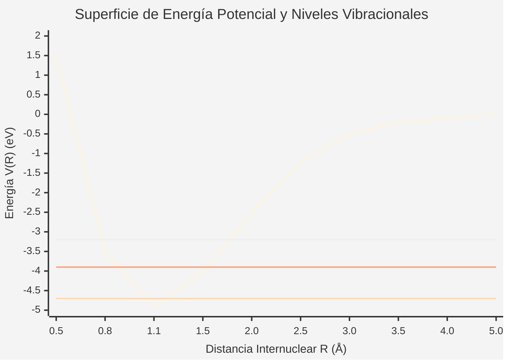

# Física Molecular

La física molecular se centra en el estudio de las propiedades físicas de las moléculas, los enlaces químicos, y la dinámica de los núcleos y electrones que conforman estas estructuras poliatómicas.

## 📜 Contexto Histórico

La teoría del enlace químico y la física molecular nacieron formalmente tras la publicación en 1927 del artículo de Walter Heitler y Fritz London aplicando la mecánica cuántica a la molécula de $H_2$. Poco después, Born y Oppenheimer introdujeron su famosa aproximación, que permite separar el movimiento rápido de los electrones del movimiento lento de los núcleos masivos.

## 🧮 Desarrollo Teórico Profundo

El estudio riguroso de una molécula poliatómica comienza con el establecimiento de su Hamiltoniano no relativista completo y la subsiguiente aplicación de la mecánica cuántica. Debido a la complejidad de las interacciones de muchos cuerpos, es imperativo realizar aproximaciones fundamentales, siendo la principal la aproximación de Born-Oppenheimer.

### 1. El Hamiltoniano Molecular Completo

Consideremos una molécula compuesta por $N$ núcleos con masas $M_{\alpha}$ y cargas $Z_{\alpha}e$ (donde $\alpha = 1, 2, \dots, N$) y $n$ electrones con masa $m_e$ y carga $-e$ (donde $i = 1, 2, \dots, n$). Las posiciones de los núcleos se denotarán por las coordenadas $\mathbf{R}_{\alpha}$ y las de los electrones por $\mathbf{r}_i$. El Hamiltoniano molecular $\hat{H}$ en ausencia de campos externos está dado por la suma de la energía cinética de todas las partículas y la energía potencial de interacción de Coulomb entre ellas:

$$ \hat{H} = \hat{T}_{\text{nuc}} + \hat{T}_{\text{elec}} + \hat{V}_{\text{nuc-nuc}} + \hat{V}_{\text{elec-elec}} + \hat{V}_{\text{nuc-elec}} $$

Sustituyendo los operadores cuánticos correspondientes:

$$ \hat{H} = - \sum_{\alpha=1}^N \frac{\hbar^2}{2M_{\alpha}} \nabla_{\alpha}^2 - \sum_{i=1}^n \frac{\hbar^2}{2m_e} \nabla_i^2 + \frac{1}{4\pi\varepsilon_0} \sum_{\alpha=1}^{N-1} \sum_{\beta>\alpha}^N \frac{Z_{\alpha} Z_{\beta} e^2}{|\mathbf{R}_{\alpha} - \mathbf{R}_{\beta}|} + \frac{1}{4\pi\varepsilon_0} \sum_{i=1}^{n-1} \sum_{j>i}^n \frac{e^2}{|\mathbf{r}_i - \mathbf{r}_j|} - \frac{1}{4\pi\varepsilon_0} \sum_{\alpha=1}^N \sum_{i=1}^n \frac{Z_{\alpha} e^2}{|\mathbf{R}_{\alpha} - \mathbf{r}_i|} $$

Este operador de muchos cuerpos no puede ser resuelto de forma exacta para moléculas más complejas que el ion $H_2^+$. Por ello, se introducen aproximaciones.

### 2. La Aproximación de Born-Oppenheimer

La clave para resolver la ecuación de Schrödinger molecular $\hat{H} \Psi(\mathbf{r}, \mathbf{R}) = E \Psi(\mathbf{r}, \mathbf{R})$ reside en observar la enorme diferencia de masas entre los electrones y los núcleos ($M_{\alpha} \gg m_e$). Al ser los electrones mucho más ligeros, se mueven a velocidades considerablemente mayores. Desde la perspectiva de los electrones, los núcleos se mueven tan lentamente que pueden considerarse fijos.

#### Derivación Matemática Paso a Paso

1. **Separación del Hamiltoniano Electrónico:**
   Fijamos las coordenadas nucleares $\mathbf{R}$ (es decir, asumimos que son parámetros constantes y no variables dinámicas para los electrones). Bajo esta condición, la energía cinética nuclear $\hat{T}_{\text{nuc}}$ se anula, y el término de repulsión internuclear $\hat{V}_{\text{nuc-nuc}}$ se convierte en una constante puramente clásica. Definimos así el **Hamiltoniano electrónico**, $\hat{H}_{\text{elec}}$:
   
   $$ \hat{H}_{\text{elec}} = \hat{T}_{\text{elec}} + \hat{V}_{\text{elec-elec}} + \hat{V}_{\text{nuc-elec}} $$
   
   La ecuación de Schrödinger electrónica es entonces:
   
   $$ \hat{H}_{\text{elec}} \psi_{\text{elec}}^{(k)}(\mathbf{r}; \mathbf{R}) = E_{\text{elec}}^{(k)}(\mathbf{R}) \psi_{\text{elec}}^{(k)}(\mathbf{r}; \mathbf{R}) $$
   
   donde $\psi_{\text{elec}}^{(k)}(\mathbf{r}; \mathbf{R})$ y $E_{\text{elec}}^{(k)}(\mathbf{R})$ son, respectivamente, las funciones de onda y energías electrónicas para el estado $k$. Dependen paramétricamente de las posiciones nucleares $\mathbf{R}$.

2. **Expansión de la Función de Onda Total:**
   Como el conjunto de funciones $\{\psi_{\text{elec}}^{(k)}(\mathbf{r}; \mathbf{R})\}$ forma una base completa para cualquier configuración $\mathbf{R}$, podemos expandir la función de onda molecular total exacta como:
   
   $$ \Psi(\mathbf{r}, \mathbf{R}) = \sum_k \chi_k(\mathbf{R}) \psi_{\text{elec}}^{(k)}(\mathbf{r}; \mathbf{R}) $$
   
   donde los coeficientes de la expansión $\chi_k(\mathbf{R})$ representan las funciones de onda nucleares.

3. **Sustitución en la Ecuación de Schrödinger Completa:**
   Insertamos esta expansión en $\hat{H} \Psi = E \Psi$, recordando que $\hat{H} = \hat{T}_{\text{nuc}} + \hat{V}_{\text{nuc-nuc}} + \hat{H}_{\text{elec}}$:
   
   $$ \left[ \hat{T}_{\text{nuc}} + \hat{V}_{\text{nuc-nuc}} + \hat{H}_{\text{elec}} \right] \sum_k \chi_k(\mathbf{R}) \psi_{\text{elec}}^{(k)}(\mathbf{r}; \mathbf{R}) = E \sum_k \chi_k(\mathbf{R}) \psi_{\text{elec}}^{(k)}(\mathbf{r}; \mathbf{R}) $$
   
   El operador $\hat{T}_{\text{nuc}}$ contiene derivadas respecto a las coordenadas nucleares ($\nabla_{\alpha}^2$). Al actuar sobre el producto $\chi_k \psi_{\text{elec}}^{(k)}$, por la regla de la cadena obtenemos:
   
   $$ \nabla_{\alpha}^2 (\chi_k \psi_{\text{elec}}^{(k)}) = (\nabla_{\alpha}^2 \chi_k) \psi_{\text{elec}}^{(k)} + 2 (\nabla_{\alpha} \chi_k) \cdot (\nabla_{\alpha} \psi_{\text{elec}}^{(k)}) + \chi_k (\nabla_{\alpha}^2 \psi_{\text{elec}}^{(k)}) $$
   
   La aproximación de Born-Oppenheimer asume que la variación de las funciones de onda electrónicas con respecto a las posiciones nucleares es despreciable, de modo que los términos acoplados no diagonales (los dos últimos de la ecuación superior) se ignoran.

4. **La Ecuación Nuclear (Movimiento de los Núcleos):**
   Si asumimos que la molécula permanece en un único estado electrónico $k$ (usualmente el estado fundamental), obtenemos la ecuación de Schrödinger para los núcleos:
   
   $$ \left[ \hat{T}_{\text{nuc}} + \hat{V}_{\text{nuc-nuc}}(\mathbf{R}) + E_{\text{elec}}^{(k)}(\mathbf{R}) \right] \chi_k(\mathbf{R}) = E \chi_k(\mathbf{R}) $$
   
   El término $V(\mathbf{R}) = \hat{V}_{\text{nuc-nuc}}(\mathbf{R}) + E_{\text{elec}}^{(k)}(\mathbf{R})$ actúa como un potencial efectivo bajo el cual se mueven los núcleos. Se le conoce como la **Superficie de Energía Potencial (PES)**.

### 3. Dinámica Nuclear de una Molécula Diatómica

Para una molécula diatómica (masas $M_1$, $M_2$), el problema nuclear se simplifica separando el movimiento del centro de masa de los movimientos relativos (vibración y rotación). Definiendo la coordenada relativa $\mathbf{R} = \mathbf{R}_2 - \mathbf{R}_1$ (con $R = |\mathbf{R}|$) y la masa reducida $\mu = \frac{M_1 M_2}{M_1 + M_2}$, la ecuación relativa en coordenadas esféricas $(R, \theta, \phi)$ es:

$$ \left[ -\frac{\hbar^2}{2\mu R^2} \frac{\partial}{\partial R} \left( R^2 \frac{\partial}{\partial R} \right) + \frac{\hat{L}^2}{2\mu R^2} + V(R) \right] \chi(R, \theta, \phi) = E \chi(R, \theta, \phi) $$

Donde $\hat{L}^2$ es el operador momento angular al cuadrado. Separando variables, $\chi(R, \theta, \phi) = \frac{S(R)}{R} Y_J^{M_J}(\theta, \phi)$:

$$ -\frac{\hbar^2}{2\mu} \frac{d^2 S(R)}{dR^2} + \left[ V(R) + \frac{\hbar^2 J(J+1)}{2\mu R^2} \right] S(R) = E S(R) $$

#### 3.1 Rotor Rígido y Oscilador Armónico

Alrededor de la posición de equilibrio $R_e$ (mínimo de la PES), expandimos el potencial efectivo $V_{\text{eff}}(R) = V(R) + \frac{\hbar^2 J(J+1)}{2\mu R^2}$ en serie de Taylor:

$$ V(R) \approx V(R_e) + \frac{1}{2} k (R - R_e)^2 $$
donde $k = \left( \frac{d^2 V}{dR^2} \right)_{R_e}$ es la constante de fuerza del enlace.
Fijando $R \approx R_e$ en el término rotacional (modelo de rotor rígido), la energía total cuantizada es la suma de los niveles rotacionales y vibracionales:

$$ E_{v, J} = V(R_e) + \hbar \omega \left( v + \frac{1}{2} \right) + B_e J(J+1) $$

Donde:
- $v = 0, 1, 2, \dots$ es el número cuántico vibracional.
- $J = 0, 1, 2, \dots$ es el número cuántico rotacional.
- $\omega = \sqrt{\frac{k}{\mu}}$ es la frecuencia angular de vibración.
- $B_e = \frac{\hbar^2}{2\mu R_e^2}$ es la constante rotacional.

#### 3.2 Correcciones Reales: Anarmonicidad y Distorsión Centrífuga

Las moléculas reales no son perfectamente armónicas ni rígidamente estáticas. Incluyendo términos de orden superior en la expansión de Taylor y permitiendo que la rotación estire el enlace, la energía se vuelve:

$$ E_{v, J} = \omega_e \left( v + \frac{1}{2} \right) - \omega_e x_e \left( v + \frac{1}{2} \right)^2 + B_v J(J+1) - D_e J^2(J+1)^2 $$

donde $B_v = B_e - \alpha_e \left(v + \frac{1}{2}\right)$ acopla la vibración y la rotación, $\omega_e x_e$ describe la anarmonicidad (p. ej., modelo de Morse) y $D_e$ es la constante de distorsión centrífuga.

### 📊 Representación Gráfica del Potencial Diatómico

El siguiente diagrama muestra la relación entre la curva de energía potencial electrónica y los niveles vibracionales y disociación en un modelo de Morse.



*(Nota: En un potencial de Morse, los niveles energéticos vibracionales se acercan entre sí a medida que el número cuántico $v$ aumenta, convergiendo hacia el límite de disociación en $E=0$.)*

## 🛠 Ejemplo Práctico

**Problema:** El espectro de rotación pura en el microondas de la molécula de monóxido de carbono isotópicamente puro $^{12}\text{C}^{16}\text{O}$ presenta líneas de absorción adyacentes separadas de manera casi uniforme por una frecuencia de $\Delta \nu = 115.27 \, \text{GHz}$. Ignorando inicialmente la distorsión centrífuga, calcule el momento de inercia de la molécula y evalúe la longitud de enlace de equilibrio $R_e$. Posteriormente, explique cualitativamente el efecto si se observara una ligera disminución en $\Delta \nu$ a $J$ muy altos.

**Solución paso a paso:**

1. **Derivación de la Condición de Transición Rotacional:**
   Las reglas de selección para transiciones de absorción dipolar eléctrica exigen $\Delta J = +1$.
   La energía del estado inicial es $E_J = B J(J+1)$ y del estado final $E_{J+1} = B(J+1)(J+2)$.
   La energía del fotón absorbido es:
   $$ \Delta E = E_{J+1} - E_J = B \left[ (J+1)(J+2) - J(J+1) \right] = 2B(J+1) $$
   La frecuencia de transición para $J \rightarrow J+1$ es $\nu_J = \frac{2B(J+1)}{h}$.
   La separación entre dos líneas espectrales sucesivas ($J \rightarrow J+1$ y $J+1 \rightarrow J+2$) es:
   $$ \Delta \nu = \nu_{J+1} - \nu_J = \frac{2B(J+2)}{h} - \frac{2B(J+1)}{h} = \frac{2B}{h} $$
   Se nos da que $\Delta \nu = 115.27 \times 10^9 \, \text{Hz}$.

2. **Calcular la Constante Rotacional $B$ en Julios:**
   $$ B = \frac{h \Delta \nu}{2} = \frac{(6.62607 \times 10^{-34} \, \text{J s})(115.27 \times 10^9 \, \text{s}^{-1})}{2} = 3.8188 \times 10^{-23} \, \text{J} $$

3. **Extraer el Momento de Inercia $I$:**
   Sabiendo que $B = \frac{\hbar^2}{2I}$, despejamos $I$:
   $$ I = \frac{\hbar^2}{2B} = \frac{(1.05457 \times 10^{-34} \, \text{J s})^2}{2(3.8188 \times 10^{-23} \, \text{J})} = 1.4559 \times 10^{-46} \, \text{kg m}^2 $$

4. **Calcular la Masa Reducida $\mu$:**
   Las masas isotópicas exactas son $m(^{12}\text{C}) = 12.0000 \, \text{u}$ y $m(^{16}\text{O}) = 15.9949 \, \text{u}$.
   Con $1 \, \text{u} = 1.660539 \times 10^{-27} \, \text{kg}$:
   $$ \mu = \frac{m_C m_O}{m_C + m_O} = \frac{(12.0000)(15.9949)}{12.0000 + 15.9949} \, \text{u} \approx 6.8562 \, \text{u} $$
   $$ \mu \approx 6.8562 \times 1.660539 \times 10^{-27} \, \text{kg} \approx 1.1385 \times 10^{-26} \, \text{kg} $$

5. **Resolver para la Longitud de Enlace de Equilibrio $R_e$:**
   A partir de $I = \mu R_e^2$:
   $$ R_e = \sqrt{\frac{I}{\mu}} = \sqrt{\frac{1.4559 \times 10^{-46}}{1.1385 \times 10^{-26}}} \approx \sqrt{1.2788 \times 10^{-20}} $$
   $$ R_e \approx 1.1308 \times 10^{-10} \, \text{m} = 0.1131 \, \text{nm} \, (1.131 \, \text{Å}) $$

**Análisis de la Disminución a Alto $J$ (Efecto de Distorsión Centrífuga):**
A números cuánticos rotacionales altos, la fuerza centrífuga que actúa sobre los núcleos durante la rápida rotación "estira" el enlace internuclear. Como la longitud del enlace efectiva $R$ aumenta, el momento de inercia $I = \mu R^2$ también aumenta. Puesto que $B \propto 1/I$, la constante rotacional efectiva disminuye, reduciendo ligeramente el espaciamiento $\Delta \nu$ entre los niveles de energía subsiguientes. Esto hace necesario incluir el término negativo correctivo $-D_e J^2(J+1)^2$.

## 📝 Guía de Ejercicios Resueltos

### Ejercicio 1: Efecto Stark Lineal en el Átomo de Hidrógeno
Considere un átomo de hidrógeno en el primer estado excitado ($n=2$) sometido a un campo eléctrico externo uniforme $\vec{\mathcal{E}} = \mathcal{E}_0 \hat{z}$. Calcule el corrimiento de los niveles de energía utilizando la teoría de perturbaciones degenerada de primer orden.

**Solución paso a paso:**
1. Los estados degenerados para $n=2$ son $|2,0,0\rangle$, $|2,1,0\rangle$, $|2,1,1\rangle$, y $|2,1,-1\rangle$ en la base $|n,l,m\rangle$.
2. El Hamiltoniano de perturbación es $H' = e \mathcal{E}_0 z = e \mathcal{E}_0 r \cos\theta$.
3. Los elementos de matriz de $H'$ solo son no nulos si $\Delta m = 0$ y $\Delta l = \pm 1$ debido a las reglas de selección.
4. Por lo tanto, el único elemento no diagonal no nulo es entre $|2,0,0\rangle$ y $|2,1,0\rangle$:
   $$ \langle 2,0,0 | H' | 2,1,0 \rangle = e \mathcal{E}_0 \int d^3r \psi_{200}^* z \psi_{210} = -3 e \mathcal{E}_0 a_0 $$
   donde $a_0$ es el radio de Bohr.
5. La matriz de perturbación en la sub-base $\{|2,0,0\rangle, |2,1,0\rangle, |2,1,1\rangle, |2,1,-1\rangle\}$ es:
   $$ H' = \begin{pmatrix} 0 & -3ea_0\mathcal{E}_0 & 0 & 0 \\ -3ea_0\mathcal{E}_0 & 0 & 0 & 0 \\ 0 & 0 & 0 & 0 \\ 0 & 0 & 0 & 0 \end{pmatrix} $$
6. Los autovalores son $\Delta E = \pm 3 e a_0 \mathcal{E}_0$ y $0$ (doblemente degenerado).

### Ejercicio 2: Espectro Rotovibracional de la Molécula de Diatómica
Derive la expresión para los niveles de energía rotovibracionales de una molécula diatómica tratada como un oscilador armónico y rotor rígido acoplados, incluyendo la corrección de distorsión centrífuga. 

**Solución paso a paso:**
1. El Hamiltoniano molecular efectivo es $H = \frac{P^2}{2\mu} + \frac{L^2}{2\mu R^2} + V(R)$.
2. Expandiendo el potencial alrededor del mínimo $R_e$: $V(R) \approx \frac{1}{2} k (R - R_e)^2$.
3. La energía a orden cero es $E_{v,J} = \hbar \omega \left(v + \frac{1}{2}\right) + B_e J(J+1)$, donde $B_e = \frac{\hbar^2}{2\mu R_e^2}$.
4. Para la distorsión centrífuga, el mínimo efectivo de la energía potencial efectiva $V_{\text{eff}}(R) = V(R) + \frac{\hbar^2 J(J+1)}{2\mu R^2}$ se desplaza.
5. Minimizando $V_{\text{eff}}$: $k(R_c - R_e) - \frac{\hbar^2 J(J+1)}{\mu R_c^3} = 0 \implies \Delta R \approx \frac{\hbar^2 J(J+1)}{k \mu R_e^3}$.
6. Sustituyendo de nuevo en la energía, el término de corrección es $-D_e J^2(J+1)^2$, donde $D_e = \frac{4B_e^3}{\hbar^2 \omega^2}$.
7. La energía final es $E_{v,J} = \hbar \omega \left(v + \frac{1}{2}\right) + B_e J(J+1) - D_e J^2(J+1)^2$.

### Ejercicio 3: Condensación de Bose-Einstein en una Trampa Armónica
Determine la temperatura crítica $T_c$ para la condensación de Bose-Einstein de un gas ideal de $N$ bosones atrapados en un potencial armónico tridimensional isotrópico $V(r) = \frac{1}{2} m \omega^2 r^2$.

**Solución paso a paso:**
1. La densidad de estados para un oscilador armónico 3D es $g(E) = \frac{E^2}{2(\hbar\omega)^3}$.
2. El número total de partículas en estados excitados viene dado por la integral:
   $$ N_{ex} = \int_0^\infty \frac{g(E)}{e^{\beta (E-\mu)} - 1} dE $$
3. En la temperatura crítica $T_c$, el potencial químico $\mu \to 0$ y $N_{ex} = N$.
4. Reemplazando $g(E)$ e introduciendo $x = E/k_B T_c$:
   $$ N = \frac{(k_B T_c)^3}{2(\hbar\omega)^3} \int_0^\infty \frac{x^2}{e^x - 1} dx $$
5. La integral es conocida como $\Gamma(3)\zeta(3) = 2 \times 1.202$.
6. Resolviendo para $T_c$:
   $$ N = \left( \frac{k_B T_c}{\hbar\omega} \right)^3 \zeta(3) \implies T_c = \frac{\hbar\omega}{k_B} \left( \frac{N}{\zeta(3)} \right)^{1/3} $$

## 💻 Simulaciones Computacionales

Este script computacional aproxima los niveles vibracionales moleculares diatómicos solucionando la ecuación de Schrödinger radial para un Potencial de Morse empírico, revelando el efecto de anarmonicidad en el acercamiento de los niveles cuánticos cerca del límite de disociación.

```python
import numpy as np
import matplotlib.pyplot as plt
from scipy.sparse import diags
from scipy.sparse.linalg import eigsh

# Parámetros para un oscilador molecular de Morse genérico (ej. H2)
De = 4.75          # Energía de disociación en eV
re = 0.74          # Distancia internuclear de equilibrio en Angstroms
a = 1.93           # Parámetro de anchura del pozo en Angstrom^-1
mu = 918.0         # Masa reducida relativa a la masa electrónica
hbar2_over_2m = 3.81  # Factor de conversión (aprox) para energías en eV y dist en A

# Grid espacial (Distancia radial internuclear R)
N = 1000
R = np.linspace(0.2, 4.0, N)
dR = R[1] - R[0]

# Superficie de Energía Potencial (PES): Potencial de Morse
V_morse = De * (1.0 - np.exp(-a * (R - re)))**2 - De

# Hamiltoniano mediante diferencias finitas
t_coeff = -hbar2_over_2m / (mu * dR**2)
main_diag = -2.0 * t_coeff * np.ones(N) + V_morse
off_diag = t_coeff * np.ones(N-1)

H = diags([off_diag, main_diag, off_diag], [-1, 0, 1], format='csc')

# Resolviendo los autovalores y autofunciones
num_levels = 8
eigenvalues, eigenvectors = eigsh(H, k=num_levels, which='SM')

plt.figure(figsize=(10, 6))
plt.plot(R, V_morse, 'k-', lw=2, label='Potencial de Morse V(R)')
plt.axhline(0, color='gray', linestyle='--', label='Límite de Disociación')

scale = 0.5
colors = plt.cm.viridis(np.linspace(0, 1, num_levels))

for i in range(num_levels):
    E = eigenvalues[i]
    psi = eigenvectors[:, i]
    if psi[np.argmax(np.abs(psi))] < 0:
        psi = -psi
    
    plt.axhline(E, color=colors[i], linestyle=':', alpha=0.5)
    plt.plot(R, E + scale * psi, color=colors[i], label=f'v={i}')

plt.title("Niveles Vibracionales Anarmónicos (Potencial de Morse)")
plt.xlabel("Distancia Internuclear $R$ (Å)")
plt.ylabel("Energía (eV)")
plt.ylim(-De - 0.5, 1.0)
plt.xlim(0.2, 4.0)
plt.legend(loc='lower right', ncol=2)
plt.grid(True, alpha=0.2)
plt.tight_layout()
# plt.show()
```

## 📚 Recursos Específicos

### 🎓 Cursos y Clases Recomendadas
1. [MIT 5.73 Quantum Mechanics I (Robert Field)](https://ocw.mit.edu/courses/5-73-quantum-mechanics-i-fall-2002/): Orientado puramente hacia la química cuántica, cubriendo la aproximación Born-Oppenheimer y las estructuras rotovibracionales desde un punto de vista espectroscópico experto.
2. [Stanford - Quantum Mechanics (Leonard Susskind)](https://www.youtube.com/playlist?list=PLpGHT1n4-mAtWCAh1E_yT1eF82k7bFepf): Conferencias enfocadas en sistemas multipolares y la explicación fundamental de por qué ocurren los enlaces en la naturaleza desde el formalismo de estados entrelazados.
3. [NPTEL Atomic and Molecular Physics (Prof. Amal Kumar Das)](https://nptel.ac.in/courses/115105100): Módulos posteriores orientados fuertemente a la conformación de espectros de bandas, enlaces químicos, y espectroscopía Raman.
4. [Coursera - Introduction to Physical Chemistry (University of Manchester)](https://www.coursera.org/learn/physical-chemistry): Introducción mucho más suave a la termodinámica de sistemas moleculares, la teoría de Orbitales Moleculares, y el cálculo del momento de inercia.
5. [Yale PHYS 201 (Ramamurti Shankar)](https://oyc.yale.edu/physics/phys-201): Cierra el curso de introducción a cuántica tocando levemente cómo se ensamblan las moléculas mediante pozos de potencial superpuestos.

### 📝 Artículos e Interactivos Interesantes
1. **PhET Interactive Simulations:** [Molecule Shapes](https://phet.colorado.edu/en/simulations/molecule-shapes) - Para visualizar geometría VSEPR básica y disposición de pares solitarios.
2. **PhET Interactive Simulations:** [Molecule Polarity](https://phet.colorado.edu/en/simulations/molecule-polarity) - Explora interacciones de enlace y la suma de dipolos para crear moléculas polares.
3. **PhET Interactive Simulations:** [Microwaves and Ovens](https://phet.colorado.edu/en/simulations/microwaves-and-ovens) - Una demostración fantástica de la excitación de los niveles rotacionales del agua con radiación de microondas.
4. **HyperPhysics:** [Molecular Spectra](http://hyperphysics.phy-astr.gsu.edu/hbase/molecule/molspe.html) - Gráficas de los pozos de potencial (curvas de Morse), niveles vibracionales y la notación de rama P, Q, R.
5. **Wikipedia:** [Aproximación de Born-Oppenheimer](https://es.wikipedia.org/wiki/Aproximaci%C3%B3n_de_Born-Oppenheimer) - Lectura detallada sobre el desacoplamiento matemático de los movimientos nucleares y electrónicos.
6. **Wikipedia:** [Efecto Raman](https://es.wikipedia.org/wiki/Efecto_Raman) - Explicación de la dispersión inelástica, clave en la espectroscopía de moléculas que no poseen momento dipolar.
7. **LibreTexts Chemistry:** [Molecular Orbital Theory](https://chem.libretexts.org/Bookshelves/Physical_and_Theoretical_Chemistry_Textbook_Maps/Physical_Chemistry_(LibreTexts)/09%3A_Chemical_Bonding_in_Diatomic_Molecules/9.06%3A_Molecular_Orbital_Theory) - Introducción visual y matemática a LCAO, orbitales de enlace ($\sigma, \pi$) y antienlace ($\sigma^*, \pi^*$).
8. **NIST Chemistry WebBook:** [NIST WebBook](https://webbook.nist.gov/chemistry/) - Base de datos termoquímica y espectral masiva para casi cualquier molécula pequeña; ideal para buscar constantes rotacionales ($B$) reales.

### 📖 Referencias Útiles y Bibliografía
1. **Libro**: [Physics of Atoms and Molecules - B.H. Bransden & C.J. Joachain](https://www.pearson.com/en-gb/subject-catalog/p/physics-of-atoms-and-molecules/P200000005272/9780582356924) (Capítulos 9, 10 y 11). Cobertura exhaustiva, densa y matemáticamente rigurosa de las moléculas diatómicas, poliatómicas y sus espectros de absorción/emisión asociados.
2. **Libro**: [Molecular Quantum Mechanics - P.W. Atkins & R.S. Friedman](https://global.oup.com/academic/product/molecular-quantum-mechanics-9780199541423). El texto clásico y enormemente popular y accesible para químicos físicos; detalla la teoría de grupos, la construcción de orbitales, y las transiciones de Raman.
3. **Libro**: [Fundamentals of Molecular Spectroscopy - C.N. Banwell](https://www.mheducation.co.in/fundamentals-of-molecular-spectroscopy-9781259062599-india). Estándar dorado (mucho más amigable que Bransden) que aborda explícita y didácticamente los espectros rotacionales, vibracionales, Raman y electrónicos.
4. **Libro**: [Introduction to Quantum Mechanics - David J. Griffiths](https://www.cambridge.org/highereducation/books/introduction-to-quantum-mechanics/990799252758F46C8765A2C3946C342C) (Capítulo 7 y 8). Incluye una muy lúcida introducción a la molécula del ión de hidrógeno $H_2^+$ en el contexto del principio variacional, y a la aproximación WKB usada en el enlace del hidrógeno.
