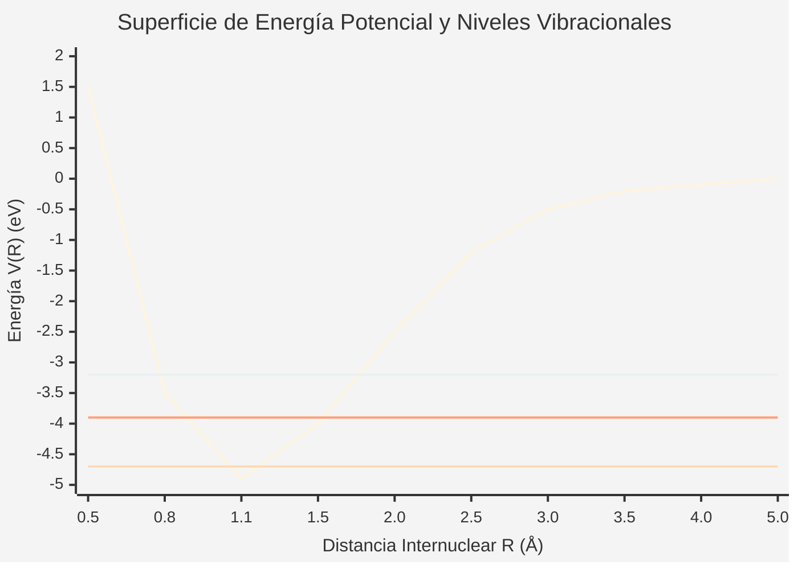

# Física Molecular

La física molecular se centra en el estudio de las propiedades físicas de las moléculas, los enlaces químicos, y la dinámica de los núcleos y electrones que conforman estas estructuras poliatómicas.

## 📜 Contexto Histórico

La teoría del enlace químico y la física molecular nacieron formalmente tras la publicación en 1927 del artículo de Walter Heitler y Fritz London aplicando la mecánica cuántica a la molécula de $H_2$. Poco después, Born y Oppenheimer introdujeron su famosa aproximación, que permite separar el movimiento rápido de los electrones del movimiento lento de los núcleos masivos.

## 🧮 Desarrollo Teórico Profundo

El estudio riguroso de una molécula poliatómica comienza con el establecimiento de su Hamiltoniano no relativista completo y la subsiguiente aplicación de la mecánica cuántica. Debido a la complejidad de las interacciones de muchos cuerpos, es imperativo realizar aproximaciones fundamentales, siendo la principal la aproximación de Born-Oppenheimer.

### 1. El Hamiltoniano Molecular Completo

Consideremos una molécula compuesta por $N$ núcleos con masas $M_{\alpha}$ y cargas $Z_{\alpha}e$ (donde $\alpha = 1, 2, \dots, N$) y $n$ electrones con masa $m_e$ y carga $-e$ (donde $i = 1, 2, \dots, n$). Las posiciones de los núcleos se denotarán por las coordenadas $\mathbf{R}_{\alpha}$ y las de los electrones por $\mathbf{r}_i$. El Hamiltoniano molecular $\hat{H}$ en ausencia de campos externos está dado por la suma de la energía cinética de todas las partículas y la energía potencial de interacción de Coulomb entre ellas:

$$ \hat{H} = \hat{T}_{\text{nuc}} + \hat{T}_{\text{elec}} + \hat{V}_{\text{nuc-nuc}} + \hat{V}_{\text{elec-elec}} + \hat{V}_{\text{nuc-elec}} $$

Sustituyendo los operadores cuánticos correspondientes:

$$ \hat{H} = - \sum_{\alpha=1}^N \frac{\hbar^2}{2M_{\alpha}} \nabla_{\alpha}^2 - \sum_{i=1}^n \frac{\hbar^2}{2m_e} \nabla_i^2 + \frac{1}{4\pi\varepsilon_0} \sum_{\alpha=1}^{N-1} \sum_{\beta>\alpha}^N \frac{Z_{\alpha} Z_{\beta} e^2}{|\mathbf{R}_{\alpha} - \mathbf{R}_{\beta}|} + \frac{1}{4\pi\varepsilon_0} \sum_{i=1}^{n-1} \sum_{j>i}^n \frac{e^2}{|\mathbf{r}_i - \mathbf{r}_j|} - \frac{1}{4\pi\varepsilon_0} \sum_{\alpha=1}^N \sum_{i=1}^n \frac{Z_{\alpha} e^2}{|\mathbf{R}_{\alpha} - \mathbf{r}_i|} $$

Este operador de muchos cuerpos no puede ser resuelto de forma exacta para moléculas más complejas que el ion $H_2^+$. Por ello, se introducen aproximaciones.

### 2. La Aproximación de Born-Oppenheimer

La clave para resolver la ecuación de Schrödinger molecular $\hat{H} \Psi(\mathbf{r}, \mathbf{R}) = E \Psi(\mathbf{r}, \mathbf{R})$ reside en observar la enorme diferencia de masas entre los electrones y los núcleos ($M_{\alpha} \gg m_e$). Al ser los electrones mucho más ligeros, se mueven a velocidades considerablemente mayores. Desde la perspectiva de los electrones, los núcleos se mueven tan lentamente que pueden considerarse fijos.

#### Derivación Matemática Paso a Paso

1. **Separación del Hamiltoniano Electrónico:**
   Fijamos las coordenadas nucleares $\mathbf{R}$ (es decir, asumimos que son parámetros constantes y no variables dinámicas para los electrones). Bajo esta condición, la energía cinética nuclear $\hat{T}_{\text{nuc}}$ se anula, y el término de repulsión internuclear $\hat{V}_{\text{nuc-nuc}}$ se convierte en una constante puramente clásica. Definimos así el **Hamiltoniano electrónico**, $\hat{H}_{\text{elec}}$:
   
   $$ \hat{H}_{\text{elec}} = \hat{T}_{\text{elec}} + \hat{V}_{\text{elec-elec}} + \hat{V}_{\text{nuc-elec}} $$
   
   La ecuación de Schrödinger electrónica es entonces:
   
   $$ \hat{H}_{\text{elec}} \psi_{\text{elec}}^{(k)}(\mathbf{r}; \mathbf{R}) = E_{\text{elec}}^{(k)}(\mathbf{R}) \psi_{\text{elec}}^{(k)}(\mathbf{r}; \mathbf{R}) $$
   
   donde $\psi_{\text{elec}}^{(k)}(\mathbf{r}; \mathbf{R})$ y $E_{\text{elec}}^{(k)}(\mathbf{R})$ son, respectivamente, las funciones de onda y energías electrónicas para el estado $k$. Dependen paramétricamente de las posiciones nucleares $\mathbf{R}$.

2. **Expansión de la Función de Onda Total:**
   Como el conjunto de funciones $\{\psi_{\text{elec}}^{(k)}(\mathbf{r}; \mathbf{R})\}$ forma una base completa para cualquier configuración $\mathbf{R}$, podemos expandir la función de onda molecular total exacta como:
   
   $$ \Psi(\mathbf{r}, \mathbf{R}) = \sum_k \chi_k(\mathbf{R}) \psi_{\text{elec}}^{(k)}(\mathbf{r}; \mathbf{R}) $$
   
   donde los coeficientes de la expansión $\chi_k(\mathbf{R})$ representan las funciones de onda nucleares.

3. **Sustitución en la Ecuación de Schrödinger Completa:**
   Insertamos esta expansión en $\hat{H} \Psi = E \Psi$, recordando que $\hat{H} = \hat{T}_{\text{nuc}} + \hat{V}_{\text{nuc-nuc}} + \hat{H}_{\text{elec}}$:
   
   $$ \left[ \hat{T}_{\text{nuc}} + \hat{V}_{\text{nuc-nuc}} + \hat{H}_{\text{elec}} \right] \sum_k \chi_k(\mathbf{R}) \psi_{\text{elec}}^{(k)}(\mathbf{r}; \mathbf{R}) = E \sum_k \chi_k(\mathbf{R}) \psi_{\text{elec}}^{(k)}(\mathbf{r}; \mathbf{R}) $$
   
   El operador $\hat{T}_{\text{nuc}}$ contiene derivadas respecto a las coordenadas nucleares ($\nabla_{\alpha}^2$). Al actuar sobre el producto $\chi_k \psi_{\text{elec}}^{(k)}$, por la regla de la cadena obtenemos:
   
   $$ \nabla_{\alpha}^2 (\chi_k \psi_{\text{elec}}^{(k)}) = (\nabla_{\alpha}^2 \chi_k) \psi_{\text{elec}}^{(k)} + 2 (\nabla_{\alpha} \chi_k) \cdot (\nabla_{\alpha} \psi_{\text{elec}}^{(k)}) + \chi_k (\nabla_{\alpha}^2 \psi_{\text{elec}}^{(k)}) $$
   
   La aproximación de Born-Oppenheimer asume que la variación de las funciones de onda electrónicas con respecto a las posiciones nucleares es despreciable, de modo que los términos acoplados no diagonales (los dos últimos de la ecuación superior) se ignoran.

4. **La Ecuación Nuclear (Movimiento de los Núcleos):**
   Si asumimos que la molécula permanece en un único estado electrónico $k$ (usualmente el estado fundamental), obtenemos la ecuación de Schrödinger para los núcleos:
   
   $$ \left[ \hat{T}_{\text{nuc}} + \hat{V}_{\text{nuc-nuc}}(\mathbf{R}) + E_{\text{elec}}^{(k)}(\mathbf{R}) \right] \chi_k(\mathbf{R}) = E \chi_k(\mathbf{R}) $$
   
   El término $V(\mathbf{R}) = \hat{V}_{\text{nuc-nuc}}(\mathbf{R}) + E_{\text{elec}}^{(k)}(\mathbf{R})$ actúa como un potencial efectivo bajo el cual se mueven los núcleos. Se le conoce como la **Superficie de Energía Potencial (PES)**.

### 3. Dinámica Nuclear de una Molécula Diatómica

Para una molécula diatómica (masas $M_1$, $M_2$), el problema nuclear se simplifica separando el movimiento del centro de masa de los movimientos relativos (vibración y rotación). Definiendo la coordenada relativa $\mathbf{R} = \mathbf{R}_2 - \mathbf{R}_1$ (con $R = |\mathbf{R}|$) y la masa reducida $\mu = \frac{M_1 M_2}{M_1 + M_2}$, la ecuación relativa en coordenadas esféricas $(R, \theta, \phi)$ es:

$$ \left[ -\frac{\hbar^2}{2\mu R^2} \frac{\partial}{\partial R} \left( R^2 \frac{\partial}{\partial R} \right) + \frac{\hat{L}^2}{2\mu R^2} + V(R) \right] \chi(R, \theta, \phi) = E \chi(R, \theta, \phi) $$

Donde $\hat{L}^2$ es el operador momento angular al cuadrado. Separando variables, $\chi(R, \theta, \phi) = \frac{S(R)}{R} Y_J^{M_J}(\theta, \phi)$:

$$ -\frac{\hbar^2}{2\mu} \frac{d^2 S(R)}{dR^2} + \left[ V(R) + \frac{\hbar^2 J(J+1)}{2\mu R^2} \right] S(R) = E S(R) $$

#### 3.1 Rotor Rígido y Oscilador Armónico

Alrededor de la posición de equilibrio $R_e$ (mínimo de la PES), expandimos el potencial efectivo $V_{\text{eff}}(R) = V(R) + \frac{\hbar^2 J(J+1)}{2\mu R^2}$ en serie de Taylor:

$$ V(R) \approx V(R_e) + \frac{1}{2} k (R - R_e)^2 $$
donde $k = \left( \frac{d^2 V}{dR^2} \right)_{R_e}$ es la constante de fuerza del enlace.
Fijando $R \approx R_e$ en el término rotacional (modelo de rotor rígido), la energía total cuantizada es la suma de los niveles rotacionales y vibracionales:

$$ E_{v, J} = V(R_e) + \hbar \omega \left( v + \frac{1}{2} \right) + B_e J(J+1) $$

Donde:
- $v = 0, 1, 2, \dots$ es el número cuántico vibracional.
- $J = 0, 1, 2, \dots$ es el número cuántico rotacional.
- $\omega = \sqrt{\frac{k}{\mu}}$ es la frecuencia angular de vibración.
- $B_e = \frac{\hbar^2}{2\mu R_e^2}$ es la constante rotacional.

#### 3.2 Correcciones Reales: Anarmonicidad y Distorsión Centrífuga

Las moléculas reales no son perfectamente armónicas ni rígidamente estáticas. Incluyendo términos de orden superior en la expansión de Taylor y permitiendo que la rotación estire el enlace, la energía se vuelve:

$$ E_{v, J} = \omega_e \left( v + \frac{1}{2} \right) - \omega_e x_e \left( v + \frac{1}{2} \right)^2 + B_v J(J+1) - D_e J^2(J+1)^2 $$

donde $B_v = B_e - \alpha_e \left(v + \frac{1}{2}\right)$ acopla la vibración y la rotación, $\omega_e x_e$ describe la anarmonicidad (p. ej., modelo de Morse) y $D_e$ es la constante de distorsión centrífuga.

### 📊 Representación Gráfica del Potencial Diatómico

El siguiente diagrama muestra la relación entre la curva de energía potencial electrónica y los niveles vibracionales y disociación en un modelo de Morse.

*(Nota: En un potencial de Morse, los niveles energéticos vibracionales se acercan entre sí a medida que el número cuántico $v$ aumenta, convergiendo hacia el límite de disociación en $E=0$.)*

## 🛠 Ejemplo Práctico

**Problema:** El espectro de rotación pura en el microondas de la molécula de monóxido de carbono isotópicamente puro $^{12}\text{C}^{16}\text{O}$ presenta líneas de absorción adyacentes separadas de manera casi uniforme por una frecuencia de $\Delta \nu = 115.27 \, \text{GHz}$. Ignorando inicialmente la distorsión centrífuga, calcule el momento de inercia de la molécula y evalúe la longitud de enlace de equilibrio $R_e$. Posteriormente, explique cualitativamente el efecto si se observara una ligera disminución en $\Delta \nu$ a $J$ muy altos.

**Solución paso a paso:**

1. **Derivación de la Condición de Transición Rotacional:**
   Las reglas de selección para transiciones de absorción dipolar eléctrica exigen $\Delta J = +1$.
   La energía del estado inicial es $E_J = B J(J+1)$ y del estado final $E_{J+1} = B(J+1)(J+2)$.
   La energía del fotón absorbido es:
   $$ \Delta E = E_{J+1} - E_J = B \left[ (J+1)(J+2) - J(J+1) \right] = 2B(J+1) $$
   La frecuencia de transición para $J \rightarrow J+1$ es $\nu_J = \frac{2B(J+1)}{h}$.
   La separación entre dos líneas espectrales sucesivas ($J \rightarrow J+1$ y $J+1 \rightarrow J+2$) es:
   $$ \Delta \nu = \nu_{J+1} - \nu_J = \frac{2B(J+2)}{h} - \frac{2B(J+1)}{h} = \frac{2B}{h} $$
   Se nos da que $\Delta \nu = 115.27 \times 10^9 \, \text{Hz}$.

2. **Calcular la Constante Rotacional $B$ en Julios:**
   $$ B = \frac{h \Delta \nu}{2} = \frac{(6.62607 \times 10^{-34} \, \text{J s})(115.27 \times 10^9 \, \text{s}^{-1})}{2} = 3.8188 \times 10^{-23} \, \text{J} $$

3. **Extraer el Momento de Inercia $I$:**
   Sabiendo que $B = \frac{\hbar^2}{2I}$, despejamos $I$:
   $$ I = \frac{\hbar^2}{2B} = \frac{(1.05457 \times 10^{-34} \, \text{J s})^2}{2(3.8188 \times 10^{-23} \, \text{J})} = 1.4559 \times 10^{-46} \, \text{kg m}^2 $$

4. **Calcular la Masa Reducida $\mu$:**
   Las masas isotópicas exactas son $m(^{12}\text{C}) = 12.0000 \, \text{u}$ y $m(^{16}\text{O}) = 15.9949 \, \text{u}$.
   Con $1 \, \text{u} = 1.660539 \times 10^{-27} \, \text{kg}$:
   $$ \mu = \frac{m_C m_O}{m_C + m_O} = \frac{(12.0000)(15.9949)}{12.0000 + 15.9949} \, \text{u} \approx 6.8562 \, \text{u} $$
   $$ \mu \approx 6.8562 \times 1.660539 \times 10^{-27} \, \text{kg} \approx 1.1385 \times 10^{-26} \, \text{kg} $$

5. **Resolver para la Longitud de Enlace de Equilibrio $R_e$:**
   A partir de $I = \mu R_e^2$:
   $$ R_e = \sqrt{\frac{I}{\mu}} = \sqrt{\frac{1.4559 \times 10^{-46}}{1.1385 \times 10^{-26}}} \approx \sqrt{1.2788 \times 10^{-20}} $$
   $$ R_e \approx 1.1308 \times 10^{-10} \, \text{m} = 0.1131 \, \text{nm} \, (1.131 \, \text{Å}) $$

**Análisis de la Disminución a Alto $J$ (Efecto de Distorsión Centrífuga):**
A números cuánticos rotacionales altos, la fuerza centrífuga que actúa sobre los núcleos durante la rápida rotación "estira" el enlace internuclear. Como la longitud del enlace efectiva $R$ aumenta, el momento de inercia $I = \mu R^2$ también aumenta. Puesto que $B \propto 1/I$, la constante rotacional efectiva disminuye, reduciendo ligeramente el espaciamiento $\Delta \nu$ entre los niveles de energía subsiguientes. Esto hace necesario incluir el término negativo correctivo $-D_e J^2(J+1)^2$.

## 📚 Recursos Específicos

### Cursos Específicos
1. [Molecular Physics - University of Manchester (Coursera)](https://www.coursera.org/learn/spectroscopy)
2. [Introduction to Molecular Spectroscopy - NPTEL](https://nptel.ac.in/courses/104104084)
3. [Physical Chemistry: Molecular Structure - MIT OCW](https://ocw.mit.edu/courses/5-61-physical-chemistry-fall-2017/)
4. [Quantum Chemistry - Stanford (edX)](https://www.edx.org/course/quantum-mechanics-of-molecular-structures)
5. [Atoms and Molecules - Coursera](https://www.coursera.org/specializations/quantum-mechanics-atoms-molecules)

### Artículos y Simulaciones
1. [Born, M., & Oppenheimer, R. (1927). *Zur Quantentheorie der Molekeln*. Annalen der Physik.](https://onlinelibrary.wiley.com/doi/abs/10.1002/andp.19273892002)
2. [Heitler, W., & London, F. (1927). *Wechselwirkung neutraler Atome und homöopolare Bindung nach der Quantenmechanik*.](https://link.springer.com/article/10.1007/BF01397394)
3. [PhET Simulation: Molecule Shapes](https://phet.colorado.edu/en/simulations/molecule-shapes)
4. [NIST Chemistry WebBook](https://webbook.nist.gov/chemistry/)
5. [Mulliken, R. S. (1932). *Electronic Structures of Polyatomic Molecules and Valence*. Phys. Rev.](https://journals.aps.org/pr/abstract/10.1103/PhysRev.40.55)
6. [Pauling, L. (1931). *The Nature of the Chemical Bond*. J. Am. Chem. Soc.](https://pubs.acs.org/doi/abs/10.1021/ja01355a027)
7. [PhET Simulation: Molecule Polarity](https://phet.colorado.edu/en/simulations/molecule-polarity)
8. [PhET Simulation: Atomic Interactions](https://phet.colorado.edu/en/simulations/atomic-interactions)

### 📖 Referencias Útiles y Bibliografía
- [Herzberg, G. (1950). *Molecular Spectra and Molecular Structure*. D. Van Nostrand Company.](https://www.springer.com/gp/book/9780894642685)
- [Atkins, P., & Friedman, R. (2011). *Molecular Quantum Mechanics*. Oxford University Press.](https://global.oup.com/academic/product/molecular-quantum-mechanics-9780199541423)
- [Bransden, B. H., & Joachain, C. J. (2003). *Physics of Atoms and Molecules*. Pearson Education.](https://www.pearson.com/en-us/subject-catalog/p/physics-of-atoms-and-molecules/P200000005739)
- [McHale, J. L. (2017). *Molecular Spectroscopy*. CRC Press.](https://www.routledge.com/Molecular-Spectroscopy/McHale/p/book/9781466586581)
