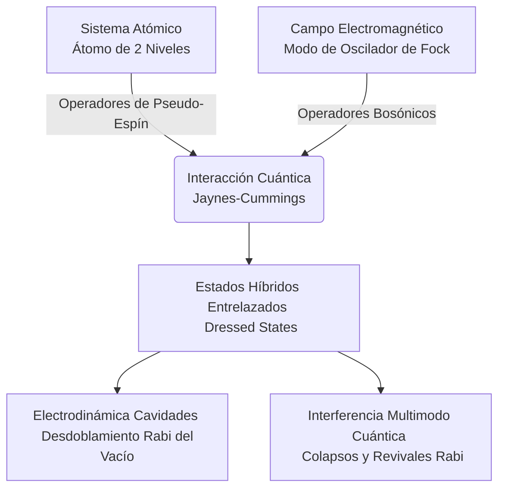

# Interacción Luz-Materia

La interacción luz-materia describe cómo los campos electromagnéticos modifican estados atómicos y moleculares, y cómo los sistemas cuánticos absorben, emiten o dispersan radiación. Aquí nacen gran parte de la espectroscopía moderna, los láseres y muchas herramientas de control cuántico.

## Conceptos Fundamentales

- **Absorción**: El sistema gana energía al capturar un fotón compatible con una transición.
- **Emisión espontánea**: Un estado excitado puede decaer emitiendo luz sin estímulo externo.
- **Emisión estimulada**: La base física de los láseres.
- **Resonancia**: La respuesta es máxima cuando la frecuencia de la luz coincide con una transición.
- **Coherencia**: Importante para interferencia, manipulación cuántica y espectroscopía de alta resolución.

## Ideas Clave

### 1. Reglas de selección
La simetría y la forma del operador dipolar determinan qué transiciones son intensas o prohibidas.

### 2. Espectroscopías
Absorción, fluorescencia, Raman y espectroscopía de microondas o infrarrojo exploran distintos grados de libertad.

### 3. Control cuántico
Pulsos de luz pueden preparar, mezclar y leer estados cuánticos con gran precisión.

## 🧮 Desarrollo Teórico Profundo

La interacción luz-materia fundamenta las propiedades ópticas de todos los sistemas físicos, desde la espectroscopía atómica hasta las tecnologías cuánticas modernas. En esta sección derivamos de forma detallada la descripción semiclásica y puramente cuántica de la interacción, avanzando desde la teoría de perturbaciones hasta la electrodinámica cuántica en cavidades.

### 1. Tratamiento Semiclásico: Aproximación Dipolar

El Hamiltoniano de un electrón (masa $m_e$ y carga $-e$) en un átomo sometido a un potencial central $V(\mathbf{r})$ e interactuando con un campo electromagnético, se puede describir acoplando la carga a los potenciales vector $\mathbf{A}(\mathbf{r}, t)$ y escalar $\phi(\mathbf{r}, t)$. Con el principio de sustitución mínima, el Hamiltoniano de acoplamiento es:

$$ \hat{H} = \frac{1}{2m_e} \left( \hat{\mathbf{p}} + e \mathbf{A}(\mathbf{r},t) \right)^2 + V(\mathbf{r}) - e \phi(\mathbf{r}, t) $$

Empleando el **calibre de Coulomb** (o transversal, $\nabla \cdot \mathbf{A} = 0$, $\phi = 0$ asumiendo ausencia de densidad de carga libre macroscópica), podemos expandir el producto $\left( \hat{\mathbf{p}} + e \mathbf{A} \right)^2$. Sabiendo que el operador momento es $\hat{\mathbf{p}} = -i\hbar\nabla$, el conmutador $[\hat{\mathbf{p}}, \mathbf{A}] \propto -i\hbar (\nabla \cdot \mathbf{A}) = 0$. Por ende:

$$ \hat{H} = \frac{\hat{\mathbf{p}}^2}{2m_e} + V(\mathbf{r}) + \frac{e}{m_e} \mathbf{A} \cdot \hat{\mathbf{p}} + \frac{e^2}{2m_e} \mathbf{A}^2 $$

A intensidades ópticas convencionales (no perturbativas hasta el régimen láser ultra-intenso), el término de interacción predominante es lineal en el potencial vector; por lo que podemos despreciar el término diamagnético de segundo orden cuadrático $\mathbf{A}^2$ en una aproximación débil.

La **aproximación dipolar** emerge al observar que la longitud de onda de la luz visible e infrarroja ($\lambda \sim 400 - 1000$ nm) es órdenes de magnitud mayor que las escalas atómicas típicas (el radio de Bohr $a_0 \approx 0.05$ nm). Matemáticamente, $e^{i\mathbf{k} \cdot \mathbf{r}} \approx 1$. Podemos así evaluar la intensidad espacialmente dependiente de la perturbación electromagnética de manera puramente local $\mathbf{A}(\mathbf{r}, t) \approx \mathbf{A}(\mathbf{0}, t)$.

Al realizar una transformación de calibre unitaria de Göppert-Mayer (transformación de fase paramétrica $\hat{U} = \exp\left[-\frac{i e}{\hbar} \mathbf{r} \cdot \mathbf{A}(\mathbf{0}, t) \right]$), pasamos al **calibre de longitud (length gauge)**:

$$ \hat{H} = \hat{H}_0 - \hat{\mathbf{d}} \cdot \mathbf{E}(t) $$

Aquí, $\hat{H}_0 = \frac{\hat{\mathbf{p}}^2}{2m_e} + V(\mathbf{r})$ es el Hamiltoniano no perturbado atómico libre. Definimos al operador de momento dipolar eléctrico $\hat{\mathbf{d}} = -e \mathbf{r}$, y la relación con el campo eléctrico clásico se mantiene como $\mathbf{E} = -\partial \mathbf{A}/\partial t$. Esta forma $-\hat{\mathbf{d}} \cdot \mathbf{E}$ es el punto de partida principal en física atómica óptica y espectroscopía infrarroja.

### 2. Teoría de Perturbaciones Dependiente del Tiempo

Si un átomo se expone a una onda plana electromagnética monocromática débil, se tiene $\mathbf{E}(t) = \mathbf{E}_0 \cos(\omega t)$. La perturbación que induce transiciones atómicas se escribe como:

$$ \hat{H}_{int}(t) = -\hat{\mathbf{d}} \cdot \mathbf{E}_0 \frac{e^{i\omega t} + e^{-i\omega t}}{2} $$

Suponiendo que un sistema atómico comienza completamente polarizado en un autoestado base estacionario $|i\rangle$, con autoenergía $E_i = \hbar\omega_i$, podemos calcular, a primer orden dentro del régimen perturbativo débil, la amplitud de transición cuántica a un autoestado ortogonal final $|f\rangle$. Planteando $|\psi(t)\rangle = \sum_n c_n(t) e^{-i\omega_n t} |n\rangle$ sobre la ecuación de Schrödinger, obtenemos los coeficientes $c_f^{(1)}(t)$:

$$ c_f^{(1)}(t) = \frac{1}{i\hbar} \int_0^t \langle f | \hat{H}_{int}(t') | i \rangle e^{i\omega_{fi}t'} dt' $$

donde la frecuencia de Bohr o de resonancia cuántica se define como $\omega_{fi} = (E_f - E_i)/\hbar$. Ejecutando la integración analítica con la condición inicial preestablecida:

$$ c_f^{(1)}(t) = -\frac{\langle f | \hat{\mathbf{d}} \cdot \mathbf{E}_0 | i \rangle}{2\hbar} \left[ \frac{e^{i(\omega_{fi} + \omega)t} - 1}{\omega_{fi} + \omega} + \frac{e^{i(\omega_{fi} - \omega)t} - 1}{\omega_{fi} - \omega} \right] $$

Analizando la resonancia de los términos espectrales, observamos que si absorbemos un fotón provocando el sistema subir de energía ($E_f > E_i$), $\omega_{fi} > 0$. Para frecuencias ópticas que coinciden en resonancia aproximadamente ($\omega \approx \omega_{fi}$), el denominador $(\omega_{fi} - \omega) \to 0$, por lo que este término secular domina fuertemente (descartando el otro antiresonante en una aproximación de RWA perturbativa).

Para derivar las tasas poblacionales promediando sobre un espectro continuo denso de luz de espectro $\rho(\omega)$, calculamos la probabilidad poblacional de la transición mediante las propiedades a tiempos largos, resultando en la asintótica **Regla de Oro de Fermi**:

$$ \Gamma_{i \to f} = \frac{2\pi}{\hbar^2} |\langle f | \hat{\mathbf{d}} \cdot \mathbf{E}_0 | i \rangle|^2 \rho(E_f) \delta(\omega_{fi} - \omega) $$

Este principio cuántico fundamenta la **espectrometría de absorción**: la absorción poblacional depende fundamentalmente del operador de transición de momento dipolar. Así surgen las **reglas de selección fotónica atómica**. Las transiciones se restringen severamente ante elementos de matriz nula. Con la paridad de funciones armónicas del orbital esférico $Y_l^m$, un átomo hidrogenoide se inhibirá para transiciones puramente simétricas exigiendo: $\Delta l = \pm 1$ y $\Delta m = 0, \pm 1$.

### 3. Modelo de Dos Niveles en el Régimen Fuerte: Oscilaciones de Rabi

Cuando los láseres generan luz monocromática de una enorme intensidad electromagnética direccional con coherencia de alto grado, los efectos no-lineales desprecian cualquier asunción perturbativa como válida. Modelamos la física mediante una dinámica simple truncando su espacio de estados infinitos a dos puramente resonantes: el estado base $|g\rangle$ y el superior excitado $|e\rangle$, con energías $0$ y $\hbar\omega_0$. 

El Hamiltoniano explícito para la base ortonormalizada $\{|e\rangle, |g\rangle\}$ es:

$$ \hat{H} = \begin{pmatrix} \hbar\omega_0 & -\mathbf{d}_{eg} \cdot \mathbf{E}_0 \cos(\omega t) \\ -\mathbf{d}_{ge} \cdot \mathbf{E}_0 \cos(\omega t) & 0 \end{pmatrix} $$

Introducimos el parámetro de frecuencia clave en dinámica óptica determinística, la **Frecuencia de Rabi** $\Omega_R = \frac{\mathbf{d}_{eg} \cdot \mathbf{E}_0}{\hbar}$, que gobierna la tasa de inducción fotónica de la coherencia. 

Transformamos el sistema rotando al marco referencial del campo láser e implementando la **Aproximación de Onda Rotatoria (Rotating-Wave Approximation, RWA)** que purga el formalismo de ruidos antiresonantes veloces con frecuencia $\sim \omega + \omega_0$. En virtud del detuning espectral $\Delta = \omega_0 - \omega$:

$$ \hat{H}_{RWA} = \frac{\hbar}{2} \begin{pmatrix} -\Delta & \Omega_R \\ \Omega_R & \Delta \end{pmatrix} $$

La diagonalización y resolución analítica dependiente del tiempo evolutivo (iniciando en $|g\rangle$) produce evoluciones armónicas perfectas de población, oscilando probabilísticamente para $P_e(t)$:

$$ P_e(t) = |c_e(t)|^2 = \frac{\Omega_R^2}{\Omega_R^2 + \Delta^2} \sin^2\left( \frac{\Omega' t}{2} \right) $$

Con una **frecuencia de Rabi generalizada** introducida en forma de norma espectral $\Omega' = \sqrt{\Omega_R^2 + \Delta^2}$. Si la sintonización atómica es exacta ($\Delta \to 0$), el láser permite una inversión poblacional periódica cíclica total (un ciclo completo requiere un área de pulso paramétrica de $\pi$, conocido como *pulso-$\pi$*).

Para ampliar a sistemas reales abiertos macroscópicos con disipación, utilizamos las **Ecuaciones de Bloch Ópticas**:

$$ \dot{\rho}_{ee} = -\Gamma \rho_{ee} + \frac{i}{2} (\Omega_R \tilde{\rho}_{ge} - \Omega_R^* \tilde{\rho}_{eg}) $$

$$ \dot{\tilde{\rho}}_{eg} = -\left( \frac{\Gamma}{2} + \gamma_d + i\Delta \right) \tilde{\rho}_{eg} + \frac{i}{2} \Omega_R (\rho_{ee} - \rho_{gg}) $$

Aquí $\Gamma$ es la relajación poblacional y $\gamma_d$ la tasa de desfasamiento puro.

### 4. Naturaleza Cuántica del Campo de Luz (Modelo Jaynes-Cummings)

Para tratar los eventos granulares discretos puramente cuánticos de absorción o emisión sin campos aproximados promediados, el oscilador armónico macroscópico electromagnético de Fock instaura operadores bosónicos $\hat{a}^\dagger$ (creación de fotón) y $\hat{a}$ (aniquilación) conmutando como $[\hat{a}, \hat{a}^\dagger] = 1$.

En sistemas altamente confinados y reflectantes (**Electrodinámica Cuántica de Cavidades - Cavity QED**), modelamos la interacción fuerte de un solitario modo resonante fotónico empleando los operadores de pseudo-espín $\hat{\sigma}_+, \hat{\sigma}_-, \hat{\sigma}_z$ para formular el **Modelo de Jaynes-Cummings** con RWA implícito:

$$ \hat{H}_{JC} = \frac{1}{2} \hbar\omega_0 \hat{\sigma}_z + \hbar\omega_c \left(\hat{a}^\dagger \hat{a} + \frac{1}{2}\right) + \hbar g (\hat{\sigma}_+ \hat{a} + \hat{\sigma}_- \hat{a}^\dagger) $$

- $g$ indica la frecuencia de acoplamiento Rabi del vacío.
- $\hat{\sigma}_+ \hat{a}$ representa explícitamente el aniquilamiento fotónico y simultánea excitación material.
- $\hat{\sigma}_- \hat{a}^\dagger$ describe intrínsecamente la radiación fundamental de emisión espontánea, incluso en el estado de vacío absoluto $n=0$ electromagnético.

La superposición hamiltoniana desintegra matrices diagonales en pequeños espacios discretos aislados entrelazados $|e, n\rangle$ frente al $|g, n+1\rangle$. Diagonalizando estos subespacios, surgen las hibridaciones polaritónicas de radiación material denominadas **Estados Vestidos (Dressed States)** en resonancia $\omega_c = \omega_0$:

$$ |+_{n}\rangle = \frac{1}{\sqrt{2}} \left( |e, n\rangle + |g, n+1\rangle \right) $$

$$ |-_n\rangle = \frac{1}{\sqrt{2}} \left( -|e, n\rangle + |g, n+1\rangle \right) $$

Esto predice el espaciamiento energético experimental cuántico observable denominado **Desdoblamiento de Vacío Rabi (Vacuum Rabi Splitting)** $2\hbar g \sqrt{n+1}$. Debido a que la luz de un láser real posee distribución de Poisson $P(n) = e^{-\langle n \rangle} \langle n \rangle^n / n!$, una superposición de modos de Jaynes-Cummings causa interferencia macroscópica de desfasamientos manifestando el célebre **Colapso y Revivificación de Rabi**, validando así con precisión absoluta la cuantización del campo electromagnético en interacción óptico-atómica.



## 📝 Guía de Ejercicios Resueltos

### Ejercicio 1: Efecto Stark Lineal en el Átomo de Hidrógeno
Considere un átomo de hidrógeno en el primer estado excitado ($n=2$) sometido a un campo eléctrico externo uniforme $\vec{\mathcal{E}} = \mathcal{E}_0 \hat{z}$. Calcule el corrimiento de los niveles de energía utilizando la teoría de perturbaciones degenerada de primer orden.

**Solución paso a paso:**
1. Los estados degenerados para $n=2$ son $|2,0,0\rangle$, $|2,1,0\rangle$, $|2,1,1\rangle$, y $|2,1,-1\rangle$ en la base $|n,l,m\rangle$.
2. El Hamiltoniano de perturbación es $H' = e \mathcal{E}_0 z = e \mathcal{E}_0 r \cos\theta$.
3. Los elementos de matriz de $H'$ solo son no nulos si $\Delta m = 0$ y $\Delta l = \pm 1$ debido a las reglas de selección.
4. Por lo tanto, el único elemento no diagonal no nulo es entre $|2,0,0\rangle$ y $|2,1,0\rangle$:

   $$ \langle 2,0,0 | H' | 2,1,0 \rangle = e \mathcal{E}_0 \int d^3r \psi_{200}^* z \psi_{210} = -3 e \mathcal{E}_0 a_0 $$

   donde $a_0$ es el radio de Bohr.
5. La matriz de perturbación en la sub-base $\{|2,0,0\rangle, |2,1,0\rangle, |2,1,1\rangle, |2,1,-1\rangle\}$ es:

   $$ H' = \begin{pmatrix} 0 & -3ea_0\mathcal{E}_0 & 0 & 0 \\ -3ea_0\mathcal{E}_0 & 0 & 0 & 0 \\ 0 & 0 & 0 & 0 \\ 0 & 0 & 0 & 0 \end{pmatrix} $$

6. Los autovalores son $\Delta E = \pm 3 e a_0 \mathcal{E}_0$ y $0$ (doblemente degenerado).

### Ejercicio 2: Espectro Rotovibracional de la Molécula de Diatómica
Derive la expresión para los niveles de energía rotovibracionales de una molécula diatómica tratada como un oscilador armónico y rotor rígido acoplados, incluyendo la corrección de distorsión centrífuga. 

**Solución paso a paso:**
1. El Hamiltoniano molecular efectivo es $H = \frac{P^2}{2\mu} + \frac{L^2}{2\mu R^2} + V(R)$.
2. Expandiendo el potencial alrededor del mínimo $R_e$: $V(R) \approx \frac{1}{2} k (R - R_e)^2$.
3. La energía a orden cero es $E_{v,J} = \hbar \omega \left(v + \frac{1}{2}\right) + B_e J(J+1)$, donde $B_e = \frac{\hbar^2}{2\mu R_e^2}$.
4. Para la distorsión centrífuga, el mínimo efectivo de la energía potencial efectiva $V_{\text{eff}}(R) = V(R) + \frac{\hbar^2 J(J+1)}{2\mu R^2}$ se desplaza.
5. Minimizando $V_{\text{eff}}$: $k(R_c - R_e) - \frac{\hbar^2 J(J+1)}{\mu R_c^3} = 0 \implies \Delta R \approx \frac{\hbar^2 J(J+1)}{k \mu R_e^3}$.
6. Sustituyendo de nuevo en la energía, el término de corrección es $-D_e J^2(J+1)^2$, donde $D_e = \frac{4B_e^3}{\hbar^2 \omega^2}$.
7. La energía final es $E_{v,J} = \hbar \omega \left(v + \frac{1}{2}\right) + B_e J(J+1) - D_e J^2(J+1)^2$.

### Ejercicio 3: Condensación de Bose-Einstein en una Trampa Armónica
Determine la temperatura crítica $T_c$ para la condensación de Bose-Einstein de un gas ideal de $N$ bosones atrapados en un potencial armónico tridimensional isotrópico $V(r) = \frac{1}{2} m \omega^2 r^2$.

**Solución paso a paso:**
1. La densidad de estados para un oscilador armónico 3D es $g(E) = \frac{E^2}{2(\hbar\omega)^3}$.
2. El número total de partículas en estados excitados viene dado por la integral:

   $$ N_{ex} = \int_0^\infty \frac{g(E)}{e^{\beta (E-\mu)} - 1} dE $$

3. En la temperatura crítica $T_c$, el potencial químico $\mu \to 0$ y $N_{ex} = N$.
4. Reemplazando $g(E)$ e introduciendo $x = E/k_B T_c$:

   $$ N = \frac{(k_B T_c)^3}{2(\hbar\omega)^3} \int_0^\infty \frac{x^2}{e^x - 1} dx $$

5. La integral es conocida como $\Gamma(3)\zeta(3) = 2 \times 1.202$.
6. Resolviendo para $T_c$:

   $$ N = \left( \frac{k_B T_c}{\hbar\omega} \right)^3 \zeta(3) \implies T_c = \frac{\hbar\omega}{k_B} \left( \frac{N}{\zeta(3)} \right)^{1/3} $$

## 💻 Simulaciones Computacionales

Este programa simula numéricamente las Ecuaciones de Bloch Ópticas para un sistema atómico en presencia de un láser continuo y procesos de relajación disipativos (emisión espontánea y desfasamiento espectral), mostrando cómo se alcanza el equilibrio dinámico.

```python
import numpy as np
import matplotlib.pyplot as plt
from scipy.integrate import odeint

def optical_bloch(state, t, Omega, Delta, Gamma, gamma_d):
    """
    Ecuaciones de Bloch ópticas para la matriz densidad de 2 niveles.
    state = [rho_gg, rho_ee, Re(rho_ge), Im(rho_ge)]
    """
    r_gg, r_ee, r_ge_real, r_ge_imag = state
    r_ge = r_ge_real + 1j * r_ge_imag
    r_eg = np.conj(r_ge)
    
    # Dinámica de poblaciones
    dr_gg = Gamma * r_ee + 1j * (Omega/2.0) * (r_eg - r_ge)
    dr_ee = -Gamma * r_ee - 1j * (Omega/2.0) * (r_eg - r_ge)
    
    # Dinámica de coherencia (decaimiento total = Gamma/2 + gamma_d)
    dr_ge = -(Gamma/2.0 + gamma_d + 1j*Delta) * r_ge - 1j * (Omega/2.0) * (r_ee - r_gg)
    
    return [np.real(dr_gg), np.real(dr_ee), np.real(dr_ge), np.imag(dr_ge)]

# Parámetros experimentales
Omega = 10.0      # Frecuencia de Rabi (fuerza del láser)
Delta = 0.0       # Láser en estricta resonancia
Gamma = 1.0       # Tasa de decaimiento espontáneo poblacional
gamma_d = 0.5     # Tasa de decaimiento de desfasamiento extra (colisiones)

t_span = np.linspace(0, 5.0, 500)
# Inicialmente todo en el estado base |g>
initial_state = [1.0, 0.0, 0.0, 0.0]

# Resolución numérica
solution = odeint(optical_bloch, initial_state, t_span, args=(Omega, Delta, Gamma, gamma_d))

rho_gg = solution[:, 0]
rho_ee = solution[:, 1]
coherence_abs = np.sqrt(solution[:, 2]**2 + solution[:, 3]**2)

plt.figure(figsize=(10, 6))
plt.plot(t_span, rho_ee, 'r-', lw=2, label='Población Excitada $\\rho_{ee}$')
plt.plot(t_span, rho_gg, 'b--', lw=2, label='Población Base $\\rho_{gg}$')
plt.plot(t_span, coherence_abs, 'g-', lw=2, label='Magnitud de Coherencia $|\\rho_{ge}|$')

plt.title("Dinámica de Ecuaciones de Bloch Ópticas con Disipación")
plt.xlabel("Tiempo (en unidades de $1/\\Gamma$)")
plt.ylabel("Elementos de la Matriz Densidad")
plt.axhline(0.5, color='gray', linestyle=':', label='Límite de Saturación (0.5)')
plt.legend()
plt.grid(True, alpha=0.3)
plt.tight_layout()
# plt.show()
```

## 🚀 Fronteras de Investigación y Problemas Abiertos

Para el año 2026, la Interacción Luz-Materia avanza fuertemente hacia la hibridación extrema y la topología. El Régimen de Acoplamiento Profundo Fuerte (Deep Strong Coupling) en Electroquímica Cuántica de Cavidad permite que las fluctuaciones del vacío electromagnético en una microcavidad se mezclen intrínsecamente con las funciones de onda moleculares formando Polaritones. Esto ha dado nacimiento a la Química Polaritónica (Polariton Chemistry), donde las velocidades y canales de reacciones químicas se ven radicalmente alterados sin la presencia de láseres activos, puramente a través del acoplamiento a modos del vacío confinado. Otra área vanguardista es la Óptica Cuántica Quiral, donde gracias a interacciones con estructuras nanofotónicas o efectos espín-órbita guiados, la emisión de un átomo depende direccionalmente de su polarización interna de espín, rompiendo la simetría espacial de la radiación tradicional.

## 📐 Formalismo Matemático Avanzado (Nivel Posgrado/Doctorado)

Cuando el Hamiltoniano de interacción trasciende perturbaciones menores, los sistemas acoplados requieren marcos teóricos globales y simetrías colectivas. El Modelo de Dicke generaliza el acoplamiento a $N$ átomos de dos niveles idénticos dentro de una cavidad. Matemáticamente, el comportamiento de este conjunto está mapeado a un espín gigante colectivo descrito por los operadores del Álgebra $\mathfrak{su}(2)$ ($S_x, S_y, S_z$). 

El Hamiltoniano de Dicke:

$$ \hat{H} = \hbar \omega \hat{a}^\dagger \hat{a} + \hbar \omega_0 \hat{S}_z + \frac{\lambda}{\sqrt{N}}(\hat{a}^\dagger + \hat{a})(\hat{S}_+ + \hat{S}_-) $$

En el Límite Termodinámico ($N \to \infty$), un análisis de campo medio predice la **Transición de Fase Cuántica de Superradiancia**. A pesar de que los subsistemas no interactúan directamente entre sí, por encima de un acoplamiento crítico $\lambda > \lambda_c$, la simetría $Z_2$ de paridad de excitaciones se rompe espontáneamente y el estado base adquiere una coherencia fotónica macroscópica permanente ($\langle \hat{a} \rangle \neq 0$) en estado puro.

En regímenes impulsados por disipación en cavidades abiertas orientadas hacia arquitecturas meta-superficiales acopladas direccionalmente, el análisis se traslada de espacios de Hilbert autoadjuntos a **Puntos Excepcionales (Exceptional Points)** en Hamiltonianos No-Hermitianos matriciales y defectivos (donde los autovectores dejan de formar bases completas), requiriendo un tratamiento analítico matricial fraccionario usando teoría de nudos y superficies de Riemann, que enlazan intrínsecamente el caos cuántico y las transiciones topológicas dependientes de la pérdida fotónica orientada.

## 📚 Recursos Específicos
### 🎓 Cursos y Clases Recomendadas
1. [MIT OCW 8.421 Atomic and Optical Physics I (Wolfgang Ketterle)](https://ocw.mit.edu/courses/8-421-atomic-and-optical-physics-i-spring-2014/): Clases en profundidad sobre las interacciones de los átomos con campos de radiación clásicos y cuantizados, las tasas de Einstein y la regla de oro de Fermi.
2. [Stanford - Quantum Entanglement Part 1 (Leonard Susskind)](https://www.youtube.com/playlist?list=PLpGHT1n4-mAtWCAh1E_yT1eF82k7bFepf): Conferencias útiles para comprender la emisión espontánea desde la perspectiva del entrelazamiento átomo-vacío.
3. [NPTEL Quantum Optics (Prof. Ajoy Ghatak)](https://nptel.ac.in/courses/115102023): Introduce el campo electromagnético cuantizado y el formalismo de los estados coherentes.

### 📝 Artículos Científicos Clave
1. **Einstein, A. (1916). "Strahlungs-Emission und -Absorption nach der Quantentheorie"**. *Verhandlungen der Deutschen Physikalischen Gesellschaft*, 18, 318-323. [Enlace Abierto - Traducción B.L. van der Waerden](https://einsteinpapers.press.princeton.edu/vol6-trans/232)
   *Importancia Teórica y Matemática:* Postuló la emisión estimulada y la emisión espontánea basándose puramente en requerimientos termodinámicos, años antes que la mecánica cuántica rigurosa. Relaciona los coeficientes probabilísticos de transición mediante:

   $$ \frac{A_{21}}{B_{21}} = \frac{8\pi h \nu^3}{c^3}, \quad g_1 B_{12} = g_2 B_{21} $$

   *Implicaciones Físicas:* Estableció la base para comprender la interacción de conjuntos atómicos con la luz y cimentó el camino que llevaría al desarrollo del máser y el láser cuarenta años después.

2. **Dirac, P. A. M. (1927). "The Quantum Theory of the Emission and Absorption of Radiation"**. *Proc. R. Soc. Lond. A*, 114(767), 243-265. [DOI: 10.1098/rspa.1927.0039](https://doi.org/10.1098/rspa.1927.0039)
   *Importancia Teórica y Matemática:* Cuantiza el campo electromagnético, tratándolo como un conjunto de osciladores armónicos. Aplica teoría de perturbaciones dependiente del tiempo para calcular la tasa de emisión espontánea, que semiclasicamente era un misterio:

   $$ w_{2\to 1} = \frac{2\pi}{\hbar} | \langle \psi_1, n_k+1 | \hat{H}' | \psi_2, n_k \rangle |^2 \rho(E) $$

   *Implicaciones Físicas:* Nace la Electrodinámica Cuántica (QED). Explica que la "emisión espontánea" no ocurre en el vacío clásico absoluto, sino que es estimulada por las inevitables fluctuaciones del vacío cuántico del campo electromagnético.

3. **Jaynes, E. T., & Cummings, F. W. (1963). "Comparison of quantum and semiclassical radiation theories with application to the beam maser"**. *Proc. IEEE*, 51(1), 89-109. [DOI: 10.1109/PROC.1963.1664](https://doi.org/10.1109/PROC.1963.1664)
   *Importancia Teórica y Matemática:* Desarrolla un modelo exacto de un átomo de dos niveles interactuando fuertemente con un único modo cuantizado de la cavidad electromagnética. El Hamiltoniano de Jaynes-Cummings es:

   $$ \hat{H} = \hbar \omega_c \left( \hat{a}^\dagger \hat{a} + \frac{1}{2} \right) + \frac{\hbar \omega_a}{2} \hat{\sigma}_z + \hbar g (\hat{a} \hat{\sigma}_+ + \hat{a}^\dagger \hat{\sigma}_-) $$

   *Implicaciones Físicas:* Reveló el fenómeno de los "colapsos y revivales" de las oscilaciones de Rabi, probando el carácter discreto (fotónico) del campo. Es el modelo teórico más importante en Cavity QED (CQED) e información cuántica moderna.

### 📖 Referencias Útiles y Bibliografía
- [Loudon, R. (2000). *The Quantum Theory of Light*. Oxford University Press.](https://global.oup.com/academic/product/the-quantum-theory-of-light-9780198501763)
- [Cohen-Tannoudji, C., Dupont-Roc, J., & Grynberg, G. (1992). *Atom-Photon Interactions*. Wiley-VCH.](https://www.wiley.com/en-us/Atom+Photon+Interactions%3A+Basic+Processes+and+Applications-p-9780471293361)
- [Scully, M. O., & Zubairy, M. S. (1997). *Quantum Optics*. Cambridge University Press.](https://www.cambridge.org/core/books/quantum-optics/2C0485908FA5E1E66678C62A860F5E8E)
- [Foot, C. J. (2005). *Atomic Physics*. Oxford University Press.](https://global.oup.com/academic/product/atomic-physics-9780198506966)

## 🌐 Seminarios Avanzados y Literatura de Frontera

### Seminarios y Cursos Avanzados
1. [Caltech Institute for Quantum Information and Matter (IQIM) Seminars](https://iqim.caltech.edu/) - Exploración de nuevos paradigmas en interacción luz-materia e información cuántica.
2. [Stanford Ginzton Laboratory Seminars](https://ginzton.stanford.edu/) - Conferencias sobre fotónica, óptica cuántica y óptica no lineal.
3. [Kavli Institute for Theoretical Physics (KITP) Light-Matter Interactions](https://www.kitp.ucsb.edu/) - Programas dedicados a fronteras teóricas en el control electromagnético de la materia.

### Literatura de Frontera
1. [Cavity quantum electrodynamics for photons (Reviews of Modern Physics)](https://journals.aps.org/rmp/abstract/10.1103/RevModPhys.73.565) - Fundamentos del acoplamiento fuerte entre átomos individuales y cavidades fotónicas.
2. [Quantum optics with giant artificial atoms (Nature)](https://www.nature.com/articles/nature08967) - Interacciones luz-materia utilizando circuitos superconductores en el régimen de acoplamiento ultrafuerte.
3. [Observation of Dicke superradiance for two artificial atoms (Science)](https://www.science.org/doi/10.1126/science.abf6804) - Demostración de los efectos colectivos en la emisión estimulada a nivel microscópico cuántico.
