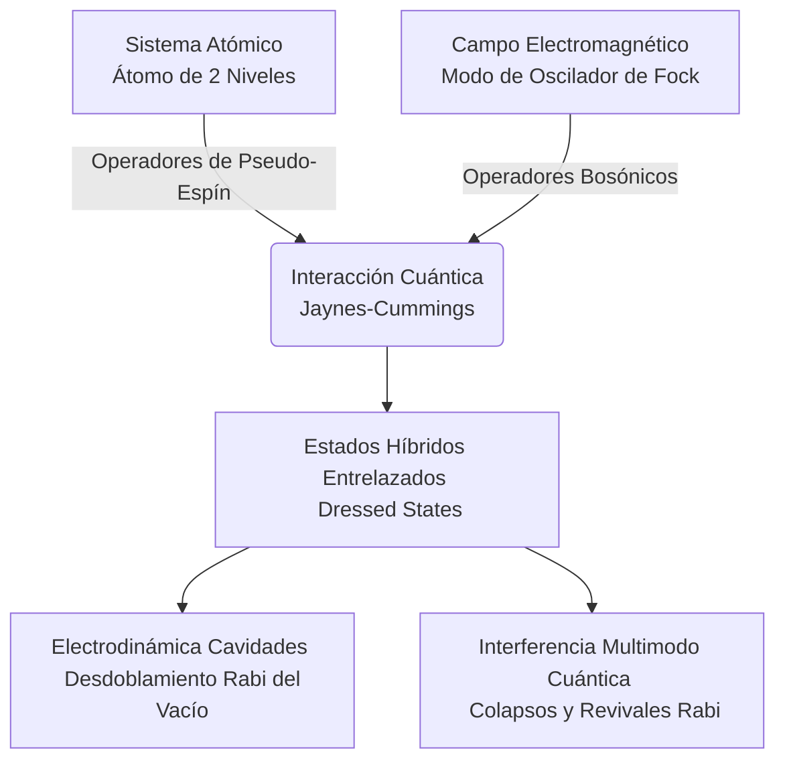

# Interacción Luz-Materia

La interacción luz-materia describe cómo los campos electromagnéticos modifican estados atómicos y moleculares, y cómo los sistemas cuánticos absorben, emiten o dispersan radiación. Aquí nacen gran parte de la espectroscopía moderna, los láseres y muchas herramientas de control cuántico.

## Conceptos Fundamentales

- **Absorción**: El sistema gana energía al capturar un fotón compatible con una transición.
- **Emisión espontánea**: Un estado excitado puede decaer emitiendo luz sin estímulo externo.
- **Emisión estimulada**: La base física de los láseres.
- **Resonancia**: La respuesta es máxima cuando la frecuencia de la luz coincide con una transición.
- **Coherencia**: Importante para interferencia, manipulación cuántica y espectroscopía de alta resolución.

## Ideas Clave

### 1. Reglas de selección
La simetría y la forma del operador dipolar determinan qué transiciones son intensas o prohibidas.

### 2. Espectroscopías
Absorción, fluorescencia, Raman y espectroscopía de microondas o infrarrojo exploran distintos grados de libertad.

### 3. Control cuántico
Pulsos de luz pueden preparar, mezclar y leer estados cuánticos con gran precisión.

## 🧮 Desarrollo Teórico Profundo

La interacción luz-materia fundamenta las propiedades ópticas de todos los sistemas físicos, desde la espectroscopía atómica hasta las tecnologías cuánticas modernas. En esta sección derivamos de forma detallada la descripción semiclásica y puramente cuántica de la interacción, avanzando desde la teoría de perturbaciones hasta la electrodinámica cuántica en cavidades.

### 1. Tratamiento Semiclásico: Aproximación Dipolar

El Hamiltoniano de un electrón (masa $m_e$ y carga $-e$) en un átomo sometido a un potencial central $V(\mathbf{r})$ e interactuando con un campo electromagnético, se puede describir acoplando la carga a los potenciales vector $\mathbf{A}(\mathbf{r}, t)$ y escalar $\phi(\mathbf{r}, t)$. Con el principio de sustitución mínima, el Hamiltoniano de acoplamiento es:

$$ \hat{H} = \frac{1}{2m_e} \left( \hat{\mathbf{p}} + e \mathbf{A}(\mathbf{r},t) \right)^2 + V(\mathbf{r}) - e \phi(\mathbf{r}, t) $$

Empleando el **calibre de Coulomb** (o transversal, $\nabla \cdot \mathbf{A} = 0$, $\phi = 0$ asumiendo ausencia de densidad de carga libre macroscópica), podemos expandir el producto $\left( \hat{\mathbf{p}} + e \mathbf{A} \right)^2$. Sabiendo que el operador momento es $\hat{\mathbf{p}} = -i\hbar\nabla$, el conmutador $[\hat{\mathbf{p}}, \mathbf{A}] \propto -i\hbar (\nabla \cdot \mathbf{A}) = 0$. Por ende:

$$ \hat{H} = \frac{\hat{\mathbf{p}}^2}{2m_e} + V(\mathbf{r}) + \frac{e}{m_e} \mathbf{A} \cdot \hat{\mathbf{p}} + \frac{e^2}{2m_e} \mathbf{A}^2 $$

A intensidades ópticas convencionales (no perturbativas hasta el régimen láser ultra-intenso), el término de interacción predominante es lineal en el potencial vector; por lo que podemos despreciar el término diamagnético de segundo orden cuadrático $\mathbf{A}^2$ en una aproximación débil.

La **aproximación dipolar** emerge al observar que la longitud de onda de la luz visible e infrarroja ($\lambda \sim 400 - 1000$ nm) es órdenes de magnitud mayor que las escalas atómicas típicas (el radio de Bohr $a_0 \approx 0.05$ nm). Matemáticamente, $e^{i\mathbf{k} \cdot \mathbf{r}} \approx 1$. Podemos así evaluar la intensidad espacialmente dependiente de la perturbación electromagnética de manera puramente local $\mathbf{A}(\mathbf{r}, t) \approx \mathbf{A}(\mathbf{0}, t)$.

Al realizar una transformación de calibre unitaria de Göppert-Mayer (transformación de fase paramétrica $\hat{U} = \exp\left[-\frac{i e}{\hbar} \mathbf{r} \cdot \mathbf{A}(\mathbf{0}, t) \right]$), pasamos al **calibre de longitud (length gauge)**:

$$ \hat{H} = \hat{H}_0 - \hat{\mathbf{d}} \cdot \mathbf{E}(t) $$

Aquí, $\hat{H}_0 = \frac{\hat{\mathbf{p}}^2}{2m_e} + V(\mathbf{r})$ es el Hamiltoniano no perturbado atómico libre. Definimos al operador de momento dipolar eléctrico $\hat{\mathbf{d}} = -e \mathbf{r}$, y la relación con el campo eléctrico clásico se mantiene como $\mathbf{E} = -\partial \mathbf{A}/\partial t$. Esta forma $-\hat{\mathbf{d}} \cdot \mathbf{E}$ es el punto de partida principal en física atómica óptica y espectroscopía infrarroja.

### 2. Teoría de Perturbaciones Dependiente del Tiempo

Si un átomo se expone a una onda plana electromagnética monocromática débil, se tiene $\mathbf{E}(t) = \mathbf{E}_0 \cos(\omega t)$. La perturbación que induce transiciones atómicas se escribe como:

$$ \hat{H}_{int}(t) = -\hat{\mathbf{d}} \cdot \mathbf{E}_0 \frac{e^{i\omega t} + e^{-i\omega t}}{2} $$

Suponiendo que un sistema atómico comienza completamente polarizado en un autoestado base estacionario $|i\rangle$, con autoenergía $E_i = \hbar\omega_i$, podemos calcular, a primer orden dentro del régimen perturbativo débil, la amplitud de transición cuántica a un autoestado ortogonal final $|f\rangle$. Planteando $|\psi(t)\rangle = \sum_n c_n(t) e^{-i\omega_n t} |n\rangle$ sobre la ecuación de Schrödinger, obtenemos los coeficientes $c_f^{(1)}(t)$:

$$ c_f^{(1)}(t) = \frac{1}{i\hbar} \int_0^t \langle f | \hat{H}_{int}(t') | i \rangle e^{i\omega_{fi}t'} dt' $$

donde la frecuencia de Bohr o de resonancia cuántica se define como $\omega_{fi} = (E_f - E_i)/\hbar$. Ejecutando la integración analítica con la condición inicial preestablecida:

$$ c_f^{(1)}(t) = -\frac{\langle f | \hat{\mathbf{d}} \cdot \mathbf{E}_0 | i \rangle}{2\hbar} \left[ \frac{e^{i(\omega_{fi} + \omega)t} - 1}{\omega_{fi} + \omega} + \frac{e^{i(\omega_{fi} - \omega)t} - 1}{\omega_{fi} - \omega} \right] $$

Analizando la resonancia de los términos espectrales, observamos que si absorbemos un fotón provocando el sistema subir de energía ($E_f > E_i$), $\omega_{fi} > 0$. Para frecuencias ópticas que coinciden en resonancia aproximadamente ($\omega \approx \omega_{fi}$), el denominador $(\omega_{fi} - \omega) \to 0$, por lo que este término secular domina fuertemente (descartando el otro antiresonante en una aproximación de RWA perturbativa).

Para derivar las tasas poblacionales promediando sobre un espectro continuo denso de luz de espectro $\rho(\omega)$, calculamos la probabilidad poblacional de la transición mediante las propiedades a tiempos largos, resultando en la asintótica **Regla de Oro de Fermi**:

$$ \Gamma_{i \to f} = \frac{2\pi}{\hbar^2} |\langle f | \hat{\mathbf{d}} \cdot \mathbf{E}_0 | i \rangle|^2 \rho(E_f) \delta(\omega_{fi} - \omega) $$

Este principio cuántico fundamenta la **espectrometría de absorción**: la absorción poblacional depende fundamentalmente del operador de transición de momento dipolar. Así surgen las **reglas de selección fotónica atómica**. Las transiciones se restringen severamente ante elementos de matriz nula. Con la paridad de funciones armónicas del orbital esférico $Y_l^m$, un átomo hidrogenoide se inhibirá para transiciones puramente simétricas exigiendo: $\Delta l = \pm 1$ y $\Delta m = 0, \pm 1$.

### 3. Modelo de Dos Niveles en el Régimen Fuerte: Oscilaciones de Rabi

Cuando los láseres generan luz monocromática de una enorme intensidad electromagnética direccional con coherencia de alto grado, los efectos no-lineales desprecian cualquier asunción perturbativa como válida. Modelamos la física mediante una dinámica simple truncando su espacio de estados infinitos a dos puramente resonantes: el estado base $|g\rangle$ y el superior excitado $|e\rangle$, con energías $0$ y $\hbar\omega_0$. 

El Hamiltoniano explícito para la base ortonormalizada $\{|e\rangle, |g\rangle\}$ es:

$$ \hat{H} = \begin{pmatrix} \hbar\omega_0 & -\mathbf{d}_{eg} \cdot \mathbf{E}_0 \cos(\omega t) \\ -\mathbf{d}_{ge} \cdot \mathbf{E}_0 \cos(\omega t) & 0 \end{pmatrix} $$

Introducimos el parámetro de frecuencia clave en dinámica óptica determinística, la **Frecuencia de Rabi** $\Omega_R = \frac{\mathbf{d}_{eg} \cdot \mathbf{E}_0}{\hbar}$, que gobierna la tasa de inducción fotónica de la coherencia. 

Transformamos el sistema rotando al marco referencial del campo láser e implementando la **Aproximación de Onda Rotatoria (Rotating-Wave Approximation, RWA)** que purga el formalismo de ruidos antiresonantes veloces con frecuencia $\sim \omega + \omega_0$. En virtud del detuning espectral $\Delta = \omega_0 - \omega$:

$$ \hat{H}_{RWA} = \frac{\hbar}{2} \begin{pmatrix} -\Delta & \Omega_R \\ \Omega_R & \Delta \end{pmatrix} $$

La diagonalización y resolución analítica dependiente del tiempo evolutivo (iniciando en $|g\rangle$) produce evoluciones armónicas perfectas de población, oscilando probabilísticamente para $P_e(t)$:

$$ P_e(t) = |c_e(t)|^2 = \frac{\Omega_R^2}{\Omega_R^2 + \Delta^2} \sin^2\left( \frac{\Omega' t}{2} \right) $$

Con una **frecuencia de Rabi generalizada** introducida en forma de norma espectral $\Omega' = \sqrt{\Omega_R^2 + \Delta^2}$. Si la sintonización atómica es exacta ($\Delta \to 0$), el láser permite una inversión poblacional periódica cíclica total (un ciclo completo requiere un área de pulso paramétrica de $\pi$, conocido como *pulso-$\pi$*).

Para ampliar a sistemas reales abiertos macroscópicos con disipación, utilizamos las **Ecuaciones de Bloch Ópticas**:

$$ \dot{\rho}_{ee} = -\Gamma \rho_{ee} + \frac{i}{2} (\Omega_R \tilde{\rho}_{ge} - \Omega_R^* \tilde{\rho}_{eg}) $$
$$ \dot{\tilde{\rho}}_{eg} = -\left( \frac{\Gamma}{2} + \gamma_d + i\Delta \right) \tilde{\rho}_{eg} + \frac{i}{2} \Omega_R (\rho_{ee} - \rho_{gg}) $$

Aquí $\Gamma$ es la relajación poblacional y $\gamma_d$ la tasa de desfasamiento puro.

### 4. Naturaleza Cuántica del Campo de Luz (Modelo Jaynes-Cummings)

Para tratar los eventos granulares discretos puramente cuánticos de absorción o emisión sin campos aproximados promediados, el oscilador armónico macroscópico electromagnético de Fock instaura operadores bosónicos $\hat{a}^\dagger$ (creación de fotón) y $\hat{a}$ (aniquilación) conmutando como $[\hat{a}, \hat{a}^\dagger] = 1$.

En sistemas altamente confinados y reflectantes (**Electrodinámica Cuántica de Cavidades - Cavity QED**), modelamos la interacción fuerte de un solitario modo resonante fotónico empleando los operadores de pseudo-espín $\hat{\sigma}_+, \hat{\sigma}_-, \hat{\sigma}_z$ para formular el **Modelo de Jaynes-Cummings** con RWA implícito:

$$ \hat{H}_{JC} = \frac{1}{2} \hbar\omega_0 \hat{\sigma}_z + \hbar\omega_c \left(\hat{a}^\dagger \hat{a} + \frac{1}{2}\right) + \hbar g (\hat{\sigma}_+ \hat{a} + \hat{\sigma}_- \hat{a}^\dagger) $$

- $g$ indica la frecuencia de acoplamiento Rabi del vacío.
- $\hat{\sigma}_+ \hat{a}$ representa explícitamente el aniquilamiento fotónico y simultánea excitación material.
- $\hat{\sigma}_- \hat{a}^\dagger$ describe intrínsecamente la radiación fundamental de emisión espontánea, incluso en el estado de vacío absoluto $n=0$ electromagnético.

La superposición hamiltoniana desintegra matrices diagonales en pequeños espacios discretos aislados entrelazados $|e, n\rangle$ frente al $|g, n+1\rangle$. Diagonalizando estos subespacios, surgen las hibridaciones polaritónicas de radiación material denominadas **Estados Vestidos (Dressed States)** en resonancia $\omega_c = \omega_0$:

$$ |+_{n}\rangle = \frac{1}{\sqrt{2}} \left( |e, n\rangle + |g, n+1\rangle \right) $$
$$ |-_n\rangle = \frac{1}{\sqrt{2}} \left( -|e, n\rangle + |g, n+1\rangle \right) $$

Esto predice el espaciamiento energético experimental cuántico observable denominado **Desdoblamiento de Vacío Rabi (Vacuum Rabi Splitting)** $2\hbar g \sqrt{n+1}$. Debido a que la luz de un láser real posee distribución de Poisson $P(n) = e^{-\langle n \rangle} \langle n \rangle^n / n!$, una superposición de modos de Jaynes-Cummings causa interferencia macroscópica de desfasamientos manifestando el célebre **Colapso y Revivificación de Rabi**, validando así con precisión absoluta la cuantización del campo electromagnético en interacción óptico-atómica.

## 📚 Recursos Específicos

### Cursos Específicos
1. [Light and Matter - MIT OCW](https://ocw.mit.edu/courses/8-04-quantum-physics-i-spring-2013/)
2. [Quantum Optics - École Polytechnique (Coursera)](https://www.coursera.org/learn/quantum-optics-1)
3. [Atomic and Optical Physics I - MIT OCW](https://ocw.mit.edu/courses/8-421-atomic-and-optical-physics-i-spring-2014/)
4. [Atomic and Optical Physics II - MIT OCW](https://ocw.mit.edu/courses/8-422-atomic-and-optical-physics-ii-spring-2013/)
5. [Lasers and Optics - NPTEL](https://nptel.ac.in/courses/115105105)

### Artículos y Simulaciones
1. [Einstein, A. (1917). *Zur Quantentheorie der Strahlung*. Phys. Z.](https://onlinelibrary.wiley.com/doi/abs/10.1002/andp.19173560604)
2. [Jaynes, E. T., & Cummings, F. W. (1963). *Comparison of quantum and semiclassical radiation theories with application to the beam maser*.](https://ieeexplore.ieee.org/document/1443594)
3. [Mollow, B. R. (1969). *Power Spectrum of Light Scattered by Two-Level Systems*.](https://journals.aps.org/pr/abstract/10.1103/PhysRev.188.1969)
4. [PhET Simulation: Lasers](https://phet.colorado.edu/en/simulations/lasers)
5. [PhET Simulation: Molecules and Light](https://phet.colorado.edu/en/simulations/molecules-and-light)
6. [Allen, L., & Eberly, J. H. (1975). *Optical Resonance and Two-Level Atoms*.](https://store.doverpublications.com/0486655334.html)
7. [Dicke, R. H. (1954). *Coherence in Spontaneous Radiation Processes*.](https://journals.aps.org/pr/abstract/10.1103/PhysRev.93.99)
8. [Haroche, S., & Kleppner, D. (1989). *Cavity Quantum Electrodynamics*.](https://physicstoday.scitation.org/doi/10.1063/1.881201)

### 📖 Referencias Útiles y Bibliografía
- [Loudon, R. (2000). *The Quantum Theory of Light*. Oxford University Press.](https://global.oup.com/academic/product/the-quantum-theory-of-light-9780198501763)
- [Cohen-Tannoudji, C., Dupont-Roc, J., & Grynberg, G. (1992). *Atom-Photon Interactions*. Wiley-VCH.](https://www.wiley.com/en-us/Atom+Photon+Interactions%3A+Basic+Processes+and+Applications-p-9780471293361)
- [Scully, M. O., & Zubairy, M. S. (1997). *Quantum Optics*. Cambridge University Press.](https://www.cambridge.org/core/books/quantum-optics/2C0485908FA5E1E66678C62A860F5E8E)
- [Foot, C. J. (2005). *Atomic Physics*. Oxford University Press.](https://global.oup.com/academic/product/atomic-physics-9780198506966)
