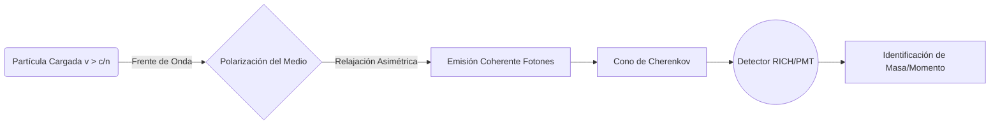

# Detectores y Aceleradores

La física moderna de partículas y nuclear depende de una instrumentación sofisticada capaz de producir haces de partículas, hacerlas colisionar y reconstruir lo ocurrido a partir de señales eléctricas, ópticas o térmicas.

## Aceleradores

- **Lineales**: Aceleran partículas a lo largo de una trayectoria recta.
- **Sincrotrones**: Usan campos magnéticos variables para mantener haces en órbitas cerradas.
- **Colisionadores**: Permiten transformar gran parte de la energía cinética en masa y nuevas partículas.
- **Luminosidad**: Mide la tasa efectiva de encuentros y es tan importante como la energía del haz.

## Detectores

- **Detectores de trazas**: Reconstruyen trayectorias y momentos en campos magnéticos.
- **Calorímetros**: Miden energía absorbida por partículas electromagnéticas o hadrónicas.
- **Detectores Cherenkov y de tiempo de vuelo**: Ayudan a identificar especies de partículas.
- **Muones y neutrinos**: Requieren estrategias experimentales específicas por su interacción débil con la materia.

## Ideas Clave

### 1. Reconstrucción de eventos
Las partículas producidas rara vez se observan directamente; se infieren a partir de firmas detectoras.

### 2. Estadística experimental
Separar señal de fondo exige grandes volúmenes de datos y análisis probabilístico.

### 3. Tecnología transversal
Muchas herramientas desarrolladas aquí acaban aplicándose en medicina, materiales, electrónica y computación.

## 🧮 Desarrollo Teórico Profundo

El diseño y comprensión de detectores y aceleradores modernos se asientan sobre los pilares del electromagnetismo clásico, la relatividad especial y la mecánica cuántica. En esta sección se abordan matemáticamente los principales fenómenos físicos subyacentes.

### 1. Dinámica de Haces en Aceleradores y Radiación Sincrotrón

#### 1.1 Ecuación de Movimiento Relativista
Una partícula de carga $q$ moviéndose en un campo eléctrico $\mathbf{E}$ y campo magnético $\mathbf{B}$ experimenta la fuerza de Lorentz:

$$
\mathbf{F} = \frac{d\mathbf{p}}{dt} = q(\mathbf{E} + \mathbf{v} \times \mathbf{B})
$$

donde el momento relativista es $\mathbf{p} = \gamma m \mathbf{v}$, con $\gamma = \left(1 - \frac{v^2}{c^2}\right)^{-1/2}$.

En un sincrotrón ideal de radio $R$, el campo magnético $B$ debe incrementarse sincrónicamente con el momento $p$ para mantener una órbita circular:

$$
p = q B R
$$

Si se aumenta la energía de la partícula impartida por cavidades de radiofrecuencia (RF), el campo magnético $B(t)$ debe escalarse linealmente con el momento.

#### 1.2 Potencia Radiada (Radiación Sincrotrón)
Una de las mayores limitaciones en aceleradores circulares de electrones y, a energías ultra-relativistas, de protones, es la emisión de radiación sincrotrón por la aceleración transversal. Utilizando la generalización relativista de la fórmula de Larmor, la potencia radiada por una partícula en trayectoria circular es:

$$
P = \frac{e^2 c}{6 \pi \epsilon_0} \frac{\gamma^4}{R^2} = \frac{e^2 c}{6 \pi \epsilon_0} \frac{E^4}{(mc^2)^4 R^2}
$$

**Prueba paso a paso (simplificada):**
1. La fórmula de Larmor no relativista es $P = \frac{e^2 a^2}{6 \pi \epsilon_0 c^3}$.
2. Transformando a cuadrivectores para asegurar invariancia Lorentz, introducimos la cuadri-aceleración $A^\mu = \frac{dU^\mu}{d\tau}$.
3. La potencia invariante es $P = -\frac{e^2}{6 \pi \epsilon_0 c^3} A^\mu A_\mu$.
4. En un movimiento circular, la aceleración transversal es perpendicular a la velocidad, por lo que $A^\mu A_\mu = -\gamma^4 a^2$.
5. Sustituyendo $a = \frac{v^2}{R} \approx \frac{c^2}{R}$ para el caso ultra-relativista, y teniendo en cuenta los factores de corrección temporal, la pérdida de energía por vuelta es $\Delta E = \oint P dt = P \frac{2\pi R}{v}$. Obteniendo:

$$
\Delta E \approx \frac{e^2}{3 \epsilon_0} \frac{\gamma^4}{R}
$$

La fuerte dependencia en $\gamma^4$ explica por qué el LHC ($m_p \sim 1 \text{ GeV/c}^2$) pierde poca energía por vuelta comparado con el LEP ($m_e \sim 0.511 \text{ MeV/c}^2$), de radio similar.

### 2. Interacción de Partículas con la Materia en Detectores

Los detectores extraen información midiendo la transferencia de energía de la partícula incidente al material del detector.

#### 2.1 Pérdida de Energía por Ionización (Fórmula de Bethe-Bloch)
Para partículas cargadas pesadas (ej. muones, protones, partículas alfa), la pérdida de energía dominante ocurre por interacciones inelásticas con los electrones atómicos. El poder de frenado viene dado por la fórmula cuántico-mecánica de Bethe-Bloch:

$$
-\left\langle \frac{dE}{dx} \right\rangle = K z^2 \frac{Z}{A} \frac{1}{\beta^2} \left[ \frac{1}{2} \ln \left( \frac{2 m_e c^2 \beta^2 \gamma^2 T_{\text{max}}}{I^2} \right) - \beta^2 - \frac{\delta(\beta \gamma)}{2} \right]
$$

Donde:
* $K = 4\pi N_A r_e^2 m_e c^2$.
* $z$: Carga de la partícula incidente en unidades de $e$.
* $Z, A$: Número atómico y másico del material absorbente.
* $\beta = v/c$, $\gamma$: Factores cinemáticos de la partícula.
* $I$: Potencial medio de excitación del material.
* $T_{\text{max}}$: Transferencia máxima de energía cinética al electrón en una única colisión:

$$
T_{\text{max}} = \frac{2 m_e c^2 \beta^2 \gamma^2}{1 + 2\gamma m_e/M + (m_e/M)^2}
$$

* $\delta(\beta \gamma)$: Corrección por el efecto de densidad, crucial para velocidades ultra-relativistas debido a la polarización del medio que reduce el campo electromagnético a largas distancias.

#### 2.2 Radiación de Frenado (Bremsstrahlung)
Para los electrones, debido a su baja masa, la pérdida por ionización se ve superada a altas energías por el *Bremsstrahlung* en el campo eléctrico de los núcleos atómicos.

$$
-\left(\frac{dE}{dx}\right)_{\text{rad}} = \frac{E}{X_0}
$$

Donde $X_0$ es la longitud de radiación. La energía del electrón decrece exponencialmente $E(x) = E_0 e^{-x/X_0}$. La energía crítica $E_c$ ocurre cuando la pérdida por ionización se iguala al *Bremsstrahlung*. Para sólidos, $E_c \approx \frac{610 \text{ MeV}}{Z+1.24}$.

#### 2.3 Radiación Cherenkov
Emitida cuando una partícula cargada viaja a través de un medio dieléctrico a una velocidad superior a la velocidad de la luz en ese medio: $v > \frac{c}{n}$.
Se emite en un cono con un ángulo de apertura característico $\theta_c$:

$$
\cos \theta_c = \frac{1}{n \beta}
$$

El número de fotones emitidos por unidad de longitud y longitud de onda viene dado por la fórmula de Frank-Tamm:

$$
\frac{d^2N}{dx d\lambda} = \frac{2\pi \alpha z^2}{\lambda^2} \left( 1 - \frac{1}{\beta^2 n^2(\lambda)} \right)
$$



### 3. Colisiones, Luminosidad y Tasas de Eventos

En experimentos de colisionadores, el rendimiento analítico está directamente dictado por la **Luminosidad ($L$)**. Para un proceso con sección eficaz de interacción $\sigma$, la tasa de eventos observados es:

$$
\frac{dN}{dt} = L \sigma
$$

Para dos haces colisionantes formados por paquetes (*bunches*) gaussianos de $N_1$ y $N_2$ partículas con una frecuencia de colisión $f$, e ignorando por un momento factores de cruce complejos:

$$
L = \frac{f N_1 N_2}{4 \pi \sigma_x \sigma_y}
$$

donde $\sigma_x, \sigma_y$ son las dispersiones transversales efectivas (desviaciones estándar de la forma gaussiana del haz) en el punto de interacción.

Integrando la luminosidad sobre el tiempo del experimento obtenemos la Luminosidad Integrada $\mathcal{L}_{\text{int}} = \int L dt$. El número total de eventos descubiertos es entonces $N_{\text{total}} = \mathcal{L}_{\text{int}} \sigma$. Esta magnitud se mide usualmente en femtobarns inversos ($\text{fb}^{-1}$), donde $1 \text{ b} = 10^{-28} \text{ m}^2$.

## 📝 Guía de Ejercicios Resueltos

### Ejercicio 1: Fórmula Semiempírica de Masas y Estabilidad Isobarica
Determine el núcleo más estable contra decaimiento beta para una familia isobárica con $A = 125$. Utilice la fórmula semiempírica de masas considerando las constantes típicas.

**Solución paso a paso:**
1. La masa atómica de un núcleo isobárico es aproximadamente una parábola en función de $Z$:

   

$$
M(A,Z) \approx \alpha Z^2 + \beta Z + \gamma
$$

2. Los términos relevantes de la fórmula de Bethe-Weizsäcker que dependen de $Z$ son el término de Coulomb y el de asimetría:

   

$$
E_C = a_c \frac{Z(Z-1)}{A^{1/3}} \approx a_c \frac{Z^2}{A^{1/3}}, \quad E_A = a_a \frac{(A-2Z)^2}{A}
$$

3. Maximizando la energía de ligadura con respecto a $Z$ (o minimizando la masa):

   

$$
\frac{\partial E_B}{\partial Z} = -2 a_c \frac{Z}{A^{1/3}} + 4 a_a \frac{A-2Z}{A} = 0
$$

4. Despejando $Z$ para el isóbaro más estable ($Z_{min}$):

   

$$
Z_{min} = \frac{A}{2 + \frac{a_c}{2 a_a} A^{2/3}}
$$

5. Utilizando valores típicos $a_c = 0.71$ MeV y $a_a = 23.2$ MeV para $A = 125$:

   

$$
Z_{min} = \frac{125}{2 + \frac{0.71}{46.4} (125)^{2/3}} = \frac{125}{2 + 0.0153 \times 25} = \frac{125}{2.3825} \approx 52.4
$$

6. El número atómico entero más cercano es $Z = 52$, que corresponde al Telurio ($^{125}\text{Te}$).

### Ejercicio 2: Cinemática Relativista del Decaimiento del Pion
Un pion neutro ($\pi^0$) en reposo decae en dos fotones ($\pi^0 \to \gamma + \gamma$). Si el pion se mueve con una velocidad $v = 0.8c$ en el sistema del laboratorio, calcule las energías máxima y mínima de los fotones emitidos.

**Solución paso a paso:**
1. En el sistema de reposo (CM) del pion, por conservación del cuadrimomento, ambos fotones tienen la misma energía $E'_1 = E'_2 = \frac{m_\pi c^2}{2}$.
2. El pion se mueve en el sistema de laboratorio (Lab) con velocidad $v=0.8c$, por lo que el factor de Lorentz es $\gamma = \frac{1}{\sqrt{1-0.8^2}} = \frac{1}{0.6} = \frac{5}{3}$.
3. Usamos la transformación de Lorentz para la energía del fotón: $E = \gamma E' (1 + \beta \cos\theta')$, donde $\theta'$ es el ángulo de emisión en el sistema CM relativo a la velocidad del pion.
4. La energía máxima ocurre cuando el fotón se emite hacia adelante ($\theta'=0$):

   

$$
E_{max} = \gamma \frac{m_\pi c^2}{2} (1 + \beta) = \frac{5}{3} \frac{135 \text{ MeV}}{2} (1 + 0.8) = 112.5 \times 1.8 = 202.5 \text{ MeV}
$$

5. La energía mínima ocurre cuando el fotón se emite hacia atrás ($\theta'=\pi$):

   

$$
E_{min} = \gamma \frac{m_\pi c^2}{2} (1 - \beta) = \frac{5}{3} \frac{135 \text{ MeV}}{2} (1 - 0.8) = 112.5 \times 0.2 = 22.5 \text{ MeV}
$$

6. Verificación: $E_{max} + E_{min} = 225 \text{ MeV}$, que es precisamente la energía total del pion en el sistema de laboratorio ($E = \gamma m_\pi c^2$).

### Ejercicio 3: Sección Eficaz de Dispersión de Rutherford Cuántica
A partir de la Regla de Oro de Fermi y la aproximación de Born, derive la sección diferencial de dispersión de una partícula de carga $z e$ y masa $m$ por un núcleo de carga $Z e$.

**Solución paso a paso:**
1. El potencial de Coulomb es $V(r) = \frac{z Z e^2}{4\pi\epsilon_0 r}$.
2. En la primera aproximación de Born, la amplitud de dispersión es proporcional a la transformada de Fourier del potencial:

   

$$
f(\theta) = -\frac{m}{2\pi\hbar^2} \int V(r) e^{i \vec{q} \cdot \vec{r}} d^3r
$$

   donde $\vec{q} = \vec{k}_f - \vec{k}_i$ es la transferencia de momento.
3. Para asegurar convergencia, se utiliza un potencial apantallado $V(r) e^{-\mu r}$ y luego se toma $\mu \to 0$. La integral resulta en:

   

$$
\int \frac{e^{-\mu r}}{r} e^{i \vec{q} \cdot \vec{r}} d^3r = \frac{4\pi}{q^2 + \mu^2} \xrightarrow{\mu \to 0} \frac{4\pi}{q^2}
$$

4. La magnitud de la transferencia de momento, considerando dispersión elástica ($|\vec{k}_i| = |\vec{k}_f| = k$), es $q = 2k \sin(\theta/2)$.
5. Sustituyendo todo, la amplitud es:

   

$$
f(\theta) = -\frac{m z Z e^2}{2\pi\hbar^2 4\pi\epsilon_0} \frac{4\pi}{(2k \sin(\theta/2))^2} = -\frac{z Z e^2}{16\pi\epsilon_0 E \sin^2(\theta/2)}
$$

6. La sección diferencial es $\frac{d\sigma}{d\Omega} = |f(\theta)|^2$:

   

$$
\frac{d\sigma}{d\Omega} = \left( \frac{z Z e^2}{16\pi\epsilon_0 E} \right)^2 \frac{1}{\sin^4(\theta/2)}
$$

   que coincide exactamente con el resultado clásico de Rutherford.

## 💻 Simulaciones Computacionales

### Simulación: Trayectoria de una Partícula en un Ciclotrón

Este script en Python utiliza métodos numéricos para simular la trayectoria de un protón dentro de un ciclotrón bajo la influencia de un campo magnético uniforme y un campo eléctrico oscilante.

```python
import numpy as np
import matplotlib.pyplot as plt
from scipy.integrate import solve_ivp

# Constantes físicas
q = 1.602e-19       # Carga del protón (C)
m = 1.673e-27       # Masa del protón (kg)
B0 = 1.5            # Campo magnético (T)
V0 = 50000.0        # Voltaje pico (V)
d = 0.05            # Distancia entre las Ds (m)
omega = q * B0 / m  # Frecuencia de resonancia (rad/s)

def cyclotron_fields(t, r):
    x, y, vx, vy = r
    
    # Campo magnético B = (0, 0, B0)
    Bx, By, Bz = 0, 0, B0
    
    # Campo eléctrico oscilante en la región entre las Ds (|x| < d/2)
    Ex = 0
    if abs(x) < d / 2:
        Ex = (V0 / d) * np.cos(omega * t)
    
    # Fuerza de Lorentz
    ax = (q / m) * (Ex + vy * Bz)
    ay = (q / m) * (-vx * Bz)
    
    return [vx, vy, ax, ay]

# Condiciones iniciales: x=0, y=0, vx=1e5, vy=0
r0 = [0, 0, 1e5, 0]
t_span = (0, 2e-6)  # Tiempo de simulación
t_eval = np.linspace(*t_span, 10000)

sol = solve_ivp(cyclotron_fields, t_span, r0, t_eval=t_eval, rtol=1e-8, atol=1e-8)

plt.figure(figsize=(8, 8))
plt.plot(sol.y[0]*1e3, sol.y[1]*1e3, label='Trayectoria del protón')
plt.axvline(-d/2 * 1e3, color='r', linestyle='--', label='Límites de las Ds')
plt.axvline(d/2 * 1e3, color='r', linestyle='--')
plt.title('Simulación de la trayectoria en un Ciclotrón')
plt.xlabel('x (mm)')
plt.ylabel('y (mm)')
plt.legend()
plt.grid(True)
plt.axis('equal')
plt.tight_layout()
plt.show()
```

## 📚 Recursos Específicos

### Cursos Online y Material Académico
1. **[MIT OCW: 8.701 Introduction to Nuclear and Particle Physics](https://ocw.mit.edu/courses/8-701-introduction-to-nuclear-and-particle-physics-fall-2020/)**
   Un curso completo impartido por el Prof. Markus Klute, que aborda de manera introductoria y avanzada los aceleradores y detectores fundamentales.
2. **[CERN Accelerator School (CAS)](https://cas.web.cern.ch/)**
   Proporciona material y notas de conferencias de la principal escuela de diseño de aceleradores del mundo, cubriendo la dinámica avanzada de haces.
3. **[US Particle Accelerator School (USPAS)](https://uspas.fnal.gov/)**
   Materiales oficiales para estudiantes avanzados en la física de los aceleradores y la tecnología de microondas aplicadas.

### Artículos Científicos Clave y su Análisis Teórico

1. **"The Large Hadron Collider: Design and Performance"** - *L. Evans and P. Bryant (2008), JINST 3 S08001*  
   [Link al artículo original](https://iopscience.iop.org/article/10.1088/1748-0221/3/08/S08001)
   
   **Importancia Teórica y Relevancia:** 
   Este artículo describe el diseño y la puesta en marcha del acelerador de partículas más potente del mundo (LHC). El desafío fundamental recae en el diseño de los imanes superconductores dipolares, los cuales deben desviar protones ultra-relativistas en una órbita circular estricta.
   
   **Contexto Matemático:** 
   La rigidez magnética del haz (magnetic rigidity), $B\rho$, define la relación entre el campo magnético $B$ y el radio de curvatura $\rho$ para una partícula de momento $p$ y carga $q$:

   

$$
B\rho = \frac{p}{q}
$$

   A velocidades ultra-relativistas, el momento se aproxima a $p \approx E/c$. En el LHC, para alcanzar una energía de colisión $E = 7 \text{ TeV}$ por haz, y con un radio en los arcos de $\rho \approx 2800 \text{ m}$, el campo magnético necesario es:

   

$$
B = \frac{7 \times 10^{12} \text{ eV}}{c \cdot 2800 \text{ m} \cdot e} \approx 8.33 \text{ T}
$$

   El artículo documenta teórica y experimentalmente cómo esta inmensa exigencia se alcanza operando cables de aleación Niobio-Titanio a temperaturas de superfluido ($1.9 \text{ K}$).

2. **"The ATLAS Experiment at the CERN Large Hadron Collider"** - *The ATLAS Collaboration (2008), JINST 3 S08003*  
   [Link al artículo original](https://iopscience.iop.org/article/10.1088/1748-0221/3/08/S08003)
   
   **Importancia Teórica y Relevancia:** 
   Explica exhaustivamente la arquitectura del detector ATLAS. La innovación teórica y de ingeniería más descollante es el gigantesco espectrómetro de muones toroidal, que permite medir la curvatura transversal de los muones con extremada precisión en el exterior de la cámara calorimétrica.
   
   **Contexto Matemático:** 
   La resolución del momento transversal, $\Delta p_T / p_T$, para una traza en un campo magnético homogéneo mide la precisión intrínseca del espectrómetro de trazas. Viene dada fenomenológicamente por:

   

$$
\frac{\Delta p_T}{p_T} = \frac{p_T \sigma_x}{0.3 B L^2} \sqrt{\frac{720}{N+4}}
$$

   donde $\sigma_x$ es la resolución espacial inherente al sensor (típicamente micrómetros), $L$ es la longitud efectiva de la trayectoria transversal dentro del campo magnético $B$, y $N$ es el número de puntos discretos medidos a lo largo de la traza. El artículo demuestra que maximizar $L$ (construyendo detectores inmensos como ATLAS) e incrementar $B$ son los métodos más críticos para minimizar la incertidumbre estadística y sistemática en colisiones de momentos extremadamente altos.

### 📖 Referencias Útiles y Bibliografía
- Leo, W. R. (1994). *Techniques for Nuclear and Particle Physics Experiments*. Springer. [DOI: 10.1007/978-3-642-57920-2](https://link.springer.com/book/10.1007/978-3-642-57920-2)
- Wiedemann, H. (2015). *Particle Accelerator Physics*. Springer. [DOI: 10.1007/978-3-319-18317-6](https://link.springer.com/book/10.1007/978-3-319-18317-6)
- Knoll, G. F. (2010). *Radiation Detection and Measurement*. Wiley.

## 🌐 Seminarios Avanzados y Literatura de Frontera

### Seminarios y Cursos
- [CERN Academic Training Lectures](https://indico.cern.ch/category/72/)
- [Fermilab Seminars](https://seminars.fnal.gov/)
- [SLAC National Accelerator Laboratory Events](https://www-public.slac.stanford.edu/events/)

### Literatura de Frontera
- [Journal of High Energy Physics (JHEP)](https://link.springer.com/journal/13130): Referencia clave para física teórica de partículas y teoría de cuerdas.
- [Physical Review C (Nuclear Physics)](https://journals.aps.org/prc/): Publica los avances más relevantes en la física de iones pesados y estructura nuclear.
- [Annual Review of Nuclear and Particle Science](https://www.annualreviews.org/journal/nucl): Proporciona revisiones exhaustivas y críticas sobre los temas de frontera en interacciones fundamentales.
