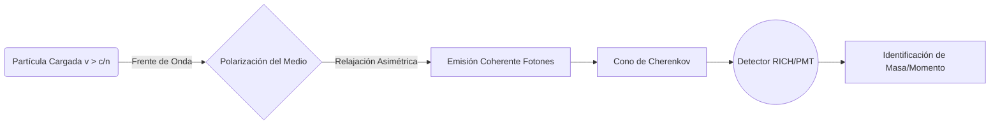

# Detectores y Aceleradores

La física moderna de partículas y nuclear depende de una instrumentación sofisticada capaz de producir haces de partículas, hacerlas colisionar y reconstruir lo ocurrido a partir de señales eléctricas, ópticas o térmicas.

## Aceleradores

- **Lineales**: Aceleran partículas a lo largo de una trayectoria recta.
- **Sincrotrones**: Usan campos magnéticos variables para mantener haces en órbitas cerradas.
- **Colisionadores**: Permiten transformar gran parte de la energía cinética en masa y nuevas partículas.
- **Luminosidad**: Mide la tasa efectiva de encuentros y es tan importante como la energía del haz.

## Detectores

- **Detectores de trazas**: Reconstruyen trayectorias y momentos en campos magnéticos.
- **Calorímetros**: Miden energía absorbida por partículas electromagnéticas o hadrónicas.
- **Detectores Cherenkov y de tiempo de vuelo**: Ayudan a identificar especies de partículas.
- **Muones y neutrinos**: Requieren estrategias experimentales específicas por su interacción débil con la materia.

## Ideas Clave

### 1. Reconstrucción de eventos
Las partículas producidas rara vez se observan directamente; se infieren a partir de firmas detectoras.

### 2. Estadística experimental
Separar señal de fondo exige grandes volúmenes de datos y análisis probabilístico.

### 3. Tecnología transversal
Muchas herramientas desarrolladas aquí acaban aplicándose en medicina, materiales, electrónica y computación.

## 🧮 Desarrollo Teórico Profundo

El diseño y comprensión de detectores y aceleradores modernos se asientan sobre los pilares del electromagnetismo clásico, la relatividad especial y la mecánica cuántica. En esta sección se abordan matemáticamente los principales fenómenos físicos subyacentes.

### 1. Dinámica de Haces en Aceleradores y Radiación Sincrotrón

#### 1.1 Ecuación de Movimiento Relativista
Una partícula de carga $q$ moviéndose en un campo eléctrico $\mathbf{E}$ y campo magnético $\mathbf{B}$ experimenta la fuerza de Lorentz:
$$ \mathbf{F} = \frac{d\mathbf{p}}{dt} = q(\mathbf{E} + \mathbf{v} \times \mathbf{B}) $$
donde el momento relativista es $\mathbf{p} = \gamma m \mathbf{v}$, con $\gamma = \left(1 - \frac{v^2}{c^2}\right)^{-1/2}$.

En un sincrotrón ideal de radio $R$, el campo magnético $B$ debe incrementarse sincrónicamente con el momento $p$ para mantener una órbita circular:
$$ p = q B R $$
Si se aumenta la energía de la partícula impartida por cavidades de radiofrecuencia (RF), el campo magnético $B(t)$ debe escalarse linealmente con el momento.

#### 1.2 Potencia Radiada (Radiación Sincrotrón)
Una de las mayores limitaciones en aceleradores circulares de electrones y, a energías ultra-relativistas, de protones, es la emisión de radiación sincrotrón por la aceleración transversal. Utilizando la generalización relativista de la fórmula de Larmor, la potencia radiada por una partícula en trayectoria circular es:
$$ P = \frac{e^2 c}{6 \pi \epsilon_0} \frac{\gamma^4}{R^2} = \frac{e^2 c}{6 \pi \epsilon_0} \frac{E^4}{(mc^2)^4 R^2} $$

**Prueba paso a paso (simplificada):**
1. La fórmula de Larmor no relativista es $P = \frac{e^2 a^2}{6 \pi \epsilon_0 c^3}$.
2. Transformando a cuadrivectores para asegurar invariancia Lorentz, introducimos la cuadri-aceleración $A^\mu = \frac{dU^\mu}{d\tau}$.
3. La potencia invariante es $P = -\frac{e^2}{6 \pi \epsilon_0 c^3} A^\mu A_\mu$.
4. En un movimiento circular, la aceleración transversal es perpendicular a la velocidad, por lo que $A^\mu A_\mu = -\gamma^4 a^2$.
5. Sustituyendo $a = \frac{v^2}{R} \approx \frac{c^2}{R}$ para el caso ultra-relativista, y teniendo en cuenta los factores de corrección temporal, la pérdida de energía por vuelta es $\Delta E = \oint P dt = P \frac{2\pi R}{v}$. Obteniendo:
$$ \Delta E \approx \frac{e^2}{3 \epsilon_0} \frac{\gamma^4}{R} $$
La fuerte dependencia en $\gamma^4$ explica por qué el LHC ($m_p \sim 1 \text{ GeV/c}^2$) pierde poca energía por vuelta comparado con el LEP ($m_e \sim 0.511 \text{ MeV/c}^2$), de radio similar.

### 2. Interacción de Partículas con la Materia en Detectores

Los detectores extraen información midiendo la transferencia de energía de la partícula incidente al material del detector.

#### 2.1 Pérdida de Energía por Ionización (Fórmula de Bethe-Bloch)
Para partículas cargadas pesadas (ej. muones, protones, partículas alfa), la pérdida de energía dominante ocurre por interacciones inelásticas con los electrones atómicos. El poder de frenado viene dado por la fórmula cuántico-mecánica de Bethe-Bloch:
$$ -\left\langle \frac{dE}{dx} \right\rangle = K z^2 \frac{Z}{A} \frac{1}{\beta^2} \left[ \frac{1}{2} \ln \left( \frac{2 m_e c^2 \beta^2 \gamma^2 T_{\text{max}}}{I^2} \right) - \beta^2 - \frac{\delta(\beta \gamma)}{2} \right] $$
Donde:
* $K = 4\pi N_A r_e^2 m_e c^2$.
* $z$: Carga de la partícula incidente en unidades de $e$.
* $Z, A$: Número atómico y másico del material absorbente.
* $\beta = v/c$, $\gamma$: Factores cinemáticos de la partícula.
* $I$: Potencial medio de excitación del material.
* $T_{\text{max}}$: Transferencia máxima de energía cinética al electrón en una única colisión:
$$ T_{\text{max}} = \frac{2 m_e c^2 \beta^2 \gamma^2}{1 + 2\gamma m_e/M + (m_e/M)^2} $$
* $\delta(\beta \gamma)$: Corrección por el efecto de densidad, crucial para velocidades ultra-relativistas debido a la polarización del medio que reduce el campo electromagnético a largas distancias.

#### 2.2 Radiación de Frenado (Bremsstrahlung)
Para los electrones, debido a su baja masa, la pérdida por ionización se ve superada a altas energías por el *Bremsstrahlung* en el campo eléctrico de los núcleos atómicos.
$$ -\left(\frac{dE}{dx}\right)_{\text{rad}} = \frac{E}{X_0} $$
Donde $X_0$ es la longitud de radiación. La energía del electrón decrece exponencialmente $E(x) = E_0 e^{-x/X_0}$. La energía crítica $E_c$ ocurre cuando la pérdida por ionización se iguala al *Bremsstrahlung*. Para sólidos, $E_c \approx \frac{610 \text{ MeV}}{Z+1.24}$.

#### 2.3 Radiación Cherenkov
Emitida cuando una partícula cargada viaja a través de un medio dieléctrico a una velocidad superior a la velocidad de la luz en ese medio: $v > \frac{c}{n}$.
Se emite en un cono con un ángulo de apertura característico $\theta_c$:
$$ \cos \theta_c = \frac{1}{n \beta} $$
El número de fotones emitidos por unidad de longitud y longitud de onda viene dado por la fórmula de Frank-Tamm:
$$ \frac{d^2N}{dx d\lambda} = \frac{2\pi \alpha z^2}{\lambda^2} \left( 1 - \frac{1}{\beta^2 n^2(\lambda)} \right) $$

### 3. Colisiones, Luminosidad y Tasas de Eventos

En experimentos de colisionadores, el rendimiento analítico está directamente dictado por la **Luminosidad ($L$)**. Para un proceso con sección eficaz de interacción $\sigma$, la tasa de eventos observados es:
$$ \frac{dN}{dt} = L \sigma $$
Para dos haces colisionantes formados por paquetes (*bunches*) gaussianos de $N_1$ y $N_2$ partículas con una frecuencia de colisión $f$, e ignorando por un momento factores de cruce complejos:
$$ L = \frac{f N_1 N_2}{4 \pi \sigma_x \sigma_y} $$
donde $\sigma_x, \sigma_y$ son las dispersiones transversales efectivas (desviaciones estándar de la forma gaussiana del haz) en el punto de interacción.

Integrando la luminosidad sobre el tiempo del experimento obtenemos la Luminosidad Integrada $\mathcal{L}_{\text{int}} = \int L dt$. El número total de eventos descubiertos es entonces $N_{\text{total}} = \mathcal{L}_{\text{int}} \sigma$. Esta magnitud se mide usualmente en femtobarns inversos ($\text{fb}^{-1}$), donde $1 \text{ b} = 10^{-28} \text{ m}^2$.

## 📚 Recursos

### Cursos Online
1. "[Particle Accelerators](https://learninghub.cern.ch/)" (CERN E-learning)
2. "[Detector Technologies for Particle Physics](https://ocw.mit.edu/courses/physics/8-811-particle-physics-ii-fall-2005/)" (MIT OCW)
3. "[Medical Applications of Particle Physics](https://www.coursera.org/learn/medical-applications-particle-physics)" (Coursera)
4. "[Data Analysis in High Energy Physics](https://www.edx.org/course/data-analysis-in-high-energy-physics)" (edX)
5. "[Instrumentation and Detection](https://online.stanford.edu/)" (Stanford Online)
6. "[Advanced Particle Accelerators](https://uspas.fnal.gov/)" (US Particle Accelerator School)

### Artículos y Simulaciones
1. "[The Large Hadron Collider: Harvest of Run 1](https://link.springer.com/book/10.1007/978-3-319-15001-7)" (Springer, 2015)
2. "[Particle Detectors](https://doi.org/10.1017/CBO9780511812606)" (Grupen & Shwartz, 2008)
3. "[Principles of Charged Particle Acceleration](https://onlinelibrary.wiley.com/)" (Stanley Humphries)
4. "[CERN Virtual Tour y Simulaciones](https://home.cern/resources/video/cern/cern-virtual-tour)"
5. "[The ATLAS Experiment at the CERN Large Hadron Collider](https://doi.org/10.1088/1748-0221/3/08/S08003)" (2008, JINST)
6. "[The CMS experiment at the CERN LHC](https://doi.org/10.1088/1748-0221/3/08/S08004)" (2008, JINST)
7. "[Simulador de Colisiones](https://phet.colorado.edu/en/simulations/category/physics)" (PhET)
8. "[Development of Silicon Strip Detectors](https://arxiv.org/)" (Review Article)

### 📖 Referencias Útiles y Bibliografía
- Leo, W. R. (1994). *[Techniques for Nuclear and Particle Physics Experiments](https://link.springer.com/book/10.1007/978-3-642-57920-2)*. Springer.
- Knoll, G. F. (2010). *[Radiation Detection and Measurement](https://www.wiley.com/en-us/Radiation+Detection+and+Measurement%2C+4th+Edition-p-9780470131480)*. John Wiley & Sons.
- Wiedemann, H. (2015). *[Particle Accelerator Physics](https://link.springer.com/book/10.1007/978-3-319-18317-6)*. Springer.
- Halzen, F., & Martin, A. D. (1984). *[Quarks and Leptons](https://www.wiley.com/en-us/Quarks+and+Leptons%3A+An+Introductory+Course+in+Modern+Particle+Physics-p-9780471887416)*. John Wiley & Sons.
