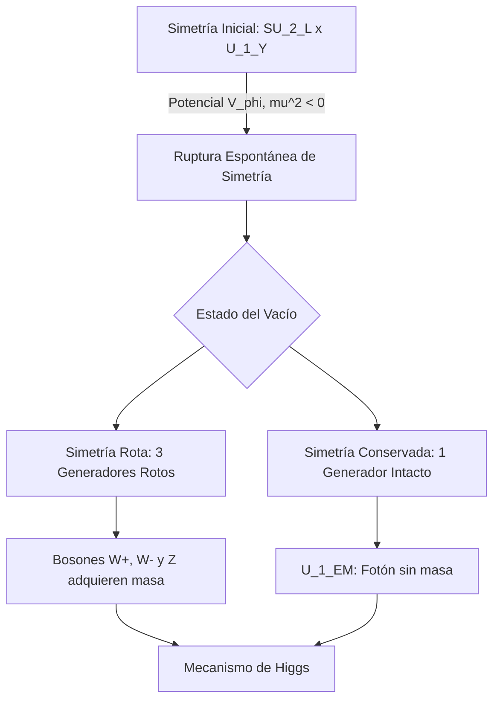

# El Modelo Estándar de Partículas
El Modelo Estándar es la teoría fundamental que describe las partículas elementales que componen la materia y las tres fuerzas fundamentales (electromagnética, débil y fuerte) que interactúan entre ellas, excluyendo la gravedad.

## 📜 Contexto Histórico
El desarrollo del Modelo Estándar comenzó en la década de 1960. Murray Gell-Mann y George Zweig propusieron de manera independiente el modelo de los quarks en 1964 para explicar la vasta "fauna" de hadrones. Sheldon Glashow, Abdus Salam y Steven Weinberg unificaron el electromagnetismo y la fuerza débil (teoría electrodébil) a finales de la década de 1960. En 1964, se propuso el mecanismo de Brout-Englert-Higgs para explicar cómo las partículas adquieren masa, lo que culminó con el descubrimiento del bosón de Higgs en el CERN en 2012.

## 🧮 Desarrollo Teórico Profundo

El Modelo Estándar es, en su núcleo, una **teoría cuántica de campos gauge no abeliana** que describe las interacciones fuertes, débiles y electromagnéticas mediante el grupo de simetría local:

$$
SU(3)_C \times SU(2)_L \times U(1)_Y
$$

donde el subíndice $C$ se refiere al "color", $L$ a la quiralidad "left-handed" (levógira), e $Y$ a la hipercarga débil. Esta formulación reposa sobre la exigencia fundamental de que las ecuaciones físicas sean invariantes bajo transformaciones locales (dependientes del espacio-tiempo) de estos grupos.

### 1. El Lagrangiano del Modelo Estándar

El lagrangiano completo se puede descomponer analíticamente en varios sectores funcionales:

$$
\mathcal{L}_{SM} = \mathcal{L}_{Gauge} + \mathcal{L}_{Fermion} + \mathcal{L}_{Higgs} + \mathcal{L}_{Yukawa}
$$

A continuación, derivamos y analizamos cada componente con rigor matemático.

#### 1.1 Sector de Gauge: $\mathcal{L}_{Gauge}$

Este sector describe la cinemática de los bosones intermediarios y sus auto-interacciones. Se construye a partir de los tensores de intensidad de campo para cada uno de los tres subgrupos.

$$
\mathcal{L}_{Gauge} = -\frac{1}{4} G_{\mu\nu}^a G^{\mu\nu,a} - \frac{1}{4} W_{\mu\nu}^i W^{\mu\nu,i} - \frac{1}{4} B_{\mu\nu} B^{\mu\nu}
$$

- **Campo $U(1)_Y$ (Bosón B):**

  

$$
B_{\mu\nu} = \partial_\mu B_\nu - \partial_\nu B_\mu
$$

  Como $U(1)$ es abeliano, no hay términos de auto-interacción (análogo al tensor de Maxwell clásico).

- **Campo $SU(2)_L$ (Bosones W, i=1,2,3):**

  

$$
W_{\mu\nu}^i = \partial_\mu W_\nu^i - \partial_\nu W_\mu^i + g \epsilon^{ijk} W_\mu^j W_\nu^k
$$

  donde $g$ es la constante de acoplamiento débil y $\epsilon^{ijk}$ son las constantes de estructura de $SU(2)$.

- **Campo $SU(3)_C$ (Gluones G, a=1..8):**

  

$$
G_{\mu\nu}^a = \partial_\mu G_\nu^a - \partial_\nu G_\mu^a + g_s f^{abc} G_\mu^b G_\nu^c
$$

  donde $g_s$ es la constante de acoplamiento fuerte y $f^{abc}$ son las constantes de estructura algebraicas de $SU(3)$.

**Demostración de Auto-interacción:** 
El término $-\frac{1}{4} W_{\mu\nu}^i W^{\mu\nu,i}$ al ser expandido genera productos de la forma $ \partial_\mu W_\nu^i (g \epsilon^{ijk} W^{\mu,j} W^{\nu,k}) $, lo que implica vértices de interacción con 3 bosones de gauge (vértices trilineales) y términos de la forma $ g^2 (\epsilon^{ijk} W_\mu^j W_\nu^k)(\epsilon^{ilm} W^{\mu,l} W^{\nu,m}) $, que representan interacciones de 4 bosones (vértices cuárticos). Esto es una propiedad exclusiva de las teorías de Yang-Mills no abelianas.

#### 1.2 Sector Fermiónico: $\mathcal{L}_{Fermion}$

Los fermiones en el Modelo Estándar (quarks y leptones) son espinores de Dirac. Sin embargo, la fuerza débil viola la paridad maximalmente, acoplándose exclusivamente a fermiones de quiralidad levógira. 
Definimos los proyectores quirales:

$$
P_{L,R} = \frac{1 \mp \gamma^5}{2}
$$

$$
\psi_{L,R} = P_{L,R} \psi
$$

El lagrangiano cinético fermiónico, requiriendo invariancia gauge local, reemplaza la derivada parcial por la derivada covariante $D_\mu$:

$$
\mathcal{L}_{Fermion} = \sum_{f} i\bar{\psi}_f \gamma^\mu D_\mu \psi_f
$$

La derivada covariante se define como:

$$
D_\mu = \partial_\mu - i g_s \frac{\lambda^a}{2} G_\mu^a - i g \frac{\tau^i}{2} W_\mu^i - i g' \frac{Y}{2} B_\mu
$$

Donde $\lambda^a$ son las matrices de Gell-Mann, $\tau^i$ las matrices de Pauli y $Y$ la hipercarga débil. El operador de carga eléctrica de Gell-Mann-Nishijima está definido algebraicamente como:

$$
Q = T_3 + \frac{Y}{2}
$$

donde $T_3$ es la tercera componente del isospín débil ($T_3 = \tau^3 / 2$).

### 2. El Mecanismo de Brout-Englert-Higgs

Un problema crítico en una teoría gauge pura es que los términos de masa para los bosones vectoriales ($ \frac{1}{2}m^2 A_\mu A^\mu $) rompen explícitamente la invariancia de gauge. Para solventarlo, se introduce un doblete de campos escalares complejos bajo $SU(2)_L$:

$$
\phi = \begin{pmatrix} \phi^+ \\ \phi^0 \end{pmatrix} = \frac{1}{\sqrt{2}} \begin{pmatrix} \phi_1 + i\phi_2 \\ \phi_3 + i\phi_4 \end{pmatrix}
$$

La hipercarga del campo de Higgs es $Y_\phi = 1$.

#### 2.1 Potencial de Higgs y Ruptura Espontánea de Simetría (SSB)

El sector de Higgs está regido por el lagrangiano:

$$
\mathcal{L}_{Higgs} = (D_\mu \phi)^\dagger (D^\mu \phi) - V(\phi)
$$

El potencial escalar toma la forma canónica:

$$
V(\phi) = \mu^2 \phi^\dagger \phi + \lambda (\phi^\dagger \phi)^2
$$

Si $\mu^2 < 0$ y $\lambda > 0$, el estado de mínima energía (el vacío) no se encuentra en $\phi = 0$, sino en una hiperesfera dada por:

$$
\phi^\dagger \phi = -\frac{\mu^2}{2\lambda} \equiv \frac{v^2}{2}
$$

donde $v \approx 246 \text{ GeV}$ es el valor esperado del vacío (VEV).
Por convención, fijamos el vacío en la dirección real de la componente neutra:

$$
\langle \phi \rangle = \frac{1}{\sqrt{2}} \begin{pmatrix} 0 \\ v \end{pmatrix}
$$

Esta elección particular **rompe espontáneamente** la simetría $SU(2)_L \times U(1)_Y$. Sin embargo, la combinación de generadores $Q = T_3 + Y/2$ aniquila el vacío:

$$
Q \langle \phi \rangle = \left( \frac{1}{2} \begin{pmatrix} 1 & 0 \\ 0 & -1 \end{pmatrix} + \frac{1}{2} \begin{pmatrix} 1 & 0 \\ 0 & 1 \end{pmatrix} \right) \frac{1}{\sqrt{2}} \begin{pmatrix} 0 \\ v \end{pmatrix} = \begin{pmatrix} 1 & 0 \\ 0 & 0 \end{pmatrix} \frac{1}{\sqrt{2}} \begin{pmatrix} 0 \\ v \end{pmatrix} = 0
$$

Esto implica que el subgrupo $U(1)_{EM}$ (electromagnetismo) permanece inquebrantable, garantizando un fotón sin masa.



#### 2.2 Adquisición de Masa de los Bosones de Gauge

Para deducir el espectro de masas vectorial, expandimos el término cinético del Higgs evaluado en el vacío:

$$
(D_\mu \langle \phi \rangle)^\dagger (D^\mu \langle \phi \rangle)
$$

Sustituyendo $\langle \phi \rangle$ en la derivada covariante (sin los gluones, ya que el Higgs no tiene carga de color):

$$
D_\mu \langle \phi \rangle = \left( \partial_\mu - i \frac{g}{2} \tau^i W_\mu^i - i \frac{g'}{2} B_\mu \right) \frac{1}{\sqrt{2}} \begin{pmatrix} 0 \\ v \end{pmatrix}
$$

Como $\langle \phi \rangle$ es constante, $\partial_\mu \langle \phi \rangle = 0$. Operando matricialmente:

$$
-i \frac{1}{2\sqrt{2}} \begin{pmatrix} g W_\mu^1 - i g W_\mu^2 \\ -g W_\mu^3 + g' B_\mu \end{pmatrix} v
$$

Al calcular el producto interno $(D_\mu \langle \phi \rangle)^\dagger (D^\mu \langle \phi \rangle)$, obtenemos los términos de masa:

$$
\frac{v^2}{8} \left[ g^2 (W_\mu^1 - i W_\mu^2)(W^{\mu 1} + i W^{\mu 2}) + (-g W_\mu^3 + g' B_\mu)^2 \right]
$$

**Paso a paso:**
1. **Bosones W:** Definimos los estados físicos con carga eléctrica como:

   

$$
W_\mu^\pm = \frac{1}{\sqrt{2}} (W_\mu^1 \mp i W_\mu^2)
$$

   El término en el lagrangiano queda como $\left(\frac{g^2 v^2}{4}\right) W_\mu^+ W^{-\mu}$. 
   Comparando con el término de masa estándar para un bosón cargado ($M_W^2 W_\mu^+ W^{-\mu}$), extraemos:

   

$$
M_W = \frac{gv}{2}
$$

2. **Bosón Z y Fotón:** El segundo término de la expansión es:

   

$$
\frac{v^2}{8} (g^2 W_\mu^3 W^{\mu 3} - 2gg' W_\mu^3 B^\mu + g'^2 B_\mu B^\mu)
$$

   Esto se puede representar en forma matricial como un acoplamiento no diagonal:

   

$$
\frac{v^2}{8} \begin{pmatrix} W_\mu^3 & B_\mu \end{pmatrix} \begin{pmatrix} g^2 & -gg' \\ -gg' & g'^2 \end{pmatrix} \begin{pmatrix} W^{\mu 3} \\ B^\mu \end{pmatrix}
$$

   Diagonalizando esta matriz simétrica, sus autovalores determinan las masas de los autoestados físicos. El determinante de la matriz es $(g^2)(g'^2) - (-gg')^2 = 0$. Esto implica inexorablemente que existe un autovalor nulo.
   - El autoestado con masa nula es el **fotón ($A_\mu$)**:

     

$$
M_A = 0
$$

   - El autoestado masivo es el **bosón $Z_\mu$**:

     

$$
M_Z = \frac{v}{2}\sqrt{g^2 + g'^2}
$$

La transformación ortogonal geométrica entre las bases se parametriza mediante el ángulo de mezcla débil (o ángulo de Weinberg, $\theta_W$):

$$
\begin{pmatrix} Z_\mu \\ A_\mu \end{pmatrix} = \begin{pmatrix} \cos\theta_W & -\sin\theta_W \\ \sin\theta_W & \cos\theta_W \end{pmatrix} \begin{pmatrix} W_\mu^3 \\ B_\mu \end{pmatrix}
$$

donde $\cos\theta_W = \frac{g}{\sqrt{g^2 + g'^2}}$ y $\sin\theta_W = \frac{g'}{\sqrt{g^2 + g'^2}}$.
Es trivial verificar la predicción teórica fundamental de que:

$$
M_W = M_Z \cos\theta_W
$$

### 3. Sector de Yukawa y Masa Fermiónica

A diferencia de los bosones de gauge, los términos de masa directos para los fermiones ($m\bar{\psi}\psi$) están prohibidos porque mezclarían estados levógiros y dextrógiros:

$$
m \bar{\psi} \psi = m (\bar{\psi}_L \psi_R + \bar{\psi}_R \psi_L)
$$

Dado que los fermiones levógiros transforman como dobletes de $SU(2)_L$ y los dextrógiros como singletes, este producto no es un singlete de gauge, lo que rompería la simetría.

El Modelo Estándar elude este obstáculo a través del acoplamiento de Yukawa con el campo de Higgs. Para un fermión genérico (por ejemplo, el electrón $e$), el lagrangiano de Yukawa es:

$$
\mathcal{L}_{Yukawa} = - y_e (\bar{L}_L \phi e_R + \bar{e}_R \phi^\dagger L_L)
$$

donde $L_L = \begin{pmatrix} \nu_{eL} \\ e_L \end{pmatrix}$ es el doblete leptónico izquierdo y $y_e$ es una constante adimensional.

Tras la Ruptura Espontánea de Simetría, sustituimos el vacío de Higgs $\phi = \frac{1}{\sqrt{2}} \begin{pmatrix} 0 \\ v + h \end{pmatrix}$:

$$
\mathcal{L}_{Yukawa} \supset - y_e \left[ (\bar{\nu}_{eL}, \bar{e}_L) \frac{1}{\sqrt{2}} \begin{pmatrix} 0 \\ v+h \end{pmatrix} e_R + \text{h.c.} \right]
$$

Expandiendo:

$$
\mathcal{L}_{Yukawa} = - \frac{y_e v}{\sqrt{2}} \bar{e}_L e_R - \frac{y_e}{\sqrt{2}} h \bar{e}_L e_R + \text{h.c.} = - m_e \bar{e} e - \frac{m_e}{v} h \bar{e} e
$$

Este proceso nos revela dos fenómenos formidables simultáneamente:
1. El electrón adquiere una masa proporcional al acoplamiento de Yukawa y al valor esperado del vacío: $m_e = \frac{y_e v}{\sqrt{2}}$.
2. El acoplamiento entre la partícula física de Higgs ($h$) y el electrón es rigurosamente proporcional a la masa del electrón ($g_{hee} = m_e / v$). Esta firma de proporcionalidad ha sido corroborada espectacularmente en los colisionadores de partículas modernos.

## 📝 Guía de Ejercicios Resueltos

### Ejercicio 1: Fórmula Semiempírica de Masas y Estabilidad Isobarica
Determine el núcleo más estable contra decaimiento beta para una familia isobárica con $A = 125$. Utilice la fórmula semiempírica de masas considerando las constantes típicas.

**Solución paso a paso:**
1. La masa atómica de un núcleo isobárico es aproximadamente una parábola en función de $Z$:

   

$$
M(A,Z) \approx \alpha Z^2 + \beta Z + \gamma
$$

2. Los términos relevantes de la fórmula de Bethe-Weizsäcker que dependen de $Z$ son el término de Coulomb y el de asimetría:

   

$$
E_C = a_c \frac{Z(Z-1)}{A^{1/3}} \approx a_c \frac{Z^2}{A^{1/3}}, \quad E_A = a_a \frac{(A-2Z)^2}{A}
$$

3. Maximizando la energía de ligadura con respecto a $Z$ (o minimizando la masa):

   

$$
\frac{\partial E_B}{\partial Z} = -2 a_c \frac{Z}{A^{1/3}} + 4 a_a \frac{A-2Z}{A} = 0
$$

4. Despejando $Z$ para el isóbaro más estable ($Z_{min}$):

   

$$
Z_{min} = \frac{A}{2 + \frac{a_c}{2 a_a} A^{2/3}}
$$

5. Utilizando valores típicos $a_c = 0.71$ MeV y $a_a = 23.2$ MeV para $A = 125$:

   

$$
Z_{min} = \frac{125}{2 + \frac{0.71}{46.4} (125)^{2/3}} = \frac{125}{2 + 0.0153 \times 25} = \frac{125}{2.3825} \approx 52.4
$$

6. El número atómico entero más cercano es $Z = 52$, que corresponde al Telurio ($^{125}\text{Te}$).

### Ejercicio 2: Cinemática Relativista del Decaimiento del Pion
Un pion neutro ($\pi^0$) en reposo decae en dos fotones ($\pi^0 \to \gamma + \gamma$). Si el pion se mueve con una velocidad $v = 0.8c$ en el sistema del laboratorio, calcule las energías máxima y mínima de los fotones emitidos.

**Solución paso a paso:**
1. En el sistema de reposo (CM) del pion, por conservación del cuadrimomento, ambos fotones tienen la misma energía $E'_1 = E'_2 = \frac{m_\pi c^2}{2}$.
2. El pion se mueve en el sistema de laboratorio (Lab) con velocidad $v=0.8c$, por lo que el factor de Lorentz es $\gamma = \frac{1}{\sqrt{1-0.8^2}} = \frac{1}{0.6} = \frac{5}{3}$.
3. Usamos la transformación de Lorentz para la energía del fotón: $E = \gamma E' (1 + \beta \cos\theta')$, donde $\theta'$ es el ángulo de emisión en el sistema CM relativo a la velocidad del pion.
4. La energía máxima ocurre cuando el fotón se emite hacia adelante ($\theta'=0$):

   

$$
E_{max} = \gamma \frac{m_\pi c^2}{2} (1 + \beta) = \frac{5}{3} \frac{135 \text{ MeV}}{2} (1 + 0.8) = 112.5 \times 1.8 = 202.5 \text{ MeV}
$$

5. La energía mínima ocurre cuando el fotón se emite hacia atrás ($\theta'=\pi$):

   

$$
E_{min} = \gamma \frac{m_\pi c^2}{2} (1 - \beta) = \frac{5}{3} \frac{135 \text{ MeV}}{2} (1 - 0.8) = 112.5 \times 0.2 = 22.5 \text{ MeV}
$$

6. Verificación: $E_{max} + E_{min} = 225 \text{ MeV}$, que es precisamente la energía total del pion en el sistema de laboratorio ($E = \gamma m_\pi c^2$).

### Ejercicio 3: Sección Eficaz de Dispersión de Rutherford Cuántica
A partir de la Regla de Oro de Fermi y la aproximación de Born, derive la sección diferencial de dispersión de una partícula de carga $z e$ y masa $m$ por un núcleo de carga $Z e$.

**Solución paso a paso:**
1. El potencial de Coulomb es $V(r) = \frac{z Z e^2}{4\pi\epsilon_0 r}$.
2. En la primera aproximación de Born, la amplitud de dispersión es proporcional a la transformada de Fourier del potencial:

   

$$
f(\theta) = -\frac{m}{2\pi\hbar^2} \int V(r) e^{i \vec{q} \cdot \vec{r}} d^3r
$$

   donde $\vec{q} = \vec{k}_f - \vec{k}_i$ es la transferencia de momento.
3. Para asegurar convergencia, se utiliza un potencial apantallado $V(r) e^{-\mu r}$ y luego se toma $\mu \to 0$. La integral resulta en:

   

$$
\int \frac{e^{-\mu r}}{r} e^{i \vec{q} \cdot \vec{r}} d^3r = \frac{4\pi}{q^2 + \mu^2} \xrightarrow{\mu \to 0} \frac{4\pi}{q^2}
$$

4. La magnitud de la transferencia de momento, considerando dispersión elástica ($|\vec{k}_i| = |\vec{k}_f| = k$), es $q = 2k \sin(\theta/2)$.
5. Sustituyendo todo, la amplitud es:

   

$$
f(\theta) = -\frac{m z Z e^2}{2\pi\hbar^2 4\pi\epsilon_0} \frac{4\pi}{(2k \sin(\theta/2))^2} = -\frac{z Z e^2}{16\pi\epsilon_0 E \sin^2(\theta/2)}
$$

6. La sección diferencial es $\frac{d\sigma}{d\Omega} = |f(\theta)|^2$:

   

$$
\frac{d\sigma}{d\Omega} = \left( \frac{z Z e^2}{16\pi\epsilon_0 E} \right)^2 \frac{1}{\sin^4(\theta/2)}
$$

   que coincide exactamente con el resultado clásico de Rutherford.

## 💻 Simulaciones Computacionales

### Simulación: Potencial del Bosón de Higgs (Mecanismo de Ruptura de Simetría)

Este script genera una visualización interactiva (o estática) en 3D del famoso "Sombrero Mexicano" o Potencial de Higgs, ilustrando la Ruptura Espontánea de Simetría.

```python
import numpy as np
import matplotlib.pyplot as plt
from mpl_toolkits.mplot3d import Axes3D

# Parámetros del potencial V(phi) = mu^2 |phi|^2 + lambda |phi|^4
# Para ruptura de simetría, mu^2 < 0 y lambda > 0
mu2 = -10.0
lam = 1.0

# Valores del campo escalar complejo phi = phi_1 + i phi_2
phi1 = np.linspace(-3, 3, 100)
phi2 = np.linspace(-3, 3, 100)
Phi1, Phi2 = np.meshgrid(phi1, phi2)
Phi_sq = Phi1**2 + Phi2**2

# Potencial V(phi)
V = mu2 * Phi_sq + lam * Phi_sq**2

# Valor esperado del vacío (VEV)
v = np.sqrt(-mu2 / (2 * lam))

fig = plt.figure(figsize=(10, 8))
ax = fig.add_subplot(111, projection='3d')
surf = ax.plot_surface(Phi1, Phi2, V, cmap='viridis', alpha=0.8, edgecolor='none')

# Representar el anillo del vacío (Mínimo de energía)
theta = np.linspace(0, 2*np.pi, 100)
ax.plot(v * np.cos(theta), v * np.sin(theta), np.min(V), color='red', linewidth=3, label='Vacío Degenerado')

ax.set_title('Potencial de Higgs (Ruptura Espontánea de Simetría)')
ax.set_xlabel('$\phi_1$')
ax.set_ylabel('$\phi_2$')
ax.set_zlabel('$V(\phi)$')
ax.legend()
plt.show()
```

## 🚀 Fronteras de Investigación y Problemas Abiertos

El Modelo Estándar, a 2026, si bien es el triunfo indiscutible de la física del siglo XX, está asediado por misterios persistentes que señalan inexorablemente a nueva física (Beyond Standard Model, BSM).

- **La Naturaleza Mayorana vs Dirac del Neutrino:** Aunque las oscilaciones de neutrinos demostraron que tienen masa, se desconoce el origen de dicha masa. ¿Adquieren masa por el mecanismo de Yukawa convencional o a través de un "See-Saw Mechanism" (Mecanismo de Balancín) de gran unificación a la escala de $\sim 10^{15} \text{ GeV}$ requiriendo neutrinos estériles supermasivos de Majorana? El decaimiento beta doble sin neutrinos ($0\nu\beta\beta$) sigue sin ser observado concluyentemente.
- **Tensión Cuántica del Momento Magnético Anómalo del Muón ($g-2$):** A pesar de los esfuerzos masivos en lattice QCD, las mediciones a 2026 de la polarización del vacío y la dispersión luz-luz (HLbL) mantienen una tensión estadística persistente $> 5\sigma$ respecto a las mediciones del experimento Muon g-2 del Fermilab, sugiriendo la interferencia de partículas virtuales exóticas (ej. leptoquarks o partículas supersimétricas ultra-ligeras).
- **El Problema del CP Fuerte (Strong CP Problem):** El lagrangiano de QCD permite matemáticamente de forma natural un término que violaría drásticamente la simetría CP ($\mathcal{L} \supset \theta \frac{g_s^2}{32\pi^2} G_{\mu\nu}^a \tilde{G}^{\mu\nu,a}$). Sin embargo, mediciones del momento dipolar eléctrico del neutrón exigen que $|\theta| < 10^{-10}$. La solución más elegante propone la simetría de Peccei-Quinn y la existencia del Axión, una de las reliquias candidatas dominantes para la materia oscura oscura oscura fría, cuya búsqueda de conversión resonante en cavidades de haloscopio de microondas es límite crítico.

## 📐 Formalismo Matemático Avanzado (Nivel Posgrado/Doctorado)

El tratamiento riguroso contemporáneo del Modelo Estándar y su extensión exige dominar la **Teoría Cuántica de Campos Algebraica**, **Cohomología de BRST**, y **Anomalías Cuánticas en Variedades de Espaciotiempo Curvo**.

La invariancia de gauge y la unitaridad del bosón gauge no-abeliano (en el sector electrodébil y de QCD) están interconectadas a través de la cuantización de Faddeev-Popov. El Lagrangiano efectivo incorpora campos ficticios "fantasmas" (ghosts) anticommutativos escalares $c^a, \bar{c}^a$:

$$
\mathcal{L}_{eff} = \mathcal{L}_{gauge} - \frac{1}{2\xi} (\partial^\mu A_\mu^a)^2 + \bar{c}^a [-\partial^\mu (\partial_\mu \delta^{ac} + g f^{abc} A_\mu^b)] c^c
$$

La topología del vacío en el Modelo Estándar exhibe una riqueza insospechada. La integral de acción de Yang-Mills posee soluciones no perturbativas llamadas Instantones, que conectan diferentes mínimos topológicamente no equivalentes del vacío (esquematizados por el índice de Pontryagin o clase de Chern, $n \in \mathbb{Z}$). 

El decaimiento anómalo y la violación bariónica-leptónica conjunta ($B+L$) a temperaturas electrodébiles, que teóricamente modela la bariogénesis, transcurre a través de la configuración estática conocida como "Sphaleron". La tasa de cruce de esta barrera de energía topológica ($E_{sph} \sim 9 \text{ TeV}$) en plasma primitivo térmico escala según:

$$
\Gamma_{sph} \approx T^4 \exp\left(-\frac{E_{sph}}{T}\right) \quad (\text{para } T \ll E_{sph})
$$

$$
\Gamma_{sph} \approx \alpha_W^5 T^4 \quad (\text{para } T > T_c \approx 160 \text{ GeV})
$$

La profunda justificación de que tales violaciones (Anomalías de Adler-Bell-Jackiw) sean finitas radica en el **Teorema del Índice de Atiyah-Singer**, que mapea rigurosamente el desequilibrio espectral del operador de Dirac invariante quiral (modos cero) al invariante topológico de la variedad diferencial riemanniana que embebe el campo de gauge electrodébil.

## 📚 Recursos Específicos

### Cursos Online y Material Académico
1. **[MIT OCW: 8.701 Introduction to Nuclear and Particle Physics](https://ocw.mit.edu/courses/8-701-introduction-to-nuclear-and-particle-physics-fall-2020/)**
   Aborda experimentalmente y teóricamente el Modelo Estándar, interacciones débiles y fuertes.
2. **[Stanford: Theoretical Minimum - Particle Physics 1](https://theoreticalminimum.com/courses/particle-physics-1/2009/fall)**
   Curso célebre de Leonard Susskind, introduciendo las bases del Modelo Estándar, SU(3)xSU(2)xU(1), de manera pedagógica pero rigurosa.
3. **[Cambridge DAMTP: Standard Model Lectures](http://www.damtp.cam.ac.uk/user/tong/smodel.html)**
   Apuntes rigurosos de David Tong sobre las Teorías de Gauge y el Modelo Estándar, altamente recomendados para profundización matemática.

### Artículos Científicos Clave y su Análisis Teórico

1. **"Broken Symmetries and the Masses of Gauge Bosons"** - *P. W. Higgs (1964), Phys. Rev. Lett. 13, 508*  
   [Link al artículo original (APS)](https://journals.aps.org/prl/abstract/10.1103/PhysRevLett.13.508)
   
   **Importancia Teórica y Relevancia:** 
   El legendario artículo que demuestra matemáticamente cómo los bosones de gauge mediadores pueden adquirir masa a través de un mecanismo de ruptura de simetría sin violar las identidades de Ward. Esto da solución a la problemática de los bosones W y Z masivos.
   
   **Contexto Matemático:** 
   Higgs analizó la teoría electromagnética escalar. Consideró un potencial tipo "sombrero mexicano":

   

$$
V(\phi) = \mu^2 \phi^* \phi + \lambda (\phi^* \phi)^2
$$

   con $\mu^2 < 0$. Al expandir el campo alrededor del mínimo asimétrico $ \phi_0 = \sqrt{-\mu^2/2\lambda} $, es decir, $\phi(x) = \phi_0 + \frac{1}{\sqrt{2}}(h_1(x) + i h_2(x))$, y acoplándolo al campo gauge covariante $D_\mu = \partial_\mu - i q A_\mu$, el término cinético genera:

   

$$
(D_\mu \phi)^* (D^\mu \phi) \approx \frac{1}{2} (\partial_\mu h_1)^2 + q^2 \phi_0^2 A_\mu A^\mu
$$

   El término cuadrático del campo $A_\mu$ actúa precisamente como un término de masa efectivo $m_A = \sqrt{2} q \phi_0$. El campo sin masa (el bosón de Nambu-Goldstone $h_2$) es completamente "absorbido" para proporcionar el grado de libertad longitudinal necesario para que el bosón vectorial transversal obtenga masa (el célebre "Mecanismo de Higgs").

2. **"A Model of Leptons"** - *S. Weinberg (1967), Phys. Rev. Lett. 19, 1264*  
   [Link al artículo original (APS)](https://journals.aps.org/prl/abstract/10.1103/PhysRevLett.19.1264)
   
   **Importancia Teórica y Relevancia:** 
   El artículo fundacional de la teoría electrodébil. Weinberg integra el mecanismo de simetría espontáneamente rota con el grupo de isospín débil e hipercarga $SU(2)_L \times U(1)_Y$, creando la base moderna del Modelo Estándar.
   
   **Contexto Matemático:** 
   En su obra, introduce el ángulo de mezcla (ahora llamado ángulo de Weinberg) $\theta_W$ para rotar los autoestados de interacción a los autoestados físicos masivos. Define analíticamente la mezcla de los bosones neutros:

   

$$
A_\mu = \sin\theta_W W_\mu^3 + \cos\theta_W B_\mu
$$

   

$$
Z_\mu = \cos\theta_W W_\mu^3 - \sin\theta_W B_\mu
$$

   donde el requerimiento fundamental de un fotón ($A_\mu$) sin masa restringe incondicionalmente la forma de la matriz de masa en la representación. Weinberg estableció magistralmente la relación teórica universal $e = g \sin\theta_W$, unificando para la eternidad la constante de estructura fina (electromagnetismo) con la fuerza débil.

### 📖 Referencias Útiles y Bibliografía
- Halzen, F., & Martin, A. D. (1984). *Quarks and Leptons*. John Wiley & Sons.
- Griffiths, D. J. (2008). *Introduction to Elementary Particles*. Wiley-VCH.
- Thomson, M. (2013). *Modern Particle Physics*. Cambridge University Press.

## 🌐 Seminarios Avanzados y Literatura de Frontera

### Seminarios y Cursos
- [CERN Academic Training Lectures](https://indico.cern.ch/category/72/)
- [Fermilab Seminars](https://seminars.fnal.gov/)
- [SLAC National Accelerator Laboratory Events](https://www-public.slac.stanford.edu/events/)

### Literatura de Frontera
- [Journal of High Energy Physics (JHEP)](https://link.springer.com/journal/13130): Referencia clave para física teórica de partículas y teoría de cuerdas.
- [Physical Review C (Nuclear Physics)](https://journals.aps.org/prc/): Publica los avances más relevantes en la física de iones pesados y estructura nuclear.
- [Annual Review of Nuclear and Particle Science](https://www.annualreviews.org/journal/nucl): Proporciona revisiones exhaustivas y críticas sobre los temas de frontera en interacciones fundamentales.
