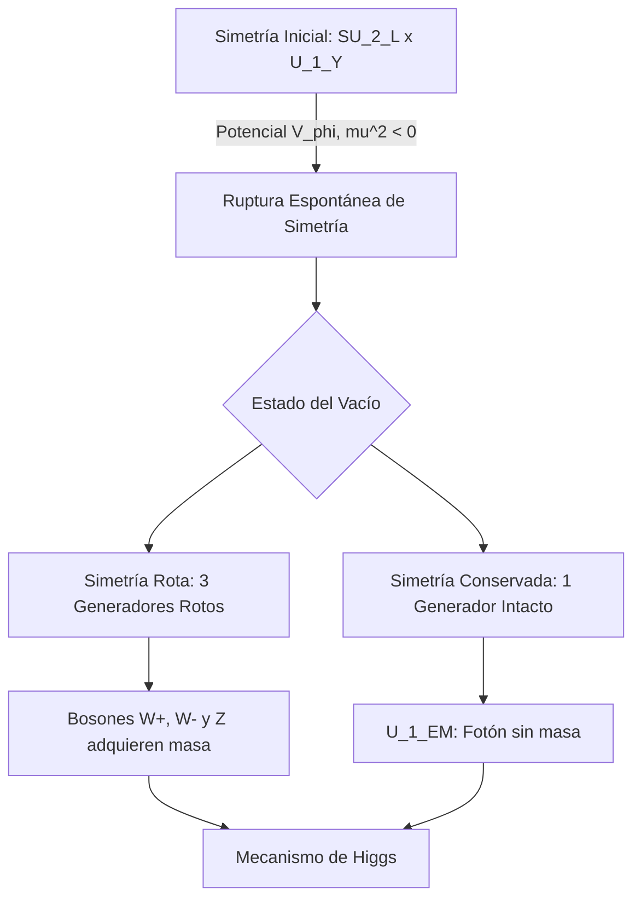

# El Modelo Estándar de Partículas
El Modelo Estándar es la teoría fundamental que describe las partículas elementales que componen la materia y las tres fuerzas fundamentales (electromagnética, débil y fuerte) que interactúan entre ellas, excluyendo la gravedad.

## 📜 Contexto Histórico
El desarrollo del Modelo Estándar comenzó en la década de 1960. Murray Gell-Mann y George Zweig propusieron de manera independiente el modelo de los quarks en 1964 para explicar la vasta "fauna" de hadrones. Sheldon Glashow, Abdus Salam y Steven Weinberg unificaron el electromagnetismo y la fuerza débil (teoría electrodébil) a finales de la década de 1960. En 1964, se propuso el mecanismo de Brout-Englert-Higgs para explicar cómo las partículas adquieren masa, lo que culminó con el descubrimiento del bosón de Higgs en el CERN en 2012.

## 🧮 Desarrollo Teórico Profundo

El Modelo Estándar es, en su núcleo, una **teoría cuántica de campos gauge no abeliana** que describe las interacciones fuertes, débiles y electromagnéticas mediante el grupo de simetría local:

$$ SU(3)_C \times SU(2)_L \times U(1)_Y $$

donde el subíndice $C$ se refiere al "color", $L$ a la quiralidad "left-handed" (levógira), e $Y$ a la hipercarga débil. Esta formulación reposa sobre la exigencia fundamental de que las ecuaciones físicas sean invariantes bajo transformaciones locales (dependientes del espacio-tiempo) de estos grupos.

### 1. El Lagrangiano del Modelo Estándar

El lagrangiano completo se puede descomponer analíticamente en varios sectores funcionales:

$$ \mathcal{L}_{SM} = \mathcal{L}_{Gauge} + \mathcal{L}_{Fermion} + \mathcal{L}_{Higgs} + \mathcal{L}_{Yukawa} $$

A continuación, derivamos y analizamos cada componente con rigor matemático.

#### 1.1 Sector de Gauge: $\mathcal{L}_{Gauge}$

Este sector describe la cinemática de los bosones intermediarios y sus auto-interacciones. Se construye a partir de los tensores de intensidad de campo para cada uno de los tres subgrupos.

$$ \mathcal{L}_{Gauge} = -\frac{1}{4} G_{\mu\nu}^a G^{\mu\nu,a} - \frac{1}{4} W_{\mu\nu}^i W^{\mu\nu,i} - \frac{1}{4} B_{\mu\nu} B^{\mu\nu} $$

- **Campo $U(1)_Y$ (Bosón B):**
  $$ B_{\mu\nu} = \partial_\mu B_\nu - \partial_\nu B_\mu $$
  Como $U(1)$ es abeliano, no hay términos de auto-interacción (análogo al tensor de Maxwell clásico).

- **Campo $SU(2)_L$ (Bosones W, i=1,2,3):**
  $$ W_{\mu\nu}^i = \partial_\mu W_\nu^i - \partial_\nu W_\mu^i + g \epsilon^{ijk} W_\mu^j W_\nu^k $$
  donde $g$ es la constante de acoplamiento débil y $\epsilon^{ijk}$ son las constantes de estructura de $SU(2)$.

- **Campo $SU(3)_C$ (Gluones G, a=1..8):**
  $$ G_{\mu\nu}^a = \partial_\mu G_\nu^a - \partial_\nu G_\mu^a + g_s f^{abc} G_\mu^b G_\nu^c $$
  donde $g_s$ es la constante de acoplamiento fuerte y $f^{abc}$ son las constantes de estructura algebraicas de $SU(3)$.

**Demostración de Auto-interacción:** 
El término $-\frac{1}{4} W_{\mu\nu}^i W^{\mu\nu,i}$ al ser expandido genera productos de la forma $ \partial_\mu W_\nu^i (g \epsilon^{ijk} W^{\mu,j} W^{\nu,k}) $, lo que implica vértices de interacción con 3 bosones de gauge (vértices trilineales) y términos de la forma $ g^2 (\epsilon^{ijk} W_\mu^j W_\nu^k)(\epsilon^{ilm} W^{\mu,l} W^{\nu,m}) $, que representan interacciones de 4 bosones (vértices cuárticos). Esto es una propiedad exclusiva de las teorías de Yang-Mills no abelianas.

#### 1.2 Sector Fermiónico: $\mathcal{L}_{Fermion}$

Los fermiones en el Modelo Estándar (quarks y leptones) son espinores de Dirac. Sin embargo, la fuerza débil viola la paridad maximalmente, acoplándose exclusivamente a fermiones de quiralidad levógira. 
Definimos los proyectores quirales:
$$ P_{L,R} = \frac{1 \mp \gamma^5}{2} $$
$$ \psi_{L,R} = P_{L,R} \psi $$

El lagrangiano cinético fermiónico, requiriendo invariancia gauge local, reemplaza la derivada parcial por la derivada covariante $D_\mu$:

$$ \mathcal{L}_{Fermion} = \sum_{f} i\bar{\psi}_f \gamma^\mu D_\mu \psi_f $$

La derivada covariante se define como:
$$ D_\mu = \partial_\mu - i g_s \frac{\lambda^a}{2} G_\mu^a - i g \frac{\tau^i}{2} W_\mu^i - i g' \frac{Y}{2} B_\mu $$
Donde $\lambda^a$ son las matrices de Gell-Mann, $\tau^i$ las matrices de Pauli y $Y$ la hipercarga débil. El operador de carga eléctrica de Gell-Mann-Nishijima está definido algebraicamente como:
$$ Q = T_3 + \frac{Y}{2} $$
donde $T_3$ es la tercera componente del isospín débil ($T_3 = \tau^3 / 2$).

### 2. El Mecanismo de Brout-Englert-Higgs

Un problema crítico en una teoría gauge pura es que los términos de masa para los bosones vectoriales ($ \frac{1}{2}m^2 A_\mu A^\mu $) rompen explícitamente la invariancia de gauge. Para solventarlo, se introduce un doblete de campos escalares complejos bajo $SU(2)_L$:

$$ \phi = \begin{pmatrix} \phi^+ \\ \phi^0 \end{pmatrix} = \frac{1}{\sqrt{2}} \begin{pmatrix} \phi_1 + i\phi_2 \\ \phi_3 + i\phi_4 \end{pmatrix} $$

La hipercarga del campo de Higgs es $Y_\phi = 1$.

#### 2.1 Potencial de Higgs y Ruptura Espontánea de Simetría (SSB)

El sector de Higgs está regido por el lagrangiano:
$$ \mathcal{L}_{Higgs} = (D_\mu \phi)^\dagger (D^\mu \phi) - V(\phi) $$

El potencial escalar toma la forma canónica:
$$ V(\phi) = \mu^2 \phi^\dagger \phi + \lambda (\phi^\dagger \phi)^2 $$

Si $\mu^2 < 0$ y $\lambda > 0$, el estado de mínima energía (el vacío) no se encuentra en $\phi = 0$, sino en una hiperesfera dada por:
$$ \phi^\dagger \phi = -\frac{\mu^2}{2\lambda} \equiv \frac{v^2}{2} $$
donde $v \approx 246 \text{ GeV}$ es el valor esperado del vacío (VEV).
Por convención, fijamos el vacío en la dirección real de la componente neutra:
$$ \langle \phi \rangle = \frac{1}{\sqrt{2}} \begin{pmatrix} 0 \\ v \end{pmatrix} $$

Esta elección particular **rompe espontáneamente** la simetría $SU(2)_L \times U(1)_Y$. Sin embargo, la combinación de generadores $Q = T_3 + Y/2$ aniquila el vacío:
$$ Q \langle \phi \rangle = \left( \frac{1}{2} \begin{pmatrix} 1 & 0 \\ 0 & -1 \end{pmatrix} + \frac{1}{2} \begin{pmatrix} 1 & 0 \\ 0 & 1 \end{pmatrix} \right) \frac{1}{\sqrt{2}} \begin{pmatrix} 0 \\ v \end{pmatrix} = \begin{pmatrix} 1 & 0 \\ 0 & 0 \end{pmatrix} \frac{1}{\sqrt{2}} \begin{pmatrix} 0 \\ v \end{pmatrix} = 0 $$
Esto implica que el subgrupo $U(1)_{EM}$ (electromagnetismo) permanece inquebrantable, garantizando un fotón sin masa.

#### 2.2 Adquisición de Masa de los Bosones de Gauge

Para deducir el espectro de masas vectorial, expandimos el término cinético del Higgs evaluado en el vacío:
$$ (D_\mu \langle \phi \rangle)^\dagger (D^\mu \langle \phi \rangle) $$

Sustituyendo $\langle \phi \rangle$ en la derivada covariante (sin los gluones, ya que el Higgs no tiene carga de color):
$$ D_\mu \langle \phi \rangle = \left( \partial_\mu - i \frac{g}{2} \tau^i W_\mu^i - i \frac{g'}{2} B_\mu \right) \frac{1}{\sqrt{2}} \begin{pmatrix} 0 \\ v \end{pmatrix} $$
Como $\langle \phi \rangle$ es constante, $\partial_\mu \langle \phi \rangle = 0$. Operando matricialmente:
$$ -i \frac{1}{2\sqrt{2}} \begin{pmatrix} g W_\mu^1 - i g W_\mu^2 \\ -g W_\mu^3 + g' B_\mu \end{pmatrix} v $$

Al calcular el producto interno $(D_\mu \langle \phi \rangle)^\dagger (D^\mu \langle \phi \rangle)$, obtenemos los términos de masa:
$$ \frac{v^2}{8} \left[ g^2 (W_\mu^1 - i W_\mu^2)(W^{\mu 1} + i W^{\mu 2}) + (-g W_\mu^3 + g' B_\mu)^2 \right] $$

**Paso a paso:**
1. **Bosones W:** Definimos los estados físicos con carga eléctrica como:
   $$ W_\mu^\pm = \frac{1}{\sqrt{2}} (W_\mu^1 \mp i W_\mu^2) $$
   El término en el lagrangiano queda como $\left(\frac{g^2 v^2}{4}\right) W_\mu^+ W^{-\mu}$. 
   Comparando con el término de masa estándar para un bosón cargado ($M_W^2 W_\mu^+ W^{-\mu}$), extraemos:
   $$ M_W = \frac{gv}{2} $$

2. **Bosón Z y Fotón:** El segundo término de la expansión es:
   $$ \frac{v^2}{8} (g^2 W_\mu^3 W^{\mu 3} - 2gg' W_\mu^3 B^\mu + g'^2 B_\mu B^\mu) $$
   Esto se puede representar en forma matricial como un acoplamiento no diagonal:
   $$ \frac{v^2}{8} \begin{pmatrix} W_\mu^3 & B_\mu \end{pmatrix} \begin{pmatrix} g^2 & -gg' \\ -gg' & g'^2 \end{pmatrix} \begin{pmatrix} W^{\mu 3} \\ B^\mu \end{pmatrix} $$
   Diagonalizando esta matriz simétrica, sus autovalores determinan las masas de los autoestados físicos. El determinante de la matriz es $(g^2)(g'^2) - (-gg')^2 = 0$. Esto implica inexorablemente que existe un autovalor nulo.
   - El autoestado con masa nula es el **fotón ($A_\mu$)**:
     $$ M_A = 0 $$
   - El autoestado masivo es el **bosón $Z_\mu$**:
     $$ M_Z = \frac{v}{2}\sqrt{g^2 + g'^2} $$

La transformación ortogonal geométrica entre las bases se parametriza mediante el ángulo de mezcla débil (o ángulo de Weinberg, $\theta_W$):
$$ \begin{pmatrix} Z_\mu \\ A_\mu \end{pmatrix} = \begin{pmatrix} \cos\theta_W & -\sin\theta_W \\ \sin\theta_W & \cos\theta_W \end{pmatrix} \begin{pmatrix} W_\mu^3 \\ B_\mu \end{pmatrix} $$
donde $\cos\theta_W = \frac{g}{\sqrt{g^2 + g'^2}}$ y $\sin\theta_W = \frac{g'}{\sqrt{g^2 + g'^2}}$.
Es trivial verificar la predicción teórica fundamental de que:
$$ M_W = M_Z \cos\theta_W $$

### 3. Sector de Yukawa y Masa Fermiónica

A diferencia de los bosones de gauge, los términos de masa directos para los fermiones ($m\bar{\psi}\psi$) están prohibidos porque mezclarían estados levógiros y dextrógiros:
$$ m \bar{\psi} \psi = m (\bar{\psi}_L \psi_R + \bar{\psi}_R \psi_L) $$
Dado que los fermiones levógiros transforman como dobletes de $SU(2)_L$ y los dextrógiros como singletes, este producto no es un singlete de gauge, lo que rompería la simetría.

El Modelo Estándar elude este obstáculo a través del acoplamiento de Yukawa con el campo de Higgs. Para un fermión genérico (por ejemplo, el electrón $e$), el lagrangiano de Yukawa es:
$$ \mathcal{L}_{Yukawa} = - y_e (\bar{L}_L \phi e_R + \bar{e}_R \phi^\dagger L_L) $$
donde $L_L = \begin{pmatrix} \nu_{eL} \\ e_L \end{pmatrix}$ es el doblete leptónico izquierdo y $y_e$ es una constante adimensional.

Tras la Ruptura Espontánea de Simetría, sustituimos el vacío de Higgs $\phi = \frac{1}{\sqrt{2}} \begin{pmatrix} 0 \\ v + h \end{pmatrix}$:
$$ \mathcal{L}_{Yukawa} \supset - y_e \left[ (\bar{\nu}_{eL}, \bar{e}_L) \frac{1}{\sqrt{2}} \begin{pmatrix} 0 \\ v+h \end{pmatrix} e_R + \text{h.c.} \right] $$
Expandiendo:
$$ \mathcal{L}_{Yukawa} = - \frac{y_e v}{\sqrt{2}} \bar{e}_L e_R - \frac{y_e}{\sqrt{2}} h \bar{e}_L e_R + \text{h.c.} = - m_e \bar{e} e - \frac{m_e}{v} h \bar{e} e $$
Este proceso nos revela dos fenómenos formidables simultáneamente:
1. El electrón adquiere una masa proporcional al acoplamiento de Yukawa y al valor esperado del vacío: $m_e = \frac{y_e v}{\sqrt{2}}$.
2. El acoplamiento entre la partícula física de Higgs ($h$) y el electrón es rigurosamente proporcional a la masa del electrón ($g_{hee} = m_e / v$). Esta firma de proporcionalidad ha sido corroborada espectacularmente en los colisionadores de partículas modernos.

## 📚 Recursos Específicos

### Cursos Online
1. "[Particle Physics](https://ocw.mit.edu/courses/physics/8-701-introduction-to-nuclear-and-particle-physics-fall-2020/)" (MIT OCW)
2. "[The Discovery of the Higgs Boson](https://www.coursera.org/learn/higgs-boson)" (Coursera - University of Edinburgh)
3. "[Quantum Field Theory](https://online.stanford.edu/courses/physics330-quantum-field-theory)" (Stanford University / edX)
4. "[The Standard Model of Particle Physics](https://online.stanford.edu/)" (Stanford Online)
5. "[Symmetries, Particles and Fields](https://www.maths.cam.ac.uk/undergrad/course/symmetries-particles-and-fields)" (University of Cambridge)
6. "[Introduction to String Theory](https://ocw.mit.edu/courses/physics/8-821-string-theory-fall-2008/)" (MIT OCW)

### Artículos y Simulaciones
1. "[CERN Document Server y Open Data Portal](https://opendata.cern.ch/)"
2. "[PDG (Particle Data Group): The Review of Particle Physics](https://pdg.lbl.gov/)"
3. "[A Model of Leptons](https://doi.org/10.1103/PhysRevLett.19.1264)" (S. Weinberg, 1967)
4. "[Broken Symmetries and the Masses of Gauge Bosons](https://doi.org/10.1103/PhysRevLett.13.508)" (P. W. Higgs, 1964)
5. "[A Schematic Model of Baryons and Mesons](https://doi.org/10.1016/S0031-9163(64)92001-3)" (M. Gell-Mann, 1964)
6. "[Observation of a new particle in the search for the Standard Model Higgs boson](https://doi.org/10.1016/j.physletb.2012.08.020)" (ATLAS Collaboration, 2012)
7. "[Observation of a new boson at a mass of 125 GeV](https://doi.org/10.1016/j.physletb.2012.08.021)" (CMS Collaboration, 2012)
8. "[Partial-symmetries of weak interactions](https://doi.org/10.1016/0029-5582(61)90469-2)" (S. L. Glashow, 1961)
9. "[Quarks and Leptons Simulation](https://phet.colorado.edu/)" (PhET)

### 📖 Referencias Útiles y Bibliografía
- Halzen, F., & Martin, A. D. (1984). *[Quarks and Leptons: An Introductory Course in Modern Particle Physics](https://www.wiley.com/en-us/Quarks+and+Leptons%3A+An+Introductory+Course+in+Modern+Particle+Physics-p-9780471887416)*. John Wiley & Sons.
- Griffiths, D. J. (2008). *[Introduction to Elementary Particles](https://www.wiley.com/en-us/Introduction+to+Elementary+Particles%2C+2nd%2C+Revised+Edition-p-9783527406012)*. Wiley-VCH.
- Thomson, M. (2013). *[Modern Particle Physics](https://doi.org/10.1017/CBO9781139525367)*. Cambridge University Press.
- Perkins, D. H. (2000). *[Introduction to High Energy Physics](https://doi.org/10.1017/CBO9780511809040)*. Cambridge University Press.
