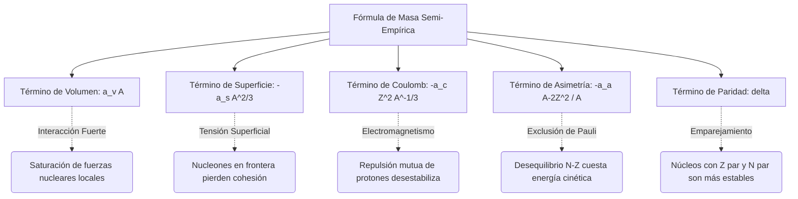

# Estructura Nuclear

La estructura nuclear estudia cómo se organizan protones y neutrones dentro del núcleo atómico y qué mecanismos explican su estabilidad, sus niveles excitados y sus reacciones.

## Conceptos Fundamentales

- **Nucleones**: Protones y neutrones, ligados por la interacción nuclear fuerte residual.
- **Número atómico y número másico**: $Z$ indica protones; $A = Z + N$ cuenta nucleones totales.
- **Defecto de masa**: La masa del núcleo es menor que la suma de las masas libres de sus nucleones.
- **Energía de enlace**: $E_b = \Delta m c^2$, medida de la estabilidad nuclear.
- **Valle de estabilidad**: Región donde la proporción protón-neutrón favorece núcleos estables.

## Modelos Importantes

### 1. Modelo de la gota líquida
Describe propiedades globales como energía de enlace, fisión y tendencias sistemáticas.

### 2. Modelo de capas
Explica números mágicos, espines nucleares y configuraciones particularmente estables.

### 3. Modelos colectivos
Describen vibraciones y rotaciones del núcleo como sistema de muchos cuerpos.

## Fenómenos Clave

- Fusión en núcleos ligeros.
- Fisión en núcleos pesados.
- Estados excitados y emisión gamma.
- Reacciones nucleares inducidas por partículas o fotones.

## 🧮 Desarrollo Teórico Profundo

La estructura nuclear yace en la frontera de la mecánica cuántica de muchos cuerpos y las interacciones fuertes fundamentales. Dado que no existe una solución analítica exacta para el núcleo debido a la complejidad de la fuerza nucleón-nucleón (que no es central, depende del espín, del isospín y presenta un núcleo duro repulsivo), los físicos han desarrollado modelos teóricos rigurosos que describen diferentes facetas de los núcleos. A continuación, desarrollaremos matemáticamente los pilares de la estructura nuclear teórica.

### 1. El Modelo de la Gota Líquida y la Fórmula de Masa Semi-Empírica

El modelo de la gota líquida (propuesto inicialmente por George Gamow y desarrollado por Niels Bohr y John Archibald Wheeler) trata el núcleo como un fluido incompresible de altísima densidad. La justificación subyacente es la saturación de las fuerzas nucleares: cada nucleón interactúa fuertemente solo con sus vecinos más cercanos, análogo a las moléculas en una gota de agua.

La masa de un núcleo de número atómico $Z$ y número másico $A = Z + N$ viene dada por la masa de sus constituyentes individuales menos su energía de enlace total $E_b(Z, A)$, expresada en unidades de masa:

$$ M(Z,A) = Z m_p + (A-Z) m_n - \frac{E_b(Z, A)}{c^2} $$

La Fórmula Semi-Empírica de Masa de Weizsäcker parametriza la energía de enlace $E_b$ como una suma de términos fundamentales:

$$ E_b(Z, A) = a_V A - a_S A^{2/3} - a_C \frac{Z(Z-1)}{A^{1/3}} - a_A \frac{(A-2Z)^2}{A} + \delta(A,Z) $$

#### Derivación Paso a Paso del Término de Coulomb

El término de Coulomb $-a_C \frac{Z(Z-1)}{A^{1/3}}$ representa la energía repulsiva electromagnética de los protones. Suponemos que el núcleo es una esfera cargada de radio $R = R_0 A^{1/3}$, donde $R_0 \approx 1.2 \text{ fm}$, con una densidad de carga constante $\rho$.

La carga total es $Q = Ze$. La densidad volumétrica de carga se expresa como:

$$ \rho = \frac{Ze}{\frac{4}{3}\pi R^3} $$

La energía potencial electrostática $U$ requerida para ensamblar esta esfera se obtiene calculando el trabajo necesario para traer sucesivas capas de carga $dq$ desde el infinito hasta un radio $r$:

$$ dU = V(r) dq $$

Donde el potencial $V(r)$ en la superficie de la sub-esfera de radio $r$ es:

$$ V(r) = \frac{1}{4\pi\epsilon_0} \frac{q(r)}{r} = \frac{1}{4\pi\epsilon_0} \frac{\frac{4}{3}\pi r^3 \rho}{r} = \frac{\rho r^2}{3\epsilon_0} $$

La carga infinitesimal en un cascarón esférico de grosor $dr$ es:

$$ dq = 4\pi r^2 \rho dr $$

Sustituyendo y multiplicando obtenemos:

$$ dU = \left( \frac{\rho r^2}{3\epsilon_0} \right) (4\pi r^2 \rho dr) = \frac{4\pi \rho^2}{3\epsilon_0} r^4 dr $$

Integramos desde el origen $r=0$ hasta el radio nuclear $R$:

$$ U = \int_0^R \frac{4\pi \rho^2}{3\epsilon_0} r^4 dr = \frac{4\pi \rho^2}{3\epsilon_0} \left[ \frac{r^5}{5} \right]_0^R = \frac{4\pi \rho^2 R^5}{15\epsilon_0} $$

Reemplazando la densidad original $\rho = \frac{3Ze}{4\pi R^3}$:

$$ U = \frac{4\pi R^5}{15\epsilon_0} \left( \frac{9 Z^2 e^2}{16 \pi^2 R^6} \right) = \frac{3 Z^2 e^2}{20 \pi \epsilon_0 R} = \frac{3}{5} \left( \frac{1}{4\pi\epsilon_0} \right) \frac{Z^2 e^2}{R} $$

Puesto que el radio obedece la regla empírica $R = R_0 A^{1/3}$, la energía resultante es:

$$ U = \frac{3}{5} \left( \frac{e^2}{4\pi\epsilon_0 R_0} \right) \frac{Z^2}{A^{1/3}} $$

Sin embargo, debido a que el núcleo está compuesto de $Z$ protones discretos en lugar de un fluido continuo, debemos excluir la interacción de cada protón consigo mismo (auto-energía electrostática). El número correcto de pares de interacción es $\frac{Z(Z-1)}{2}$, por lo que sustituimos $Z^2$ por $Z(Z-1)$. La constante fenomenológica $a_C$ toma así la forma teórica:

$$ a_C \approx \frac{3}{5} \frac{e^2}{4\pi\epsilon_0 R_0} $$

#### El Término de Asimetría: Gas de Fermi Degenerado

El término de asimetría $-a_A \frac{(A-2Z)^2}{A}$ surge del Principio de Exclusión de Pauli. Modelando a protones y neutrones como gases de Fermi independientes sin interacción dentro de una caja de volumen nuclear $V$, la densidad de estados en el espacio de momentos viene dada por $dn = \frac{V}{(2\pi \hbar)^3} d^3p$. Para fermiones de espín $1/2$, agregamos un factor 2 por la degeneración de espín:

$$ dn = 2 \frac{V}{h^3} 4\pi p^2 dp $$

Integrando desde 0 hasta el momento de Fermi $p_F$, el número total de partículas $\mathcal{N}$ (donde $\mathcal{N}$ es $Z$ o $N$) es:

$$ \mathcal{N} = \frac{8\pi V}{3 h^3} p_F^3 \implies p_F = \hbar \left( \frac{3\pi^2 \mathcal{N}}{V} \right)^{1/3} $$

La energía cinética total del gas de nucleones se calcula integrando la energía por partícula $p^2/2m$:

$$ E_K = \int_0^{p_F} \frac{p^2}{2m} dn = \frac{8\pi V}{2m h^3} \int_0^{p_F} p^4 dp = \frac{8\pi V}{10m h^3} p_F^5 = \frac{3}{5} \mathcal{N} \frac{p_F^2}{2m} $$

Para protones y neutrones combinados, si $N \neq Z$, la energía aumenta parabólicamente lejos del mínimo en $N=Z$. La perturbación expansiva muestra que el exceso de energía $\Delta E$ depende del diferencial $(N-Z)^2 = (A-2Z)^2$, validando este término crucial.

### 2. El Modelo de Capas y Acoplamiento Espín-Órbita

Mientras que el modelo de gota líquida predice las macrotendencias del núcleo, no logra explicar las anomalías drásticas de estabilidad en ciertos "números mágicos" de protones y neutrones ($2, 8, 20, 28, 50, 82, 126$). Maria Goeppert Mayer y J. Hans D. Jensen introdujeron una solución revolucionaria al formular el Modelo de Capas.

En primera aproximación, cada nucleón se mueve de forma independiente en un potencial central promedio $V(r)$ creado por todos los demás nucleones. Un punto de partida analítico es el Oscilador Armónico Tridimensional isotrópico:

$$ V(r) = \frac{1}{2} m \omega^2 r^2 $$

Resolviendo la Ecuación de Schrödinger esférica, las energías propias están cuantizadas como:

$$ E_n = \left( \mathcal{N} + \frac{3}{2} \right) \hbar \omega $$

donde $\mathcal{N} = 2(n-1) + l$, siendo $n$ el número cuántico radial y $l$ el número cuántico de momento angular orbital. Esta solución genera niveles energéticos altamente degenerados, reproduciendo los tres primeros números mágicos (2, 8, 20), pero falla para números más altos.

#### Derivación de la Fuerza Espín-Órbita

La genialidad de Mayer y Jensen fue añadir un intenso término fenomenológico de acoplamiento espín-órbita a la energía potencial $V_{ls}(r) \mathbf{L} \cdot \mathbf{S}$. El Hamiltoniano total se convierte en:

$$ \hat{H} = \frac{\hat{p}^2}{2m} + V(r) + f(r) \hat{\mathbf{L}} \cdot \hat{\mathbf{S}} $$

Para tratar el acoplamiento momento-espín, definimos el momento angular total $\mathbf{J} = \mathbf{L} + \mathbf{S}$. Utilizando el álgebra de operadores:

$$ \hat{\mathbf{J}}^2 = (\hat{\mathbf{L}} + \hat{\mathbf{S}})^2 = \hat{\mathbf{L}}^2 + \hat{\mathbf{S}}^2 + 2\hat{\mathbf{L}} \cdot \hat{\mathbf{S}} $$

Aislando el producto escalar $\hat{\mathbf{L}} \cdot \hat{\mathbf{S}}$:

$$ \hat{\mathbf{L}} \cdot \hat{\mathbf{S}} = \frac{1}{2} \left( \hat{\mathbf{J}}^2 - \hat{\mathbf{L}}^2 - \hat{\mathbf{S}}^2 \right) $$

Las funciones de onda nucleónicas están dadas en la base acoplada $|j, l, s, m_j\rangle$, por lo que son estados propios de los operadores cuadráticos correspondientes. El valor de expectación del acoplamiento es:

$$ \langle \hat{\mathbf{L}} \cdot \hat{\mathbf{S}} \rangle = \frac{\hbar^2}{2} [ j(j+1) - l(l+1) - s(s+1) ] $$

Como el nucleón es un fermión, su espín intrínseco es $s = 1/2$. El momento angular total puede tomar dos valores $j = l + 1/2$ (alineados) o $j = l - 1/2$ (anti-alineados). Computando la energía para cada caso:

**Para $j = l + 1/2$:**
$$ \langle \hat{\mathbf{L}} \cdot \hat{\mathbf{S}} \rangle = \frac{\hbar^2}{2} \left[ \left(l + \frac{1}{2}\right)\left(l + \frac{3}{2}\right) - l(l+1) - \frac{3}{4} \right] = l \frac{\hbar^2}{2} $$

**Para $j = l - 1/2$:**
$$ \langle \hat{\mathbf{L}} \cdot \hat{\mathbf{S}} \rangle = \frac{\hbar^2}{2} \left[ \left(l - \frac{1}{2}\right)\left(l + \frac{1}{2}\right) - l(l+1) - \frac{3}{4} \right] = -(l+1) \frac{\hbar^2}{2} $$

El desdoblamiento energético entre ambos estados (splitting) asciende a:

$$ \Delta E_{ls} = E_{j=l+1/2} - E_{j=l-1/2} = f(r) \frac{\hbar^2}{2} (2l+1) $$

Dado que la función radial $f(r)$ es negativa en el modelo nuclear (al contrario que en física atómica), el estado con momento angular superior ($j=l+1/2$) posee menor energía. Este desdoblamiento es extremadamente grande; crece proporcionalmente con el momento angular orbital $l$. 

Esta drástica alteración de los niveles de energía obliga a los sub-niveles con $j$ alto a "descender" y combinarse con las capas inferiores, rompiendo la estructura tradicional y generando amplios huecos de energía (gaps) que corresponden exactamente a los números mágicos experimentales restantes: **28, 50, 82, y 126**.

### 3. Diagrama de las Componentes del Modelo

El modelo de la gota líquida puede resumirse conceptualmente en el siguiente diagrama:



## 📝 Guía de Ejercicios Resueltos

### Ejercicio 1: Fórmula Semiempírica de Masas y Estabilidad Isobarica
Determine el núcleo más estable contra decaimiento beta para una familia isobárica con $A = 125$. Utilice la fórmula semiempírica de masas considerando las constantes típicas.

**Solución paso a paso:**
1. La masa atómica de un núcleo isobárico es aproximadamente una parábola en función de $Z$:
   $$ M(A,Z) \approx \alpha Z^2 + \beta Z + \gamma $$
2. Los términos relevantes de la fórmula de Bethe-Weizsäcker que dependen de $Z$ son el término de Coulomb y el de asimetría:
   $$ E_C = a_c \frac{Z(Z-1)}{A^{1/3}} \approx a_c \frac{Z^2}{A^{1/3}}, \quad E_A = a_a \frac{(A-2Z)^2}{A} $$
3. Maximizando la energía de ligadura con respecto a $Z$ (o minimizando la masa):
   $$ \frac{\partial E_B}{\partial Z} = -2 a_c \frac{Z}{A^{1/3}} + 4 a_a \frac{A-2Z}{A} = 0 $$
4. Despejando $Z$ para el isóbaro más estable ($Z_{min}$):
   $$ Z_{min} = \frac{A}{2 + \frac{a_c}{2 a_a} A^{2/3}} $$
5. Utilizando valores típicos $a_c = 0.71$ MeV y $a_a = 23.2$ MeV para $A = 125$:
   $$ Z_{min} = \frac{125}{2 + \frac{0.71}{46.4} (125)^{2/3}} = \frac{125}{2 + 0.0153 \times 25} = \frac{125}{2.3825} \approx 52.4 $$
6. El número atómico entero más cercano es $Z = 52$, que corresponde al Telurio ($^{125}\text{Te}$).

### Ejercicio 2: Cinemática Relativista del Decaimiento del Pion
Un pion neutro ($\pi^0$) en reposo decae en dos fotones ($\pi^0 \to \gamma + \gamma$). Si el pion se mueve con una velocidad $v = 0.8c$ en el sistema del laboratorio, calcule las energías máxima y mínima de los fotones emitidos.

**Solución paso a paso:**
1. En el sistema de reposo (CM) del pion, por conservación del cuadrimomento, ambos fotones tienen la misma energía $E'_1 = E'_2 = \frac{m_\pi c^2}{2}$.
2. El pion se mueve en el sistema de laboratorio (Lab) con velocidad $v=0.8c$, por lo que el factor de Lorentz es $\gamma = \frac{1}{\sqrt{1-0.8^2}} = \frac{1}{0.6} = \frac{5}{3}$.
3. Usamos la transformación de Lorentz para la energía del fotón: $E = \gamma E' (1 + \beta \cos\theta')$, donde $\theta'$ es el ángulo de emisión en el sistema CM relativo a la velocidad del pion.
4. La energía máxima ocurre cuando el fotón se emite hacia adelante ($\theta'=0$):
   $$ E_{max} = \gamma \frac{m_\pi c^2}{2} (1 + \beta) = \frac{5}{3} \frac{135 \text{ MeV}}{2} (1 + 0.8) = 112.5 \times 1.8 = 202.5 \text{ MeV} $$
5. La energía mínima ocurre cuando el fotón se emite hacia atrás ($\theta'=\pi$):
   $$ E_{min} = \gamma \frac{m_\pi c^2}{2} (1 - \beta) = \frac{5}{3} \frac{135 \text{ MeV}}{2} (1 - 0.8) = 112.5 \times 0.2 = 22.5 \text{ MeV} $$
6. Verificación: $E_{max} + E_{min} = 225 \text{ MeV}$, que es precisamente la energía total del pion en el sistema de laboratorio ($E = \gamma m_\pi c^2$).

### Ejercicio 3: Sección Eficaz de Dispersión de Rutherford Cuántica
A partir de la Regla de Oro de Fermi y la aproximación de Born, derive la sección diferencial de dispersión de una partícula de carga $z e$ y masa $m$ por un núcleo de carga $Z e$.

**Solución paso a paso:**
1. El potencial de Coulomb es $V(r) = \frac{z Z e^2}{4\pi\epsilon_0 r}$.
2. En la primera aproximación de Born, la amplitud de dispersión es proporcional a la transformada de Fourier del potencial:
   $$ f(\theta) = -\frac{m}{2\pi\hbar^2} \int V(r) e^{i \vec{q} \cdot \vec{r}} d^3r $$
   donde $\vec{q} = \vec{k}_f - \vec{k}_i$ es la transferencia de momento.
3. Para asegurar convergencia, se utiliza un potencial apantallado $V(r) e^{-\mu r}$ y luego se toma $\mu \to 0$. La integral resulta en:
   $$ \int \frac{e^{-\mu r}}{r} e^{i \vec{q} \cdot \vec{r}} d^3r = \frac{4\pi}{q^2 + \mu^2} \xrightarrow{\mu \to 0} \frac{4\pi}{q^2} $$
4. La magnitud de la transferencia de momento, considerando dispersión elástica ($|\vec{k}_i| = |\vec{k}_f| = k$), es $q = 2k \sin(\theta/2)$.
5. Sustituyendo todo, la amplitud es:
   $$ f(\theta) = -\frac{m z Z e^2}{2\pi\hbar^2 4\pi\epsilon_0} \frac{4\pi}{(2k \sin(\theta/2))^2} = -\frac{z Z e^2}{16\pi\epsilon_0 E \sin^2(\theta/2)} $$
6. La sección diferencial es $\frac{d\sigma}{d\Omega} = |f(\theta)|^2$:
   $$ \frac{d\sigma}{d\Omega} = \left( \frac{z Z e^2}{16\pi\epsilon_0 E} \right)^2 \frac{1}{\sin^4(\theta/2)} $$
   que coincide exactamente con el resultado clásico de Rutherford.

## 💻 Simulaciones Computacionales

### Simulación: Energía de Enlace por Nucleón (Fórmula Semiempírica de Masas)

Este script en Python calcula y grafica la curva de energía de enlace por nucleón (B/A) utilizando el modelo de la gota líquida para los isótopos más estables de cada elemento.

```python
import numpy as np
import matplotlib.pyplot as plt

# Constantes de la fórmula semiempírica (MeV)
aV = 15.67
aS = 17.23
aC = 0.714
aA = 23.29
aP = 11.2

def binding_energy(A, Z):
    # Términos
    vol = aV * A
    surf = aS * A**(2/3)
    coul = aC * Z**2 / (A**(1/3))
    asym = aA * (A - 2*Z)**2 / A
    
    # Emparejamiento
    N = A - Z
    if Z % 2 == 0 and N % 2 == 0:
        pairing = aP / np.sqrt(A)
    elif Z % 2 != 0 and N % 2 != 0:
        pairing = -aP / np.sqrt(A)
    else:
        pairing = 0
        
    B = vol - surf - coul - asym + pairing
    return B

# Aproximación para el Z más estable para un A dado
A_vals = np.arange(10, 250)
Z_stable = A_vals / (2 + (aC / (2 * aA)) * A_vals**(2/3))
Z_vals = np.round(Z_stable)

B_per_A = [binding_energy(A, Z) / A for A, Z in zip(A_vals, Z_vals)]

plt.figure(figsize=(10, 6))
plt.plot(A_vals, B_per_A, 'b-', label='Modelo de Gota Líquida')
plt.axvline(x=56, color='r', linestyle='--', label='Hierro-56 (Máxima Estabilidad)')
plt.title('Energía de Enlace por Nucleón vs Número Másico (A)')
plt.xlabel('Número Másico (A)')
plt.ylabel('Energía de Enlace por Nucleón (MeV)')
plt.grid(True)
plt.legend()
plt.show()
```

## 📚 Recursos Específicos

### Cursos Online y Material Académico
1. **[MIT OCW: 22.02 Introduction to Applied Nuclear Physics](https://ocw.mit.edu/courses/22-02-introduction-to-applied-nuclear-physics-spring-2012/)**
   Excelente curso que profundiza en la estructura y fenomenología nuclear, abarcando desde los modelos de capas hasta reacciones de dispersión de neutrones.
2. **[MIT OCW: 8.701 Introduction to Nuclear and Particle Physics](https://ocw.mit.edu/courses/8-701-introduction-to-nuclear-and-particle-physics-fall-2020/)**
   Proporciona el puente entre la estructura hadrónica de baja energía (QCD) y los modelos nucleares tradicionales.
3. **[NNDC: National Nuclear Data Center (Brookhaven)](https://www.nndc.bnl.gov/)**
   No es un curso, sino la base de datos más exhaustiva del mundo sobre estructura y dinámica nuclear (NuDat 3, ENSDF).

### Artículos Científicos Clave y su Análisis Teórico

1. **"On the Structure of Atomic Nuclei"** - *A. Bohr and B. R. Mottelson (1975)*  
   [Link a la Nobel Lecture (NobelPrize.org)](https://www.nobelprize.org/prizes/physics/1975/bohr/lecture/)
   
   **Importancia Teórica y Relevancia:** 
   Aage Bohr (hijo de Niels Bohr) y Ben Mottelson resolvieron la inconsistencia fundamental entre el modelo de la gota líquida macroscópico (comportamiento colectivo) y el modelo de capas independiente cuántico, fusionándolos en el **Modelo Colectivo Unificado**.
   
   **Contexto Matemático:** 
   Bohr demostró que un núcleo esférico cerrado en el modelo de capas, al excitarse o añadirle nucleones de valencia, se deforma, comportándose como un rotor asimétrico cuántico de muchos cuerpos.
   El Hamiltoniano rotacional de un núcleo deformado con forma elipsoidal se escribe intrínsecamente como:
   $$ \hat{H}_{rot} = \frac{\hbar^2}{2 \mathcal{J}} \mathbf{R}^2 $$
   donde $\mathcal{J}$ es el momento de inercia dinámico y $\mathbf{R}$ el momento angular rotacional colectivo. 
   Para núcleos par-par ($J_{base} = 0^+$), la energía de los niveles rotacionales excitados sigue rígidamente la secuencia:
   $$ E_J = \frac{\hbar^2}{2 \mathcal{J}} J(J+1) $$
   con $J = 0, 2, 4, \dots$ (los estados impares son prohibidos por la simetría de paridad). La precisión abrumadora de este escalamiento $J(J+1)$ en el espectro gamma validó magistralmente su teoría unificada.

2. **"On Closed Shells in Nuclei. II"** - *M. Goeppert Mayer (1950), Phys. Rev. 78, 16*  
   [Link al artículo original (APS)](https://journals.aps.org/pr/abstract/10.1103/PhysRev.78.16)
   
   **Importancia Teórica y Relevancia:** 
   El documento que solidificó rigurosamente la existencia del acoplamiento espín-órbita gigante, que explica teóricamente los números mágicos del modelo de capas (las anomalías de energía de ligadura).
   
   **Contexto Matemático:** 
   La base fundamental residió en el Hamiltoniano central más el acoplamiento relativista:
   $$ \hat{H} = \frac{p^2}{2m} + V(r) - \lambda \left( \frac{1}{r} \frac{dV(r)}{dr} \right) \mathbf{L} \cdot \mathbf{S} $$
   donde $\lambda > 0$ refleja un acoplamiento repulsivo respecto al gradiente del potencial (contrario a la estructura atómica de los electrones).
   La genialidad matemática de Mayer fue demostrar que la expectativa radial del desdoblamiento para un potencial de oscilador armónico escalaba fuertemente con el número cuántico de momento angular $l$.
   El splitting de energía, $\Delta E \propto l \cdot \hbar^2$, provoca que la capa $1g_{9/2}$ caiga verticalmente de su degeneración original, cerrándose el hueco mágico $N,Z = 50$, lo que fue un avance triunfal predictivo.

### 📖 Referencias Útiles y Bibliografía
- Krane, K. S. (1987). *Introductory Nuclear Physics*. John Wiley & Sons.
- Bohr, A., & Mottelson, B. R. (1998). *Nuclear Structure*. World Scientific.
- Heyde, K. (1994). *Basic Ideas and Concepts in Nuclear Physics*. CRC Press.
