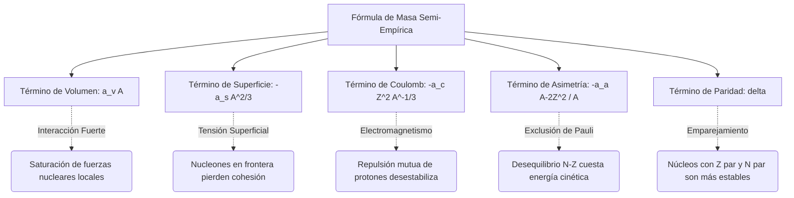

# Estructura Nuclear

La estructura nuclear estudia cómo se organizan protones y neutrones dentro del núcleo atómico y qué mecanismos explican su estabilidad, sus niveles excitados y sus reacciones.

## Conceptos Fundamentales

- **Nucleones**: Protones y neutrones, ligados por la interacción nuclear fuerte residual.
- **Número atómico y número másico**: $Z$ indica protones; $A = Z + N$ cuenta nucleones totales.
- **Defecto de masa**: La masa del núcleo es menor que la suma de las masas libres de sus nucleones.
- **Energía de enlace**: $E_b = \Delta m c^2$, medida de la estabilidad nuclear.
- **Valle de estabilidad**: Región donde la proporción protón-neutrón favorece núcleos estables.

## Modelos Importantes

### 1. Modelo de la gota líquida
Describe propiedades globales como energía de enlace, fisión y tendencias sistemáticas.

### 2. Modelo de capas
Explica números mágicos, espines nucleares y configuraciones particularmente estables.

### 3. Modelos colectivos
Describen vibraciones y rotaciones del núcleo como sistema de muchos cuerpos.

## Fenómenos Clave

- Fusión en núcleos ligeros.
- Fisión en núcleos pesados.
- Estados excitados y emisión gamma.
- Reacciones nucleares inducidas por partículas o fotones.

## 🧮 Desarrollo Teórico Profundo

La estructura nuclear yace en la frontera de la mecánica cuántica de muchos cuerpos y las interacciones fuertes fundamentales. Dado que no existe una solución analítica exacta para el núcleo debido a la complejidad de la fuerza nucleón-nucleón (que no es central, depende del espín, del isospín y presenta un núcleo duro repulsivo), los físicos han desarrollado modelos teóricos rigurosos que describen diferentes facetas de los núcleos. A continuación, desarrollaremos matemáticamente los pilares de la estructura nuclear teórica.

### 1. El Modelo de la Gota Líquida y la Fórmula de Masa Semi-Empírica

El modelo de la gota líquida (propuesto inicialmente por George Gamow y desarrollado por Niels Bohr y John Archibald Wheeler) trata el núcleo como un fluido incompresible de altísima densidad. La justificación subyacente es la saturación de las fuerzas nucleares: cada nucleón interactúa fuertemente solo con sus vecinos más cercanos, análogo a las moléculas en una gota de agua.

La masa de un núcleo de número atómico $Z$ y número másico $A = Z + N$ viene dada por la masa de sus constituyentes individuales menos su energía de enlace total $E_b(Z, A)$, expresada en unidades de masa:

$$ M(Z,A) = Z m_p + (A-Z) m_n - \frac{E_b(Z, A)}{c^2} $$

La Fórmula Semi-Empírica de Masa de Weizsäcker parametriza la energía de enlace $E_b$ como una suma de términos fundamentales:

$$ E_b(Z, A) = a_V A - a_S A^{2/3} - a_C \frac{Z(Z-1)}{A^{1/3}} - a_A \frac{(A-2Z)^2}{A} + \delta(A,Z) $$

#### Derivación Paso a Paso del Término de Coulomb

El término de Coulomb $-a_C \frac{Z(Z-1)}{A^{1/3}}$ representa la energía repulsiva electromagnética de los protones. Suponemos que el núcleo es una esfera cargada de radio $R = R_0 A^{1/3}$, donde $R_0 \approx 1.2 \text{ fm}$, con una densidad de carga constante $\rho$.

La carga total es $Q = Ze$. La densidad volumétrica de carga se expresa como:

$$ \rho = \frac{Ze}{\frac{4}{3}\pi R^3} $$

La energía potencial electrostática $U$ requerida para ensamblar esta esfera se obtiene calculando el trabajo necesario para traer sucesivas capas de carga $dq$ desde el infinito hasta un radio $r$:

$$ dU = V(r) dq $$

Donde el potencial $V(r)$ en la superficie de la sub-esfera de radio $r$ es:

$$ V(r) = \frac{1}{4\pi\epsilon_0} \frac{q(r)}{r} = \frac{1}{4\pi\epsilon_0} \frac{\frac{4}{3}\pi r^3 \rho}{r} = \frac{\rho r^2}{3\epsilon_0} $$

La carga infinitesimal en un cascarón esférico de grosor $dr$ es:

$$ dq = 4\pi r^2 \rho dr $$

Sustituyendo y multiplicando obtenemos:

$$ dU = \left( \frac{\rho r^2}{3\epsilon_0} \right) (4\pi r^2 \rho dr) = \frac{4\pi \rho^2}{3\epsilon_0} r^4 dr $$

Integramos desde el origen $r=0$ hasta el radio nuclear $R$:

$$ U = \int_0^R \frac{4\pi \rho^2}{3\epsilon_0} r^4 dr = \frac{4\pi \rho^2}{3\epsilon_0} \left[ \frac{r^5}{5} \right]_0^R = \frac{4\pi \rho^2 R^5}{15\epsilon_0} $$

Reemplazando la densidad original $\rho = \frac{3Ze}{4\pi R^3}$:

$$ U = \frac{4\pi R^5}{15\epsilon_0} \left( \frac{9 Z^2 e^2}{16 \pi^2 R^6} \right) = \frac{3 Z^2 e^2}{20 \pi \epsilon_0 R} = \frac{3}{5} \left( \frac{1}{4\pi\epsilon_0} \right) \frac{Z^2 e^2}{R} $$

Puesto que el radio obedece la regla empírica $R = R_0 A^{1/3}$, la energía resultante es:

$$ U = \frac{3}{5} \left( \frac{e^2}{4\pi\epsilon_0 R_0} \right) \frac{Z^2}{A^{1/3}} $$

Sin embargo, debido a que el núcleo está compuesto de $Z$ protones discretos en lugar de un fluido continuo, debemos excluir la interacción de cada protón consigo mismo (auto-energía electrostática). El número correcto de pares de interacción es $\frac{Z(Z-1)}{2}$, por lo que sustituimos $Z^2$ por $Z(Z-1)$. La constante fenomenológica $a_C$ toma así la forma teórica:

$$ a_C \approx \frac{3}{5} \frac{e^2}{4\pi\epsilon_0 R_0} $$

#### El Término de Asimetría: Gas de Fermi Degenerado

El término de asimetría $-a_A \frac{(A-2Z)^2}{A}$ surge del Principio de Exclusión de Pauli. Modelando a protones y neutrones como gases de Fermi independientes sin interacción dentro de una caja de volumen nuclear $V$, la densidad de estados en el espacio de momentos viene dada por $dn = \frac{V}{(2\pi \hbar)^3} d^3p$. Para fermiones de espín $1/2$, agregamos un factor 2 por la degeneración de espín:

$$ dn = 2 \frac{V}{h^3} 4\pi p^2 dp $$

Integrando desde 0 hasta el momento de Fermi $p_F$, el número total de partículas $\mathcal{N}$ (donde $\mathcal{N}$ es $Z$ o $N$) es:

$$ \mathcal{N} = \frac{8\pi V}{3 h^3} p_F^3 \implies p_F = \hbar \left( \frac{3\pi^2 \mathcal{N}}{V} \right)^{1/3} $$

La energía cinética total del gas de nucleones se calcula integrando la energía por partícula $p^2/2m$:

$$ E_K = \int_0^{p_F} \frac{p^2}{2m} dn = \frac{8\pi V}{2m h^3} \int_0^{p_F} p^4 dp = \frac{8\pi V}{10m h^3} p_F^5 = \frac{3}{5} \mathcal{N} \frac{p_F^2}{2m} $$

Para protones y neutrones combinados, si $N \neq Z$, la energía aumenta parabólicamente lejos del mínimo en $N=Z$. La perturbación expansiva muestra que el exceso de energía $\Delta E$ depende del diferencial $(N-Z)^2 = (A-2Z)^2$, validando este término crucial.

### 2. El Modelo de Capas y Acoplamiento Espín-Órbita

Mientras que el modelo de gota líquida predice las macrotendencias del núcleo, no logra explicar las anomalías drásticas de estabilidad en ciertos "números mágicos" de protones y neutrones ($2, 8, 20, 28, 50, 82, 126$). Maria Goeppert Mayer y J. Hans D. Jensen introdujeron una solución revolucionaria al formular el Modelo de Capas.

En primera aproximación, cada nucleón se mueve de forma independiente en un potencial central promedio $V(r)$ creado por todos los demás nucleones. Un punto de partida analítico es el Oscilador Armónico Tridimensional isotrópico:

$$ V(r) = \frac{1}{2} m \omega^2 r^2 $$

Resolviendo la Ecuación de Schrödinger esférica, las energías propias están cuantizadas como:

$$ E_n = \left( \mathcal{N} + \frac{3}{2} \right) \hbar \omega $$

donde $\mathcal{N} = 2(n-1) + l$, siendo $n$ el número cuántico radial y $l$ el número cuántico de momento angular orbital. Esta solución genera niveles energéticos altamente degenerados, reproduciendo los tres primeros números mágicos (2, 8, 20), pero falla para números más altos.

#### Derivación de la Fuerza Espín-Órbita

La genialidad de Mayer y Jensen fue añadir un intenso término fenomenológico de acoplamiento espín-órbita a la energía potencial $V_{ls}(r) \mathbf{L} \cdot \mathbf{S}$. El Hamiltoniano total se convierte en:

$$ \hat{H} = \frac{\hat{p}^2}{2m} + V(r) + f(r) \hat{\mathbf{L}} \cdot \hat{\mathbf{S}} $$

Para tratar el acoplamiento momento-espín, definimos el momento angular total $\mathbf{J} = \mathbf{L} + \mathbf{S}$. Utilizando el álgebra de operadores:

$$ \hat{\mathbf{J}}^2 = (\hat{\mathbf{L}} + \hat{\mathbf{S}})^2 = \hat{\mathbf{L}}^2 + \hat{\mathbf{S}}^2 + 2\hat{\mathbf{L}} \cdot \hat{\mathbf{S}} $$

Aislando el producto escalar $\hat{\mathbf{L}} \cdot \hat{\mathbf{S}}$:

$$ \hat{\mathbf{L}} \cdot \hat{\mathbf{S}} = \frac{1}{2} \left( \hat{\mathbf{J}}^2 - \hat{\mathbf{L}}^2 - \hat{\mathbf{S}}^2 \right) $$

Las funciones de onda nucleónicas están dadas en la base acoplada $|j, l, s, m_j\rangle$, por lo que son estados propios de los operadores cuadráticos correspondientes. El valor de expectación del acoplamiento es:

$$ \langle \hat{\mathbf{L}} \cdot \hat{\mathbf{S}} \rangle = \frac{\hbar^2}{2} [ j(j+1) - l(l+1) - s(s+1) ] $$

Como el nucleón es un fermión, su espín intrínseco es $s = 1/2$. El momento angular total puede tomar dos valores $j = l + 1/2$ (alineados) o $j = l - 1/2$ (anti-alineados). Computando la energía para cada caso:

**Para $j = l + 1/2$:**
$$ \langle \hat{\mathbf{L}} \cdot \hat{\mathbf{S}} \rangle = \frac{\hbar^2}{2} \left[ \left(l + \frac{1}{2}\right)\left(l + \frac{3}{2}\right) - l(l+1) - \frac{3}{4} \right] = l \frac{\hbar^2}{2} $$

**Para $j = l - 1/2$:**
$$ \langle \hat{\mathbf{L}} \cdot \hat{\mathbf{S}} \rangle = \frac{\hbar^2}{2} \left[ \left(l - \frac{1}{2}\right)\left(l + \frac{1}{2}\right) - l(l+1) - \frac{3}{4} \right] = -(l+1) \frac{\hbar^2}{2} $$

El desdoblamiento energético entre ambos estados (splitting) asciende a:

$$ \Delta E_{ls} = E_{j=l+1/2} - E_{j=l-1/2} = f(r) \frac{\hbar^2}{2} (2l+1) $$

Dado que la función radial $f(r)$ es negativa en el modelo nuclear (al contrario que en física atómica), el estado con momento angular superior ($j=l+1/2$) posee menor energía. Este desdoblamiento es extremadamente grande; crece proporcionalmente con el momento angular orbital $l$. 

Esta drástica alteración de los niveles de energía obliga a los sub-niveles con $j$ alto a "descender" y combinarse con las capas inferiores, rompiendo la estructura tradicional y generando amplios huecos de energía (gaps) que corresponden exactamente a los números mágicos experimentales restantes: **28, 50, 82, y 126**.

### 3. Diagrama de las Componentes del Modelo

El modelo de la gota líquida puede resumirse conceptualmente en el siguiente diagrama:

## 📚 Recursos

### Cursos Online
1. "[Nuclear Structure and Reactions](https://ocw.mit.edu/courses/physics/8-701-introduction-to-nuclear-and-particle-physics-fall-2020/)" (MIT OCW)
2. "[Introduction to Nuclear Physics](https://www.coursera.org/learn/nuclear-physics)" (Coursera)
3. "[Advanced Nuclear Physics](https://www.edx.org/)" (edX)
4. "[Nuclear Models and Decay](https://online.stanford.edu/)" (Stanford Online)
5. "[Many-Body Physics in Nuclear Systems](https://phys.washington.edu/)" (University of Washington)

### Artículos y Simulaciones
1. "[The Shell Model of the Nucleus](https://www.nobelprize.org/prizes/physics/1963/mayer/lecture/)" (Maria Goeppert Mayer, Nobel Lecture)
2. "[On the Structure of Atomic Nuclei](https://www.nobelprize.org/prizes/physics/1975/bohr/lecture/)" (A. Bohr and B. Mottelson)
3. "[Nuclear Structure Database](https://www.nndc.bnl.gov/)" (NNDC)
4. "[Collective Model of the Nucleus](https://doi.org/10.1103/RevModPhys.28.432)" (Review Article)
5. "[Build a Nucleus](https://phet.colorado.edu/en/simulations/build-a-nucleus)" (PhET Interactive Simulations)
6. "[Magic Numbers in Nuclear Structure](https://physicstoday.scitation.org/)" (Physics Today)
7. "[Isospin in Nuclear Physics](https://www.annualreviews.org/)" (Annual Review of Nuclear Science)
8. "[The Liquid Drop Model and Nuclear Fission](https://doi.org/10.1103/PhysRev.56.426)" (N. Bohr, J.A. Wheeler)

### 📖 Referencias Útiles y Bibliografía
- Krane, K. S. (1987). *[Introductory Nuclear Physics](https://www.wiley.com/en-us/Introductory+Nuclear+Physics%2C+3rd+Edition-p-9780471805533)*. John Wiley & Sons.
- Wong, S. S. M. (1998). *[Introductory Nuclear Physics](https://www.wiley.com/en-us/Introductory+Nuclear+Physics%2C+2nd+Edition-p-9780471239734)*. Wiley.
- Bohr, A., & Mottelson, B. R. (1998). *[Nuclear Structure](https://www.worldscientific.com/worldscibooks/10.1142/3530)*. World Scientific.
- Heyde, K. (1994). *[Basic Ideas and Concepts in Nuclear Physics](https://www.routledge.com/Basic-Ideas-and-Concepts-in-Nuclear-Physics-An-Introductory-Approach/Heyde/p/book/9780750305341)*. CRC Press.
