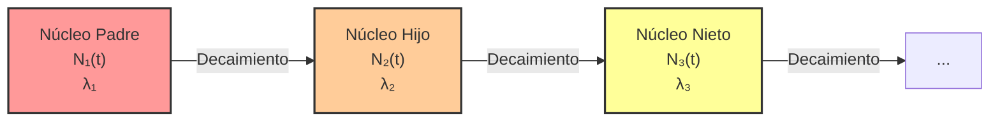

# Estructura Nuclear y Radiactividad
La estructura nuclear trata sobre cómo los protones y neutrones (nucleones) se unen mediante la fuerza nuclear fuerte para formar el núcleo del átomo. La radiactividad es el proceso estocástico por el cual núcleos inestables pierden energía emitiendo radiación.

## 📜 Contexto Histórico
La existencia del núcleo atómico fue revelada en 1911 por el experimento de la lámina de oro de Ernest Rutherford, Hans Geiger y Ernest Marsden, desmintiendo el modelo del pudín de ciruelas. En 1896, Henri Becquerel había descubierto accidentalmente la radiactividad al observar que sales de uranio oscurecían placas fotográficas, un trabajo expandido por Marie y Pierre Curie, quienes aislaron nuevos elementos radiactivos como el radio y el polonio.

## 🧮 Desarrollo Teórico Profundo

El estudio analítico de la estructura nuclear y la radiactividad requiere una inmersión profunda en la mecánica cuántica y la fenomenología nuclear. En esta sección abordaremos con rigor matemático los fundamentos teóricos que rigen la estabilidad y dinámica de los núcleos atómicos.

### 1. Modelo de la Gota Líquida y Fórmula Semiempírica de Masas

El núcleo atómico no es una estructura rígida, sino un sistema de muchos cuerpos fuertemente interactuantes. Carl Friedrich von Weizsäcker (1935) formuló la **fórmula semiempírica de masas** basándose en el modelo de la gota líquida de George Gamow.

La masa $ M(Z, A) $ de un núcleo con número atómico $ Z $ y número másico $ A $ se expresa en función de las masas del protón $ m_p $ y neutrón $ m_n $, menos el defecto de masa $ \Delta m $ originado por la **energía de ligadura** $ B(Z, A) $:

$$ M(Z, A) = Z m_p + (A-Z) m_n - \frac{B(Z, A)}{c^2} $$

La energía de ligadura se descompone en cinco términos fundamentales:

$$ B(Z, A) = B_V + B_S + B_C + B_A + B_P $$

#### 1.1 Término de Volumen ($ B_V $)
La fuerza nuclear fuerte tiene un alcance muy corto (del orden de los femtómetros, $\sim 10^{-15} $ m) y exhibe saturación. Cada nucleón interactúa solo con sus vecinos más próximos. Por lo tanto, la energía de volumen es directamente proporcional al número total de nucleones $ A $:
$$ B_V = a_V A $$
Donde la constante experimental empírica es $ a_V \approx 15.67 $ MeV.

#### 1.2 Término de Superficie ($ B_S $)
Los nucleones situados en la superficie del núcleo tienen menos vecinos y, en consecuencia, experimentan una menor atracción neta, lo que reduce la energía de ligadura total. Como el volumen nuclear $ V \propto R^3 \propto A $, el radio nuclear se modela como $ R = R_0 A^{1/3} $ (con $ R_0 \approx 1.2 $ fm). El área superficial es $ S \propto R^2 \propto A^{2/3} $, derivando en:
$$ B_S = -a_S A^{2/3} $$
Donde $ a_S \approx 17.23 $ MeV.

#### 1.3 Término de Repulsión de Coulomb ($ B_C $)
La repulsión electrostática entre los protones desestabiliza el núcleo. La energía potencial electrostática de una esfera cargada uniformemente de radio $ R $ y carga total $ Q = Ze $ es:
$$ U_C = \frac{3}{5} \frac{1}{4\pi\varepsilon_0} \frac{Q^2}{R} $$
Dado que un protón no interactúa consigo mismo, el número de pares repulsivos es $ \frac{Z(Z-1)}{2} $. Sustituyendo $ R = R_0 A^{1/3} $, obtenemos:
$$ B_C = -a_C \frac{Z(Z-1)}{A^{1/3}} $$
Con constante $ a_C = \frac{3e^2}{20\pi\varepsilon_0 R_0} \approx 0.714 $ MeV.

#### 1.4 Término de Asimetría ($ B_A $)
El principio de exclusión de Pauli dicta que no pueden existir dos fermiones idénticos en el mismo estado cuántico. Al considerar un gas de Fermi de nucleones a temperatura cero, la energía cinética total aumenta si hay un desequilibrio entre el número de protones y neutrones.
La densidad de estados es proporcional a $ \sqrt{E} $. La energía de asimetría se deriva integrando la energía hasta la energía de Fermi. La penalización energética por la diferencia $ N - Z = A - 2Z $ se puede aproximar desarrollando en serie de Taylor alrededor de $ N = Z $, dando como resultado:
$$ B_A = -a_A \frac{(A-2Z)^2}{A} $$
Donde $ a_A \approx 23.29 $ MeV.

#### 1.5 Término de Emparejamiento ($ B_P $)
Los nucleones tienden a agruparse en pares de espines opuestos, maximizando el solapamiento de sus funciones de onda espaciales y disminuyendo la energía total. Se define una corrección fenomenológica $ \delta(A,Z) $:
$$ 
B_P = \delta(A,Z) = 
\begin{cases} 
+a_P A^{-1/2} & \text{si } Z \text{ par, } N \text{ par (núcleos par-par)} \\ 
0 & \text{si } A \text{ impar (núcleos par-impar o impar-par)} \\ 
-a_P A^{-1/2} & \text{si } Z \text{ impar, } N \text{ impar (núcleos impar-impar)} 
\end{cases}
$$
Donde $ a_P \approx 11.2 $ MeV.

---

### 2. Dinámica de la Desintegración Radiactiva y Cadenas de Decaimiento

La radiactividad obedece a leyes estadísticas cuánticas. Para una muestra de $ N(t) $ núcleos inestables, la probabilidad de que un núcleo individual decaiga en un intervalo infinitesimal $ dt $ es $ \lambda dt $, siendo $ \lambda $ la **constante de desintegración**.

#### 2.1 Ecuación Diferencial Maestra
La tasa de decaimiento se formula como:
$$ \frac{dN(t)}{dt} = -\lambda N(t) $$
Integrando esta ecuación diferencial separable desde un estado inicial $ N(0) = N_0 $ en $ t=0 $:
$$ \int_{N_0}^{N(t)} \frac{dN}{N} = -\int_0^t \lambda dt \implies \ln\left(\frac{N(t)}{N_0}\right) = -\lambda t $$
$$ N(t) = N_0 e^{-\lambda t} $$
La actividad $ A(t) $ es la tasa absoluta de desintegraciones, $ A(t) = \left| \frac{dN}{dt} \right| = \lambda N(t) $.

**Definiciones Claves:**
- **Periodo de semidesintegración ($ T_{1/2} $)**: Tiempo en el cual $ N(T_{1/2}) = N_0 / 2 $. 
  $$ \frac{N_0}{2} = N_0 e^{-\lambda T_{1/2}} \implies \lambda T_{1/2} = \ln(2) \implies T_{1/2} = \frac{\ln(2)}{\lambda} $$
- **Vida media ($ \tau $)**: Tiempo promedio de supervivencia de un núcleo.
  $$ \tau = \frac{\int_0^\infty t |\frac{dN}{dt}| dt}{\int_0^\infty |\frac{dN}{dt}| dt} = \frac{1}{\lambda} $$

#### 2.2 Ecuaciones de Bateman para Cadenas de Decaimiento
En muchas situaciones, el núcleo hijo también es inestable y decae en un núcleo nieto, generando una serie radiactiva: $ X_1 \xrightarrow{\lambda_1} X_2 \xrightarrow{\lambda_2} X_3 \dots $

El sistema de ecuaciones diferenciales acopladas para los primeros dos miembros es:
$$ \frac{dN_1}{dt} = -\lambda_1 N_1 $$
$$ \frac{dN_2}{dt} = \lambda_1 N_1 - \lambda_2 N_2 $$
Sustituyendo $ N_1(t) = N_{1,0} e^{-\lambda_1 t} $ en la segunda ecuación, obtenemos una ecuación diferencial lineal no homogénea de primer orden:
$$ \frac{dN_2}{dt} + \lambda_2 N_2 = \lambda_1 N_{1,0} e^{-\lambda_1 t} $$
Utilizando el factor integrante $ e^{\lambda_2 t} $:
$$ \frac{d}{dt} \left( N_2 e^{\lambda_2 t} \right) = \lambda_1 N_{1,0} e^{(\lambda_2 - \lambda_1) t} $$
Integrando desde $ 0 $ hasta $ t $ y asumiendo $ N_2(0) = 0 $:
$$ N_2(t) e^{\lambda_2 t} = \frac{\lambda_1 N_{1,0}}{\lambda_2 - \lambda_1} \left( e^{(\lambda_2 - \lambda_1) t} - 1 \right) $$
$$ N_2(t) = \frac{\lambda_1}{\lambda_2 - \lambda_1} N_{1,0} \left( e^{-\lambda_1 t} - e^{-\lambda_2 t} \right) $$
Las **ecuaciones de Bateman** (1910) generalizan este proceso para una cadena de longitud arbitraria.

---

### 3. Teoría Cuántica de los Modos de Desintegración

#### 3.1 Desintegración Alfa ($ \alpha $) y el Efecto Túnel Cuántico
La desintegración alfa consiste en la emisión de un núcleo de Helio-4 ($ ^4\text{He} $). Clásicamente, la partícula alfa está atrapada en un pozo de potencial nuclear, rodeada por una barrera de Coulomb exterior. La energía cinética de la partícula alfa ($ E_\alpha $) es típicamente de 4 a 9 MeV, mientras que la altura de la barrera de Coulomb para núcleos pesados excede los 25 MeV.

George Gamow (1928), de forma independiente junto a Gurney y Condon, resolvió esto mediante el **efecto túnel cuántico**.
El coeficiente de transmisión $ T $ a través de una barrera de potencial $ V(r) $ se aproxima mediante la técnica WKB (Wentzel-Kramers-Brillouin):
$$ T \approx \exp\left( -2 \int_{R}^{b} \sqrt{\frac{2m}{\hbar^2} (V(r) - E)} \, dr \right) $$
Donde $ m $ es la masa reducida del sistema, $ R $ es el radio nuclear interior, y $ b $ es el punto de retorno clásico donde $ V(b) = E $. Para el potencial de Coulomb $ V(r) = \frac{1}{4\pi\varepsilon_0} \frac{2 Z_d e^2}{r} $ (con $ Z_d $ el número atómico del núcleo hijo):
El factor de Gamow $ G $ se calcula como el argumento exponencial. Evaluando la integral:
$$ G = 2 \int_{R}^{b} \sqrt{\frac{2m}{\hbar^2} \left( \frac{z Z_d e^2}{4\pi\varepsilon_0 r} - E \right)} \, dr $$
La probabilidad de emisión es $ \lambda = f T $, donde $ f $ es la frecuencia de colisiones de la partícula alfa contra la barrera ($ f \sim v/2R \sim 10^{21} $ s$^{-1}$). Este modelo explica maravillosamente la **ley empírica de Geiger-Nuttall**, que relaciona la inmensa variación en los tiempos de vida media ($ T_{1/2} $) con cambios minúsculos en la energía $ E_\alpha $.

#### 3.2 Desintegración Beta ($ \beta $) y la Regla de Oro de Fermi
La desintegración beta abarca procesos mediados por la **fuerza nuclear débil**:
- $ \beta^- $: $ n \to p + e^- + \bar{\nu}_e $
- $ \beta^+ $: $ p \to n + e^+ + \nu_e $
- Captura Electrónica (CE): $ p + e^- \to n + \nu_e $

En 1934, Enrico Fermi desarrolló una exitosa teoría de la desintegración beta. Basada en la mecánica cuántica dependiente del tiempo, Fermi aplicó lo que hoy se conoce como la **Regla de Oro de Fermi** para calcular la tasa de transición $ W $ entre un estado inicial y un estado final continuo:
$$ W = \frac{2\pi}{\hbar} |M_{fi}|^2 \rho(E_f) $$
Donde:
- $ |M_{fi}|^2 $ es el cuadrado del elemento de matriz cuántico que acopla el estado inicial y final a través del Hamiltoniano de interacción débil. Para desintegraciones permitidas, esto es aproximadamente constante.
- $ \rho(E_f) = \frac{dN}{dE_f} $ es la densidad de estados finales (fase espacial).

Para el caso del electrón y el neutrino emergiendo, el espacio de fase se describe mediante los momentos $ p_e $ y $ p_\nu $. Suponiendo que la masa del neutrino es insignificante ($ m_\nu \approx 0 $), la relación diferencial arroja la distribución del espectro de momento del electrón $ dW(p_e) $, que explica la existencia de un espectro de energía **continuo** para el electrón emitido, confirmando simultáneamente la hipótesis del neutrino de Wolfgang Pauli.

---

## 🛠 Ejemplo Práctico
**Problema:** Una muestra de Carbono-14 ($ ^{14}\text{C} $) tiene una actividad inicial de 15 Bq/gramo. Se encuentra un artefacto de madera con una actividad de 3.75 Bq/gramo. Sabiendo que el periodo de semidesintegración ($ T_{1/2} $) del $ ^{14}\text{C} $ es de 5730 años, ¿cuál es la edad del artefacto?

**Solución paso a paso analíticamente rigurosa:**
1. **Determinar la relación temporal de actividad:**
   La actividad $ A(t) $ es directamente proporcional al número de núcleos $ N(t) $: $ A(t) = \lambda N(t) $.
   Sustituyendo el modelo de decaimiento:
   $$ A(t) = A_0 e^{-\lambda t} $$
2. **Despejar la constante espectral $ \lambda $:**
   Basado en la relación intrínseca con el periodo de semidesintegración:
   $$ \lambda = \frac{\ln(2)}{T_{1/2}} = \frac{0.693147}{5730 \text{ años}} \approx 1.2097 \times 10^{-4} \text{ años}^{-1} $$
3. **Despeje algebraico de la variable temporal $ t $:**
   $$ \frac{A(t)}{A_0} = e^{-\lambda t} \implies \ln\left(\frac{A(t)}{A_0}\right) = -\lambda t $$
   $$ t = -\frac{1}{\lambda} \ln\left(\frac{A(t)}{A_0}\right) $$
4. **Sustitución de condiciones de frontera:**
   $$ t = -\frac{1}{1.2097 \times 10^{-4}} \ln\left(\frac{3.75}{15}\right) = -\frac{1}{1.2097 \times 10^{-4}} \ln(0.25) $$
   Dado que $ \ln(0.25) = \ln(2^{-2}) = -2\ln(2) $:
   $$ t = \frac{2\ln(2)}{1.2097 \times 10^{-4}} = \frac{1.38629}{1.2097 \times 10^{-4}} \approx 11460 \text{ años} $$
   
*Conclusión Física:* El espécimen se fosilizó hace aproximadamente $ 11460 $ años, lo cual equivale analíticamente a exactamente dos vidas medias ($ 5730 \times 2 = 11460 $), ya que la actividad final es la cuarta parte ($ (1/2)^2 $) de la actividad germinal.

## 📚 Recursos Específicos

### Cursos Online
1. "[Nuclear Physics Fundamentals](https://www.coursera.org/learn/nuclear-physics)" (Coursera)
2. "[Radiation and Radioactivity](https://www.edx.org/course/radiation-and-radioactivity)" (edX)
3. "[Applied Nuclear Physics](https://ocw.mit.edu/courses/nuclear-engineering/22-02-introduction-to-applied-nuclear-physics-spring-2012/)" (MIT OCW)
4. "[Introduction to Nuclear Science](https://online.stanford.edu/)" (Stanford Online)
5. "[Nuclear Reactions and Isotope Production](https://www.coursera.org/)" (Coursera)
6. "[Health Physics and Radiation Protection](https://www.edx.org/)" (edX)

### Artículos y Simulaciones
1. "[Radioactive Dating Game](https://phet.colorado.edu/en/simulations/radioactive-dating-game)" (PhET Interactive Simulations)
2. "[Nuclear Fission](https://phet.colorado.edu/en/simulations/nuclear-fission)" (PhET Interactive Simulations)
3. "[Radioactivity and transmutation of elements](https://www.jstor.org/stable/90831)" (Rutherford & Soddy, 1903)
4. "[Chart of Nuclides](https://www.nndc.bnl.gov/nudat3/)" (NNDC)
5. "[The Mass of the Neutron](https://doi.org/10.1038/129312a0)" (J. Chadwick, 1932)
6. "[On the Constitution of Atoms and Molecules](https://doi.org/10.1080/14786441308634955)" (N. Bohr, 1913)
7. "[Nuclear Data Sheets for A=1 to 294](https://www.nndc.bnl.gov/nds/)" (NNDC)
8. "[Beta Decay and the Neutrino Hypothesis](https://arxiv.org/abs/physics/0609139)" (W. Pauli, 1930)

### 📖 Referencias Útiles y Bibliografía
- Krane, K. S. (1987). *[Introductory Nuclear Physics](https://www.wiley.com/en-us/Introductory+Nuclear+Physics%2C+3rd+Edition-p-9780471805533)*. John Wiley & Sons.
- Turner, J. E. (2007). *[Atoms, Radiation, and Radiation Protection](https://www.wiley.com/en-us/Atoms%2C+Radiation%2C+and+Radiation+Protection%2C+3rd+Edition-p-9783527406067)*. Wiley-VCH.
- Lilley, J. (2001). *[Nuclear Physics: Principles and Applications](https://www.wiley.com/en-us/Nuclear+Physics%3A+Principles+and+Applications-p-9780471979364)*. Wiley.
- Knoll, G. F. (2010). *[Radiation Detection and Measurement](https://www.wiley.com/en-us/Radiation+Detection+and+Measurement%2C+4th+Edition-p-9780470131480)*. Wiley.
