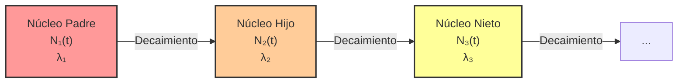

# Estructura Nuclear y Radiactividad
La estructura nuclear trata sobre cómo los protones y neutrones (nucleones) se unen mediante la fuerza nuclear fuerte para formar el núcleo del átomo. La radiactividad es el proceso estocástico por el cual núcleos inestables pierden energía emitiendo radiación.

## 📜 Contexto Histórico
La existencia del núcleo atómico fue revelada en 1911 por el experimento de la lámina de oro de Ernest Rutherford, Hans Geiger y Ernest Marsden, desmintiendo el modelo del pudín de ciruelas. En 1896, Henri Becquerel había descubierto accidentalmente la radiactividad al observar que sales de uranio oscurecían placas fotográficas, un trabajo expandido por Marie y Pierre Curie, quienes aislaron nuevos elementos radiactivos como el radio y el polonio.

## 🧮 Desarrollo Teórico Profundo

El estudio analítico de la estructura nuclear y la radiactividad requiere una inmersión profunda en la mecánica cuántica y la fenomenología nuclear. En esta sección abordaremos con rigor matemático los fundamentos teóricos que rigen la estabilidad y dinámica de los núcleos atómicos.

### 1. Modelo de la Gota Líquida y Fórmula Semiempírica de Masas

El núcleo atómico no es una estructura rígida, sino un sistema de muchos cuerpos fuertemente interactuantes. Carl Friedrich von Weizsäcker (1935) formuló la **fórmula semiempírica de masas** basándose en el modelo de la gota líquida de George Gamow.

La masa $ M(Z, A) $ de un núcleo con número atómico $ Z $ y número másico $ A $ se expresa en función de las masas del protón $ m_p $ y neutrón $ m_n $, menos el defecto de masa $ \Delta m $ originado por la **energía de ligadura** $ B(Z, A) $:

$$ M(Z, A) = Z m_p + (A-Z) m_n - \frac{B(Z, A)}{c^2} $$

La energía de ligadura se descompone en cinco términos fundamentales:

$$ B(Z, A) = B_V + B_S + B_C + B_A + B_P $$

#### 1.1 Término de Volumen ($ B_V $)
La fuerza nuclear fuerte tiene un alcance muy corto (del orden de los femtómetros, $\sim 10^{-15} $ m) y exhibe saturación. Cada nucleón interactúa solo con sus vecinos más próximos. Por lo tanto, la energía de volumen es directamente proporcional al número total de nucleones $ A $:
$$ B_V = a_V A $$
Donde la constante experimental empírica es $ a_V \approx 15.67 $ MeV.

#### 1.2 Término de Superficie ($ B_S $)
Los nucleones situados en la superficie del núcleo tienen menos vecinos y, en consecuencia, experimentan una menor atracción neta, lo que reduce la energía de ligadura total. Como el volumen nuclear $ V \propto R^3 \propto A $, el radio nuclear se modela como $ R = R_0 A^{1/3} $ (con $ R_0 \approx 1.2 $ fm). El área superficial es $ S \propto R^2 \propto A^{2/3} $, derivando en:
$$ B_S = -a_S A^{2/3} $$
Donde $ a_S \approx 17.23 $ MeV.

#### 1.3 Término de Repulsión de Coulomb ($ B_C $)
La repulsión electrostática entre los protones desestabiliza el núcleo. La energía potencial electrostática de una esfera cargada uniformemente de radio $ R $ y carga total $ Q = Ze $ es:
$$ U_C = \frac{3}{5} \frac{1}{4\pi\varepsilon_0} \frac{Q^2}{R} $$
Dado que un protón no interactúa consigo mismo, el número de pares repulsivos es $ \frac{Z(Z-1)}{2} $. Sustituyendo $ R = R_0 A^{1/3} $, obtenemos:
$$ B_C = -a_C \frac{Z(Z-1)}{A^{1/3}} $$
Con constante $ a_C = \frac{3e^2}{20\pi\varepsilon_0 R_0} \approx 0.714 $ MeV.

#### 1.4 Término de Asimetría ($ B_A $)
El principio de exclusión de Pauli dicta que no pueden existir dos fermiones idénticos en el mismo estado cuántico. Al considerar un gas de Fermi de nucleones a temperatura cero, la energía cinética total aumenta si hay un desequilibrio entre el número de protones y neutrones.
La densidad de estados es proporcional a $ \sqrt{E} $. La energía de asimetría se deriva integrando la energía hasta la energía de Fermi. La penalización energética por la diferencia $ N - Z = A - 2Z $ se puede aproximar desarrollando en serie de Taylor alrededor de $ N = Z $, dando como resultado:
$$ B_A = -a_A \frac{(A-2Z)^2}{A} $$
Donde $ a_A \approx 23.29 $ MeV.

#### 1.5 Término de Emparejamiento ($ B_P $)
Los nucleones tienden a agruparse en pares de espines opuestos, maximizando el solapamiento de sus funciones de onda espaciales y disminuyendo la energía total. Se define una corrección fenomenológica $ \delta(A,Z) $:
$$ 
B_P = \delta(A,Z) = 
\begin{cases} 
+a_P A^{-1/2} & \text{si } Z \text{ par, } N \text{ par (núcleos par-par)} \\ 
0 & \text{si } A \text{ impar (núcleos par-impar o impar-par)} \\ 
-a_P A^{-1/2} & \text{si } Z \text{ impar, } N \text{ impar (núcleos impar-impar)} 
\end{cases}
$$
Donde $ a_P \approx 11.2 $ MeV.

---

### 2. Dinámica de la Desintegración Radiactiva y Cadenas de Decaimiento

La radiactividad obedece a leyes estadísticas cuánticas. Para una muestra de $ N(t) $ núcleos inestables, la probabilidad de que un núcleo individual decaiga en un intervalo infinitesimal $ dt $ es $ \lambda dt $, siendo $ \lambda $ la **constante de desintegración**.

#### 2.1 Ecuación Diferencial Maestra
La tasa de decaimiento se formula como:
$$ \frac{dN(t)}{dt} = -\lambda N(t) $$
Integrando esta ecuación diferencial separable desde un estado inicial $ N(0) = N_0 $ en $ t=0 $:
$$ \int_{N_0}^{N(t)} \frac{dN}{N} = -\int_0^t \lambda dt \implies \ln\left(\frac{N(t)}{N_0}\right) = -\lambda t $$
$$ N(t) = N_0 e^{-\lambda t} $$
La actividad $ A(t) $ es la tasa absoluta de desintegraciones, $ A(t) = \left| \frac{dN}{dt} \right| = \lambda N(t) $.

**Definiciones Claves:**
- **Periodo de semidesintegración ($ T_{1/2} $)**: Tiempo en el cual $ N(T_{1/2}) = N_0 / 2 $. 
  $$ \frac{N_0}{2} = N_0 e^{-\lambda T_{1/2}} \implies \lambda T_{1/2} = \ln(2) \implies T_{1/2} = \frac{\ln(2)}{\lambda} $$
- **Vida media ($ \tau $)**: Tiempo promedio de supervivencia de un núcleo.
  $$ \tau = \frac{\int_0^\infty t |\frac{dN}{dt}| dt}{\int_0^\infty |\frac{dN}{dt}| dt} = \frac{1}{\lambda} $$

#### 2.2 Ecuaciones de Bateman para Cadenas de Decaimiento
En muchas situaciones, el núcleo hijo también es inestable y decae en un núcleo nieto, generando una serie radiactiva: $ X_1 \xrightarrow{\lambda_1} X_2 \xrightarrow{\lambda_2} X_3 \dots $

El sistema de ecuaciones diferenciales acopladas para los primeros dos miembros es:
$$ \frac{dN_1}{dt} = -\lambda_1 N_1 $$
$$ \frac{dN_2}{dt} = \lambda_1 N_1 - \lambda_2 N_2 $$
Sustituyendo $ N_1(t) = N_{1,0} e^{-\lambda_1 t} $ en la segunda ecuación, obtenemos una ecuación diferencial lineal no homogénea de primer orden:
$$ \frac{dN_2}{dt} + \lambda_2 N_2 = \lambda_1 N_{1,0} e^{-\lambda_1 t} $$
Utilizando el factor integrante $ e^{\lambda_2 t} $:
$$ \frac{d}{dt} \left( N_2 e^{\lambda_2 t} \right) = \lambda_1 N_{1,0} e^{(\lambda_2 - \lambda_1) t} $$
Integrando desde $ 0 $ hasta $ t $ y asumiendo $ N_2(0) = 0 $:
$$ N_2(t) e^{\lambda_2 t} = \frac{\lambda_1 N_{1,0}}{\lambda_2 - \lambda_1} \left( e^{(\lambda_2 - \lambda_1) t} - 1 \right) $$
$$ N_2(t) = \frac{\lambda_1}{\lambda_2 - \lambda_1} N_{1,0} \left( e^{-\lambda_1 t} - e^{-\lambda_2 t} \right) $$
Las **ecuaciones de Bateman** (1910) generalizan este proceso para una cadena de longitud arbitraria.



---

### 3. Teoría Cuántica de los Modos de Desintegración

#### 3.1 Desintegración Alfa ($ \alpha $) y el Efecto Túnel Cuántico
La desintegración alfa consiste en la emisión de un núcleo de Helio-4 ($ ^4\text{He} $). Clásicamente, la partícula alfa está atrapada en un pozo de potencial nuclear, rodeada por una barrera de Coulomb exterior. La energía cinética de la partícula alfa ($ E_\alpha $) es típicamente de 4 a 9 MeV, mientras que la altura de la barrera de Coulomb para núcleos pesados excede los 25 MeV.

George Gamow (1928), de forma independiente junto a Gurney y Condon, resolvió esto mediante el **efecto túnel cuántico**.
El coeficiente de transmisión $ T $ a través de una barrera de potencial $ V(r) $ se aproxima mediante la técnica WKB (Wentzel-Kramers-Brillouin):
$$ T \approx \exp\left( -2 \int_{R}^{b} \sqrt{\frac{2m}{\hbar^2} (V(r) - E)} \, dr \right) $$
Donde $ m $ es la masa reducida del sistema, $ R $ es el radio nuclear interior, y $ b $ es el punto de retorno clásico donde $ V(b) = E $. Para el potencial de Coulomb $ V(r) = \frac{1}{4\pi\varepsilon_0} \frac{2 Z_d e^2}{r} $ (con $ Z_d $ el número atómico del núcleo hijo):
El factor de Gamow $ G $ se calcula como el argumento exponencial. Evaluando la integral:
$$ G = 2 \int_{R}^{b} \sqrt{\frac{2m}{\hbar^2} \left( \frac{z Z_d e^2}{4\pi\varepsilon_0 r} - E \right)} \, dr $$
La probabilidad de emisión es $ \lambda = f T $, donde $ f $ es la frecuencia de colisiones de la partícula alfa contra la barrera ($ f \sim v/2R \sim 10^{21} $ s$^{-1}$). Este modelo explica maravillosamente la **ley empírica de Geiger-Nuttall**, que relaciona la inmensa variación en los tiempos de vida media ($ T_{1/2} $) con cambios minúsculos en la energía $ E_\alpha $.

#### 3.2 Desintegración Beta ($ \beta $) y la Regla de Oro de Fermi
La desintegración beta abarca procesos mediados por la **fuerza nuclear débil**:
- $ \beta^- $: $ n \to p + e^- + \bar{\nu}_e $
- $ \beta^+ $: $ p \to n + e^+ + \nu_e $
- Captura Electrónica (CE): $ p + e^- \to n + \nu_e $

En 1934, Enrico Fermi desarrolló una exitosa teoría de la desintegración beta. Basada en la mecánica cuántica dependiente del tiempo, Fermi aplicó lo que hoy se conoce como la **Regla de Oro de Fermi** para calcular la tasa de transición $ W $ entre un estado inicial y un estado final continuo:
$$ W = \frac{2\pi}{\hbar} |M_{fi}|^2 \rho(E_f) $$
Donde:
- $ |M_{fi}|^2 $ es el cuadrado del elemento de matriz cuántico que acopla el estado inicial y final a través del Hamiltoniano de interacción débil. Para desintegraciones permitidas, esto es aproximadamente constante.
- $ \rho(E_f) = \frac{dN}{dE_f} $ es la densidad de estados finales (fase espacial).

Para el caso del electrón y el neutrino emergiendo, el espacio de fase se describe mediante los momentos $ p_e $ y $ p_\nu $. Suponiendo que la masa del neutrino es insignificante ($ m_\nu \approx 0 $), la relación diferencial arroja la distribución del espectro de momento del electrón $ dW(p_e) $, que explica la existencia de un espectro de energía **continuo** para el electrón emitido, confirmando simultáneamente la hipótesis del neutrino de Wolfgang Pauli.

---

## 🛠 Ejemplo Práctico
**Problema:** Una muestra de Carbono-14 ($ ^{14}\text{C} $) tiene una actividad inicial de 15 Bq/gramo. Se encuentra un artefacto de madera con una actividad de 3.75 Bq/gramo. Sabiendo que el periodo de semidesintegración ($ T_{1/2} $) del $ ^{14}\text{C} $ es de 5730 años, ¿cuál es la edad del artefacto?

**Solución paso a paso analíticamente rigurosa:**
1. **Determinar la relación temporal de actividad:**
   La actividad $ A(t) $ es directamente proporcional al número de núcleos $ N(t) $: $ A(t) = \lambda N(t) $.
   Sustituyendo el modelo de decaimiento:
   $$ A(t) = A_0 e^{-\lambda t} $$
2. **Despejar la constante espectral $ \lambda $:**
   Basado en la relación intrínseca con el periodo de semidesintegración:
   $$ \lambda = \frac{\ln(2)}{T_{1/2}} = \frac{0.693147}{5730 \text{ años}} \approx 1.2097 \times 10^{-4} \text{ años}^{-1} $$
3. **Despeje algebraico de la variable temporal $ t $:**
   $$ \frac{A(t)}{A_0} = e^{-\lambda t} \implies \ln\left(\frac{A(t)}{A_0}\right) = -\lambda t $$
   $$ t = -\frac{1}{\lambda} \ln\left(\frac{A(t)}{A_0}\right) $$
4. **Sustitución de condiciones de frontera:**
   $$ t = -\frac{1}{1.2097 \times 10^{-4}} \ln\left(\frac{3.75}{15}\right) = -\frac{1}{1.2097 \times 10^{-4}} \ln(0.25) $$
   Dado que $ \ln(0.25) = \ln(2^{-2}) = -2\ln(2) $:
   $$ t = \frac{2\ln(2)}{1.2097 \times 10^{-4}} = \frac{1.38629}{1.2097 \times 10^{-4}} \approx 11460 \text{ años} $$
   
*Conclusión Física:* El espécimen se fosilizó hace aproximadamente $ 11460 $ años, lo cual equivale analíticamente a exactamente dos vidas medias ($ 5730 \times 2 = 11460 $), ya que la actividad final es la cuarta parte ($ (1/2)^2 $) de la actividad germinal.

## 📝 Guía de Ejercicios Resueltos

### Ejercicio 1: Fórmula Semiempírica de Masas y Estabilidad Isobarica
Determine el núcleo más estable contra decaimiento beta para una familia isobárica con $A = 125$. Utilice la fórmula semiempírica de masas considerando las constantes típicas.

**Solución paso a paso:**
1. La masa atómica de un núcleo isobárico es aproximadamente una parábola en función de $Z$:
   $$ M(A,Z) \approx \alpha Z^2 + \beta Z + \gamma $$
2. Los términos relevantes de la fórmula de Bethe-Weizsäcker que dependen de $Z$ son el término de Coulomb y el de asimetría:
   $$ E_C = a_c \frac{Z(Z-1)}{A^{1/3}} \approx a_c \frac{Z^2}{A^{1/3}}, \quad E_A = a_a \frac{(A-2Z)^2}{A} $$
3. Maximizando la energía de ligadura con respecto a $Z$ (o minimizando la masa):
   $$ \frac{\partial E_B}{\partial Z} = -2 a_c \frac{Z}{A^{1/3}} + 4 a_a \frac{A-2Z}{A} = 0 $$
4. Despejando $Z$ para el isóbaro más estable ($Z_{min}$):
   $$ Z_{min} = \frac{A}{2 + \frac{a_c}{2 a_a} A^{2/3}} $$
5. Utilizando valores típicos $a_c = 0.71$ MeV y $a_a = 23.2$ MeV para $A = 125$:
   $$ Z_{min} = \frac{125}{2 + \frac{0.71}{46.4} (125)^{2/3}} = \frac{125}{2 + 0.0153 \times 25} = \frac{125}{2.3825} \approx 52.4 $$
6. El número atómico entero más cercano es $Z = 52$, que corresponde al Telurio ($^{125}\text{Te}$).

### Ejercicio 2: Cinemática Relativista del Decaimiento del Pion
Un pion neutro ($\pi^0$) en reposo decae en dos fotones ($\pi^0 \to \gamma + \gamma$). Si el pion se mueve con una velocidad $v = 0.8c$ en el sistema del laboratorio, calcule las energías máxima y mínima de los fotones emitidos.

**Solución paso a paso:**
1. En el sistema de reposo (CM) del pion, por conservación del cuadrimomento, ambos fotones tienen la misma energía $E'_1 = E'_2 = \frac{m_\pi c^2}{2}$.
2. El pion se mueve en el sistema de laboratorio (Lab) con velocidad $v=0.8c$, por lo que el factor de Lorentz es $\gamma = \frac{1}{\sqrt{1-0.8^2}} = \frac{1}{0.6} = \frac{5}{3}$.
3. Usamos la transformación de Lorentz para la energía del fotón: $E = \gamma E' (1 + \beta \cos\theta')$, donde $\theta'$ es el ángulo de emisión en el sistema CM relativo a la velocidad del pion.
4. La energía máxima ocurre cuando el fotón se emite hacia adelante ($\theta'=0$):
   $$ E_{max} = \gamma \frac{m_\pi c^2}{2} (1 + \beta) = \frac{5}{3} \frac{135 \text{ MeV}}{2} (1 + 0.8) = 112.5 \times 1.8 = 202.5 \text{ MeV} $$
5. La energía mínima ocurre cuando el fotón se emite hacia atrás ($\theta'=\pi$):
   $$ E_{min} = \gamma \frac{m_\pi c^2}{2} (1 - \beta) = \frac{5}{3} \frac{135 \text{ MeV}}{2} (1 - 0.8) = 112.5 \times 0.2 = 22.5 \text{ MeV} $$
6. Verificación: $E_{max} + E_{min} = 225 \text{ MeV}$, que es precisamente la energía total del pion en el sistema de laboratorio ($E = \gamma m_\pi c^2$).

### Ejercicio 3: Sección Eficaz de Dispersión de Rutherford Cuántica
A partir de la Regla de Oro de Fermi y la aproximación de Born, derive la sección diferencial de dispersión de una partícula de carga $z e$ y masa $m$ por un núcleo de carga $Z e$.

**Solución paso a paso:**
1. El potencial de Coulomb es $V(r) = \frac{z Z e^2}{4\pi\epsilon_0 r}$.
2. En la primera aproximación de Born, la amplitud de dispersión es proporcional a la transformada de Fourier del potencial:
   $$ f(\theta) = -\frac{m}{2\pi\hbar^2} \int V(r) e^{i \vec{q} \cdot \vec{r}} d^3r $$
   donde $\vec{q} = \vec{k}_f - \vec{k}_i$ es la transferencia de momento.
3. Para asegurar convergencia, se utiliza un potencial apantallado $V(r) e^{-\mu r}$ y luego se toma $\mu \to 0$. La integral resulta en:
   $$ \int \frac{e^{-\mu r}}{r} e^{i \vec{q} \cdot \vec{r}} d^3r = \frac{4\pi}{q^2 + \mu^2} \xrightarrow{\mu \to 0} \frac{4\pi}{q^2} $$
4. La magnitud de la transferencia de momento, considerando dispersión elástica ($|\vec{k}_i| = |\vec{k}_f| = k$), es $q = 2k \sin(\theta/2)$.
5. Sustituyendo todo, la amplitud es:
   $$ f(\theta) = -\frac{m z Z e^2}{2\pi\hbar^2 4\pi\epsilon_0} \frac{4\pi}{(2k \sin(\theta/2))^2} = -\frac{z Z e^2}{16\pi\epsilon_0 E \sin^2(\theta/2)} $$
6. La sección diferencial es $\frac{d\sigma}{d\Omega} = |f(\theta)|^2$:
   $$ \frac{d\sigma}{d\Omega} = \left( \frac{z Z e^2}{16\pi\epsilon_0 E} \right)^2 \frac{1}{\sin^4(\theta/2)} $$
   que coincide exactamente con el resultado clásico de Rutherford.

## 💻 Simulaciones Computacionales

### Simulación: Cadena de Desintegración Radiactiva (Ecuaciones de Bateman)

Este código en Python utiliza integración numérica (`scipy.integrate.odeint`) para simular la evolución temporal de una cadena de desintegración radiactiva $A \rightarrow B \rightarrow C \text{ (estable)}$.

```python
import numpy as np
import matplotlib.pyplot as plt
from scipy.integrate import odeint

# Constantes de desintegración (1/s)
lambda_A = 0.1   # Núcleo padre decae rápido
lambda_B = 0.05  # Núcleo hijo decae más lento

def decay_chain(y, t):
    N_A, N_B, N_C = y
    dN_A_dt = -lambda_A * N_A
    dN_B_dt = lambda_A * N_A - lambda_B * N_B
    dN_C_dt = lambda_B * N_B
    return [dN_A_dt, dN_B_dt, dN_C_dt]

# Condiciones iniciales: 100% de A
y0 = [100.0, 0.0, 0.0]
t = np.linspace(0, 100, 500)

sol = odeint(decay_chain, y0, t)

plt.figure(figsize=(10, 6))
plt.plot(t, sol[:, 0], 'r', linewidth=2, label='Núcleo A (Padre)')
plt.plot(t, sol[:, 1], 'g', linewidth=2, label='Núcleo B (Hijo)')
plt.plot(t, sol[:, 2], 'b', linewidth=2, label='Núcleo C (Nieto, Estable)')

plt.title('Simulación de la Cadena de Desintegración Radiactiva')
plt.xlabel('Tiempo (s)')
plt.ylabel('Población (%)')
plt.legend(loc='best')
plt.grid(True)
plt.show()
```

## 🚀 Fronteras de Investigación y Problemas Abiertos

La fusión fenomenológica de estructura y radiactividad en 2026 está liderada por la búsqueda de desintegraciones raras exóticas y la desintegración de elementos súper-pesados de la esquiva "Isla de Estabilidad".

- **La Isla de Estabilidad Trans-actínida:** Identificar empíricamente el próximo cierre de capa esférica "mágica" para protones. A pesar del éxito de las series $Z=114$ a $Z=118$ (Oganesón), el decaimiento de estos elementos está dominado por fusión en frío induciendo radiactividad alfa en cascada y fisión espontánea. No sabemos si $Z=114$, $Z=120$ o $Z=126$ es el verdadero número mágico de hiperesferecidad.
- **Doble Desintegración Beta Sin Neutrinos ($0\nu\beta\beta$):** Quizás el misterio radiactivo y subatómico más trascendental en la física moderna. Para aislar la violación del número leptónico global en núcleos candidatos como el $^{136}\text{Xe}$ o el $^{76}\text{Ge}$, el elemento matriz nuclear (NME) de la transición de segundo orden es increíblemente volátil teóricamente. Calcular los NMEs con precisión absoluta del $\sim 10\%$ para interpretar límites experimentales con las vidas medias actuales medidas asintóticamente en $> 10^{26}$ años (el experimento nEXO y LEGEND).
- **Emisiones Exóticas y Desintegraciones de Racimo (Cluster Decay):** Un puente fenomenológico entre el decaimiento Alfa y la fisión espontánea que permanece oscurecido teóricamente. ¿Bajo qué superposición espectral pre-forma el núcleo estructuras cluster como el $^{14}\text{C}$ o el $^{24}\text{Ne}$ internamente antes de emitirlas a través de la barrera por efecto túnel multidimensional?

## 📐 Formalismo Matemático Avanzado (Nivel Posgrado/Doctorado)

El estudio de las desintegraciones de estado excitado y decaimientos débiles superiores trasciende la Regla de Oro mediante la **Teoría Cuántica de Muchas Partículas Dependiente del Tiempo, Resonancias de Feshbach y Formalismo R-matrix**.

Para analizar la anchura espectral estricta del decaimiento débil en presencia de fuertes interacciones colectivas internas (ej. resonancias gigantes de espín-isospín de Gamow-Teller o transiciones superpermitidas), la amplitud de la desintegración en la **Aproximación de Fase Aleatoria con Partícula-Hueco Modificada (pn-QRPA)** acopla modos oscilatorios fonónicos.

El campo de Feshbach de Proyección del Hamiltoniano separa asintóticamente el subespacio continuo ($P$) del subespacio discreto estructural ($Q$). El Hamiltoniano efectivo resonante en $P$, condicionado por el acoplamiento fuerte inter-nuclear, es:
$$ \mathcal{H}_{eff} = H_{PP} + H_{PQ} \frac{1}{E - H_{QQ} + i\epsilon} H_{QP} $$
La parte no hermítica (imaginaria) induce los decaimientos, con anchuras $\Gamma$ no triviales que sufren deslocalización extrema cerca de los umbrales estocásticos de emisión de protones o neutrones.

Para el problema fenomenológico exacto de matriz nuclear (NME) en el decaimiento doble beta, el formalismo transita a las corrientes de intercambio de mesones (Meson Exchange Currents). El operador de desintegración tensorial $0\nu\beta\beta$ dependiente del momento se evalúa espectralmente integrando sobre el momento virtual del neutrino transferido $q$:
$$ M^{0\nu} = \langle f | \sum_{n, m} \int \frac{d^3 q}{(2\pi)^3} \frac{\Omega(q)}{q(q + E_m - (E_i + E_f)/2)} \tau_n^+ \tau_m^+ \left( -h_F^2(q) + h_{GT}^2(q) \vec{\sigma}_n \cdot \vec{\sigma}_m + \dots \right) e^{i\vec{q}\cdot(\vec{r}_n - \vec{r}_m)} | i \rangle $$
El desafío analítico reside en dominar los factores de forma electrodébiles $h(q)$ regulados dinámicamente frente al severo truncamiento computacional del gigantesco espacio de Hilbert poli-esférico subyacente $\mathcal{O}(10^{11})$.

## 📚 Recursos Específicos

### Cursos Online y Material Académico
1. **[MIT OCW: 22.02 Introduction to Applied Nuclear Physics](https://ocw.mit.edu/courses/22-02-introduction-to-applied-nuclear-physics-spring-2012/)**
   Un recurso excepcionalmente estructurado del Departamento de Ingeniería Nuclear del MIT, que ahonda en las reglas estadísticas de decaimiento y protección contra radiación.
2. **[University of Michigan: NERS 311 - Elements of Nuclear Engineering and Radiological Sciences](https://open.umich.edu/find/open-educational-resources/engineering/ners-311-elements-nuclear-engineering-radiological-sciences)**
   Contiene formidables exposiciones de las matemáticas subyacentes a las cadenas de isótopos y el análisis de la ecuación de transporte radiológico.

### Artículos Científicos Clave y su Análisis Teórico

1. **"Quantum Theory of the Atomic Nucleus"** - *G. Gamow (1928), Zeitschrift für Physik 51, 204*  
   *(Traducción y revisión de las fuentes originales sobre desintegración Alfa)*
   [Link al repositorio histórico (Springer)](https://link.springer.com/article/10.1007/BF01343196)
   
   **Importancia Teórica y Relevancia:** 
   La explicación mecano-cuántica de Gamow sobre el decaimiento alfa fue la primera aplicación matemática exitosa del naciente principio de la probabilidad de tunelaje cuántico (quantum tunneling) en la física nuclear, erradicando una aparente paradoja energética de décadas.
   
   **Contexto Matemático:** 
   Gamow resolvió la ecuación de Schrödinger esférica radial dependiente del tiempo para un núcleo emisor, introduciendo una componente de energía imaginaria ($E = E_0 - i \lambda \hbar / 2$) para describir los estados cuasi-ligados que resultan en la exponencial atenuación del estado padre.
   Aplicando la condición WKB (Wentzel-Kramers-Brillouin) al potencial de Coulomb fuera del pozo nuclear ($V(r) = 2(Z-2)e^2/4\pi\epsilon_0 r$), calculó rigurosamente la probabilidad de escape $T$:
   $$ \ln(T) \approx - \frac{2\pi (Z-2) e^2}{\hbar v} + \frac{8 e}{\hbar} \sqrt{\frac{m (Z-2) R}{\pi \epsilon_0}} $$
   donde $v$ es la velocidad de la partícula asintótica. Esto ofreció por vez primera una base matemática a la célebre Ley empírica de Geiger-Nuttall, confirmando que las partículas alfa de menor energía perciben exponencialmente mayor opacidad de la barrera.

2. **"Versuch einer Theorie der $\beta$-Strahlen. I" (Attempt at a theory of $\beta$-rays)** - *E. Fermi (1934), Zeitschrift für Physik 88, 161*  
   [Link al artículo original (Springer)](https://link.springer.com/article/10.1007/BF01351864)
   
   **Importancia Teórica y Relevancia:** 
   Enrico Fermi resolvió el insalvable misterio del espectro continuo del decaimiento beta. Formalizó y adoptó la hipótesis del neutrino de Pauli para salvar la conservación del momento y la energía, instaurando la fenomenología fundacional de la Interacción Débil.
   
   **Contexto Matemático:** 
   En una audaz asimetría respecto al electromagnetismo de la QED, Fermi teorizó un contacto puntual de cuatro fermiones, ignorando inicialmente el bosón mediador vectorial.
   La tasa diferencial de decaimiento (anchura espectral) fue deducida utilizando la Regla de Oro, integrando sobre el volumen del espacio de las fases tridimensional, asumiendo un neutrino sin masa:
   $$ d\Gamma \propto G_F^2 |M_{fi}|^2 F(Z, E) p_e E_e (E_0 - E_e)^2 dp_e $$
   donde $G_F \approx 1.166 \times 10^{-5} \text{ GeV}^{-2}$ es la celebérrima Constante de Acoplamiento de Fermi, y $F(Z,E)$ es el Factor de Fermi, una integral de repulsión/atracción electrostática coulombiana que la función de onda de Dirac del electrón sufriente sufre por el núcleo residente. 
   Esta formulación predijo la forma del espectro con una precisión milimétrica, y la constante $G_F$ subsistió inquebrantable hasta la llegada del Modelo Estándar Electro-Débil unificado de Glashow-Weinberg-Salam.

### 📖 Referencias Útiles y Bibliografía
- Krane, K. S. (1987). *Introductory Nuclear Physics*. John Wiley & Sons.
- Turner, J. E. (2007). *Atoms, Radiation, and Radiation Protection*. Wiley-VCH.
- Lilley, J. (2001). *Nuclear Physics: Principles and Applications*. Wiley.

## 🌐 Seminarios Avanzados y Literatura de Frontera

### Seminarios y Cursos
- [CERN Academic Training Lectures](https://indico.cern.ch/category/72/)
- [Fermilab Seminars](https://seminars.fnal.gov/)
- [SLAC National Accelerator Laboratory Events](https://www-public.slac.stanford.edu/events/)

### Literatura de Frontera
- [Journal of High Energy Physics (JHEP)](https://link.springer.com/journal/13130): Referencia clave para física teórica de partículas y teoría de cuerdas.
- [Physical Review C (Nuclear Physics)](https://journals.aps.org/prc/): Publica los avances más relevantes en la física de iones pesados y estructura nuclear.
- [Annual Review of Nuclear and Particle Science](https://www.annualreviews.org/journal/nucl): Proporciona revisiones exhaustivas y críticas sobre los temas de frontera en interacciones fundamentales.
