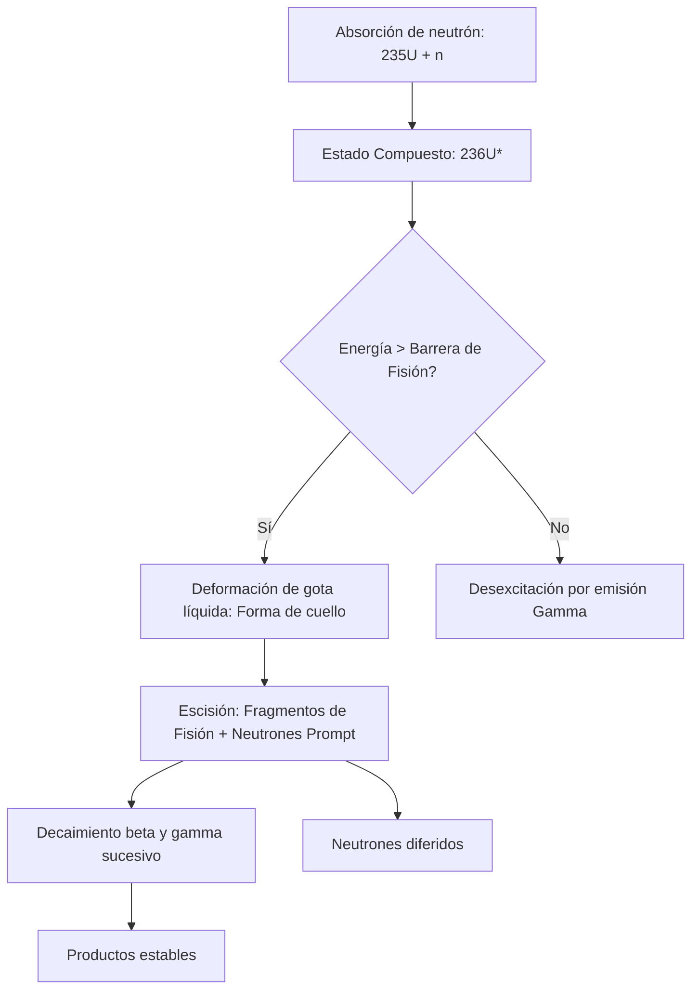

# Fisión y Fusión
La fisión y la fusión nuclear son procesos opuestos que implican transmutaciones de núcleos atómicos con el fin de liberar grandes cantidades de energía, según la curva de energía de ligadura por nucleón. 

## 📜 Contexto Histórico
La fisión nuclear fue descubierta en diciembre de 1938 por los químicos alemanes Otto Hahn y Fritz Strassmann, y explicada teóricamente poco después por Lise Meitner y Otto Robert Frisch. Esto condujo al Proyecto Manhattan y la primera bomba atómica, y luego a la energía nuclear civil. La fusión nuclear, el proceso que alimenta a las estrellas, fue propuesta por Arthur Eddington en la década de 1920 y demostrada teóricamente por Hans Bethe en 1939 (ciclo CNO y cadena protón-protón).

## 🧮 Desarrollo Teórico Profundo

### 1. Curva de Energía de Ligadura y Estabilidad Nuclear
El núcleo atómico está compuesto por $Z$ protones y $N$ neutrones, con un número másico $A = Z + N$. La masa de un núcleo en reposo, $M(Z, N)$, es menor que la suma de las masas de sus nucleones constituyentes libres debido a la energía de ligadura nuclear, $B(Z, N)$.

De acuerdo con la equivalencia masa-energía de Einstein:
$$ M(Z, N) c^2 = Z m_p c^2 + N m_n c^2 - B(Z, N) $$
donde $m_p$ y $m_n$ son las masas del protón y del neutrón respectivamente.

El modelo de la gota líquida (fórmula semi-empírica de masa de Weizsäcker) parametriza la energía de ligadura de la siguiente forma:
$$ B(A, Z) = a_v A - a_s A^{2/3} - a_c \frac{Z(Z-1)}{A^{1/3}} - a_a \frac{(N-Z)^2}{A} + \delta(A,Z) $$
Los términos corresponden a la contribución de volumen, superficie, repulsión de Coulomb, asimetría y el efecto de apareamiento, respectivamente.

El parámetro fundamental para evaluar la viabilidad energética de fisión y fusión es la **energía de ligadura por nucleón**, $B/A$. La curva de $B/A$ respecto a $A$ alcanza un máximo alrededor de $A \approx 56$ (hierro y níquel), con un valor aproximado de $8.8 \text{ MeV}$. Esto implica que la naturaleza favorece energéticamente los procesos que acercan a los núcleos a este pico:
- **Fusión:** Núcleos ligeros ($A < 56$) se combinan para formar un núcleo más pesado, con mayor $B/A$.
- **Fisión:** Núcleos pesados ($A > 56$, típicamente $A > 230$) se dividen en núcleos más ligeros, con mayor $B/A$.

### 2. Termodinámica y Dinámica de la Fisión Nuclear

La fisión ocurre cuando un núcleo pesado, al absorber un neutrón, alcanza un estado excitado inestable, induciendo su separación en dos fragmentos más estables debido a la competencia entre la fuerza nuclear fuerte (atractiva, pero de corto alcance) y la repulsión de Coulomb (de largo alcance).

Consideremos el Uranio-235. La fisión inducida por neutrones térmicos sigue típicamente esta reacción:
$$ ^{235}_{92}\text{U} + ^{1}_{0}\text{n}_{th} \to \left(^{236}_{92}\text{U}\right)^* \to ^{141}_{56}\text{Ba} + ^{92}_{36}\text{Kr} + 3 ^{1}_{0}\text{n} + Q $$

**Derivación del Valor Q:**
La energía liberada, $Q$, está dada por la diferencia de energías de ligadura entre los productos y el núcleo padre. Si los productos de fisión tienen números másicos $A_1$ y $A_2$ (tales que $A_1 + A_2 \approx A$), tenemos:
$$ Q \approx B(A_1) + B(A_2) - B(A) $$
Dado que $B/A$ para uranio es $\sim 7.6 \text{ MeV/nucleón}$ y para los productos de fisión $\sim 8.5 \text{ MeV/nucleón}$:
$$ Q \approx A \left( \left(\frac{B}{A}\right)_{\text{productos}} - \left(\frac{B}{A}\right)_{\text{padre}} \right) \approx 236 \times (8.5 - 7.6) \text{ MeV} \approx 212 \text{ MeV} $$

**Teoría de Bohr y Wheeler (Barrera de Fisión):**
El modelo de gota líquida describe al núcleo sufriendo deformaciones elipsoidales. Para deformaciones pequeñas caracterizadas por el parámetro de excentricidad $\epsilon$, el cambio de energía se define como $\Delta E = \Delta E_s + \Delta E_c$.
La energía de superficie aumenta y la de Coulomb disminuye:
$$ E_s(\epsilon) = E_s(0) \left( 1 + \frac{2}{5}\epsilon^2 \right) $$
$$ E_c(\epsilon) = E_c(0) \left( 1 - \frac{1}{5}\epsilon^2 \right) $$
Para que el núcleo sea inestable a deformaciones espontáneas, $\Delta E < 0$:
$$ \frac{2}{5} E_s(0) - \frac{1}{5} E_c(0) < 0 \implies \frac{E_c(0)}{E_s(0)} > 2 $$
Sustituyendo los valores de Weizsäcker, se obtiene el límite de fisibilidad de Bohr-Wheeler:
$$ \frac{Z^2}{A} \gtrsim 47 $$
Para el $^{235}\text{U}$, $Z^2/A \approx 36$, por lo que requiere una energía de activación (aportada por la energía de ligadura del neutrón absorbido, aproximadamente $6.5 \text{ MeV}$).

### 3. Fusión Nuclear y Penetración Cuántica

Para que ocurra la fusión, los núcleos deben acercarse lo suficiente para que la fuerza nuclear fuerte supere la repulsión de Coulomb.

**Barrera de Coulomb:**
La energía potencial electrostática máxima requerida para que dos núcleos con cargas $Z_1 e$ y $Z_2 e$ y radios nucleares $R_1, R_2$ entren en contacto es:
$$ V_c = \frac{1}{4\pi\epsilon_0}\frac{Z_1 Z_2 e^2}{R_1 + R_2} $$
Para deuterio y tritio, $V_c \approx 0.4 \text{ MeV}$. Según la mecánica clásica, las partículas requieren una temperatura de $T = \frac{V_c}{k_B} \approx 4.6 \times 10^9 \text{ K}$, lo cual es órdenes de magnitud mayor que las temperaturas en el núcleo del Sol ($\sim 1.5 \times 10^7 \text{ K}$).

**Efecto Túnel de Gamow:**
La respuesta radica en la mecánica cuántica. Existe una probabilidad $P$ de que las partículas penetren la barrera mediante efecto túnel. La probabilidad de penetración (factor de Gamow) se aproxima usando la aproximación WKB:
$$ P \approx \exp\left(-\frac{2}{\hbar}\int_{r_N}^{r_c} \sqrt{2\mu(V(r) - E)} dr\right) $$
donde $\mu$ es la masa reducida, $r_N$ es el radio nuclear y $r_c$ es el punto de retorno clásico ($E = V(r_c)$).
Resolviendo la integral, se obtiene:
$$ P(E) \approx \exp\left(-\sqrt{\frac{E_G}{E}}\right) $$
con la energía de Gamow $E_G = 2\mu(\pi \alpha Z_1 Z_2 c)^2$, donde $\alpha$ es la constante de estructura fina.

**Tasa de Reacción Termonuclear:**
En un plasma, las energías de las partículas siguen una distribución de Maxwell-Boltzmann, $f(E) \propto \exp(-E/kT)$. La probabilidad de reacción resulta de la convolución de esta distribución con la sección eficaz de penetración (que depende de $1/E$ y el factor de Gamow):
$$ \langle \sigma v \rangle = \sqrt{\frac{8}{\pi \mu (kT)^3}} \int_0^\infty E S(E) \exp\left(-\frac{E}{kT} - \sqrt{\frac{E_G}{E}}\right) dE $$
donde $S(E)$ es el factor astrofísico que varía suavemente.
La integral está dominada por el producto de las dos exponenciales, cuyo máximo forma el **Pico de Gamow**, determinando la ventana de energía donde se produce la fusión de manera más eficiente. El pico se localiza en:
$$ E_0 = \left( \frac{E_G (kT)^2}{4} \right)^{1/3} $$

### 4. Ciclos de Fusión Estelares (Cadenas p-p y CNO)

En las estrellas de la secuencia principal, la fusión del hidrógeno se desarrolla mediante dos procesos principales.

**Cadena Protón-Protón (Estrellas pequeñas, masa $\le M_\odot$):**
La interacción débil media el paso inicial más lento, resultando en un tiempo de vida estelar de miles de millones de años.
1. **Formación de deuterio:** $^{1}\text{H} + ^{1}\text{H} \to ^{2}\text{H} + e^+ + \nu_e$ (lento, gobernado por interacción débil).
2. **Formación de helio-3:** $^{2}\text{H} + ^{1}\text{H} \to ^{3}\text{He} + \gamma$
3. **Fusión de núcleos de helio-3:** $^{3}\text{He} + ^{3}\text{He} \to ^{4}\text{He} + 2^{1}\text{H}$
El balance neto libera $\sim 26.7 \text{ MeV}$.

**Ciclo CNO (Estrellas masivas):**
Carbono, Nitrógeno y Oxígeno actúan como catalizadores para fusionar hidrógeno en helio. La dependencia con la temperatura es más fuerte ($\sim T^{17}$ frente a $\sim T^4$ para p-p), superando a la cadena p-p a temperaturas centrales $> 1.7 \times 10^7 \text{ K}$.
$$ ^{12}\text{C} + ^{1}\text{H} \to ^{13}\text{N} + \gamma $$
$$ ^{13}\text{N} \to ^{13}\text{C} + e^+ + \nu_e $$
$$ ^{13}\text{C} + ^{1}\text{H} \to ^{14}\text{N} + \gamma $$
$$ ^{14}\text{N} + ^{1}\text{H} \to ^{15}\text{O} + \gamma $$
$$ ^{15}\text{O} \to ^{15}\text{N} + e^+ + \nu_e $$
$$ ^{15}\text{N} + ^{1}\text{H} \to ^{12}\text{C} + ^{4}\text{He} $$

### 5. Ejemplo Práctico Demostrativo: Criterio de Lawson para Fusión Comercial

Para mantener un plasma de fusión auto-sostenido, la energía producida por las partículas alfa ($^{4}\text{He}$) atrapadas en el plasma debe superar las pérdidas de energía (radiación Bremsstrahlung y pérdidas de transporte). Esto se condensa en el **Criterio de Lawson**.

En estado estacionario para una reacción D-T a densidad de número $n$, temperatura $T$ y tiempo de confinamiento de energía $\tau_E$:
$$ \text{Energía producida por unidad de volumen} \ge \text{Energía perdida} $$
$$ \frac{1}{4} n^2 \langle \sigma v \rangle E_\alpha \tau_E \ge \frac{3 n k T}{\tau_E} $$
$$ n \tau_E \ge \frac{12 k T}{\langle \sigma v \rangle E_\alpha} $$
Para el proceso Deuterio-Tritio, el mínimo de esta función se da en torno a $T \approx 10-20 \text{ keV}$, donde se requiere:
$$ n \tau_E \approx 10^{20} \text{ s m}^{-3} $$
Este triple producto (densidad $\times$ confinamiento $\times$ temperatura) es la métrica de éxito definitiva para reactores de fusión comercial (como el diseño Tokamak usado en ITER) o de confinamiento inercial (como el NIF).

## 📚 Recursos Específicos

### Cursos Online
1. "[Plasma Physics and Applications](https://www.edx.org/course/plasma-physics-and-applications)" (edX - EPFL)
2. "[Nuclear Reactor Physics Basics](https://www.coursera.org/learn/nuclear-reactor-physics)" (Coursera)
3. "[Energy Processing in Stars](https://ocw.mit.edu/courses/physics/8-284-modern-astrophysics-spring-2006/)" (University of Arizona OCW / MIT)
4. "[Introduction to Plasma Physics](https://ocw.mit.edu/courses/nuclear-engineering/22-611j-introduction-to-plasma-physics-i-fall-2003/)" (MIT OCW)
5. "[Fusion Energy: Principles and Technology](https://online.stanford.edu/)" (Stanford Online)
6. "[Advanced Nuclear Reactor Engineering](https://www.edx.org/)" (edX)

### Artículos y Simulaciones
1. "[ITER Educational Resources (Simulador Tokamak)](https://www.iter.org/education/)"
2. "[Energy production in stars](https://doi.org/10.1103/PhysRev.55.434)" (H. Bethe, 1939)
3. "[The Discovery of Nuclear Fission](https://doi.org/10.1038/143239a0)" (L. Meitner, O. R. Frisch, 1939)
4. "[IAEA Nuclear Data Section](https://www-nds.iaea.org/)"
5. "[The Mechanism of Nuclear Fission](https://doi.org/10.1103/PhysRev.56.426)" (N. Bohr and J. A. Wheeler, 1939)
6. "[Nuclear Fission](https://phet.colorado.edu/en/simulations/nuclear-fission)" (PhET Interactive Simulations)
7. "[Plasma confinement in Tokamaks](https://www.iter.org/mach/Tokamak)" (Review Article)
8. "[Inertial Confinement Fusion](https://lasers.llnl.gov/science/icf)" (NIF Publications)
9. "[Design and Operation of Pressurized Water Reactors](https://www.iaea.org/publications)" (IAEA Bulletin)

### 📖 Referencias Útiles y Bibliografía
- Lamarsh, J. R., & Baratta, A. J. (2001). *[Introduction to Nuclear Engineering](https://www.pearson.com/en-us/subject-catalog/p/introduction-to-nuclear-engineering/P200000006763)*. Prentice Hall.
- Chen, F. F. (1984). *[Introduction to Plasma Physics and Controlled Fusion](https://link.springer.com/book/10.1007/978-1-4757-5595-4)*. Springer.
- Krane, K. S. (1987). *[Introductory Nuclear Physics](https://www.wiley.com/en-us/Introductory+Nuclear+Physics%2C+3rd+Edition-p-9780471805533)*. John Wiley & Sons.
- Stacey, W. M. (2010). *[Fusion Plasma Physics](https://www.wiley.com/en-us/Fusion+Plasma+Physics%2C+2nd+Edition-p-9783527411344)*. Wiley-VCH.
