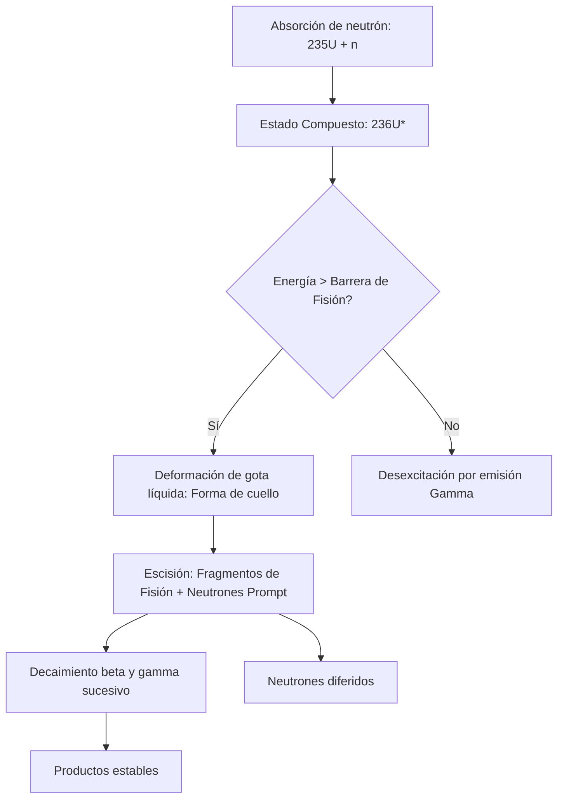

# Fisión y Fusión
La fisión y la fusión nuclear son procesos opuestos que implican transmutaciones de núcleos atómicos con el fin de liberar grandes cantidades de energía, según la curva de energía de ligadura por nucleón. 

## 📜 Contexto Histórico
La fisión nuclear fue descubierta en diciembre de 1938 por los químicos alemanes Otto Hahn y Fritz Strassmann, y explicada teóricamente poco después por Lise Meitner y Otto Robert Frisch. Esto condujo al Proyecto Manhattan y la primera bomba atómica, y luego a la energía nuclear civil. La fusión nuclear, el proceso que alimenta a las estrellas, fue propuesta por Arthur Eddington en la década de 1920 y demostrada teóricamente por Hans Bethe en 1939 (ciclo CNO y cadena protón-protón).

## 🧮 Desarrollo Teórico Profundo

### 1. Curva de Energía de Ligadura y Estabilidad Nuclear
El núcleo atómico está compuesto por $Z$ protones y $N$ neutrones, con un número másico $A = Z + N$. La masa de un núcleo en reposo, $M(Z, N)$, es menor que la suma de las masas de sus nucleones constituyentes libres debido a la energía de ligadura nuclear, $B(Z, N)$.

De acuerdo con la equivalencia masa-energía de Einstein:
$$ M(Z, N) c^2 = Z m_p c^2 + N m_n c^2 - B(Z, N) $$
donde $m_p$ y $m_n$ son las masas del protón y del neutrón respectivamente.

El modelo de la gota líquida (fórmula semi-empírica de masa de Weizsäcker) parametriza la energía de ligadura de la siguiente forma:
$$ B(A, Z) = a_v A - a_s A^{2/3} - a_c \frac{Z(Z-1)}{A^{1/3}} - a_a \frac{(N-Z)^2}{A} + \delta(A,Z) $$
Los términos corresponden a la contribución de volumen, superficie, repulsión de Coulomb, asimetría y el efecto de apareamiento, respectivamente.

El parámetro fundamental para evaluar la viabilidad energética de fisión y fusión es la **energía de ligadura por nucleón**, $B/A$. La curva de $B/A$ respecto a $A$ alcanza un máximo alrededor de $A \approx 56$ (hierro y níquel), con un valor aproximado de $8.8 \text{ MeV}$. Esto implica que la naturaleza favorece energéticamente los procesos que acercan a los núcleos a este pico:
- **Fusión:** Núcleos ligeros ($A < 56$) se combinan para formar un núcleo más pesado, con mayor $B/A$.
- **Fisión:** Núcleos pesados ($A > 56$, típicamente $A > 230$) se dividen en núcleos más ligeros, con mayor $B/A$.

### 2. Termodinámica y Dinámica de la Fisión Nuclear

La fisión ocurre cuando un núcleo pesado, al absorber un neutrón, alcanza un estado excitado inestable, induciendo su separación en dos fragmentos más estables debido a la competencia entre la fuerza nuclear fuerte (atractiva, pero de corto alcance) y la repulsión de Coulomb (de largo alcance).

Consideremos el Uranio-235. La fisión inducida por neutrones térmicos sigue típicamente esta reacción:
$$ ^{235}_{92}\text{U} + ^{1}_{0}\text{n}_{th} \to \left(^{236}_{92}\text{U}\right)^* \to ^{141}_{56}\text{Ba} + ^{92}_{36}\text{Kr} + 3 ^{1}_{0}\text{n} + Q $$

**Derivación del Valor Q:**
La energía liberada, $Q$, está dada por la diferencia de energías de ligadura entre los productos y el núcleo padre. Si los productos de fisión tienen números másicos $A_1$ y $A_2$ (tales que $A_1 + A_2 \approx A$), tenemos:
$$ Q \approx B(A_1) + B(A_2) - B(A) $$
Dado que $B/A$ para uranio es $\sim 7.6 \text{ MeV/nucleón}$ y para los productos de fisión $\sim 8.5 \text{ MeV/nucleón}$:
$$ Q \approx A \left( \left(\frac{B}{A}\right)_{\text{productos}} - \left(\frac{B}{A}\right)_{\text{padre}} \right) \approx 236 \times (8.5 - 7.6) \text{ MeV} \approx 212 \text{ MeV} $$

**Teoría de Bohr y Wheeler (Barrera de Fisión):**
El modelo de gota líquida describe al núcleo sufriendo deformaciones elipsoidales. Para deformaciones pequeñas caracterizadas por el parámetro de excentricidad $\epsilon$, el cambio de energía se define como $\Delta E = \Delta E_s + \Delta E_c$.
La energía de superficie aumenta y la de Coulomb disminuye:
$$ E_s(\epsilon) = E_s(0) \left( 1 + \frac{2}{5}\epsilon^2 \right) $$
$$ E_c(\epsilon) = E_c(0) \left( 1 - \frac{1}{5}\epsilon^2 \right) $$
Para que el núcleo sea inestable a deformaciones espontáneas, $\Delta E < 0$:
$$ \frac{2}{5} E_s(0) - \frac{1}{5} E_c(0) < 0 \implies \frac{E_c(0)}{E_s(0)} > 2 $$
Sustituyendo los valores de Weizsäcker, se obtiene el límite de fisibilidad de Bohr-Wheeler:
$$ \frac{Z^2}{A} \gtrsim 47 $$
Para el $^{235}\text{U}$, $Z^2/A \approx 36$, por lo que requiere una energía de activación (aportada por la energía de ligadura del neutrón absorbido, aproximadamente $6.5 \text{ MeV}$).



### 3. Fusión Nuclear y Penetración Cuántica

Para que ocurra la fusión, los núcleos deben acercarse lo suficiente para que la fuerza nuclear fuerte supere la repulsión de Coulomb.

**Barrera de Coulomb:**
La energía potencial electrostática máxima requerida para que dos núcleos con cargas $Z_1 e$ y $Z_2 e$ y radios nucleares $R_1, R_2$ entren en contacto es:
$$ V_c = \frac{1}{4\pi\epsilon_0}\frac{Z_1 Z_2 e^2}{R_1 + R_2} $$
Para deuterio y tritio, $V_c \approx 0.4 \text{ MeV}$. Según la mecánica clásica, las partículas requieren una temperatura de $T = \frac{V_c}{k_B} \approx 4.6 \times 10^9 \text{ K}$, lo cual es órdenes de magnitud mayor que las temperaturas en el núcleo del Sol ($\sim 1.5 \times 10^7 \text{ K}$).

**Efecto Túnel de Gamow:**
La respuesta radica en la mecánica cuántica. Existe una probabilidad $P$ de que las partículas penetren la barrera mediante efecto túnel. La probabilidad de penetración (factor de Gamow) se aproxima usando la aproximación WKB:
$$ P \approx \exp\left(-\frac{2}{\hbar}\int_{r_N}^{r_c} \sqrt{2\mu(V(r) - E)} dr\right) $$
donde $\mu$ es la masa reducida, $r_N$ es el radio nuclear y $r_c$ es el punto de retorno clásico ($E = V(r_c)$).
Resolviendo la integral, se obtiene:
$$ P(E) \approx \exp\left(-\sqrt{\frac{E_G}{E}}\right) $$
con la energía de Gamow $E_G = 2\mu(\pi \alpha Z_1 Z_2 c)^2$, donde $\alpha$ es la constante de estructura fina.

**Tasa de Reacción Termonuclear:**
En un plasma, las energías de las partículas siguen una distribución de Maxwell-Boltzmann, $f(E) \propto \exp(-E/kT)$. La probabilidad de reacción resulta de la convolución de esta distribución con la sección eficaz de penetración (que depende de $1/E$ y el factor de Gamow):
$$ \langle \sigma v \rangle = \sqrt{\frac{8}{\pi \mu (kT)^3}} \int_0^\infty E S(E) \exp\left(-\frac{E}{kT} - \sqrt{\frac{E_G}{E}}\right) dE $$
donde $S(E)$ es el factor astrofísico que varía suavemente.
La integral está dominada por el producto de las dos exponenciales, cuyo máximo forma el **Pico de Gamow**, determinando la ventana de energía donde se produce la fusión de manera más eficiente. El pico se localiza en:
$$ E_0 = \left( \frac{E_G (kT)^2}{4} \right)^{1/3} $$

### 4. Ciclos de Fusión Estelares (Cadenas p-p y CNO)

En las estrellas de la secuencia principal, la fusión del hidrógeno se desarrolla mediante dos procesos principales.

**Cadena Protón-Protón (Estrellas pequeñas, masa $\le M_\odot$):**
La interacción débil media el paso inicial más lento, resultando en un tiempo de vida estelar de miles de millones de años.
1. **Formación de deuterio:** $^{1}\text{H} + ^{1}\text{H} \to ^{2}\text{H} + e^+ + \nu_e$ (lento, gobernado por interacción débil).
2. **Formación de helio-3:** $^{2}\text{H} + ^{1}\text{H} \to ^{3}\text{He} + \gamma$
3. **Fusión de núcleos de helio-3:** $^{3}\text{He} + ^{3}\text{He} \to ^{4}\text{He} + 2^{1}\text{H}$
El balance neto libera $\sim 26.7 \text{ MeV}$.

**Ciclo CNO (Estrellas masivas):**
Carbono, Nitrógeno y Oxígeno actúan como catalizadores para fusionar hidrógeno en helio. La dependencia con la temperatura es más fuerte ($\sim T^{17}$ frente a $\sim T^4$ para p-p), superando a la cadena p-p a temperaturas centrales $> 1.7 \times 10^7 \text{ K}$.
$$ ^{12}\text{C} + ^{1}\text{H} \to ^{13}\text{N} + \gamma $$
$$ ^{13}\text{N} \to ^{13}\text{C} + e^+ + \nu_e $$
$$ ^{13}\text{C} + ^{1}\text{H} \to ^{14}\text{N} + \gamma $$
$$ ^{14}\text{N} + ^{1}\text{H} \to ^{15}\text{O} + \gamma $$
$$ ^{15}\text{O} \to ^{15}\text{N} + e^+ + \nu_e $$
$$ ^{15}\text{N} + ^{1}\text{H} \to ^{12}\text{C} + ^{4}\text{He} $$

### 5. Ejemplo Práctico Demostrativo: Criterio de Lawson para Fusión Comercial

Para mantener un plasma de fusión auto-sostenido, la energía producida por las partículas alfa ($^{4}\text{He}$) atrapadas en el plasma debe superar las pérdidas de energía (radiación Bremsstrahlung y pérdidas de transporte). Esto se condensa en el **Criterio de Lawson**.

En estado estacionario para una reacción D-T a densidad de número $n$, temperatura $T$ y tiempo de confinamiento de energía $\tau_E$:
$$ \text{Energía producida por unidad de volumen} \ge \text{Energía perdida} $$
$$ \frac{1}{4} n^2 \langle \sigma v \rangle E_\alpha \tau_E \ge \frac{3 n k T}{\tau_E} $$
$$ n \tau_E \ge \frac{12 k T}{\langle \sigma v \rangle E_\alpha} $$
Para el proceso Deuterio-Tritio, el mínimo de esta función se da en torno a $T \approx 10-20 \text{ keV}$, donde se requiere:
$$ n \tau_E \approx 10^{20} \text{ s m}^{-3} $$
Este triple producto (densidad $\times$ confinamiento $\times$ temperatura) es la métrica de éxito definitiva para reactores de fusión comercial (como el diseño Tokamak usado en ITER) o de confinamiento inercial (como el NIF).


## 📝 Guía de Ejercicios Resueltos

### Ejercicio 1: Fórmula Semiempírica de Masas y Estabilidad Isobarica
Determine el núcleo más estable contra decaimiento beta para una familia isobárica con $A = 125$. Utilice la fórmula semiempírica de masas considerando las constantes típicas.

**Solución paso a paso:**
1. La masa atómica de un núcleo isobárico es aproximadamente una parábola en función de $Z$:
   $$ M(A,Z) \approx \alpha Z^2 + \beta Z + \gamma $$
2. Los términos relevantes de la fórmula de Bethe-Weizsäcker que dependen de $Z$ son el término de Coulomb y el de asimetría:
   $$ E_C = a_c \frac{Z(Z-1)}{A^{1/3}} \approx a_c \frac{Z^2}{A^{1/3}}, \quad E_A = a_a \frac{(A-2Z)^2}{A} $$
3. Maximizando la energía de ligadura con respecto a $Z$ (o minimizando la masa):
   $$ \frac{\partial E_B}{\partial Z} = -2 a_c \frac{Z}{A^{1/3}} + 4 a_a \frac{A-2Z}{A} = 0 $$
4. Despejando $Z$ para el isóbaro más estable ($Z_{min}$):
   $$ Z_{min} = \frac{A}{2 + \frac{a_c}{2 a_a} A^{2/3}} $$
5. Utilizando valores típicos $a_c = 0.71$ MeV y $a_a = 23.2$ MeV para $A = 125$:
   $$ Z_{min} = \frac{125}{2 + \frac{0.71}{46.4} (125)^{2/3}} = \frac{125}{2 + 0.0153 \times 25} = \frac{125}{2.3825} \approx 52.4 $$
6. El número atómico entero más cercano es $Z = 52$, que corresponde al Telurio ($^{125}\text{Te}$).

### Ejercicio 2: Cinemática Relativista del Decaimiento del Pion
Un pion neutro ($\pi^0$) en reposo decae en dos fotones ($\pi^0 \to \gamma + \gamma$). Si el pion se mueve con una velocidad $v = 0.8c$ en el sistema del laboratorio, calcule las energías máxima y mínima de los fotones emitidos.

**Solución paso a paso:**
1. En el sistema de reposo (CM) del pion, por conservación del cuadrimomento, ambos fotones tienen la misma energía $E'_1 = E'_2 = \frac{m_\pi c^2}{2}$.
2. El pion se mueve en el sistema de laboratorio (Lab) con velocidad $v=0.8c$, por lo que el factor de Lorentz es $\gamma = \frac{1}{\sqrt{1-0.8^2}} = \frac{1}{0.6} = \frac{5}{3}$.
3. Usamos la transformación de Lorentz para la energía del fotón: $E = \gamma E' (1 + \beta \cos\theta')$, donde $\theta'$ es el ángulo de emisión en el sistema CM relativo a la velocidad del pion.
4. La energía máxima ocurre cuando el fotón se emite hacia adelante ($\theta'=0$):
   $$ E_{max} = \gamma \frac{m_\pi c^2}{2} (1 + \beta) = \frac{5}{3} \frac{135 \text{ MeV}}{2} (1 + 0.8) = 112.5 \times 1.8 = 202.5 \text{ MeV} $$
5. La energía mínima ocurre cuando el fotón se emite hacia atrás ($\theta'=\pi$):
   $$ E_{min} = \gamma \frac{m_\pi c^2}{2} (1 - \beta) = \frac{5}{3} \frac{135 \text{ MeV}}{2} (1 - 0.8) = 112.5 \times 0.2 = 22.5 \text{ MeV} $$
6. Verificación: $E_{max} + E_{min} = 225 \text{ MeV}$, que es precisamente la energía total del pion en el sistema de laboratorio ($E = \gamma m_\pi c^2$).

### Ejercicio 3: Sección Eficaz de Dispersión de Rutherford Cuántica
A partir de la Regla de Oro de Fermi y la aproximación de Born, derive la sección diferencial de dispersión de una partícula de carga $z e$ y masa $m$ por un núcleo de carga $Z e$.

**Solución paso a paso:**
1. El potencial de Coulomb es $V(r) = \frac{z Z e^2}{4\pi\epsilon_0 r}$.
2. En la primera aproximación de Born, la amplitud de dispersión es proporcional a la transformada de Fourier del potencial:
   $$ f(\theta) = -\frac{m}{2\pi\hbar^2} \int V(r) e^{i \vec{q} \cdot \vec{r}} d^3r $$
   donde $\vec{q} = \vec{k}_f - \vec{k}_i$ es la transferencia de momento.
3. Para asegurar convergencia, se utiliza un potencial apantallado $V(r) e^{-\mu r}$ y luego se toma $\mu \to 0$. La integral resulta en:
   $$ \int \frac{e^{-\mu r}}{r} e^{i \vec{q} \cdot \vec{r}} d^3r = \frac{4\pi}{q^2 + \mu^2} \xrightarrow{\mu \to 0} \frac{4\pi}{q^2} $$
4. La magnitud de la transferencia de momento, considerando dispersión elástica ($|\vec{k}_i| = |\vec{k}_f| = k$), es $q = 2k \sin(\theta/2)$.
5. Sustituyendo todo, la amplitud es:
   $$ f(\theta) = -\frac{m z Z e^2}{2\pi\hbar^2 4\pi\epsilon_0} \frac{4\pi}{(2k \sin(\theta/2))^2} = -\frac{z Z e^2}{16\pi\epsilon_0 E \sin^2(\theta/2)} $$
6. La sección diferencial es $\frac{d\sigma}{d\Omega} = |f(\theta)|^2$:
   $$ \frac{d\sigma}{d\Omega} = \left( \frac{z Z e^2}{16\pi\epsilon_0 E} \right)^2 \frac{1}{\sin^4(\theta/2)} $$
   que coincide exactamente con el resultado clásico de Rutherford.

## 💻 Simulaciones Computacionales

### Simulación: Pico de Gamow en Fusión Nuclear

Este código en Python calcula y visualiza el "Pico de Gamow", mostrando cómo la convolución de la distribución de energía de Maxwell-Boltzmann y la probabilidad de penetración cuántica (factor de Gamow) genera una ventana de energía óptima para la fusión termonuclear.

```python
import numpy as np
import matplotlib.pyplot as plt

# Parámetros para la reacción p-p en el núcleo solar
T = 1.5e7  # Temperatura en Kelvin
k_B = 8.617e-5  # Constante de Boltzmann en eV/K
kT = k_B * T / 1000  # kT en keV

# Rango de energías en keV
E = np.linspace(0.1, 30, 1000)

# Distribución de Maxwell-Boltzmann (proporcional a exp(-E/kT))
MB_dist = np.exp(-E / kT)

# Factor de penetración de Gamow (proporcional a exp(-sqrt(E_G/E)))
# E_G para la reacción p-p es aprox 493 keV
E_G = 493.0
Gamow_factor = np.exp(-np.sqrt(E_G / E))

# Pico de Gamow (Producto de ambas)
Gamow_peak = MB_dist * Gamow_factor

# Normalización para facilitar la visualización conjunta
MB_dist_norm = MB_dist / np.max(MB_dist)
Gamow_factor_norm = Gamow_factor / np.max(Gamow_factor)
Gamow_peak_norm = Gamow_peak / np.max(Gamow_peak)

plt.figure(figsize=(10, 6))
plt.plot(E, MB_dist_norm, 'b--', label='Maxwell-Boltzmann (Disponibilidad térmica)')
plt.plot(E, Gamow_factor_norm, 'r--', label='Factor de Gamow (Penetración cuántica)')
plt.plot(E, Gamow_peak_norm, 'g-', linewidth=3, label='Pico de Gamow (Ventana de fusión)')

plt.title(f'Pico de Gamow para Fusión p-p (T = {T:.1e} K)')
plt.xlabel('Energía (keV)')
plt.ylabel('Probabilidad (Normalizada)')
plt.legend()
plt.grid(True)
plt.show()
```

## 📚 Recursos Específicos

### Cursos Online y Material Académico
1. **[MIT OCW: 22.011 / 22.112 Nuclear Engineering](https://ocw.mit.edu/courses/22-011-nuclear-engineering-science-systems-and-society-fall-2020/)**
   Curso detallado sobre la física y los principios termodinámicos de los reactores de fisión.
2. **[EPFL: Plasma Physics and Applications](https://www.edx.org/course/plasma-physics-and-applications)**
   Curso introductorio en edX sobre la física del plasma y la fusión nuclear magnética, enfocado en el Criterio de Lawson y las inestabilidades MHD.
3. **[ITER Educational Resources](https://www.iter.org/education)**
   Repositorio exhaustivo de la física detrás de los reactores Tokamak y el gran proyecto internacional de fusión.

### Artículos Científicos Clave y su Análisis Teórico

1. **"The Mechanism of Nuclear Fission"** - *N. Bohr and J. A. Wheeler (1939), Phys. Rev. 56, 426*  
   [Link al artículo original (APS)](https://journals.aps.org/pr/abstract/10.1103/PhysRev.56.426)
   
   **Importancia Teórica y Relevancia:** 
   Es el primer artículo que expuso un marco teórico mecano-cuántico y semiclásico completo para explicar la fisión del Uranio bombardeado por neutrones, sentando las bases inmutables de la física nuclear aplicada.
   
   **Contexto Matemático:** 
   El análisis descansa sobre la deformación topológica de la "gota" nuclear. Introducen parámetros de deformación elipsoidal $\alpha_2, \alpha_3, \dots$ en series de polinomios de Legendre para el radio nuclear local:
   $$ R(\theta) = R_0 \left[ 1 + \alpha_0 + \alpha_2 P_2(\cos\theta) + \alpha_3 P_3(\cos\theta) + \dots \right] $$
   Calcularon analíticamente cómo variaba la energía de superficie (tensión nuclear) y la repulsión de Coulomb con $\alpha_2$. Demostraron que el núcleo es inestable frente a fisión espontánea si el parámetro de fisibilidad excede un valor crítico universal:
   $$ x = \frac{E_c^{(0)}}{2 E_s^{(0)}} = \frac{Z^2/A}{(Z^2/A)_{\text{crit}}} $$
   Donde $(Z^2/A)_{\text{crit}} \approx 47.8$. Para un núcleo con $x < 1$, existe una barrera de fisión $E_f$. Para el isótopo $ ^{235}\text{U} $, probaron teóricamente que la simple captura de un neutrón térmico sin energía cinética aporta una energía de excitación $E_{exc} > E_f$, suficiente para inducir escisión instantánea (fisión inducida), mientras que el isótopo $ ^{238}\text{U} $ presenta un $E_f$ más alto, requiriendo impacto de neutrones rápidos.

2. **"Energy Production in Stars"** - *H. A. Bethe (1939), Phys. Rev. 55, 434*  
   [Link al artículo original (APS)](https://journals.aps.org/pr/abstract/10.1103/PhysRev.55.434)
   
   **Importancia Teórica y Relevancia:** 
   El magistral trabajo donde Hans Bethe resolvió el enigma milenario de la fuente de energía del Sol y las estrellas, identificando tanto la cadena protón-protón para estrellas ligeras como el ciclo CNO (Carbono-Nitrógeno-Oxígeno) para estrellas masivas.
   
   **Contexto Matemático:** 
   El reto astronómico estribaba en modelar la interacción fuerte mediante la probabilidad de penetración cuántica (efecto túnel). Bethe calculó meticulosamente la sección eficaz astronómica promediada espectralmente (tasa de reacción):
   $$ \langle \sigma v \rangle = \int_0^\infty v \cdot \frac{S(E)}{E} \exp\left(-2\pi \eta\right) f(v) \, dv $$
   Donde el parámetro de Sommerfeld es $\eta = \frac{Z_1 Z_2 e^2}{\hbar v}$. Observó que la tasa de generación de energía con la temperatura ($T$) en la Cadena p-p seguía una ley fenomenológica empírica $\epsilon_{pp} \propto \rho T^4$, mientras que el Ciclo CNO escalaba exponencialmente como $\epsilon_{CNO} \propto \rho T^{17}$. Esto predijo asombrosamente que estrellas con un núcleo ligeramente más caliente ($> 1.7 \times 10^7 \, \text{K}$) queman hidrógeno primordialmente a través de átomos más pesados actuando como catalizadores, sentando el paradigma de la evolución estelar.

### 📖 Referencias Útiles y Bibliografía
- Lamarsh, J. R., & Baratta, A. J. (2001). *Introduction to Nuclear Engineering*. Prentice Hall.
- Chen, F. F. (1984). *Introduction to Plasma Physics and Controlled Fusion*. Springer.
- Krane, K. S. (1987). *[Introductory Nuclear Physics](https://www.wiley.com/en-us/Introductory+Nuclear+Physics%2C+3rd+Edition-p-9780471805533)*. John Wiley & Sons.
- Stacey, W. M. (2010). *[Fusion Plasma Physics](https://www.wiley.com/en-us/Fusion+Plasma+Physics%2C+2nd+Edition-p-9783527411344)*. Wiley-VCH.
