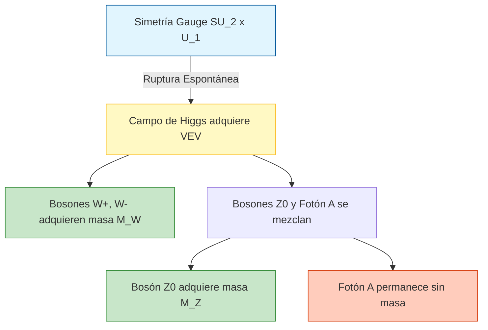

# Modelo Estándar

El Modelo Estándar es la teoría cuántica de campos que describe tres de las cuatro interacciones fundamentales conocidas: electromagnética, débil y fuerte. Organiza las partículas elementales en fermiones de materia y bosones mediadores.

## Partículas Fundamentales

- **Quarks**: $u$, $d$, $c$, $s$, $t$, $b$.
- **Leptones**: electrón, muón, tau y sus neutrinos asociados.
- **Bosones gauge**: fotón, gluones, bosones $W^\pm$ y $Z^0$.
- **Bosón de Higgs**: asociado al mecanismo de ruptura espontánea de simetría electrodébil.

## Estructura Conceptual

- **Simetría gauge**: $SU(3)_C \times SU(2)_L \times U(1)_Y$.
- **QCD**: Describe la interacción fuerte entre quarks y gluones.
- **Teoría electrodébil**: Unifica la interacción electromagnética y débil.
- **Generaciones**: La materia visible está organizada en tres familias con propiedades análogas.

## Ideas Clave

### 1. Conservación y simetría
Muchas leyes de conservación se entienden como consecuencia de simetrías profundas.

### 2. Confinamiento
Los quarks no se observan aislados; aparecen ligados en hadrones.

### 3. Más allá del Modelo Estándar
Neutrinos con masa, materia oscura y gravedad cuántica muestran que el modelo no es la teoría final.

## 🧮 Desarrollo Teórico Profundo

El Modelo Estándar (ME) de la física de partículas es una teoría cuántica de campos gauge construida sobre el grupo de simetría local:

$$ \mathcal{G}_{ME} = SU(3)_C \otimes SU(2)_L \otimes U(1)_Y $$

Donde $SU(3)_C$ describe la Cromodinámica Cuántica (interacción fuerte), y $SU(2)_L \otimes U(1)_Y$ corresponde a la teoría electrodébil. El Lagrangiano total del ME puede separarse en varias contribuciones fundamentales:

$$ \mathcal{L}_{ME} = \mathcal{L}_{Gauge} + \mathcal{L}_{Fermiones} + \mathcal{L}_{Higgs} + \mathcal{L}_{Yukawa} $$

A continuación, presentaremos un desarrollo exhaustivo de cada sector.

### 1. El Sector Electrodébil y la Simetría Local

La interacción electrodébil unifica el electromagnetismo y la fuerza nuclear débil. Para los leptones de la primera generación, agrupamos los fermiones levógiros en un doblete de isospín débil y los dextrógiros en un singlete:

$$ L = \begin{pmatrix} \nu_e \\ e \end{pmatrix}_L, \quad R = e_R $$

Las transformaciones bajo el grupo gauge $SU(2)_L \otimes U(1)_Y$ se definen por:

$$ L \to \exp\left(i \frac{g}{2} \vec{\alpha}(x) \cdot \vec{\sigma} + i \frac{g'}{2} y_L \beta(x)\right) L $$
$$ R \to \exp\left(i \frac{g'}{2} y_R \beta(x)\right) R $$

donde $\vec{\sigma}$ son las matrices de Pauli, $g$ y $g'$ son las constantes de acoplamiento de $SU(2)_L$ y $U(1)_Y$ respectivamente, y $y$ es la hipercarga débil, vinculada a la carga eléctrica por la fórmula de Gell-Mann–Nishijima: $Q = T_3 + \frac{Y}{2}$.

Para garantizar la invarianza gauge local del Lagrangiano de los fermiones, introducimos la derivada covariante:

$$ D_\mu = \partial_\mu - i g \frac{\vec{\sigma}}{2} \cdot \vec{W}_\mu - i g' \frac{Y}{2} B_\mu $$

El término cinético gauge es entonces:

$$ \mathcal{L}_{Gauge} = -\frac{1}{4} W^a_{\mu\nu} W^{a\mu\nu} - \frac{1}{4} B_{\mu\nu} B^{\mu\nu} $$

donde los tensores de campo (field strengths) se definen formalmente considerando la no-abelianidad de $SU(2)$:

$$ W^a_{\mu\nu} = \partial_\mu W^a_\nu - \partial_\nu W^a_\mu + g \epsilon^{abc} W^b_\mu W^c_\nu $$
$$ B_{\mu\nu} = \partial_\mu B_\nu - \partial_\nu B_\mu $$

Sin embargo, los términos de masa para los bosones $W$ y $Z$ de la forma $\frac{1}{2} M^2 W_\mu W^\mu$ violarían explícitamente la invarianza gauge. Esto motiva la introducción del Mecanismo de Brout-Englert-Higgs.

### 2. El Mecanismo de Higgs (Ruptura Espontánea de Simetría)

Introducimos un doblete escalar complejo de $SU(2)_L$ con hipercarga $Y=1$:

$$ \Phi = \begin{pmatrix} \phi^+ \\ \phi^0 \end{pmatrix} = \frac{1}{\sqrt{2}} \begin{pmatrix} \phi_1 + i\phi_2 \\ \phi_3 + i\phi_4 \end{pmatrix} $$

El Lagrangiano para el campo de Higgs es:

$$ \mathcal{L}_{Higgs} = (D_\mu \Phi)^\dagger (D^\mu \Phi) - V(\Phi) $$

con el potencial:

$$ V(\Phi) = \mu^2 \Phi^\dagger \Phi + \lambda (\Phi^\dagger \Phi)^2 $$

#### Demostración Paso a Paso de la Ruptura de Simetría

**Paso 1: Identificación del vacío**
Para $\mu^2 < 0$ y $\lambda > 0$, el mínimo del potencial no está en el origen. El valor esperado del vacío (VEV) adquiere un valor no nulo. Minimizamos el potencial:

$$ \frac{\partial V}{\partial (\Phi^\dagger \Phi)} = \mu^2 + 2\lambda (\Phi^\dagger \Phi) = 0 \implies |\Phi_0|^2 = -\frac{\mu^2}{2\lambda} \equiv \frac{v^2}{2} $$

Elegimos (rompiendo espontáneamente la simetría) que el VEV caiga en la componente real neutra:

$$ \Phi_0 = \frac{1}{\sqrt{2}} \begin{pmatrix} 0 \\ v \end{pmatrix} $$

**Paso 2: Expansión alrededor del vacío**
En el gauge unitario, parametrizamos el campo de Higgs como:

$$ \Phi(x) = \frac{1}{\sqrt{2}} \begin{pmatrix} 0 \\ v + h(x) \end{pmatrix} $$

donde $h(x)$ es el bosón físico de Higgs. Los otros tres grados de libertad escalares (los bosones de Goldstone) son absorbidos para dar masa a los bosones gauge.

**Paso 3: Masas de los bosones Gauge**
Evaluamos el término cinético $(D_\mu \Phi)^\dagger (D^\mu \Phi)$ en el vacío $\Phi_0$:

$$ D_\mu \Phi_0 = \left( \partial_\mu - i \frac{g}{2} \vec{\sigma} \cdot \vec{W}_\mu - i \frac{g'}{2} B_\mu \right) \frac{1}{\sqrt{2}} \begin{pmatrix} 0 \\ v \end{pmatrix} $$

Dado que $\sigma^1 = \begin{pmatrix} 0 & 1 \\ 1 & 0 \end{pmatrix}$, $\sigma^2 = \begin{pmatrix} 0 & -i \\ i & 0 \end{pmatrix}$, $\sigma^3 = \begin{pmatrix} 1 & 0 \\ 0 & -1 \end{pmatrix}$:

$$ (\vec{\sigma} \cdot \vec{W}_\mu) \begin{pmatrix} 0 \\ 1 \end{pmatrix} = \begin{pmatrix} W^1_\mu - i W^2_\mu \\ -W^3_\mu \end{pmatrix} $$

Entonces, 

$$ D_\mu \Phi_0 = \frac{-i}{2\sqrt{2}} \begin{pmatrix} g(W^1_\mu - i W^2_\mu) \\ -g W^3_\mu + g' B_\mu \end{pmatrix} v $$

Calculando $|D_\mu \Phi_0|^2$, obtenemos la matriz de masas para los campos gauge:

$$ |D_\mu \Phi_0|^2 = \frac{v^2}{8} \left[ g^2 ((W^1_\mu)^2 + (W^2_\mu)^2) + (g W^3_\mu - g' B_\mu)^2 \right] $$

Definimos los campos físicos de masa definida:
- Bosones $W$ cargados: $W^\pm_\mu = \frac{1}{\sqrt{2}}(W^1_\mu \mp i W^2_\mu)$. Su masa es **$M_W = \frac{gv}{2}$**.
- Bosón $Z$ neutro: $Z_\mu = \frac{g W^3_\mu - g' B_\mu}{\sqrt{g^2 + g'^2}}$. Su masa es **$M_Z = \frac{v}{2}\sqrt{g^2 + g'^2}$**.
- Fotón $A$: $A_\mu = \frac{g' W^3_\mu + g B_\mu}{\sqrt{g^2 + g'^2}}$. Vemos que su coeficiente en la forma cuadrática es cero; por lo tanto, **$M_A = 0$**.

La relación entre los acoplamientos y el ángulo de mezcla de Weinberg $\theta_W$ es:
$$ \cos\theta_W = \frac{g}{\sqrt{g^2 + g'^2}}, \quad \sin\theta_W = \frac{g'}{\sqrt{g^2 + g'^2}} $$

Esto nos lleva a la profunda relación del ME: $M_W = M_Z \cos\theta_W$.



### 3. Generación de Masa de Fermiones (Acoplamiento de Yukawa)

Al igual que los bosones, la invarianza gauge impide términos de masa directos $m \bar{\psi} \psi = m(\bar{\psi}_L \psi_R + \bar{\psi}_R \psi_L)$ para los fermiones porque $L$ y $R$ transforman de manera diferente bajo $SU(2)_L$. 

Por lo tanto, introducimos el Lagrangiano de Yukawa acoplando los fermiones al campo de Higgs:

$$ \mathcal{L}_{Yukawa} = -y_e \bar{L} \Phi R - y_e \bar{R} \Phi^\dagger L + \dots $$

Donde $y_e$ es la constante de acoplamiento de Yukawa para el electrón. Insertando el VEV de Higgs $\Phi_0$:

$$ -y_e \left( \bar{\nu}_e, \bar{e}_L \right) \frac{1}{\sqrt{2}} \begin{pmatrix} 0 \\ v \end{pmatrix} e_R + \text{h.c.} = -\frac{y_e v}{\sqrt{2}} \bar{e}_L e_R + \text{h.c.} = -m_e \bar{e} e $$

De aquí derivamos rigurosamente que la masa del electrón es proporcional al VEV:

$$ m_e = \frac{y_e v}{\sqrt{2}} $$

Este mismo principio se aplica a todos los quarks y leptones del Modelo Estándar, introduciendo una matriz de acoplamientos de Yukawa que, tras ser diagonalizada, origina la matriz CKM (Cabibbo-Kobayashi-Maskawa) que gobierna el sabor de los quarks y la violación de la paridad CP.

### 4. Cromodinámica Cuántica (QCD) y $SU(3)_C$

El sector de interacción fuerte se basa en la simetría $SU(3)$ de "color". Los quarks son tripletes de $SU(3)_C$. El Lagrangiano de QCD es:

$$ \mathcal{L}_{QCD} = \sum_q \bar{\psi}_q (i \gamma^\mu D_\mu - m_q) \psi_q - \frac{1}{4} G^a_{\mu\nu} G^{a\mu\nu} $$

Donde $G^a_{\mu\nu}$ es el tensor del campo gluónico ($a = 1, \dots, 8$ corresponde a las 8 matrices de Gell-Mann $\lambda^a$):

$$ G^a_{\mu\nu} = \partial_\mu G^a_\nu - \partial_\nu G^a_\mu + g_s f^{abc} G^b_\mu G^c_\nu $$

El término no lineal $g_s f^{abc} G^b_\mu G^c_\nu$ representa la auto-interacción de los gluones (vértices de 3 y 4 gluones). Esta auto-interacción es el origen matemático de la **libertad asintótica**: la constante de acoplamiento fuerte $\alpha_s(Q^2) = \frac{g_s^2}{4\pi}$ disminuye logarítmicamente a altas energías (o distancias cortas), y aumenta a bajas energías, causando el fenómeno del confinamiento de los quarks a distancias de la escala de femtómetros ($\Lambda_{QCD} \approx 200 \text{ MeV}$).

## 📝 Guía de Ejercicios Resueltos

### Ejercicio 1: Fórmula Semiempírica de Masas y Estabilidad Isobarica
Determine el núcleo más estable contra decaimiento beta para una familia isobárica con $A = 125$. Utilice la fórmula semiempírica de masas considerando las constantes típicas.

**Solución paso a paso:**
1. La masa atómica de un núcleo isobárico es aproximadamente una parábola en función de $Z$:
   $$ M(A,Z) \approx \alpha Z^2 + \beta Z + \gamma $$
2. Los términos relevantes de la fórmula de Bethe-Weizsäcker que dependen de $Z$ son el término de Coulomb y el de asimetría:
   $$ E_C = a_c \frac{Z(Z-1)}{A^{1/3}} \approx a_c \frac{Z^2}{A^{1/3}}, \quad E_A = a_a \frac{(A-2Z)^2}{A} $$
3. Maximizando la energía de ligadura con respecto a $Z$ (o minimizando la masa):
   $$ \frac{\partial E_B}{\partial Z} = -2 a_c \frac{Z}{A^{1/3}} + 4 a_a \frac{A-2Z}{A} = 0 $$
4. Despejando $Z$ para el isóbaro más estable ($Z_{min}$):
   $$ Z_{min} = \frac{A}{2 + \frac{a_c}{2 a_a} A^{2/3}} $$
5. Utilizando valores típicos $a_c = 0.71$ MeV y $a_a = 23.2$ MeV para $A = 125$:
   $$ Z_{min} = \frac{125}{2 + \frac{0.71}{46.4} (125)^{2/3}} = \frac{125}{2 + 0.0153 \times 25} = \frac{125}{2.3825} \approx 52.4 $$
6. El número atómico entero más cercano es $Z = 52$, que corresponde al Telurio ($^{125}\text{Te}$).

### Ejercicio 2: Cinemática Relativista del Decaimiento del Pion
Un pion neutro ($\pi^0$) en reposo decae en dos fotones ($\pi^0 \to \gamma + \gamma$). Si el pion se mueve con una velocidad $v = 0.8c$ en el sistema del laboratorio, calcule las energías máxima y mínima de los fotones emitidos.

**Solución paso a paso:**
1. En el sistema de reposo (CM) del pion, por conservación del cuadrimomento, ambos fotones tienen la misma energía $E'_1 = E'_2 = \frac{m_\pi c^2}{2}$.
2. El pion se mueve en el sistema de laboratorio (Lab) con velocidad $v=0.8c$, por lo que el factor de Lorentz es $\gamma = \frac{1}{\sqrt{1-0.8^2}} = \frac{1}{0.6} = \frac{5}{3}$.
3. Usamos la transformación de Lorentz para la energía del fotón: $E = \gamma E' (1 + \beta \cos\theta')$, donde $\theta'$ es el ángulo de emisión en el sistema CM relativo a la velocidad del pion.
4. La energía máxima ocurre cuando el fotón se emite hacia adelante ($\theta'=0$):
   $$ E_{max} = \gamma \frac{m_\pi c^2}{2} (1 + \beta) = \frac{5}{3} \frac{135 \text{ MeV}}{2} (1 + 0.8) = 112.5 \times 1.8 = 202.5 \text{ MeV} $$
5. La energía mínima ocurre cuando el fotón se emite hacia atrás ($\theta'=\pi$):
   $$ E_{min} = \gamma \frac{m_\pi c^2}{2} (1 - \beta) = \frac{5}{3} \frac{135 \text{ MeV}}{2} (1 - 0.8) = 112.5 \times 0.2 = 22.5 \text{ MeV} $$
6. Verificación: $E_{max} + E_{min} = 225 \text{ MeV}$, que es precisamente la energía total del pion en el sistema de laboratorio ($E = \gamma m_\pi c^2$).

### Ejercicio 3: Sección Eficaz de Dispersión de Rutherford Cuántica
A partir de la Regla de Oro de Fermi y la aproximación de Born, derive la sección diferencial de dispersión de una partícula de carga $z e$ y masa $m$ por un núcleo de carga $Z e$.

**Solución paso a paso:**
1. El potencial de Coulomb es $V(r) = \frac{z Z e^2}{4\pi\epsilon_0 r}$.
2. En la primera aproximación de Born, la amplitud de dispersión es proporcional a la transformada de Fourier del potencial:
   $$ f(\theta) = -\frac{m}{2\pi\hbar^2} \int V(r) e^{i \vec{q} \cdot \vec{r}} d^3r $$
   donde $\vec{q} = \vec{k}_f - \vec{k}_i$ es la transferencia de momento.
3. Para asegurar convergencia, se utiliza un potencial apantallado $V(r) e^{-\mu r}$ y luego se toma $\mu \to 0$. La integral resulta en:
   $$ \int \frac{e^{-\mu r}}{r} e^{i \vec{q} \cdot \vec{r}} d^3r = \frac{4\pi}{q^2 + \mu^2} \xrightarrow{\mu \to 0} \frac{4\pi}{q^2} $$
4. La magnitud de la transferencia de momento, considerando dispersión elástica ($|\vec{k}_i| = |\vec{k}_f| = k$), es $q = 2k \sin(\theta/2)$.
5. Sustituyendo todo, la amplitud es:
   $$ f(\theta) = -\frac{m z Z e^2}{2\pi\hbar^2 4\pi\epsilon_0} \frac{4\pi}{(2k \sin(\theta/2))^2} = -\frac{z Z e^2}{16\pi\epsilon_0 E \sin^2(\theta/2)} $$
6. La sección diferencial es $\frac{d\sigma}{d\Omega} = |f(\theta)|^2$:
   $$ \frac{d\sigma}{d\Omega} = \left( \frac{z Z e^2}{16\pi\epsilon_0 E} \right)^2 \frac{1}{\sin^4(\theta/2)} $$
   que coincide exactamente con el resultado clásico de Rutherford.

## 💻 Simulaciones Computacionales

### Simulación: Evolución de las Constantes de Acoplamiento (Renormalización)

Este script visualiza cualitativamente cómo varían ("corren") las constantes de acoplamiento del Modelo Estándar (fuerte $\alpha_3$, débil $\alpha_2$ y electromagnética $\alpha_1$) en función de la escala de energía $\mu$, resolviendo las ecuaciones del grupo de renormalización (RGEs) a 1-loop.

```python
import numpy as np
import matplotlib.pyplot as plt
from scipy.integrate import odeint

# Escala inicial: Masa del bosón Z (aprox 91.2 GeV)
mu0 = 91.2
t0 = np.log(mu0)
t_end = np.log(1e16) # Hasta la escala GUT (10^16 GeV)
t_span = np.linspace(t0, t_end, 500)

# Constantes iniciales medidas a M_Z
# a_i = g_i^2 / (4*pi)
alpha1_0 = 0.01696
alpha2_0 = 0.03377
alpha3_0 = 0.1184

# Coeficientes beta a 1-loop en el Modelo Estándar
b1 = 41.0 / 10.0
b2 = -19.0 / 6.0
b3 = -7.0

def rge_derivatives(alphas, t):
    a1, a2, a3 = alphas
    # da/dt = (b / (2*pi)) * a^2
    da1 = (b1 / (2 * np.pi)) * a1**2
    da2 = (b2 / (2 * np.pi)) * a2**2
    da3 = (b3 / (2 * np.pi)) * a3**2
    return [da1, da2, da3]

alphas_0 = [alpha1_0, alpha2_0, alpha3_0]
sol = odeint(rge_derivatives, alphas_0, t_span)

mu_vals = np.exp(t_span)
inv_alphas = 1.0 / sol

plt.figure(figsize=(10, 6))
plt.plot(np.log10(mu_vals), inv_alphas[:, 0], 'b-', linewidth=2, label=r'$\alpha_1^{-1}$ (U(1))')
plt.plot(np.log10(mu_vals), inv_alphas[:, 1], 'g-', linewidth=2, label=r'$\alpha_2^{-1}$ (SU(2))')
plt.plot(np.log10(mu_vals), inv_alphas[:, 2], 'r-', linewidth=2, label=r'$\alpha_3^{-1}$ (SU(3))')

plt.title('Evolución de las Constantes de Acoplamiento en el Modelo Estándar (1-loop)')
plt.xlabel(r'$\log_{10}(\mu / \text{GeV})$')
plt.ylabel(r'$\alpha_i^{-1}(\mu)$')
plt.legend()
plt.grid(True)
plt.show()
```

## 🚀 Fronteras de Investigación y Problemas Abiertos

El Modelo Estándar sigue demostrando una solidez asombrosa en el LHC a 2026, sin embargo, sufre de severas limitaciones conceptuales y lagunas empíricas fenomenológicas.

- **El Problema de la Jerarquía (Hierarchy Problem) y la Masa del Higgs:** La masa observada del Bosón de Higgs ($m_h \approx 125$ GeV) es divergente de forma cuadrática frente a correcciones radiativas de las fluctuaciones cuánticas del vacío. Estabilizar el Higgs frente a la masa de Planck ($\sim 10^{19}$ GeV) sin un "Ajuste Fino" (Fine-Tuning) irrazonable es la motivación principal para supersimetría (SUSY), dimensiones extras (Randall-Sundrum) o modelos de Higgs compuesto, ninguno de los cuales ha sido encontrado aún.
- **La Naturaleza Mayorana vs Dirac del Neutrino:** Aunque las oscilaciones de neutrinos demostraron que tienen masa, se desconoce el origen de dicha masa. ¿Adquieren masa por el mecanismo de Yukawa convencional o a través de un "See-Saw Mechanism" (Mecanismo de Balancín) de gran unificación a la escala de $\sim 10^{15} \text{ GeV}$ requiriendo neutrinos estériles supermasivos de Majorana? El decaimiento beta doble sin neutrinos ($0\nu\beta\beta$) sigue sin ser observado concluyentemente.
- **Asimetría Bariónica del Universo (Bariogénesis Electrodébil):** El universo observable está hecho de materia, no antimateria. Las tres condiciones de Sakharov (violación de número bariónico, violación de simetrías C y CP, y desviación del equilibrio térmico) se cumplen en el Modelo Estándar, pero la violación CP es $\sim 10^{10}$ veces demasiado débil. ¿Qué mecanismo dinámico generó esta enorme asimetría durante la transición de fase electrodébil?

## 📐 Formalismo Matemático Avanzado (Nivel Posgrado/Doctorado)

El rigor axiomático del Modelo Estándar invoca **Teoría de Grupos de Lie, Haces Fibrados Principales (Principal Bundles) y Cuantización BRS/BRST**.

Físicamente, un campo de gauge es matemáticamente una conexión (connection) en un haz fibrado principal sobre la variedad del espaciotiempo, y el tensor de intensidad del campo (Field Strength Tensor $F_{\mu\nu}$) es la curvatura (curvature) de esa conexión. Para el grupo $G = SU(3) \times SU(2) \times U(1)$, la derivada covariante fundamental actúa sobre una sección $\psi$ de un haz vectorial asociado (los fermiones):
$$ D_\mu \psi = \left( \partial_\mu - i g A_\mu^a T^a \right) \psi $$

La estabilización del sector longitudinal de los bosones vectoriales masivos $W^\pm, Z^0$ se garantiza por la **Teoría de Equivalencia del Bosón de Goldstone** a altas energías ($E \gg M_W$). Las amplitudes de dispersión $WW \to WW$ que de otro modo violarían la unitaridad límite de onda parcial crecen como $(E/M_W)^2$, pero la cancelación diagramática del intercambio s y t del bosón de Higgs unitariza exactamente la amplitud.

A nivel de matriz S, el formalismo requiere la simetría residual **BRST** (Becchi-Rouet-Stora-Tyutin) para cancelar las polarizaciones no físicas de los bosones de gauge no abelianos en la matriz-S. El operador nilpotente $Q_{BRST}$ (con $Q_{BRST}^2 = 0$) clasifica los estados físicos del espacio de Fock:
$$ |\text{Físico}\rangle \in \frac{\text{Ker}(Q_{BRST})}{\text{Im}(Q_{BRST})} $$
garantizando que la unitaridad probabilística y la invariancia de Lorentz coexistan armónicamente en el cálculo de procesos del Modelo Estándar a multi-loops.

## 📚 Recursos Específicos

### Cursos Online y Material Académico
1. **[MIT OCW: 8.701 Introduction to Nuclear and Particle Physics](https://ocw.mit.edu/courses/8-701-introduction-to-nuclear-and-particle-physics-fall-2020/)**
   Una travesía monumental a través de las interacciones débiles y fuertes, cubriendo experimentalmente la búsqueda y descubrimiento de las piezas clave del Modelo Estándar.
2. **[Stanford: Theoretical Minimum - Particle Physics 1](https://theoreticalminimum.com/courses/particle-physics-1/2009/fall)**
   Exquisito tratamiento matemático introductorio sobre simetrías $SU(N)$, teorías de campo y reglas de Feynman por el Prof. Leonard Susskind.
3. **[Cambridge DAMTP: Standard Model Lectures](http://www.damtp.cam.ac.uk/user/tong/smodel.html)**
   Lecturas canónicas avanzadas sobre la cromodinámica cuántica y unificación electrodébil por el Prof. David Tong, imprescindibles para formalismo matemático.

### Artículos Científicos Clave y su Análisis Teórico

1. **"Observation of a new particle in the search for the Standard Model Higgs boson"** - *ATLAS Collaboration (2012), Physics Letters B 716*  
   [Link al artículo original (ScienceDirect/CERN)](https://doi.org/10.1016/j.physletb.2012.08.020)
   
   **Importancia Teórica y Relevancia:** 
   Documenta empíricamente la existencia de la última pieza faltante del Modelo Estándar. El descubrimiento del Bosón de Higgs validó experimentalmente el mecanismo teórico propuesto en 1964 que dota de masa al universo a través de la ruptura espontánea de la simetría de gauge electrodébil.
   
   **Contexto Matemático:** 
   Para detectar una partícula altamente inestable (su vida media es minúscula), ATLAS tuvo que rastrear los canales de decaimiento acoplados al Higgs. La sección eficaz y la razón de decaimiento (branching ratio, $BR$) dependen de los acoplamientos del Higgs:
   $$ \Gamma(H \to f\bar{f}) = \frac{N_c G_F m_f^2 M_H}{4\pi\sqrt{2}} \left( 1 - \frac{4m_f^2}{M_H^2} \right)^{3/2} $$
   donde la anchura de decaimiento (probabilidad) para un canal fermiónico depende inherentemente de la masa del fermión al cuadrado ($m_f^2$), reflejando el acoplamiento directo de Yukawa $y_f \propto m_f$. En el artículo, destacan canales como $H \to \gamma\gamma$ (una anomalía cuántica a 1-loop mediada por un loop del quark top o bosones W) debido a su señal ultra-limpia frente a un tremendo fondo hadrónico de Bremsstrahlung. 

2. **"Quantum Chromodynamics at high energies"** - *L. N. Lipatov (1995), Physics Reports 286, 131* / (Relacionado con libertad asintótica y PDF)  
   *Nota: Se recomienda también "Asymptotic Freedom in Parton Language" de Gross y Wilczek (1973).*  
   [Link al artículo de Gross & Wilczek (APS)](https://journals.aps.org/prd/abstract/10.1103/PhysRevD.8.3633)
   
   **Importancia Teórica y Relevancia:** 
   La formulación de la Cromodinámica Cuántica (QCD) requería justificar el confinamiento a bajas energías (los quarks no pueden existir libres) y la libertad asintótica (a muy altas energías se comportan casi como partículas libres).
   
   **Contexto Matemático:** 
   El avance radical fue probar que las teorías de gauge no abelianas ($SU(3)_C$) poseen una "función Beta" ($\beta(g)$) inherentemente negativa. La ecuación del Grupo de Renormalización para la constante de acoplamiento fuerte $\alpha_s(Q^2)$ a orden de 1-loop se deriva como:
   $$ \mu \frac{\partial \alpha_s}{\partial \mu} = \beta(\alpha_s) = - \frac{\alpha_s^2}{2\pi} \left( 11 - \frac{2}{3}n_f \right) $$
   Donde $n_f$ es el número de sabores de quarks operativos a esa escala de energía. Puesto que $n_f = 6 \le 16$, el factor entre paréntesis es positivo y la función $\beta$ completa es negativa. Integrando esto desde un impulso transferido de referencia $Q_0$ hasta $Q$, obtenemos:
   $$ \alpha_s(Q^2) = \frac{\alpha_s(Q_0^2)}{1 + \frac{\alpha_s(Q_0^2)}{12\pi} (33 - 2n_f) \ln(Q^2/Q_0^2)} $$
   Esta fórmula matemática atestigua el milagro del Modelo Estándar: conforme el momento transferido $Q^2 \to \infty$, la interacción se desvanece $\alpha_s(Q^2) \to 0$ (Libertad Asintótica).

### 📖 Referencias Útiles y Bibliografía
- Halzen, F., & Martin, A. D. (1984). *Quarks and Leptons*. John Wiley & Sons.
- Griffiths, D. J. (2008). *Introduction to Elementary Particles*. Wiley-VCH.
- Thomson, M. (2013). *Modern Particle Physics*. Cambridge University Press.
- Schwartz, M. D. (2014). *Quantum Field Theory and the Standard Model*. Cambridge University Press.

## 🌐 Seminarios Avanzados y Literatura de Frontera

### Seminarios y Cursos
- [CERN Academic Training Lectures](https://indico.cern.ch/category/72/)
- [Fermilab Seminars](https://seminars.fnal.gov/)
- [SLAC National Accelerator Laboratory Events](https://www-public.slac.stanford.edu/events/)

### Literatura de Frontera
- [Journal of High Energy Physics (JHEP)](https://link.springer.com/journal/13130): Referencia clave para física teórica de partículas y teoría de cuerdas.
- [Physical Review C (Nuclear Physics)](https://journals.aps.org/prc/): Publica los avances más relevantes en la física de iones pesados y estructura nuclear.
- [Annual Review of Nuclear and Particle Science](https://www.annualreviews.org/journal/nucl): Proporciona revisiones exhaustivas y críticas sobre los temas de frontera en interacciones fundamentales.
