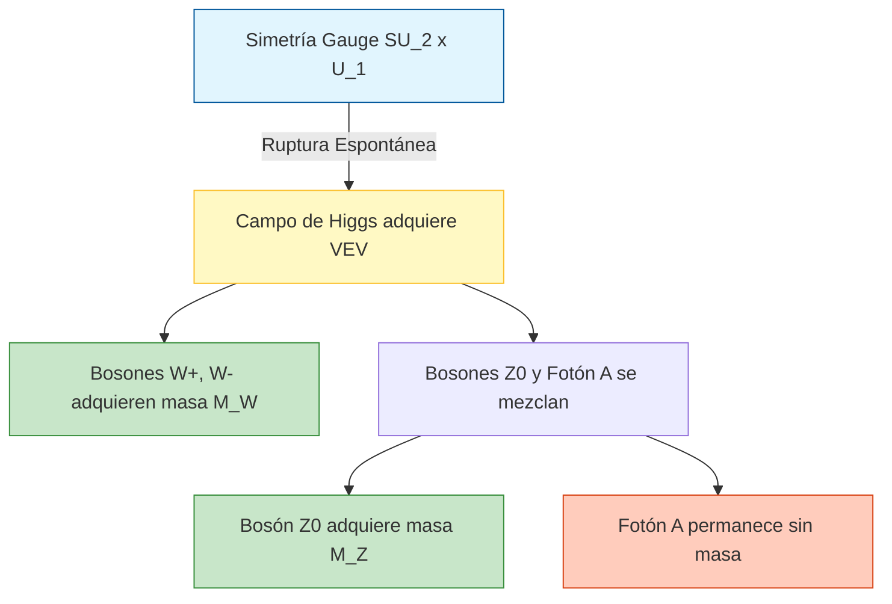

# Modelo Estándar

El Modelo Estándar es la teoría cuántica de campos que describe tres de las cuatro interacciones fundamentales conocidas: electromagnética, débil y fuerte. Organiza las partículas elementales en fermiones de materia y bosones mediadores.

## Partículas Fundamentales

- **Quarks**: $u$, $d$, $c$, $s$, $t$, $b$.
- **Leptones**: electrón, muón, tau y sus neutrinos asociados.
- **Bosones gauge**: fotón, gluones, bosones $W^\pm$ y $Z^0$.
- **Bosón de Higgs**: asociado al mecanismo de ruptura espontánea de simetría electrodébil.

## Estructura Conceptual

- **Simetría gauge**: $SU(3)_C \times SU(2)_L \times U(1)_Y$.
- **QCD**: Describe la interacción fuerte entre quarks y gluones.
- **Teoría electrodébil**: Unifica la interacción electromagnética y débil.
- **Generaciones**: La materia visible está organizada en tres familias con propiedades análogas.

## Ideas Clave

### 1. Conservación y simetría
Muchas leyes de conservación se entienden como consecuencia de simetrías profundas.

### 2. Confinamiento
Los quarks no se observan aislados; aparecen ligados en hadrones.

### 3. Más allá del Modelo Estándar
Neutrinos con masa, materia oscura y gravedad cuántica muestran que el modelo no es la teoría final.

## 🧮 Desarrollo Teórico Profundo

El Modelo Estándar (ME) de la física de partículas es una teoría cuántica de campos gauge construida sobre el grupo de simetría local:

$$ \mathcal{G}_{ME} = SU(3)_C \otimes SU(2)_L \otimes U(1)_Y $$

Donde $SU(3)_C$ describe la Cromodinámica Cuántica (interacción fuerte), y $SU(2)_L \otimes U(1)_Y$ corresponde a la teoría electrodébil. El Lagrangiano total del ME puede separarse en varias contribuciones fundamentales:

$$ \mathcal{L}_{ME} = \mathcal{L}_{Gauge} + \mathcal{L}_{Fermiones} + \mathcal{L}_{Higgs} + \mathcal{L}_{Yukawa} $$

A continuación, presentaremos un desarrollo exhaustivo de cada sector.

### 1. El Sector Electrodébil y la Simetría Local

La interacción electrodébil unifica el electromagnetismo y la fuerza nuclear débil. Para los leptones de la primera generación, agrupamos los fermiones levógiros en un doblete de isospín débil y los dextrógiros en un singlete:

$$ L = \begin{pmatrix} \nu_e \\ e \end{pmatrix}_L, \quad R = e_R $$

Las transformaciones bajo el grupo gauge $SU(2)_L \otimes U(1)_Y$ se definen por:

$$ L \to \exp\left(i \frac{g}{2} \vec{\alpha}(x) \cdot \vec{\sigma} + i \frac{g'}{2} y_L \beta(x)\right) L $$
$$ R \to \exp\left(i \frac{g'}{2} y_R \beta(x)\right) R $$

donde $\vec{\sigma}$ son las matrices de Pauli, $g$ y $g'$ son las constantes de acoplamiento de $SU(2)_L$ y $U(1)_Y$ respectivamente, y $y$ es la hipercarga débil, vinculada a la carga eléctrica por la fórmula de Gell-Mann–Nishijima: $Q = T_3 + \frac{Y}{2}$.

Para garantizar la invarianza gauge local del Lagrangiano de los fermiones, introducimos la derivada covariante:

$$ D_\mu = \partial_\mu - i g \frac{\vec{\sigma}}{2} \cdot \vec{W}_\mu - i g' \frac{Y}{2} B_\mu $$

El término cinético gauge es entonces:

$$ \mathcal{L}_{Gauge} = -\frac{1}{4} W^a_{\mu\nu} W^{a\mu\nu} - \frac{1}{4} B_{\mu\nu} B^{\mu\nu} $$

donde los tensores de campo (field strengths) se definen formalmente considerando la no-abelianidad de $SU(2)$:

$$ W^a_{\mu\nu} = \partial_\mu W^a_\nu - \partial_\nu W^a_\mu + g \epsilon^{abc} W^b_\mu W^c_\nu $$
$$ B_{\mu\nu} = \partial_\mu B_\nu - \partial_\nu B_\mu $$

Sin embargo, los términos de masa para los bosones $W$ y $Z$ de la forma $\frac{1}{2} M^2 W_\mu W^\mu$ violarían explícitamente la invarianza gauge. Esto motiva la introducción del Mecanismo de Brout-Englert-Higgs.

### 2. El Mecanismo de Higgs (Ruptura Espontánea de Simetría)

Introducimos un doblete escalar complejo de $SU(2)_L$ con hipercarga $Y=1$:

$$ \Phi = \begin{pmatrix} \phi^+ \\ \phi^0 \end{pmatrix} = \frac{1}{\sqrt{2}} \begin{pmatrix} \phi_1 + i\phi_2 \\ \phi_3 + i\phi_4 \end{pmatrix} $$

El Lagrangiano para el campo de Higgs es:

$$ \mathcal{L}_{Higgs} = (D_\mu \Phi)^\dagger (D^\mu \Phi) - V(\Phi) $$

con el potencial:

$$ V(\Phi) = \mu^2 \Phi^\dagger \Phi + \lambda (\Phi^\dagger \Phi)^2 $$

#### Demostración Paso a Paso de la Ruptura de Simetría

**Paso 1: Identificación del vacío**
Para $\mu^2 < 0$ y $\lambda > 0$, el mínimo del potencial no está en el origen. El valor esperado del vacío (VEV) adquiere un valor no nulo. Minimizamos el potencial:

$$ \frac{\partial V}{\partial (\Phi^\dagger \Phi)} = \mu^2 + 2\lambda (\Phi^\dagger \Phi) = 0 \implies |\Phi_0|^2 = -\frac{\mu^2}{2\lambda} \equiv \frac{v^2}{2} $$

Elegimos (rompiendo espontáneamente la simetría) que el VEV caiga en la componente real neutra:

$$ \Phi_0 = \frac{1}{\sqrt{2}} \begin{pmatrix} 0 \\ v \end{pmatrix} $$

**Paso 2: Expansión alrededor del vacío**
En el gauge unitario, parametrizamos el campo de Higgs como:

$$ \Phi(x) = \frac{1}{\sqrt{2}} \begin{pmatrix} 0 \\ v + h(x) \end{pmatrix} $$

donde $h(x)$ es el bosón físico de Higgs. Los otros tres grados de libertad escalares (los bosones de Goldstone) son absorbidos para dar masa a los bosones gauge.

**Paso 3: Masas de los bosones Gauge**
Evaluamos el término cinético $(D_\mu \Phi)^\dagger (D^\mu \Phi)$ en el vacío $\Phi_0$:

$$ D_\mu \Phi_0 = \left( \partial_\mu - i \frac{g}{2} \vec{\sigma} \cdot \vec{W}_\mu - i \frac{g'}{2} B_\mu \right) \frac{1}{\sqrt{2}} \begin{pmatrix} 0 \\ v \end{pmatrix} $$

Dado que $\sigma^1 = \begin{pmatrix} 0 & 1 \\ 1 & 0 \end{pmatrix}$, $\sigma^2 = \begin{pmatrix} 0 & -i \\ i & 0 \end{pmatrix}$, $\sigma^3 = \begin{pmatrix} 1 & 0 \\ 0 & -1 \end{pmatrix}$:

$$ (\vec{\sigma} \cdot \vec{W}_\mu) \begin{pmatrix} 0 \\ 1 \end{pmatrix} = \begin{pmatrix} W^1_\mu - i W^2_\mu \\ -W^3_\mu \end{pmatrix} $$

Entonces, 

$$ D_\mu \Phi_0 = \frac{-i}{2\sqrt{2}} \begin{pmatrix} g(W^1_\mu - i W^2_\mu) \\ -g W^3_\mu + g' B_\mu \end{pmatrix} v $$

Calculando $|D_\mu \Phi_0|^2$, obtenemos la matriz de masas para los campos gauge:

$$ |D_\mu \Phi_0|^2 = \frac{v^2}{8} \left[ g^2 ((W^1_\mu)^2 + (W^2_\mu)^2) + (g W^3_\mu - g' B_\mu)^2 \right] $$

Definimos los campos físicos de masa definida:
- Bosones $W$ cargados: $W^\pm_\mu = \frac{1}{\sqrt{2}}(W^1_\mu \mp i W^2_\mu)$. Su masa es **$M_W = \frac{gv}{2}$**.
- Bosón $Z$ neutro: $Z_\mu = \frac{g W^3_\mu - g' B_\mu}{\sqrt{g^2 + g'^2}}$. Su masa es **$M_Z = \frac{v}{2}\sqrt{g^2 + g'^2}$**.
- Fotón $A$: $A_\mu = \frac{g' W^3_\mu + g B_\mu}{\sqrt{g^2 + g'^2}}$. Vemos que su coeficiente en la forma cuadrática es cero; por lo tanto, **$M_A = 0$**.

La relación entre los acoplamientos y el ángulo de mezcla de Weinberg $\theta_W$ es:
$$ \cos\theta_W = \frac{g}{\sqrt{g^2 + g'^2}}, \quad \sin\theta_W = \frac{g'}{\sqrt{g^2 + g'^2}} $$

Esto nos lleva a la profunda relación del ME: $M_W = M_Z \cos\theta_W$.

### 3. Generación de Masa de Fermiones (Acoplamiento de Yukawa)

Al igual que los bosones, la invarianza gauge impide términos de masa directos $m \bar{\psi} \psi = m(\bar{\psi}_L \psi_R + \bar{\psi}_R \psi_L)$ para los fermiones porque $L$ y $R$ transforman de manera diferente bajo $SU(2)_L$. 

Por lo tanto, introducimos el Lagrangiano de Yukawa acoplando los fermiones al campo de Higgs:

$$ \mathcal{L}_{Yukawa} = -y_e \bar{L} \Phi R - y_e \bar{R} \Phi^\dagger L + \dots $$

Donde $y_e$ es la constante de acoplamiento de Yukawa para el electrón. Insertando el VEV de Higgs $\Phi_0$:

$$ -y_e \left( \bar{\nu}_e, \bar{e}_L \right) \frac{1}{\sqrt{2}} \begin{pmatrix} 0 \\ v \end{pmatrix} e_R + \text{h.c.} = -\frac{y_e v}{\sqrt{2}} \bar{e}_L e_R + \text{h.c.} = -m_e \bar{e} e $$

De aquí derivamos rigurosamente que la masa del electrón es proporcional al VEV:

$$ m_e = \frac{y_e v}{\sqrt{2}} $$

Este mismo principio se aplica a todos los quarks y leptones del Modelo Estándar, introduciendo una matriz de acoplamientos de Yukawa que, tras ser diagonalizada, origina la matriz CKM (Cabibbo-Kobayashi-Maskawa) que gobierna el sabor de los quarks y la violación de la paridad CP.

### 4. Cromodinámica Cuántica (QCD) y $SU(3)_C$

El sector de interacción fuerte se basa en la simetría $SU(3)$ de "color". Los quarks son tripletes de $SU(3)_C$. El Lagrangiano de QCD es:

$$ \mathcal{L}_{QCD} = \sum_q \bar{\psi}_q (i \gamma^\mu D_\mu - m_q) \psi_q - \frac{1}{4} G^a_{\mu\nu} G^{a\mu\nu} $$

Donde $G^a_{\mu\nu}$ es el tensor del campo gluónico ($a = 1, \dots, 8$ corresponde a las 8 matrices de Gell-Mann $\lambda^a$):

$$ G^a_{\mu\nu} = \partial_\mu G^a_\nu - \partial_\nu G^a_\mu + g_s f^{abc} G^b_\mu G^c_\nu $$

El término no lineal $g_s f^{abc} G^b_\mu G^c_\nu$ representa la auto-interacción de los gluones (vértices de 3 y 4 gluones). Esta auto-interacción es el origen matemático de la **libertad asintótica**: la constante de acoplamiento fuerte $\alpha_s(Q^2) = \frac{g_s^2}{4\pi}$ disminuye logarítmicamente a altas energías (o distancias cortas), y aumenta a bajas energías, causando el fenómeno del confinamiento de los quarks a distancias de la escala de femtómetros ($\Lambda_{QCD} \approx 200 \text{ MeV}$).

## 📚 Recursos

### Cursos Online
1. "[The Standard Model](https://ocw.mit.edu/courses/physics/8-701-introduction-to-nuclear-and-particle-physics-fall-2020/)" (MIT OCW)
2. "[Particle Physics: An Introduction](https://www.coursera.org/learn/particle-physics)" (Coursera)
3. "[Beyond the Standard Model](https://www.edx.org/)" (edX)
4. "[Quantum Electrodynamics and Chromodynamics](https://online.stanford.edu/)" (Stanford Online)
5. "[Symmetry and the Standard Model](https://www.maths.cam.ac.uk/)" (University of Cambridge)

### Artículos y Simulaciones
1. "[A Model of Leptons](https://doi.org/10.1103/PhysRevLett.19.1264)" (S. Weinberg, 1967)
2. "[Broken Symmetries and the Masses of Gauge Bosons](https://doi.org/10.1103/PhysRevLett.13.508)" (P. W. Higgs, 1964)
3. "[The Discovery of the Top Quark](https://www.fnal.gov/pub/science/top-quark.html)" (Fermilab)
4. "[CERN Open Data Portal - Standard Model Analyses](https://opendata.cern.ch/)"
5. "[Neutrino Oscillations](https://doi.org/10.1103/PhysRevLett.81.1562)" (Super-Kamiokande, 1998)
6. "[Elementary Particles](https://phet.colorado.edu/)" (PhET Interactive Simulations)
7. "[CP Violation in the Kaon System](https://doi.org/10.1103/PhysRevLett.13.138)" (Cronin & Fitch, 1964)
8. "[Quantum Chromodynamics at high energies](https://doi.org/10.1103/RevModPhys.67.157)" (Review Article)

### 📖 Referencias Útiles y Bibliografía
- Halzen, F., & Martin, A. D. (1984). *[Quarks and Leptons](https://www.wiley.com/en-us/Quarks+and+Leptons%3A+An+Introductory+Course+in+Modern+Particle+Physics-p-9780471887416)*. John Wiley & Sons.
- Griffiths, D. J. (2008). *[Introduction to Elementary Particles](https://www.wiley.com/en-us/Introduction+to+Elementary+Particles%2C+2nd%2C+Revised+Edition-p-9783527406012)*. Wiley-VCH.
- Thomson, M. (2013). *[Modern Particle Physics](https://doi.org/10.1017/CBO9781139525367)*. Cambridge University Press.
- Schwartz, M. D. (2014). *[Quantum Field Theory and the Standard Model](https://doi.org/10.1017/CBO9781139048040)*. Cambridge.
