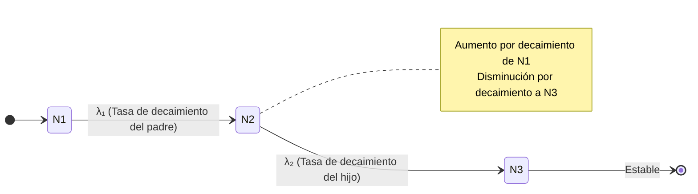

# Radioactividad y Decaimientos

La radioactividad describe la transformación espontánea de núcleos inestables hacia configuraciones más estables. Estos procesos revelan la estructura del núcleo y la naturaleza de las interacciones débil y electromagnética.

## 🧮 Desarrollo Teórico Profundo

La física nuclear de la radioactividad se cimienta en principios cuánticos para explicar las tasas y mecanismos subyacentes de las transformaciones nucleares. Los decaimientos son procesos estocásticos a nivel individual, pero estadísticamente deterministas para conjuntos macroscópicos. A continuación, desarrollamos matemáticamente los distintos regímenes.

### 1. Cinética del Decaimiento Radiactivo

La ley de decaimiento radiactivo se deriva del postulado fundamental de que la probabilidad de decaimiento de un núcleo por unidad de tiempo es una constante, denominada constante de desintegración ($\lambda$). 

Para una muestra con $N$ núcleos idénticos, el cambio $dN$ en un intervalo $dt$ es proporcional al número de núcleos presentes:
$$ \frac{dN}{dt} = -\lambda N $$

Separando variables e integrando desde $t = 0$ (con $N(0) = N_0$) hasta el tiempo $t$:
$$ \int_{N_0}^{N(t)} \frac{dN}{N} = -\int_0^t \lambda \, dt $$
$$ \ln\left(\frac{N(t)}{N_0}\right) = -\lambda t \implies N(t) = N_0 e^{-\lambda t} $$

La actividad de una muestra se define como la tasa absoluta de desintegración:
$$ A(t) = \left| \frac{dN}{dt} \right| = \lambda N(t) = \lambda N_0 e^{-\lambda t} = A_0 e^{-\lambda t} $$

Las cantidades características de tiempo son:
- **Vida Media ($\tau$)**: El tiempo promedio que sobrevive un núcleo.
  $$ \tau = \frac{\int_0^\infty t \, \lambda N_0 e^{-\lambda t} dt}{\int_0^\infty \lambda N_0 e^{-\lambda t} dt} = \frac{1}{\lambda} $$
- **Semivida o Periodo de Semidesintegración ($t_{1/2}$)**: Tiempo para que la muestra se reduzca a la mitad.
  $$ \frac{N_0}{2} = N_0 e^{-\lambda t_{1/2}} \implies t_{1/2} = \frac{\ln 2}{\lambda} = \tau \ln 2 $$

#### Ecuaciones de Bateman para Cadenas de Decaimiento
A menudo, el núcleo "hijo" es también radiactivo, formando una cadena $N_1 \xrightarrow{\lambda_1} N_2 \xrightarrow{\lambda_2} N_3$. Las tasas de cambio son un sistema de ecuaciones diferenciales acopladas:
$$ \frac{dN_1}{dt} = -\lambda_1 N_1 $$
$$ \frac{dN_2}{dt} = \lambda_1 N_1 - \lambda_2 N_2 $$
$$ \frac{dN_3}{dt} = \lambda_2 N_2 $$

Con condiciones iniciales $N_1(0) = N_{10}$, $N_2(0) = 0$, $N_3(0) = 0$, la solución para el núcleo hijo es:
$$ N_2(t) = N_{10} \frac{\lambda_1}{\lambda_2 - \lambda_1} \left( e^{-\lambda_1 t} - e^{-\lambda_2 t} \right) $$

### 2. Decaimiento Alfa ($\alpha$) y el Efecto Túnel Cuántico

El decaimiento alfa implica la emisión de un núcleo de Helio-4 ($^4_2\text{He}$) de un núcleo pesado (como U, Th, Ra).
$$ ^{A}_{Z}X \longrightarrow ^{A-4}_{Z-2}Y + ^{4}_{2}\text{He} + Q_\alpha $$

La conservación de la energía exige que el valor $Q$ sea positivo:
$$ Q_\alpha = (m_X - m_Y - m_\alpha)c^2 > 0 $$

En 1928, George Gamow (y de forma independiente Gurney y Condon) explicó el mecanismo modelándolo como un efecto túnel cuántico. La partícula alfa preformada dentro del núcleo experimenta un pozo de potencial nuclear atractivo para $r < R$ (radio nuclear) y una barrera repulsiva de Coulomb para $r > R$.

La energía potencial es:
$$ V(r) = \frac{1}{4\pi\varepsilon_0} \frac{2(Z-2)e^2}{r} \quad \text{para} \, r > R $$

La partícula alfa de energía $E = Q_\alpha$ enfrenta una barrera que clásicamente es impenetrable, ya que la distancia de retorno clásica $b$ (donde $V(b) = Q_\alpha$) es mayor que $R$. Según la aproximación WKB, la probabilidad de penetración $P$ (coeficiente de transmisión) está dada por:
$$ P \approx e^{-2G} $$
Donde el factor de Gamow $G$ es:
$$ G = \frac{1}{\hbar} \int_{R}^{b} \sqrt{2m_\alpha(V(r) - Q_\alpha)} \, dr $$

Evaluando la integral, se obtiene:
$$ G \approx \frac{\pi e^2}{\varepsilon_0 \hbar v} Z' - \frac{2e}{\hbar} \sqrt{\frac{m_\alpha Z' R}{\pi \varepsilon_0}} $$
Donde $Z' = Z - 2$ y $v$ es la velocidad de la partícula alfa. Como la constante de decaimiento $\lambda = f P$ (siendo $f \sim 10^{21} \text{ s}^{-1}$ la frecuencia de colisión con la barrera), resulta:
$$ \ln \lambda = \ln f - 2G \approx A - \frac{B Z'}{\sqrt{Q_\alpha}} $$

Esta derivación puramente teórica reprodujo con éxito la ley fenomenológica de Geiger-Nuttall, confirmando que la probabilidad exponencial de decaimiento es increíblemente sensible a pequeñas variaciones de $Q_\alpha$.

### 3. Decaimiento Beta ($\beta$) y Teoría de Fermi

El decaimiento beta abarca transiciones nucleares inducidas por la interacción débil, conservando el número de nucleones ($A$) pero cambiando la carga ($Z$). Destacan tres modos:

1. **Decaimiento $\beta^-$**: Emisión de un electrón y un antineutrino electrónico.
   $$ n \longrightarrow p + e^- + \bar{\nu}_e $$
   $$ Q_{\beta^-} = (m_X - m_Y)c^2 $$
2. **Decaimiento $\beta^+$**: Emisión de un positrón y un neutrino.
   $$ p \longrightarrow n + e^+ + \nu_e $$
   $$ Q_{\beta^+} = (m_X - m_Y - 2m_e)c^2 $$
3. **Captura Electrónica (CE)**:
   $$ p + e^- \longrightarrow n + \nu_e $$

El espectro de energía continua de los electrones emitidos en $\beta^-$ condujo a Wolfgang Pauli a postular la existencia del neutrino en 1930 para salvar la conservación de energía y momento.

En 1934, Enrico Fermi elaboró una teoría cuantitativa basada en la mecánica cuántica dependiente del tiempo. Usando la Regla de Oro de Fermi, la tasa de transición diferencial a un momento del electrón $p$ es:
$$ d\lambda = \frac{2\pi}{\hbar} |M_{fi}|^2 \frac{dN}{dE_0} $$

El elemento de matriz de interacción asume un Hamiltoniano puntual:
$$ M_{fi} = G_F \int \psi_f^* \mathcal{O} \psi_i \, d^3r $$
Donde $G_F$ es la constante de Fermi y $\mathcal{O}$ agrupa los operadores espinoriales. Asumiendo transiciones "permitidas" (los leptones escapan con momento orbital $l=0$), el elemento de matriz es casi independiente del momento.

La densidad de estados finales $\rho(E) = \frac{dN}{dE_0}$ depende del espacio de fases de los leptones emitidos. Integrando sobre los momentos bajo conservación de energía ($E_0 = E_e + E_\nu$), el espectro predicho para el decaimiento beta es:
$$ \frac{dN_e}{dp_e} \propto p_e^2 (E_0 - E_e)^2 F(Z, E_e) $$
El factor de Fermi $F(Z, E_e)$ corrige por el efecto del campo de Coulomb nuclear sobre la onda del electrón saliente. Esta distribución coincide a la perfección con las mediciones empíricas, como las demostradas en tramas de Kurie:
$$ K = \sqrt{\frac{N(p_e)}{p_e^2 F(Z, E_e)}} \propto (E_0 - E_e) $$
El corte rectilíneo que interseca en $E_0$ se usa para determinar la masa del antineutrino (actualmente acotada a $< 0.8 \, \text{eV}$).

### 4. Decaimiento Gamma ($\gamma$) y Transiciones Electromagnéticas

Una vez que un núcleo sufre decaimiento alfa o beta, frecuentemente queda en un estado excitado. La relajación al estado base produce la emisión de fotones muy energéticos (rayos gamma).

El proceso está gobernado por el Hamiltoniano de interacción radiativa. La probabilidad de emisión depende de las diferencias de paridad y momento angular cuántico total ($\vec{J}$) entre los estados inicial y final:
$$ \vec{J}_i = \vec{J}_f + \vec{L} \implies |J_i - J_f| \leq L \leq J_i + J_f $$
Donde $L$ es el multipolo de la radiación ($L=1$ dipolo, $L=2$ cuadrupolo, etc.). Se clasifican como eléctricos ($E L$) o magnéticos ($M L$).

Las reglas de paridad ($\pi$) son:
- Para radiación eléctrica $E L$: $\pi_i \cdot \pi_f = (-1)^L$
- Para radiación magnética $M L$: $\pi_i \cdot \pi_f = (-1)^{L+1}$

La tasa de decaimiento por emisión multipolar sigue la estimación de Weisskopf, indicando fuertemente que las transiciones de menor $L$ dominan y que $\lambda(E L) \gg \lambda(M L)$.
$$ \lambda(E L) \propto \left( \frac{E_\gamma}{\hbar c} \right)^{2L+1} R^{2L} $$
Un corolario crucial es que $L=0$ está estrictamente prohibido, lo que significa que un estado $0^+ \rightarrow 0^+$ no puede emitir un fotón único y su desexcitación requiere conversión interna o creación de pares.

## 📚 Recursos

### Cursos Online
1. "[Radioactivity and Health Physics](https://ocw.mit.edu/courses/nuclear-engineering/22-01-introduction-to-nuclear-engineering-and-ionizing-radiation-fall-2016/)" (MIT OCW)
2. "[Introduction to Radiation Shielding](https://www.coursera.org/)" (Coursera)
3. "[Nuclear Decay and Dosimetry](https://www.edx.org/)" (edX)
4. "[Medical Applications of Radiation](https://online.stanford.edu/)" (Stanford Online)
5. "[Environmental Radioactivity](https://www.u-tokyo.ac.jp/en/)" (University of Tokyo)

### Artículos y Simulaciones
1. "[The Radioactivity of Uranium](https://gallica.bnf.fr/ark:/12148/bpt6k30784/f420.item)" (H. Becquerel, 1896)
2. "[Polonium and Radium Discovery](https://gallica.bnf.fr/ark:/12148/bpt6k3083t/f1215.item)" (M. Curie & P. Curie, 1898)
3. "[Alpha Decay](https://phet.colorado.edu/en/simulations/alpha-decay)" (PhET Interactive Simulations)
4. "[Beta Decay](https://phet.colorado.edu/en/simulations/beta-decay)" (PhET Interactive Simulations)
5. "[Chart of Nuclides](https://www.nndc.bnl.gov/nudat3/)" (NNDC)
6. "[Biological Effects of Ionizing Radiation](https://nap.nationalacademies.org/catalog/11340/health-risks-from-exposure-to-low-levels-of-ionizing-radiation)" (BEIR Reports)
7. "[Geiger-Nuttall Law for Alpha Decay](https://doi.org/10.1080/14786441008637156)" (Review)
8. "[Neutrino Detection from Beta Decay](https://doi.org/10.1126/science.124.3212.103)" (Reines & Cowan, 1956)

### 📖 Referencias Útiles y Bibliografía
- Krane, K. S. (1987). *[Introductory Nuclear Physics](https://www.wiley.com/en-us/Introductory+Nuclear+Physics%2C+3rd+Edition-p-9780471805533)*. John Wiley & Sons.
- Turner, J. E. (2007). *[Atoms, Radiation, and Radiation Protection](https://www.wiley.com/en-us/Atoms%2C+Radiation%2C+and+Radiation+Protection%2C+3rd+Edition-p-9783527406067)*. Wiley-VCH.
- Knoll, G. F. (2010). *[Radiation Detection and Measurement](https://www.wiley.com/en-us/Radiation+Detection+and+Measurement%2C+4th+Edition-p-9780470131480)*. Wiley.
- Evans, R. D. (1955). *[The Atomic Nucleus](https://archive.org/details/atomicnucleus0000evan)*. McGraw-Hill.
