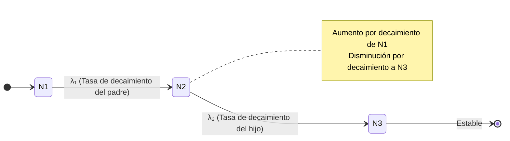

# Radioactividad y Decaimientos

La radioactividad describe la transformación espontánea de núcleos inestables hacia configuraciones más estables. Estos procesos revelan la estructura del núcleo y la naturaleza de las interacciones débil y electromagnética.

## 🧮 Desarrollo Teórico Profundo

La física nuclear de la radioactividad se cimienta en principios cuánticos para explicar las tasas y mecanismos subyacentes de las transformaciones nucleares. Los decaimientos son procesos estocásticos a nivel individual, pero estadísticamente deterministas para conjuntos macroscópicos. A continuación, desarrollamos matemáticamente los distintos regímenes.

### 1. Cinética del Decaimiento Radiactivo

La ley de decaimiento radiactivo se deriva del postulado fundamental de que la probabilidad de decaimiento de un núcleo por unidad de tiempo es una constante, denominada constante de desintegración ($\lambda$). 

Para una muestra con $N$ núcleos idénticos, el cambio $dN$ en un intervalo $dt$ es proporcional al número de núcleos presentes:
$$ \frac{dN}{dt} = -\lambda N $$

Separando variables e integrando desde $t = 0$ (con $N(0) = N_0$) hasta el tiempo $t$:
$$ \int_{N_0}^{N(t)} \frac{dN}{N} = -\int_0^t \lambda \, dt $$
$$ \ln\left(\frac{N(t)}{N_0}\right) = -\lambda t \implies N(t) = N_0 e^{-\lambda t} $$

La actividad de una muestra se define como la tasa absoluta de desintegración:
$$ A(t) = \left| \frac{dN}{dt} \right| = \lambda N(t) = \lambda N_0 e^{-\lambda t} = A_0 e^{-\lambda t} $$

Las cantidades características de tiempo son:
- **Vida Media ($\tau$)**: El tiempo promedio que sobrevive un núcleo.
  $$ \tau = \frac{\int_0^\infty t \, \lambda N_0 e^{-\lambda t} dt}{\int_0^\infty \lambda N_0 e^{-\lambda t} dt} = \frac{1}{\lambda} $$
- **Semivida o Periodo de Semidesintegración ($t_{1/2}$)**: Tiempo para que la muestra se reduzca a la mitad.
  $$ \frac{N_0}{2} = N_0 e^{-\lambda t_{1/2}} \implies t_{1/2} = \frac{\ln 2}{\lambda} = \tau \ln 2 $$

#### Ecuaciones de Bateman para Cadenas de Decaimiento
A menudo, el núcleo "hijo" es también radiactivo, formando una cadena $N_1 \xrightarrow{\lambda_1} N_2 \xrightarrow{\lambda_2} N_3$. Las tasas de cambio son un sistema de ecuaciones diferenciales acopladas:
$$ \frac{dN_1}{dt} = -\lambda_1 N_1 $$
$$ \frac{dN_2}{dt} = \lambda_1 N_1 - \lambda_2 N_2 $$
$$ \frac{dN_3}{dt} = \lambda_2 N_2 $$

Con condiciones iniciales $N_1(0) = N_{10}$, $N_2(0) = 0$, $N_3(0) = 0$, la solución para el núcleo hijo es:
$$ N_2(t) = N_{10} \frac{\lambda_1}{\lambda_2 - \lambda_1} \left( e^{-\lambda_1 t} - e^{-\lambda_2 t} \right) $$



### 2. Decaimiento Alfa ($\alpha$) y el Efecto Túnel Cuántico

El decaimiento alfa implica la emisión de un núcleo de Helio-4 ($^4_2\text{He}$) de un núcleo pesado (como U, Th, Ra).
$$ ^{A}_{Z}X \longrightarrow ^{A-4}_{Z-2}Y + ^{4}_{2}\text{He} + Q_\alpha $$

La conservación de la energía exige que el valor $Q$ sea positivo:
$$ Q_\alpha = (m_X - m_Y - m_\alpha)c^2 > 0 $$

En 1928, George Gamow (y de forma independiente Gurney y Condon) explicó el mecanismo modelándolo como un efecto túnel cuántico. La partícula alfa preformada dentro del núcleo experimenta un pozo de potencial nuclear atractivo para $r < R$ (radio nuclear) y una barrera repulsiva de Coulomb para $r > R$.

La energía potencial es:
$$ V(r) = \frac{1}{4\pi\varepsilon_0} \frac{2(Z-2)e^2}{r} \quad \text{para} \, r > R $$

La partícula alfa de energía $E = Q_\alpha$ enfrenta una barrera que clásicamente es impenetrable, ya que la distancia de retorno clásica $b$ (donde $V(b) = Q_\alpha$) es mayor que $R$. Según la aproximación WKB, la probabilidad de penetración $P$ (coeficiente de transmisión) está dada por:
$$ P \approx e^{-2G} $$
Donde el factor de Gamow $G$ es:
$$ G = \frac{1}{\hbar} \int_{R}^{b} \sqrt{2m_\alpha(V(r) - Q_\alpha)} \, dr $$

Evaluando la integral, se obtiene:
$$ G \approx \frac{\pi e^2}{\varepsilon_0 \hbar v} Z' - \frac{2e}{\hbar} \sqrt{\frac{m_\alpha Z' R}{\pi \varepsilon_0}} $$
Donde $Z' = Z - 2$ y $v$ es la velocidad de la partícula alfa. Como la constante de decaimiento $\lambda = f P$ (siendo $f \sim 10^{21} \text{ s}^{-1}$ la frecuencia de colisión con la barrera), resulta:
$$ \ln \lambda = \ln f - 2G \approx A - \frac{B Z'}{\sqrt{Q_\alpha}} $$

Esta derivación puramente teórica reprodujo con éxito la ley fenomenológica de Geiger-Nuttall, confirmando que la probabilidad exponencial de decaimiento es increíblemente sensible a pequeñas variaciones de $Q_\alpha$.

### 3. Decaimiento Beta ($\beta$) y Teoría de Fermi

El decaimiento beta abarca transiciones nucleares inducidas por la interacción débil, conservando el número de nucleones ($A$) pero cambiando la carga ($Z$). Destacan tres modos:

1. **Decaimiento $\beta^-$**: Emisión de un electrón y un antineutrino electrónico.
   $$ n \longrightarrow p + e^- + \bar{\nu}_e $$
   $$ Q_{\beta^-} = (m_X - m_Y)c^2 $$
2. **Decaimiento $\beta^+$**: Emisión de un positrón y un neutrino.
   $$ p \longrightarrow n + e^+ + \nu_e $$
   $$ Q_{\beta^+} = (m_X - m_Y - 2m_e)c^2 $$
3. **Captura Electrónica (CE)**:
   $$ p + e^- \longrightarrow n + \nu_e $$

El espectro de energía continua de los electrones emitidos en $\beta^-$ condujo a Wolfgang Pauli a postular la existencia del neutrino en 1930 para salvar la conservación de energía y momento.

En 1934, Enrico Fermi elaboró una teoría cuantitativa basada en la mecánica cuántica dependiente del tiempo. Usando la Regla de Oro de Fermi, la tasa de transición diferencial a un momento del electrón $p$ es:
$$ d\lambda = \frac{2\pi}{\hbar} |M_{fi}|^2 \frac{dN}{dE_0} $$

El elemento de matriz de interacción asume un Hamiltoniano puntual:
$$ M_{fi} = G_F \int \psi_f^* \mathcal{O} \psi_i \, d^3r $$
Donde $G_F$ es la constante de Fermi y $\mathcal{O}$ agrupa los operadores espinoriales. Asumiendo transiciones "permitidas" (los leptones escapan con momento orbital $l=0$), el elemento de matriz es casi independiente del momento.

La densidad de estados finales $\rho(E) = \frac{dN}{dE_0}$ depende del espacio de fases de los leptones emitidos. Integrando sobre los momentos bajo conservación de energía ($E_0 = E_e + E_\nu$), el espectro predicho para el decaimiento beta es:
$$ \frac{dN_e}{dp_e} \propto p_e^2 (E_0 - E_e)^2 F(Z, E_e) $$
El factor de Fermi $F(Z, E_e)$ corrige por el efecto del campo de Coulomb nuclear sobre la onda del electrón saliente. Esta distribución coincide a la perfección con las mediciones empíricas, como las demostradas en tramas de Kurie:
$$ K = \sqrt{\frac{N(p_e)}{p_e^2 F(Z, E_e)}} \propto (E_0 - E_e) $$
El corte rectilíneo que interseca en $E_0$ se usa para determinar la masa del antineutrino (actualmente acotada a $< 0.8 \, \text{eV}$).

### 4. Decaimiento Gamma ($\gamma$) y Transiciones Electromagnéticas

Una vez que un núcleo sufre decaimiento alfa o beta, frecuentemente queda en un estado excitado. La relajación al estado base produce la emisión de fotones muy energéticos (rayos gamma).

El proceso está gobernado por el Hamiltoniano de interacción radiativa. La probabilidad de emisión depende de las diferencias de paridad y momento angular cuántico total ($\vec{J}$) entre los estados inicial y final:
$$ \vec{J}_i = \vec{J}_f + \vec{L} \implies |J_i - J_f| \leq L \leq J_i + J_f $$
Donde $L$ es el multipolo de la radiación ($L=1$ dipolo, $L=2$ cuadrupolo, etc.). Se clasifican como eléctricos ($E L$) o magnéticos ($M L$).

Las reglas de paridad ($\pi$) son:
- Para radiación eléctrica $E L$: $\pi_i \cdot \pi_f = (-1)^L$
- Para radiación magnética $M L$: $\pi_i \cdot \pi_f = (-1)^{L+1}$

La tasa de decaimiento por emisión multipolar sigue la estimación de Weisskopf, indicando fuertemente que las transiciones de menor $L$ dominan y que $\lambda(E L) \gg \lambda(M L)$.
$$ \lambda(E L) \propto \left( \frac{E_\gamma}{\hbar c} \right)^{2L+1} R^{2L} $$
Un corolario crucial es que $L=0$ está estrictamente prohibido, lo que significa que un estado $0^+ \rightarrow 0^+$ no puede emitir un fotón único y su desexcitación requiere conversión interna o creación de pares.

## 📝 Guía de Ejercicios Resueltos

### Ejercicio 1: Fórmula Semiempírica de Masas y Estabilidad Isobarica
Determine el núcleo más estable contra decaimiento beta para una familia isobárica con $A = 125$. Utilice la fórmula semiempírica de masas considerando las constantes típicas.

**Solución paso a paso:**
1. La masa atómica de un núcleo isobárico es aproximadamente una parábola en función de $Z$:
   $$ M(A,Z) \approx \alpha Z^2 + \beta Z + \gamma $$
2. Los términos relevantes de la fórmula de Bethe-Weizsäcker que dependen de $Z$ son el término de Coulomb y el de asimetría:
   $$ E_C = a_c \frac{Z(Z-1)}{A^{1/3}} \approx a_c \frac{Z^2}{A^{1/3}}, \quad E_A = a_a \frac{(A-2Z)^2}{A} $$
3. Maximizando la energía de ligadura con respecto a $Z$ (o minimizando la masa):
   $$ \frac{\partial E_B}{\partial Z} = -2 a_c \frac{Z}{A^{1/3}} + 4 a_a \frac{A-2Z}{A} = 0 $$
4. Despejando $Z$ para el isóbaro más estable ($Z_{min}$):
   $$ Z_{min} = \frac{A}{2 + \frac{a_c}{2 a_a} A^{2/3}} $$
5. Utilizando valores típicos $a_c = 0.71$ MeV y $a_a = 23.2$ MeV para $A = 125$:
   $$ Z_{min} = \frac{125}{2 + \frac{0.71}{46.4} (125)^{2/3}} = \frac{125}{2 + 0.0153 \times 25} = \frac{125}{2.3825} \approx 52.4 $$
6. El número atómico entero más cercano es $Z = 52$, que corresponde al Telurio ($^{125}\text{Te}$).

### Ejercicio 2: Cinemática Relativista del Decaimiento del Pion
Un pion neutro ($\pi^0$) en reposo decae en dos fotones ($\pi^0 \to \gamma + \gamma$). Si el pion se mueve con una velocidad $v = 0.8c$ en el sistema del laboratorio, calcule las energías máxima y mínima de los fotones emitidos.

**Solución paso a paso:**
1. En el sistema de reposo (CM) del pion, por conservación del cuadrimomento, ambos fotones tienen la misma energía $E'_1 = E'_2 = \frac{m_\pi c^2}{2}$.
2. El pion se mueve en el sistema de laboratorio (Lab) con velocidad $v=0.8c$, por lo que el factor de Lorentz es $\gamma = \frac{1}{\sqrt{1-0.8^2}} = \frac{1}{0.6} = \frac{5}{3}$.
3. Usamos la transformación de Lorentz para la energía del fotón: $E = \gamma E' (1 + \beta \cos\theta')$, donde $\theta'$ es el ángulo de emisión en el sistema CM relativo a la velocidad del pion.
4. La energía máxima ocurre cuando el fotón se emite hacia adelante ($\theta'=0$):
   $$ E_{max} = \gamma \frac{m_\pi c^2}{2} (1 + \beta) = \frac{5}{3} \frac{135 \text{ MeV}}{2} (1 + 0.8) = 112.5 \times 1.8 = 202.5 \text{ MeV} $$
5. La energía mínima ocurre cuando el fotón se emite hacia atrás ($\theta'=\pi$):
   $$ E_{min} = \gamma \frac{m_\pi c^2}{2} (1 - \beta) = \frac{5}{3} \frac{135 \text{ MeV}}{2} (1 - 0.8) = 112.5 \times 0.2 = 22.5 \text{ MeV} $$
6. Verificación: $E_{max} + E_{min} = 225 \text{ MeV}$, que es precisamente la energía total del pion en el sistema de laboratorio ($E = \gamma m_\pi c^2$).

### Ejercicio 3: Sección Eficaz de Dispersión de Rutherford Cuántica
A partir de la Regla de Oro de Fermi y la aproximación de Born, derive la sección diferencial de dispersión de una partícula de carga $z e$ y masa $m$ por un núcleo de carga $Z e$.

**Solución paso a paso:**
1. El potencial de Coulomb es $V(r) = \frac{z Z e^2}{4\pi\epsilon_0 r}$.
2. En la primera aproximación de Born, la amplitud de dispersión es proporcional a la transformada de Fourier del potencial:
   $$ f(\theta) = -\frac{m}{2\pi\hbar^2} \int V(r) e^{i \vec{q} \cdot \vec{r}} d^3r $$
   donde $\vec{q} = \vec{k}_f - \vec{k}_i$ es la transferencia de momento.
3. Para asegurar convergencia, se utiliza un potencial apantallado $V(r) e^{-\mu r}$ y luego se toma $\mu \to 0$. La integral resulta en:
   $$ \int \frac{e^{-\mu r}}{r} e^{i \vec{q} \cdot \vec{r}} d^3r = \frac{4\pi}{q^2 + \mu^2} \xrightarrow{\mu \to 0} \frac{4\pi}{q^2} $$
4. La magnitud de la transferencia de momento, considerando dispersión elástica ($|\vec{k}_i| = |\vec{k}_f| = k$), es $q = 2k \sin(\theta/2)$.
5. Sustituyendo todo, la amplitud es:
   $$ f(\theta) = -\frac{m z Z e^2}{2\pi\hbar^2 4\pi\epsilon_0} \frac{4\pi}{(2k \sin(\theta/2))^2} = -\frac{z Z e^2}{16\pi\epsilon_0 E \sin^2(\theta/2)} $$
6. La sección diferencial es $\frac{d\sigma}{d\Omega} = |f(\theta)|^2$:
   $$ \frac{d\sigma}{d\Omega} = \left( \frac{z Z e^2}{16\pi\epsilon_0 E} \right)^2 \frac{1}{\sin^4(\theta/2)} $$
   que coincide exactamente con el resultado clásico de Rutherford.

## 💻 Simulaciones Computacionales

### Simulación: Decaimiento Radiactivo Estocástico (Monte Carlo)

Este código implementa una simulación de Monte Carlo del decaimiento radiactivo. En lugar de resolver la ecuación diferencial continua, modela la naturaleza probabilística del decaimiento núcleo a núcleo.

```python
import numpy as np
import matplotlib.pyplot as plt

# Parámetros
N0 = 1000       # Número inicial de átomos
lambda_decay = 0.05  # Constante de desintegración (1/s)
dt = 1.0        # Paso de tiempo (s)
t_max = 100     # Tiempo total de simulación
steps = int(t_max / dt)

# Arrays para guardar datos
t_vals = np.linspace(0, t_max, steps)
N_vals = np.zeros(steps)
N_vals[0] = N0
N_current = N0

# Probabilidad de que un núcleo decaiga en el intervalo dt
p_decay = lambda_decay * dt

np.random.seed(42) # Para reproducibilidad

for i in range(1, steps):
    # Generar 'N_current' números aleatorios entre 0 y 1
    r = np.random.rand(N_current)
    # Contar cuántos son menores que p_decay (estos núcleos decaen)
    decays = np.sum(r < p_decay)
    N_current -= decays
    N_vals[i] = N_current

# Comparativa con la curva analítica
t_analytic = np.linspace(0, t_max, 500)
N_analytic = N0 * np.exp(-lambda_decay * t_analytic)

plt.figure(figsize=(10, 6))
plt.step(t_vals, N_vals, 'b-', where='post', label='Simulación Monte Carlo (Estocástica)')
plt.plot(t_analytic, N_analytic, 'r--', linewidth=2, label='Solución Analítica Continua')

plt.title('Decaimiento Radiactivo: Estocástico vs Continuo')
plt.xlabel('Tiempo (s)')
plt.ylabel('Número de Núcleos ($N$)')
plt.legend()
plt.grid(True)
plt.show()
```

## 📚 Recursos Específicos

### Cursos Online y Material Académico
1. **[MIT OCW: 22.01 Introduction to Nuclear Engineering and Ionizing Radiation](https://ocw.mit.edu/courses/22-01-introduction-to-nuclear-engineering-and-ionizing-radiation-fall-2016/)**
   Un tratamiento formal fenomenológico acerca de la física de la radiación ionizante (desintegraciones estocásticas) y la dosis humana, por la Dra. Michael Short.
2. **[University of Michigan: NERS 311 - Elements of Nuclear Engineering](https://open.umich.edu/find/open-educational-resources/engineering/ners-311-elements-nuclear-engineering-radiological-sciences)**
   Contiene formidables exposiciones formales de la derivación de decaimientos beta, túnel alfa (gamow), y ecuaciones acopladas en matrices de Bateman.

### Artículos Científicos Clave y su Análisis Teórico

1. **"The Radioactivity of Uranium"** - *H. Becquerel (1896), Comptes Rendus*  
   [Link a archivo histórico traducido y revisado (APS Focus)](https://physics.aps.org/story/v1/st4)
   
   **Importancia Teórica y Relevancia:** 
   El documento que anunció un "nuevo tipo de emanación" que podía oscurecer placas fotográficas incluso en la oscuridad (fosforescencia invisible). Esta revelación empírica demostró accidentalmente que los átomos contenían una inmensa reserva de energía interna, sepultando el modelo de indivisibilidad atómica y naciendo el campo de la Física Nuclear en su totalidad.
   
   **Contexto Físico/Matemático Posterior (Desintegración Estocástica):**
   Las observaciones empíricas de decaimientos iniciadas en este artículo condujeron finalmente a Rutherford y Soddy a la ley fundamental de desintegración estocástica. Un ensamble macroscópico $N(t)$ decrece siguiendo la ecuación diferencial de un sistema sin memoria cuántica, es decir, el futuro probabilístico está contenido únicamente en el presente, de aquí la inminencia de la función exponencial universal:
   $$ P(\text{decaimiento en } dt) = \lambda dt \quad \Rightarrow \quad N(t) = N_0 \exp(-\lambda t) $$

2. **"Detection of the Free Neutrino: A Confirmation"** - *C. L. Cowan, F. Reines, et al. (1956), Science 124, 103*  
   [Link al artículo original (Science)](https://www.science.org/doi/10.1126/science.124.3212.103)
   
   **Importancia Teórica y Relevancia:** 
   Proporciona la prueba incuestionable de que el neutrino predicho por Pauli y codificado matemáticamente por Fermi era una partícula real con entidad física y no un "artificio matemático" para salvar el principio de conservación de energía durante el decaimiento beta de núcleo inestable.
   
   **Contexto Matemático:** 
   Reines y Cowan utilizaron decaimiento beta inverso en un colosal tanque de centelleador líquido próximo a un reactor de fisión nuclear (produciendo inmensos flujos de antineutrinos, $\bar{\nu}_e$):
   $$ \bar{\nu}_e + p \longrightarrow n + e^+ $$
   La sección eficaz de esta interacción débil mediada es astronómicamente pequeña (del orden de $10^{-43} \text{ cm}^2$). El cálculo teórico predecía el número de eventos observables $R$ basado en el flujo de antineutrinos ($\Phi \approx 10^{13} \text{ cm}^{-2} \text{s}^{-1}$), el número de blancos protones ($N_t$) y la sección eficaz ($\sigma$):
   $$ R = \sigma \cdot \Phi \cdot N_t \cdot \epsilon $$
   donde $\epsilon$ es la eficiencia del detector. Para separar el ruido cósmico del verdadero decaimiento, utilizaron la coincidencia diferida: el positrón se aniquila inmediatamente en 2 fotones de 511 keV, y posteriormente, tras unos microsegundos para frenar la partícula en solución con Cloruro de Cadmio térmico ($^{108}\text{Cd}$), el neutrón es capturado produciendo un intenso estallido secundario de rayos Gamma. La temporización en cascada garantizó una señal-ruido robusta, valiendo finalmente el Premio Nobel.

### 📖 Referencias Útiles y Bibliografía
- Krane, K. S. (1987). *Introductory Nuclear Physics*. John Wiley & Sons.
- Turner, J. E. (2007). *Atoms, Radiation, and Radiation Protection*. Wiley-VCH.
- Evans, R. D. (1955). *The Atomic Nucleus*. McGraw-Hill.
- Knoll, G. F. (2010). *Radiation Detection and Measurement*. Wiley.
