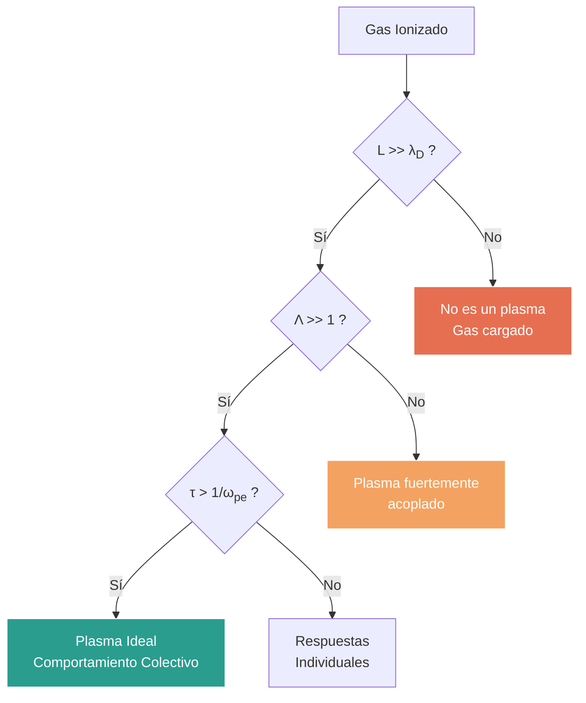

# Conceptos Básicos de Plasma

El plasma es a menudo considerado el cuarto estado de la materia, constituyendo más del 99% del universo visible. Se caracteriza por ser un gas cuasineutro de partículas cargadas y neutras que exhibe un comportamiento colectivo.

## 📜 Contexto Histórico

El término "plasma" fue acuñado por Irving Langmuir en 1928, inspirado en la forma en que el plasma sanguíneo transporta corpúsculos, ya que el plasma ionizado "transporta" electrones e iones. Su estudio se intensificó durante el desarrollo de tubos de vacío y más tarde, en la década de 1950, con la investigación en fusión termonuclear controlada.

## 🧮 Desarrollo Teórico Profundo

El plasma es un sistema estadístico complejo donde las interacciones coulombianas de largo alcance dominan sobre las colisiones binarias a corto alcance. Para formalizar el comportamiento colectivo, debemos derivar las escalas espaciales y temporales características desde primeros principios, apoyándonos en la mecánica estadística y la teoría cinética.

### 1. Apantallamiento de Debye: Derivación Rigurosa

Consideremos un plasma en equilibrio termodinámico a temperatura $T$. Introducimos una carga de prueba puntual $+q$ en el origen $\mathbf{r} = 0$. Esta carga perturba el plasma, generando un potencial electrostático $\phi(\mathbf{r})$ que buscamos determinar.

La ecuación de Poisson relaciona el potencial $\phi(\mathbf{r})$ con la densidad de carga total $\rho(\mathbf{r})$:

$$
\nabla^2 \phi(\mathbf{r}) = -\frac{\rho(\mathbf{r})}{\epsilon_0}
$$

La densidad de carga total incluye la carga de prueba y las densidades perturbadas de iones ($n_i$) y electrones ($n_e$):

$$
\rho(\mathbf{r}) = q \delta(\mathbf{r}) + e [Z n_i(\mathbf{r}) - n_e(\mathbf{r})]
$$

donde $Z$ es el estado de carga de los iones. En ausencia de la carga de prueba, el plasma es cuasineutro: $Z n_{i0} = n_{e0} \equiv n_0$.

Asumimos que el plasma obedece la estadística de Maxwell-Boltzmann. Las densidades de partículas en presencia del potencial $\phi(\mathbf{r})$ están dadas por:

$$
n_e(\mathbf{r}) = n_{e0} \exp\left( \frac{e \phi(\mathbf{r})}{k_B T_e} \right)
$$

$$
n_i(\mathbf{r}) = n_{i0} \exp\left( -\frac{Z e \phi(\mathbf{r})}{k_B T_i} \right)
$$

Sustituyendo estas densidades en la ecuación de Poisson obtenemos la **Ecuación de Poisson-Boltzmann**:

$$
\nabla^2 \phi(\mathbf{r}) = -\frac{q}{\epsilon_0} \delta(\mathbf{r}) - \frac{e}{\epsilon_0} \left[ Z n_{i0} \exp\left( -\frac{Z e \phi}{k_B T_i} \right) - n_{e0} \exp\left( \frac{e \phi}{k_B T_e} \right) \right]
$$

Esta ecuación es fuertemente no lineal. Procedemos linealizando la ecuación, asumiendo que la energía potencial electrostática es mucho menor que la energía térmica: $|e \phi| \ll k_B T$. Desarrollamos las exponenciales en serie de Taylor ($e^x \approx 1 + x$):

$$
\exp\left( \frac{e \phi}{k_B T_e} \right) \approx 1 + \frac{e \phi}{k_B T_e}
$$

$$
\exp\left( -\frac{Z e \phi}{k_B T_i} \right) \approx 1 - \frac{Z e \phi}{k_B T_i}
$$

Sustituyendo las expansiones linealizadas en el término de densidad de carga:

$$
\rho_{plasma} = e \left[ Z n_{i0} \left( 1 - \frac{Z e \phi}{k_B T_i} \right) - n_{e0} \left( 1 + \frac{e \phi}{k_B T_e} \right) \right]
$$

Usando la condición de cuasineutralidad $Z n_{i0} = n_{e0} = n_0$, los términos constantes se cancelan:

$$
\rho_{plasma} = -n_0 e^2 \left( \frac{Z}{k_B T_i} + \frac{1}{k_B T_e} \right) \phi(\mathbf{r})
$$

La ecuación de Poisson linealizada se convierte en la ecuación diferencial de Helmholtz modificada:

$$
\nabla^2 \phi - \frac{1}{\lambda_D^2} \phi = -\frac{q}{\epsilon_0} \delta(\mathbf{r})
$$

donde hemos definido la **Longitud de Debye efectiva** $\lambda_D$ mediante:

$$
\frac{1}{\lambda_D^2} = \frac{n_0 e^2}{\epsilon_0 k_B T_e} + \frac{Z n_0 e^2}{\epsilon_0 k_B T_i} = \frac{1}{\lambda_{De}^2} + \frac{1}{\lambda_{Di}^2}
$$

En muchos plasmas de laboratorio, los electrones son mucho más calientes que los iones ($T_e \gg T_i$) o los iones son demasiado pesados para responder en la escala temporal de interés, por lo que a menudo se usa la longitud de Debye electrónica:

$$
\lambda_D \approx \lambda_{De} = \sqrt{\frac{\epsilon_0 k_B T_e}{n_e e^2}}
$$

Para resolver la ecuación, debido a la simetría esférica, escribimos el laplaciano en coordenadas esféricas:

$$
\frac{1}{r^2} \frac{\partial}{\partial r} \left( r^2 \frac{\partial \phi}{\partial r} \right) - \frac{1}{\lambda_D^2} \phi = 0 \quad (\text{para } r \neq 0)
$$

Haciendo el cambio de variable $u(r) = r \phi(r)$, la ecuación se simplifica a:

$$
\frac{d^2 u}{dr^2} - \frac{1}{\lambda_D^2} u = 0
$$

Las soluciones son de la forma $u(r) = A e^{-r/\lambda_D} + B e^{r/\lambda_D}$. Como el potencial debe anularse en el infinito ($r \to \infty$), establecemos $B = 0$. Por lo tanto, $\phi(r) = \frac{A}{r} e^{-r/\lambda_D}$. Para determinar $A$, observamos que cuando $r \to 0$, el potencial debe coincidir con el potencial de Coulomb de la carga de prueba desnuda: $\phi(r \to 0) = \frac{q}{4\pi\epsilon_0 r}$. Esto fija $A = \frac{q}{4\pi\epsilon_0}$.

La solución completa es el **Potencial de Debye-Hückel (o Yukawa)**:

$$
\phi(r) = \frac{q}{4\pi\epsilon_0 r} \exp\left(-\frac{r}{\lambda_D}\right)
$$

Esta demostración muestra formalmente que el campo de cualquier carga se apantalla exponencialmente a distancias del orden de $\lambda_D$, justificando la cuasineutralidad en escalas $L \gg \lambda_D$.

### 2. Oscilaciones del Plasma: Derivación Fluida

Para entender la respuesta dinámica más rápida del plasma, consideraremos a los electrones como un fluido frío (movimiento térmico despreciable frente a oscilaciones colectivas) en un fondo estático de iones positivos. Las ecuaciones gobernantes en 1D son:

**Ecuación de continuidad:**

$$
\frac{\partial n_e}{\partial t} + \frac{\partial}{\partial x}(n_e v_e) = 0
$$

**Ecuación de momento (Navier-Stokes sin presión):**

$$
m_e \left( \frac{\partial v_e}{\partial t} + v_e \frac{\partial v_e}{\partial x} \right) = -e E
$$

**Ecuación de Poisson:**

$$
\frac{\partial E}{\partial x} = \frac{e(n_0 - n_e)}{\epsilon_0}
$$

Realizamos un **Análisis de Perturbaciones Lineales**. Expresamos las cantidades como una componente estática de equilibrio más una pequeña perturbación:
- $n_e(x,t) = n_0 + n_1(x,t)$
- $v_e(x,t) = 0 + v_1(x,t)$
- $E(x,t) = 0 + E_1(x,t)$

Sustituyendo en el sistema fluido y despreciando los términos de segundo orden ($n_1 v_1 \approx 0$, $v_1 \partial v_1/\partial x \approx 0$):

1. **Continuidad linealizada:**

$$
\frac{\partial n_1}{\partial t} + n_0 \frac{\partial v_1}{\partial x} = 0
$$

2. **Momento linealizado:**

$$
m_e \frac{\partial v_1}{\partial t} = -e E_1
$$

3. **Poisson linealizada:**

$$
\frac{\partial E_1}{\partial x} = -\frac{e n_1}{\epsilon_0}
$$

Para derivar la ecuación de onda, tomamos la derivada temporal de la ecuación de continuidad:

$$
\frac{\partial^2 n_1}{\partial t^2} + n_0 \frac{\partial}{\partial x} \left( \frac{\partial v_1}{\partial t} \right) = 0
$$

Sustituimos $\frac{\partial v_1}{\partial t}$ de la ecuación de momento:

$$
\frac{\partial^2 n_1}{\partial t^2} + n_0 \frac{\partial}{\partial x} \left( -\frac{e E_1}{m_e} \right) = 0
$$

$$
\frac{\partial^2 n_1}{\partial t^2} - \frac{n_0 e}{m_e} \frac{\partial E_1}{\partial x} = 0
$$

Finalmente, usamos la ecuación de Poisson para reemplazar $\frac{\partial E_1}{\partial x}$:

$$
\frac{\partial^2 n_1}{\partial t^2} - \frac{n_0 e}{m_e} \left( -\frac{e n_1}{\epsilon_0} \right) = 0
$$

$$
\frac{\partial^2 n_1}{\partial t^2} + \left( \frac{n_0 e^2}{m_e \epsilon_0} \right) n_1 = 0
$$

Esta es la ecuación diferencial de un oscilador armónico simple. La frecuencia natural de esta oscilación es la **Frecuencia de Plasma Electrónica**:

$$
\omega_{pe} = \sqrt{\frac{n_0 e^2}{m_e \epsilon_0}}
$$

### Diagrama de Regímenes del Plasma



### 3. Parámetro de Plasma y Acoplamiento

El parámetro de plasma $\Lambda$ define el número de partículas en una esfera de Debye. Si asumimos la esfera de radio $\lambda_D$:

$$
N_D = \frac{4\pi}{3} n_0 \lambda_D^3
$$

Para que el modelo estadístico continuo tenga sentido y para que el apantallamiento colectivo sea el efecto dominante por encima de las interacciones estocásticas partícula-partícula (colisiones), necesitamos $N_D \gg 1$. 

El parámetro de acoplamiento $\Gamma$ relaciona la energía potencial de Coulomb media entre vecinos más cercanos (distancia $a \approx n^{-1/3}$) y la energía térmica:

$$
\Gamma = \frac{e^2}{4\pi\epsilon_0 a k_B T}
$$

Se puede demostrar fácilmente que $\Gamma \propto \Lambda^{-2/3}$. Por lo tanto, la condición de plasma ideal $\Lambda \gg 1$ es equivalente a la condición de plasma débilmente acoplado $\Gamma \ll 1$.

## 🛠 Ejemplo Práctico

**Problema:** Un plasma de fusión en un reactor tipo Tokamak tiene una densidad iónica y electrónica de $n = 10^{20} \, \text{m}^{-3}$ y una temperatura térmica de $T = 10 \, \text{keV}$ ($1.16 \times 10^8 \, \text{K}$). Calcule la longitud de Debye, la frecuencia de oscilación del plasma y demuestre matemáticamente que satisface las condiciones para ser un plasma ideal ($\Lambda \gg 1$).

**Solución paso a paso:**

1. **Datos:**
   - $n_e = n = 10^{20} \, \text{m}^{-3}$
   - $T_e = 10 \, \text{keV}$
   - Recordemos que $1 \, \text{eV} = 1.16 \times 10^4 \, \text{K}$, así $k_B T_e = 10 \times 10^3 \, \text{eV}$.
   - Para facilitar, usamos la fórmula práctica: $\lambda_D \approx 7430 \sqrt{T_e [\text{eV}] / n_e [\text{m}^{-3}]}$ metros.

2. **Cálculo de la Longitud de Debye ($\lambda_D$):**

   

$$
\lambda_D = 7430 \sqrt{\frac{10000}{10^{20}}} = 7430 \sqrt{10^{-16}} = 7430 \times 10^{-8} = 7.43 \times 10^{-5} \, \text{m} = 74.3 \, \mu\text{m}
$$

   *(Para las dimensiones típicas de un Tokamak, $L \sim 2 \, \text{m}$, es claro que $L \gg \lambda_D$)*

3. **Cálculo de la Frecuencia de Plasma ($\omega_{pe}$):**
   Fórmula práctica: $f_{pe} \approx 8.98 \sqrt{n_e}$ Hz.

   

$$
f_{pe} = 8.98 \sqrt{10^{20}} = 8.98 \times 10^{10} \, \text{Hz} = 89.8 \, \text{GHz}
$$

   

$$
\omega_{pe} = 2\pi f_{pe} = 5.64 \times 10^{11} \, \text{rad/s}
$$

4. **Verificación del Parámetro de Plasma ($\Lambda$):**

   

$$
\Lambda = N_D = \frac{4\pi}{3} n_e \lambda_D^3
$$

   

$$
\Lambda = \frac{4\pi}{3} (10^{20}) (7.43 \times 10^{-5})^3 = 4.19 \times 10^{20} \times (4.1 \times 10^{-13}) \approx 1.72 \times 10^8
$$

   
**Conclusión:** Dado que $\Lambda \approx 1.7 \times 10^8 \gg 1$, el plasma del Tokamak está extremadamente bien descrito por la teoría de plasmas ideales. Las colisiones binarias de corto alcance son poco frecuentes frente a las interacciones colectivas.

## 📝 Guía de Ejercicios Resueltos

### Problema 1: Apantallamiento de Debye en Plasma Multicomponente
Considere un plasma no colisional compuesto por electrones (densidad $n_e$, temperatura $T_e$) y dos especies de iones (densidades $n_1, n_2$, cargas $Z_1 e, Z_2 e$, y temperaturas $T_1, T_2$). Derive la longitud de Debye efectiva $\lambda_D$.

**Solución paso a paso:**
Usando la ecuación de Poisson linealizada para pequeños potenciales $|e\phi| \ll k_B T$:

$$
\nabla^2 \phi = -\frac{e}{\epsilon_0} (Z_1 n_1 + Z_2 n_2 - n_e)
$$

Asumiendo distribuciones de Boltzmann para cada especie en equilibrio termodinámico local:

$$
n_j(\phi) \approx n_{j0} \left( 1 - \frac{q_j \phi}{k_B T_j} \right)
$$

Sustituyendo en la ecuación de Poisson y usando la condición de cuasineutralidad macroscópica $Z_1 n_{10} + Z_2 n_{20} = n_{e0}$:

$$
\nabla^2 \phi = \frac{e^2}{\epsilon_0} \left( \frac{n_{e0}}{k_B T_e} + \frac{Z_1^2 n_{10}}{k_B T_1} + \frac{Z_2^2 n_{20}}{k_B T_2} \right) \phi \equiv \frac{1}{\lambda_D^2} \phi
$$

Por lo tanto, la longitud de Debye efectiva es:

$$
\lambda_D = \left( \frac{e^2 n_{e0}}{\epsilon_0 k_B T_e} + \frac{e^2 Z_1^2 n_{10}}{\epsilon_0 k_B T_1} + \frac{e^2 Z_2^2 n_{20}}{\epsilon_0 k_B T_2} \right)^{-1/2}
$$

### Problema 2: Frecuencia de Plasma Electrónica con Presión Térmica
Derive la relación de dispersión para ondas electrostáticas electrónicas considerando la presión térmica (ondas de Langmuir). Asuma propagación 1D y un proceso adiabático.

**Solución paso a paso:**
Ecuación de momento linealizada para el fluido electrónico:

$$
m_e n_0 \frac{\partial v_{e1}}{\partial t} = -e n_0 E_1 - \frac{\partial p_{e1}}{\partial x}
$$

Proceso adiabático en 1D (con índice adiabático $\gamma = 3$):

$$
p_{e1} = 3 k_B T_e n_{e1}
$$

Combinando con la ecuación de continuidad $\frac{\partial n_{e1}}{\partial t} + n_0 \frac{\partial v_{e1}}{\partial x} = 0$ y la Ley de Gauss $\frac{\partial E_1}{\partial x} = -\frac{e n_{e1}}{\epsilon_0}$, y asumiendo perturbaciones en forma de onda plana $\sim e^{i(kx - \omega t)}$:

$$
-i\omega v_{e1} = -\frac{e}{m_e} E_1 - \frac{3 k_B T_e}{m_e n_0} (ik n_{e1})
$$

Sustituyendo $v_{e1} = \frac{\omega}{k n_0} n_{e1}$ (de continuidad) y $E_1 = -\frac{i e}{\epsilon_0 k} n_{e1}$ (de Gauss):

$$
-i\omega \left( \frac{\omega}{k n_0} n_{e1} \right) = -\frac{e}{m_e} \left( -\frac{i e}{\epsilon_0 k} n_{e1} \right) - i k \frac{3 k_B T_e}{m_e n_0} n_{e1}
$$

Multiplicando por $i k n_0$:

$$
\omega^2 = \frac{n_0 e^2}{m_e \epsilon_0} + \frac{3 k_B T_e}{m_e} k^2 = \omega_{pe}^2 + 3 v_{th,e}^2 k^2
$$

Esta es la conocida relación de dispersión de Bohm-Gross para ondas de plasma.

### Problema 3: Parámetro de Acoplamiento y Régimen Ideal
Calcule el parámetro de acoplamiento $\Gamma$ para el centro del Sol, donde la temperatura es $T \approx 1.5 \times 10^7$ K y la densidad electrónica es $n_e \approx 6 \times 10^{31} \text{ m}^{-3}$. Determine si se comporta como un plasma ideal.

**Solución paso a paso:**
El parámetro de acoplamiento $\Gamma$ es la razón entre la energía potencial de Coulomb media entre partículas vecinas y la energía térmica:

$$
\Gamma = \frac{e^2}{4\pi\epsilon_0 a k_B T}
$$

Donde $a$ es el radio de Wigner-Seitz, dado por $a = \left( \frac{3}{4\pi n_e} \right)^{1/3}$.

$$
a = \left( \frac{3}{4\pi (6 \times 10^{31})} \right)^{1/3} \approx 1.58 \times 10^{-11} \text{ m}
$$

Calculamos $\Gamma$ sustituyendo los valores:

$$
\Gamma = \frac{(1.6 \times 10^{-19})^2}{4\pi (8.85 \times 10^{-12}) (1.58 \times 10^{-11}) (1.38 \times 10^{-23}) (1.5 \times 10^7)}
$$

$$
\Gamma \approx \frac{2.56 \times 10^{-38}}{3.63 \times 10^{-37}} \approx 0.07
$$

Dado que $\Gamma \ll 1$, el plasma en el centro del Sol, a pesar de su altísima densidad que lo hace un fluido denso, se comporta como un gas de plasma ideal (débilmente acoplado) debido a su extrema temperatura termonuclear.

## 💻 Simulaciones Computacionales

### Simulación: Oscilaciones de Plasma Electrónico

Este script modela un desplazamiento unidimensional inicial de un grupo de electrones en un fondo de iones fijos, demostrando oscilaciones armónicas a la frecuencia de plasma $\omega_{pe}$.

```python
import numpy as np
import matplotlib.pyplot as plt
from scipy.integrate import odeint

# Parámetros del plasma
n0 = 1e20       # Densidad (m^-3)
e = 1.602e-19   # Carga (C)
me = 9.109e-31  # Masa electrón (kg)
eps0 = 8.854e-12 # Permitividad (F/m)

omega_pe = np.sqrt(n0 * e**2 / (me * eps0))
T_osc = 2 * np.pi / omega_pe

def plasma_oscillation(y, t):
    x, v = y
    # Aceleración dv/dt = - (omega_pe^2) * x (fuerza restauradora)
    dxdt = v
    dvdt = -(omega_pe**2) * x
    return [dxdt, dvdt]

# Condiciones iniciales: pequeño desplazamiento x0, reposo v0=0
x0 = 1e-5 # 10 micras
y0 = [x0, 0.0]

# Simulamos durante 3 periodos
t = np.linspace(0, 3 * T_osc, 1000)
sol = odeint(plasma_oscillation, y0, t)

plt.figure(figsize=(10, 6))
plt.plot(t / T_osc, sol[:, 0] * 1e6, 'b-', linewidth=2)
plt.title('Oscilaciones de Plasma Electrónicas (Fluido Frío 1D)')
plt.xlabel('Tiempo (Periodos $T_{pe}$)')
plt.ylabel('Desplazamiento $x$ ($\mu$m)')
plt.grid(True)
plt.show()
```

## 🚀 Fronteras de Investigación y Problemas Abiertos

La definición fundamental de un plasma sigue aplicándose, pero los regímenes extremos empujan las fronteras de la termodinámica estadística y la física cuántica.
- **Plasmas Cuánticos y de Alta Densidad (WDM - Warm Dense Matter):** Estados de la materia encontrados en los núcleos de planetas gigantes o cápsulas de fusión inercial, donde la energía de interacción de Coulomb es mayor que la energía cinética (fuerte acoplamiento $\Gamma > 1$) y los efectos de degeneración de Fermi-Dirac son dominantes.
- **Plasmas de Alta Intensidad y Aceleradores Láser (LWFA):** El uso de láseres ultraintensos (petavatios) focalizados en plasmas que crean ondas de estela (wakefields) capaces de acelerar electrones a varios GeV en distancias de milímetros, sustituyendo a los aceleradores de partículas de kilómetros de longitud.
- **Plasmas Polvorientos (Dusty Plasmas) y Microgravedad:** Plasmas que contienen micropartículas cargadas masivas, que exhiben cristalización (cristales de plasma) y dinámicas que modelan procesos fundamentales a nivel macroscópico.

## 📐 Formalismo Matemático Avanzado (Nivel Posgrado/Doctorado)

El tratamiento riguroso de la dinámica estocástica de $10^{23}$ partículas en interacción de largo alcance se desvía del modelo fluido ideal.

**Teoría Cinética Estocástica y Ecuación de Klimontovich:**
A nivel fundamental, la micro-densidad de distribución exacta de $N$ partículas en el espacio de fases se escribe como $F(\mathbf{r}, \mathbf{p}, t) = \sum_{i=1}^N \delta(\mathbf{r} - \mathbf{r}_i(t)) \delta(\mathbf{p} - \mathbf{p}_i(t))$. La evolución exacta está dada por la ecuación de Klimontovich estocástica. 
Promediando sobre ensambles estadísticos ($f = \langle F \rangle$), se obtiene la jerarquía BBGKY. Al romper el término de correlación de 2 cuerpos $g_{12}$, se deriva la ecuación de Balescu-Lenard, que es una ecuación generalizada de Fokker-Planck para plasmas considerando un dieléctrico de apantallamiento dinámico:

$$
\frac{\partial f_a}{\partial t} = \sum_b \frac{\partial}{\partial \mathbf{p}} \cdot \int d^3p' \, \mathbb{Q}_{ab}(\mathbf{p}, \mathbf{p}') \cdot \left( \frac{\partial f_a}{\partial \mathbf{p}} f_b(\mathbf{p}') - \frac{\partial f_b}{\partial \mathbf{p}'} f_a(\mathbf{p}) \right)
$$

donde el tensor de colisión $\mathbb{Q}_{ab}$ incorpora la constante dieléctrica longitudinal del plasma $\epsilon(\mathbf{k}, \mathbf{k}\cdot\mathbf{v})$, lo que resuelve matemáticamente la divergencia de colisiones de largo alcance característica del límite de Coulomb en los plasmas ideales.

## 📚 Recursos Específicos

### Cursos Online y Material Académico
1. **[MIT OCW: 22.611J Introduction to Plasma Physics I](https://ocw.mit.edu/courses/22-611j-introduction-to-plasma-physics-i-fall-2003/)**
   Excelente introducción teórica desde las órbitas de partículas individuales hasta modelos fluidos.
2. **[EPFL: Plasma Physics and Applications](https://www.edx.org/course/plasma-physics-and-applications)**
   Curso completo que abarca ondas de plasma, apantallamiento de Debye y aplicaciones en reactores Tokamak.

### Artículos Científicos Clave y su Análisis Teórico

1. **"Oscillations in Ionized Gases"** - *I. Langmuir (1928), Proc. Natl. Acad. Sci. 14, 627*  
   [Link al artículo original (PNAS)](https://www.pnas.org/doi/10.1073/pnas.14.8.627)
   
   **Importancia Teórica y Relevancia:** 
   En este texto fundacional, Langmuir bautizó por primera vez al gas ionizado como "plasma" (por su similitud con el plasma sanguíneo transportando corpúsculos) e identificó matemáticamente el modo de oscilación colectiva de alta frecuencia de los electrones.
   
   **Contexto Matemático:** 
   Langmuir observó perturbaciones que no podían explicarse por colisiones binarias. Al derivar la fuerza restauradora electrostática creada por un desplazamiento macroscópico local de electrones respecto a un fondo de iones (fuerza de Poisson), descubrió un movimiento armónico simple. La frecuencia natural encontrada es la ahora célebre frecuencia de plasma electrónica:

   

$$
\omega_{pe} = \sqrt{ \frac{n_e e^2}{m_e \epsilon_0} }
$$

   Este parámetro define la escala de tiempo fundamental ($\tau_p \sim \omega_{pe}^{-1}$) en la cual el plasma responde para apantallar perturbaciones eléctricas y restaurar la cuasineutralidad, actuando como la frontera teórica que separa el comportamiento de un gas neutro del de un plasma colectivo.

2. **"On the Vibrations of the Electronic Plasma"** - *L. D. Landau (1946), Journal of Physics USSR 10, 25*  
   [Link a revisión moderna e historia (Physics Today)](https://physicstoday.scitation.org/doi/10.1063/PT.3.4341)
   
   **Importancia Teórica y Relevancia:** 
   Proporcionó la primera solución analítica rigurosa de la ecuación de Vlasov (modelo cinético sin colisiones), descubriendo el fenómeno contraintuitivo del "Amortiguamiento de Landau". Demostró que las ondas electrostáticas en un plasma pueden amortiguarse exponencialmente en el tiempo sin disipación térmica (sin entropía colisional).
   
   **Contexto Matemático:** 
   Usando métodos de integración en el plano complejo, Landau sorteó la singularidad $v = \omega/k$ de la ecuación de Vlasov linealizada usando el famoso Contorno de Landau. La respuesta dieléctrica longitudinal revela un decaimiento con una tasa de amortiguamiento $\gamma$:

   

$$
\gamma \approx -\omega_{pe} \sqrt{\frac{\pi}{8}} \frac{1}{(k \lambda_D)^3} \exp\left( -\frac{1}{2(k \lambda_D)^2} - \frac{3}{2} \right)
$$

   Físicamente, esto implica un intercambio de energía onda-partícula sin fricción. Las partículas resonantes que viajan ligeramente más lento que la onda (con velocidad $v \lesssim v_{phase}$) absorben energía, 'surfeando' el gradiente de potencial de la onda y amortiguando la amplitud macroscópica del campo eléctrico.

### 📖 Referencias Útiles y Bibliografía
- Chen, F. F. (1984). *Introduction to Plasma Physics and Controlled Fusion*. Springer.
- Bittencourt, J. A. (2004). *Fundamentals of Plasma Physics*. Springer.
- Bellan, P. M. (2006). *Fundamentals of Plasma Physics*. Cambridge University Press.

## 🌐 Seminarios Avanzados y Literatura de Frontera

### Seminarios y Cursos
- [Princeton Plasma Physics Laboratory (PPPL) Seminars](https://www.pppl.gov/events)
- [MIT Plasma Science and Fusion Center](https://www.psfc.mit.edu/events)
- [ITER News & Seminars](https://www.iter.org/news)

### Literatura de Frontera
- [Nuclear Fusion (IAEA)](https://iopscience.iop.org/journal/0029-5515): La revista de referencia para los avances globales en el diseño y física de reactores de fusión.
- [Physics of Plasmas (AIP)](https://aip.scitation.org/journal/php): Cubre descubrimientos fundamentales en plasmas espaciales, de laboratorio y astrofísicos.
- [Nature Physics - Plasma Physics](https://www.nature.com/subjects/plasma-physics): Destaca los artículos de mayor impacto relacionados con el confinamiento y las inestabilidades magnéticas.
