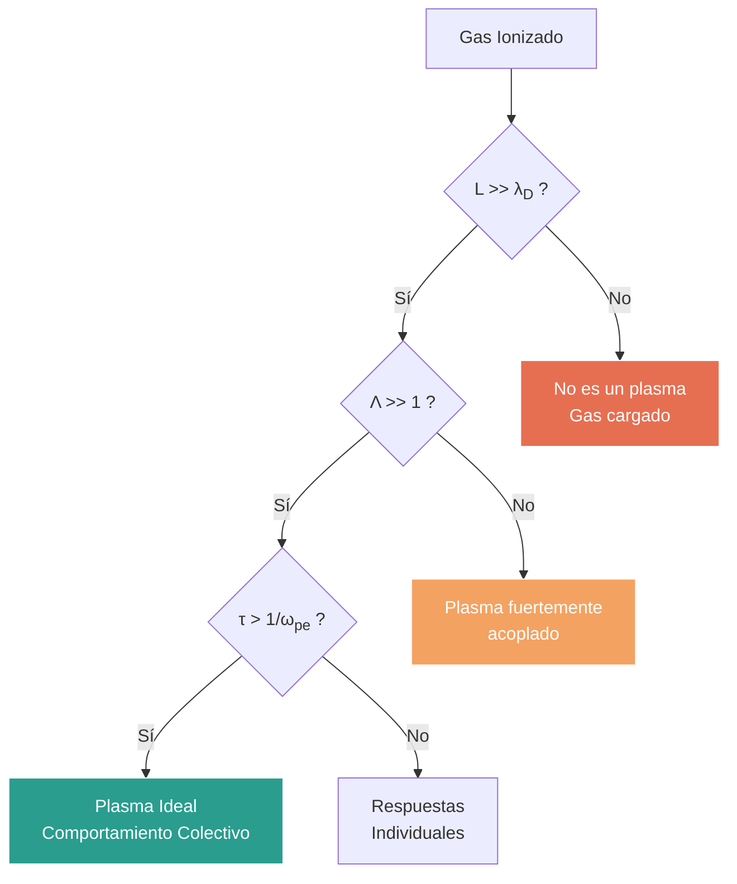

# Conceptos Básicos de Plasma

El plasma es a menudo considerado el cuarto estado de la materia, constituyendo más del 99% del universo visible. Se caracteriza por ser un gas cuasineutro de partículas cargadas y neutras que exhibe un comportamiento colectivo.

## 📜 Contexto Histórico

El término "plasma" fue acuñado por Irving Langmuir en 1928, inspirado en la forma en que el plasma sanguíneo transporta corpúsculos, ya que el plasma ionizado "transporta" electrones e iones. Su estudio se intensificó durante el desarrollo de tubos de vacío y más tarde, en la década de 1950, con la investigación en fusión termonuclear controlada.

## 🧮 Desarrollo Teórico Profundo

El plasma es un sistema estadístico complejo donde las interacciones coulombianas de largo alcance dominan sobre las colisiones binarias a corto alcance. Para formalizar el comportamiento colectivo, debemos derivar las escalas espaciales y temporales características desde primeros principios, apoyándonos en la mecánica estadística y la teoría cinética.

### 1. Apantallamiento de Debye: Derivación Rigurosa

Consideremos un plasma en equilibrio termodinámico a temperatura $T$. Introducimos una carga de prueba puntual $+q$ en el origen $\mathbf{r} = 0$. Esta carga perturba el plasma, generando un potencial electrostático $\phi(\mathbf{r})$ que buscamos determinar.

La ecuación de Poisson relaciona el potencial $\phi(\mathbf{r})$ con la densidad de carga total $\rho(\mathbf{r})$:

$$ \nabla^2 \phi(\mathbf{r}) = -\frac{\rho(\mathbf{r})}{\epsilon_0} $$

La densidad de carga total incluye la carga de prueba y las densidades perturbadas de iones ($n_i$) y electrones ($n_e$):

$$ \rho(\mathbf{r}) = q \delta(\mathbf{r}) + e [Z n_i(\mathbf{r}) - n_e(\mathbf{r})] $$

donde $Z$ es el estado de carga de los iones. En ausencia de la carga de prueba, el plasma es cuasineutro: $Z n_{i0} = n_{e0} \equiv n_0$.

Asumimos que el plasma obedece la estadística de Maxwell-Boltzmann. Las densidades de partículas en presencia del potencial $\phi(\mathbf{r})$ están dadas por:

$$ n_e(\mathbf{r}) = n_{e0} \exp\left( \frac{e \phi(\mathbf{r})}{k_B T_e} \right) $$
$$ n_i(\mathbf{r}) = n_{i0} \exp\left( -\frac{Z e \phi(\mathbf{r})}{k_B T_i} \right) $$

Sustituyendo estas densidades en la ecuación de Poisson obtenemos la **Ecuación de Poisson-Boltzmann**:

$$ \nabla^2 \phi(\mathbf{r}) = -\frac{q}{\epsilon_0} \delta(\mathbf{r}) - \frac{e}{\epsilon_0} \left[ Z n_{i0} \exp\left( -\frac{Z e \phi}{k_B T_i} \right) - n_{e0} \exp\left( \frac{e \phi}{k_B T_e} \right) \right] $$

Esta ecuación es fuertemente no lineal. Procedemos linealizando la ecuación, asumiendo que la energía potencial electrostática es mucho menor que la energía térmica: $|e \phi| \ll k_B T$. Desarrollamos las exponenciales en serie de Taylor ($e^x \approx 1 + x$):

$$ \exp\left( \frac{e \phi}{k_B T_e} \right) \approx 1 + \frac{e \phi}{k_B T_e} $$
$$ \exp\left( -\frac{Z e \phi}{k_B T_i} \right) \approx 1 - \frac{Z e \phi}{k_B T_i} $$

Sustituyendo las expansiones linealizadas en el término de densidad de carga:

$$ \rho_{plasma} = e \left[ Z n_{i0} \left( 1 - \frac{Z e \phi}{k_B T_i} \right) - n_{e0} \left( 1 + \frac{e \phi}{k_B T_e} \right) \right] $$

Usando la condición de cuasineutralidad $Z n_{i0} = n_{e0} = n_0$, los términos constantes se cancelan:

$$ \rho_{plasma} = -n_0 e^2 \left( \frac{Z}{k_B T_i} + \frac{1}{k_B T_e} \right) \phi(\mathbf{r}) $$

La ecuación de Poisson linealizada se convierte en la ecuación diferencial de Helmholtz modificada:

$$ \nabla^2 \phi - \frac{1}{\lambda_D^2} \phi = -\frac{q}{\epsilon_0} \delta(\mathbf{r}) $$

donde hemos definido la **Longitud de Debye efectiva** $\lambda_D$ mediante:

$$ \frac{1}{\lambda_D^2} = \frac{n_0 e^2}{\epsilon_0 k_B T_e} + \frac{Z n_0 e^2}{\epsilon_0 k_B T_i} = \frac{1}{\lambda_{De}^2} + \frac{1}{\lambda_{Di}^2} $$

En muchos plasmas de laboratorio, los electrones son mucho más calientes que los iones ($T_e \gg T_i$) o los iones son demasiado pesados para responder en la escala temporal de interés, por lo que a menudo se usa la longitud de Debye electrónica:

$$ \lambda_D \approx \lambda_{De} = \sqrt{\frac{\epsilon_0 k_B T_e}{n_e e^2}} $$

Para resolver la ecuación, debido a la simetría esférica, escribimos el laplaciano en coordenadas esféricas:

$$ \frac{1}{r^2} \frac{\partial}{\partial r} \left( r^2 \frac{\partial \phi}{\partial r} \right) - \frac{1}{\lambda_D^2} \phi = 0 \quad (\text{para } r \neq 0) $$

Haciendo el cambio de variable $u(r) = r \phi(r)$, la ecuación se simplifica a:

$$ \frac{d^2 u}{dr^2} - \frac{1}{\lambda_D^2} u = 0 $$

Las soluciones son de la forma $u(r) = A e^{-r/\lambda_D} + B e^{r/\lambda_D}$. Como el potencial debe anularse en el infinito ($r \to \infty$), establecemos $B = 0$. Por lo tanto, $\phi(r) = \frac{A}{r} e^{-r/\lambda_D}$. Para determinar $A$, observamos que cuando $r \to 0$, el potencial debe coincidir con el potencial de Coulomb de la carga de prueba desnuda: $\phi(r \to 0) = \frac{q}{4\pi\epsilon_0 r}$. Esto fija $A = \frac{q}{4\pi\epsilon_0}$.

La solución completa es el **Potencial de Debye-Hückel (o Yukawa)**:

$$ \phi(r) = \frac{q}{4\pi\epsilon_0 r} \exp\left(-\frac{r}{\lambda_D}\right) $$

Esta demostración muestra formalmente que el campo de cualquier carga se apantalla exponencialmente a distancias del orden de $\lambda_D$, justificando la cuasineutralidad en escalas $L \gg \lambda_D$.

### 2. Oscilaciones del Plasma: Derivación Fluida

Para entender la respuesta dinámica más rápida del plasma, consideraremos a los electrones como un fluido frío (movimiento térmico despreciable frente a oscilaciones colectivas) en un fondo estático de iones positivos. Las ecuaciones gobernantes en 1D son:

**Ecuación de continuidad:**
$$ \frac{\partial n_e}{\partial t} + \frac{\partial}{\partial x}(n_e v_e) = 0 $$

**Ecuación de momento (Navier-Stokes sin presión):**
$$ m_e \left( \frac{\partial v_e}{\partial t} + v_e \frac{\partial v_e}{\partial x} \right) = -e E $$

**Ecuación de Poisson:**
$$ \frac{\partial E}{\partial x} = \frac{e(n_0 - n_e)}{\epsilon_0} $$

Realizamos un **Análisis de Perturbaciones Lineales**. Expresamos las cantidades como una componente estática de equilibrio más una pequeña perturbación:
- $n_e(x,t) = n_0 + n_1(x,t)$
- $v_e(x,t) = 0 + v_1(x,t)$
- $E(x,t) = 0 + E_1(x,t)$

Sustituyendo en el sistema fluido y despreciando los términos de segundo orden ($n_1 v_1 \approx 0$, $v_1 \partial v_1/\partial x \approx 0$):

1. **Continuidad linealizada:**
$$ \frac{\partial n_1}{\partial t} + n_0 \frac{\partial v_1}{\partial x} = 0 $$

2. **Momento linealizado:**
$$ m_e \frac{\partial v_1}{\partial t} = -e E_1 $$

3. **Poisson linealizada:**
$$ \frac{\partial E_1}{\partial x} = -\frac{e n_1}{\epsilon_0} $$

Para derivar la ecuación de onda, tomamos la derivada temporal de la ecuación de continuidad:

$$ \frac{\partial^2 n_1}{\partial t^2} + n_0 \frac{\partial}{\partial x} \left( \frac{\partial v_1}{\partial t} \right) = 0 $$

Sustituimos $\frac{\partial v_1}{\partial t}$ de la ecuación de momento:

$$ \frac{\partial^2 n_1}{\partial t^2} + n_0 \frac{\partial}{\partial x} \left( -\frac{e E_1}{m_e} \right) = 0 $$

$$ \frac{\partial^2 n_1}{\partial t^2} - \frac{n_0 e}{m_e} \frac{\partial E_1}{\partial x} = 0 $$

Finalmente, usamos la ecuación de Poisson para reemplazar $\frac{\partial E_1}{\partial x}$:

$$ \frac{\partial^2 n_1}{\partial t^2} - \frac{n_0 e}{m_e} \left( -\frac{e n_1}{\epsilon_0} \right) = 0 $$

$$ \frac{\partial^2 n_1}{\partial t^2} + \left( \frac{n_0 e^2}{m_e \epsilon_0} \right) n_1 = 0 $$

Esta es la ecuación diferencial de un oscilador armónico simple. La frecuencia natural de esta oscilación es la **Frecuencia de Plasma Electrónica**:

$$ \omega_{pe} = \sqrt{\frac{n_0 e^2}{m_e \epsilon_0}} $$

### Diagrama de Regímenes del Plasma

### 3. Parámetro de Plasma y Acoplamiento

El parámetro de plasma $\Lambda$ define el número de partículas en una esfera de Debye. Si asumimos la esfera de radio $\lambda_D$:

$$ N_D = \frac{4\pi}{3} n_0 \lambda_D^3 $$

Para que el modelo estadístico continuo tenga sentido y para que el apantallamiento colectivo sea el efecto dominante por encima de las interacciones estocásticas partícula-partícula (colisiones), necesitamos $N_D \gg 1$. 

El parámetro de acoplamiento $\Gamma$ relaciona la energía potencial de Coulomb media entre vecinos más cercanos (distancia $a \approx n^{-1/3}$) y la energía térmica:

$$ \Gamma = \frac{e^2}{4\pi\epsilon_0 a k_B T} $$

Se puede demostrar fácilmente que $\Gamma \propto \Lambda^{-2/3}$. Por lo tanto, la condición de plasma ideal $\Lambda \gg 1$ es equivalente a la condición de plasma débilmente acoplado $\Gamma \ll 1$.

## 🛠 Ejemplo Práctico

**Problema:** Un plasma de fusión en un reactor tipo Tokamak tiene una densidad iónica y electrónica de $n = 10^{20} \, \text{m}^{-3}$ y una temperatura térmica de $T = 10 \, \text{keV}$ ($1.16 \times 10^8 \, \text{K}$). Calcule la longitud de Debye, la frecuencia de oscilación del plasma y demuestre matemáticamente que satisface las condiciones para ser un plasma ideal ($\Lambda \gg 1$).

**Solución paso a paso:**

1. **Datos:**
   - $n_e = n = 10^{20} \, \text{m}^{-3}$
   - $T_e = 10 \, \text{keV}$
   - Recordemos que $1 \, \text{eV} = 1.16 \times 10^4 \, \text{K}$, así $k_B T_e = 10 \times 10^3 \, \text{eV}$.
   - Para facilitar, usamos la fórmula práctica: $\lambda_D \approx 7430 \sqrt{T_e [\text{eV}] / n_e [\text{m}^{-3}]}$ metros.

2. **Cálculo de la Longitud de Debye ($\lambda_D$):**
   $$ \lambda_D = 7430 \sqrt{\frac{10000}{10^{20}}} = 7430 \sqrt{10^{-16}} = 7430 \times 10^{-8} = 7.43 \times 10^{-5} \, \text{m} = 74.3 \, \mu\text{m} $$
   *(Para las dimensiones típicas de un Tokamak, $L \sim 2 \, \text{m}$, es claro que $L \gg \lambda_D$)*

3. **Cálculo de la Frecuencia de Plasma ($\omega_{pe}$):**
   Fórmula práctica: $f_{pe} \approx 8.98 \sqrt{n_e}$ Hz.
   $$ f_{pe} = 8.98 \sqrt{10^{20}} = 8.98 \times 10^{10} \, \text{Hz} = 89.8 \, \text{GHz} $$
   $$ \omega_{pe} = 2\pi f_{pe} = 5.64 \times 10^{11} \, \text{rad/s} $$

4. **Verificación del Parámetro de Plasma ($\Lambda$):**
   $$ \Lambda = N_D = \frac{4\pi}{3} n_e \lambda_D^3 $$
   $$ \Lambda = \frac{4\pi}{3} (10^{20}) (7.43 \times 10^{-5})^3 = 4.19 \times 10^{20} \times (4.1 \times 10^{-13}) \approx 1.72 \times 10^8 $$
   
**Conclusión:** Dado que $\Lambda \approx 1.7 \times 10^8 \gg 1$, el plasma del Tokamak está extremadamente bien descrito por la teoría de plasmas ideales. Las colisiones binarias de corto alcance son poco frecuentes frente a las interacciones colectivas.

## 📚 Recursos Específicos

### Cursos Específicos
1. [Plasma Physics - Part 1 (MIT OCW)](https://ocw.mit.edu)
2. [Introduction to Plasmas (Coursera/Princeton)](https://www.coursera.org)
3. [Fundamentals of Plasmas - NPTEL](https://nptel.ac.in)
4. [Plasma Physics Fundamentals - EPFL](https://www.epfl.ch)
5. [Basic Plasma Phenomena - Summer School PPPL](https://www.pppl.gov)
6. [Introduction to High-Temperature Plasmas - UTokyo](https://www.u-tokyo.ac.jp)

### Artículos y Simulaciones
1. [Langmuir, I. (1928). *Oscillations in Ionized Gases*. Proc. Natl. Acad. Sci.](https://doi.org/10.1073/pnas.14.8.627)
2. [Tonks, L., & Langmuir, I. (1929). *A General Theory of the Plasma of an Arc*. Physical Review.](https://doi.org/10.1103/PhysRev.33.195)
3. [Vlasov, A. A. (1938). *On Vibration Properties of Electron Gas*. Soviet Physics.](https://doi.org/10.1070/PU1968v010n06ABEH003709)
4. [Landau, L. D. (1946). *On the Vibrations of the Electronic Plasma*. Journal of Physics.](https://doi.org/10.1007/978-1-4615-7792-7_11)
5. [Debye, P., & Hückel, E. (1923). *The theory of electrolytes*. Physikalische Zeitschrift.](https://gallica.bnf.fr/ark:/12148/bpt6k15367j)
6. [NRL Plasma Formulary](https://www.nrl.navy.mil/) - Fórmulas de Plasma Fundamentales.
7. [PhET Interactive Simulations - Charges and Fields](https://phet.colorado.edu/en/simulations/charges-and-fields) - Simulación.
8. [PlasmaPy](https://www.plasmapy.org/) - Paquete de Python para simulaciones básicas de plasmas.
9. [BOUT++ Framework](https://boutproject.github.io/) - Simulaciones fluidas 3D.

### 📖 Referencias Útiles y Bibliografía
1. [Chen, F. F. (1984). *Introduction to Plasma Physics and Controlled Fusion*. Springer.](https://link.springer.com/book/10.1007/978-3-319-22309-4)
2. [Bittencourt, J. A. (2004). *Fundamentals of Plasma Physics*. Springer.](https://link.springer.com/book/10.1007/978-1-4757-4030-1)
3. [Goldston, R. J., & Rutherford, P. H. (1995). *Introduction to Plasma Physics*. CRC Press.](https://www.routledge.com/Introduction-to-Plasma-Physics/Goldston-Rutherford/p/book/9780750301831)
4. [Inan, U. S., & Gołkowski, M. (2011). *Principles of Plasma Physics for Engineers and Scientists*. Cambridge University Press.](https://www.cambridge.org/core/books/principles-of-plasma-physics-for-engineers-and-scientists/8636E21B66D673DAA792E5B9423C3502)
