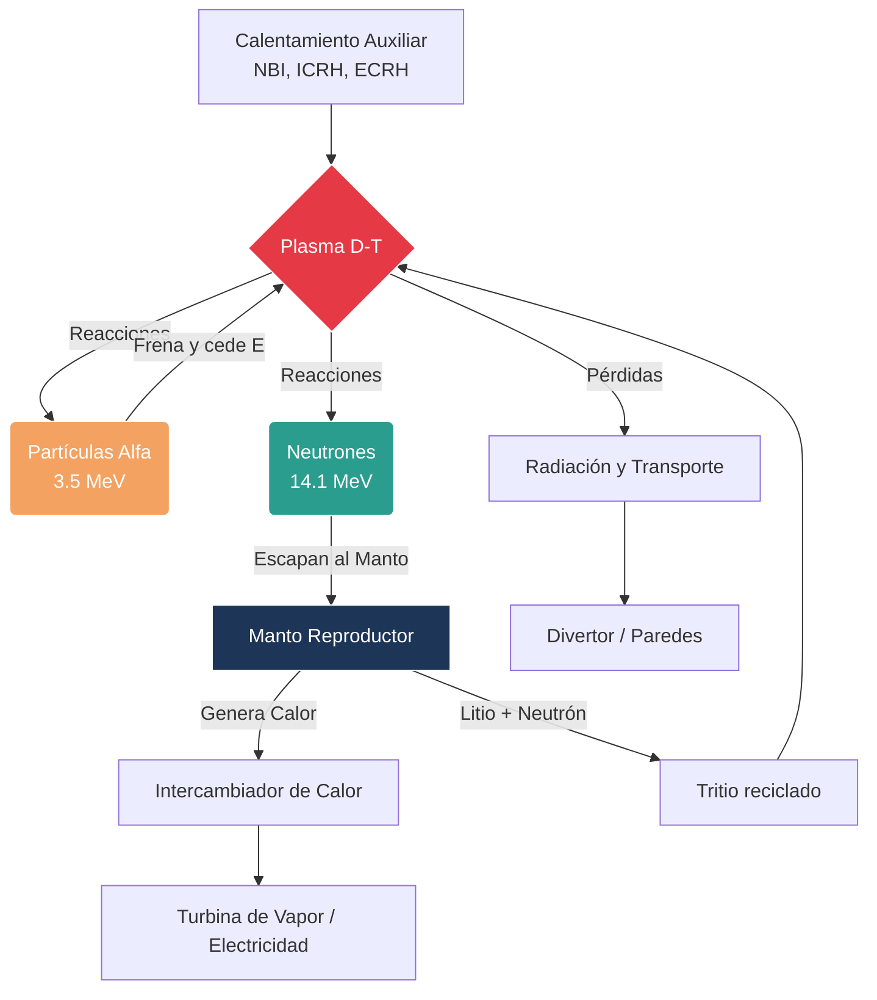

# Confinamiento y Fusión

La fusión busca unir núcleos ligeros para liberar energía, imitando procesos que ocurren en las estrellas. El problema físico central es mantener un plasma suficientemente denso, caliente y confinado durante el tiempo necesario para que las reacciones ocurran de forma eficiente.

## 🧮 Desarrollo Teórico Profundo

El confinamiento de plasmas busca atrapar un plasma incandescente contrarrestando la presión cinética y reduciendo el transporte de energía y partículas hacia las paredes del reactor. En reactores magnéticos (como el Tokamak y el Stellarator), esto se logra mediante fuerzas de Lorentz inducidas por campos magnéticos estructurados, mientras que en reactores inerciales se emplean láseres o haces de partículas para comprimir y calentar una microesfera de combustible.

### 1. Equilibrio Magnetohidrodinámico (MHD)

Para un plasma ideal en equilibrio estacionario bajo confinamiento magnético, la ecuación de momento de la magnetohidrodinámica establece que la presión térmica del plasma $\nabla p$ debe estar exactamente balanceada por la fuerza de Lorentz generada por las corrientes internas $\mathbf{J}$ y el campo magnético $\mathbf{B}$:

$$ \nabla p = \mathbf{J} \times \mathbf{B} $$

Multiplicando escalarmente esta ecuación por $\mathbf{B}$ y por $\mathbf{J}$, descubrimos dos propiedades fundamentales del equilibrio magnético toroidal:

$$ \mathbf{B} \cdot \nabla p = 0 $$
$$ \mathbf{J} \cdot \nabla p = 0 $$

Estas identidades demuestran que tanto las líneas de campo magnético como las líneas de corriente yacen enteramente sobre superficies de presión constante ($p = \text{cte}$). En configuraciones toroidales como el Tokamak, estas se denominan **superficies magnéticas**. Para evitar que el campo intercepte la pared, el plasma debe poseer una estructura topológica de toros anidados.

Sustituyendo la ley de Ampère estática $\mathbf{J} = \frac{1}{\mu_0} \nabla \times \mathbf{B}$ en la ecuación de equilibrio:

$$ \nabla p = \frac{1}{\mu_0} (\nabla \times \mathbf{B}) \times \mathbf{B} = -\nabla\left( \frac{B^2}{2\mu_0} \right) + \frac{(\mathbf{B} \cdot \nabla)\mathbf{B}}{\mu_0} $$

Si el campo magnético es rectilíneo, el término de tensión magnética $(\mathbf{B} \cdot \nabla)\mathbf{B}$ se anula. En tal caso, integrando espacialmente obtenemos el equilibrio de presión:

$$ p + \frac{B^2}{2\mu_0} = \text{constante} $$

Este resultado define a **$\beta$ (beta de plasma)**, una figura de mérito crucial para la viabilidad económica de un reactor, que representa la relación entre la presión del plasma y la presión del campo magnético confinante:

$$ \beta = \frac{p}{B^2 / (2\mu_0)} = \frac{2\mu_0 n k_B T}{B^2} $$

El límite empírico para la estabilidad en un Tokamak está dado por el límite de Troyon: $\beta_{max} \propto I_p / (a B_0)$, donde $I_p$ es la corriente del plasma y $a$ es el radio menor.

### 2. La Ecuación de Grad-Shafranov

Para una configuración toroidal axisimétrica (independiente del ángulo toroidal $\phi$), como la de un Tokamak, el campo magnético se descompone en sus componentes poloidal (generado por corrientes en el plasma) y toroidal (generado por bobinas externas). El flujo poloidal $\psi$ funciona como coordenada superficial. La ecuación de equilibrio $\nabla p = \mathbf{J} \times \mathbf{B}$ se reduce a la famosa **Ecuación de Grad-Shafranov**:

$$ R \frac{\partial}{\partial R} \left( \frac{1}{R} \frac{\partial \psi}{\partial R} \right) + \frac{\partial^2 \psi}{\partial Z^2} = -\mu_0 R^2 p'(\psi) - \mu_0^2 F(\psi) F'(\psi) $$

Donde:
- $(R, \phi, Z)$ son las coordenadas cilíndricas.
- $\psi(R, Z)$ es la función de flujo poloidal (superficies de $\psi$ constante = superficies magnéticas).
- $p(\psi)$ es la presión del plasma (constante en la superficie).
- $F(\psi) = R B_\phi$ está relacionado con la corriente poloidal interna.

Esta es una ecuación diferencial elíptica y altamente no lineal (ya que $p$ y $F$ dependen de $\psi$) que dicta toda la forma del plasma, su límite con el deflector magnético (divertor) y su estabilidad posicional. Las soluciones a la Ecuación de Grad-Shafranov permiten reconstruir los campos y densidades en reactores como ITER.

### 3. Factor de Seguridad y Estabilidad

El factor de seguridad $q$ en una superficie magnética describe el número de vueltas toroidales que completa una línea de campo por cada vuelta poloidal. Para una geometría toroidal de aproximación cilíndrica (radio mayor $R$, radio menor $r$):

$$ q(r) = \frac{r B_\phi}{R B_\theta} $$

El perfil de $q(r)$ es esencial. Si el perfil cruza un valor racional (ej. $q=1, 2, 3/2$), las líneas de campo se cierran sobre sí mismas, lo que excita inestabilidades destructivas MHD (modos *kink*, islas magnéticas o *tearing modes*). Mantener $q > 1$ en todo el plasma es el criterio de Kruskal-Shafranov para suprimir el modo kink ideal.

### Diagrama: Flujo de Energía en un Reactor de Fusión

### 4. Transporte y Pérdidas: Clásico vs Neoclásico

El tiempo de confinamiento de energía $\tau_E$ está determinado por la difusión de partículas y calor perpendicular al campo magnético.
El **Transporte Clásico** se basa en paseos aleatorios causados por colisiones de Coulomb. El paso del paseo aleatorio es el radio de Larmor (giroradio) $\rho_L = mv_\perp / (qB)$. El coeficiente de difusión clásico escala como:

$$ D_{cl} \approx \frac{\rho_L^2}{\tau_{col}} \propto \frac{1}{B^2} $$

Sin embargo, en una geometría toroidal, el campo magnético es más fuerte en la parte interna del toro ($B \propto 1/R$). Esta inhomogeneidad atrapa partículas en órbitas en forma de "plátano" (banana orbits). Las excursiones de estas partículas atrapadas no son $\rho_L$, sino el ancho de la órbita de banana, que es mucho mayor. Esto da lugar al **Transporte Neoclásico**, donde:

$$ D_{neo} \approx q^2 \left(\frac{R}{r}\right)^{3/2} D_{cl} $$

En la realidad, el transporte en Tokamaks suele ser **Anómalo**, dominado por turbulencia a pequeña escala impulsada por gradientes, que produce pérdidas entre 10 y 100 veces mayores que las predicciones neoclásicas.

## 🛠 Ejemplo Práctico

**Problema:** En el dispositivo de prueba JET (Joint European Torus), un plasma de Deuterio-Tritio está contenido por un campo toroidal $B_0 = 3.45 \, \text{T}$ a un radio mayor $R = 2.96 \, \text{m}$ y radio menor $a = 1.25 \, \text{m}$. La corriente de plasma medida es $I_p = 3.2 \, \text{MA}$. 
1. Estime el valor del campo poloidal en el borde $B_\theta(a)$ asumiendo sección transversal circular.
2. Calcule el factor de seguridad cilíndrico en el borde del plasma $q_a$.
3. Indique si el plasma cumple el límite de Kruskal-Shafranov contra inestabilidades kink a gran escala.

**Solución paso a paso:**

1. **Cálculo del campo poloidal en el borde ($B_\theta(a)$):**
   Utilizando la ley de Ampère en la superficie límite del plasma (radio $a$):
   $$ \oint \mathbf{B} \cdot d\mathbf{l} = \mu_0 I_p $$
   $$ 2\pi a B_\theta(a) = \mu_0 I_p $$
   $$ B_\theta(a) = \frac{\mu_0 I_p}{2\pi a} $$
   Usando $\mu_0 = 4\pi \times 10^{-7} \, \text{T}\cdot\text{m/A}$:
   $$ B_\theta(a) = \frac{(4\pi \times 10^{-7}) (3.2 \times 10^6)}{2\pi (1.25)} = \frac{2 \times 10^{-7} \times 3.2 \times 10^6}{1.25} $$
   $$ B_\theta(a) = \frac{0.64}{1.25} = 0.512 \, \text{T} $$

2. **Cálculo del factor de seguridad en el borde ($q_a$):**
   La aproximación cilíndrica (gran relación de aspecto) para $q$ evaluada en el radio $a$ es:
   $$ q_a \approx \frac{a B_\phi(R)}{R B_\theta(a)} $$
   Asumiendo que el campo toroidal en $R$ es $B_0 = 3.45 \, \text{T}$:
   $$ q_a = \frac{1.25 \times 3.45}{2.96 \times 0.512} = \frac{4.3125}{1.5155} \approx 2.84 $$

3. **Verificación de Estabilidad de Kruskal-Shafranov:**
   El criterio de estabilidad exige que $q > 1$ (típicamente $q_a > 2$ a $3$ para asegurar estabilidad global frente a interrupciones kink externas).
   Como $q_a \approx 2.84 > 1$, la condición básica de estabilidad se cumple. El plasma mantendrá su confinamiento general contra el modo ideal de cuerpo rígido.

## 📚 Recursos Específicos

### Cursos Específicos
1. [Nuclear Energy: Science, Systems and Society - MIT](https://ocw.mit.edu)
2. [Introduction to Fusion Energy - TU Eindhoven](https://www.tue.nl)
3. [Magnetic Confinement Fusion - Max Planck Institute](https://www.ipp.mpg.de)
4. [Fusion Engineering and Reactor Design - ITER Organization](https://www.iter.org)
5. [Advanced Tokamak Physics - Princeton PPPL](https://www.pppl.gov)

### Artículos y Simulaciones
1. [Lawson, J. D. (1957). *Some Criteria for a Power Producing Thermonuclear Reactor*. Proc. Phys. Soc.](https://doi.org/10.1088/0370-1301/70/1/303)
2. [Artsimovich, L. A. (1972). *Tokamak Devices*. Nuclear Fusion.](https://doi.org/10.1088/0029-5515/12/2/001)
3. [Boozer, A. H. (1998). *What is a stellarator?*. Physics of Plasmas.](https://doi.org/10.1063/1.872721)
4. [Hawryluk, R. J. (1998). *Results from deuterium-tritium tokamak confinement experiments*. Reviews of Modern Physics.](https://doi.org/10.1103/RevModPhys.70.537)
5. [Ongena, J., et al. (2016). *Magnetic Confinement Fusion*. Nature Physics.](https://doi.org/10.1038/nphys3745)
6. [ITER - Official Simulations and Videos](https://www.iter.org/)
7. [EUROfusion - Educational Materials](https://www.euro-fusion.org/)
8. [FreeGS](https://github.com/freegs-plasma/freegs) - Grad-Shafranov solver.

### 📖 Referencias Útiles y Bibliografía
1. [Wesson, J. (2011). *Tokamaks* (4th ed.). Oxford University Press.](https://global.oup.com/academic/product/tokamaks-9780199592234)
2. [Freidberg, J. P. (2007). *Plasma Physics and Fusion Energy*. Cambridge University Press.](https://www.cambridge.org/core/books/plasma-physics-and-fusion-energy/22378DFA6F78FC21FC13C23DCD09E2B7)
3. [Kikuchi, M., Lackner, K., & Tran, M. Q. (2012). *Fusion Physics*. IAEA.](https://www-pub.iaea.org/MTCD/Publications/PDF/Pub1562_web.pdf)
4. [Miyamoto, K. (2005). *Plasma Physics and Controlled Nuclear Fusion*. Springer.](https://link.springer.com/book/10.1007/3-540-27249-1)
