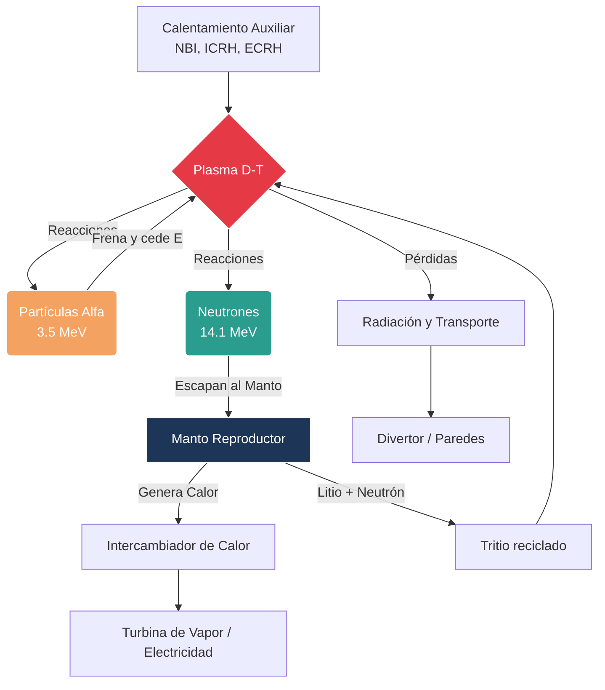

# Confinamiento y Fusión

La fusión busca unir núcleos ligeros para liberar energía, imitando procesos que ocurren en las estrellas. El problema físico central es mantener un plasma suficientemente denso, caliente y confinado durante el tiempo necesario para que las reacciones ocurran de forma eficiente.

## 🧮 Desarrollo Teórico Profundo

El confinamiento de plasmas busca atrapar un plasma incandescente contrarrestando la presión cinética y reduciendo el transporte de energía y partículas hacia las paredes del reactor. En reactores magnéticos (como el Tokamak y el Stellarator), esto se logra mediante fuerzas de Lorentz inducidas por campos magnéticos estructurados, mientras que en reactores inerciales se emplean láseres o haces de partículas para comprimir y calentar una microesfera de combustible.

### 1. Equilibrio Magnetohidrodinámico (MHD)

Para un plasma ideal en equilibrio estacionario bajo confinamiento magnético, la ecuación de momento de la magnetohidrodinámica establece que la presión térmica del plasma $\nabla p$ debe estar exactamente balanceada por la fuerza de Lorentz generada por las corrientes internas $\mathbf{J}$ y el campo magnético $\mathbf{B}$:

$$
\nabla p = \mathbf{J} \times \mathbf{B}
$$

Multiplicando escalarmente esta ecuación por $\mathbf{B}$ y por $\mathbf{J}$, descubrimos dos propiedades fundamentales del equilibrio magnético toroidal:

$$
\mathbf{B} \cdot \nabla p = 0
$$

$$
\mathbf{J} \cdot \nabla p = 0
$$

Estas identidades demuestran que tanto las líneas de campo magnético como las líneas de corriente yacen enteramente sobre superficies de presión constante ($p = \text{cte}$). En configuraciones toroidales como el Tokamak, estas se denominan **superficies magnéticas**. Para evitar que el campo intercepte la pared, el plasma debe poseer una estructura topológica de toros anidados.

Sustituyendo la ley de Ampère estática $\mathbf{J} = \frac{1}{\mu_0} \nabla \times \mathbf{B}$ en la ecuación de equilibrio:

$$
\nabla p = \frac{1}{\mu_0} (\nabla \times \mathbf{B}) \times \mathbf{B} = -\nabla\left( \frac{B^2}{2\mu_0} \right) + \frac{(\mathbf{B} \cdot \nabla)\mathbf{B}}{\mu_0}
$$

Si el campo magnético es rectilíneo, el término de tensión magnética $(\mathbf{B} \cdot \nabla)\mathbf{B}$ se anula. En tal caso, integrando espacialmente obtenemos el equilibrio de presión:

$$
p + \frac{B^2}{2\mu_0} = \text{constante}
$$

Este resultado define a **$\beta$ (beta de plasma)**, una figura de mérito crucial para la viabilidad económica de un reactor, que representa la relación entre la presión del plasma y la presión del campo magnético confinante:

$$
\beta = \frac{p}{B^2 / (2\mu_0)} = \frac{2\mu_0 n k_B T}{B^2}
$$

El límite empírico para la estabilidad en un Tokamak está dado por el límite de Troyon: $\beta_{max} \propto I_p / (a B_0)$, donde $I_p$ es la corriente del plasma y $a$ es el radio menor.

### 2. La Ecuación de Grad-Shafranov

Para una configuración toroidal axisimétrica (independiente del ángulo toroidal $\phi$), como la de un Tokamak, el campo magnético se descompone en sus componentes poloidal (generado por corrientes en el plasma) y toroidal (generado por bobinas externas). El flujo poloidal $\psi$ funciona como coordenada superficial. La ecuación de equilibrio $\nabla p = \mathbf{J} \times \mathbf{B}$ se reduce a la famosa **Ecuación de Grad-Shafranov**:

$$
R \frac{\partial}{\partial R} \left( \frac{1}{R} \frac{\partial \psi}{\partial R} \right) + \frac{\partial^2 \psi}{\partial Z^2} = -\mu_0 R^2 p'(\psi) - \mu_0^2 F(\psi) F'(\psi)
$$

Donde:
- $(R, \phi, Z)$ son las coordenadas cilíndricas.
- $\psi(R, Z)$ es la función de flujo poloidal (superficies de $\psi$ constante = superficies magnéticas).
- $p(\psi)$ es la presión del plasma (constante en la superficie).
- $F(\psi) = R B_\phi$ está relacionado con la corriente poloidal interna.

Esta es una ecuación diferencial elíptica y altamente no lineal (ya que $p$ y $F$ dependen de $\psi$) que dicta toda la forma del plasma, su límite con el deflector magnético (divertor) y su estabilidad posicional. Las soluciones a la Ecuación de Grad-Shafranov permiten reconstruir los campos y densidades en reactores como ITER.

### 3. Factor de Seguridad y Estabilidad

El factor de seguridad $q$ en una superficie magnética describe el número de vueltas toroidales que completa una línea de campo por cada vuelta poloidal. Para una geometría toroidal de aproximación cilíndrica (radio mayor $R$, radio menor $r$):

$$
q(r) = \frac{r B_\phi}{R B_\theta}
$$

El perfil de $q(r)$ es esencial. Si el perfil cruza un valor racional (ej. $q=1, 2, 3/2$), las líneas de campo se cierran sobre sí mismas, lo que excita inestabilidades destructivas MHD (modos *kink*, islas magnéticas o *tearing modes*). Mantener $q > 1$ en todo el plasma es el criterio de Kruskal-Shafranov para suprimir el modo kink ideal.

### Diagrama: Flujo de Energía en un Reactor de Fusión



### 4. Transporte y Pérdidas: Clásico vs Neoclásico

El tiempo de confinamiento de energía $\tau_E$ está determinado por la difusión de partículas y calor perpendicular al campo magnético.
El **Transporte Clásico** se basa en paseos aleatorios causados por colisiones de Coulomb. El paso del paseo aleatorio es el radio de Larmor (giroradio) $\rho_L = mv_\perp / (qB)$. El coeficiente de difusión clásico escala como:

$$
D_{cl} \approx \frac{\rho_L^2}{\tau_{col}} \propto \frac{1}{B^2}
$$

Sin embargo, en una geometría toroidal, el campo magnético es más fuerte en la parte interna del toro ($B \propto 1/R$). Esta inhomogeneidad atrapa partículas en órbitas en forma de "plátano" (banana orbits). Las excursiones de estas partículas atrapadas no son $\rho_L$, sino el ancho de la órbita de banana, que es mucho mayor. Esto da lugar al **Transporte Neoclásico**, donde:

$$
D_{neo} \approx q^2 \left(\frac{R}{r}\right)^{3/2} D_{cl}
$$

En la realidad, el transporte en Tokamaks suele ser **Anómalo**, dominado por turbulencia a pequeña escala impulsada por gradientes, que produce pérdidas entre 10 y 100 veces mayores que las predicciones neoclásicas.

## 🛠 Ejemplo Práctico

**Problema:** En el dispositivo de prueba JET (Joint European Torus), un plasma de Deuterio-Tritio está contenido por un campo toroidal $B_0 = 3.45 \, \text{T}$ a un radio mayor $R = 2.96 \, \text{m}$ y radio menor $a = 1.25 \, \text{m}$. La corriente de plasma medida es $I_p = 3.2 \, \text{MA}$. 
1. Estime el valor del campo poloidal en el borde $B_\theta(a)$ asumiendo sección transversal circular.
2. Calcule el factor de seguridad cilíndrico en el borde del plasma $q_a$.
3. Indique si el plasma cumple el límite de Kruskal-Shafranov contra inestabilidades kink a gran escala.

**Solución paso a paso:**

1. **Cálculo del campo poloidal en el borde ($B_\theta(a)$):**
   Utilizando la ley de Ampère en la superficie límite del plasma (radio $a$):

   

$$
\oint \mathbf{B} \cdot d\mathbf{l} = \mu_0 I_p
$$

   

$$
2\pi a B_\theta(a) = \mu_0 I_p
$$

   

$$
B_\theta(a) = \frac{\mu_0 I_p}{2\pi a}
$$

   Usando $\mu_0 = 4\pi \times 10^{-7} \, \text{T}\cdot\text{m/A}$:

   

$$
B_\theta(a) = \frac{(4\pi \times 10^{-7}) (3.2 \times 10^6)}{2\pi (1.25)} = \frac{2 \times 10^{-7} \times 3.2 \times 10^6}{1.25}
$$

   

$$
B_\theta(a) = \frac{0.64}{1.25} = 0.512 \, \text{T}
$$

2. **Cálculo del factor de seguridad en el borde ($q_a$):**
   La aproximación cilíndrica (gran relación de aspecto) para $q$ evaluada en el radio $a$ es:

   

$$
q_a \approx \frac{a B_\phi(R)}{R B_\theta(a)}
$$

   Asumiendo que el campo toroidal en $R$ es $B_0 = 3.45 \, \text{T}$:

   

$$
q_a = \frac{1.25 \times 3.45}{2.96 \times 0.512} = \frac{4.3125}{1.5155} \approx 2.84
$$

3. **Verificación de Estabilidad de Kruskal-Shafranov:**
   El criterio de estabilidad exige que $q > 1$ (típicamente $q_a > 2$ a $3$ para asegurar estabilidad global frente a interrupciones kink externas).
   Como $q_a \approx 2.84 > 1$, la condición básica de estabilidad se cumple. El plasma mantendrá su confinamiento general contra el modo ideal de cuerpo rígido.

## 📝 Guía de Ejercicios Resueltos

### Problema 1: Desplazamiento de Shafranov en un Tokamak
Derive cualitativamente la necesidad de un campo magnético vertical para mantener el equilibrio toroidal de un plasma (Desplazamiento de Shafranov). Considere la fuerza de expansión del aro.

**Solución paso a paso:**
En una geometría toroidal, un anillo de plasma experimenta una fuerza neta hacia afuera a lo largo del radio mayor $R$ debido a tres efectos principales:
1. La presión cinética del plasma (fuerza de expansión del neumático).
2. La presión magnética del campo poloidal interno, que es más fuerte en el lado interior del toro (efecto $1/R$).
3. La tensión del campo magnético toroidal, que intenta enderezar las líneas de campo.
La fuerza de expansión por unidad de longitud del toro es aproximadamente:

$$
F_R \approx \frac{\mu_0 I_p^2}{2} \left( \ln\frac{8R}{a} - \frac{3}{2} + \beta_p \right)
$$

donde $I_p$ es la corriente del plasma, $a$ el radio menor, y $\beta_p$ la beta poloidal.
Para compensar esta fuerza centrífuga efectiva y mantener el equilibrio, se requiere aplicar un campo magnético vertical externo $B_v$ mediante bobinas poloidales externas. La fuerza de Lorentz restauradora es $F_L = I_p \times B_v \times 2\pi R$. Igualando, obtenemos el campo vertical necesario:

$$
B_v = \frac{\mu_0 I_p}{4\pi R} \left( \ln\frac{8R}{a} - \frac{3}{2} + \beta_p + \frac{l_i}{2} \right)
$$

Esto estabiliza el eje magnético y previene el desplazamiento de Shafranov contra la pared exterior.

### Problema 2: Factor de Seguridad $q(r)$ para Perfil Parabólico de Corriente
Calcule el perfil del factor de seguridad $q(r)$ en la aproximación cilíndrica para un plasma de tokamak con densidad de corriente plana $J_z(r) = J_0 (1 - r^2/a^2)$.

**Solución paso a paso:**
El campo magnético poloidal $B_\theta(r)$ se obtiene mediante la ley de Ampère:

$$
\oint \mathbf{B} \cdot d\mathbf{l} = \mu_0 \int \mathbf{J} \cdot d\mathbf{A}
$$

$$
2\pi r B_\theta(r) = \mu_0 \int_0^r J_0 \left( 1 - \frac{r'^2}{a^2} \right) 2\pi r' dr'
$$

$$
r B_\theta(r) = \mu_0 J_0 \left[ \frac{r'^2}{2} - \frac{r'^4}{4a^2} \right]_0^r = \mu_0 J_0 \left( \frac{r^2}{2} - \frac{r^4}{4a^2} \right)
$$

$$
B_\theta(r) = \frac{\mu_0 J_0 r}{2} \left( 1 - \frac{r^2}{2a^2} \right)
$$

El factor de seguridad en aproximación cilíndrica es $q(r) = \frac{r B_\phi}{R B_\theta(r)}$. Sustituyendo $B_\theta(r)$:

$$
q(r) = \frac{r B_\phi}{R \frac{\mu_0 J_0 r}{2} \left( 1 - \frac{r^2}{2a^2} \right)} = \frac{2 B_\phi}{\mu_0 R J_0 \left( 1 - \frac{r^2}{2a^2} \right)}
$$

Para $r=0$ (en el eje magnético): $q(0) = \frac{2 B_\phi}{\mu_0 R J_0}$.
Para $r=a$ (en el borde): $q(a) = \frac{2 B_\phi}{\mu_0 R J_0 (1/2)} = 2 q(0)$.
Esto demuestra que un perfil de corriente concentrado en el centro resulta en un perfil $q(r)$ que aumenta hacia el exterior, lo cual es favorable para la estabilidad frente a modos magnéticos (shear magnético positivo).

### Problema 3: Criterio de Lawson con Impurezas
Modifique la deducción del criterio de Lawson para incluir una fracción de impurezas de Carbono ($Z=6$) dada por $f_C = n_C/n_i$, que incrementa las pérdidas radiativas de Bremsstrahlung.

**Solución paso a paso:**
La presencia de impurezas incrementa la densidad de electrones por cuasineutralidad: $n_e = n_i + Z n_C = n_i (1 + Z f_C)$.
La potencia de radiación de Bremsstrahlung escala con $Z_{eff}$, la carga efectiva del plasma:

$$
P_{br} \propto n_e \sum (n_k Z_k^2) = n_e n_i (1 + Z^2 f_C)
$$

$$
Z_{eff} = \frac{\sum n_k Z_k^2}{n_e} = \frac{n_i + n_C Z^2}{n_i + n_C Z} = \frac{1 + f_C Z^2}{1 + f_C Z}
$$

La potencia radiativa aumenta fuertemente: $P_{br}' = P_{br} (1 + Z f_C)(1 + Z^2 f_C)$.
El calentamiento alfa sigue siendo proporcional a la densidad de combustible, $P_\alpha \propto n_D n_T = n_i^2/4$.
La condición de ignición requiere $P_\alpha \ge P_{trans} + P_{br}'$.
Si la radiación $P_{br}'$ domina las pérdidas térmicas $P_{trans}$, el requerimiento de $n\tau_E$ se eleva exponencialmente. De hecho, si la concentración de Carbono supera aproximadamente el $5\%$, la curva de ignición de Lawson diverge a infinito, significando que la ignición es imposible a cualquier temperatura debido a la purga catastrófica de energía mediante radiación de rayos X (límite de radiación por impurezas).

## 💻 Simulaciones Computacionales

### Simulación: Órbitas de Partículas y Derivas en Campos E x B

Este código calcula numéricamente y grafica la trayectoria en espiral de una partícula cargada bajo la influencia de un campo magnético uniforme y un campo eléctrico transversal, mostrando el movimiento de deriva $\mathbf{E} \times \mathbf{B}$.

```python
import numpy as np
import matplotlib.pyplot as plt
from scipy.integrate import solve_ivp

q = 1.602e-19
m = 1.673e-27  # Protón
B_val = 1.0    # Campo B en z
E_val = 1000.0 # Campo E en y

def lorentz_force(t, Y):
    x, y, z, vx, vy, vz = Y
    
    # E = (0, E, 0)
    Ex, Ey, Ez = 0, E_val, 0
    # B = (0, 0, B)
    Bx, By, Bz = 0, 0, B_val
    
    ax = (q/m) * (Ex + vy*Bz - vz*By)
    ay = (q/m) * (Ey + vz*Bx - vx*Bz)
    az = (q/m) * (Ez + vx*By - vy*Bx)
    
    return [vx, vy, vz, ax, ay, az]

# Velocidad de deriva analítica v_E = E/B (dirección x)
v_E = E_val / B_val

# Condiciones iniciales (en reposo)
Y0 = [0, 0, 0, 0, 0, 0]
t_span = (0, 3e-7)
t_eval = np.linspace(*t_span, 5000)

sol = solve_ivp(lorentz_force, t_span, Y0, t_eval=t_eval, rtol=1e-8, atol=1e-8)

plt.figure(figsize=(10, 6))
plt.plot(sol.y[0]*1e3, sol.y[1]*1e3, label='Trayectoria real')
plt.plot(v_E * sol.t * 1e3, np.zeros_like(sol.t), 'r--', label='Deriva E x B teórica')

plt.title('Deriva E x B de un Protón')
plt.xlabel('x (mm) - Dirección de la deriva')
plt.ylabel('y (mm) - Dirección del campo E')
plt.legend()
plt.grid(True)
plt.axis('equal')
plt.show()
```

## 🚀 Fronteras de Investigación y Problemas Abiertos

El progreso hacia la fusión comercial es continuo, y en 2026 nos encontramos ante hitos críticos de integración e ignición sostenida.
- **Predicción y Mitigación de Disrupciones (IA en Tokamaks):** Una disrupción térmica o electromagnética puede dañar las paredes del reactor. El control de plasmas hiper-calientes (150 millones de grados) requiere usar Machine Learning (Redes Neuronales de Refuerzo Profundo) que actúen sobre los sistemas de calentamiento en nanosegundos para evitar la formación de Modos de Desgarro Neoclásicos (NTMs).
- **Stellarators Optimizados por Supercomputación:** Mientras el tokamak es simétrico (axisimétrico), el stellarator utiliza bobinas 3D asimétricas y muy retorcidas. Los nuevos diseños (tipo W7-X) están descubriendo óptimos casi-isodinámicos ocultos en el espacio de parámetros multidimensional.
- **Manejo del Escape de Calor de Pared (El Divertor):** Extraer los subproductos de la fusión y el inmenso calor sin derretir el wolframio de la pared requiere crear estados desprendidos (detached plasmas), un régimen atómico y molecular altamente no lineal en los bordes del reactor.

## 📐 Formalismo Matemático Avanzado (Nivel Posgrado/Doctorado)

El confinamiento magnético se basa en la topología de la superficie toriodal y en teoremas hamiltonianos fundamentales.

**Teoría KAM (Kolmogorov-Arnold-Moser) y Coordenadas de Boozer:**
Las líneas de campo magnético en un toroide cerrado (tokamak o stellarator) son descritas como las trayectorias de un sistema hamiltoniano con grado de libertad 1.5. El "tiempo" hamiltoniano es la coordenada toroidal $\phi$.
La existencia de superficies de flujo anidadas perfectas está garantizada por el teorema KAM, siempre y cuando la perturbación de la simetría original sea pequeña y el perfil del factor de seguridad $q$ sea fuertemente cizallado (irracional e inconmensurable):

$$
\left| m - nq(\psi) \right| > \frac{C}{m^\tau}
$$

Si el solapamiento de resonancias magnéticas excede el criterio de Chirikov, las superficies invariantes colapsan formando islas magnéticas y regiones caóticas o estocásticas, lo que destruye el confinamiento radial y permite que la difusividad de calor aumente órdenes de magnitud (caos cuántico y clásico).
Para mapear la estructura topológica, se utilizan las coordenadas de flujo de Boozer $(\psi, \theta_B, \phi_B)$ donde el campo métrico garantiza que las líneas de campo son perfectamente rectilíneas métricamente en ese espacio abstracto tridimensional curvilíneo.

## 📚 Recursos Específicos

### Cursos Online y Material Académico
1. **[MIT OCW: 22.011 / 22.112 Nuclear Engineering](https://ocw.mit.edu/courses/22-011-nuclear-engineering-science-systems-and-society-fall-2020/)**
   Bases termodinámicas de la fusión nuclear y la ciencia de los reactores de confinamiento magnético.
2. **[EPFL: Plasma Physics and Applications](https://www.edx.org/course/plasma-physics-and-applications)**
   Enfoque profundo en tokamaks, stellarators y equilibrio de plasma, con contribuciones del Swiss Plasma Center.

### Artículos Científicos Clave y su Análisis Teórico

1. **"Some Criteria for a Power Producing Thermonuclear Reactor"** - *J. D. Lawson (1957), Proc. Phys. Soc. Section B, 70, 6*  
   [Link al artículo original (IOP)](https://iopscience.iop.org/article/10.1088/0370-1301/70/1/303)
   
   **Importancia Teórica y Relevancia:** 
   El artículo monumental que introdujo el famoso "Criterio de Lawson", la métrica técnica definitiva e ineludible que debe cumplir cualquier diseño de reactor termonuclear para alcanzar el punto de auto-mantenimiento (breakeven o ignición) en el que la energía liberada iguala o supera la introducida.
   
   **Contexto Matemático:** 
   Lawson analizó el balance de potencia global de un volumen de plasma a temperatura extrema. Consideró la potencia producida por la reacción $\langle \sigma v \rangle$ y descontó implacablemente las pérdidas inexorables por radiación de Bremsstrahlung térmica ($P_{br} \propto Z_{eff} n_e^2 T^{1/2}$) y conducción difusiva ($\propto n k_B T / \tau_E$). El equilibrio en estado estacionario para una reacción D-T impuso que el triple producto debe superar una curva crítica paramétrica en función de la temperatura $T$:

   

$$
n_e \tau_E \ge \frac{12 k_B T}{\langle \sigma v \rangle E_{\text{fus}} - C_{br} T^{1/2}}
$$

   Para alcanzar la temperatura óptima de D-T ($\sim 15 \, \text{keV}$), dedujo que el producto de la densidad iónica por el tiempo de confinamiento energético debe satisfacer estrictamente $n \tau_E \ge 10^{20} \, \text{s m}^{-3}$. Este umbral matemático gobierna el dimensionamiento colosal de reactores como ITER (enfocado en gran $\tau_E$ y baja $n$) y láseres como NIF (enfocados en minúsculo $\tau_E$ y asombrosa $n$ de compresión).

2. **"Tokamak Devices"** - *L. A. Artsimovich (1972), Nuclear Fusion 12, 215*  
   [Link al artículo original (IAEA)](https://iopscience.iop.org/article/10.1088/0029-5515/12/2/001)
   
   **Importancia Teórica y Relevancia:** 
   Artsimovich, director del programa de fusión soviético, sintetizó en esta obra histórica la física subyacente y los resultados empíricos que demostraron la superioridad aplastante del diseño Tokamak sobre otras configuraciones como el Z-pinch, catapultándolo al paradigma mundial de fusión magnética.
   
   **Contexto Matemático:** 
   El análisis expone la inestabilidad de las líneas puramente toroidales o poloidales y justifica la necesidad imperativa de un "shear" (cizallamiento) magnético y de un factor de seguridad de Kruskal-Shafranov superior a 1 en todo el plasma para apaciguar las inestabilidades magnetohidrodinámicas (MHD) a gran escala. El confinamiento estable en un sistema de revolución axisimétrico se garantiza topológicamente enrollando helicoidalmente el campo, de forma que la trayectoria en la superficie magnética obedece:

   

$$
q(r) = \frac{r B_\phi}{R B_\theta} > 1
$$

   Donde el factor de seguridad $q$ debe exceder holgadamente la unidad en el borde del plasma ($q_a \approx 3$). El artículo también discute pioneramente las desviaciones del transporte de partículas de las predicciones clásicas cilíndricas (difusión de Coulomb) debido a partículas atrapadas ("banana orbits"), inaugurando empíricamente la era de la teoría de transporte neoclásico y turbulento para toros simétricos.

### 📖 Referencias Útiles y Bibliografía
- Wesson, J. (2011). *Tokamaks*. Oxford University Press.
- Freidberg, J. P. (2007). *Plasma Physics and Fusion Energy*. Cambridge University Press.
- Chen, F. F. (1984). *Introduction to Plasma Physics and Controlled Fusion*. Springer.

## 🌐 Seminarios Avanzados y Literatura de Frontera

### Seminarios y Cursos
- [Princeton Plasma Physics Laboratory (PPPL) Seminars](https://www.pppl.gov/events)
- [MIT Plasma Science and Fusion Center](https://www.psfc.mit.edu/events)
- [ITER News & Seminars](https://www.iter.org/news)

### Literatura de Frontera
- [Nuclear Fusion (IAEA)](https://iopscience.iop.org/journal/0029-5515): La revista de referencia para los avances globales en el diseño y física de reactores de fusión.
- [Physics of Plasmas (AIP)](https://aip.scitation.org/journal/php): Cubre descubrimientos fundamentales en plasmas espaciales, de laboratorio y astrofísicos.
- [Nature Physics - Plasma Physics](https://www.nature.com/subjects/plasma-physics): Destaca los artículos de mayor impacto relacionados con el confinamiento y las inestabilidades magnéticas.
