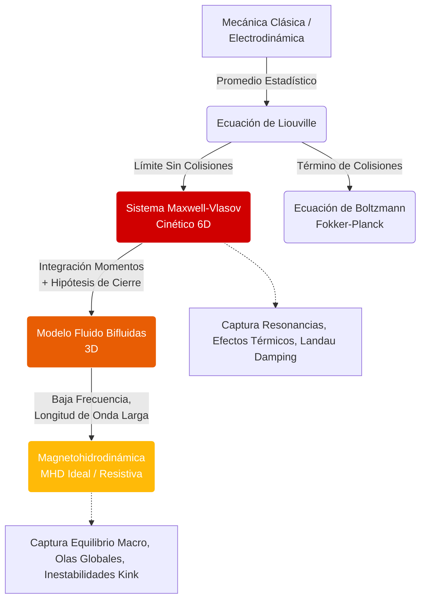

# Fundamentos de Plasmas

Un plasma es un gas ionizado donde las fuerzas electromagnéticas colectivas son tan importantes como las colisiones entre partículas. Aunque parte de sus ingredientes sean electrones e iones individuales, su comportamiento más interesante aparece a escala colectiva.

## 🧮 Desarrollo Teórico Profundo

El plasma es intrínsecamente un sistema dinámico multiescala. Las aproximaciones teóricas varían desde el seguimiento preciso de cada partícula bajo fuerzas microscópicas hasta modelos estadísticos fluidos e híbridos. Aquí exploraremos el modelo unificador más riguroso de la física de plasmas sin colisiones: la teoría cinética a través de la ecuación de Vlasov, y la reducción a los momentos fluidos.

### 1. La Descripción Cinética y la Ecuación de Vlasov

La representación completa del estado del plasma se define mediante la función de distribución en el espacio de fase $f_s(\mathbf{r}, \mathbf{v}, t)$ para cada especie de partícula $s$ (electrones, diferentes tipos de iones). Esta función describe la densidad de probabilidad de encontrar partículas de la especie $s$ en una posición $\mathbf{r}$ con una velocidad $\mathbf{v}$ en un tiempo $t$.

Dado que el número de partículas se conserva y siguen trayectorias en el espacio de fase según la mecánica clásica, $f_s$ obedece el Teorema de Liouville generalizado:

$$ \frac{df_s}{dt} = \frac{\partial f_s}{\partial t} + \mathbf{v} \cdot \nabla_{\mathbf{r}} f_s + \mathbf{a} \cdot \nabla_{\mathbf{v}} f_s = \left( \frac{\partial f_s}{\partial t} \right)_{colisiones} $$

En plasmas calientes, tenues y espacialmente extensos (como los astrofísicos y los de fusión), las colisiones binarias de corto alcance son despreciables frente a las interacciones de largo alcance inducidas por los campos colectivos autogenerados. Haciendo el término colisional igual a cero y usando la fuerza de Lorentz $\mathbf{F} = q_s(\mathbf{E} + \mathbf{v} \times \mathbf{B})$ para la aceleración $\mathbf{a} = \mathbf{F}/m_s$, obtenemos la **Ecuación de Vlasov**:

$$ \frac{\partial f_s}{\partial t} + \mathbf{v} \cdot \nabla f_s + \frac{q_s}{m_s}(\mathbf{E} + \mathbf{v} \times \mathbf{B}) \cdot \nabla_{\mathbf{v}} f_s = 0 $$

Esta ecuación integro-diferencial es altamente no lineal y está acoplada al sistema completo de **Ecuaciones de Maxwell**. Las fuentes de los campos $\mathbf{E}$ y $\mathbf{B}$ son las densidades de carga $\rho$ y corriente $\mathbf{J}$, obtenidas al integrar las funciones de distribución sobre el espacio de velocidades:

$$ \rho(\mathbf{r},t) = \sum_s q_s \int f_s(\mathbf{r},\mathbf{v},t) d^3v $$
$$ \mathbf{J}(\mathbf{r},t) = \sum_s q_s \int \mathbf{v} f_s(\mathbf{r},\mathbf{v},t) d^3v $$

El sistema Maxwell-Vlasov es la descripción fundamental para plasmas no colisionales, capaz de predecir amortiguamiento de Landau, microinestabilidades y efectos de atrape magnético.

### 2. Jerarquía de Momentos Fluídos

Resolver la Ecuación de Vlasov analíticamente en 6D+1 es casi imposible para sistemas complejos. En la práctica, se integran "momentos" de $f_s$ respecto al espacio de velocidades para reducir el problema al espacio físico tridimensional, dando lugar a los modelos fluidos.

Multiplicando la ecuación de Vlasov secuencialmente por $1, m_s\mathbf{v}, \frac{1}{2}m_s v^2, \ldots$ y realizando la integración $\int (\cdot) d^3v$, obtenemos la jerarquía fluida.

**Momento Cero (Continuidad):**
Multiplicando por 1:
$$ \frac{\partial n_s}{\partial t} + \nabla \cdot (n_s \mathbf{u}_s) = 0 $$
donde la densidad es $n_s = \int f_s d^3v$ y la velocidad fluida $\mathbf{u}_s = \frac{1}{n_s} \int \mathbf{v} f_s d^3v$.

**Primer Momento (Momento Lineal):**
Multiplicando por $m_s\mathbf{v}$:
$$ m_s n_s \left( \frac{\partial \mathbf{u}_s}{\partial t} + (\mathbf{u}_s \cdot \nabla)\mathbf{u}_s \right) = q_s n_s (\mathbf{E} + \mathbf{u}_s \times \mathbf{B}) - \nabla \cdot \mathbb{P}_s + \mathbf{R}_s $$
donde $\mathbb{P}_s = m_s \int (\mathbf{v}-\mathbf{u}_s)(\mathbf{v}-\mathbf{u}_s) f_s d^3v$ es el **tensor de presiones** cinético, y $\mathbf{R}_s$ es la transferencia de momento por colisiones (fricción entre especies).

### 3. La Paradoja del Cierre y el Amortiguamiento de Landau

Notemos un patrón fundamental:
- La ecuación de densidad ($n_s$, orden 0) requiere conocer la velocidad fluida ($\mathbf{u}_s$, orden 1).
- La ecuación de momento ($\mathbf{u}_s$, orden 1) requiere conocer el tensor de presiones ($\mathbb{P}_s$, orden 2).
- La ecuación de energía (presión, orden 2) requerirá el flujo de calor (orden 3).

Este es el infame **problema del cierre**. El sistema de ecuaciones fluidas nunca se cierra intrínsecamente. Se debe invocar una suposición física (ej. truncar el flujo de calor a cero, asumir proceso adiabático o isotérmico) para cerrar el sistema.

Al cerrar el sistema a un nivel bajo, se pierde información puramente cinética. Un ejemplo capital descubierto por el físico soviético Lev Landau en 1946 es el **Amortiguamiento de Landau**. Las ecuaciones fluidas predicen que las oscilaciones del plasma $\omega_{pe}$ persisten indefinidamente sin colisiones. Sin embargo, si analizamos analíticamente la ecuación de Vlasov mediante transformadas de Laplace en el plano complejo, hallamos que la energía de la onda se transfiere sutilmente a aquellas partículas cuya velocidad coincide con la velocidad de fase de la onda ($v \approx v_{ph} = \omega / k$), amortiguando exponencialmente la perturbación macroscópica sin necesidad de fricción térmica. 

$$ \gamma \approx -\omega_{pe} \sqrt{\frac{\pi}{8}} \frac{1}{(k \lambda_D)^3} \exp\left( -\frac{1}{2(k \lambda_D)^2} - \frac{3}{2} \right) $$

Esta demostración validó el uso de modelos cinéticos, pues las teorías puramente fluidas obvian estas resonancias onda-partícula.

### Diagrama: Modelos y Acoplamientos en Física de Plasmas



## 🛠 Ejemplo Práctico

**Problema:** A partir de las ecuaciones fluidas para electrones fríos e iones pesados estacionarios en ausencia de campo magnético ($\mathbf{B}=0$), derive la relación de dispersión para las oscilaciones de plasma y calcule la constante dieléctrica del plasma $\epsilon(\omega)$.

**Solución paso a paso:**

1. **Ecuaciones Linealizadas de Electrones Fríos:**
   Como vimos anteriormente, en 1D las perturbaciones lineales obedecen:
   Continuidad: $\frac{\partial n_1}{\partial t} + n_0 \nabla \cdot \mathbf{u}_1 = 0$
   Momento: $m_e \frac{\partial \mathbf{u}_1}{\partial t} = -e \mathbf{E}_1$
   (Suponemos presión cinética nula $\nabla p_1 = 0$).

2. **Uso de Fourier y Maxwell:**
   Asumimos soluciones en forma de ondas planas para todas las cantidades perturbadas: $\Psi_1 \propto \exp[i(\mathbf{k}\cdot\mathbf{r} - \omega t)]$.
   Los operadores se transforman en multiplicadores algebraicos:
   $\frac{\partial}{\partial t} \to -i\omega$, \quad $\nabla \to i\mathbf{k}$.

   Reescribiendo la ecuación de momento:
   $$ -i\omega m_e \mathbf{u}_1 = -e \mathbf{E}_1 \implies \mathbf{u}_1 = \frac{e}{i\omega m_e} \mathbf{E}_1 = -i \frac{e}{\omega m_e} \mathbf{E}_1 $$

3. **Cálculo de la Corriente de Polarización:**
   La densidad de corriente inducida en el plasma proviene del movimiento de los electrones:
   $$ \mathbf{J}_1 = -e n_0 \mathbf{u}_1 $$
   Sustituyendo $\mathbf{u}_1$:
   $$ \mathbf{J}_1 = -e n_0 \left( -i \frac{e}{\omega m_e} \mathbf{E}_1 \right) = i \frac{n_0 e^2}{\omega m_e} \mathbf{E}_1 $$
   Usando la definición de la conductividad compleja de plasma $\mathbf{J}_1 = \sigma \mathbf{E}_1$, tenemos $\sigma = i \frac{\epsilon_0 \omega_{pe}^2}{\omega}$, donde $\omega_{pe}^2 = \frac{n_0 e^2}{\epsilon_0 m_e}$.

4. **Ecuación de Ampère-Maxwell y Dieléctrico Equivalente:**
   La ley de Ampère-Maxwell es:
   $$ \nabla \times \mathbf{B}_1 = \mu_0 \mathbf{J}_1 + \mu_0 \epsilon_0 \frac{\partial \mathbf{E}_1}{\partial t} $$
   Dividiendo entre $\mu_0$ para igualarla a $\nabla \times \mathbf{H}_1$:
   $$ \nabla \times \mathbf{H}_1 = \mathbf{J}_1 - i\omega \epsilon_0 \mathbf{E}_1 $$
   Sustituimos la corriente inducida:
   $$ \nabla \times \mathbf{H}_1 = \left( i \frac{\epsilon_0 \omega_{pe}^2}{\omega} - i\omega \epsilon_0 \right) \mathbf{E}_1 $$
   $$ \nabla \times \mathbf{H}_1 = -i\omega \epsilon_0 \left( 1 - \frac{\omega_{pe}^2}{\omega^2} \right) \mathbf{E}_1 $$
   Definiendo formalmente la respuesta del material con una **permitividad dieléctrica equivalente** $\epsilon(\omega)$ tal que $\nabla \times \mathbf{H}_1 = -i\omega \epsilon(\omega) \mathbf{E}_1$, deducimos:
   
   $$ \epsilon(\omega) = \epsilon_0 \left( 1 - \frac{\omega_{pe}^2}{\omega^2} \right) $$

**Conclusión:** El plasma se comporta como un medio dieléctrico altamente dispersivo. Para altas frecuencias ($\omega > \omega_{pe}$), $\epsilon(\omega) > 0$ y las ondas electromagnéticas se propagan (ej. transmisión ionosférica, luz). Para bajas frecuencias ($\omega < \omega_{pe}$), $\epsilon(\omega) < 0$ y el plasma refleja o hace decaer evanescente la onda electromagnética (el fenómeno responsable de que la radio de baja frecuencia rebote en la ionosfera).

## 📝 Guía de Ejercicios Resueltos

### Problema 1: Amortiguamiento de Landau desde Vlasov-Poisson
Calcule el decaimiento de una onda electrostática usando la relación de dispersión dieléctrica linealizada obtenida de la ecuación de Vlasov:
$$ 1 + \frac{\omega_{pe}^2}{k} \int_{-\infty}^{\infty} \frac{\partial f_0 / \partial v}{\omega - kv} dv = 0 $$
Asuma que $f_0(v)$ es una distribución maxwelliana y $\omega / k \gg v_{th}$ (ondas rápidas).

**Solución paso a paso:**
La integral tiene un polo en $v = \omega/k$. Utilizando el contorno de Landau en el plano complejo, la integral de Cauchy se separa en el valor principal de Cauchy (VP) y un residuo:
$$ \int_C \frac{\partial f_0 / \partial v}{kv - \omega} dv = \text{VP} \int \frac{\partial f_0 / \partial v}{kv - \omega} dv + i\pi \left. \frac{\partial f_0}{\partial v} \right|_{v=\omega/k} \frac{1}{|k|} $$
Para la parte real (oscilatoria), asumimos $\omega = \omega_r + i\gamma$ con $|\gamma| \ll \omega_r$. El valor principal para la maxwelliana expandido en serie asintótica para altas velocidades de fase da:
$$ 1 - \frac{\omega_{pe}^2}{\omega_r^2} \left( 1 + \frac{3k^2 v_{th}^2}{\omega_r^2} \right) = 0 \implies \omega_r^2 \approx \omega_{pe}^2 + 3k^2 v_{th}^2 $$
Para la parte imaginaria $\gamma$, que representa el decaimiento o amortiguamiento de la onda, igualamos las contribuciones imaginarias de la función dieléctrica $\epsilon(\omega, k) = \epsilon_r + i\epsilon_i = 0$:
$$ \gamma \approx -\frac{\epsilon_i(\omega_r, k)}{\partial \epsilon_r / \partial \omega_r} $$
Calculando el residuo de la maxwelliana $f_0(v) = \frac{1}{\sqrt{2\pi v_{th}^2}} e^{-v^2/2v_{th}^2}$:
$$ \epsilon_i = -\pi \frac{\omega_{pe}^2}{k^2} \left. \frac{\partial f_0}{\partial v} \right|_{\omega_r/k} = \sqrt{\frac{\pi}{2}} \frac{\omega_{pe}^2}{k^2} \frac{\omega_r}{k v_{th}^3} e^{-\omega_r^2/2k^2 v_{th}^2} $$
Sustituyendo el jacobiano $\partial \epsilon_r / \partial \omega_r \approx 2/\omega_r$:
$$ \gamma = -\omega_r \sqrt{\frac{\pi}{8}} \frac{1}{(k\lambda_D)^3} \exp\left( -\frac{1}{2(k\lambda_D)^2} - \frac{3}{2} \right) $$
Esto demuestra matemáticamente la transferencia de energía de la onda a las partículas resonantes que viajan ligeramente más despacio que la velocidad de fase.

### Problema 2: Inestabilidad de Dos Haces (Two-Stream Instability)
Considere un plasma de electrones fríos en un fondo iónico neutralizador. Suponga que los electrones están divididos en dos haces de igual densidad $n_0/2$ moviéndose con velocidades $+v_0$ y $-v_0$. Derive la relación de dispersión y encuentre la tasa máxima de crecimiento de la inestabilidad.

**Solución paso a paso:**
Partimos de la función dieléctrica para $N$ fluidos fríos no relativistas:
$$ \epsilon(\omega, k) = 1 - \sum_j \frac{\omega_{pj}^2}{(\omega - k v_{0j})^2} = 0 $$
Para nuestro caso, con dos haces electrónicos simétricos:
$$ 1 = \frac{\omega_{pe}^2/2}{(\omega - kv_0)^2} + \frac{\omega_{pe}^2/2}{(\omega + kv_0)^2} $$
Multiplicando por los denominadores:
$$ (\omega^2 - k^2 v_0^2)^2 = \frac{\omega_{pe}^2}{2} \left( (\omega + kv_0)^2 + (\omega - kv_0)^2 \right) = \omega_{pe}^2 (\omega^2 + k^2 v_0^2) $$
Esta es una ecuación bicuadrática para $\omega$. Resolviendo para $\omega^2$:
$$ \omega^2 = k^2 v_0^2 + \frac{\omega_{pe}^2}{2} \pm \sqrt{ \left( k^2 v_0^2 + \frac{\omega_{pe}^2}{2} \right)^2 - k^2 v_0^2 (k^2 v_0^2 - \omega_{pe}^2) } $$
La inestabilidad ocurre cuando $\omega^2 < 0$, lo que implica que $\omega$ tiene una componente imaginaria pura $\omega = i\gamma$, creciendo exponencialmente en el tiempo.
Esto requiere $k^2 v_0^2 < \omega_{pe}^2$.
La tasa de crecimiento máxima se encuentra optimizando $\gamma(k)$. Tomando derivadas, el máximo ocurre en $k \approx \frac{\sqrt{3}}{2} \frac{\omega_{pe}}{v_0}$, rindiendo una tasa de crecimiento de la inestabilidad $\gamma_{max} = \frac{\omega_{pe}}{2}$.

### Problema 3: Cortes (Cutoffs) de Ondas Electromagnéticas
Determine las frecuencias de corte para las ondas electromagnéticas polarizadas circularmente (modo R y modo L) propagándose paralelamente a un campo magnético estático $B_0$.

**Solución paso a paso:**
Para propagación paralela $\mathbf{k} \parallel \mathbf{B}_0$, la relación de dispersión tensorial del plasma magnetizado se desacopla en dos modos de polarización circular:
El índice de refracción $N^2 = \left( \frac{kc}{\omega} \right)^2$ está dado por:
$$ N_R^2 = 1 - \frac{\omega_{pe}^2}{\omega (\omega - \Omega_{ce})} \quad \text{(Modo Right / Extraordinario)} $$
$$ N_L^2 = 1 - \frac{\omega_{pe}^2}{\omega (\omega + \Omega_{ce})} \quad \text{(Modo Left / Ordinario)} $$
donde $\Omega_{ce} = e B_0 / m_e$ es la frecuencia ciclotrónica electrónica.
Los cortes ocurren cuando la onda se refleja, es decir $N^2 = 0$ (o $k=0$).
Para el modo R ($N_R^2 = 0$):
$$ \omega^2 - \omega \Omega_{ce} - \omega_{pe}^2 = 0 $$
$$ \omega_R = \frac{\Omega_{ce} + \sqrt{\Omega_{ce}^2 + 4\omega_{pe}^2}}{2} $$
Para el modo L ($N_L^2 = 0$):
$$ \omega^2 + \omega \Omega_{ce} - \omega_{pe}^2 = 0 $$
$$ \omega_L = \frac{-\Omega_{ce} + \sqrt{\Omega_{ce}^2 + 4\omega_{pe}^2}}{2} $$
Las ondas con frecuencias menores a estos umbrales son evanescentes, demostrando que el campo magnético levanta la degeneración del plasma isotrópico y causa birrefringencia en medios interestelares.

## 💻 Simulaciones Computacionales

### Simulación: Relación de Dispersión de Ondas de Plasma Electrónico

Calcula y grafica la relación de dispersión (frecuencia vs número de onda) para las ondas de Langmuir en un plasma cálido usando la aproximación fluida de Bohm-Gross: $\omega^2 = \omega_{pe}^2 + 3 k^2 v_{th}^2$.

```python
import numpy as np
import matplotlib.pyplot as plt

# Parámetros físicos
n0 = 1e18       # Densidad electrónica m^-3
e = 1.602e-19   # Carga elemental C
me = 9.109e-31  # Masa del electrón kg
eps0 = 8.854e-12
k_B = 1.38e-23  # Constante de Boltzmann J/K
T_e = 1e5       # Temperatura en K

# Frecuencia de plasma y velocidad térmica
omega_pe = np.sqrt(n0 * e**2 / (me * eps0))
v_th = np.sqrt(k_B * T_e / me)
lambda_D = v_th / omega_pe

# Rango del número de onda normalizado k * lambda_D
k_lam = np.linspace(0.0, 0.5, 100)
k = k_lam / lambda_D

# Relación de dispersión Bohm-Gross
omega = np.sqrt(omega_pe**2 + 3 * k**2 * v_th**2)

plt.figure(figsize=(10, 6))
plt.plot(k_lam, omega / omega_pe, 'b-', linewidth=2)
plt.axhline(1.0, color='r', linestyle='--', label='Fluido Frío ($\omega_{pe}$)')

plt.title('Relación de Dispersión: Ondas de Langmuir (Bohm-Gross)')
plt.xlabel('Número de Onda Normalizado $k \lambda_D$')
plt.ylabel('Frecuencia Normalizada $\omega / \omega_{pe}$')
plt.fill_between(k_lam, omega / omega_pe, 1.0, alpha=0.1, color='blue', label='Efectos Térmicos (Dispersión)')
plt.legend()
plt.grid(True)
plt.show()
```

## 📚 Recursos Específicos

### Cursos Online y Material Académico
1. **[MIT OCW: 22.611J Introduction to Plasma Physics I](https://ocw.mit.edu/courses/22-611j-introduction-to-plasma-physics-i-fall-2003/)**
   Excelente abordaje de las ecuaciones cinéticas, modelos fluidos y propagación de ondas.
2. **[NPTEL: Fundamentals of Plasmas](https://nptel.ac.in/courses/115/102/115102020/)**
   Curso analítico intenso centrado en la teoría cinética y derivaciones matemáticas detalladas.

### Artículos Científicos Clave y su Análisis Teórico

1. **"On the Vibrations of the Electronic Plasma"** - *L. D. Landau (1946), Journal of Physics USSR 10, 25*  
   [Link a revisión moderna e historia (Physics Today)](https://physicstoday.scitation.org/doi/10.1063/PT.3.4341)
   
   **Importancia Teórica y Relevancia:** 
   Constituye el triunfo indiscutible de la Teoría Cinética sobre las aproximaciones puramente fluidas. Landau demostró analíticamente que las ondas en plasmas no colisionales, descritas por la ecuación de Vlasov, experimentan un amortiguamiento profundo y riguroso sin necesidad de colisiones.
   
   **Contexto Matemático:** 
   La derivación resolvió la singularidad de resonancia $v = \omega/k$ de la integral dispersiva en el formalismo de Vlasov-Poisson:
   $$ 1 + \frac{\omega_{pe}^2}{k} \int_C \frac{\partial f_0 / \partial v}{\omega - kv} dv = 0 $$
   Landau propuso deformar el contorno de integración $C$ en el plano complejo de velocidades, aplicando el Teorema de los Residuos de Cauchy. Extrajo un componente imaginario en la frecuencia $ \omega = \omega_r + i\gamma $, demostrando un decaimiento de fase (fase mixing):
   $$ \gamma \approx -\omega_{pe} \sqrt{\frac{\pi}{8}} \frac{1}{(k \lambda_D)^3} \exp\left( -\frac{1}{2(k \lambda_D)^2} - \frac{3}{2} \right) $$
   Esta proeza reveló matemáticamente la transferencia microscópica de energía colectiva a partículas cuasi-resonantes, sentando las bases modernas de todo el calentamiento por microondas y las inestabilidades de haces.

2. **"Microscopic Equations for a Plasma"** - *O. Penrose (1960), Physics of Fluids 3, 258*  
   [Link al artículo original (AIP)](https://aip.scitation.org/doi/10.1063/1.1706024)
   
   **Importancia Teórica y Relevancia:** 
   Penrose generalizó poderosamente los resultados de Landau, aportando un criterio de estabilidad universal (El Criterio de Penrose) para cualquier distribución arbitraria de velocidades $f_0(v)$ en sistemas no colisionales.
   
   **Contexto Matemático:** 
   El problema de las inestabilidades micro-cinéticas (como el 'two-stream instability') requerían un tratamiento sistemático más allá de distribuciones maxwellianas térmicas simples. Penrose aplicó métodos de variables complejas al mapeo conforme de la función de dispersión dieléctrica en el plano complejo. Estableció que, dado un mínimo local en la función de distribución de velocidades $f(v)$ (es decir, distribuciones tipo joroba o 'bump-on-tail') en una velocidad $v = v_m$ (donde $f'(v_m)=0$ y $f''(v_m)>0$), el plasma será inestable a perturbaciones electrostáticas si y solo si la integral del valor principal de Cauchy satisface la condición:
   $$ \int_{-\infty}^{\infty} \frac{f(v) - f(v_m)}{(v - v_m)^2} dv > 0 $$
   Este teorema matemáticamente elegante se volvió un hito fundamental. Indica de manera precisa que no basta con tener dos jorobas de haces interactuando para producir una inestabilidad; la "profundidad" relativa de las corrientes debe sobrepasar un umbral estadístico estricto, guiando la comprensión de inestabilidades turbulentas en aceleradores y reactores.

### 📖 Referencias Útiles y Bibliografía
- Stix, T. H. (1992). *Waves in Plasmas*. Springer.
- Boyd, T. J. M., & Sanderson, J. J. (2003). *The Physics of Plasmas*. Cambridge University Press.
- Bellan, P. M. (2006). *Fundamentals of Plasma Physics*. Cambridge University Press.
- Chen, F. F. (1984). *Introduction to Plasma Physics and Controlled Fusion*. Springer.
