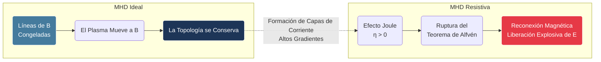

# Magnetohidrodinámica

La magnetohidrodinámica (MHD) es el estudio de la dinámica de fluidos conductores de electricidad (como plasmas, metales líquidos, o agua salada) bajo la influencia de campos magnéticos.

## 📜 Contexto Histórico

El campo de la MHD fue iniciado por Hannes Alfvén, quien en 1942 descubrió las ondas electromagnéticas en plasmas (Ondas de Alfvén), trabajo por el cual recibió el Premio Nobel de Física en 1970. Su desarrollo inicial se enfocó en comprender fenómenos astrofísicos y geofísicos (como el campo magnético terrestre).

## 🧮 Desarrollo Teórico Profundo

La Magnetohidrodinámica (MHD) aborda el plasma como un fluido único y eléctricamente conductor, suprimiendo los detalles cinéticos de electrones e iones individuales para enfocarse en la macroescala. Es la herramienta principal para modelar la corona solar, dínamos planetarios y la estabilidad macroscópica de los tokamaks.

### 1. Las Ecuaciones de la MHD Ideal

El modelo ideal asume que el plasma no tiene resistividad ($\eta = 0$), viscosidad ni conductividad térmica. Las ecuaciones resultan de una combinación de las ecuaciones de Navier-Stokes y las ecuaciones de Maxwell.

1. **Ecuación de Continuidad de Masa:**
   $$ \frac{\partial \rho}{\partial t} + \nabla \cdot (\rho \mathbf{v}) = 0 $$
   donde $\rho$ es la densidad de masa fluida y $\mathbf{v}$ la velocidad fluida centro de masa.

2. **Ecuación de Momento (Navier-Stokes con fuerza de Lorentz):**
   $$ \rho \left( \frac{\partial \mathbf{v}}{\partial t} + (\mathbf{v} \cdot \nabla)\mathbf{v} \right) = -\nabla p + \mathbf{J} \times \mathbf{B} $$
   donde $p$ es la presión térmica, $\mathbf{J}$ es la densidad de corriente y $\mathbf{B}$ el campo magnético.

3. **Ecuación de Estado (Termodinámica adiabática):**
   $$ \frac{d}{dt} \left( \frac{p}{\rho^\gamma} \right) = 0 $$
   con $\gamma = 5/3$ para un gas monoatómico 3D.

4. **Ley de Ohm Ideal:**
   En el referencial que se mueve con la velocidad del fluido $\mathbf{v}$, el campo eléctrico efectivo $\mathbf{E}'$ es nulo debido a la conductividad infinita ($\mathbf{J} = \sigma \mathbf{E}' \to \infty \implies \mathbf{E}' = 0$). Transformando al referencial de laboratorio:
   $$ \mathbf{E} + \mathbf{v} \times \mathbf{B} = 0 $$

5. **Ecuaciones de Maxwell de baja frecuencia:**
   - Ley de Faraday: $\nabla \times \mathbf{E} = -\frac{\partial \mathbf{B}}{\partial t}$
   - Ley de Ampère estática (se desprecia la corriente de desplazamiento para $v \ll c$): $\nabla \times \mathbf{B} = \mu_0 \mathbf{J}$
   - Ausencia de monopolos: $\nabla \cdot \mathbf{B} = 0$

### 2. El Tensor de Esfuerzos Magnéticos

Sustituyendo la Ley de Ampère en la fuerza de Lorentz, expresamos la fuerza magnética íntegramente en términos del campo magnético:

$$ \mathbf{F}_{mag} = \mathbf{J} \times \mathbf{B} = \frac{1}{\mu_0} (\nabla \times \mathbf{B}) \times \mathbf{B} $$

Utilizando la identidad vectorial $(\nabla \times \mathbf{B}) \times \mathbf{B} = (\mathbf{B} \cdot \nabla)\mathbf{B} - \frac{1}{2} \nabla B^2$:

$$ \mathbf{J} \times \mathbf{B} = -\nabla\left(\frac{B^2}{2\mu_0}\right) + \frac{1}{\mu_0}(\mathbf{B} \cdot \nabla)\mathbf{B} $$

El primer término representa el gradiente de la **Presión Magnética** ($p_{mag} = \frac{B^2}{2\mu_0}$). El campo magnético ejerce una presión isotrópica sobre el plasma.
El segundo término representa la **Tensión Magnética**. Las líneas de campo actúan como cuerdas elásticas con tensión $\frac{B^2}{\mu_0}$, que intentan acortarse a lo largo de su propia dirección, enderezándose.

La ecuación de momento fluido puede reescribirse usando el tensor de esfuerzos de Maxwell modificado $\mathbb{T}$:
$$ \rho \frac{d\mathbf{v}}{dt} = -\nabla \left( p + \frac{B^2}{2\mu_0} \right) + \nabla \cdot \left( \frac{\mathbf{B}\mathbf{B}}{\mu_0} \right) $$

### 3. Teorema de Alfvén: Congelamiento de Flujo

Tomando el rotacional a la Ley de Ohm Ideal e insertando la Ley de Faraday, obtenemos la **Ecuación de Inducción Magnética**:

$$ \frac{\partial \mathbf{B}}{\partial t} = \nabla \times (\mathbf{v} \times \mathbf{B}) $$

Esta ecuación tiene una interpretación geométrica profunda: el flujo magnético $\Phi_B = \int \mathbf{B} \cdot d\mathbf{S}$ a través de cualquier contorno fluido cerrado (una "goma" atada a las partículas del fluido) es constante en el tiempo. 

$$ \frac{d\Phi_B}{dt} = \int \left( \frac{\partial \mathbf{B}}{\partial t} - \nabla \times (\mathbf{v} \times \mathbf{B}) \right) \cdot d\mathbf{S} = 0 $$

Este es el **Teorema de Alfvén**. Significa que la topología del campo magnético es inmutable en MHD ideal. Las líneas de campo están "congeladas" en el plasma y se arrastran con el flujo. Si dos líneas de campo no se cruzan en $t=0$, nunca se cruzarán.

### Diagrama: Teorema de Congelamiento y Reconexión



### 4. Ondas MHD

La linealización de las ecuaciones MHD revela tres modos normales de propagación de ondas de baja frecuencia.
Definiendo la velocidad del sonido $v_s = \sqrt{\gamma p / \rho}$ y la velocidad de Alfvén $v_A = B / \sqrt{\mu_0 \rho}$:

1. **Onda de Alfvén (Corte Puro):** Se propaga paralela a $\mathbf{B}_0$ con velocidad $v_A$. Es una onda incompresible ($\nabla \cdot \mathbf{v}_1 = 0$) donde la fuerza de restitución es exclusivamente la tensión magnética.
2. **Onda Magnetosónica Rápida:** Es compresional. La perturbación aumenta la presión térmica y la magnética en fase. Su velocidad de fase es máxima cuando se propaga perpendicular a $\mathbf{B}_0$, valiendo $v_f = \sqrt{v_s^2 + v_A^2}$.
3. **Onda Magnetosónica Lenta:** Compresional. Las presiones térmica y magnética oscilan en contrafase. Es predominantemente una perturbación térmica que viaja a lo largo de los valles del campo magnético.

## 🛠 Ejemplo Práctico

**Problema:** Una onda acústica pura en un gas neutral es convertida en una onda magnetosónica rápida en un plasma espacial interestelar. La densidad del medio es de $100$ átomos de hidrógeno por cm$^3$ ($n_H = 10^8 \, \text{m}^{-3}$), su temperatura es $T = 10^4 \, \text{K}$, y existe un campo magnético galáctico débil $B_0 = 3 \, \mu\text{G}$ ($3 \times 10^{-10} \, \text{T}$). 
Calcule la velocidad del sonido, la velocidad de Alfvén y determine la velocidad de propagación de la onda magnetosónica rápida si viaja perpendicular a $\mathbf{B}_0$. Asuma $\gamma = 5/3$.

**Solución paso a paso:**

1. **Datos:**
   - $n = 10^8 \, \text{m}^{-3}$
   - $T = 10^4 \, \text{K}$
   - $B_0 = 3 \times 10^{-10} \, \text{T}$
   - $m_p = 1.67 \times 10^{-27} \, \text{kg}$ (masa del protón)
   - $k_B = 1.38 \times 10^{-23} \, \text{J/K}$
   - $\mu_0 = 4\pi \times 10^{-7} \, \text{T}\cdot\text{m/A}$

2. **Cálculo de la densidad de masa ($\rho$) y la presión térmica ($p$):**
   $$ \rho \approx n m_p = (10^8)(1.67 \times 10^{-27}) = 1.67 \times 10^{-19} \, \text{kg/m}^3 $$
   $$ p = 2 n k_B T $$ 
   (El factor 2 asume contribución de electrones e iones en un plasma totalmente ionizado)
   $$ p = 2 (10^8) (1.38 \times 10^{-23}) (10^4) = 2.76 \times 10^{-11} \, \text{Pa} $$

3. **Cálculo de la Velocidad del Sonido ($v_s$):**
   $$ v_s = \sqrt{\frac{\gamma p}{\rho}} = \sqrt{\frac{(5/3)(2.76 \times 10^{-11})}{1.67 \times 10^{-19}}} $$
   $$ v_s = \sqrt{\frac{4.6 \times 10^{-11}}{1.67 \times 10^{-19}}} = \sqrt{2.75 \times 10^8} \approx 16580 \, \text{m/s} = 16.58 \, \text{km/s} $$

4. **Cálculo de la Velocidad de Alfvén ($v_A$):**
   $$ v_A = \frac{B_0}{\sqrt{\mu_0 \rho}} $$
   $$ \mu_0 \rho = (4\pi \times 10^{-7}) (1.67 \times 10^{-19}) = 2.098 \times 10^{-25} \, \text{kg/m}^4 $$
   $$ v_A = \frac{3 \times 10^{-10}}{\sqrt{2.098 \times 10^{-25}}} = \frac{3 \times 10^{-10}}{4.58 \times 10^{-13}} \approx 655000 \, \text{m/s} = 655 \, \text{km/s} $$

5. **Velocidad de la Onda Magnetosónica Rápida Perpendicular ($v_f$):**
   Para propagación perpendicular ($\mathbf{k} \perp \mathbf{B}_0$), la velocidad de fase al cuadrado es la suma de los cuadrados:
   $$ v_f = \sqrt{v_s^2 + v_A^2} $$
   Como $v_A \gg v_s$ (el plasma está dominado por la presión magnética, $\beta \ll 1$), podemos predecir que será cercana a $v_A$:
   $$ v_f = \sqrt{(1.658 \times 10^4)^2 + (6.55 \times 10^5)^2} = \sqrt{2.75 \times 10^8 + 4.29 \times 10^{11}} \approx \sqrt{4.29 \times 10^{11}} \approx 655 \, \text{km/s} $$

**Conclusión:** En el medio interestelar tenue con un campo magnético de $3\,\mu\text{G}$, las ondas compresionales magnéticas viajan a inmensas velocidades supersónicas, con la dinámica dictada puramente por la tensión magnética del campo galáctico ($v_f \approx v_A = 655 \, \text{km/s}$).

## 📝 Guía de Ejercicios Resueltos

### Problema 1: Dinámica de la Reconexión de Sweet-Parker
En el modelo MHD resistivo de Sweet-Parker para la reconexión magnética bidimensional, derive cualitativamente la velocidad de reconexión $v_{in}$ (velocidad a la que el plasma ingresa a la capa de difusión) en función del Número de Lundquist $S$.

**Solución paso a paso:**
Consideremos una capa de corriente plana de longitud $2L$ y grosor $2\delta$ ($\delta \ll L$).
1. Conservación de masa en estado estacionario (fluido incompresible):
El flujo que entra transversalmente debe igualar al que sale longitudinalmente:
$$ v_{in} L \approx v_{out} \delta $$
2. Aceleración magnética longitudinal:
El plasma es eyectado a lo largo de la capa por la fuerza de tensión magnética. La velocidad de salida es el límite de la velocidad de Alfvén basada en el campo magnético entrante $B_{in}$:
$$ v_{out} \approx v_A = \frac{B_{in}}{\sqrt{\mu_0 \rho}} $$
3. Ley de inducción y difusión electromagnética:
En la región de reconexión constante, el flujo convectivo de las líneas entrantes está equilibrado por la difusión resistiva a través de la capa estrecha:
$$ v_{in} B_{in} \approx \eta \mu_0 J $$
Por la ley de Ampère $J \approx B_{in} / (\mu_0 \delta)$, entonces:
$$ v_{in} \approx \frac{\eta}{\delta} $$
4. Resolviendo el sistema:
Sustituyendo $\delta$ de la ecuación de masa $\delta \approx L (v_{in} / v_A)$ en la ecuación de difusión:
$$ v_{in} \approx \frac{\eta}{L (v_{in}/v_A)} \implies v_{in}^2 \approx \frac{\eta v_A}{L} $$
Dividiendo por $v_A^2$:
$$ \left( \frac{v_{in}}{v_A} \right)^2 \approx \frac{\eta}{L v_A} = \frac{1}{S} \implies M_A = \frac{v_{in}}{v_A} \approx S^{-1/2} $$
El parámetro adimensional $M_A$ es la tasa de reconexión magnética, escalando como el inverso de la raíz cuadrada del número de Lundquist $S$. En plasmas astrofísicos reales, $S$ es gigantesco ($\sim 10^{12}$), produciendo reconexiones extremadamente lentas que no logran explicar las fulguraciones solares explosivas; este es el defecto capital de Sweet-Parker resuelto posteriormente por modelos de reconexión rápida (ej. Petschek o turbulenta).

### Problema 2: Equilibrio de una Z-pinch Lineal
Un cilindro de plasma infinito conduce una corriente axial total $I_0$ con un perfil de densidad de corriente uniforme $J_z = I_0 / (\pi a^2)$ para $r < a$, y está rodeado por el vacío. Calcule la presión del plasma $p(r)$ en equilibrio asumiendo $p(a) = 0$, determinando explícitamente el perfil.

**Solución paso a paso:**
En un sistema Z-pinch, la ecuación de equilibrio radial MHD asume dependencia nula en $\theta$ y $z$, dejando solo la componente radial de la fuerza:
$$ \frac{dp}{dr} = (\mathbf{J} \times \mathbf{B})_r = -J_z B_\theta $$
Primero calculamos el campo magnético mediante Ampère en $r \le a$:
$$ \oint \mathbf{B} \cdot d\mathbf{l} = \mu_0 I_{encl} \implies 2\pi r B_\theta(r) = \mu_0 (J_z \pi r^2) $$
$$ B_\theta(r) = \frac{\mu_0 J_z r}{2} = \frac{\mu_0 I_0 r}{2\pi a^2} $$
Sustituyendo en la ecuación de fuerza:
$$ \frac{dp}{dr} = - \left( \frac{I_0}{\pi a^2} \right) \left( \frac{\mu_0 I_0 r}{2\pi a^2} \right) = - \frac{\mu_0 I_0^2}{2\pi^2 a^4} r $$
Integramos desde el borde $r=a$ donde la presión es nula hasta un radio $r$:
$$ \int_{0}^{p(r)} dp' = - \frac{\mu_0 I_0^2}{2\pi^2 a^4} \int_{a}^{r} r' dr' $$
$$ p(r) = - \frac{\mu_0 I_0^2}{2\pi^2 a^4} \left[ \frac{r^2}{2} - \frac{a^2}{2} \right] = \frac{\mu_0 I_0^2}{4\pi^2 a^4} (a^2 - r^2) $$
El perfil de presión exhibe un máximo en el centro del cordón del plasma, dictado completamente por la fuerza autoconstrictiva de su propia corriente inducida magnéticamente (efecto Pinch). 

### Problema 3: Ondas de Alfvén y Congelamiento
Demuestre de la ecuación MHD ideal linealizada que para ondas puras de Alfvén transversales ($\mathbf{k} \cdot \mathbf{v}_1 = 0$), las líneas de flujo del plasma siguen idénticamente a las oscilaciones de las líneas del campo magnético (congelamiento de flujo).

**Solución paso a paso:**
Para una perturbación de onda plana $\mathbf{v}_1 = \mathbf{v}_0 e^{i(\mathbf{k}\cdot\mathbf{r}-\omega t)}$ con un campo magnético estático uniforme $\mathbf{B}_0 \parallel \mathbf{k}$, la ecuación lineal de inducción es:
$$ \frac{\partial \mathbf{B}_1}{\partial t} = \nabla \times (\mathbf{v}_1 \times \mathbf{B}_0) $$
En espacio de Fourier ($\partial_t \to -i\omega$, $\nabla \to i\mathbf{k}$):
$$ -i\omega \mathbf{B}_1 = i\mathbf{k} \times (\mathbf{v}_1 \times \mathbf{B}_0) $$
Usando la identidad vectorial del doble producto cruz $\mathbf{A} \times (\mathbf{B} \times \mathbf{C}) = \mathbf{B}(\mathbf{A} \cdot \mathbf{C}) - \mathbf{C}(\mathbf{A} \cdot \mathbf{B})$:
$$ -i\omega \mathbf{B}_1 = i [ \mathbf{v}_1(\mathbf{k} \cdot \mathbf{B}_0) - \mathbf{B}_0(\mathbf{k} \cdot \mathbf{v}_1) ] $$
Dado que el modo de Alfvén es puramente de corte y transversal, la perturbación de velocidad $\mathbf{v}_1$ es perpendicular a la dirección de propagación ($\mathbf{k} \cdot \mathbf{v}_1 = 0$). Además, $\mathbf{k}$ es paralelo a $\mathbf{B}_0$, de modo que $\mathbf{k} \cdot \mathbf{B}_0 = k B_0$.
Sustituyendo esto:
$$ -\omega \mathbf{B}_1 = (k B_0) \mathbf{v}_1 $$
Dado que para Alfvén puros la relación de dispersión es $\omega = k v_A = k \frac{B_0}{\sqrt{\mu_0 \rho}}$, reemplazamos:
$$ - (k v_A) \mathbf{B}_1 = k B_0 \mathbf{v}_1 \implies \mathbf{v}_1 = - \frac{v_A}{B_0} \mathbf{B}_1 $$
Esto revela que la fluctuación vectorial del campo magnético y la velocidad de los elementos fluidos son estrictamente proporcionales y en contrafase a nivel local. Las partículas fluidas arrastran la línea del campo perpendicularmente en sincronía perfecta sin deslizarse lateralmente, validando el postulado del Teorema de Alfvén dentro del límite macroscópico oscilatorio.

## 💻 Simulaciones Computacionales

### Simulación: Propagación de una Onda de Alfvén 1D

Simula la propagación de una perturbación magnética transversal y la velocidad del fluido asociada a lo largo de un campo magnético estático $B_0$, resolviendo las ecuaciones MHD ideales linealizadas.

```python
import numpy as np
import matplotlib.pyplot as plt

# Parámetros MHD
L = 10.0          # Longitud del dominio
Nx = 200          # Número de puntos
dx = L / Nx
x = np.linspace(0, L, Nx)
v_A = 1.0         # Velocidad de Alfvén normalizada
dt = 0.5 * dx / v_A # Condición CFL
Nt = 400

# Arrays de estado: v_y (velocidad del fluido) y B_y (campo magnético transversal)
vy = np.zeros(Nx)
By = np.exp(-((x - 5.0)**2) / 0.5) # Perturbación inicial gaussiana en B

# Para guardar la historia
history_vy = []
history_By = []

# Bucle temporal usando diferencias finitas explícitas (Esquema Lax-Friedrichs simple)
for n in range(Nt):
    vy_new = np.zeros(Nx)
    By_new = np.zeros(Nx)
    
    # Actualización interior
    for i in range(1, Nx-1):
        # Ecuación de momento linealizada
        vy_new[i] = 0.5*(vy[i+1]+vy[i-1]) + (v_A * dt / dx) * 0.5 * (By[i+1] - By[i-1])
        # Ecuación de inducción linealizada
        By_new[i] = 0.5*(By[i+1]+By[i-1]) + (v_A * dt / dx) * 0.5 * (vy[i+1] - vy[i-1])
        
    vy = vy_new.copy()
    By = By_new.copy()
    
    if n % 10 == 0:
        history_By.append(By.copy())

# Visualización del último instante guardado
plt.figure(figsize=(10, 6))
plt.plot(x, history_By[0], 'k--', label='t = 0 (Perturbación inicial)')
plt.plot(x, history_By[-1], 'b-', linewidth=2, label=f't = final (Ondas propagándose)')
plt.title('Propagación de Ondas de Alfvén (Perturbación Magnética $B_y$)')
plt.xlabel('Posición $x$ a lo largo de $B_0$')
plt.ylabel('Amplitud de la Perturbación')
plt.legend()
plt.grid(True)
plt.show()
```

## 🚀 Fronteras de Investigación y Problemas Abiertos

La Magnetohidrodinámica (MHD) a altos números de Reynolds magnéticos domina los grandes sistemas astrofísicos y reactores de fusión terrestres, operando como un caos determinista y complejo.
- **Dinamos Magnéticas y Turbulencia de Dynamo:** Entender y replicar experimentalmente el mecanismo por el que el flujo cinético caótico turbulento (estelar o planetario) amplifica y mantiene exponencialmente el campo magnético macroscópico.
- **Reconexión Magnética Anómala (Rápida):** En el Sol y en reactores, las líneas magnéticas se rompen y reconectan mucho más rápido de lo que predice el modelo de resistividad colisional de Sweet-Parker. La física cinética de capas de corriente, la turbulencia y los efectos del efecto Hall rigen este fenómeno (como en la teoría de Petschek y el modelo plasmoide).
- **Control Activo de Inestabilidades MHD (RWM, NTM, ELM):** Comprender el espectro de valores propios continuos (espectro de Alfven) y el uso de bobinas asimétricas externas resonantes para estabilizar los plasmas cerca del límite de la disrupción beta de Troyon en un Tokamak.

## 📐 Formalismo Matemático Avanzado (Nivel Posgrado/Doctorado)

El marco de la MHD trasciende el análisis vectorial ordinario para adentrarse en la topología diferencial aplicada a fluidos.

**Helicidad Magnética y Topología de Taylor:**
La conservación de la helicidad magnética $H_M = \int \mathbf{A} \cdot \mathbf{B} \, d^3x$ (donde $\mathbf{B} = \nabla \times \mathbf{A}$) representa el número de entrelazamientos o "nudos" (linkages) de las líneas de flujo de campo magnético.
De acuerdo con la hipótesis de relajación de Taylor (MHD de Taylor), un plasma altamente turbulento que conserve la helicidad disipará su energía magnética buscando el estado de energía mínima (Beltrami flow), conduciendo a una configuración "libre de fuerza" (Force-Free):
$$ \nabla \times \mathbf{B} = \lambda \mathbf{B} $$
donde $\lambda$ es un autovalor constante sobre el dominio.

**Inestabilidades de MHD Ideal (Análisis Espectral de Autovalores):**
La estabilidad en MHD ideal reduce a analizar el operador autoadjunto de fuerzas de volumen (operador de desplazamiento de Bernstein $\mathbf{F}(\boldsymbol{\xi})$) obtenido por una perturbación lineal lagrangiana $\boldsymbol{\xi}(\mathbf{r})$:
$$ \rho \omega^2 \boldsymbol{\xi} = \mathbf{F}(\boldsymbol{\xi}) $$
El principio de energía de la MHD ($\delta W$) permite demostrar la estabilidad (o no) basándose únicamente en la forma variacional:
$$ \delta W = -\frac{1}{2} \int \boldsymbol{\xi}^* \cdot \mathbf{F}(\boldsymbol{\xi}) d^3r > 0 $$
Este formalismo variacional (teorema extendido de Newcomb) es la base para diseñar perfiles de confinamiento magnético seguros contra grandes erupciones macroscópicas.

## 📚 Recursos Específicos

### Cursos Online y Material Académico
1. **[MIT OCW: 22.611J Introduction to Plasma Physics I](https://ocw.mit.edu/courses/22-611j-introduction-to-plasma-physics-i-fall-2003/)**
   Sección robusta dedicada a derivar las ecuaciones MHD fluidas y las ondas magnetosónicas.
2. **[NPTEL: Fundamentals of Plasmas](https://nptel.ac.in/courses/115/102/115102020/)**
   Abarca equilibrios MHD, teorema de Alfvén y ondas de plasma fluidas.

### Artículos Científicos Clave y su Análisis Teórico

1. **"Existence of Electromagnetic-Hydrodynamic Waves"** - *H. Alfvén (1942), Nature 150, 405*  
   [Link al artículo original (Nature)](https://www.nature.com/articles/150405d0)
   
   **Importancia Teórica y Relevancia:** 
   El documento que fundó la disciplina de la Magnetohidrodinámica. Hannes Alfvén predijo teóricamente un nuevo tipo de onda transversal que se propaga a lo largo de las líneas de campo magnético, acoplando inextricablemente la dinámica fluida con el electromagnetismo.
   
   **Contexto Matemático:** 
   Combinando las ecuaciones de Maxwell de baja frecuencia con la ecuación de Euler de un fluido incompresible infinitamente conductor, Alfvén linealizó el sistema y encontró que una pequeña perturbación magnética $\mathbf{b}$ y la velocidad del fluido $\mathbf{v}$ satisfacen la ecuación de onda clásica de d'Alembert:
   $$ \frac{\partial^2 \mathbf{b}}{\partial t^2} = \frac{B_0^2}{\mu_0 \rho} \frac{\partial^2 \mathbf{b}}{\partial z^2} $$
   Donde la velocidad de propagación de la perturbación (ahora conocida como Velocidad de Alfvén) es:
   $$ v_A = \frac{B_0}{\sqrt{\mu_0 \rho}} $$
   Físicamente, demostró que el campo magnético actúa exactamente como cuerdas de un instrumento musical provistas de una tensión magnética ($B_0^2/\mu_0$) sobrecargada por la inercia de masa de las partículas atadas al campo ($\rho$), posibilitando oscilaciones transversales.

2. **"Sweet's Mechanism for Merging Magnetic Fields in Conducting Fluids"** - *E. N. Parker (1957), J. Geophys. Res. 62, 4*  
   [Link al artículo original (AGU)](https://agupubs.onlinelibrary.wiley.com/doi/abs/10.1029/JZ062i004p00509)
   
   **Importancia Teórica y Relevancia:** 
   La formalización matemática del primer modelo de reconexión magnética (Modelo Sweet-Parker). Buscó explicar la liberación catastrófica de energía magnética en las fulguraciones solares rompiendo el teorema de Alfvén en regiones de alta densidad de corriente.
   
   **Contexto Matemático:** 
   Parker analizó el balance estacionario entre la convección de flujo magnético hacia una hoja de corriente y la disipación resistiva dentro de ella. Usando leyes de conservación de masa incompresible ($v_{in} L \approx v_{out} \delta$) y la ley de Ohm resistiva ($\mathbf{E} + \mathbf{v} \times \mathbf{B} = \eta \mathbf{J}$), derivó la tasa de reconexión adimensional dependiente de la resistividad magnética $\eta$:
   $$ M_A = \frac{v_{in}}{v_A} \approx \sqrt{\frac{\eta}{L v_A}} = S^{-1/2} $$
   Donde $S$ es el Número de Lundquist. Este artículo es vital porque, al exponer la dependencia en $S^{-1/2}$, Parker probó que la reconexión colisional es excesivamente lenta en plasmas astrofísicos reales (donde $S \gg 1$), propiciando subsecuentemente más de 60 años de investigación en modelos de reconexión rápida (como colisiones cinéticas e inestabilidades tipo Hall).

### 📖 Referencias Útiles y Bibliografía
- Biskamp, D. (1993). *Nonlinear Magnetohydrodynamics*. Cambridge University Press.
- Davidson, P. A. (2001). *An Introduction to Magnetohydrodynamics*. Cambridge University Press.
- Goedbloed, J. P., & Poedts, S. (2004). *Principles of Magnetohydrodynamics*. Cambridge University Press.

## 🌐 Seminarios Avanzados y Literatura de Frontera

### Seminarios y Cursos
- [Princeton Plasma Physics Laboratory (PPPL) Seminars](https://www.pppl.gov/events)
- [MIT Plasma Science and Fusion Center](https://www.psfc.mit.edu/events)
- [ITER News & Seminars](https://www.iter.org/news)

### Literatura de Frontera
- [Nuclear Fusion (IAEA)](https://iopscience.iop.org/journal/0029-5515): La revista de referencia para los avances globales en el diseño y física de reactores de fusión.
- [Physics of Plasmas (AIP)](https://aip.scitation.org/journal/php): Cubre descubrimientos fundamentales en plasmas espaciales, de laboratorio y astrofísicos.
- [Nature Physics - Plasma Physics](https://www.nature.com/subjects/plasma-physics): Destaca los artículos de mayor impacto relacionados con el confinamiento y las inestabilidades magnéticas.
