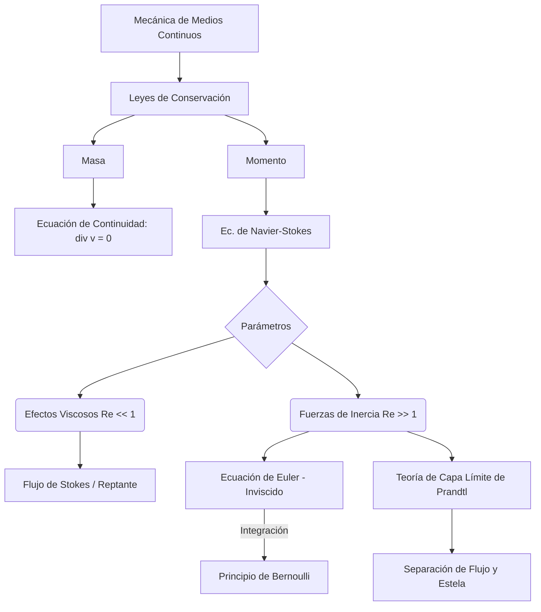

# Dinámica de Fluidos

La dinámica de fluidos estudia cómo se mueven líquidos y gases bajo la acción de fuerzas, gradientes de presión y condiciones de contorno. Es esencial para describir el flujo sanguíneo, la atmósfera, la aerodinámica, las tuberías, la oceanografía y una enorme cantidad de sistemas naturales y tecnológicos.

## 🧮 Desarrollo Teórico Profundo

El marco fundamental de la dinámica de fluidos está cimentado en la mecánica del medio continuo. El flujo puede analizarse desde dos perspectivas: Lagrangiana (siguiendo a partículas de fluido individuales en su trayectoria) y Euleriana (observando los campos de propiedades fijados en puntos del espacio). Usualmente, se emplea la descripción Euleriana, donde un flujo está completamente caracterizado por su campo de velocidad $\vec{v}(\vec{r},t)$, densidad $\rho(\vec{r},t)$ y presión $p(\vec{r},t)$.

### 1. Conservación de Masa: La Ecuación de Continuidad

Para un volumen de control arbitrario $V$ encerrado por una superficie $S$, la tasa de cambio de la masa total dentro de $V$ debe ser igual al flujo neto de masa que atraviesa $S$. Por el teorema de la divergencia, esta conservación macroscópica se traduce a una ecuación diferencial local:
$$ \frac{\partial \rho}{\partial t} + \nabla \cdot (\rho \vec{v}) = 0 $$
Esta ecuación es la **Ecuación de Continuidad**. Si el fluido es incompresible (su densidad no varía a lo largo de las trayectorias del flujo, la derivada material $D\rho/Dt = 0$), y si la densidad es uniforme en el espacio, la ecuación se reduce a la condición de incompresibilidad:
$$ \nabla \cdot \vec{v} = 0 $$
Esto implica que el campo de velocidad es solenoidal.

### 2. Conservación del Momento: Ecuaciones de Navier-Stokes

La Segunda Ley de Newton aplicada a un elemento de fluido establece que la tasa de cambio del momento equivale a la suma de fuerzas superficiales (presión, esfuerzos viscosos) y de volumen (gravedad).
La aceleración total de un paquete de fluido en el formalismo Euleriano se expresa mediante la **derivada convectiva o material**:
$$ \frac{D\vec{v}}{Dt} = \frac{\partial \vec{v}}{\partial t} + (\vec{v} \cdot \nabla) \vec{v} $$
El término convectivo $(\vec{v} \cdot \nabla) \vec{v}$ introduce una severa no-linealidad matemática en el análisis del flujo. Igualando la masa por aceleración a las fuerzas por unidad de volumen, se obtiene la forma completa de las **Ecuaciones de Navier-Stokes** para fluidos incompresibles:
$$ \rho \left( \frac{\partial \vec{v}}{\partial t} + (\vec{v} \cdot \nabla) \vec{v} \right) = -\nabla p + \mu \nabla^2 \vec{v} + \rho \vec{g} $$
donde $\mu$ es la viscosidad dinámica del fluido, y $\nu = \mu/\rho$ es la viscosidad cinemática. 
El término $-\nabla p$ representa las fuerzas de presión, $\mu \nabla^2 \vec{v}$ modela la fricción o difusión de momento viscoso, y $\rho \vec{g}$ son las fuerzas del cuerpo exterior.

### 3. Fluido Ideal y la Ecuación de Euler

Si los efectos de la fricción viscosa son despreciables ($\mu \approx 0$), el fluido se considera "ideal" o "inviscido". La ecuación de Navier-Stokes se simplifica a la **Ecuación de Euler**:
$$ \rho \left( \frac{\partial \vec{v}}{\partial t} + (\vec{v} \cdot \nabla) \vec{v} \right) = -\nabla p + \rho \vec{g} $$
Aunque esta aproximación ignora efectos esenciales como las capas límite, el desprendimiento de vórtices y la turbulencia, es extraordinariamente útil para calcular la distribución de presiones en aerodinámica y en el flujo principal libre de fronteras sólidas.

### 4. Integración de Euler: La Ecuación de Bernoulli

Bajo hipótesis restrictivas: (1) flujo estacionario ($\partial \vec{v}/\partial t = 0$), (2) incompresible ($\rho = \text{cte}$), (3) invíscido (fluido ideal), y (4) irrotacional ($\nabla \times \vec{v} = 0$) o integrado exclusivamente a lo largo de una única línea de corriente, la ecuación de Euler puede integrarse espacialmente para obtener el **Principio de Bernoulli**:
$$ p + \frac{1}{2}\rho |\vec{v}|^2 + \rho g z = \text{constante} $$
Esta constante es uniforme en toda la línea de corriente (o en todo el campo, si es irrotacional). Esta ecuación representa la conservación de la densidad de energía a lo largo del flujo fluido.

### 5. Análisis Dimensional y Número de Reynolds

Una técnica poderosa en dinámica de fluidos es la adimensionalización de las ecuaciones rectoras. Definiendo magnitudes características, como una velocidad $V_0$ y una longitud $L$, introducimos variables adimensionales: $\vec{v}^* = \vec{v}/V_0$, $\vec{r}^* = \vec{r}/L$, $t^* = t(V_0/L)$, etc. 
La ecuación de Navier-Stokes toma la forma:
$$ \frac{\partial \vec{v}^*}{\partial t^*} + (\vec{v}^* \cdot \nabla^*) \vec{v}^* = -\nabla^* p^* + \frac{1}{\text{Re}} \nabla^{*2} \vec{v}^* + \frac{1}{\text{Fr}^2} \vec{g}^* $$
El término no lineal es gobernado por el parámetro adimensional dominante, el **Número de Reynolds**:
$$ \text{Re} = \frac{\rho V_0 L}{\mu} $$
Representa la relación entre fuerzas inerciales $(\rho V_0^2/L)$ y fuerzas viscosas $(\mu V_0/L^2)$. 
- $\text{Re} \ll 1$: Flujo de Stokes o reptante. La viscosidad domina la inercia (ej. microorganismos).
- $\text{Re} \gg 1$: Régimen invíscido o inercial, con capas límite delgadas (ej. aviones y barcos).
- En el régimen inercial, la desestabilización del flujo a altos Reynolds conduce a la **Turbulencia**, caracterizada por el intercambio de energía caótico y transferencia de masa vortical a lo largo de la "cascada de Kolmogorov".



## 📝 Guía de Ejercicios Resueltos

**Problema 1: Ecuación de Continuidad en Coordenadas Cilíndricas**
Compruebe si el campo de velocidades $\vec{v} = (kr) \hat{r} + (-2kz) \hat{z}$ en coordenadas cilíndricas satisface la ecuación de continuidad para un fluido incompresible y estacionario. Encuentre la función de corriente si existe.

**Solución paso a paso:**
1. Ecuación de continuidad incompresible: $\nabla \cdot \vec{v} = 0$.
2. En coordenadas cilíndricas $(r, \theta, z)$: $\nabla \cdot \vec{v} = \frac{1}{r} \frac{\partial (r v_r)}{\partial r} + \frac{1}{r} \frac{\partial v_\theta}{\partial \theta} + \frac{\partial v_z}{\partial z}$.
3. Sustituyendo $v_r = kr$, $v_\theta = 0$, $v_z = -2kz$:
   $\nabla \cdot \vec{v} = \frac{1}{r} \frac{\partial (k r^2)}{\partial r} + 0 + \frac{\partial (-2kz)}{\partial z} = \frac{1}{r} (2kr) - 2k = 2k - 2k = 0$.
4. Como la divergencia es cero, el campo es incompresible.
5. Existe una función de corriente de Stokes $\psi(r,z)$ tal que $v_r = -\frac{1}{r}\frac{\partial \psi}{\partial z}$ y $v_z = \frac{1}{r}\frac{\partial \psi}{\partial r}$.
6. Integrando $v_r = kr \implies -\frac{\partial \psi}{\partial z} = k r^2 \implies \psi = -k r^2 z + f(r)$.
7. Derivando respecto a $r$: $v_z = \frac{1}{r} \frac{\partial \psi}{\partial r} = \frac{1}{r} (-2krz + f'(r)) = -2kz + \frac{f'(r)}{r}$.
8. Como $v_z = -2kz$, entonces $f'(r) = 0$, por lo que $f(r) = C$. Tomamos $C=0$. La función de corriente es $\psi = -k r^2 z$.

**Problema 2: Teorema de Transporte de Reynolds**
Considere un chorro de agua de área transversal $A$ y velocidad $V$ que impacta normalmente contra una placa plana móvil que se aleja con velocidad $U$ ($U < V$). Calcule la fuerza ejercida sobre la placa.

**Solución paso a paso:**
1. Tomamos un volumen de control (VC) adherido a la placa, por lo que se mueve a velocidad $U$.
2. La velocidad relativa del fluido respecto al VC es $V_{rel} = V - U$.
3. El caudal másico que entra al VC es $\dot{m} = \rho A V_{rel} = \rho A (V - U)$.
4. El fluido impacta y sale paralelo a la placa. En el sistema de referencia de la placa, la velocidad de salida en la dirección normal (x) es 0.
5. Aplicamos la conservación del momento lineal en $x$: $\sum F_x = \frac{\partial}{\partial t} \int_{VC} v_x \rho dV + \int_{SC} v_x (\rho \vec{v}_{rel} \cdot d\vec{A})$.
6. Para flujo estacionario, el término temporal es cero.
7. El flujo de momento neto es $\dot{m}_{out} v_{x,out} - \dot{m}_{in} v_{x,in} = 0 - \dot{m} (V - U) = -\rho A (V - U)^2$.
8. La fuerza sobre el fluido es $F_{fluido} = -\rho A (V - U)^2$. Por la tercera ley de Newton, la fuerza sobre la placa es $F = \rho A (V - U)^2$.

**Problema 3: Vórtice de Rankine**
Un modelo de vórtice tiene una velocidad tangencial dada por $v_\theta = \omega r$ para $r \leq R$ (núcleo sólido) y $v_\theta = \frac{\Gamma}{2\pi r}$ para $r > R$ (vórtice irrotacional). Para que la velocidad sea continua, encuentre $\Gamma$ y la distribución de presión $P(r)$ si $P(\infty) = P_0$.

**Solución paso a paso:**
1. Continuidad en $r=R$: $\omega R = \frac{\Gamma}{2\pi R} \implies \Gamma = 2\pi \omega R^2$.
2. Usamos la ecuación de Euler en dirección radial: $\frac{dP}{dr} = \frac{\rho v_\theta^2}{r}$.
3. Para la zona externa ($r > R$): $\frac{dP}{dr} = \rho \frac{\Gamma^2}{4\pi^2 r^3} = \rho \frac{\omega^2 R^4}{r^3}$.
   Integrando de $r$ a $\infty$: $P(\infty) - P(r) = \rho \omega^2 R^4 \left[ -\frac{1}{2r^2} \right]_r^\infty = \frac{\rho \omega^2 R^4}{2r^2}$.
   $P_{ext}(r) = P_0 - \frac{\rho \omega^2 R^4}{2r^2}$.
4. Presión en $r=R$: $P(R) = P_0 - \frac{1}{2}\rho \omega^2 R^2$.
5. Para la zona interna ($r \leq R$): $\frac{dP}{dr} = \frac{\rho (\omega r)^2}{r} = \rho \omega^2 r$.
   Integrando de $r$ a $R$: $P(R) - P(r) = \frac{1}{2}\rho \omega^2 (R^2 - r^2)$.
   $P_{int}(r) = P(R) - \frac{1}{2}\rho \omega^2 (R^2 - r^2) = P_0 - \frac{1}{2}\rho \omega^2 R^2 - \frac{1}{2}\rho \omega^2 R^2 + \frac{1}{2}\rho \omega^2 r^2$.
6. Simplificando: $P_{int}(r) = P_0 - \rho \omega^2 R^2 + \frac{1}{2}\rho \omega^2 r^2$.

## 💻 Simulaciones Computacionales

Resolución numérica de las Ecuaciones de Navier-Stokes en 2D para el clásico problema de "Cavidad impulsada por tapa" (Lid-driven cavity) usando diferencias finitas.

```python
import numpy as np
import matplotlib.pyplot as plt

nx, ny = 41, 41
nt = 100
nit = 50
dx = 2 / (nx - 1)
dy = 2 / (ny - 1)
x = np.linspace(0, 2, nx)
y = np.linspace(0, 2, ny)
X, Y = np.meshgrid(x, y)

rho = 1.0
nu = 0.1
dt = 0.001

u = np.zeros((ny, nx))
v = np.zeros((ny, nx))
p = np.zeros((ny, nx))
b = np.zeros((ny, nx))

def build_up_b(b, rho, dt, u, v, dx, dy):
    b[1:-1, 1:-1] = (rho * (1 / dt * 
                    ((u[1:-1, 2:] - u[1:-1, 0:-2]) / (2 * dx) + 
                     (v[2:, 1:-1] - v[0:-2, 1:-1]) / (2 * dy)) -
                    ((u[1:-1, 2:] - u[1:-1, 0:-2]) / (2 * dx))**2 -
                    2 * ((u[2:, 1:-1] - u[0:-2, 1:-1]) / (2 * dy) *
                         (v[1:-1, 2:] - v[1:-1, 0:-2]) / (2 * dx)) -
                    ((v[2:, 1:-1] - v[0:-2, 1:-1]) / (2 * dy))**2))
    return b

def pressure_poisson(p, dx, dy, b):
    pn = np.empty_like(p)
    for _ in range(nit):
        pn = p.copy()
        p[1:-1, 1:-1] = (((pn[1:-1, 2:] + pn[1:-1, 0:-2]) * dy**2 + 
                          (pn[2:, 1:-1] + pn[0:-2, 1:-1]) * dx**2) /
                         (2 * (dx**2 + dy**2)) -
                         dx**2 * dy**2 / (2 * (dx**2 + dy**2)) * b[1:-1, 1:-1])
        # Condiciones de borde para presión
        p[:, -1] = p[:, -2] ; p[0, :] = p[1, :]
        p[:, 0] = p[:, 1]   ; p[-1, :] = 0
    return p

for _ in range(nt):
    un = u.copy()
    vn = v.copy()
    b = build_up_b(b, rho, dt, u, v, dx, dy)
    p = pressure_poisson(p, dx, dy, b)
    
    u[1:-1, 1:-1] = (un[1:-1, 1:-1] -
                     un[1:-1, 1:-1] * dt / dx * (un[1:-1, 1:-1] - un[1:-1, 0:-2]) -
                     vn[1:-1, 1:-1] * dt / dy * (un[1:-1, 1:-1] - un[0:-2, 1:-1]) -
                     dt / (2 * rho * dx) * (p[1:-1, 2:] - p[1:-1, 0:-2]) +
                     nu * (dt / dx**2 * (un[1:-1, 2:] - 2 * un[1:-1, 1:-1] + un[1:-1, 0:-2]) +
                           dt / dy**2 * (un[2:, 1:-1] - 2 * un[1:-1, 1:-1] + un[0:-2, 1:-1])))
                           
    v[1:-1, 1:-1] = (vn[1:-1, 1:-1] -
                     un[1:-1, 1:-1] * dt / dx * (vn[1:-1, 1:-1] - vn[1:-1, 0:-2]) -
                     vn[1:-1, 1:-1] * dt / dy * (vn[1:-1, 1:-1] - vn[0:-2, 1:-1]) -
                     dt / (2 * rho * dy) * (p[2:, 1:-1] - p[0:-2, 1:-1]) +
                     nu * (dt / dx**2 * (vn[1:-1, 2:] - 2 * vn[1:-1, 1:-1] + vn[1:-1, 0:-2]) +
                           dt / dy**2 * (vn[2:, 1:-1] - 2 * vn[1:-1, 1:-1] + vn[0:-2, 1:-1])))
    
    # Borde de lid-driven cavity
    u[0, :] = 0; u[:, 0] = 0; u[:, -1] = 0; u[-1, :] = 1
    v[0, :] = 0; v[-1, :] = 0; v[:, 0] = 0; v[:, -1] = 0

plt.figure(figsize=(7, 5))
plt.contourf(X, Y, p, alpha=0.5, cmap='viridis')
plt.colorbar(label="Presión")
plt.streamplot(X, Y, u, v, color='black')
plt.title("Lid-Driven Cavity: Flujo bidimensional de Navier-Stokes")
plt.xlabel("X"); plt.ylabel("Y")
plt.show()
```

## 🚀 Fronteras de Investigación y Problemas Abiertos

El mayor problema abierto en dinámica de fluidos en 2026 sigue siendo la **Existencia y Suavidad de las Ecuaciones de Navier-Stokes** (un Problema del Milenio). Más allá de las matemáticas puras, la frontera física se halla en la "disipación anómala" en turbulencia: la idea de que los fluidos reales disipan energía cinemática incluso en el límite donde la viscosidad tiende a cero. Otros campos de vanguardia incluyen la magnetohidrodinámica (MHD) para confinamiento de plasma en reactores de fusión comercial (tokamaks) y flujos hipersónicos, donde los modelos fluidos clásicos fallan y deben acoplarse con la física cuántica de disociación molecular del aire.

## 📐 Formalismo Matemático Avanzado (Nivel Posgrado/Doctorado)

A un nivel doctoral, la dinámica de fluidos de Euler para fluidos incompresibles ideales fue reformulada geométricamente por V. Arnold como el **flujo geodésico sobre el grupo de difeomorfismos que preservan el volumen**. Sea $\text{SDiff}(M)$ el grupo de Lie de difeomorfismos sobre una variedad Riemanniana $M$. La métrica Riemanniana a derecha invariante sobre este espacio de dimensión infinita está inducida por la energía cinética del fluido:
$$ \langle X, Y \rangle = \int_M g(X(x), Y(x)) d\mu $$
Las ecuaciones de Euler emergen espectacularmente como la ecuación geodésica estricta sobre este grupo de Lie:
$$ \nabla_{\dot{\eta}} \dot{\eta} = 0 $$
donde $\eta(t) \in \text{SDiff}(M)$ es la posición Lagrangiana del fluido en el tiempo $t$. Las inestabilidades fluidas (como Rayleigh-Taylor) se traducen en curvaturas seccionales negativas de esta métrica en $\text{SDiff}(M)$, implicando que las geodésicas (las trayectorias de los campos de velocidad) divergen exponencialmente, formalizando matemáticamente el caos en fluidos ideales.

## 📚 Recursos Específicos

### Cursos Recomendados
1. [Advanced Fluid Dynamics (MIT OpenCourseWare)](https://ocw.mit.edu/courses/mechanical-engineering/2-25-advanced-fluid-mechanics-fall-2013/)
2. [Introduction to Fluid Dynamics (Coursera)](https://www.coursera.org/learn/fluid-dynamics)
3. [Computational Fluid Dynamics (edX)](https://www.edx.org/course/computational-fluid-dynamics)

### Artículos y Simulaciones
1. **Hydrodynamica, sive De viribus et motibus fluidorum commentarii (Daniel Bernoulli, 1738)**
   - **Enlace:** [https://archive.org/details/hydrodynamica00bern](https://archive.org/details/hydrodynamica00bern)
   - **Importancia Teórica:** La obra magna que fundó la hidrodinámica moderna, estableciendo la relación inversa entre la presión y la velocidad del fluido.
   - **Fondo Matemático:** Deriva la conservación de la energía en una línea de corriente para flujos incompresibles e invíscidos (viscosidad nula):
     $$
     \frac{v^2}{2} + g z + \frac{p}{\rho} = \text{constante}
     $$
   - **Implicaciones Físicas:** Demuestra cómo la energía potencial elástica de la presión se convierte dinámicamente en energía cinética, un principio clave para la aviación y medición de flujo.

2. **On the Equations of Motion of a Viscous Fluid (G.G. Stokes, 1845)**
   - **Enlace:** [https://royalsocietypublishing.org/](https://royalsocietypublishing.org/)
   - **Importancia Teórica:** Formalizó de manera definitiva las ecuaciones de Navier-Stokes, incorporando correctamente el tensor de tensiones viscosas para fluidos newtonianos.
   - **Fondo Matemático:** Establece la conservación del momento (segunda ley de Newton continua) bajo fricción interna:
     $$
     \rho \left( \frac{\partial \mathbf{v}}{\partial t} + \mathbf{v} \cdot \nabla \mathbf{v} \right) = -\nabla p + \mu \nabla^2 \mathbf{v} + \rho \mathbf{g}
     $$
   - **Implicaciones Físicas:** Forma el pilar absoluto de la dinámica de fluidos realista moderna, gobernando desde la circulación oceánica hasta el flujo de aire aerodinámico turbulento.

3. **The Theory of Homogeneous Turbulence (G.K. Batchelor, 1953)**
   - **Enlace:** [https://www.amazon.com/Theory-Homogeneous-Turbulence-Cambridge-Science/dp/0521041171](https://www.amazon.com/Theory-Homogeneous-Turbulence-Cambridge-Science/dp/0521041171)
   - **Importancia Teórica:** Sintetiza los avances estadísticos fenomenológicos (como Kolmogorov K41) para dar un marco tratable a la turbulencia.
   - **Fondo Matemático:** Estudia el espectro de energía $E(k)$ en función del número de onda, dictando la cascada inercial de energía desde vórtices grandes a pequeños donde se disipa por viscosidad cinemática $\nu$:
     $$
     E(k) = C \varepsilon^{2/3} k^{-5/3}
     $$
   - **Implicaciones Físicas:** Ofrece la comprensión teórica estadística para problemas intratables analíticamente de caos determinista, fundamentales para los modelos subgrilla en CFD (Computational Fluid Dynamics).

### 📖 Referencias Útiles y Bibliografía
1. [Fluid Mechanics (L.D. Landau y E.M. Lifshitz)](https://www.amazon.com/Fluid-Mechanics-Second-Theoretical-Physics/dp/0080339336)
2. [Fluid Mechanics (Pijush K. Kundu, Ira M. Cohen)](https://www.amazon.com/Fluid-Mechanics-Pijush-K-Kundu/dp/012405935X)
