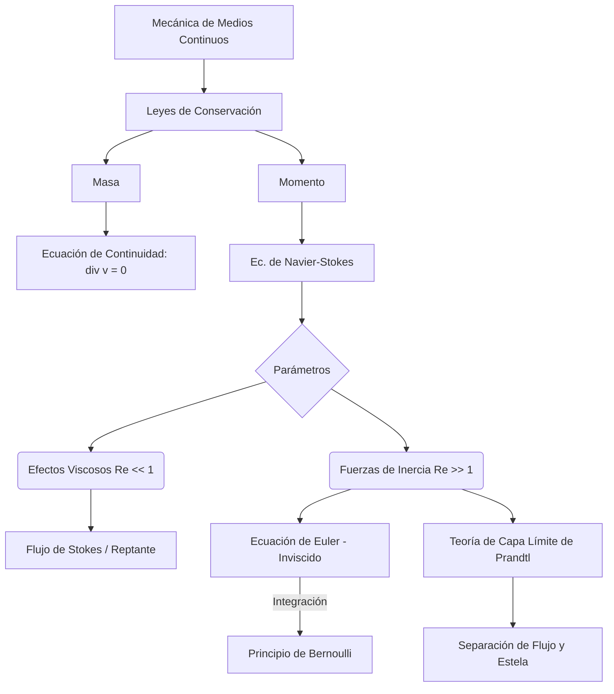

# Dinámica de Fluidos

La dinámica de fluidos estudia cómo se mueven líquidos y gases bajo la acción de fuerzas, gradientes de presión y condiciones de contorno. Es esencial para describir el flujo sanguíneo, la atmósfera, la aerodinámica, las tuberías, la oceanografía y una enorme cantidad de sistemas naturales y tecnológicos.

## 🧮 Desarrollo Teórico Profundo

El marco fundamental de la dinámica de fluidos está cimentado en la mecánica del medio continuo. El flujo puede analizarse desde dos perspectivas: Lagrangiana (siguiendo a partículas de fluido individuales en su trayectoria) y Euleriana (observando los campos de propiedades fijados en puntos del espacio). Usualmente, se emplea la descripción Euleriana, donde un flujo está completamente caracterizado por su campo de velocidad $\vec{v}(\vec{r},t)$, densidad $\rho(\vec{r},t)$ y presión $p(\vec{r},t)$.

### 1. Conservación de Masa: La Ecuación de Continuidad

Para un volumen de control arbitrario $V$ encerrado por una superficie $S$, la tasa de cambio de la masa total dentro de $V$ debe ser igual al flujo neto de masa que atraviesa $S$. Por el teorema de la divergencia, esta conservación macroscópica se traduce a una ecuación diferencial local:
$$ \frac{\partial \rho}{\partial t} + \nabla \cdot (\rho \vec{v}) = 0 $$
Esta ecuación es la **Ecuación de Continuidad**. Si el fluido es incompresible (su densidad no varía a lo largo de las trayectorias del flujo, la derivada material $D\rho/Dt = 0$), y si la densidad es uniforme en el espacio, la ecuación se reduce a la condición de incompresibilidad:
$$ \nabla \cdot \vec{v} = 0 $$
Esto implica que el campo de velocidad es solenoidal.

### 2. Conservación del Momento: Ecuaciones de Navier-Stokes

La Segunda Ley de Newton aplicada a un elemento de fluido establece que la tasa de cambio del momento equivale a la suma de fuerzas superficiales (presión, esfuerzos viscosos) y de volumen (gravedad).
La aceleración total de un paquete de fluido en el formalismo Euleriano se expresa mediante la **derivada convectiva o material**:
$$ \frac{D\vec{v}}{Dt} = \frac{\partial \vec{v}}{\partial t} + (\vec{v} \cdot \nabla) \vec{v} $$
El término convectivo $(\vec{v} \cdot \nabla) \vec{v}$ introduce una severa no-linealidad matemática en el análisis del flujo. Igualando la masa por aceleración a las fuerzas por unidad de volumen, se obtiene la forma completa de las **Ecuaciones de Navier-Stokes** para fluidos incompresibles:
$$ \rho \left( \frac{\partial \vec{v}}{\partial t} + (\vec{v} \cdot \nabla) \vec{v} \right) = -\nabla p + \mu \nabla^2 \vec{v} + \rho \vec{g} $$
donde $\mu$ es la viscosidad dinámica del fluido, y $\nu = \mu/\rho$ es la viscosidad cinemática. 
El término $-\nabla p$ representa las fuerzas de presión, $\mu \nabla^2 \vec{v}$ modela la fricción o difusión de momento viscoso, y $\rho \vec{g}$ son las fuerzas del cuerpo exterior.

### 3. Fluido Ideal y la Ecuación de Euler

Si los efectos de la fricción viscosa son despreciables ($\mu \approx 0$), el fluido se considera "ideal" o "inviscido". La ecuación de Navier-Stokes se simplifica a la **Ecuación de Euler**:
$$ \rho \left( \frac{\partial \vec{v}}{\partial t} + (\vec{v} \cdot \nabla) \vec{v} \right) = -\nabla p + \rho \vec{g} $$
Aunque esta aproximación ignora efectos esenciales como las capas límite, el desprendimiento de vórtices y la turbulencia, es extraordinariamente útil para calcular la distribución de presiones en aerodinámica y en el flujo principal libre de fronteras sólidas.

### 4. Integración de Euler: La Ecuación de Bernoulli

Bajo hipótesis restrictivas: (1) flujo estacionario ($\partial \vec{v}/\partial t = 0$), (2) incompresible ($\rho = \text{cte}$), (3) invíscido (fluido ideal), y (4) irrotacional ($\nabla \times \vec{v} = 0$) o integrado exclusivamente a lo largo de una única línea de corriente, la ecuación de Euler puede integrarse espacialmente para obtener el **Principio de Bernoulli**:
$$ p + \frac{1}{2}\rho |\vec{v}|^2 + \rho g z = \text{constante} $$
Esta constante es uniforme en toda la línea de corriente (o en todo el campo, si es irrotacional). Esta ecuación representa la conservación de la densidad de energía a lo largo del flujo fluido.

### 5. Análisis Dimensional y Número de Reynolds

Una técnica poderosa en dinámica de fluidos es la adimensionalización de las ecuaciones rectoras. Definiendo magnitudes características, como una velocidad $V_0$ y una longitud $L$, introducimos variables adimensionales: $\vec{v}^* = \vec{v}/V_0$, $\vec{r}^* = \vec{r}/L$, $t^* = t(V_0/L)$, etc. 
La ecuación de Navier-Stokes toma la forma:
$$ \frac{\partial \vec{v}^*}{\partial t^*} + (\vec{v}^* \cdot \nabla^*) \vec{v}^* = -\nabla^* p^* + \frac{1}{\text{Re}} \nabla^{*2} \vec{v}^* + \frac{1}{\text{Fr}^2} \vec{g}^* $$
El término no lineal es gobernado por el parámetro adimensional dominante, el **Número de Reynolds**:
$$ \text{Re} = \frac{\rho V_0 L}{\mu} $$
Representa la relación entre fuerzas inerciales $(\rho V_0^2/L)$ y fuerzas viscosas $(\mu V_0/L^2)$. 
- $\text{Re} \ll 1$: Flujo de Stokes o reptante. La viscosidad domina la inercia (ej. microorganismos).
- $\text{Re} \gg 1$: Régimen invíscido o inercial, con capas límite delgadas (ej. aviones y barcos).
- En el régimen inercial, la desestabilización del flujo a altos Reynolds conduce a la **Turbulencia**, caracterizada por el intercambio de energía caótico y transferencia de masa vortical a lo largo de la "cascada de Kolmogorov".

## 📚 Recursos
### Cursos Específicos
1. ["Introduction to Fluid Dynamics" - Coursera](https://www.coursera.org/learn/fluid-dynamics)
2. ["Advanced Fluid Dynamics" - MIT OpenCourseWare](https://ocw.mit.edu/courses/mechanical-engineering/2-25-advanced-fluid-mechanics-fall-2013/)
3. ["Computational Fluid Dynamics" - edX](https://www.edx.org/course/computational-fluid-dynamics)
4. ["Fluid Mechanics and Its Applications" - NPTEL](https://nptel.ac.in/courses/112105171)
5. ["Astrophysical Fluid Dynamics" - Coursera](https://www.coursera.org/learn/astrophysics)
6. ["Aerodynamics and Fluid Flow" - Udemy](https://www.udemy.com/course/aerodynamics/)

### Artículos y Simulaciones
1. ["Hydrodynamica" - Daniel Bernoulli](https://archive.org/details/hydrodynamica00bern)
2. ["On the Equations of Motion of a Viscous Fluid" - G.G. Stokes](https://royalsocietypublishing.org/)
3. [OpenFOAM Tutorials and Simulations](https://www.openfoam.com/documentation/tutorial-guide)
4. [PhET Fluid Pressure and Flow Simulation](https://phet.colorado.edu/en/simulations/fluid-pressure-and-flow)
5. [Ansys Fluent Basic Simulations Guide](https://www.ansys.com/products/fluids/ansys-fluent)
6. ["The Theory of Homogeneous Turbulence" - G.K. Batchelor](https://www.amazon.com/Theory-Homogeneous-Turbulence-Cambridge-Science/dp/0521041171)
7. [CFD Online Reference Flow Problems](https://www.cfd-online.com/)
8. [NASA's FoilSim educational software](https://www.grc.nasa.gov/WWW/K-12/FoilSim/index.html)
9. ["A Mathematical Theory of Fluid Mechanics" - J. Serrin](https://link.springer.com/chapter/10.1007/978-3-642-46015-9_3)
10. ["Visualized Fluid Dynamics" - National Committee for Fluid Mechanics Films](http://web.mit.edu/hml/ncfmf.html)

### 📖 Referencias Útiles y Bibliografía
1. [*Fluid Mechanics* - L.D. Landau y E.M. Lifshitz](https://www.amazon.com/Fluid-Mechanics-Second-Theoretical-Physics/dp/0080339336)
2. [*Fluid Mechanics* - Pijush K. Kundu, Ira M. Cohen](https://www.amazon.com/Fluid-Mechanics-Pijush-K-Kundu/dp/012405935X)
3. [*An Introduction to Fluid Dynamics* - G.K. Batchelor](https://www.amazon.com/Introduction-Fluid-Dynamics-Cambridge-Mathematical/dp/0521663962)
4. [*Introduction to Fluid Mechanics* - R.W. Fox, A.T. McDonald](https://www.amazon.com/Fox-McDonalds-Introduction-Fluid-Mechanics/dp/1119616175)
