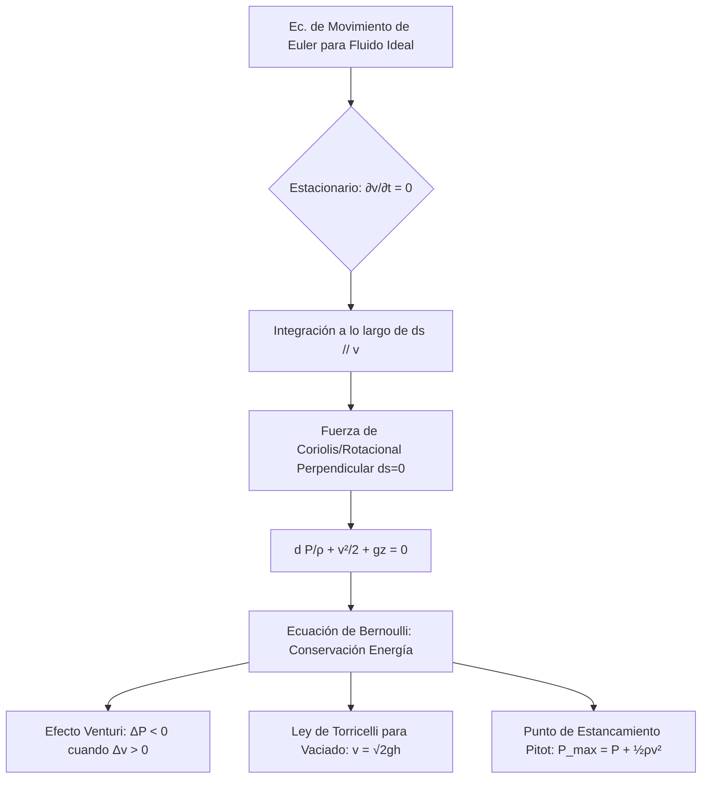

# Dinámica de Fluidos y Ecuación de Bernoulli
La dinámica de fluidos estudia los fluidos en movimiento. Analiza magnitudes como velocidad, presión, densidad y temperatura en función de la posición y el tiempo, basándose en leyes de conservación (masa, energía, momento).

## 📜 Contexto Histórico
Leonhard Euler formuló las ecuaciones básicas del movimiento de los fluidos no viscosos en el siglo XVIII. Daniel Bernoulli, en su obra "Hydrodynamica" de 1738, estableció el famoso principio que lleva su nombre. Posteriormente, Navier y Stokes agregaron términos de fricción viscosa para formar las Ecuaciones de Navier-Stokes en el siglo XIX.

## 🧮 Desarrollo Teórico Profundo

La ecuación de Bernoulli no es una postulación axiomática, sino un teorema de conservación de energía derivado de la ecuación de conservación de cantidad de movimiento del fluido ideal (la ecuación de Euler).

### 1. Integración de la Ecuación de Euler a lo largo de una línea de corriente

Comenzamos con la ecuación diferencial de Euler para el movimiento de un fluido ideal invíscido y de densidad constante $\rho$, bajo un campo de fuerza externo conservativo, que en nuestro caso será el campo gravitatorio (cuyo potencial es $\phi = gz$):
$$ \frac{\partial \vec{v}}{\partial t} + (\vec{v} \cdot \nabla) \vec{v} = -\frac{1}{\rho} \nabla p - \nabla (gz) $$
Utilizamos la identidad del cálculo vectorial: $(\vec{v} \cdot \nabla) \vec{v} = \frac{1}{2} \nabla (\vec{v} \cdot \vec{v}) - \vec{v} \times (\nabla \times \vec{v})$. 
Definimos la vorticidad del flujo como $\vec{\omega} = \nabla \times \vec{v}$. Sustituyendo esto en la ecuación:
$$ \frac{\partial \vec{v}}{\partial t} + \frac{1}{2} \nabla (v^2) - \vec{v} \times \vec{\omega} = -\frac{1}{\rho} \nabla p - \nabla (gz) $$
Reagrupando los términos que son gradientes exactos a un lado:
$$ \frac{\partial \vec{v}}{\partial t} - \vec{v} \times \vec{\omega} = - \nabla \left( \frac{p}{\rho} + \frac{v^2}{2} + gz \right) $$

**Suposición de Flujo Estacionario:**
Para un flujo permanente donde las condiciones no cambian en un punto temporalmente, $\frac{\partial \vec{v}}{\partial t} = 0$:
$$ \vec{v} \times \vec{\omega} = \nabla \left( \frac{p}{\rho} + \frac{v^2}{2} + gz \right) $$

**Evaluación a lo largo de una línea de corriente:**
Una línea de corriente es, por definición, paralela a la velocidad $\vec{v}$ en todo momento. Por lo tanto, el diferencial de desplazamiento $d\vec{r}$ a lo largo de una línea de corriente es paralelo a $\vec{v}$. Tomando el producto escalar de la ecuación con $d\vec{r}$:
$$ d\vec{r} \cdot (\vec{v} \times \vec{\omega}) = d\vec{r} \cdot \nabla \left( \frac{p}{\rho} + \frac{v^2}{2} + gz \right) $$
Ya que $\vec{v}$ y $d\vec{r}$ son paralelos, el producto mixto de la izquierda es matemáticamente cero: $\vec{v} \times \vec{\omega}$ es ortogonal a $\vec{v}$, y por tanto es ortogonal a $d\vec{r}$.
El término de la derecha es, por definición del diferencial exacto, $d \left( \frac{p}{\rho} + \frac{v^2}{2} + gz \right)$.
Por tanto, llegamos a:
$$ d \left( \frac{p}{\rho} + \frac{v^2}{2} + gz \right) = 0 $$
Al integrar, obtenemos la **Ecuación de Bernoulli**:
$$ p + \frac{1}{2} \rho v^2 + \rho g z = H = \text{constante} $$
Esta constante $H$ (la presión total o cabeza de Bernoulli) permanece invariante **a lo largo de una línea de corriente particular**. Si además el flujo inicial fuera irrotacional ($\vec{\omega} = \nabla \times \vec{v} = 0$ en todos lados), la constante sería idéntica para todas las líneas de corriente de todo el campo de flujo de manera universal.

### 2. Significado Físico de los Términos (Componentes de Presión)

La ecuación afirma una verdad conservativa que la densidad de energía en el interior del fluido circulante es constante. Sus tres términos son interpretables como componentes de "presión":
1. **Presión Estática ($p$):** La presión termodinámica isotrópica real del fluido sobre un elemento en co-movimiento.
2. **Presión Dinámica ($q = \frac{1}{2} \rho v^2$):** Es representativa de la energía cinética del fluido en movimiento. Si el fluido detuviera completamente su avance de manera isentrópica (punto de estancamiento), toda esta presión pasaría a convertirse mecánicamente en estática.
3. **Presión Hidrostática ($\rho g z$):** La energía de potencial gravitatorio atribuible a la altura o carga de elevación.

### 3. Consecuencias Clave

1. **Efecto Venturi:** Si una tubería se estrecha, la ecuación de continuidad ($A_1 v_1 = A_2 v_2$) obliga al fluido incompresible a aumentar su velocidad en el estrechamiento ($v_2 > v_1$). Por la Ecuación de Bernoulli (en $z_1 = z_2$), la constancia impone inexorablemente que $p_2 < p_1$. Es decir, **donde la velocidad es mayor, la presión se deprime severamente**.
2. **Medición con Tubo de Pitot:** Enfrentando un tubo hacia el flujo (donde $v_2 = 0$, punto de estancamiento) respecto de la presión estática ambiente $p_1$, se puede aislar la velocidad del flujo no perturbado: $v_1 = \sqrt{2(p_2 - p_1) / \rho}$.



## 🛠 Ejemplo Práctico
**Problema:** Por una tubería horizontal fluye agua. En la sección ancha, el diámetro es de $ 10 \text{ cm} $, la presión es de $ 1.5 \times 10^5 \text{ Pa} $ y la velocidad es de $ 2 \text{ m/s} $. La tubería se estrecha a un diámetro de $ 5 \text{ cm} $. Calcula la velocidad y la presión en la sección estrecha. ($ \rho_{\text{agua}} = 1000 \text{ kg/m}^3 $).

**Solución paso a paso:**
1. Áreas de las secciones:
   $$ A_1 = \pi (0.05 \text{ m})^2 = 0.0025\pi \text{ m}^2 $$
   $$ A_2 = \pi (0.025 \text{ m})^2 = 0.000625\pi \text{ m}^2 $$
2. Usamos la ecuación de continuidad para hallar $ v_2 $:
   $ v_2 = v_1 \frac{A_1}{A_2} = 2 \frac{0.0025\pi}{0.000625\pi} = 2 \times 4 = 8 \text{ m/s} $.
3. Aplicamos Bernoulli. Como es horizontal, $ z_1 = z_2 $, por lo que el término $ \rho g z $ se cancela:
   $$ P_1 + \frac{1}{2} \rho v_1^2 = P_2 + \frac{1}{2} \rho v_2^2 $$
4. Despejamos $ P_2 $:
   $$ P_2 = P_1 + \frac{1}{2} \rho (v_1^2 - v_2^2) $$
   $$ P_2 = 1.5 \times 10^5 + \frac{1}{2} (1000) (2^2 - 8^2) $$
   $$ P_2 = 150000 + 500 (4 - 64) = 150000 + 500 (-60) $$
   $ P_2 = 150000 - 30000 = 120000 \text{ Pa} $ (O $ 1.2 \times 10^5 \text{ Pa} $).

## 📝 Guía de Ejercicios Resueltos

**Problema 1: Efecto Venturi con Fluido Compresible**
Considere el flujo isentrópico de un gas ideal ($\gamma = c_p/c_v$) a través de un tubo de Venturi. Deduzca la expresión exacta para el gasto másico $\dot{m}$ en función de las presiones de entrada $P_1$ y garganta $P_2$, y las áreas $A_1$, $A_2$.

**Solución paso a paso:**
1. Conservación de la masa: $\dot{m} = \rho_1 A_1 V_1 = \rho_2 A_2 V_2$.
2. Conservación de la energía (flujo isentrópico de gas ideal): $c_p T_1 + \frac{V_1^2}{2} = c_p T_2 + \frac{V_2^2}{2}$. Usando $c_p T = \frac{\gamma}{\gamma-1} \frac{P}{\rho}$, la ecuación de Bernoulli compresible es:
   $\frac{\gamma}{\gamma-1} \frac{P_1}{\rho_1} + \frac{V_1^2}{2} = \frac{\gamma}{\gamma-1} \frac{P_2}{\rho_2} + \frac{V_2^2}{2}$.
3. Relación isentrópica: $P_1 / \rho_1^\gamma = P_2 / \rho_2^\gamma \implies \rho_2 = \rho_1 (P_2/P_1)^{1/\gamma}$.
4. Expresamos $V_1$ usando continuidad: $V_1 = V_2 \frac{A_2}{A_1} \frac{\rho_2}{\rho_1} = V_2 \frac{A_2}{A_1} (P_2/P_1)^{1/\gamma}$.
5. Sustituyendo $V_1$ en Bernoulli y factorizando $V_2^2/2$:
   $\frac{V_2^2}{2} \left[ 1 - \left(\frac{A_2}{A_1}\right)^2 (P_2/P_1)^{2/\gamma} \right] = \frac{\gamma}{\gamma-1} \frac{P_1}{\rho_1} \left[ 1 - \frac{P_2}{P_1} \frac{\rho_1}{\rho_2} \right]$.
6. Sabiendo que $\frac{\rho_1}{\rho_2} = (P_2/P_1)^{-1/\gamma}$, el corchete de la derecha es $1 - (P_2/P_1)^{(\gamma-1)/\gamma}$.
7. Despejando $V_2$ e insertándolo en $\dot{m} = \rho_2 A_2 V_2 = A_2 \rho_1 (P_2/P_1)^{1/\gamma} V_2$, obtenemos la ecuación de de Saint-Venant y Wantzel:
   $\dot{m} = A_2 \sqrt{ \frac{2\gamma}{\gamma-1} P_1 \rho_1 \left[ (P_2/P_1)^{2/\gamma} - (P_2/P_1)^{(\gamma+1)/\gamma} \right] } \left[ 1 - \left(\frac{A_2}{A_1}\right)^2 (P_2/P_1)^{2/\gamma} \right]^{-1/2}$.

**Problema 2: Sifón con Fricción (Ecuación de Energía Generalizada)**
Un sifón transfiere agua de un depósito grande a una elevación inferior $H$. El tubo tiene diámetro $D$, longitud total $L$ y un factor de fricción de Darcy $f$. La cima del sifón está a altura $h$ por encima del depósito. Calcule la velocidad de salida y la presión mínima absoluta asumiendo flujo turbulento rugoso.

**Solución paso a paso:**
1. Ecuación de energía entre la superficie del depósito (1) y la salida libre (2):
   $\frac{P_1}{\gamma_w} + z_1 + \frac{V_1^2}{2g} = \frac{P_2}{\gamma_w} + z_2 + \frac{V_2^2}{2g} + h_L$.
2. $P_1 = P_2 = P_{atm}$. $z_1 = H$, $z_2 = 0$. $V_1 \approx 0$.
   La pérdida de carga es $h_L = f \frac{L}{D} \frac{V^2}{2g} + \sum K \frac{V^2}{2g}$ (ignoraremos pérdidas locales, $K=0$).
   $H = \frac{V^2}{2g} \left( 1 + f \frac{L}{D} \right) \implies V = \sqrt{ \frac{2gH}{1 + f(L/D)} }$.
3. La presión mínima ocurre en la cima del sifón (punto 3). Ecuación de energía entre 1 y 3 (longitud $L_1$ hasta la cima):
   $\frac{P_{atm}}{\gamma_w} + H + 0 = \frac{P_3}{\gamma_w} + (H+h) + \frac{V^2}{2g} + f \frac{L_1}{D} \frac{V^2}{2g}$.
4. Despejando $P_3$:
   $\frac{P_3}{\gamma_w} = \frac{P_{atm}}{\gamma_w} - h - \frac{V^2}{2g} \left( 1 + f \frac{L_1}{D} \right)$.
5. Sustituyendo $\frac{V^2}{2g} = \frac{H}{1 + f L/D}$, la presión mínima es:
   $P_3 = P_{atm} - \gamma_w \left[ h + H \left( \frac{1 + f L_1/D}{1 + f L/D} \right) \right]$. Para evitar cavitación, $P_3$ debe ser mayor a la presión de vapor.

**Problema 3: Tubo de Pitot-Estático y Altímetro**
Un avión vuela a altura $z$ donde la densidad del aire es $\rho(z)$. Un tubo Pitot mide una presión de estancamiento $P_0$ y la toma estática mide $P$. Demuestre cómo el efecto de la compresibilidad (número de Mach $M$) afecta la lectura de la velocidad en comparación con la fórmula de Bernoulli incompresible.

**Solución paso a paso:**
1. Para un fluido compresible en régimen isentrópico, la relación entre presión total (estancamiento) y estática es:
   $\frac{P_0}{P} = \left( 1 + \frac{\gamma - 1}{2} M^2 \right)^{\frac{\gamma}{\gamma - 1}}$.
2. Expandiendo esto mediante el binomio de Newton para $M^2 \ll 1$:
   $\frac{P_0}{P} \approx 1 + \frac{\gamma}{\gamma-1} \left( \frac{\gamma-1}{2} M^2 \right) + \frac{1}{2} \frac{\gamma}{\gamma-1} \left( \frac{\gamma}{\gamma-1} - 1 \right) \left( \frac{\gamma-1}{2} M^2 \right)^2$.
   $= 1 + \frac{\gamma}{2} M^2 + \frac{\gamma}{8} M^4$.
3. Sustituyendo la velocidad del sonido $c^2 = \gamma P/\rho$, tenemos $\frac{\gamma}{2} M^2 = \frac{\gamma}{2} \frac{V^2}{\gamma P/\rho} = \frac{\rho V^2}{2P}$.
4. Por lo tanto, $P_0 - P = P \left( \frac{\gamma}{2} M^2 + \frac{\gamma}{8} M^4 \right) = \frac{1}{2} \rho V^2 \left( 1 + \frac{1}{4} M^2 + \dots \right)$.
5. La fórmula de Bernoulli incompresible daría $P_0 - P = \frac{1}{2}\rho V_{inc}^2$. La verdadera diferencia de presión es mayor por el factor $(1 + M^2/4)$. El error relativo en la estimación de la presión al ignorar compresibilidad es de aproximadamente $M^2/4$, lo que significa un $1\%$ de error a $M \approx 0.2$.

## 💻 Simulaciones Computacionales

Simulación del principio de Bernoulli demostrando el efecto Venturi a lo largo de un tubo convergente-divergente unidimensional.

```python
import numpy as np
import matplotlib.pyplot as plt

# Parámetros del conducto
x = np.linspace(0, 10, 100)
# Perfil del radio (estrechamiento en el centro)
R = 0.5 - 0.3 * np.exp(-(x - 5)**2 / 2)
A = np.pi * R**2

# Condiciones de flujo
rho = 1000.0  # kg/m^3 (Agua)
Q = 0.5       # Caudal volumétrico m^3/s
P_in = 200000 # Presión entrada Pa

# Conservación de masa (Caudal constante)
v = Q / A

# Ecuación de Bernoulli: P_in + 0.5*rho*v_in^2 = P_x + 0.5*rho*v_x^2
v_in = v[0]
P = P_in + 0.5 * rho * v_in**2 - 0.5 * rho * v**2

fig, ax1 = plt.subplots(figsize=(10, 5))

color = 'tab:blue'
ax1.set_xlabel('Distancia longitudinal x (m)')
ax1.set_ylabel('Velocidad (m/s)', color=color)
ax1.plot(x, v, color=color, lw=2, label='Velocidad')
ax1.tick_params(axis='y', labelcolor=color)

ax2 = ax1.twinx()  
color = 'tab:red'
ax2.set_ylabel('Presión Estática (Pa)', color=color)  
ax2.plot(x, P, color=color, lw=2, label='Presión')
ax2.tick_params(axis='y', labelcolor=color)

plt.title("Efecto Venturi: Velocidad vs Presión Estática")
plt.grid(alpha=0.3)
fig.tight_layout()  
plt.show()
```

## 📚 Recursos Específicos

### Cursos Recomendados
1. [Advanced Fluid Dynamics (MIT OpenCourseWare)](https://ocw.mit.edu/courses/mechanical-engineering/2-25-advanced-fluid-mechanics-fall-2013/)
2. [Introduction to Fluid Dynamics (Coursera)](https://www.coursera.org/learn/fluid-dynamics)
3. [Computational Fluid Dynamics (edX)](https://www.edx.org/course/computational-fluid-dynamics)

### Artículos y Simulaciones
1. **Hydrodynamica, sive De viribus et motibus fluidorum commentarii (Daniel Bernoulli, 1738)**
   - **Enlace:** [https://archive.org/details/hydrodynamica00bern](https://archive.org/details/hydrodynamica00bern)
   - **Importancia Teórica:** La obra magna que fundó la hidrodinámica moderna, estableciendo la relación inversa entre la presión y la velocidad del fluido.
   - **Fondo Matemático:** Deriva la conservación de la energía en una línea de corriente para flujos incompresibles e invíscidos (viscosidad nula):
     $$
     \frac{v^2}{2} + g z + \frac{p}{\rho} = \text{constante}
     $$
   - **Implicaciones Físicas:** Demuestra cómo la energía potencial elástica de la presión se convierte dinámicamente en energía cinética, un principio clave para la aviación y medición de flujo.

2. **On the Equations of Motion of a Viscous Fluid (G.G. Stokes, 1845)**
   - **Enlace:** [https://royalsocietypublishing.org/](https://royalsocietypublishing.org/)
   - **Importancia Teórica:** Formalizó de manera definitiva las ecuaciones de Navier-Stokes, incorporando correctamente el tensor de tensiones viscosas para fluidos newtonianos.
   - **Fondo Matemático:** Establece la conservación del momento (segunda ley de Newton continua) bajo fricción interna:
     $$
     \rho \left( \frac{\partial \mathbf{v}}{\partial t} + \mathbf{v} \cdot \nabla \mathbf{v} \right) = -\nabla p + \mu \nabla^2 \mathbf{v} + \rho \mathbf{g}
     $$
   - **Implicaciones Físicas:** Forma el pilar absoluto de la dinámica de fluidos realista moderna, gobernando desde la circulación oceánica hasta el flujo de aire aerodinámico turbulento.

3. **The Theory of Homogeneous Turbulence (G.K. Batchelor, 1953)**
   - **Enlace:** [https://www.amazon.com/Theory-Homogeneous-Turbulence-Cambridge-Science/dp/0521041171](https://www.amazon.com/Theory-Homogeneous-Turbulence-Cambridge-Science/dp/0521041171)
   - **Importancia Teórica:** Sintetiza los avances estadísticos fenomenológicos (como Kolmogorov K41) para dar un marco tratable a la turbulencia.
   - **Fondo Matemático:** Estudia el espectro de energía $E(k)$ en función del número de onda, dictando la cascada inercial de energía desde vórtices grandes a pequeños donde se disipa por viscosidad cinemática $\nu$:
     $$
     E(k) = C \varepsilon^{2/3} k^{-5/3}
     $$
   - **Implicaciones Físicas:** Ofrece la comprensión teórica estadística para problemas intratables analíticamente de caos determinista, fundamentales para los modelos subgrilla en CFD (Computational Fluid Dynamics).

### 📖 Referencias Útiles y Bibliografía
1. [Fluid Mechanics (L.D. Landau y E.M. Lifshitz)](https://www.amazon.com/Fluid-Mechanics-Second-Theoretical-Physics/dp/0080339336)
2. [Fluid Mechanics (Pijush K. Kundu, Ira M. Cohen)](https://www.amazon.com/Fluid-Mechanics-Pijush-K-Kundu/dp/012405935X)
