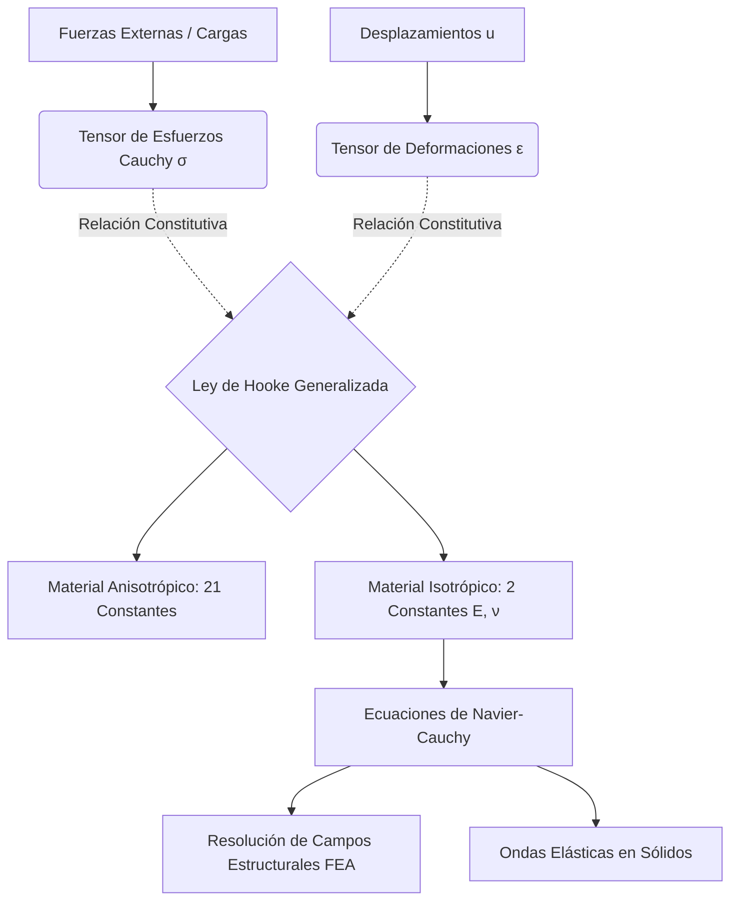

# Elasticidad de Materiales
La teoría de la elasticidad es la parte de la mecánica de medios continuos que estudia cómo los objetos sólidos se deforman cuando se les aplican fuerzas (esfuerzos) y cómo recuperan su forma original (si no superan el límite elástico).

## 📜 Contexto Histórico
En 1660, Robert Hooke descubrió empíricamente la ley que lleva su nombre ("Ut tensio, sic vis" - Como la extensión, así es la fuerza). Augustin-Louis Cauchy, en la década de 1820, formalizó el concepto de tensión (esfuerzo) y deformación mediante un formalismo tensorial que sentó las bases matemáticas de la mecánica de sólidos moderna.

## 🧮 Desarrollo Teórico Profundo

La elasticidad es la propiedad de los materiales de sufrir deformaciones reversibles bajo la acción de fuerzas exteriores y de recuperar su geometría original cuando estas fuerzas cesan. Su formulación matemática requiere el uso del cálculo tensorial, dado que las fuerzas y las deformaciones tienen direccionalidad múltiple en un medio tridimensional.

### 1. El Tensor de Esfuerzos de Cauchy ($\sigma_{ij}$)

Consideremos un volumen elemental de material. La fuerza superficial $d\vec{F}$ que actúa sobre un elemento de área $d\vec{A} = \hat{n} dA$ (donde $\hat{n}$ es el vector normal) no es necesariamente paralela a $\hat{n}$. Se postula la existencia de un tensor de esfuerzos de segundo orden $\boldsymbol{\sigma}$ tal que:

$$ d\vec{F} = \boldsymbol{\sigma} \cdot d\vec{A} \implies T_i^{(n)} = \sigma_{ij} n_j $$

donde $T_i^{(n)}$ es el vector de tracción. El tensor $\sigma_{ij}$ tiene 9 componentes: 3 esfuerzos normales ($\sigma_{11}, \sigma_{22}, \sigma_{33}$) que tienden a cambiar el volumen, y 6 esfuerzos cortantes ($\sigma_{12}, \sigma_{13}, \dots$) que tienden a cambiar la forma. Por conservación del momento angular, en ausencia de pares internos, el tensor es simétrico: $\sigma_{ij} = \sigma_{ji}$.

### 2. El Tensor de Deformaciones ($\epsilon_{ij}$)

El campo de desplazamiento de un punto en el material es $\vec{u}(\vec{r})$. Si el desplazamiento no es uniforme, el material se deforma. En el régimen de pequeñas deformaciones (gradientes de desplazamiento pequeños, $|\nabla \vec{u}| \ll 1$), definimos el tensor de deformación infinitesimal $\boldsymbol{\epsilon}$ como la parte simétrica del gradiente de desplazamiento:

$$ \epsilon_{ij} = \frac{1}{2} \left( \frac{\partial u_i}{\partial x_j} + \frac{\partial u_j}{\partial x_i} \right) $$

Al igual que el esfuerzo, $\epsilon_{ij}$ tiene componentes normales (cambios fraccionales de longitud) y cortantes (cambios en los ángulos entre elementos de línea ortogonales).

### 3. Ley de Hooke Generalizada

La relación constitutiva entre el estado de esfuerzos y el estado de deformaciones, asumiendo un comportamiento elástico lineal, está dada por la Ley de Hooke Generalizada:

$$ \sigma_{ij} = C_{ijkl} \epsilon_{kl} $$

donde $C_{ijkl}$ es el tensor de rigidez elástica de cuarto orden. Debido a las simetrías de los tensores $\boldsymbol{\sigma}$ y $\boldsymbol{\epsilon}$ y a la existencia de una función de energía de deformación escalar (hiperelasticidad), los 81 componentes independientes de $C_{ijkl}$ se reducen a 21 componentes independientes para el material anisotrópico más general (simetría triclínica).

### 4. Materiales Isotrópicos

Si las propiedades elásticas del material son las mismas en todas las direcciones (isotropía), los 21 parámetros se reducen a solo dos constantes independientes, habitualmente los parámetros de Lamé $\lambda$ y $\mu$. El tensor de rigidez toma la forma:

$$ C_{ijkl} = \lambda \delta_{ij} \delta_{kl} + \mu (\delta_{ik} \delta_{jl} + \delta_{il} \delta_{jk}) $$

Sustituyendo en la Ley de Hooke generalizada:

$$ \sigma_{ij} = \lambda \epsilon_{kk} \delta_{ij} + 2\mu \epsilon_{ij} $$

donde $\epsilon_{kk} = \nabla \cdot \vec{u}$ es la deformación volumétrica relativa (dilatación) y $\delta_{ij}$ es la delta de Kronecker.
El parámetro $\mu$ es idéntico al **Módulo de Cizalladura** $G$. 

En la ingeniería, es más común usar el **Módulo de Young** ($E$) y el **Coeficiente de Poisson** ($\nu$), que se relacionan con los parámetros de Lamé mediante:

$$ E = \frac{\mu(3\lambda + 2\mu)}{\lambda + \mu} \quad \text{y} \quad \nu = \frac{\lambda}{2(\lambda + \mu)} $$

Invirtiendo la relación isótropa obtenemos la ley de Hooke orientada a deformaciones:

$$ \epsilon_{ij} = \frac{1}{E} \left[ (1+\nu)\sigma_{ij} - \nu \sigma_{kk} \delta_{ij} \right] $$

### 5. Energía de Deformación y Ecuaciones de Navier-Cauchy

La densidad de energía de deformación $W$ elástica acumulada es:

$$ W = \frac{1}{2} \sigma_{ij} \epsilon_{ij} = \frac{1}{2} C_{ijkl} \epsilon_{ij} \epsilon_{kl} $$

Al combinar las ecuaciones de equilibrio ($\sigma_{ij,j} + b_i = \rho \ddot{u}_i$) con la cinemática de la deformación y la Ley de Hooke isótropa, obtenemos las Ecuaciones de Elastodinámica (o Ecuaciones de Navier-Cauchy):

$$ (\lambda + \mu) \nabla (\nabla \cdot \vec{u}) + \mu \nabla^2 \vec{u} + \vec{b} = \rho \frac{\partial^2 \vec{u}}{\partial t^2} $$

Esta es la ecuación gobernante fundamental para simular campos de esfuerzos en el diseño estructural (Análisis de Elementos Finitos) y modelar ondas sísmicas ($P$ y $S$) en geofísica.



## 🛠 Ejemplo Práctico
**Problema:** Un cable de acero cilíndrico ($ E = 200 \text{ GPa} $) de $ 2 \text{ m} $ de longitud y $ 5 \text{ mm} $ de radio se usa para colgar una carga de $ 1000 \text{ kg} $. Calcula el esfuerzo longitudinal y cuánto se alarga el cable. ($ g = 9.8 \text{ m/s}^2 $).

**Solución paso a paso:**
1. Fuerza aplicada (Peso): $ F = mg = 1000 \times 9.8 = 9800 \text{ N} $.
2. Área transversal del cable: $ A = \pi r^2 = \pi (0.005 \text{ m})^2 = 7.854 \times 10^{-5} \text{ m}^2 $.
3. Esfuerzo longitudinal $ \sigma $:
   $ \sigma = \frac{F}{A} = \frac{9800}{7.854 \times 10^{-5}} = 1.248 \times 10^8 \text{ Pa} = 124.8 \text{ MPa} $.
4. Deformación unitaria $ \epsilon $ usando la Ley de Hooke:
   $ \epsilon = \frac{\sigma}{E} = \frac{124.8 \times 10^6 \text{ Pa}}{200 \times 10^9 \text{ Pa}} = 6.24 \times 10^{-4} $.
5. Alargamiento $ \Delta L $:
   $ \epsilon = \frac{\Delta L}{L_0} \implies \Delta L = \epsilon L_0 = (6.24 \times 10^{-4}) \times 2 = 1.248 \times 10^{-3} \text{ m} = 1.248 \text{ mm} $.

## 📝 Guía de Ejercicios Resueltos

**Problema 1: Tensor de Tensiones y Esfuerzos Principales**
Dado el tensor de tensiones $\boldsymbol{\sigma} = \begin{pmatrix} 50 & 20 & 0 \\ 20 & -10 & 0 \\ 0 & 0 & 30 \end{pmatrix} \, \text{MPa}$ en un punto de un material. Determine las tensiones principales, las direcciones principales y el esfuerzo cortante máximo absoluto.

**Solución paso a paso:**
1. Los autovalores del tensor son las tensiones principales. Como $\sigma_{z} = 30$ MPa y no hay esfuerzo cortante en los planos $z$, una tensión principal es $\sigma_3 = 30$ MPa (dirección $z$).
2. Para el bloque $2\times2$ en $xy$, resolvemos $\det \begin{pmatrix} 50 - \lambda & 20 \\ 20 & -10 - \lambda \end{pmatrix} = 0$.
3. Ecuación característica: $(50 - \lambda)(-10 - \lambda) - 400 = \lambda^2 - 40\lambda - 900 = 0$.
4. Las raíces son $\lambda = \frac{40 \pm \sqrt{1600 - 4(1)(-900)}}{2} = 20 \pm \sqrt{400 + 900} = 20 \pm \sqrt{1300} = 20 \pm 10\sqrt{13} \approx 20 \pm 36.05$.
5. Tensiones principales ordenadas: $\sigma_1 = 56.05$ MPa, $\sigma_2 = 30$ MPa, $\sigma_3 = -16.05$ MPa.
6. El esfuerzo cortante máximo absoluto se da en el plano bisector de las tensiones principales máxima y mínima: $\tau_{max} = \frac{\sigma_1 - \sigma_3}{2} = \frac{56.05 - (-16.05)}{2} = \frac{72.1}{2} = 36.05$ MPa.
7. Las direcciones (vectores propios) en $xy$ para $\sigma_1 = 56.05$: $\begin{pmatrix} -6.05 & 20 \\ 20 & -66.05 \end{pmatrix} \begin{pmatrix} x \\ y \end{pmatrix} = 0 \implies \tan \theta_p = \frac{y}{x} = \frac{6.05}{20} \approx 0.3025 \implies \theta_p \approx 16.8^\circ$.

**Problema 2: Recipiente de Pared Gruesa (Tubo de Lamé)**
Un cilindro de pared gruesa tiene radio interior $a$ y exterior $b$. Está sometido a una presión interna $P_i$ y externa $P_e = 0$. Encuentre la expresión para el esfuerzo tangencial máximo $\sigma_{\theta, max}$ utilizando las ecuaciones de Lamé.

**Solución paso a paso:**
1. Las ecuaciones de Lamé para los esfuerzos radial y tangencial son: $\sigma_r = A - \frac{B}{r^2}$ y $\sigma_\theta = A + \frac{B}{r^2}$.
2. Condiciones de contorno: $\sigma_r(a) = -P_i$ y $\sigma_r(b) = 0$.
3. Sustituyendo: $A - \frac{B}{a^2} = -P_i$ y $A - \frac{B}{b^2} = 0 \implies A = \frac{B}{b^2}$.
4. Resolvemos para $B$: $\frac{B}{b^2} - \frac{B}{a^2} = -P_i \implies B \left( \frac{a^2 - b^2}{a^2 b^2} \right) = -P_i \implies B = \frac{P_i a^2 b^2}{b^2 - a^2}$.
5. Por lo tanto, $A = \frac{P_i a^2}{b^2 - a^2}$.
6. El esfuerzo tangencial es $\sigma_\theta(r) = \frac{P_i a^2}{b^2 - a^2} \left( 1 + \frac{b^2}{r^2} \right)$.
7. Este esfuerzo es siempre de tracción (positivo) y su valor máximo ocurre en el radio interior $r=a$:
   $\sigma_{\theta, max} = \frac{P_i a^2}{b^2 - a^2} \left( 1 + \frac{b^2}{a^2} \right) = P_i \frac{a^2 + b^2}{b^2 - a^2}$. Note que siempre es mayor que $P_i$.

**Problema 3: Ley de Hooke Generalizada e Invariante de Dilatación**
Para un material isotrópico y elástico lineal sometido a un tensor de tensiones $\sigma_{ij}$, demuestre que el cambio relativo de volumen (dilatación cúbica) $\theta = \varepsilon_{kk}$ es proporcional a la traza del tensor de tensiones $\sigma_{kk}$, y halle el módulo de compresibilidad volumétrica $K$ en función de $E$ y $\nu$.

**Solución paso a paso:**
1. La ley de Hooke generalizada es $\varepsilon_{ij} = \frac{1+\nu}{E} \sigma_{ij} - \frac{\nu}{E} \sigma_{kk} \delta_{ij}$.
2. Para encontrar la dilatación cúbica $\theta$, tomamos la traza del tensor de deformaciones: $\theta = \varepsilon_{kk} = \varepsilon_{11} + \varepsilon_{22} + \varepsilon_{33}$.
3. Usando la convención de Einstein de suma de índices repetidos, calculamos $\varepsilon_{kk}$:
   $\varepsilon_{kk} = \frac{1+\nu}{E} \sigma_{kk} - \frac{\nu}{E} \sigma_{mm} \delta_{kk}$.
4. Como estamos en 3D, $\delta_{kk} = \delta_{11} + \delta_{22} + \delta_{33} = 3$. La variable muda $\sigma_{mm}$ es igual a $\sigma_{kk}$.
5. $\theta = \frac{1+\nu}{E} \sigma_{kk} - \frac{3\nu}{E} \sigma_{kk} = \frac{1 - 2\nu}{E} \sigma_{kk}$.
6. Por definición, la presión hidrostática media es $P = -\frac{\sigma_{kk}}{3}$. Luego, $\theta = -3 \frac{1 - 2\nu}{E} P$.
7. El módulo de compresibilidad es $K = -\frac{P}{\theta}$, por lo que sustituyendo obtenemos: $K = \frac{E}{3(1 - 2\nu)}$.

## 💻 Simulaciones Computacionales

Cálculo y visualización de la deflexión de una viga empotrada bajo carga continua mediante integración de la ecuación diferencial elástica.

```python
import numpy as np
import matplotlib.pyplot as plt

# Ecuación diferencial de la elástica: E*I*y'' = M(x)
# Para una viga en voladizo con carga uniforme q: M(x) = -q*(L-x)^2 / 2

L = 5.0        # Longitud de la viga (m)
E = 200e9      # Módulo de Young (Pa) - Acero
I = 1e-5       # Inercia de la sección transversal (m^4)
q = 10000      # Carga distribuida (N/m)

x = np.linspace(0, L, 100)
# Integración analítica:
# y(x) = (-q*x^2 / (24*E*I)) * (x^2 - 4*L*x + 6*L^2)
deflection = (-q * x**2 / (24 * E * I)) * (x**2 - 4 * L * x + 6 * L**2)

plt.figure(figsize=(10, 4))
plt.plot(x, deflection * 1000, 'b-', lw=3) # Convertido a mm
plt.fill_between(x, deflection * 1000, 0, color='blue', alpha=0.1)
plt.axhline(0, color='black', linestyle='--')
plt.title("Línea Elástica de Deflexión (Viga en Voladizo)")
plt.xlabel("Longitud x (m)")
plt.ylabel("Deflexión (mm)")
plt.grid(True)
plt.show()
```

## 🚀 Fronteras de Investigación y Problemas Abiertos

En 2026, la mecánica de medios continuos ha dado a luz al concepto de **Elasticidad Impar (Odd Elasticity)**. En materia activa y sistemas vivos (geles moleculares que consumen ATP, enjambres robóticos), el tensor de elasticidad clásico pierde su simetría mayor (el trabajo realizado en un ciclo cerrado de deformación ya no es nulo). Esto permite la extracción de trabajo de los ciclos de tensión, dando lugar a ondas mecánicas unidireccionales y estáticas no conservativas sin análogos clásicos. La comprensión de los defectos topológicos en estos medios activos viscoelásticos (por ejemplo, cómo los "asteres" actina-miosina pulsan) representa la vanguardia de la biológica física y la ciencia de materiales inteligentes.

## 📐 Formalismo Matemático Avanzado (Nivel Posgrado/Doctorado)

El estudio de un medio continuo con defectos intrínsecos (dislocaciones, disclinaciones) abandona la geometría Euclidiana para utilizar **Geometría de Riemann-Cartan**. El cuerpo elástico se modela como una variedad con una métrica elástica y una conexión afin que posee **Torsión** $T^a_{\bc}$ y **Curvatura** $R^a_{\bcd}$.
Si denotamos el corepere de la estructura reticular por 1-formas $e^a$, las ecuaciones de la teoría geométrica de dislocaciones relacionan la densidad de dislocaciones $\alpha$ directamente con el tensor de Torsión:

$$ \alpha = de + \Gamma \wedge e = T $$

La densidad de energía elástica de deformación $W$ depende de la métrica efectiva dependiente de $e$. Al variar esta acción respecto a la estructura $e$ y a la métrica, las tensiones elásticas (el tensor momento-energía del medio continuo) se derivan elegantemente del principio de gauge, conectando la teoría de plasticidad macroscópica de metales y polímeros estelares directamente con las teorías de calibre (Gauge Theory) empleadas en la teoría de cuerdas y gravedad.

## 📚 Recursos Específicos

### Cursos Recomendados
1. [Mechanics of Materials I & II (Coursera - Georgia Tech)](https://www.coursera.org/learn/mechanics-1)
2. [Solid Mechanics (MIT OCW)](https://ocw.mit.edu/courses/mechanical-engineering/2-001-mechanics-materials-i-fall-2006/)
3. [Continuum Mechanics (Coursera / edX)](https://www.edx.org/course/continuum-mechanics)

### Artículos y Simulaciones
1. **De potentia restitutiva, or of spring (Robert Hooke, 1678)**
   - **Enlace:** [https://en.wikipedia.org/wiki/Hooke%27s_law](https://en.wikipedia.org/wiki/Hooke%27s_law)
   - **Importancia Teórica:** Establece la Ley de Hooke, "ut tensio, sic vis", marcando el inicio de la elasticidad lineal para sólidos deformables.
   - **Fondo Matemático:** En mecánica del medio continuo, esta ley se generaliza mediante el tensor constitutivo de elasticidad de cuarto orden $C_{ijkl}$ que relaciona el tensor de esfuerzos de Cauchy $\sigma_{ij}$ y el tensor de deformación infinitesimal $\varepsilon_{kl}$:

     $$

     \sigma_{ij} = \sum_{k,l} C_{ijkl} \varepsilon_{kl}

     $$

   - **Implicaciones Físicas:** Es la aproximación lineal fundamental a cualquier pozo de potencial interatómico cerca del equilibrio, sustentando la resistencia de materiales.

2. **On the Mathematical Foundations of Elasticity (A.L. Cauchy, 1827)**
   - **Enlace:** [https://en.wikipedia.org/wiki/Linear_elasticity](https://en.wikipedia.org/wiki/Linear_elasticity)
   - **Importancia Teórica:** Cauchy introdujo el concepto de tensión (stress) y deformación, formulando rigurosamente la mecánica de cuerpos deformables.
   - **Fondo Matemático:** Establece el teorema del tetraedro de Cauchy, que demuestra que el vector tensión $\mathbf{T}^{(\mathbf{n})}$ en una superficie normal $\mathbf{n}$ es una transformación lineal del tensor de tensiones $\boldsymbol{\sigma}$:

     $$

     \mathbf{T}^{(\mathbf{n})} = \boldsymbol{\sigma} \cdot \mathbf{n} \quad \text{o en índices:} \quad T_i = \sum_j \sigma_{ij} n_j

     $$

   - **Implicaciones Físicas:** Cambió la perspectiva global de cuerpos a medios continuos locales, vital para derivar las ecuaciones de equilibrio mecánico.

3. **Non-linear Elastic Deformations (R.W. Ogden, 1984)**
   - **Enlace:** [https://store.doverpublications.com/0486696480.html](https://store.doverpublications.com/0486696480.html)
   - **Importancia Teórica:** Fundamenta el tratamiento de materiales hiperelásticos y grandes deformaciones donde la aproximación lineal (Hooke) fracasa espectacularmente (ej. cauchos y polímeros).
   - **Fondo Matemático:** Utiliza la función de densidad de energía de deformación $W$. El tensor nominal de tensiones de Piola-Kirchhoff $\mathbf{P}$ se deriva respecto al gradiente de deformación $\mathbf{F}$:

     $$

     \mathbf{P} = \frac{\partial W}{\partial \mathbf{F}}

     $$

   - **Implicaciones Físicas:** Permite predecir comportamientos complejos isotrópicos incompresibles en elastómeros modernos sometidos a estrés masivo en ingeniería y biomecánica.

### 📖 Referencias Útiles y Bibliografía
1. [Theory of Elasticity (L.D. Landau y E.M. Lifshitz)](https://www.amazon.com/Theory-Elasticity-Course-Theoretical-Physics/dp/075062633X)
2. [Continuum Mechanics (A.J.M. Spencer)](https://www.amazon.com/Continuum-Mechanics-Dover-Books-Physics/dp/0486435946)

## 🌐 Seminarios Avanzados y Literatura de Frontera

- [Harvard SEAS: Solid Mechanics Seminars](https://seas.harvard.edu/) - Avances en mecánica de la fractura y elasticidad de grandes deformaciones.
- [MIT Solid Mechanics Seminar](https://meche.mit.edu/) - Charlas sobre materiales hiperelásticos y respuestas mecánicas exóticas.
- [Caltech Solid Mechanics Research Seminars](https://eas.caltech.edu/) - Fronteras del estudio de tensores de esfuerzos y materiales activos.

- [Nature: "Metamaterials with negative Poisson's ratio"](https://www.nature.com/) - Diseño de materiales auxéticos revolucionarios.
- [Science: "Fracture mechanics of 2D materials"](https://www.science.org/) - Límites de elasticidad y tensión en el grafeno y otros cristales bidimensionales.
- [Physical Review Letters: "Elasticity of amorphous solids"](https://journals.aps.org/prl/) - Profundo estudio sobre las teorías de módulos elásticos en vidrios.
