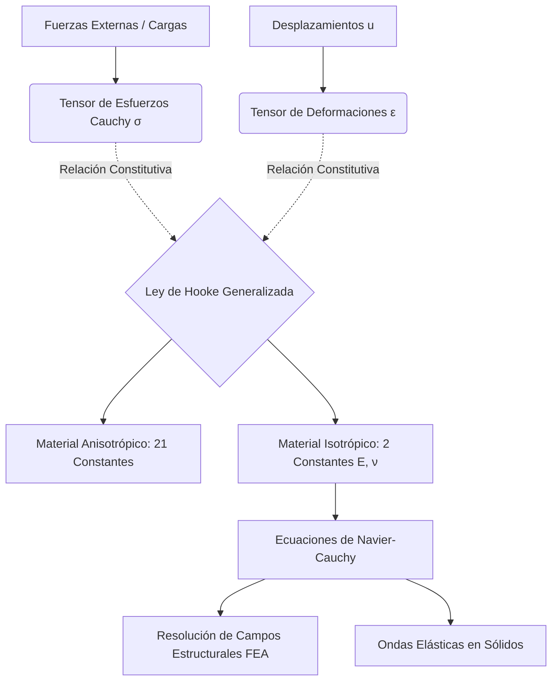

# Elasticidad de Materiales
La teoría de la elasticidad es la parte de la mecánica de medios continuos que estudia cómo los objetos sólidos se deforman cuando se les aplican fuerzas (esfuerzos) y cómo recuperan su forma original (si no superan el límite elástico).

## 📜 Contexto Histórico
En 1660, Robert Hooke descubrió empíricamente la ley que lleva su nombre ("Ut tensio, sic vis" - Como la extensión, así es la fuerza). Augustin-Louis Cauchy, en la década de 1820, formalizó el concepto de tensión (esfuerzo) y deformación mediante un formalismo tensorial que sentó las bases matemáticas de la mecánica de sólidos moderna.

## 🧮 Desarrollo Teórico Profundo

La elasticidad es la propiedad de los materiales de sufrir deformaciones reversibles bajo la acción de fuerzas exteriores y de recuperar su geometría original cuando estas fuerzas cesan. Su formulación matemática requiere el uso del cálculo tensorial, dado que las fuerzas y las deformaciones tienen direccionalidad múltiple en un medio tridimensional.

### 1. El Tensor de Esfuerzos de Cauchy ($\sigma_{ij}$)

Consideremos un volumen elemental de material. La fuerza superficial $d\vec{F}$ que actúa sobre un elemento de área $d\vec{A} = \hat{n} dA$ (donde $\hat{n}$ es el vector normal) no es necesariamente paralela a $\hat{n}$. Se postula la existencia de un tensor de esfuerzos de segundo orden $\boldsymbol{\sigma}$ tal que:
$$ d\vec{F} = \boldsymbol{\sigma} \cdot d\vec{A} \implies T_i^{(n)} = \sigma_{ij} n_j $$
donde $T_i^{(n)}$ es el vector de tracción. El tensor $\sigma_{ij}$ tiene 9 componentes: 3 esfuerzos normales ($\sigma_{11}, \sigma_{22}, \sigma_{33}$) que tienden a cambiar el volumen, y 6 esfuerzos cortantes ($\sigma_{12}, \sigma_{13}, \dots$) que tienden a cambiar la forma. Por conservación del momento angular, en ausencia de pares internos, el tensor es simétrico: $\sigma_{ij} = \sigma_{ji}$.

### 2. El Tensor de Deformaciones ($\epsilon_{ij}$)

El campo de desplazamiento de un punto en el material es $\vec{u}(\vec{r})$. Si el desplazamiento no es uniforme, el material se deforma. En el régimen de pequeñas deformaciones (gradientes de desplazamiento pequeños, $|\nabla \vec{u}| \ll 1$), definimos el tensor de deformación infinitesimal $\boldsymbol{\epsilon}$ como la parte simétrica del gradiente de desplazamiento:
$$ \epsilon_{ij} = \frac{1}{2} \left( \frac{\partial u_i}{\partial x_j} + \frac{\partial u_j}{\partial x_i} \right) $$
Al igual que el esfuerzo, $\epsilon_{ij}$ tiene componentes normales (cambios fraccionales de longitud) y cortantes (cambios en los ángulos entre elementos de línea ortogonales).

### 3. Ley de Hooke Generalizada

La relación constitutiva entre el estado de esfuerzos y el estado de deformaciones, asumiendo un comportamiento elástico lineal, está dada por la Ley de Hooke Generalizada:
$$ \sigma_{ij} = C_{ijkl} \epsilon_{kl} $$
donde $C_{ijkl}$ es el tensor de rigidez elástica de cuarto orden. Debido a las simetrías de los tensores $\boldsymbol{\sigma}$ y $\boldsymbol{\epsilon}$ y a la existencia de una función de energía de deformación escalar (hiperelasticidad), los 81 componentes independientes de $C_{ijkl}$ se reducen a 21 componentes independientes para el material anisotrópico más general (simetría triclínica).

### 4. Materiales Isotrópicos

Si las propiedades elásticas del material son las mismas en todas las direcciones (isotropía), los 21 parámetros se reducen a solo dos constantes independientes, habitualmente los parámetros de Lamé $\lambda$ y $\mu$. El tensor de rigidez toma la forma:
$$ C_{ijkl} = \lambda \delta_{ij} \delta_{kl} + \mu (\delta_{ik} \delta_{jl} + \delta_{il} \delta_{jk}) $$
Sustituyendo en la Ley de Hooke generalizada:
$$ \sigma_{ij} = \lambda \epsilon_{kk} \delta_{ij} + 2\mu \epsilon_{ij} $$
donde $\epsilon_{kk} = \nabla \cdot \vec{u}$ es la deformación volumétrica relativa (dilatación) y $\delta_{ij}$ es la delta de Kronecker.
El parámetro $\mu$ es idéntico al **Módulo de Cizalladura** $G$. 

En la ingeniería, es más común usar el **Módulo de Young** ($E$) y el **Coeficiente de Poisson** ($\nu$), que se relacionan con los parámetros de Lamé mediante:
$$ E = \frac{\mu(3\lambda + 2\mu)}{\lambda + \mu} \quad \text{y} \quad \nu = \frac{\lambda}{2(\lambda + \mu)} $$
Invirtiendo la relación isótropa obtenemos la ley de Hooke orientada a deformaciones:
$$ \epsilon_{ij} = \frac{1}{E} \left[ (1+\nu)\sigma_{ij} - \nu \sigma_{kk} \delta_{ij} \right] $$

### 5. Energía de Deformación y Ecuaciones de Navier-Cauchy

La densidad de energía de deformación $W$ elástica acumulada es:
$$ W = \frac{1}{2} \sigma_{ij} \epsilon_{ij} = \frac{1}{2} C_{ijkl} \epsilon_{ij} \epsilon_{kl} $$
Al combinar las ecuaciones de equilibrio ($\sigma_{ij,j} + b_i = \rho \ddot{u}_i$) con la cinemática de la deformación y la Ley de Hooke isótropa, obtenemos las Ecuaciones de Elastodinámica (o Ecuaciones de Navier-Cauchy):
$$ (\lambda + \mu) \nabla (\nabla \cdot \vec{u}) + \mu \nabla^2 \vec{u} + \vec{b} = \rho \frac{\partial^2 \vec{u}}{\partial t^2} $$
Esta es la ecuación gobernante fundamental para simular campos de esfuerzos en el diseño estructural (Análisis de Elementos Finitos) y modelar ondas sísmicas ($P$ y $S$) en geofísica.

## 🛠 Ejemplo Práctico
**Problema:** Un cable de acero cilíndrico ($ E = 200 \text{ GPa} $) de $ 2 \text{ m} $ de longitud y $ 5 \text{ mm} $ de radio se usa para colgar una carga de $ 1000 \text{ kg} $. Calcula el esfuerzo longitudinal y cuánto se alarga el cable. ($ g = 9.8 \text{ m/s}^2 $).

**Solución paso a paso:**
1. Fuerza aplicada (Peso): $ F = mg = 1000 \times 9.8 = 9800 \text{ N} $.
2. Área transversal del cable: $ A = \pi r^2 = \pi (0.005 \text{ m})^2 = 7.854 \times 10^{-5} \text{ m}^2 $.
3. Esfuerzo longitudinal $ \sigma $:
   $ \sigma = \frac{F}{A} = \frac{9800}{7.854 \times 10^{-5}} = 1.248 \times 10^8 \text{ Pa} = 124.8 \text{ MPa} $.
4. Deformación unitaria $ \epsilon $ usando la Ley de Hooke:
   $ \epsilon = \frac{\sigma}{E} = \frac{124.8 \times 10^6 \text{ Pa}}{200 \times 10^9 \text{ Pa}} = 6.24 \times 10^{-4} $.
5. Alargamiento $ \Delta L $:
   $ \epsilon = \frac{\Delta L}{L_0} \implies \Delta L = \epsilon L_0 = (6.24 \times 10^{-4}) \times 2 = 1.248 \times 10^{-3} \text{ m} = 1.248 \text{ mm} $.

## 📚 Recursos
### Cursos Específicos
1. ["Mechanics of Materials I & II" - Coursera (Georgia Tech)](https://www.coursera.org/learn/mechanics-1)
2. ["Theory of Elasticity" - NPTEL](https://nptel.ac.in/courses/112105159)
3. ["Solid Mechanics" - MIT OCW](https://ocw.mit.edu/courses/mechanical-engineering/2-001-mechanics-materials-i-fall-2006/)
4. ["Introduction to Finite Element Analysis" - edX](https://www.edx.org/course/introduction-to-finite-element-analysis)
5. ["Advanced Mechanics of Deformable Solids" - Coursera](https://www.coursera.org/learn/solid-mechanics)
6. ["Continuum Mechanics of Solids" - NPTEL](https://nptel.ac.in/courses/112105166)

### Artículos y Simulaciones
1. [Calculadoras de Tensión-Deformación y Círculo de Mohr](https://www.efunda.com/formulae/solid_mechanics/mat_mechanics/mohr_circle.cfm)
2. [SimScale: Finite Element Analysis (FEA) Basic Tutorials](https://www.simscale.com/blog/2014/10/finite-element-analysis/)
3. [Ansys Student: Structural Mechanics Simulations](https://www.ansys.com/academic/students)
4. ["On the Mathematical Foundations of Elasticity" - A.L. Cauchy](https://en.wikipedia.org/wiki/Linear_elasticity)
5. ["Ut tensio, sic vis" - Robert Hooke (Historical reference)](https://en.wikipedia.org/wiki/Hooke%27s_law)
6. ["The Mathematical Theory of Elasticity" - A.E.H. Love (Classic text)](https://archive.org/details/mathematicaltheo00loveuoft)
7. [SolidWorks Simulation Express Tutorials](https://my.solidworks.com/training/path/17/solidworks-simulation)
8. [PhET Simulations on Hooke's Law and Springs](https://phet.colorado.edu/en/simulations/hookes-law)
9. [*Mechanics of Materials* - R.C. Hibbeler (Selected chapters)](https://www.amazon.com/Mechanics-Materials-10th-Russell-Hibbeler/dp/0134319656)

### 📖 Referencias Útiles y Bibliografía
1. [*Theory of Elasticity* - S.P. Timoshenko y J.N. Goodier](https://www.amazon.com/Theory-Elasticity-Stephen-P-Timoshenko/dp/0070858055)
2. [*Theory of Elasticity* - L.D. Landau y E.M. Lifshitz](https://www.amazon.com/Theory-Elasticity-Course-Theoretical-Physics/dp/075062633X)
3. [*Continuum Mechanics* - A.J.M. Spencer](https://www.amazon.com/Continuum-Mechanics-Dover-Books-Physics/dp/0486435946)
4. [*Advanced Mechanics of Materials* - A.P. Boresi](https://www.amazon.com/Advanced-Mechanics-Materials-Arthur-Boresi/dp/0471438812)
