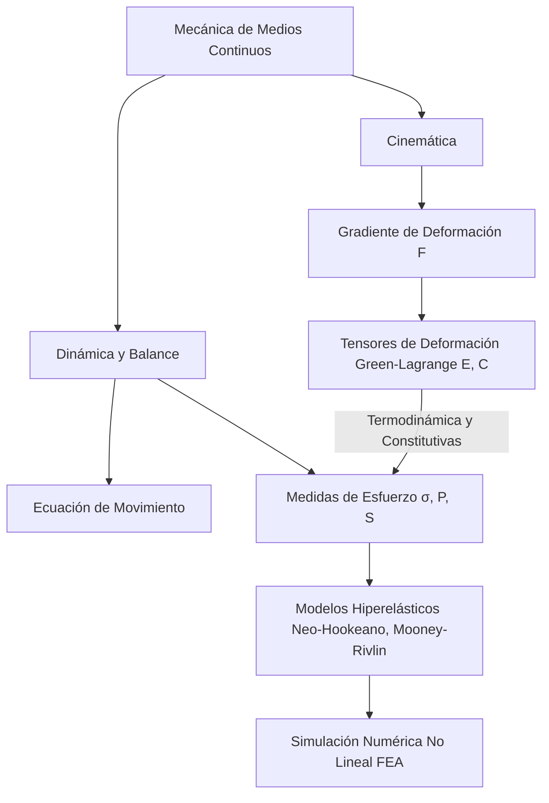

# Elasticidad y Medios Continuos

La teoría de medios continuos extiende la idea de describir la materia mediante campos continuos, no solo para fluidos sino también para sólidos deformables. La elasticidad lineal es el primer gran modelo para entender cómo un cuerpo responde a fuerzas sin deformarse de forma permanente.

## 🧮 Desarrollo Teórico Profundo

La Mecánica de Medios Continuos es un marco general que modela la cinemática y dinámica de la materia macroscópica ignorando su estructura atómica discreta. Postula que las cantidades físicas como masa, momento y energía pueden describirse por funciones de densidad continuas y diferenciables.

### 1. Descripción Cinemática de la Deformación

Consideremos un cuerpo $\mathcal{B}$ en una configuración de referencia (no deformada) con coordenadas materiales (Lagrangianas) $\vec{X}$. En un tiempo $t$, el cuerpo adquiere una configuración actual (deformada) descrita por las coordenadas espaciales (Eulerianas) $\vec{x} = \boldsymbol{\chi}(\vec{X}, t)$. 
El **Gradiente de Deformación** es el tensor de segundo orden fundamental en cinemática continua:
$$ \mathbf{F} = \frac{\partial \vec{x}}{\partial \vec{X}} \implies F_{iK} = \frac{\partial x_i}{\partial X_K} $$
El determinante $J = \det(\mathbf{F})$ mide el cambio de volumen relativo ($dV = J dV_0$). Para que el material no se interpenetre, se requiere axiomáticamente $J > 0$.

Como $\mathbf{F}$ incluye tanto la deformación geométrica local como las rotaciones de cuerpo rígido, filtramos la rotación multiplicando $\mathbf{F}$ por su transpuesta para definir el **Tensor de Deformación de Cauchy-Green Derecho**:
$$ \mathbf{C} = \mathbf{F}^T \mathbf{F} $$
Si el cuerpo experimenta solo un desplazamiento de cuerpo rígido, $\mathbf{C} = \mathbf{I}$ (la matriz identidad). El tensor de deformación finita de Green-Lagrange se define entonces como:
$$ \mathbf{E} = \frac{1}{2} (\mathbf{C} - \mathbf{I}) = \frac{1}{2} (\mathbf{F}^T \mathbf{F} - \mathbf{I}) $$
Este tensor, a diferencia de la deformación infinitesimal $\boldsymbol{\epsilon}$, es rigurosamente válido para desplazamientos y rotaciones arbitrariamente grandes (ej. modelado de elastómeros, gomas o tejidos biológicos).

### 2. Medidas de Esfuerzo en Deformaciones Finitas

En el régimen de grandes deformaciones, la definición de área cambia dinámicamente, por lo que requerimos distintas métricas para el esfuerzo:
- **Tensor de Esfuerzo de Cauchy ($\boldsymbol{\sigma}$):** Mide la fuerza actual por unidad de área actual (Euleriano o de "esfuerzo verdadero").
- **Primer Tensor de Piola-Kirchhoff ($\mathbf{P}$):** Mide la fuerza actual por unidad de área de referencia (Lagrangiano asimétrico o de "esfuerzo nominal/ingenieril"). Se relaciona mediante $\mathbf{P} = J \boldsymbol{\sigma} \mathbf{F}^{-T}$.
- **Segundo Tensor de Piola-Kirchhoff ($\mathbf{S}$):** Transforma la fuerza actual a la configuración de referencia y la divide por el área de referencia (totalmente Lagrangiano, completamente simétrico). Es el conjugado de trabajo (termodinámico) del tensor de Green-Lagrange $\mathbf{E}$. $ \mathbf{S} = J \mathbf{F}^{-1} \boldsymbol{\sigma} \mathbf{F}^{-T} $.

### 3. Ecuaciones de Conservación y Balance

Las leyes físicas inviolables de conservación se expresan matemáticamente usando estos campos tensoriales para cualquier subvolumen.

**Balance de Masa (Continuidad):**
En forma local Euleriana:
$$ \dot{\rho} + \rho \nabla \cdot \vec{v} = 0 $$
En forma Lagrangiana:
$$ \rho_0 = \rho J $$

**Balance de Cantidad de Movimiento (Ecuación de Movimiento de Cauchy):**
Esta es la versión continua de $\vec{F} = m\vec{a}$:
$$ \nabla \cdot \boldsymbol{\sigma} + \rho \vec{b} = \rho \frac{D\vec{v}}{Dt} $$
donde $\vec{b}$ son fuerzas de cuerpo (e.g. gravedad). 

**Balance de Momento Angular:**
Conduce a la conclusión de que, en ausencia de pares de volumen o microestructura interna acoplada (medios no-polares o clásicos), el tensor de Cauchy es simétrico:
$$ \boldsymbol{\sigma} = \boldsymbol{\sigma}^T $$

**Principios Termodinámicos y Desigualdad de Clausius-Duhem:**
Para formular modelos constitutivos (relación entre esfuerzo y deformación), se debe garantizar que el proceso no viole la Segunda Ley de la Termodinámica, que exige que la producción interna de entropía sea siempre no negativa. En un proceso isotérmico para un material elástico (que no disipa energía), esto restringe a que exista una Función de Densidad de Energía de Deformación (Hiperelasticidad) $\Psi(\mathbf{F})$ tal que el esfuerzo derive de ella:
$$ \mathbf{P} = \frac{\partial \Psi}{\partial \mathbf{F}} $$

## 📚 Recursos
### Cursos Específicos
1. ["Continuum Mechanics" - Coursera / edX](https://www.edx.org/course/continuum-mechanics)
2. ["Introduction to Tensor Calculus and Continuum Mechanics" - NPTEL](https://nptel.ac.in/courses/112105171)
3. ["Solid Mechanics and Elasticity" - MIT OCW](https://ocw.mit.edu/courses/mechanical-engineering/)
4. ["Advanced Continuum Mechanics" - Coursera](https://www.coursera.org/)
5. ["Mechanics of Deformable Bodies" - edX](https://www.edx.org/course/mechanics-of-deformable-bodies)
6. ["Finite Element Method for Continuum Mechanics" - NPTEL](https://nptel.ac.in/courses/112104116)

### Artículos y Simulaciones
1. [*Continuum Mechanics* - A.J.M. Spencer (Text chapters)](https://www.amazon.com/Continuum-Mechanics-Dover-Books-Physics/dp/0486435946)
2. [PhET Bending and Deformation Simulations](https://phet.colorado.edu/en/simulations/bending-light)
3. [Ansys Mechanical FEA Tutorials](https://www.ansys.com/products/structures/ansys-mechanical)
4. [SimScale: Tensor analysis in Structural Simulations](https://www.simscale.com/docs/)
5. ["Non-linear Elastic Deformations" - R.W. Ogden (Article/Excerpts)](https://store.doverpublications.com/0486696480.html)
6. ["A Primer on the Kinematics of Continua" - Journal of Mechanics Education](https://en.wikipedia.org/wiki/Continuum_mechanics)
7. [Comsol Multiphysics: Solid Mechanics Module Examples](https://www.comsol.com/solid-mechanics-module)
8. [Mathematica / MATLAB scripts for Tensor Analysis in Continua](https://www.mathworks.com/matlabcentral/fileexchange/)
9. ["Foundations of Solid Mechanics" - Y.C. Fung](https://www.amazon.com/Foundations-Solid-Mechanics-Y-C-Fung/dp/0133303657)

### 📖 Referencias Útiles y Bibliografía
1. [*Theory of Elasticity* - L.D. Landau y E.M. Lifshitz](https://www.amazon.com/Theory-Elasticity-Course-Theoretical-Physics/dp/075062633X)
2. [*Continuum Mechanics* - A.J.M. Spencer](https://www.amazon.com/Continuum-Mechanics-Dover-Books-Physics/dp/0486435946)
3. [*An Introduction to Continuum Mechanics* - J.N. Reddy](https://www.amazon.com/Introduction-Continuum-Mechanics-J-Reddy/dp/1107025435)
4. [*Introduction to the Mechanics of a Continuous Medium* - L.E. Malvern](https://www.amazon.com/Introduction-Mechanics-Continuous-Medium-Malvern/dp/0134876032)
