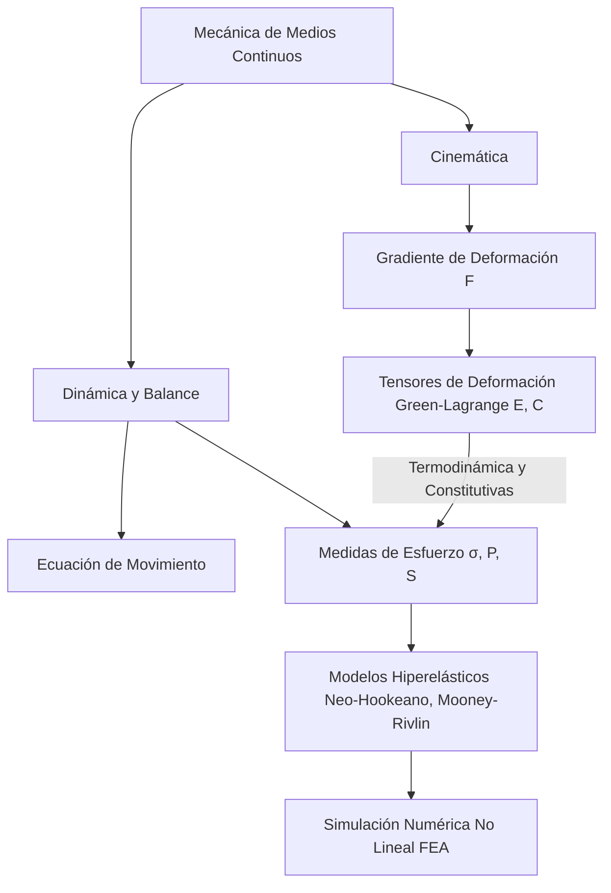

# Elasticidad y Medios Continuos

La teoría de medios continuos extiende la idea de describir la materia mediante campos continuos, no solo para fluidos sino también para sólidos deformables. La elasticidad lineal es el primer gran modelo para entender cómo un cuerpo responde a fuerzas sin deformarse de forma permanente.

## 🧮 Desarrollo Teórico Profundo

La Mecánica de Medios Continuos es un marco general que modela la cinemática y dinámica de la materia macroscópica ignorando su estructura atómica discreta. Postula que las cantidades físicas como masa, momento y energía pueden describirse por funciones de densidad continuas y diferenciables.

### 1. Descripción Cinemática de la Deformación

Consideremos un cuerpo $\mathcal{B}$ en una configuración de referencia (no deformada) con coordenadas materiales (Lagrangianas) $\vec{X}$. En un tiempo $t$, el cuerpo adquiere una configuración actual (deformada) descrita por las coordenadas espaciales (Eulerianas) $\vec{x} = \boldsymbol{\chi}(\vec{X}, t)$. 
El **Gradiente de Deformación** es el tensor de segundo orden fundamental en cinemática continua:
$$ \mathbf{F} = \frac{\partial \vec{x}}{\partial \vec{X}} \implies F_{iK} = \frac{\partial x_i}{\partial X_K} $$
El determinante $J = \det(\mathbf{F})$ mide el cambio de volumen relativo ($dV = J dV_0$). Para que el material no se interpenetre, se requiere axiomáticamente $J > 0$.

Como $\mathbf{F}$ incluye tanto la deformación geométrica local como las rotaciones de cuerpo rígido, filtramos la rotación multiplicando $\mathbf{F}$ por su transpuesta para definir el **Tensor de Deformación de Cauchy-Green Derecho**:
$$ \mathbf{C} = \mathbf{F}^T \mathbf{F} $$
Si el cuerpo experimenta solo un desplazamiento de cuerpo rígido, $\mathbf{C} = \mathbf{I}$ (la matriz identidad). El tensor de deformación finita de Green-Lagrange se define entonces como:
$$ \mathbf{E} = \frac{1}{2} (\mathbf{C} - \mathbf{I}) = \frac{1}{2} (\mathbf{F}^T \mathbf{F} - \mathbf{I}) $$
Este tensor, a diferencia de la deformación infinitesimal $\boldsymbol{\epsilon}$, es rigurosamente válido para desplazamientos y rotaciones arbitrariamente grandes (ej. modelado de elastómeros, gomas o tejidos biológicos).

### 2. Medidas de Esfuerzo en Deformaciones Finitas

En el régimen de grandes deformaciones, la definición de área cambia dinámicamente, por lo que requerimos distintas métricas para el esfuerzo:
- **Tensor de Esfuerzo de Cauchy ($\boldsymbol{\sigma}$):** Mide la fuerza actual por unidad de área actual (Euleriano o de "esfuerzo verdadero").
- **Primer Tensor de Piola-Kirchhoff ($\mathbf{P}$):** Mide la fuerza actual por unidad de área de referencia (Lagrangiano asimétrico o de "esfuerzo nominal/ingenieril"). Se relaciona mediante $\mathbf{P} = J \boldsymbol{\sigma} \mathbf{F}^{-T}$.
- **Segundo Tensor de Piola-Kirchhoff ($\mathbf{S}$):** Transforma la fuerza actual a la configuración de referencia y la divide por el área de referencia (totalmente Lagrangiano, completamente simétrico). Es el conjugado de trabajo (termodinámico) del tensor de Green-Lagrange $\mathbf{E}$. $ \mathbf{S} = J \mathbf{F}^{-1} \boldsymbol{\sigma} \mathbf{F}^{-T} $.

### 3. Ecuaciones de Conservación y Balance

Las leyes físicas inviolables de conservación se expresan matemáticamente usando estos campos tensoriales para cualquier subvolumen.

**Balance de Masa (Continuidad):**
En forma local Euleriana:
$$ \dot{\rho} + \rho \nabla \cdot \vec{v} = 0 $$
En forma Lagrangiana:
$$ \rho_0 = \rho J $$

**Balance de Cantidad de Movimiento (Ecuación de Movimiento de Cauchy):**
Esta es la versión continua de $\vec{F} = m\vec{a}$:
$$ \nabla \cdot \boldsymbol{\sigma} + \rho \vec{b} = \rho \frac{D\vec{v}}{Dt} $$
donde $\vec{b}$ son fuerzas de cuerpo (e.g. gravedad). 

**Balance de Momento Angular:**
Conduce a la conclusión de que, en ausencia de pares de volumen o microestructura interna acoplada (medios no-polares o clásicos), el tensor de Cauchy es simétrico:
$$ \boldsymbol{\sigma} = \boldsymbol{\sigma}^T $$

**Principios Termodinámicos y Desigualdad de Clausius-Duhem:**
Para formular modelos constitutivos (relación entre esfuerzo y deformación), se debe garantizar que el proceso no viole la Segunda Ley de la Termodinámica, que exige que la producción interna de entropía sea siempre no negativa. En un proceso isotérmico para un material elástico (que no disipa energía), esto restringe a que exista una Función de Densidad de Energía de Deformación (Hiperelasticidad) $\Psi(\mathbf{F})$ tal que el esfuerzo derive de ella:
$$ \mathbf{P} = \frac{\partial \Psi}{\partial \mathbf{F}} $$



## 📝 Guía de Ejercicios Resueltos

**Problema 1: Ecuación de Navier para Desplazamientos**
A partir de la ecuación de equilibrio de Cauchy $\nabla \cdot \boldsymbol{\sigma} + \vec{f} = \rho \frac{\partial^2 \vec{u}}{\partial t^2}$ y la ley de Hooke isotrópica $\sigma_{ij} = \lambda \varepsilon_{kk} \delta_{ij} + 2\mu \varepsilon_{ij}$, derive la ecuación de Navier para elastodinámica en términos del campo de desplazamientos $\vec{u}$.

**Solución paso a paso:**
1. La deformación lineal está dada por $\varepsilon_{ij} = \frac{1}{2}(u_{i,j} + u_{j,i})$. La traza es $\varepsilon_{kk} = u_{k,k} = \nabla \cdot \vec{u}$.
2. Expresamos el esfuerzo: $\sigma_{ij} = \lambda (\nabla \cdot \vec{u}) \delta_{ij} + \mu (u_{i,j} + u_{j,i})$.
3. La divergencia del tensor de tensiones es el vector con componentes $\sigma_{ij,j}$.
4. Derivamos la expresión del esfuerzo respecto a $x_j$:
   $\sigma_{ij,j} = \lambda (\nabla \cdot \vec{u})_{,j} \delta_{ij} + \mu (u_{i,jj} + u_{j,ij})$.
5. Usamos la propiedad del delta de Kronecker: $\lambda (\nabla \cdot \vec{u})_{,j} \delta_{ij} = \lambda (\nabla \cdot \vec{u})_{,i} = \lambda \frac{\partial}{\partial x_i} (\nabla \cdot \vec{u})$. Esto corresponde al gradiente de la divergencia: $\lambda \nabla (\nabla \cdot \vec{u})$.
6. Para el término de $\mu$: $u_{i,jj}$ es el laplaciano del desplazamiento: $\nabla^2 u_i$.
   El término $u_{j,ij}$ puede reordenarse como $(u_{j,j})_{,i} = (\nabla \cdot \vec{u})_{,i}$, que es el gradiente de la divergencia.
7. Combinando todo en forma vectorial:
   $\nabla \cdot \boldsymbol{\sigma} = \lambda \nabla(\nabla \cdot \vec{u}) + \mu \nabla^2 \vec{u} + \mu \nabla(\nabla \cdot \vec{u}) = (\lambda + \mu) \nabla(\nabla \cdot \vec{u}) + \mu \nabla^2 \vec{u}$.
8. Insertando esto en la ecuación de Cauchy:
   $(\lambda + \mu) \nabla(\nabla \cdot \vec{u}) + \mu \nabla^2 \vec{u} + \vec{f} = \rho \frac{\partial^2 \vec{u}}{\partial t^2}$. Esta es la ecuación de Navier.

**Problema 2: Ondas Longitudinales y Transversales en Sólidos**
Usando la ecuación de Navier sin fuerzas de cuerpo ($\vec{f} = 0$), aplique el teorema de Helmholtz para descomponer el desplazamiento $\vec{u} = \nabla \phi + \nabla \times \vec{\psi}$ y demuestre la existencia de dos tipos de ondas con diferentes velocidades de propagación.

**Solución paso a paso:**
1. Inyectamos la descomposición de Helmholtz en la ecuación de Navier homogénea: $(\lambda + \mu) \nabla(\nabla \cdot \vec{u}) + \mu \nabla^2 \vec{u} = \rho \ddot{\vec{u}}$.
2. Sabemos que la divergencia de un rotacional es nula: $\nabla \cdot \vec{u} = \nabla \cdot (\nabla \phi) + \nabla \cdot (\nabla \times \vec{\psi}) = \nabla^2 \phi$.
3. Evaluamos la identidad vectorial $\nabla^2 \vec{u} = \nabla(\nabla \cdot \vec{u}) - \nabla \times (\nabla \times \vec{u})$. Así que $\nabla^2 \vec{u} = \nabla(\nabla^2 \phi) - \nabla \times (\nabla \times (\nabla \times \vec{\psi})) = \nabla(\nabla^2 \phi) - \nabla \times (\nabla(\nabla \cdot \vec{\psi}) - \nabla^2 \vec{\psi})$. Escogiendo el gauge $\nabla \cdot \vec{\psi} = 0$, resulta $\nabla^2 \vec{u} = \nabla(\nabla^2 \phi) + \nabla \times (\nabla^2 \vec{\psi})$.
4. Reemplazando en la ecuación de Navier:
   $(\lambda + \mu) \nabla(\nabla^2 \phi) + \mu [\nabla(\nabla^2 \phi) + \nabla \times (\nabla^2 \vec{\psi})] = \rho \frac{\partial^2}{\partial t^2} (\nabla \phi + \nabla \times \vec{\psi})$.
5. Agrupando gradientes y rotacionales:
   $\nabla \left[ (\lambda + 2\mu) \nabla^2 \phi - \rho \ddot{\phi} \right] + \nabla \times \left[ \mu \nabla^2 \vec{\psi} - \rho \ddot{\vec{\psi}} \right] = 0$.
6. Para que esto se cumpla, los corchetes deben ser cero. Esto nos da dos ecuaciones de onda:
   - $\nabla^2 \phi = \frac{1}{c_L^2} \ddot{\phi}$, con velocidad $c_L = \sqrt{\frac{\lambda + 2\mu}{\rho}}$ (Ondas P o primarias, longitudinales).
   - $\nabla^2 \vec{\psi} = \frac{1}{c_T^2} \ddot{\vec{\psi}}$, con velocidad $c_T = \sqrt{\frac{\mu}{\rho}}$ (Ondas S o secundarias, transversales/cortantes).
7. Como $\lambda > 0$ y $\mu > 0$, siempre $c_L > c_T$.

**Problema 3: Relación entre las Constantes Elásticas**
Exprese el módulo de Poisson $\nu$ en términos de las constantes de Lamé $\lambda$ y $\mu$. A partir de ello, demuestre por qué un material estable e isotrópico debe tener $0 \leq \nu \leq 0.5$ para que la densidad de energía de deformación sea definida positiva.

**Solución paso a paso:**
1. Sabemos que el módulo de Young $E$ y Poisson $\nu$ se relacionan con $\lambda$ y $\mu$ mediante: $\lambda = \frac{\nu E}{(1+\nu)(1-2\nu)}$ y $\mu = \frac{E}{2(1+\nu)}$.
2. Dividimos ambas para eliminar $E$: $\frac{\lambda}{\mu} = \frac{2\nu}{1-2\nu}$.
3. Despejando $\nu$: $\lambda(1-2\nu) = 2\mu \nu \implies \lambda = 2\nu(\lambda + \mu) \implies \nu = \frac{\lambda}{2(\lambda + \mu)}$.
4. La densidad de energía de deformación $U_0 = \frac{1}{2} \sigma_{ij} \varepsilon_{ij} = \frac{1}{2} \lambda (\varepsilon_{kk})^2 + \mu \varepsilon_{ij} \varepsilon_{ij}$.
5. Para que un material sea elásticamente estable sin someterse a colapso espontáneo, $U_0$ debe ser estrictamente positiva para cualquier estado de deformación no nulo. Esto requiere $\mu > 0$ (rigidez al corte positiva) y el módulo volumétrico $K = \lambda + \frac{2}{3}\mu > 0$.
6. De $\mu > 0$, deducimos que $E > 0$ y por ende $1+\nu > 0 \implies \nu > -1$.
7. De $K > 0$, deducimos $3(1-2\nu) > 0 \implies \nu < 0.5$.
8. Termodinámicamente, el rango permitido es $-1 < \nu < 0.5$. En la práctica material (sin auxéticos exóticos macroestructurales), se observa $0 \leq \nu \leq 0.5$, siendo el límite incompresible $\nu = 0.5$.

## 💻 Simulaciones Computacionales

Simulación de propagación de ondas elásticas (Onda de cizalla 1D) en un medio continuo lineal utilizando el método de Diferencias Finitas en el Dominio del Tiempo (FDTD).

```python
import numpy as np
import matplotlib.pyplot as plt

# Parámetros del material (Acero)
rho = 7800.0   # Densidad kg/m^3
G = 79.3e9     # Módulo de corte (Pa)
c_s = np.sqrt(G / rho) # Velocidad de onda de corte

# Dominio
L = 10.0
nx = 200
dx = L / nx
x = np.linspace(0, L, nx)

dt = 0.8 * dx / c_s # Condición CFL < 1
nt = 300

# Desplazamiento transversal u(x,t)
u = np.zeros(nx)
u_prev = np.zeros(nx)
u_next = np.zeros(nx)

# Perturbación inicial (Pulso Gaussiano)
u_prev = np.exp(-10 * (x - L/2)**2)
u = u_prev.copy()

alpha = (c_s * dt / dx)**2

# Simulación
history = [u.copy()]
for _ in range(nt):
    for i in range(1, nx - 1):
        u_next[i] = 2*u[i] - u_prev[i] + alpha * (u[i+1] - 2*u[i] + u[i-1])
    
    # Condiciones de borde libres
    u_next[0] = u_next[1]
    u_next[-1] = u_next[-2]
    
    u_prev[:] = u[:]
    u[:] = u_next[:]
    if _ % 50 == 0:
        history.append(u.copy())

plt.figure(figsize=(10, 5))
for idx, snap in enumerate(history):
    plt.plot(x, snap, label=f"t={idx*50*dt:.4f}s")
plt.title("Propagación de Onda de Corte en Medio Elástico")
plt.xlabel("Distancia (m)")
plt.ylabel("Desplazamiento transversal u(x)")
plt.legend()
plt.grid(True)
plt.show()
```

## 📚 Recursos
### Cursos Específicos
1. ["Continuum Mechanics" - Coursera / edX](https://www.edx.org/course/continuum-mechanics)
2. ["Introduction to Tensor Calculus and Continuum Mechanics" - NPTEL](https://nptel.ac.in/courses/112105171)
3. ["Solid Mechanics and Elasticity" - MIT OCW](https://ocw.mit.edu/courses/mechanical-engineering/)
4. ["Advanced Continuum Mechanics" - Coursera](https://www.coursera.org/)
5. ["Mechanics of Deformable Bodies" - edX](https://www.edx.org/course/mechanics-of-deformable-bodies)
6. ["Finite Element Method for Continuum Mechanics" - NPTEL](https://nptel.ac.in/courses/112104116)

### Artículos y Simulaciones
1. [*Continuum Mechanics* - A.J.M. Spencer (Text chapters)](https://www.amazon.com/Continuum-Mechanics-Dover-Books-Physics/dp/0486435946)
2. [PhET Bending and Deformation Simulations](https://phet.colorado.edu/en/simulations/bending-light)
3. [Ansys Mechanical FEA Tutorials](https://www.ansys.com/products/structures/ansys-mechanical)
4. [SimScale: Tensor analysis in Structural Simulations](https://www.simscale.com/docs/)
5. ["Non-linear Elastic Deformations" - R.W. Ogden (Article/Excerpts)](https://store.doverpublications.com/0486696480.html)
6. ["A Primer on the Kinematics of Continua" - Journal of Mechanics Education](https://en.wikipedia.org/wiki/Continuum_mechanics)
7. [Comsol Multiphysics: Solid Mechanics Module Examples](https://www.comsol.com/solid-mechanics-module)
8. [Mathematica / MATLAB scripts for Tensor Analysis in Continua](https://www.mathworks.com/matlabcentral/fileexchange/)
9. ["Foundations of Solid Mechanics" - Y.C. Fung](https://www.amazon.com/Foundations-Solid-Mechanics-Y-C-Fung/dp/0133303657)

### 📖 Referencias Útiles y Bibliografía
1. [*Theory of Elasticity* - L.D. Landau y E.M. Lifshitz](https://www.amazon.com/Theory-Elasticity-Course-Theoretical-Physics/dp/075062633X)
2. [*Continuum Mechanics* - A.J.M. Spencer](https://www.amazon.com/Continuum-Mechanics-Dover-Books-Physics/dp/0486435946)
3. [*An Introduction to Continuum Mechanics* - J.N. Reddy](https://www.amazon.com/Introduction-Continuum-Mechanics-J-Reddy/dp/1107025435)
4. [*Introduction to the Mechanics of a Continuous Medium* - L.E. Malvern](https://www.amazon.com/Introduction-Mechanics-Continuous-Medium-Malvern/dp/0134876032)
