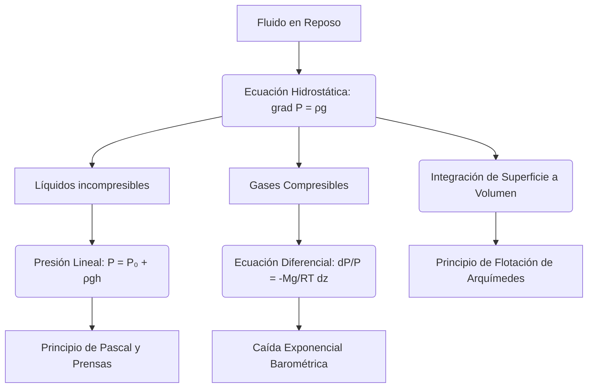

# Hidrostatica

La hidrostatica estudia fluidos en equilibrio. Aunque no haya movimiento, la distribución de presión en un fluido determina fenómenos fundamentales como la flotación, la estabilidad de recipientes, la hidráulica y el comportamiento de la atmósfera y de los océanos a primera aproximación.

## 🧮 Desarrollo Teórico Profundo

El estudio riguroso de la hidrostática se deduce de las ecuaciones de Navier-Stokes y Euler al aplicar la condición de velocidad nula en todas partes ($\vec{v} = 0$) y en todo tiempo. En ausencia de movimiento fluido, los términos convectivos, inerciales y viscosos desaparecen sistemáticamente.

### 1. La Ecuación Fundamental de la Hidrostática

Bajo la condición estática, la ecuación diferencial de conservación de la cantidad de movimiento se colapsa a un balance exclusivo entre las fuerzas de presión y las fuerzas de volumen (campo externo):
$$ \nabla p = \rho \vec{g} $$
Esta es la **Ecuación Fundamental de la Hidrostática**, que revela que el gradiente de presión escalar $\nabla p$ debe ser exactamente co-lineal con el campo vectorial de fuerzas por unidad de masa $\vec{g}$. 

**Consecuencias de la ecuación:**
1. Si el fluido está sujeto a un campo gravitatorio constante $\vec{g} = -g \hat{k}$ (donde $\hat{k}$ es el vector unitario vertical hacia arriba), la ecuación se descompone en:
   $$ \frac{\partial p}{\partial x} = 0, \quad \frac{\partial p}{\partial y} = 0, \quad \frac{\partial p}{\partial z} = -\rho g $$
   Esto demuestra rigurosamente que la presión es constante en planos isobáricos (planos horizontales $z = \text{cte}$).

2. Al integrar $\frac{dp}{dz} = -\rho g$ entre una referencia $z_0$ (superficie del líquido a presión $P_0$) y una profundidad arbitraria $h$ (donde $z = z_0 - h$), asumimos densidad incompresible constante $\rho$ para líquidos:
   $$ p(h) = P_0 + \rho g h $$
   Esta variación lineal de la presión (Presión Manométrica = $\rho gh$) es la razón por la que presas de agua son más gruesas en su base.

### 2. Isotropía del Tensor de Esfuerzos (Ley de Pascal)

En un estado de reposo absoluto sin gradientes de velocidad, la Ley de Fricción de Newton establece que todos los esfuerzos cortantes del tensor hidrodinámico de esfuerzos son idénticamente cero ($\tau_{ij} = 0$ para $i \neq j$). El tensor de esfuerzos hidrostáticos resulta en:
$$ \boldsymbol{\sigma} = -p \mathbf{I} $$
donde $\mathbf{I}$ es la matriz identidad. La presión estática $p$ es una magnitud escalar isotrópica; la fuerza ejercida sobre una superficie infinitesimal sumergida $d\vec{A}$ es idéntica en magnitud e inversamente normal a la superficie independientemente de su orientación ($d\vec{F} = -p \hat{n} dA$). Esto explica formalmente la premisa del Principio de Pascal de transmisión isótropa en fluidos confinados.

### 3. Fluido Compresible en Equilibrio Estático

Si consideramos un fluido altamente compresible como la atmósfera terrestre regido por la ecuación de los gases ideales ($p = \rho R T / M$), la densidad depende fuertemente de la presión y la temperatura. 
Sustituyendo $\rho(p)$ en la ecuación hidrostática obtenemos:
$$ \frac{dp}{dz} = -\left(\frac{p M}{R T}\right) g $$
Integrando esta ecuación diferencial lineal, asumiendo un modelo de atmósfera isotérmica ($T = \text{cte}$), derivamos la **Fórmula Barométrica**:
$$ p(z) = P_0 \exp\left(-\frac{Mg z}{RT}\right) $$
La presión atmosférica decae exponencialmente con la altitud $z$. 

### 4. Derivación del Principio de Arquímedes

Consideremos un cuerpo sumergido arbitrario de volumen $V$ y superficie $\partial V$. La fuerza neta ejercida por la presión del fluido circundante sobre su superficie es la integral de las fuerzas superficiales normales:
$$ \vec{F}_b = -\oint_{\partial V} p \hat{n} dA $$
Usando el teorema del gradiente (una variante del teorema de la divergencia):
$$ \vec{F}_b = -\iiint_V \nabla p \, dV $$
Sustituyendo el gradiente hidrostático $\nabla p = \rho_{\text{fluido}} \vec{g}$ (para líquido incompresible), obtenemos:
$$ \vec{F}_b = -\iiint_V \rho_{\text{fluido}} \vec{g} \, dV = -(\rho_{\text{fluido}} V) \vec{g} $$
La magnitud de esta fuerza ascensional o **Empuje** es exactamente el peso del volumen de fluido desplazado por el cuerpo ($m_{\text{desplazado}} g$), demostrando matemáticamente el Principio postulado por Arquímedes. Si el objeto pesa más que este empuje se hunde; si pesa menos, asciende hasta estabilizarse parcialmente sumergido, y si iguala, adquiere flotabilidad neutra.

## 📚 Recursos
### Cursos Específicos
1. ["Physics 101: Fluid Statics" - Coursera](https://www.coursera.org/learn/physics-101)
2. ["Hydrostatics and Pneumatics" - NPTEL](https://nptel.ac.in/)
3. ["Basic Fluid Mechanics: Statics" - MIT OCW](https://ocw.mit.edu/)
4. ["Introduction to Oceanography and Hydrostatics" - edX](https://www.edx.org/)
5. ["Hydraulic Engineering" - NPTEL](https://nptel.ac.in/courses/105105110)
6. ["Atmospheric and Oceanic Fluid Dynamics" - Coursera](https://www.coursera.org/)

### Artículos y Simulaciones
1. ["On Floating Bodies" - Archimedes](https://en.wikipedia.org/wiki/On_Floating_Bodies)
2. [PhET Interactive Simulations: "Under Pressure"](https://phet.colorado.edu/en/simulations/under-pressure)
3. [PhET Interactive Simulations: "Buoyancy"](https://phet.colorado.edu/en/simulations/buoyancy)
4. ["The Treatise on the Equilibrium of Liquids" - Blaise Pascal](https://archive.org/details/physicaltreatise00pasc)
5. [Virtual Labs: Hydraulic Press Simulation](https://vlab.amrita.edu/?sub=1&brch=74&sim=1521&cnt=1)
6. [CFD Online: Hydrostatic Pressure Profiles](https://www.cfd-online.com/)
7. ["Stability of Floating Bodies" - Journal of Ship Research](https://sname.org/journal-of-ship-research)
8. [NOAA: Atmospheric Hydrostatic Balance Models](https://www.noaa.gov/)
9. ["Experimental Verification of Archimedes Principle" - Lab Guides](https://www.physicsclassroom.com/)
10. [SimScale: Dam and Reservoir Static Pressure Simulations](https://www.simscale.com/projects/)

### 📖 Referencias Útiles y Bibliografía
1. [*Fluid Mechanics* - L.D. Landau y E.M. Lifshitz](https://www.amazon.com/Fluid-Mechanics-Second-Theoretical-Physics/dp/0080339336)
2. [*Fluid Mechanics* - Pijush K. Kundu y Ira M. Cohen](https://www.amazon.com/Fluid-Mechanics-Pijush-K-Kundu/dp/012405935X)
3. [*Fundamentals of Fluid Mechanics* - Bruce R. Munson](https://www.amazon.com/Fundamentals-Fluid-Mechanics-Bruce-Munson/dp/1118116135)
4. [*Hydrodynamics* - Sir Horace Lamb](https://www.amazon.com/Hydrodynamics-Sir-Horace-Lamb/dp/0486602567)
