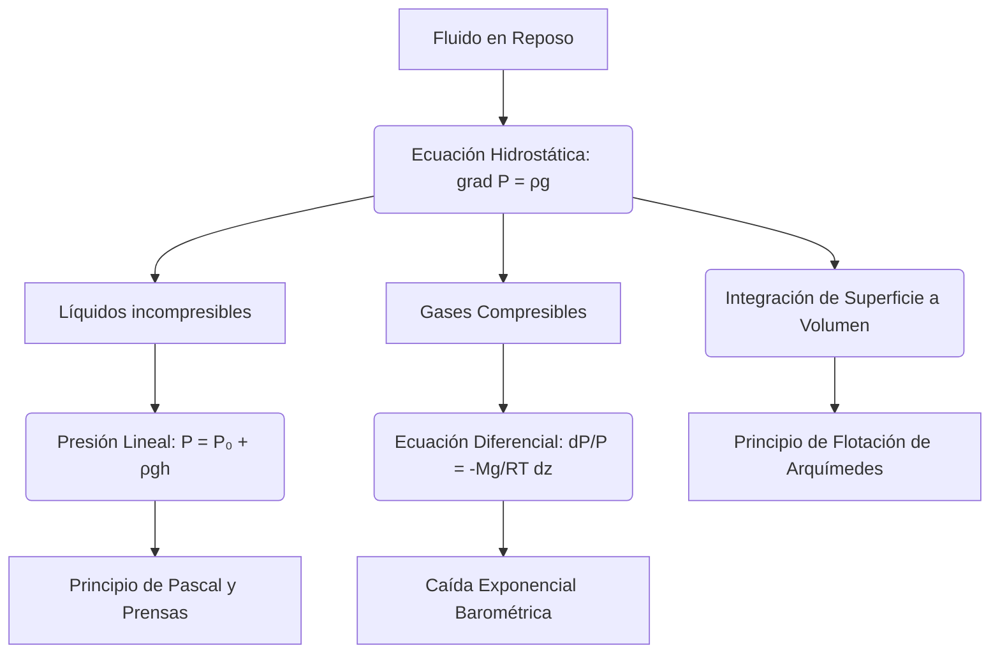

# Hidrostatica

La hidrostatica estudia fluidos en equilibrio. Aunque no haya movimiento, la distribución de presión en un fluido determina fenómenos fundamentales como la flotación, la estabilidad de recipientes, la hidráulica y el comportamiento de la atmósfera y de los océanos a primera aproximación.

## 🧮 Desarrollo Teórico Profundo

El estudio riguroso de la hidrostática se deduce de las ecuaciones de Navier-Stokes y Euler al aplicar la condición de velocidad nula en todas partes ($\vec{v} = 0$) y en todo tiempo. En ausencia de movimiento fluido, los términos convectivos, inerciales y viscosos desaparecen sistemáticamente.

### 1. La Ecuación Fundamental de la Hidrostática

Bajo la condición estática, la ecuación diferencial de conservación de la cantidad de movimiento se colapsa a un balance exclusivo entre las fuerzas de presión y las fuerzas de volumen (campo externo):
$$ \nabla p = \rho \vec{g} $$
Esta es la **Ecuación Fundamental de la Hidrostática**, que revela que el gradiente de presión escalar $\nabla p$ debe ser exactamente co-lineal con el campo vectorial de fuerzas por unidad de masa $\vec{g}$. 

**Consecuencias de la ecuación:**
1. Si el fluido está sujeto a un campo gravitatorio constante $\vec{g} = -g \hat{k}$ (donde $\hat{k}$ es el vector unitario vertical hacia arriba), la ecuación se descompone en:
   $$ \frac{\partial p}{\partial x} = 0, \quad \frac{\partial p}{\partial y} = 0, \quad \frac{\partial p}{\partial z} = -\rho g $$
   Esto demuestra rigurosamente que la presión es constante en planos isobáricos (planos horizontales $z = \text{cte}$).

2. Al integrar $\frac{dp}{dz} = -\rho g$ entre una referencia $z_0$ (superficie del líquido a presión $P_0$) y una profundidad arbitraria $h$ (donde $z = z_0 - h$), asumimos densidad incompresible constante $\rho$ para líquidos:
   $$ p(h) = P_0 + \rho g h $$
   Esta variación lineal de la presión (Presión Manométrica = $\rho gh$) es la razón por la que presas de agua son más gruesas en su base.

### 2. Isotropía del Tensor de Esfuerzos (Ley de Pascal)

En un estado de reposo absoluto sin gradientes de velocidad, la Ley de Fricción de Newton establece que todos los esfuerzos cortantes del tensor hidrodinámico de esfuerzos son idénticamente cero ($\tau_{ij} = 0$ para $i \neq j$). El tensor de esfuerzos hidrostáticos resulta en:
$$ \boldsymbol{\sigma} = -p \mathbf{I} $$
donde $\mathbf{I}$ es la matriz identidad. La presión estática $p$ es una magnitud escalar isotrópica; la fuerza ejercida sobre una superficie infinitesimal sumergida $d\vec{A}$ es idéntica en magnitud e inversamente normal a la superficie independientemente de su orientación ($d\vec{F} = -p \hat{n} dA$). Esto explica formalmente la premisa del Principio de Pascal de transmisión isótropa en fluidos confinados.

### 3. Fluido Compresible en Equilibrio Estático

Si consideramos un fluido altamente compresible como la atmósfera terrestre regido por la ecuación de los gases ideales ($p = \rho R T / M$), la densidad depende fuertemente de la presión y la temperatura. 
Sustituyendo $\rho(p)$ en la ecuación hidrostática obtenemos:
$$ \frac{dp}{dz} = -\left(\frac{p M}{R T}\right) g $$
Integrando esta ecuación diferencial lineal, asumiendo un modelo de atmósfera isotérmica ($T = \text{cte}$), derivamos la **Fórmula Barométrica**:
$$ p(z) = P_0 \exp\left(-\frac{Mg z}{RT}\right) $$
La presión atmosférica decae exponencialmente con la altitud $z$. 

### 4. Derivación del Principio de Arquímedes

Consideremos un cuerpo sumergido arbitrario de volumen $V$ y superficie $\partial V$. La fuerza neta ejercida por la presión del fluido circundante sobre su superficie es la integral de las fuerzas superficiales normales:
$$ \vec{F}_b = -\oint_{\partial V} p \hat{n} dA $$
Usando el teorema del gradiente (una variante del teorema de la divergencia):
$$ \vec{F}_b = -\iiint_V \nabla p \, dV $$
Sustituyendo el gradiente hidrostático $\nabla p = \rho_{\text{fluido}} \vec{g}$ (para líquido incompresible), obtenemos:
$$ \vec{F}_b = -\iiint_V \rho_{\text{fluido}} \vec{g} \, dV = -(\rho_{\text{fluido}} V) \vec{g} $$
La magnitud de esta fuerza ascensional o **Empuje** es exactamente el peso del volumen de fluido desplazado por el cuerpo ($m_{\text{desplazado}} g$), demostrando matemáticamente el Principio postulado por Arquímedes. Si el objeto pesa más que este empuje se hunde; si pesa menos, asciende hasta estabilizarse parcialmente sumergido, y si iguala, adquiere flotabilidad neutra.



## 📝 Guía de Ejercicios Resueltos

**Problema 1: Fuerza y Momento en una Compuerta Parabólica**
Una compuerta en un embalse tiene la forma de una parábola $y = ax^2$ y un ancho $b$ constante perpendicular a la página. El vértice de la parábola está en el fondo del embalse a profundidad $H$. Calcule la fuerza hidrostática horizontal y vertical sobre la compuerta.

**Solución paso a paso:**
1. La fuerza horizontal es igual a la fuerza sobre la proyección vertical de la superficie parabólica. El área proyectada es un rectángulo de ancho $b$ y altura $H$.
2. La profundidad del centroide del rectángulo proyectado es $h_c = H/2$.
3. Fuerza horizontal: $F_H = \gamma h_c A_{proy} = \rho g (H/2) (b H) = \frac{1}{2} \rho g b H^2$.
4. La fuerza vertical es igual al peso del volumen del fluido sobre la compuerta.
5. El volumen se calcula integrando el área parabólica. $y = ax^2 \implies x = \sqrt{y/a}$. La altura máxima es $H = ax_{max}^2 \implies x_{max} = \sqrt{H/a}$.
6. El área bajo la curva (fluido) es $A_p = \int_0^{x_{max}} (H - ax^2) dx = [Hx - \frac{a}{3}x^3]_0^{x_{max}} = H\sqrt{\frac{H}{a}} - \frac{a}{3} \left(\frac{H}{a}\right)^{3/2} = \left(1 - \frac{1}{3}\right) H \sqrt{\frac{H}{a}} = \frac{2}{3} H x_{max}$.
7. Fuerza vertical: $F_V = \gamma \text{Volumen} = \rho g b A_p = \frac{2}{3} \rho g b H x_{max}$.
8. La magnitud de la fuerza total es $F = \sqrt{F_H^2 + F_V^2}$ y su línea de acción pasa por el centro de presiones.

**Problema 2: Estabilidad de Cuerpos Flotantes (Metacentro)**
Un cono sólido circular recto de altura $H$ y radio base $R$, con densidad relativa $S < 1$, flota en agua con el vértice hacia abajo. Determine la condición matemática para $R$ y $H$ de modo que la posición de flotación sea estable.

**Solución paso a paso:**
1. El volumen desplazado es igual a la masa del cono: $V_D = S V_C = S \left(\frac{1}{3} \pi R^2 H\right)$.
2. Si el cono está sumergido a una profundidad $h$, el volumen es $V_D = \frac{1}{3} \pi r^2 h$. Por semejanza, $r/h = R/H \implies r = h R/H$.
3. Igualando: $\frac{1}{3} \pi \left(h \frac{R}{H}\right)^2 h = S \left(\frac{1}{3} \pi R^2 H\right) \implies h^3 = S H^3 \implies h = H S^{1/3}$.
4. Centro de gravedad $G$: Para un cono, $z_G = \frac{3}{4}H$ desde el vértice.
5. Centro de flotación $B$ (centroide del cono sumergido): $z_B = \frac{3}{4}h = \frac{3}{4}H S^{1/3}$.
6. El radio a nivel de flotación es $r = R S^{1/3}$. Momento de inercia del área de flotación: $I_0 = \frac{\pi}{4} r^4 = \frac{\pi}{4} R^4 S^{4/3}$.
7. Altura metacéntrica $BM = \frac{I_0}{V_D} = \frac{(\pi/4) R^4 S^{4/3}}{(1/3) \pi R^2 H S} = \frac{3}{4} \frac{R^2}{H} S^{1/3}$.
8. Distancia $BG = z_G - z_B = \frac{3}{4}H - \frac{3}{4}H S^{1/3} = \frac{3}{4}H (1 - S^{1/3})$.
9. Condición de estabilidad: $GM = BM - BG > 0 \implies \frac{3}{4} \frac{R^2}{H} S^{1/3} > \frac{3}{4}H (1 - S^{1/3})$.
10. Simplificando: $\frac{R^2}{H^2} > \frac{1 - S^{1/3}}{S^{1/3}} \implies \left(\frac{R}{H}\right)^2 > S^{-1/3} - 1$.

**Problema 3: Rotación de Masa Fluida (Paraboloide de Presión)**
Un tanque cilíndrico de radio $R$ contiene agua hasta una altura $h_0$. El tanque se hace rotar con velocidad angular constante $\omega$ sobre su eje vertical central. Calcule la velocidad angular $\omega_{max}$ requerida para que el agua apenas exponga el fondo del tanque.

**Solución paso a paso:**
1. La superficie libre en rotación adopta la forma de un paraboloide: $z(r) = z_0 + \frac{\omega^2 r^2}{2g}$, donde $z_0$ es la altura en el centro ($r=0$).
2. El volumen de un paraboloide de revolución entre $r=0$ y $r=R$ es la mitad del volumen del cilindro circunscrito: $V_{aire} = \frac{1}{2} (\pi R^2) \Delta z = \frac{1}{2} \pi R^2 (\frac{\omega^2 R^2}{2g})$.
3. Por conservación del volumen de líquido, la elevación del nivel de agua en el borde es igual al descenso en el centro: $z_{borde} - h_0 = h_0 - z_0 = \frac{\omega^2 R^2}{4g}$.
4. Así que $z_0 = h_0 - \frac{\omega^2 R^2}{4g}$.
5. Si el agua apenas expone el centro del fondo, entonces $z_0 = 0$.
6. Igualamos: $0 = h_0 - \frac{\omega^2 R^2}{4g} \implies \omega^2 = \frac{4 g h_0}{R^2}$.
7. La velocidad angular requerida es $\omega_{max} = \frac{2}{R} \sqrt{g h_0}$.

## 💻 Simulaciones Computacionales

Simulación computacional del principio de flotación y cálculo del gradiente de presión estática en una columna de fluido estratificado.

```python
import numpy as np
import matplotlib.pyplot as plt

# Estratificación oceánica simple (termoclina)
depth = np.linspace(0, 1000, 100) # m
rho_surface = 1025.0
rho_deep = 1040.0
# Perfil de densidad sigmoideo
rho = rho_surface + (rho_deep - rho_surface) / (1 + np.exp(-(depth - 300)/50))

# Integración numérica para la presión hidrostática: dP = rho * g * dz
g = 9.81
P = np.zeros_like(depth)
P[0] = 101325 # Patm en superficie

for i in range(1, len(depth)):
    dz = depth[i] - depth[i-1]
    # Trapecio
    rho_avg = 0.5 * (rho[i] + rho[i-1])
    P[i] = P[i-1] + rho_avg * g * dz

fig, (ax1, ax2) = plt.subplots(1, 2, figsize=(12, 6))

ax1.plot(rho, depth, 'b-', lw=2)
ax1.invert_yaxis()
ax1.set_title("Perfil de Densidad (Océano)")
ax1.set_xlabel("Densidad (kg/m^3)")
ax1.set_ylabel("Profundidad (m)")
ax1.grid(True)

ax2.plot(P / 1e5, depth, 'r-', lw=2) # Presión en bar
ax2.invert_yaxis()
ax2.set_title("Presión Hidrostática")
ax2.set_xlabel("Presión (bar)")
ax2.grid(True)

plt.tight_layout()
plt.show()
```

## 📚 Recursos
### Cursos Específicos
1. ["Physics 101: Fluid Statics" - Coursera](https://www.coursera.org/learn/physics-101)
2. ["Hydrostatics and Pneumatics" - NPTEL](https://nptel.ac.in/)
3. ["Basic Fluid Mechanics: Statics" - MIT OCW](https://ocw.mit.edu/)
4. ["Introduction to Oceanography and Hydrostatics" - edX](https://www.edx.org/)
5. ["Hydraulic Engineering" - NPTEL](https://nptel.ac.in/courses/105105110)
6. ["Atmospheric and Oceanic Fluid Dynamics" - Coursera](https://www.coursera.org/)

### Artículos y Simulaciones
1. ["On Floating Bodies" - Archimedes](https://en.wikipedia.org/wiki/On_Floating_Bodies)
2. [PhET Interactive Simulations: "Under Pressure"](https://phet.colorado.edu/en/simulations/under-pressure)
3. [PhET Interactive Simulations: "Buoyancy"](https://phet.colorado.edu/en/simulations/buoyancy)
4. ["The Treatise on the Equilibrium of Liquids" - Blaise Pascal](https://archive.org/details/physicaltreatise00pasc)
5. [Virtual Labs: Hydraulic Press Simulation](https://vlab.amrita.edu/?sub=1&brch=74&sim=1521&cnt=1)
6. [CFD Online: Hydrostatic Pressure Profiles](https://www.cfd-online.com/)
7. ["Stability of Floating Bodies" - Journal of Ship Research](https://sname.org/journal-of-ship-research)
8. [NOAA: Atmospheric Hydrostatic Balance Models](https://www.noaa.gov/)
9. ["Experimental Verification of Archimedes Principle" - Lab Guides](https://www.physicsclassroom.com/)
10. [SimScale: Dam and Reservoir Static Pressure Simulations](https://www.simscale.com/projects/)

### 📖 Referencias Útiles y Bibliografía
1. [*Fluid Mechanics* - L.D. Landau y E.M. Lifshitz](https://www.amazon.com/Fluid-Mechanics-Second-Theoretical-Physics/dp/0080339336)
2. [*Fluid Mechanics* - Pijush K. Kundu y Ira M. Cohen](https://www.amazon.com/Fluid-Mechanics-Pijush-K-Kundu/dp/012405935X)
3. [*Fundamentals of Fluid Mechanics* - Bruce R. Munson](https://www.amazon.com/Fundamentals-Fluid-Mechanics-Bruce-Munson/dp/1118116135)
4. [*Hydrodynamics* - Sir Horace Lamb](https://www.amazon.com/Hydrodynamics-Sir-Horace-Lamb/dp/0486602567)
