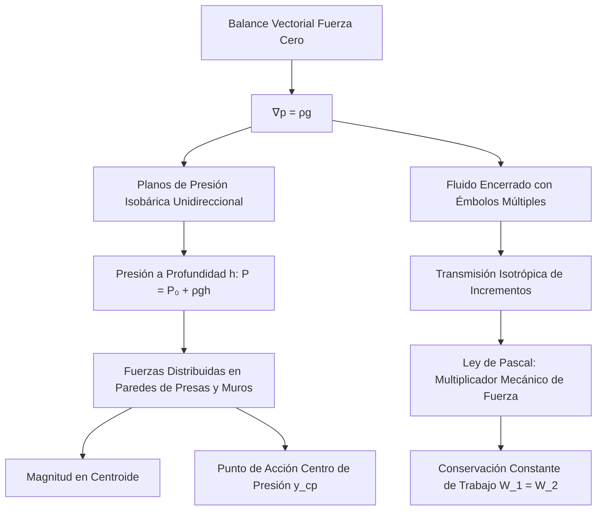

# Hidrostática y Principio de Pascal
La hidrostática estudia los fluidos en estado de reposo. Se basa en principios fundamentales como las variaciones de presión con la profundidad, el principio de Pascal y el principio de flotación de Arquímedes.

## 📜 Contexto Histórico
El principio de flotabilidad fue descubierto por Arquímedes de Siracusa en el siglo III a.C. Siglos después, en 1647, Blaise Pascal formuló la ley que lleva su nombre, afirmando que un cambio de presión aplicado a un fluido encerrado se transmite sin disminución a todas las partes del fluido, lo cual es la base de la hidráulica moderna.

## 🧮 Desarrollo Teórico Profundo

La hidrostática y el Principio de Pascal no son empíricos aislados, sino resoluciones analíticas derivadas de las ecuaciones del continuo, del concepto termodinámico de presión y del balance de fuerzas externas en cuerpos rígidos limitados.

### 1. El Operador Gradiente en Hidrostática

Sea un volumen de fluido material $V$, la sumatoria de fuerzas macroscópicas es:
$$ \sum \vec{F} = \vec{F}_{volumen} + \vec{F}_{superficie} = \int_V \rho \vec{g} dV - \oint_S p \hat{n} dS = 0 $$
Por el Teorema de Gauss, la integral de superficie cerrada se transforma en volumen: $\oint_S p \hat{n} dS = \int_V \nabla p dV$.
Así, tenemos $\int_V (\rho \vec{g} - \nabla p) dV = 0$. Como esto debe ser verdadero para cualquier volumen analizado arbitrariamente pequeño, el integrando debe ser rigurosamente nulo:
$$ \nabla p = \rho \vec{g} $$
Dado que el rotacional de un gradiente es siempre cero ($\nabla \times \nabla p = 0$), el campo $\rho \vec{g}$ debe ser irrotacional. Para líquidos incompresibles (donde $\rho$ es constante), en un eje de coordenadas cartesiano donde la gravedad es $\vec{g} = (0, 0, -g)$:
$$ \frac{\partial p}{\partial x} = 0, \quad \frac{\partial p}{\partial y} = 0, \quad \frac{\partial p}{\partial z} = -\rho g $$

### 2. Conservación del Trabajo en la Prensa Hidráulica de Pascal

La formalización del Principio de Pascal, que indica que "una presión $P_{ext}$ ejercida en un punto de un líquido se transmite con igual magnitud en todas direcciones e isotrópicamente", deviene de integrar $\nabla p = \rho \vec{g}$ con una presión de contorno $P_0$ impuesta artificialmente.
$$ P(z) = P_{\text{ambiente}} + P_{\text{externa}} + \rho g h_{profundidad} $$
En un sistema interconectado cerrado con dos émbolos de áreas $A_1 \ll A_2$, una fuerza $F_1$ genera una presión incremental $\Delta p = F_1/A_1$. Esta presión es uniforme a través de todo el volumen estático confinado (ignorando los gradientes de la propia gravedad). 
La fuerza reactiva experimentada en el segundo émbolo es:
$$ F_2 = \Delta p \cdot A_2 = F_1 \left(\frac{A_2}{A_1}\right) $$
Esta es una inmensa **ventaja mecánica**. Para no violar el principio de conservación de la energía y la termodinámica fundamental, el trabajo debe conservarse: $\text{Trabajo}_{\text{in}} = \text{Trabajo}_{\text{out}}$. 
Asumiendo líquido incompresible, el volumen desplazado en un émbolo empujando distancia $d_1$ es compensado por la expansión en el otro $d_2$:
$$ V_{despl} = A_1 d_1 = A_2 d_2 \implies d_2 = d_1 \frac{A_1}{A_2} $$
El trabajo saliente es:
$$ W_2 = F_2 d_2 = \left( F_1 \frac{A_2}{A_1} \right) \left( d_1 \frac{A_1}{A_2} \right) = F_1 d_1 = W_1 $$
Demostrando que, aunque se multiplica dramáticamente la fuerza, se requiere un enorme recorrido $d_1$ para elevar marginalmente el pistón masivo en la distancia $d_2$.

### 3. El Centro de Presiones y la Fuerza Resultante sobre Superficies

Cuando un líquido presiona contra un muro de retención (una presa) o las paredes de un contenedor, la fuerza no es puntual, está linealmente distribuida: $p(h) = \rho g h$.
La fuerza resultante neta es la integral sobre el área proyectada de la superficie sumergida plana con inclinación $\theta$:
$$ F_{neta} = \int_A p \, dA = \int_A \rho g y \sin\theta \, dA = \rho g \sin\theta \int_A y dA = \rho g \sin\theta (y_{cg} A) $$
donde $y_{cg}$ es la distancia al centro de gravedad topológico del área. En conclusión: la magnitud de la fuerza resultante depende exclusivamente del área superficial y de la presión específica que se experimenta en su Centroide, no de la forma total.
El punto preciso donde esta fuerza consolidada teóricamente incide se conoce como **Centro de Presión ($y_{cp}$)** y siempre está situado geométrica y analíticamente más bajo que el propio Centroide, debido al momento polar y al gradiente hidrostático lineal:
$$ y_{cp} = y_{cg} + \frac{I_{cg}}{y_{cg} A} $$
donde $I_{cg}$ es el segundo momento de área (momento de inercia inercial geométrico).



## 🛠 Ejemplo Práctico
**Problema:** Una corona supuestamente de oro ($ \rho_{\text{oro}} = 19.3 \text{ g/cm}^3 $) tiene una masa de $ 1.5 \text{ kg} $ en el aire. Al sumergirla completamente en agua ($ \rho_{\text{agua}} = 1000 \text{ kg/m}^3 $), su peso aparente es de $ 13.5 \text{ N} $. ¿Es la corona de oro puro? ($ g = 9.8 \text{ m/s}^2 $).

**Solución paso a paso:**
1. Peso real en el aire: $ W = m g = 1.5 \times 9.8 = 14.7 \text{ N} $.
2. La fuerza de flotación $ E $ es la diferencia entre el peso real y el peso aparente:
   $ E = 14.7 \text{ N} - 13.5 \text{ N} = 1.2 \text{ N} $.
3. Relacionamos $ E $ con el volumen de la corona:
   $$ E = \rho_{\text{agua}} V g \implies V = \frac{E}{\rho_{\text{agua}} g} $$
   $ V = \frac{1.2}{1000 \times 9.8} = \frac{1.2}{9800} \approx 1.224 \times 10^{-4} \text{ m}^3 $.
4. Calculamos la densidad de la corona:
   $ \rho = \frac{m}{V} = \frac{1.5}{1.224 \times 10^{-4}} \approx 12250 \text{ kg/m}^3 = 12.25 \text{ g/cm}^3 $.
5. **Conclusión:** Como la densidad $ 12.25 \text{ g/cm}^3 $ es mucho menor que la del oro puro ($ 19.3 \text{ g/cm}^3 $), la corona no es de oro puro (el joyero intentó estafar al rey).

## 📝 Guía de Ejercicios Resueltos

**Problema 1: Fuerza y Momento en una Compuerta Parabólica**
Una compuerta en un embalse tiene la forma de una parábola $y = ax^2$ y un ancho $b$ constante perpendicular a la página. El vértice de la parábola está en el fondo del embalse a profundidad $H$. Calcule la fuerza hidrostática horizontal y vertical sobre la compuerta.

**Solución paso a paso:**
1. La fuerza horizontal es igual a la fuerza sobre la proyección vertical de la superficie parabólica. El área proyectada es un rectángulo de ancho $b$ y altura $H$.
2. La profundidad del centroide del rectángulo proyectado es $h_c = H/2$.
3. Fuerza horizontal: $F_H = \gamma h_c A_{proy} = \rho g (H/2) (b H) = \frac{1}{2} \rho g b H^2$.
4. La fuerza vertical es igual al peso del volumen del fluido sobre la compuerta.
5. El volumen se calcula integrando el área parabólica. $y = ax^2 \implies x = \sqrt{y/a}$. La altura máxima es $H = ax_{max}^2 \implies x_{max} = \sqrt{H/a}$.
6. El área bajo la curva (fluido) es $A_p = \int_0^{x_{max}} (H - ax^2) dx = [Hx - \frac{a}{3}x^3]_0^{x_{max}} = H\sqrt{\frac{H}{a}} - \frac{a}{3} \left(\frac{H}{a}\right)^{3/2} = \left(1 - \frac{1}{3}\right) H \sqrt{\frac{H}{a}} = \frac{2}{3} H x_{max}$.
7. Fuerza vertical: $F_V = \gamma \text{Volumen} = \rho g b A_p = \frac{2}{3} \rho g b H x_{max}$.
8. La magnitud de la fuerza total es $F = \sqrt{F_H^2 + F_V^2}$ y su línea de acción pasa por el centro de presiones.

**Problema 2: Estabilidad de Cuerpos Flotantes (Metacentro)**
Un cono sólido circular recto de altura $H$ y radio base $R$, con densidad relativa $S < 1$, flota en agua con el vértice hacia abajo. Determine la condición matemática para $R$ y $H$ de modo que la posición de flotación sea estable.

**Solución paso a paso:**
1. El volumen desplazado es igual a la masa del cono: $V_D = S V_C = S \left(\frac{1}{3} \pi R^2 H\right)$.
2. Si el cono está sumergido a una profundidad $h$, el volumen es $V_D = \frac{1}{3} \pi r^2 h$. Por semejanza, $r/h = R/H \implies r = h R/H$.
3. Igualando: $\frac{1}{3} \pi \left(h \frac{R}{H}\right)^2 h = S \left(\frac{1}{3} \pi R^2 H\right) \implies h^3 = S H^3 \implies h = H S^{1/3}$.
4. Centro de gravedad $G$: Para un cono, $z_G = \frac{3}{4}H$ desde el vértice.
5. Centro de flotación $B$ (centroide del cono sumergido): $z_B = \frac{3}{4}h = \frac{3}{4}H S^{1/3}$.
6. El radio a nivel de flotación es $r = R S^{1/3}$. Momento de inercia del área de flotación: $I_0 = \frac{\pi}{4} r^4 = \frac{\pi}{4} R^4 S^{4/3}$.
7. Altura metacéntrica $BM = \frac{I_0}{V_D} = \frac{(\pi/4) R^4 S^{4/3}}{(1/3) \pi R^2 H S} = \frac{3}{4} \frac{R^2}{H} S^{1/3}$.
8. Distancia $BG = z_G - z_B = \frac{3}{4}H - \frac{3}{4}H S^{1/3} = \frac{3}{4}H (1 - S^{1/3})$.
9. Condición de estabilidad: $GM = BM - BG > 0 \implies \frac{3}{4} \frac{R^2}{H} S^{1/3} > \frac{3}{4}H (1 - S^{1/3})$.
10. Simplificando: $\frac{R^2}{H^2} > \frac{1 - S^{1/3}}{S^{1/3}} \implies \left(\frac{R}{H}\right)^2 > S^{-1/3} - 1$.

**Problema 3: Rotación de Masa Fluida (Paraboloide de Presión)**
Un tanque cilíndrico de radio $R$ contiene agua hasta una altura $h_0$. El tanque se hace rotar con velocidad angular constante $\omega$ sobre su eje vertical central. Calcule la velocidad angular $\omega_{max}$ requerida para que el agua apenas exponga el fondo del tanque.

**Solución paso a paso:**
1. La superficie libre en rotación adopta la forma de un paraboloide: $z(r) = z_0 + \frac{\omega^2 r^2}{2g}$, donde $z_0$ es la altura en el centro ($r=0$).
2. El volumen de un paraboloide de revolución entre $r=0$ y $r=R$ es la mitad del volumen del cilindro circunscrito: $V_{aire} = \frac{1}{2} (\pi R^2) \Delta z = \frac{1}{2} \pi R^2 (\frac{\omega^2 R^2}{2g})$.
3. Por conservación del volumen de líquido, la elevación del nivel de agua en el borde es igual al descenso en el centro: $z_{borde} - h_0 = h_0 - z_0 = \frac{\omega^2 R^2}{4g}$.
4. Así que $z_0 = h_0 - \frac{\omega^2 R^2}{4g}$.
5. Si el agua apenas expone el centro del fondo, entonces $z_0 = 0$.
6. Igualamos: $0 = h_0 - \frac{\omega^2 R^2}{4g} \implies \omega^2 = \frac{4 g h_0}{R^2}$.
7. La velocidad angular requerida es $\omega_{max} = \frac{2}{R} \sqrt{g h_0}$.

## 💻 Simulaciones Computacionales

Simulador de empuje hidrostático y centro de presiones sobre un muro de contención (presa) utilizando integración numérica sobre el área sumergida.

```python
import numpy as np
import matplotlib.pyplot as plt

# Geometría del muro
y = np.linspace(0, 20, 100) # Profundidad de 0 a 20m
width = 50.0 # Ancho del muro constante 50m
rho = 1000.0
g = 9.81

# Distribución de presión
P = rho * g * y

# Fuerza diferencial dF = P * width * dy
dy = y[1] - y[0]
dF = P * width * dy

# Fuerza neta integrando
F_total = np.sum(dF)

# Centro de presión y_cp = Integracion(y * dF) / F_total
y_cp = np.sum(y * dF) / F_total

print(f"Fuerza Total en el muro: {F_total/1e6:.2f} MN")
print(f"Profundidad del Centro de Presiones: {y_cp:.2f} m")

plt.figure(figsize=(6, 8))
plt.fill_betweenx(y, P/1e3, 0, color='cyan', alpha=0.3, label="Distribución de Presión")
plt.plot(P/1e3, y, 'b-', lw=2)
plt.axhline(y_cp, color='red', linestyle='--', lw=2, label=f'Centro de Presión ({y_cp:.1f} m)')
plt.gca().invert_yaxis()
plt.title("Presión Hidrostática en Muro de Contención")
plt.xlabel("Presión (kPa)")
plt.ylabel("Profundidad (m)")
plt.legend()
plt.grid(True)
plt.show()
```

## 🚀 Fronteras de Investigación y Problemas Abiertos

La hidrostática en 2026 ha renacido gracias al campo de los **fluidos activos** y las superficies programables. Ya no se trata solo de fluidos en reposo absoluto, sino de investigar medios donde el "reposo" macroscópico es el resultado del caos microscópico propulsado (bacterias, micro-motores). Además, la hidrostática capilar en entornos de microgravedad y el diseño de "metamateriales hidrostáticos" (donde fluidos nano-confinados muestran compresibilidades anómalas e incluso negativas) están revolucionando la absorción de energía. Un problema abierto es el comportamiento termodinámico exacto del agua super-enfriada confinada en poros bidimensionales, donde exhibe transiciones de fase líquida-líquida exóticas.

## 📐 Formalismo Matemático Avanzado (Nivel Posgrado/Doctorado)

La hidrostática capilar avanzada y la formación de meniscos se formulan como un problema en la **Geometría Diferencial de Superficies**. La condición de equilibrio mecánico interfacial (Ecuación de Young-Laplace) dictamina que la presión de salto a través de la interfaz es proporcional a su Curvatura Media $H$. Minimizar la energía libre de Helmholtz bajo una restricción de volumen conduce al estudio de las Superficies de Curvatura Media Constante (CMC).
En el formalismo del cálculo exterior sobre una variedad Riemanniana $(M, g)$, si la interfaz $\Sigma$ es una subvariedad embebida, la variación de la funcional de energía capilar es:
$$ \delta \mathcal{E} = \int_\Sigma \left( \Delta P - \gamma \text{tr}(II) \right) \delta x \cdot \mathbf{n} \, dA + \oint_{\partial \Sigma} \left( \gamma \cos\theta_c - \gamma_{SL} + \gamma_{SV} \right) \delta x \cdot \nu \, ds $$
donde $II$ es la segunda forma fundamental de $\Sigma$, $\mathbf{n}$ el vector normal y $\theta_c$ el ángulo de contacto estático de Young. La resolución geométrica implica estudiar operadores elípticos sobre estas variedades.

## 📚 Recursos Específicos

### Cursos Recomendados
1. [Physics 101: Fluid Statics and Pascal's Principle (Coursera)](https://www.coursera.org/learn/physics-101)
2. [Fluid Mechanics: Statics and Kinematics (edX)](https://www.edx.org/learn/fluid-mechanics)
3. [Introductory Physics: Fluids (MIT OCW)](https://ocw.mit.edu/courses/physics/8-01sc-classical-mechanics-fall-2016/fluid-mechanics/)

### Artículos y Simulaciones
1. **On Floating Bodies (Archimedes, c. 250 BC)**
   - **Enlace:** [https://en.wikipedia.org/wiki/On_Floating_Bodies](https://en.wikipedia.org/wiki/On_Floating_Bodies)
   - **Importancia Teórica:** El texto fundador de la hidrostática, estableció el famoso principio de empuje para objetos total o parcialmente sumergidos.
   - **Fondo Matemático:** El principio de Arquímedes dictamina que la fuerza de flotación $F_B$ equivale al peso del fluido desplazado:
     $$
     F_B = \rho_{\text{fluido}} \cdot V_{\text{sumergido}} \cdot g
     $$
   - **Implicaciones Físicas:** Demuestra el equilibrio de fuerzas estáticas gravitacionales en medios continuos, aplicable universalmente a barcos, globos aerostáticos e isostasia geológica.

2. **The Treatise on the Equilibrium of Liquids (Blaise Pascal, 1653)**
   - **Enlace:** [https://archive.org/details/physicaltreatise00pasc](https://archive.org/details/physicaltreatise00pasc)
   - **Importancia Teórica:** Formuló el Principio de Pascal, aclarando que en un fluido incompresible en reposo, cualquier variación de presión se transmite isotrópicamente sin atenuación.
   - **Fondo Matemático:** Define la igualdad de tensiones isotrópicas:
     $$
     \Delta P_1 = \Delta P_2 \implies \frac{F_1}{A_1} = \frac{F_2}{A_2}
     $$
   - **Implicaciones Físicas:** Constituye la base física de la prensa hidráulica y la transmisión de potencia en la ingeniería civil, multiplicando la fuerza lineal mediante geometría de área.

3. **Stability of Floating Bodies (Journal of Ship Research)**
   - **Enlace:** [https://sname.org/journal-of-ship-research](https://sname.org/journal-of-ship-research)
   - **Importancia Teórica:** Examina las condiciones rigurosas de equilibrio rotacional en el diseño hidroestático moderno.
   - **Fondo Matemático:** La estabilidad depende de la posición relativa del metacentro $M$ y el centro de gravedad $G$. Para estabilidad asintótica de un ángulo pequeño $\theta$, el par restaurador $\tau$ obedece:
     $$
     \tau = W \cdot \overline{GM} \cdot \sin(\theta)
     $$
     donde $\overline{GM} > 0$ exige que el metacentro esté arriba de la gravedad.
   - **Implicaciones Físicas:** Crucial para la arquitectura naval y el diseño de boyas oceanográficas frente a perturbaciones estocásticas de las olas marinas.

### 📖 Referencias Útiles y Bibliografía
1. [Fluid Mechanics (L.D. Landau y E.M. Lifshitz)](https://www.amazon.com/Fluid-Mechanics-Second-Theoretical-Physics/dp/0080339336)
2. [Introduction to Fluid Mechanics (R.W. Fox, A.T. McDonald)](https://www.amazon.com/Fox-McDonalds-Introduction-Fluid-Mechanics/dp/1119616175)

## 🌐 Seminarios Avanzados y Literatura de Frontera

- [Stanford Fluids Seminars](https://fluids.stanford.edu/) - Investigaciones sobre presión en medios porosos complejos.
- [Caltech Fluid Mechanics Seminars](https://eas.caltech.edu/) - Dinámica y estática de fluidos complejos bajo presiones extremas.
- [Harvard Soft Matter Seminars](https://seas.harvard.edu/) - Transmisión de presión (Pascal) en fluidos no newtonianos e hidrogeles.

- [Nature Materials: "High-pressure physics of fluids"](https://www.nature.com/nmat/) - Efectos sorprendentes del principio de Pascal en transiciones de fase a gigapascales.
- [Science Advances: "Hydraulic metamaterials"](https://www.science.org/journal/sciadv) - Mecanismos fluídicos programables a microescala explotando isostasia.
- [Physical Review E: "Hydrostatics of jammed soft particles"](https://journals.aps.org/pre/) - Desviaciones del principio de Pascal en suspensiones de materia granular densa.
