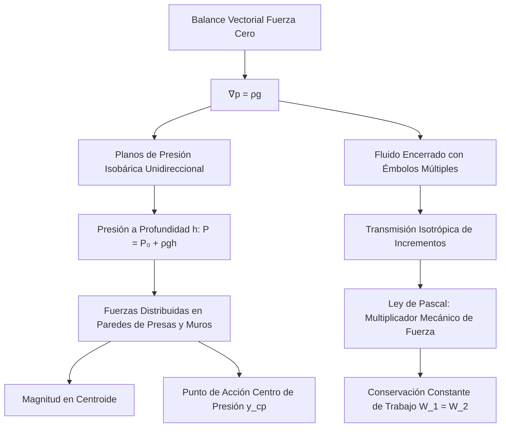

# Hidrostática y Principio de Pascal
La hidrostática estudia los fluidos en estado de reposo. Se basa en principios fundamentales como las variaciones de presión con la profundidad, el principio de Pascal y el principio de flotación de Arquímedes.

## 📜 Contexto Histórico
El principio de flotabilidad fue descubierto por Arquímedes de Siracusa en el siglo III a.C. Siglos después, en 1647, Blaise Pascal formuló la ley que lleva su nombre, afirmando que un cambio de presión aplicado a un fluido encerrado se transmite sin disminución a todas las partes del fluido, lo cual es la base de la hidráulica moderna.

## 🧮 Desarrollo Teórico Profundo

La hidrostática y el Principio de Pascal no son empíricos aislados, sino resoluciones analíticas derivadas de las ecuaciones del continuo, del concepto termodinámico de presión y del balance de fuerzas externas en cuerpos rígidos limitados.

### 1. El Operador Gradiente en Hidrostática

Sea un volumen de fluido material $V$, la sumatoria de fuerzas macroscópicas es:
$$ \sum \vec{F} = \vec{F}_{volumen} + \vec{F}_{superficie} = \int_V \rho \vec{g} dV - \oint_S p \hat{n} dS = 0 $$
Por el Teorema de Gauss, la integral de superficie cerrada se transforma en volumen: $\oint_S p \hat{n} dS = \int_V \nabla p dV$.
Así, tenemos $\int_V (\rho \vec{g} - \nabla p) dV = 0$. Como esto debe ser verdadero para cualquier volumen analizado arbitrariamente pequeño, el integrando debe ser rigurosamente nulo:
$$ \nabla p = \rho \vec{g} $$
Dado que el rotacional de un gradiente es siempre cero ($\nabla \times \nabla p = 0$), el campo $\rho \vec{g}$ debe ser irrotacional. Para líquidos incompresibles (donde $\rho$ es constante), en un eje de coordenadas cartesiano donde la gravedad es $\vec{g} = (0, 0, -g)$:
$$ \frac{\partial p}{\partial x} = 0, \quad \frac{\partial p}{\partial y} = 0, \quad \frac{\partial p}{\partial z} = -\rho g $$

### 2. Conservación del Trabajo en la Prensa Hidráulica de Pascal

La formalización del Principio de Pascal, que indica que "una presión $P_{ext}$ ejercida en un punto de un líquido se transmite con igual magnitud en todas direcciones e isotrópicamente", deviene de integrar $\nabla p = \rho \vec{g}$ con una presión de contorno $P_0$ impuesta artificialmente.
$$ P(z) = P_{\text{ambiente}} + P_{\text{externa}} + \rho g h_{profundidad} $$
En un sistema interconectado cerrado con dos émbolos de áreas $A_1 \ll A_2$, una fuerza $F_1$ genera una presión incremental $\Delta p = F_1/A_1$. Esta presión es uniforme a través de todo el volumen estático confinado (ignorando los gradientes de la propia gravedad). 
La fuerza reactiva experimentada en el segundo émbolo es:
$$ F_2 = \Delta p \cdot A_2 = F_1 \left(\frac{A_2}{A_1}\right) $$
Esta es una inmensa **ventaja mecánica**. Para no violar el principio de conservación de la energía y la termodinámica fundamental, el trabajo debe conservarse: $\text{Trabajo}_{\text{in}} = \text{Trabajo}_{\text{out}}$. 
Asumiendo líquido incompresible, el volumen desplazado en un émbolo empujando distancia $d_1$ es compensado por la expansión en el otro $d_2$:
$$ V_{despl} = A_1 d_1 = A_2 d_2 \implies d_2 = d_1 \frac{A_1}{A_2} $$
El trabajo saliente es:
$$ W_2 = F_2 d_2 = \left( F_1 \frac{A_2}{A_1} \right) \left( d_1 \frac{A_1}{A_2} \right) = F_1 d_1 = W_1 $$
Demostrando que, aunque se multiplica dramáticamente la fuerza, se requiere un enorme recorrido $d_1$ para elevar marginalmente el pistón masivo en la distancia $d_2$.

### 3. El Centro de Presiones y la Fuerza Resultante sobre Superficies

Cuando un líquido presiona contra un muro de retención (una presa) o las paredes de un contenedor, la fuerza no es puntual, está linealmente distribuida: $p(h) = \rho g h$.
La fuerza resultante neta es la integral sobre el área proyectada de la superficie sumergida plana con inclinación $\theta$:
$$ F_{neta} = \int_A p \, dA = \int_A \rho g y \sin\theta \, dA = \rho g \sin\theta \int_A y dA = \rho g \sin\theta (y_{cg} A) $$
donde $y_{cg}$ es la distancia al centro de gravedad topológico del área. En conclusión: la magnitud de la fuerza resultante depende exclusivamente del área superficial y de la presión específica que se experimenta en su Centroide, no de la forma total.
El punto preciso donde esta fuerza consolidada teóricamente incide se conoce como **Centro de Presión ($y_{cp}$)** y siempre está situado geométrica y analíticamente más bajo que el propio Centroide, debido al momento polar y al gradiente hidrostático lineal:
$$ y_{cp} = y_{cg} + \frac{I_{cg}}{y_{cg} A} $$
donde $I_{cg}$ es el segundo momento de área (momento de inercia inercial geométrico).

## 🛠 Ejemplo Práctico
**Problema:** Una corona supuestamente de oro ($ \rho_{\text{oro}} = 19.3 \text{ g/cm}^3 $) tiene una masa de $ 1.5 \text{ kg} $ en el aire. Al sumergirla completamente en agua ($ \rho_{\text{agua}} = 1000 \text{ kg/m}^3 $), su peso aparente es de $ 13.5 \text{ N} $. ¿Es la corona de oro puro? ($ g = 9.8 \text{ m/s}^2 $).

**Solución paso a paso:**
1. Peso real en el aire: $ W = m g = 1.5 \times 9.8 = 14.7 \text{ N} $.
2. La fuerza de flotación $ E $ es la diferencia entre el peso real y el peso aparente:
   $ E = 14.7 \text{ N} - 13.5 \text{ N} = 1.2 \text{ N} $.
3. Relacionamos $ E $ con el volumen de la corona:
   $$ E = \rho_{\text{agua}} V g \implies V = \frac{E}{\rho_{\text{agua}} g} $$
   $ V = \frac{1.2}{1000 \times 9.8} = \frac{1.2}{9800} \approx 1.224 \times 10^{-4} \text{ m}^3 $.
4. Calculamos la densidad de la corona:
   $ \rho = \frac{m}{V} = \frac{1.5}{1.224 \times 10^{-4}} \approx 12250 \text{ kg/m}^3 = 12.25 \text{ g/cm}^3 $.
5. **Conclusión:** Como la densidad $ 12.25 \text{ g/cm}^3 $ es mucho menor que la del oro puro ($ 19.3 \text{ g/cm}^3 $), la corona no es de oro puro (el joyero intentó estafar al rey).

## 📚 Recursos
### Cursos Específicos
1. ["Physics 101: Fluid Statics and Pascal's Principle" - Coursera](https://www.coursera.org/learn/physics-101)
2. ["Fluid Mechanics: Statics and Kinematics" - edX](https://www.edx.org/learn/fluid-mechanics)
3. ["Hydraulics and Pneumatics Systems" - NPTEL](https://nptel.ac.in/courses/112105047)
4. ["Introductory Physics: Fluids" - MIT OCW](https://ocw.mit.edu/courses/physics/8-01sc-classical-mechanics-fall-2016/fluid-mechanics/)
5. ["Engineering Mechanics: Statics" - Coursera](https://www.coursera.org/learn/engineering-mechanics-statics)
6. ["Applied Hydrostatics" - Udemy](https://www.udemy.com/topic/fluid-mechanics/)

### Artículos y Simulaciones
1. [PhET Interactive Simulations: "Under Pressure"](https://phet.colorado.edu/en/simulations/under-pressure)
2. [PhET Interactive Simulations: "Buoyancy"](https://phet.colorado.edu/en/simulations/buoyancy)
3. ["The Treatise on the Equilibrium of Liquids" - Blaise Pascal](https://archive.org/details/physicaltreatise00pasc)
4. [Capítulos de Estática de Fluidos en Fox & McDonald](https://www.amazon.com/Fox-McDonalds-Introduction-Fluid-Mechanics/dp/1119616175)
5. ["Archimedes to Hawking: Laws of Science" - Clifford Pickover](https://www.amazon.com/Archimedes-Hawking-Laws-Science-Behind/dp/0195336119)
6. [Simulación de Prensas Hidráulicas (Virtual Lab)](https://vlab.amrita.edu/?sub=1&brch=74&sim=1521&cnt=1)
7. ["Pascal's Principle and Hydraulic Brakes" - Automotive Engineering Journals](https://www.sae.org/publications/journals)
8. ["Stability of Submarines and Floating Vessels" - Naval Architecture Papers](https://www.rina.org.uk/publications.html)
9. [Experimentos de tubo en U y barómetros virtuales](https://www.physicsclassroom.com/class/fluids)

### 📖 Referencias Útiles y Bibliografía
1. [*Fluid Mechanics* - L.D. Landau y E.M. Lifshitz](https://www.amazon.com/Fluid-Mechanics-Second-Theoretical-Physics/dp/0080339336)
2. [*Fluid Mechanics* - Pijush K. Kundu y Ira M. Cohen](https://www.amazon.com/Fluid-Mechanics-Pijush-K-Kundu/dp/012405935X)
3. [*Introduction to Fluid Mechanics* - R.W. Fox, A.T. McDonald](https://www.amazon.com/Fox-McDonalds-Introduction-Fluid-Mechanics/dp/1119616175)
4. [*Fluid Mechanics* - Frank M. White](https://www.amazon.com/Fluid-Mechanics-Frank-White/dp/0073398276)
