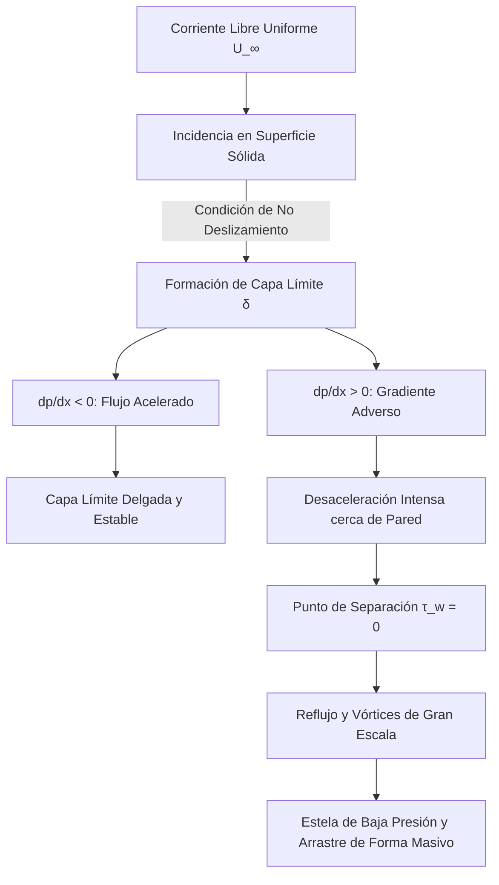

# Viscosidad y Capas Límite

La viscosidad mide la resistencia interna de un fluido a deformarse por cizalla. Aunque pueda parecer un detalle pequeño, es la responsable de efectos tan decisivos como la disipación de energía, el perfil de velocidad cerca de superficies, la fricción hidrodinámica y la transición a turbulencia.

## 🧮 Desarrollo Teórico Profundo

La dinámica de fluidos viscosos reales y la teoría de la capa límite (introducida por Ludwig Prandtl en 1904) resolvieron la aparente contradicción entre la hidrodinámica clásica de fluidos ideales (que predecía cero arrastre de forma, o Paradoja de D'Alembert) y las observaciones empíricas aeronáuticas.

### 1. El Tensor Viscoso y las Ecuaciones de Navier-Stokes

Para un fluido Newtoniano isotrópico incompresible, el tensor de esfuerzos de Cauchy se descompone en un término de presión termodinámica isotrópica y un tensor de esfuerzo viscoso $\boldsymbol{\tau}$:
$$ \sigma_{ij} = -p \delta_{ij} + \tau_{ij} $$
$$ \tau_{ij} = \mu \left( \frac{\partial u_i}{\partial x_j} + \frac{\partial u_j}{\partial x_i} \right) $$
donde $\mu$ es la viscosidad dinámica (reflejando fricción microscópica). Insertando esto en la ecuación de momento lineal (balance de fuerzas) se obtiene la Ecuación de Navier-Stokes:
$$ \rho \left( \frac{\partial \vec{v}}{\partial t} + (\vec{v} \cdot \nabla) \vec{v} \right) = -\nabla p + \mu \nabla^2 \vec{v} + \rho \vec{g} $$

### 2. Adimensionalización y Número de Reynolds

Consideremos un flujo con velocidad característica $U_0$ y longitud característica $L_0$. Definiendo variables adimensionales (marcadas con asterisco):
$$ \vec{x}^* = \frac{\vec{x}}{L_0}, \quad \vec{v}^* = \frac{\vec{v}}{U_0}, \quad t^* = \frac{t U_0}{L_0}, \quad p^* = \frac{p - p_0}{\rho U_0^2} $$
Sustituyendo en Navier-Stokes (ignorando la gravedad) obtenemos:
$$ \frac{\partial \vec{v}^*}{\partial t^*} + (\vec{v}^* \cdot \nabla^*) \vec{v}^* = -\nabla^* p^* + \frac{1}{Re} \nabla^{*2} \vec{v}^* $$
donde $Re = \frac{\rho U_0 L_0}{\mu}$ es el **Número de Reynolds**. Representa la relación estricta entre las fuerzas inerciales ($\rho U_0^2 / L_0$) y las fuerzas viscosas ($\mu U_0 / L_0^2$).

### 3. Aproximación de Capa Límite de Prandtl

Para $Re \gg 1$ (flujos de alta velocidad como un avión en vuelo), el término $\frac{1}{Re} \nabla^{*2} \vec{v}^*$ parece despreciable matemáticamente. Sin embargo, no se puede omitir, porque hacerlo reduce el orden de la ecuación diferencial, imposibilitando cumplir la **Condición de No Deslizamiento** en paredes sólidas ($\vec{v}_{pared} = 0$).

Prandtl postuló que el campo de flujo se divide asintóticamente en dos regiones:
1. **Flujo Exterior (Inviscido):** Donde la viscosidad es negligible y se rige por las Ecuaciones de Euler y Bernoulli.
2. **Capa Límite:** Una región ultradelgada contigua a la pared donde el gradiente de velocidad normal $\partial u / \partial y$ es gigantesco, haciendo que la fricción viscosa iguale a las fuerzas inerciales.

Sea el flujo bidimensional estacionario sobre una placa plana. Asumiendo que el espesor de la capa $\delta \ll L$, el análisis de orden de magnitud simplifica las ecuaciones de Navier-Stokes a las **Ecuaciones de Capa Límite de Prandtl**:
**Continuidad:**
$$ \frac{\partial u}{\partial x} + \frac{\partial v}{\partial y} = 0 $$
**Momento en $x$:**
$$ u \frac{\partial u}{\partial x} + v \frac{\partial u}{\partial y} = -\frac{1}{\rho}\frac{dp}{dx} + \nu \frac{\partial^2 u}{\partial y^2} $$
**Momento en $y$:**
$$ \frac{\partial p}{\partial y} \approx 0 \implies p = p(x) $$
El campo de presiones de la capa límite está enteramente impuesto por el flujo libre no viscoso exterior según la ecuación de Euler $dp/dx = -\rho U(dU/dx)$.

### 4. Solución Exacta de Blasius (Placa Plana)

Para una placa plana con $U = \text{cte}$ y $dp/dx = 0$, H. Blasius introdujo una variable de similitud:
$$ \eta = y \sqrt{\frac{U}{\nu x}} $$
y definió una función de corriente $\psi = \sqrt{\nu U x} f(\eta)$ para satisfacer continuidad. Sustituyendo en la ecuación de momento se obtiene la ecuación diferencial ordinaria no lineal de tercer orden (Ecuación de Blasius):
$$ 2 f''' + f f'' = 0 $$
con condiciones de frontera:
$$ f(0) = f'(0) = 0 \quad \text{(Pared)} $$
$$ f'(\eta \to \infty) = 1 \quad \text{(Corriente Libre)} $$
La solución numérica demuestra que la velocidad $u$ alcanza el $99\%$ de $U$ cuando $\eta \approx 4.91$. Por tanto, el espesor de la capa límite laminar crece con la raíz cuadrada de la distancia:
$$ \delta(x) = \frac{4.91 x}{\sqrt{Re_x}} $$
El esfuerzo cortante en la pared local es $\tau_w = 0.332 \rho U^2 / \sqrt{Re_x}$, lo que permite cuantificar analíticamente la fricción y fuerza de arrastre por primera vez en la historia de la aerodinámica.

### 5. Separación de la Capa Límite y Estelas

Cuando el fluido atraviesa geometrías divergentes o cilindros, el flujo exterior se desacelera ($dU/dx < 0$), generando un gradiente de presiones adverso ($dp/dx > 0$). Esta presión actúa como una contrafuerza que frena las ya lentas partículas profundas de la capa límite. 
En el punto de separación ($x_s$), la fricción superficial se anula ($\partial u / \partial y |_{y=0} = 0$) y ocurre reflujo. La capa límite se desprende de la pared, generando enormes torbellinos macroscópicos y una estela de baja presión; este fenómeno es responsable del **Drag (Arrastre) de Forma** que domina sobre el arrastre viscoso puro.

## 📚 Recursos
### Cursos Específicos
1. ["Viscous Fluid Flow" - NPTEL](https://nptel.ac.in/courses/112105228)
2. ["Boundary Layer Theory" - NPTEL](https://nptel.ac.in/courses/112104118)
3. ["Advanced Aerodynamics" - Coursera](https://www.coursera.org/)
4. ["Fluid Mechanics: Viscous Flows" - MIT OCW](https://ocw.mit.edu/courses/mechanical-engineering/)
5. ["Microfluidics and Nanofluidics" - edX](https://www.edx.org/)
6. ["Heat and Mass Transfer in Boundary Layers" - Coursera](https://www.coursera.org/learn/heat-mass-transfer)

### Artículos y Simulaciones
1. ["On the Motion of Fluid in a Boundary Layer" - Ludwig Prandtl (1904)](https://en.wikipedia.org/wiki/Boundary_layer)
2. [SimScale: Boundary Layer Separation Tutorial](https://www.simscale.com/docs/content/simwiki/fluiddynamics/boundarylayer.html)
3. [OpenFOAM: Flat Plate Boundary Layer Simulation](https://www.openfoam.com/documentation/tutorial-guide)
4. [NASA FoilSim: Airfoil and Boundary Layer interaction](https://www.grc.nasa.gov/WWW/K-12/FoilSim/index.html)
5. ["Blasius Solution for Laminar Boundary Layer" - Journal Papers](https://en.wikipedia.org/wiki/Blasius_boundary_layer)
6. [*Boundary-Layer Theory* - H. Schlichting (Excerpts)](https://www.amazon.com/Boundary-Layer-Theory-Hermann-Schlichting/dp/3662529176)
7. [PhET Simulations: Fluid Friction](https://phet.colorado.edu/)
8. ["Skin Friction and Drag Reduction" - Annual Review of Fluid Mechanics](https://www.annualreviews.org/journal/fluid)
9. ["Microfluidics: Fluid flow at the microscale" - Lab on a Chip](https://pubs.rsc.org/en/journals/journalissues/lc)
10. [Ansys Fluent Tutorials on Viscous Models](https://www.ansys.com/)

### 📖 Referencias Útiles y Bibliografía
1. [*Fluid Mechanics* - L.D. Landau y E.M. Lifshitz](https://www.amazon.com/Fluid-Mechanics-Second-Theoretical-Physics/dp/0080339336)
2. [*Boundary-Layer Theory* - Hermann Schlichting](https://www.amazon.com/Boundary-Layer-Theory-Hermann-Schlichting/dp/3662529176)
3. [*Viscous Fluid Flow* - Frank M. White](https://www.amazon.com/Viscous-Fluid-Flow-Frank-White/dp/0072402318)
4. [*Fluid Mechanics* - Pijush K. Kundu y Ira M. Cohen](https://www.amazon.com/Fluid-Mechanics-Pijush-K-Kundu/dp/012405935X)
