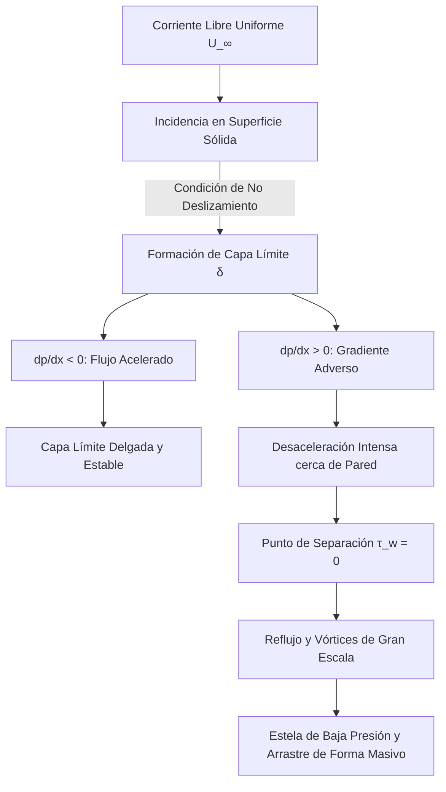

# Viscosidad y Capas Límite

La viscosidad mide la resistencia interna de un fluido a deformarse por cizalla. Aunque pueda parecer un detalle pequeño, es la responsable de efectos tan decisivos como la disipación de energía, el perfil de velocidad cerca de superficies, la fricción hidrodinámica y la transición a turbulencia.

## 🧮 Desarrollo Teórico Profundo

La dinámica de fluidos viscosos reales y la teoría de la capa límite (introducida por Ludwig Prandtl en 1904) resolvieron la aparente contradicción entre la hidrodinámica clásica de fluidos ideales (que predecía cero arrastre de forma, o Paradoja de D'Alembert) y las observaciones empíricas aeronáuticas.

### 1. El Tensor Viscoso y las Ecuaciones de Navier-Stokes

Para un fluido Newtoniano isotrópico incompresible, el tensor de esfuerzos de Cauchy se descompone en un término de presión termodinámica isotrópica y un tensor de esfuerzo viscoso $\boldsymbol{\tau}$:
$$ \sigma_{ij} = -p \delta_{ij} + \tau_{ij} $$
$$ \tau_{ij} = \mu \left( \frac{\partial u_i}{\partial x_j} + \frac{\partial u_j}{\partial x_i} \right) $$
donde $\mu$ es la viscosidad dinámica (reflejando fricción microscópica). Insertando esto en la ecuación de momento lineal (balance de fuerzas) se obtiene la Ecuación de Navier-Stokes:
$$ \rho \left( \frac{\partial \vec{v}}{\partial t} + (\vec{v} \cdot \nabla) \vec{v} \right) = -\nabla p + \mu \nabla^2 \vec{v} + \rho \vec{g} $$

### 2. Adimensionalización y Número de Reynolds

Consideremos un flujo con velocidad característica $U_0$ y longitud característica $L_0$. Definiendo variables adimensionales (marcadas con asterisco):
$$ \vec{x}^* = \frac{\vec{x}}{L_0}, \quad \vec{v}^* = \frac{\vec{v}}{U_0}, \quad t^* = \frac{t U_0}{L_0}, \quad p^* = \frac{p - p_0}{\rho U_0^2} $$
Sustituyendo en Navier-Stokes (ignorando la gravedad) obtenemos:
$$ \frac{\partial \vec{v}^*}{\partial t^*} + (\vec{v}^* \cdot \nabla^*) \vec{v}^* = -\nabla^* p^* + \frac{1}{Re} \nabla^{*2} \vec{v}^* $$
donde $Re = \frac{\rho U_0 L_0}{\mu}$ es el **Número de Reynolds**. Representa la relación estricta entre las fuerzas inerciales ($\rho U_0^2 / L_0$) y las fuerzas viscosas ($\mu U_0 / L_0^2$).

### 3. Aproximación de Capa Límite de Prandtl

Para $Re \gg 1$ (flujos de alta velocidad como un avión en vuelo), el término $\frac{1}{Re} \nabla^{*2} \vec{v}^*$ parece despreciable matemáticamente. Sin embargo, no se puede omitir, porque hacerlo reduce el orden de la ecuación diferencial, imposibilitando cumplir la **Condición de No Deslizamiento** en paredes sólidas ($\vec{v}_{pared} = 0$).

Prandtl postuló que el campo de flujo se divide asintóticamente en dos regiones:
1. **Flujo Exterior (Inviscido):** Donde la viscosidad es negligible y se rige por las Ecuaciones de Euler y Bernoulli.
2. **Capa Límite:** Una región ultradelgada contigua a la pared donde el gradiente de velocidad normal $\partial u / \partial y$ es gigantesco, haciendo que la fricción viscosa iguale a las fuerzas inerciales.

Sea el flujo bidimensional estacionario sobre una placa plana. Asumiendo que el espesor de la capa $\delta \ll L$, el análisis de orden de magnitud simplifica las ecuaciones de Navier-Stokes a las **Ecuaciones de Capa Límite de Prandtl**:
**Continuidad:**
$$ \frac{\partial u}{\partial x} + \frac{\partial v}{\partial y} = 0 $$
**Momento en $x$:**
$$ u \frac{\partial u}{\partial x} + v \frac{\partial u}{\partial y} = -\frac{1}{\rho}\frac{dp}{dx} + \nu \frac{\partial^2 u}{\partial y^2} $$
**Momento en $y$:**
$$ \frac{\partial p}{\partial y} \approx 0 \implies p = p(x) $$
El campo de presiones de la capa límite está enteramente impuesto por el flujo libre no viscoso exterior según la ecuación de Euler $dp/dx = -\rho U(dU/dx)$.

### 4. Solución Exacta de Blasius (Placa Plana)

Para una placa plana con $U = \text{cte}$ y $dp/dx = 0$, H. Blasius introdujo una variable de similitud:
$$ \eta = y \sqrt{\frac{U}{\nu x}} $$
y definió una función de corriente $\psi = \sqrt{\nu U x} f(\eta)$ para satisfacer continuidad. Sustituyendo en la ecuación de momento se obtiene la ecuación diferencial ordinaria no lineal de tercer orden (Ecuación de Blasius):
$$ 2 f''' + f f'' = 0 $$
con condiciones de frontera:
$$ f(0) = f'(0) = 0 \quad \text{(Pared)} $$
$$ f'(\eta \to \infty) = 1 \quad \text{(Corriente Libre)} $$
La solución numérica demuestra que la velocidad $u$ alcanza el $99\%$ de $U$ cuando $\eta \approx 4.91$. Por tanto, el espesor de la capa límite laminar crece con la raíz cuadrada de la distancia:
$$ \delta(x) = \frac{4.91 x}{\sqrt{Re_x}} $$
El esfuerzo cortante en la pared local es $\tau_w = 0.332 \rho U^2 / \sqrt{Re_x}$, lo que permite cuantificar analíticamente la fricción y fuerza de arrastre por primera vez en la historia de la aerodinámica.

### 5. Separación de la Capa Límite y Estelas

Cuando el fluido atraviesa geometrías divergentes o cilindros, el flujo exterior se desacelera ($dU/dx < 0$), generando un gradiente de presiones adverso ($dp/dx > 0$). Esta presión actúa como una contrafuerza que frena las ya lentas partículas profundas de la capa límite. 
En el punto de separación ($x_s$), la fricción superficial se anula ($\partial u / \partial y |_{y=0} = 0$) y ocurre reflujo. La capa límite se desprende de la pared, generando enormes torbellinos macroscópicos y una estela de baja presión; este fenómeno es responsable del **Drag (Arrastre) de Forma** que domina sobre el arrastre viscoso puro.



## 📝 Guía de Ejercicios Resueltos

**Problema 1: Ecuación de Blasius para la Capa Límite Plana**
A partir de la ecuación de von Kármán para cantidad de movimiento $\frac{\tau_w}{\rho U^2} = \frac{d\theta}{dx}$, calcule el espesor de la capa límite $\delta(x)$ asumiendo un perfil de velocidades de cuarto grado: $\frac{u}{U} = 2\eta - 2\eta^3 + \eta^4$ donde $\eta = y/\delta$.

**Solución paso a paso:**
1. El espesor de momentum $\theta$ es $\theta = \int_0^\delta \frac{u}{U} \left(1 - \frac{u}{U}\right) dy = \delta \int_0^1 f(\eta) (1 - f(\eta)) d\eta$.
2. Con $f(\eta) = 2\eta - 2\eta^3 + \eta^4$, calculamos la integral (llamémosla $C_\theta$). Evaluando rigurosamente obtenemos $C_\theta = \frac{37}{315}$. Por lo tanto, $\theta = \frac{37}{315} \delta$.
3. El esfuerzo cortante en la pared $\tau_w$ se evalúa como $\tau_w = \mu \left( \frac{\partial u}{\partial y} \right)_{y=0} = \frac{\mu U}{\delta} f'(0)$.
4. Calculamos $f'(0)$: $f'(\eta) = 2 - 6\eta^2 + 4\eta^3 \implies f'(0) = 2$. Luego $\tau_w = \frac{2\mu U}{\delta}$.
5. Reemplazamos en von Kármán: $\frac{2\mu U}{\rho U^2 \delta} = \frac{d}{dx} \left( \frac{37}{315} \delta \right) \implies \frac{2\nu}{U \delta} = \frac{37}{315} \frac{d\delta}{dx}$.
6. Integramos separando variables: $\delta d\delta = \frac{630}{37} \frac{\nu}{U} dx$.
7. $\frac{\delta^2}{2} = \frac{630}{37} \frac{\nu x}{U} \implies \delta^2 = \frac{1260}{37} \frac{\nu x}{U} \approx 34.05 \frac{\nu x}{U}$.
8. Despejando $\delta$: $\delta = \sqrt{34.05} \sqrt{\frac{\nu x}{U}} \approx 5.84 \frac{x}{\sqrt{Re_x}}$. Este valor de aproximación polinómica es muy cercano al $5.0$ exacto de Blasius.

**Problema 2: Flujo de Couette-Poiseuille Generalizado**
Un fluido viscoso de viscosidad $\mu$ fluye entre dos placas paralelas separadas por una distancia $h$. La placa inferior ($y=0$) está fija, y la superior ($y=h$) se mueve a velocidad constante $V$. Existe además un gradiente de presión constante $\frac{dP}{dx} < 0$. Determine el perfil de velocidades y el caudal por unidad de ancho.

**Solución paso a paso:**
1. Ecuación de Navier-Stokes unidimensional: $\mu \frac{d^2u}{dy^2} = \frac{dP}{dx}$.
2. Integramos dos veces respecto a $y$:
   $\frac{du}{dy} = \frac{1}{\mu} \frac{dP}{dx} y + C_1$.
   $u(y) = \frac{1}{2\mu} \frac{dP}{dx} y^2 + C_1 y + C_2$.
3. Condiciones de contorno:
   No deslizamiento en $y=0$: $u(0) = 0 \implies C_2 = 0$.
   En $y=h$: $u(h) = V \implies \frac{1}{2\mu} \frac{dP}{dx} h^2 + C_1 h = V \implies C_1 = \frac{V}{h} - \frac{h}{2\mu} \frac{dP}{dx}$.
4. Sustituyendo $C_1$:
   $u(y) = \frac{1}{2\mu} \frac{dP}{dx} (y^2 - hy) + V \frac{y}{h}$. Este es un perfil parabólico superpuesto con uno lineal.
5. El caudal $q$ por unidad de ancho es $q = \int_0^h u(y) dy$.
   $q = \int_0^h \left[ \frac{1}{2\mu} \frac{dP}{dx} (y^2 - hy) + V \frac{y}{h} \right] dy$.
6. $q = \frac{1}{2\mu} \frac{dP}{dx} \left( \frac{h^3}{3} - \frac{h^3}{2} \right) + V \left( \frac{h^2}{2h} \right) = \frac{1}{2\mu} \frac{dP}{dx} \left( -\frac{h^3}{6} \right) + \frac{Vh}{2} = \frac{Vh}{2} - \frac{h^3}{12\mu} \frac{dP}{dx}$.

**Problema 3: Separación de la Capa Límite**
Explique matemáticamente por qué un gradiente de presión adverso ($dP/dx > 0$) es necesario para que exista desprendimiento de la capa límite.

**Solución paso a paso:**
1. En la pared ($y=0$), la ecuación de Prandtl (Navier-Stokes simplificada) se reduce a $\mu \left( \frac{\partial^2 u}{\partial y^2} \right)_{wall} = \frac{dP}{dx}$, dado que $u=v=0$.
2. Para que haya flujo desprendido o contraflujo cerca de la pared, el esfuerzo cortante debe cambiar de dirección, es decir, $(\partial u/\partial y)_{wall} < 0$.
3. En el punto de separación exacto, el esfuerzo de corte en la pared es nulo: $(\partial u/\partial y)_{wall} = 0$.
4. Como lejos de la pared $u \to U_{ext} > 0$, para pasar de un valor nulo de derivada en la pared a alcanzar la velocidad exterior, la curva $u(y)$ debe tener un punto de inflexión.
5. En la separación, como el gradiente de velocidad pasa de ser negativo (zona separada) a positivo en la corriente principal, requiere una curvatura convexa cerca de la pared, lo que implica $(\partial^2 u/\partial y^2)_{wall} > 0$.
6. De la ecuación del paso 1, si $(\partial^2 u/\partial y^2)_{wall} > 0$, esto exige estrictamente que $\frac{dP}{dx} > 0$.
7. Por lo tanto, el flujo solo puede separarse bajo un gradiente de presión adverso, donde la presión fuerza al fluido a detenerse, superando el momento inercial.

## 💻 Simulaciones Computacionales

Solución numérica de la Ecuación de Blasius para la capa límite sobre una placa plana utilizando el método de Runge-Kutta y *Shooting Method*.

```python
import numpy as np
import matplotlib.pyplot as plt
from scipy.integrate import solve_ivp

# Ecuación de Blasius: f''' + 0.5 * f * f'' = 0
# Sistema ODE de 1er orden:
# y1 = f
# y2 = f' (velocidad adimensional u/U)
# y3 = f''
def blasius(eta, y):
    return [y[1], y[2], -0.5 * y[0] * y[2]]

# Condiciones de contorno: f(0)=0, f'(0)=0, f'(inf)=1
# Usamos Shooting Method para hallar y3(0) = f''(0)
eta_max = 10.0
# Sabemos empíricamente que f''(0) está cerca de 0.33206
f2_guess = 0.3320573362

sol = solve_ivp(blasius, [0, eta_max], [0, 0, f2_guess], t_eval=np.linspace(0, eta_max, 100))

eta = sol.t
f_prime = sol.y[1] # u / U_infty

plt.figure(figsize=(6, 8))
plt.plot(f_prime, eta, 'k-', lw=2)
plt.axvline(0.99, color='r', linestyle='--', label=r'$u/U_\infty = 0.99$ (Borde de capa límite)')
plt.axhline(4.91, color='g', linestyle='--', label=r'$\eta \approx 4.91$')
plt.title("Perfil de Velocidad de la Capa Límite Laminar (Blasius)")
plt.xlabel(r"Velocidad Adimensional $u/U_\infty$")
plt.ylabel(r"Coordenada de similitud $\eta = y \sqrt{U_\infty / \nu x}$")
plt.legend()
plt.grid(True)
plt.show()
```

## 📚 Recursos Específicos

### Cursos Recomendados
1. [Boundary Layer Theory (NPTEL)](https://nptel.ac.in/courses/112104118)
2. [Advanced Fluid Mechanics: Turbulence (MIT OCW)](https://ocw.mit.edu/courses/mechanical-engineering/)
3. [Viscous Fluid Flow (NPTEL)](https://nptel.ac.in/courses/112105228)

### Artículos y Simulaciones
1. **On the Motion of Fluid in a Boundary Layer (Ludwig Prandtl, 1904)**
   - **Enlace:** [https://en.wikipedia.org/wiki/Boundary_layer](https://en.wikipedia.org/wiki/Boundary_layer)
   - **Importancia Teórica:** Es considerado el artículo más influyente en la dinámica de fluidos del siglo XX. Resolvió la paradoja de d'Alembert separando el fluido en dos regímenes.
   - **Fondo Matemático:** Propuso que con un alto número de Reynolds ($Re \gg 1$), las fuerzas viscosas se limitan a una capa límite delgada adyacente a la superficie. Simplifica Navier-Stokes en 2D:
     $$
     u \frac{\partial u}{\partial x} + v \frac{\partial u}{\partial y} = -\frac{1}{\rho} \frac{\partial p}{\partial x} + \nu \frac{\partial^2 u}{\partial y^2}
     $$
   - **Implicaciones Físicas:** Explicó de dónde proviene el arrastre (fricción de piel) y la separación del flujo (pérdida de sustentación aerodinámica).

2. **The Local Structure of Turbulence in Incompressible Viscous Fluid for Very Large Reynolds Numbers (A.N. Kolmogorov, 1941)**
   - **Enlace:** [https://rspa.royalsocietypublishing.org/content/434/1890/9](https://rspa.royalsocietypublishing.org/content/434/1890/9)
   - **Importancia Teórica:** Formuló la teoría K41. Introdujo las bases universales de la turbulencia isotrópica, proporcionando las primeras predicciones cuantitativas exitosas para el régimen caótico.
   - **Fondo Matemático:** Postuló por análisis dimensional que, en el rango inercial, las propiedades del flujo dependen únicamente de la tasa de disipación de energía $\varepsilon$. La función de estructura de segundo orden exhibe escalamiento de dos tercios:
     $$
     \langle [u(x+r) - u(x)]^2 \rangle \sim \varepsilon^{2/3} r^{2/3}
     $$
   - **Implicaciones Físicas:** Demostró un aparente orden subyacente determinista estocástico dentro del régimen turbulento complejo y guio modelos de gran escala para la meteorología (LES).

3. **On the Dynamical Theory of Incompressible Viscous Fluids and the Determination of the Criterion (Osborne Reynolds, 1895)**
   - **Enlace:** [https://royalsocietypublishing.org/doi/10.1098/rstl.1895.0004](https://royalsocietypublishing.org/doi/10.1098/rstl.1895.0004)
   - **Importancia Teórica:** Definió cuantitativamente la transición del flujo laminar al turbulento mediante el adimensional Número de Reynolds.
   - **Fondo Matemático:** El número relaciona las fuerzas inerciales a las viscosas:
     $$
     Re = \frac{\rho u L}{\mu} = \frac{u L}{\nu}
     $$
     También derivó las ecuaciones de Navier-Stokes promediadas por Reynolds (RANS), dividiendo el flujo en media temporal $U$ y fluctuaciones $u'$:
     $$
     u(x,t) = U(x) + u'(x,t)
     $$
   - **Implicaciones Físicas:** Proporcionó la herramienta unificadora de escala empírica para todos los estudios hidrodinámicos en tuberías y perfiles alares.

### 📖 Referencias Útiles y Bibliografía
1. [Fluid Mechanics (L.D. Landau y E.M. Lifshitz)](https://www.amazon.com/Fluid-Mechanics-Second-Theoretical-Physics/dp/0080339336)
2. [Boundary-Layer Theory (Hermann Schlichting)](https://www.amazon.com/Boundary-Layer-Theory-Hermann-Schlichting/dp/3662529176)
