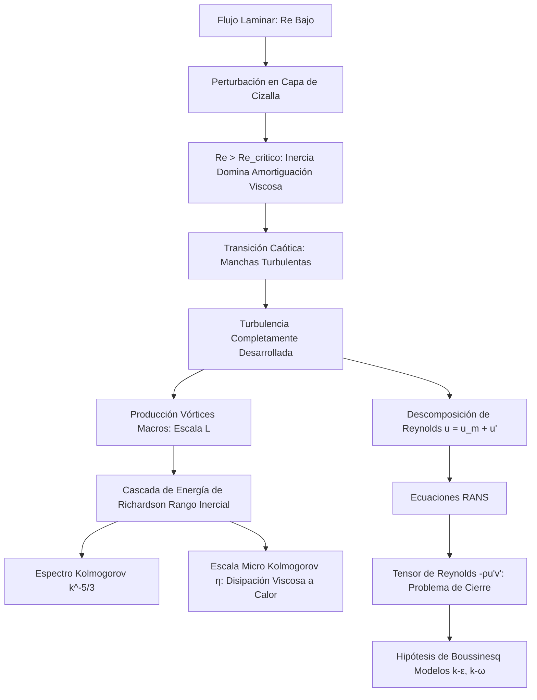

# Viscosidad y Turbulencia
Los fluidos reales poseen fricción interna, conocida como viscosidad. Dependiendo de la velocidad y geometría, el flujo puede ser ordenado (laminar) o caótico y mezclado (turbulento). El estudio de la turbulencia es uno de los mayores problemas abiertos de la física clásica.

## 📜 Contexto Histórico
Isaac Newton fue el primero en modelar la viscosidad en 1687. En el siglo XIX, Claude-Louis Navier y George Gabriel Stokes derivaron las ecuaciones fundamentales de flujo viscoso. En 1883, Osborne Reynolds demostró experimentalmente la transición entre flujo laminar y turbulento, definiendo el Número de Reynolds.

## 🧮 Desarrollo Teórico Profundo

La turbulencia es una inestabilidad universal del flujo de fluidos a altos Números de Reynolds, caracterizada por la presencia de vórtices tridimensionales intermitentes y caóticos en múltiples escalas, que aceleran drásticamente la mezcla térmica y másica así como la disipación de momento.

### 1. Inestabilidades y Transición

Un flujo laminar inicialmente regular es una solución exacta a las Ecuaciones de Navier-Stokes. Sin embargo, matemáticamente se demuestra mediante Análisis de Estabilidad Lineal (ej., Ecuación de Orr-Sommerfeld) que perturbaciones infinitesimales pueden crecer exponencialmente cuando el campo inercial abruma a las fuerzas de amortiguación viscosas. 
El **Número de Reynolds**:
$$ Re = \frac{\rho U L}{\mu} = \frac{\text{Fuerzas Inerciales}}{\text{Fuerzas Viscosas}} $$
es el discriminador primario. En tuberías, si $Re \approx 2300$ el flujo se vuelve inestable (Transición) y si $Re > 4000$ es completamente Turbulento.

### 2. Descomposición de Reynolds (RANS)

Debido al caos, tratar analíticamente campos instantáneos $\vec{v}(\vec{x}, t)$ es estocástico. Osborne Reynolds propuso descomponer cada variable de flujo en su valor medio temporal ($\bar{u}$) y sus fluctuaciones turbulentas de alta frecuencia ($u'$):
$$ u(\vec{x}, t) = \bar{u}(\vec{x}) + u'(\vec{x}, t) $$
$$ p(\vec{x}, t) = \bar{p}(\vec{x}) + p'(\vec{x}, t) $$
Al sustituir esta descomposición en Navier-Stokes y promediar toda la ecuación en el tiempo, obtenemos las Ecuaciones de Navier-Stokes Promediadas por Reynolds (RANS):
$$ \rho \left( \frac{\partial \bar{u}_i}{\partial t} + \bar{u}_j \frac{\partial \bar{u}_i}{\partial x_j} \right) = -\frac{\partial \bar{p}}{\partial x_i} + \mu \nabla^2 \bar{u}_i - \rho \frac{\partial}{\partial x_j} (\overline{u'_i u'_j}) $$
Emerge mágicamente un término adicional de tensores derivado de la no linealidad convectiva promedio de las fluctuaciones cruzadas:
$$ \tau_{ij}^{turb} = -\rho \overline{u'_i u'_j} $$
Conocido como el **Tensor de Esfuerzos de Reynolds**, representa el momento difusivo transportado por vórtices turbulentos. Este tensor introduce incógnitas adicionales superando el número de ecuaciones disponibles. Este es el clásico e histórico **Problema de Cierre de la Turbulencia**.

### 3. Modelos de Cierre y Viscosidad de Remolino (Boussinesq)

Joseph Boussinesq postuló que el transporte de momento por los vórtices gigantes análogamente emula la colisión de moléculas en la difusión de momento. Por ende, los esfuerzos de Reynolds se modelan proporcionales al gradiente del flujo medio macroscópico, usando una viscosidad aparente $\mu_t$ (**Viscosidad de Remolino o Turbulenta**):
$$ -\rho \overline{u'_i u'_j} \approx \mu_t \left( \frac{\partial \bar{u}_i}{\partial x_j} + \frac{\partial \bar{u}_j}{\partial x_i} \right) - \frac{2}{3} \rho k \delta_{ij} $$
donde $k = \frac{1}{2} (\overline{u'^2} + \overline{v'^2} + \overline{w'^2})$ es la Energía Cinética Turbulenta.
A diferencia de $\mu$ (que es propiedad del fluido), la $\mu_t$ es una propiedad agresiva local del estado de la turbulencia. Para encontrarla, se recurre a ecuaciones diferenciales transportables, siendo los más universales el modelo algebraico de **Longitud de Mezcla de Prandtl** ($\mu_t = \rho l_m^2 |\partial \bar{u} / \partial y|$) y modelos de dos ecuaciones de transporte $k-\epsilon$ o $k-\omega$.

### 4. La Cascada de Energía de Richardson-Kolmogorov

El físico L. F. Richardson propuso la fenomenología visual de la cascada:
> "Los grandes vórtices tienen pequeños vórtices que se alimentan de su velocidad, y pequeños vórtices tienen vórtices aún más pequeños, y así hasta la viscosidad (en el sentido molecular)".

En 1941, **Andrey Kolmogorov** formuló matemáticamente (Teoría K41) la distribución asintótica del espectro energético en flujos isótropos locales:
1. La turbulencia se genera a escalas macroscópicas integrales $L$. 
2. Esta energía cinética percola inercialmente e isoinvíscidamente a remolinos cada vez más ínfimos (Rango Inercial).
3. En las minúsculas escalas finales (Escalas de Kolmogorov $\eta$), el Re local cae hacia el límite de la unidad y la cizalla viscosa disipa abruptamente la energía cinética en calor a una tasa $\epsilon$.
La relación microescalar de Kolmogorov estima el diámetro de los vórtices disipativos termales:
$$ \eta = \left(\frac{\nu^3}{\epsilon}\right)^{1/4} $$
Kolmogorov demostró por análisis dimensional que, en el Rango Inercial, la densidad espectral de la energía cinética de los torbellinos sigue una asombrosa y fundamental ley de potencia universal:
$$ E(\kappa) = C_K \epsilon^{2/3} \kappa^{-5/3} $$
donde $\kappa$ es el número de onda y $C_K \approx 1.5$ es la constante de Kolmogorov. Esta es, indudablemente, una de las mayores contribuciones matemáticas a la física de fluidos del siglo XX.

## 🛠 Ejemplo Práctico
**Problema:** Sangre a $ 37^\circ \text{C} $ ($ \rho = 1060 \text{ kg/m}^3 $, $ \mu = 4 \times 10^{-3} \text{ Pa}\cdot\text{s} $) fluye a través de una arteria de $ 4 \text{ mm} $ de diámetro a una velocidad promedio de $ 0.3 \text{ m/s} $. Determina si el flujo es laminar o turbulento y calcula la caída de presión en una longitud de $ 10 \text{ cm} $.

**Solución paso a paso:**
1. Calculamos el Número de Reynolds ($ D = 0.004 \text{ m}, v = 0.3 \text{ m/s} $):
   $$ Re = \frac{\rho v D}{\mu} = \frac{1060 \times 0.3 \times 0.004}{4 \times 10^{-3}} = \frac{1.272}{0.004} = 318 $$
   Como $ Re = 318 < 2100 $, el flujo es fuertemente **laminar**.
2. Al ser laminar, podemos aplicar la Ley de Poiseuille. Relacionamos $ Q $ con $ v $:
   $$ Q = v A = v (\pi r^2) $$
3. Sustituyendo $ Q $ en la ecuación de Poiseuille ($ r = 0.002 \text{ m} $):
   $$ v \pi r^2 = \frac{\pi r^4 \Delta P}{8 \mu L} \implies \Delta P = \frac{8 \mu L v}{r^2} $$
4. Calculamos $ \Delta P $ ($ L = 0.1 \text{ m} $):
   $ \Delta P = \frac{8 (4 \times 10^{-3}) (0.1) (0.3)}{(0.002)^2} = \frac{9.6 \times 10^{-4}}{4 \times 10^{-6}} = 240 \text{ Pa} $.

## 📚 Recursos
### Cursos Específicos
1. ["Turbulent Flows" - NPTEL](https://nptel.ac.in/courses/112106266)
2. ["Advanced Fluid Mechanics: Turbulence" - MIT OCW](https://ocw.mit.edu/courses/mechanical-engineering/)
3. ["Viscous Fluid Flow and Turbulence" - Coursera](https://www.coursera.org/)
4. ["Computational Fluid Dynamics: Turbulent Models" - edX](https://www.edx.org/)
5. ["Physics of Fluids" - Coursera](https://www.coursera.org/)
6. ["Introduction to Turbulence Modeling" - NPTEL](https://nptel.ac.in/)

### Artículos y Simulaciones
1. [*Transport Phenomena* - Bird, Stewart, Lightfoot (Capítulos de Viscosidad)](https://www.amazon.com/Transport-Phenomena-Revised-2nd-Byron/dp/0470115394)
2. ["The Local Structure of Turbulence in Incompressible Viscous Fluid" - A.N. Kolmogorov (1941)](https://rspa.royalsocietypublishing.org/content/434/1890/9)
3. [OpenFOAM: Tutorials on k-epsilon and k-omega models](https://www.openfoam.com/)
4. [SimScale: Turbulent Pipe Flow Simulation](https://www.simscale.com/docs/content/simwiki/fluiddynamics/turbulence.html)
5. ["On the Dynamical Theory of Incompressible Viscous Fluids and the Determination of the Criterion" - Osborne Reynolds](https://royalsocietypublishing.org/doi/10.1098/rstl.1895.0004)
6. [NASA Wind Tunnel Virtual Simulators](https://www.grc.nasa.gov/WWW/K-12/airplane/wtunnel.html)
7. ["Direct Numerical Simulation of Turbulence" - Annual Review of Fluid Mechanics](https://www.annualreviews.org/journal/fluid)
8. [Ansys Fluent: Large Eddy Simulation (LES) Guide](https://www.ansys.com/)
9. ["Navier-Stokes Equations and Turbulence" - Clay Mathematics Institute](https://www.claymath.org/millennium-problems/navier-stokes-equation)
10. [JHU Turbulence Database (JHTDB) datasets](http://turbulence.pha.jhu.edu/)

### 📖 Referencias Útiles y Bibliografía
1. [*Fluid Mechanics* (Vol. 6) - L.D. Landau y E.M. Lifshitz](https://www.amazon.com/Fluid-Mechanics-Second-Theoretical-Physics/dp/0080339336)
2. [*Turbulence: The Legacy of A. N. Kolmogorov* - Uriel Frisch](https://www.amazon.com/Turbulence-Legacy-Kolmogorov-Uriel-Frisch/dp/0521457130)
3. [*Fluid Mechanics* - Pijush K. Kundu y Ira M. Cohen](https://www.amazon.com/Fluid-Mechanics-Pijush-K-Kundu/dp/012405935X)
4. [*A First Course in Turbulence* - H. Tennekes y J.L. Lumley](https://www.amazon.com/First-Course-Turbulence-MIT-Press/dp/0262200198)
