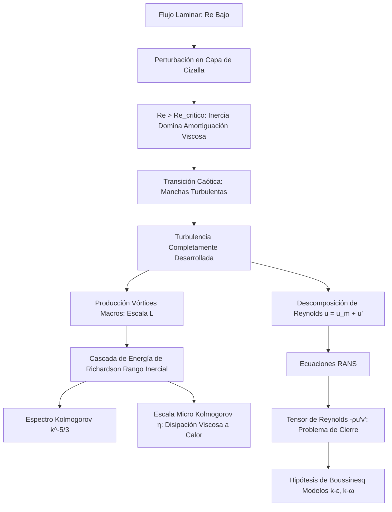

# Viscosidad y Turbulencia
Los fluidos reales poseen fricción interna, conocida como viscosidad. Dependiendo de la velocidad y geometría, el flujo puede ser ordenado (laminar) o caótico y mezclado (turbulento). El estudio de la turbulencia es uno de los mayores problemas abiertos de la física clásica.

## 📜 Contexto Histórico
Isaac Newton fue el primero en modelar la viscosidad en 1687. En el siglo XIX, Claude-Louis Navier y George Gabriel Stokes derivaron las ecuaciones fundamentales de flujo viscoso. En 1883, Osborne Reynolds demostró experimentalmente la transición entre flujo laminar y turbulento, definiendo el Número de Reynolds.

## 🧮 Desarrollo Teórico Profundo

La turbulencia es una inestabilidad universal del flujo de fluidos a altos Números de Reynolds, caracterizada por la presencia de vórtices tridimensionales intermitentes y caóticos en múltiples escalas, que aceleran drásticamente la mezcla térmica y másica así como la disipación de momento.

### 1. Inestabilidades y Transición

Un flujo laminar inicialmente regular es una solución exacta a las Ecuaciones de Navier-Stokes. Sin embargo, matemáticamente se demuestra mediante Análisis de Estabilidad Lineal (ej., Ecuación de Orr-Sommerfeld) que perturbaciones infinitesimales pueden crecer exponencialmente cuando el campo inercial abruma a las fuerzas de amortiguación viscosas. 
El **Número de Reynolds**:
$$ Re = \frac{\rho U L}{\mu} = \frac{\text{Fuerzas Inerciales}}{\text{Fuerzas Viscosas}} $$
es el discriminador primario. En tuberías, si $Re \approx 2300$ el flujo se vuelve inestable (Transición) y si $Re > 4000$ es completamente Turbulento.

### 2. Descomposición de Reynolds (RANS)

Debido al caos, tratar analíticamente campos instantáneos $\vec{v}(\vec{x}, t)$ es estocástico. Osborne Reynolds propuso descomponer cada variable de flujo en su valor medio temporal ($\bar{u}$) y sus fluctuaciones turbulentas de alta frecuencia ($u'$):
$$ u(\vec{x}, t) = \bar{u}(\vec{x}) + u'(\vec{x}, t) $$
$$ p(\vec{x}, t) = \bar{p}(\vec{x}) + p'(\vec{x}, t) $$
Al sustituir esta descomposición en Navier-Stokes y promediar toda la ecuación en el tiempo, obtenemos las Ecuaciones de Navier-Stokes Promediadas por Reynolds (RANS):
$$ \rho \left( \frac{\partial \bar{u}_i}{\partial t} + \bar{u}_j \frac{\partial \bar{u}_i}{\partial x_j} \right) = -\frac{\partial \bar{p}}{\partial x_i} + \mu \nabla^2 \bar{u}_i - \rho \frac{\partial}{\partial x_j} (\overline{u'_i u'_j}) $$
Emerge mágicamente un término adicional de tensores derivado de la no linealidad convectiva promedio de las fluctuaciones cruzadas:
$$ \tau_{ij}^{turb} = -\rho \overline{u'_i u'_j} $$
Conocido como el **Tensor de Esfuerzos de Reynolds**, representa el momento difusivo transportado por vórtices turbulentos. Este tensor introduce incógnitas adicionales superando el número de ecuaciones disponibles. Este es el clásico e histórico **Problema de Cierre de la Turbulencia**.

### 3. Modelos de Cierre y Viscosidad de Remolino (Boussinesq)

Joseph Boussinesq postuló que el transporte de momento por los vórtices gigantes análogamente emula la colisión de moléculas en la difusión de momento. Por ende, los esfuerzos de Reynolds se modelan proporcionales al gradiente del flujo medio macroscópico, usando una viscosidad aparente $\mu_t$ (**Viscosidad de Remolino o Turbulenta**):
$$ -\rho \overline{u'_i u'_j} \approx \mu_t \left( \frac{\partial \bar{u}_i}{\partial x_j} + \frac{\partial \bar{u}_j}{\partial x_i} \right) - \frac{2}{3} \rho k \delta_{ij} $$
donde $k = \frac{1}{2} (\overline{u'^2} + \overline{v'^2} + \overline{w'^2})$ es la Energía Cinética Turbulenta.
A diferencia de $\mu$ (que es propiedad del fluido), la $\mu_t$ es una propiedad agresiva local del estado de la turbulencia. Para encontrarla, se recurre a ecuaciones diferenciales transportables, siendo los más universales el modelo algebraico de **Longitud de Mezcla de Prandtl** ($\mu_t = \rho l_m^2 |\partial \bar{u} / \partial y|$) y modelos de dos ecuaciones de transporte $k-\epsilon$ o $k-\omega$.

### 4. La Cascada de Energía de Richardson-Kolmogorov

El físico L. F. Richardson propuso la fenomenología visual de la cascada:
> "Los grandes vórtices tienen pequeños vórtices que se alimentan de su velocidad, y pequeños vórtices tienen vórtices aún más pequeños, y así hasta la viscosidad (en el sentido molecular)".

En 1941, **Andrey Kolmogorov** formuló matemáticamente (Teoría K41) la distribución asintótica del espectro energético en flujos isótropos locales:
1. La turbulencia se genera a escalas macroscópicas integrales $L$. 
2. Esta energía cinética percola inercialmente e isoinvíscidamente a remolinos cada vez más ínfimos (Rango Inercial).
3. En las minúsculas escalas finales (Escalas de Kolmogorov $\eta$), el Re local cae hacia el límite de la unidad y la cizalla viscosa disipa abruptamente la energía cinética en calor a una tasa $\epsilon$.
La relación microescalar de Kolmogorov estima el diámetro de los vórtices disipativos termales:
$$ \eta = \left(\frac{\nu^3}{\epsilon}\right)^{1/4} $$
Kolmogorov demostró por análisis dimensional que, en el Rango Inercial, la densidad espectral de la energía cinética de los torbellinos sigue una asombrosa y fundamental ley de potencia universal:
$$ E(\kappa) = C_K \epsilon^{2/3} \kappa^{-5/3} $$
donde $\kappa$ es el número de onda y $C_K \approx 1.5$ es la constante de Kolmogorov. Esta es, indudablemente, una de las mayores contribuciones matemáticas a la física de fluidos del siglo XX.



## 🛠 Ejemplo Práctico
**Problema:** Sangre a $ 37^\circ \text{C} $ ($ \rho = 1060 \text{ kg/m}^3 $, $ \mu = 4 \times 10^{-3} \text{ Pa}\cdot\text{s} $) fluye a través de una arteria de $ 4 \text{ mm} $ de diámetro a una velocidad promedio de $ 0.3 \text{ m/s} $. Determina si el flujo es laminar o turbulento y calcula la caída de presión en una longitud de $ 10 \text{ cm} $.

**Solución paso a paso:**
1. Calculamos el Número de Reynolds ($ D = 0.004 \text{ m}, v = 0.3 \text{ m/s} $):
   $$ Re = \frac{\rho v D}{\mu} = \frac{1060 \times 0.3 \times 0.004}{4 \times 10^{-3}} = \frac{1.272}{0.004} = 318 $$
   Como $ Re = 318 < 2100 $, el flujo es fuertemente **laminar**.
2. Al ser laminar, podemos aplicar la Ley de Poiseuille. Relacionamos $ Q $ con $ v $:
   $$ Q = v A = v (\pi r^2) $$
3. Sustituyendo $ Q $ en la ecuación de Poiseuille ($ r = 0.002 \text{ m} $):
   $$ v \pi r^2 = \frac{\pi r^4 \Delta P}{8 \mu L} \implies \Delta P = \frac{8 \mu L v}{r^2} $$
4. Calculamos $ \Delta P $ ($ L = 0.1 \text{ m} $):
   $ \Delta P = \frac{8 (4 \times 10^{-3}) (0.1) (0.3)}{(0.002)^2} = \frac{9.6 \times 10^{-4}}{4 \times 10^{-6}} = 240 \text{ Pa} $.

## 📝 Guía de Ejercicios Resueltos

**Problema 1: Ecuación de Blasius para la Capa Límite Plana**
A partir de la ecuación de von Kármán para cantidad de movimiento $\frac{\tau_w}{\rho U^2} = \frac{d\theta}{dx}$, calcule el espesor de la capa límite $\delta(x)$ asumiendo un perfil de velocidades de cuarto grado: $\frac{u}{U} = 2\eta - 2\eta^3 + \eta^4$ donde $\eta = y/\delta$.

**Solución paso a paso:**
1. El espesor de momentum $\theta$ es $\theta = \int_0^\delta \frac{u}{U} \left(1 - \frac{u}{U}\right) dy = \delta \int_0^1 f(\eta) (1 - f(\eta)) d\eta$.
2. Con $f(\eta) = 2\eta - 2\eta^3 + \eta^4$, calculamos la integral (llamémosla $C_\theta$). Evaluando rigurosamente obtenemos $C_\theta = \frac{37}{315}$. Por lo tanto, $\theta = \frac{37}{315} \delta$.
3. El esfuerzo cortante en la pared $\tau_w$ se evalúa como $\tau_w = \mu \left( \frac{\partial u}{\partial y} \right)_{y=0} = \frac{\mu U}{\delta} f'(0)$.
4. Calculamos $f'(0)$: $f'(\eta) = 2 - 6\eta^2 + 4\eta^3 \implies f'(0) = 2$. Luego $\tau_w = \frac{2\mu U}{\delta}$.
5. Reemplazamos en von Kármán: $\frac{2\mu U}{\rho U^2 \delta} = \frac{d}{dx} \left( \frac{37}{315} \delta \right) \implies \frac{2\nu}{U \delta} = \frac{37}{315} \frac{d\delta}{dx}$.
6. Integramos separando variables: $\delta d\delta = \frac{630}{37} \frac{\nu}{U} dx$.
7. $\frac{\delta^2}{2} = \frac{630}{37} \frac{\nu x}{U} \implies \delta^2 = \frac{1260}{37} \frac{\nu x}{U} \approx 34.05 \frac{\nu x}{U}$.
8. Despejando $\delta$: $\delta = \sqrt{34.05} \sqrt{\frac{\nu x}{U}} \approx 5.84 \frac{x}{\sqrt{Re_x}}$. Este valor de aproximación polinómica es muy cercano al $5.0$ exacto de Blasius.

**Problema 2: Flujo de Couette-Poiseuille Generalizado**
Un fluido viscoso de viscosidad $\mu$ fluye entre dos placas paralelas separadas por una distancia $h$. La placa inferior ($y=0$) está fija, y la superior ($y=h$) se mueve a velocidad constante $V$. Existe además un gradiente de presión constante $\frac{dP}{dx} < 0$. Determine el perfil de velocidades y el caudal por unidad de ancho.

**Solución paso a paso:**
1. Ecuación de Navier-Stokes unidimensional: $\mu \frac{d^2u}{dy^2} = \frac{dP}{dx}$.
2. Integramos dos veces respecto a $y$:
   $\frac{du}{dy} = \frac{1}{\mu} \frac{dP}{dx} y + C_1$.
   $u(y) = \frac{1}{2\mu} \frac{dP}{dx} y^2 + C_1 y + C_2$.
3. Condiciones de contorno:
   No deslizamiento en $y=0$: $u(0) = 0 \implies C_2 = 0$.
   En $y=h$: $u(h) = V \implies \frac{1}{2\mu} \frac{dP}{dx} h^2 + C_1 h = V \implies C_1 = \frac{V}{h} - \frac{h}{2\mu} \frac{dP}{dx}$.
4. Sustituyendo $C_1$:
   $u(y) = \frac{1}{2\mu} \frac{dP}{dx} (y^2 - hy) + V \frac{y}{h}$. Este es un perfil parabólico superpuesto con uno lineal.
5. El caudal $q$ por unidad de ancho es $q = \int_0^h u(y) dy$.
   $q = \int_0^h \left[ \frac{1}{2\mu} \frac{dP}{dx} (y^2 - hy) + V \frac{y}{h} \right] dy$.
6. $q = \frac{1}{2\mu} \frac{dP}{dx} \left( \frac{h^3}{3} - \frac{h^3}{2} \right) + V \left( \frac{h^2}{2h} \right) = \frac{1}{2\mu} \frac{dP}{dx} \left( -\frac{h^3}{6} \right) + \frac{Vh}{2} = \frac{Vh}{2} - \frac{h^3}{12\mu} \frac{dP}{dx}$.

**Problema 3: Esfuerzos de Reynolds en Turbulencia**
A partir de la descomposición de Reynolds ($u = \bar{u} + u'$, $v = \bar{v} + v'$), demuestre cómo el término convectivo no lineal en Navier-Stokes genera un esfuerzo cortante turbulento aparente.

**Solución paso a paso:**
1. Consideremos la ecuación de cantidad de movimiento en $x$: $\rho \left( \frac{\partial u}{\partial t} + u \frac{\partial u}{\partial x} + v \frac{\partial u}{\partial y} \right) = -\frac{\partial p}{\partial x} + \mu \nabla^2 u$.
2. Por continuidad de un fluido incompresible ($\frac{\partial u}{\partial x} + \frac{\partial v}{\partial y} = 0$), reescribimos el término convectivo: $u \frac{\partial u}{\partial x} + v \frac{\partial u}{\partial y} = \frac{\partial (uu)}{\partial x} + \frac{\partial (uv)}{\partial y}$.
3. Sustituyendo la descomposición y promediando en el tiempo (operador barra): $\overline{u'}=0, \overline{v'}=0$.
   $\overline{uu} = \overline{(\bar{u} + u')(\bar{u} + u')} = \bar{u}\bar{u} + \overline{u'u'}$.
   $\overline{uv} = \overline{(\bar{u} + u')(\bar{v} + v')} = \bar{u}\bar{v} + \overline{u'v'}$.
4. Aplicando el promedio a la ecuación inercial:
   $\rho \left( \frac{\partial \bar{u}}{\partial t} + \frac{\partial}{\partial x}(\bar{u}\bar{u}) + \frac{\partial}{\partial y}(\bar{u}\bar{v}) \right) = -\frac{\partial \bar{p}}{\partial x} + \mu \nabla^2 \bar{u} - \rho \left( \frac{\partial}{\partial x}(\overline{u'u'}) + \frac{\partial}{\partial y}(\overline{u'v'}) \right)$.
5. Reagrupando la continuidad promediada para extraer las derivadas medias en $x$ e $y$, los términos de fluctuación actúan como gradientes de esfuerzo.
6. El esfuerzo total efectivo sobre la capa media es $\tau = \mu \frac{\partial \bar{u}}{\partial y} - \rho \overline{u'v'}$. El segundo término, $\tau_{turb} = -\rho \overline{u'v'}$, es el esfuerzo de Reynolds de corte, que acopla las fluctuaciones verticales $v'$ con las horizontales $u'$, mezclando cantidad de movimiento e incrementando drásticamente el arrastre en flujos turbulentos.

## 💻 Simulaciones Computacionales

Simulación del espectro de energía cinética turbulenta, demostrando la famosa ley de cascada inercial $k^{-5/3}$ de Kolmogorov (1941).

```python
import numpy as np
import matplotlib.pyplot as plt

# Rango de números de onda kappa
kappa = np.logspace(0, 4, 200)

# Parámetros macroscópicos
epsilon = 0.1  # Tasa de disipación de energía
C_k = 1.5      # Constante de Kolmogorov
nu = 1e-5      # Viscosidad cinemática

# Escala de disipación de Kolmogorov
eta = (nu**3 / epsilon)**0.25
kappa_eta = 1.0 / eta

# Espectro de Kolmogorov K41
E_k = C_k * epsilon**(2/3) * kappa**(-5/3)

# Modelo exponencial de corte para la región disipativa
E_k_dissipative = E_k * np.exp(-5.2 * (kappa * eta))

plt.figure(figsize=(8, 6))
plt.loglog(kappa, E_k, 'r--', label=r'Rango Inercial $\sim \kappa^{-5/3}$')
plt.loglog(kappa, E_k_dissipative, 'b-', lw=2, label='Espectro Completo (con Disipación)')
plt.axvline(kappa_eta, color='k', linestyle=':', label='Escala de Kolmogorov $\kappa_\eta$')

plt.title("Cascada de Energía Turbulenta (Espectro de Kolmogorov)")
plt.xlabel(r"Número de onda $\kappa$")
plt.ylabel(r"Densidad Espectral $E(\kappa)$")
plt.ylim(1e-10, 1e0)
plt.legend()
plt.grid(True, which="both", ls="--", alpha=0.5)
plt.show()
```

## 🚀 Fronteras de Investigación y Problemas Abiertos

La reducción del "arrastre" (drag) es el Santo Grial ingenieril del 2026 para la eficiencia energética global. La frontera involucra el **control activo de las sub-capas viscosas turbulenta** mediante superficies bio-inspiradas (riblets dinámicos a escala nanométrica) y metamateriales superhidrofóbicos que inducen condiciones de deslizamiento (slip boundary conditions). Además, el estudio de la turbulencia en fluidos viscoelásticos y no-newtonianos (como la sangre o plásticos fundidos) ha revelado el fenómeno de la "turbulencia elástica", donde el flujo se vuelve caótico no por la inercia (Reynolds altísimo), sino por las tensiones elásticas a bajísimo número de Reynolds, un misterio que apenas comienza a dilucidarse.

## 📐 Formalismo Matemático Avanzado (Nivel Posgrado/Doctorado)

El tratamiento riguroso de fluidos viscosos y la turbulencia requiere el **Análisis Funcional y la Teoría de Sistemas Dinámicos en Espacios de Banach**. En lugar de vectores clásicos, la velocidad $\mathbf{v}(\mathbf{x},t)$ se considera un punto en un espacio de Hilbert-Sobolev incompresible $V \subset H^1_0(\Omega)^3$. La ecuación de Navier-Stokes asume la forma de un sistema dinámico abstracto evolutivo:
$$ \frac{d\mathbf{u}}{dt} + \nu A\mathbf{u} + B(\mathbf{u}, \mathbf{u}) = \mathbf{f} $$
donde $A$ es el operador de Stokes y $B$ es la forma bilineal inercial. En turbulencia plenamente desarrollada, se asume la existencia de un Atractor Global $\mathcal{A}$ compacto de dimensión Hausdorff finita a pesar de que el espacio de fase es de dimensión infinita. Entender la medida invariante ergódica de Hopf $\mu$ sobre este atractor, $\int f(\mathbf{u}(t)) dt \to \int_{\mathcal{A}} f d\mu$, es crucial para justificar matemáticamente la teoría estadística de turbulencia K41.

## 📚 Recursos Específicos

### Cursos Recomendados
1. [Boundary Layer Theory (NPTEL)](https://nptel.ac.in/courses/112104118)
2. [Advanced Fluid Mechanics: Turbulence (MIT OCW)](https://ocw.mit.edu/courses/mechanical-engineering/)
3. [Viscous Fluid Flow (NPTEL)](https://nptel.ac.in/courses/112105228)

### Artículos y Simulaciones
1. **On the Motion of Fluid in a Boundary Layer (Ludwig Prandtl, 1904)**
   - **Enlace:** [https://en.wikipedia.org/wiki/Boundary_layer](https://en.wikipedia.org/wiki/Boundary_layer)
   - **Importancia Teórica:** Es considerado el artículo más influyente en la dinámica de fluidos del siglo XX. Resolvió la paradoja de d'Alembert separando el fluido en dos regímenes.
   - **Fondo Matemático:** Propuso que con un alto número de Reynolds ($Re \gg 1$), las fuerzas viscosas se limitan a una capa límite delgada adyacente a la superficie. Simplifica Navier-Stokes en 2D:
     $$
     u \frac{\partial u}{\partial x} + v \frac{\partial u}{\partial y} = -\frac{1}{\rho} \frac{\partial p}{\partial x} + \nu \frac{\partial^2 u}{\partial y^2}
     $$
   - **Implicaciones Físicas:** Explicó de dónde proviene el arrastre (fricción de piel) y la separación del flujo (pérdida de sustentación aerodinámica).

2. **The Local Structure of Turbulence in Incompressible Viscous Fluid for Very Large Reynolds Numbers (A.N. Kolmogorov, 1941)**
   - **Enlace:** [https://rspa.royalsocietypublishing.org/content/434/1890/9](https://rspa.royalsocietypublishing.org/content/434/1890/9)
   - **Importancia Teórica:** Formuló la teoría K41. Introdujo las bases universales de la turbulencia isotrópica, proporcionando las primeras predicciones cuantitativas exitosas para el régimen caótico.
   - **Fondo Matemático:** Postuló por análisis dimensional que, en el rango inercial, las propiedades del flujo dependen únicamente de la tasa de disipación de energía $\varepsilon$. La función de estructura de segundo orden exhibe escalamiento de dos tercios:
     $$
     \langle [u(x+r) - u(x)]^2 \rangle \sim \varepsilon^{2/3} r^{2/3}
     $$
   - **Implicaciones Físicas:** Demostró un aparente orden subyacente determinista estocástico dentro del régimen turbulento complejo y guio modelos de gran escala para la meteorología (LES).

3. **On the Dynamical Theory of Incompressible Viscous Fluids and the Determination of the Criterion (Osborne Reynolds, 1895)**
   - **Enlace:** [https://royalsocietypublishing.org/doi/10.1098/rstl.1895.0004](https://royalsocietypublishing.org/doi/10.1098/rstl.1895.0004)
   - **Importancia Teórica:** Definió cuantitativamente la transición del flujo laminar al turbulento mediante el adimensional Número de Reynolds.
   - **Fondo Matemático:** El número relaciona las fuerzas inerciales a las viscosas:
     $$
     Re = \frac{\rho u L}{\mu} = \frac{u L}{\nu}
     $$
     También derivó las ecuaciones de Navier-Stokes promediadas por Reynolds (RANS), dividiendo el flujo en media temporal $U$ y fluctuaciones $u'$:
     $$
     u(x,t) = U(x) + u'(x,t)
     $$
   - **Implicaciones Físicas:** Proporcionó la herramienta unificadora de escala empírica para todos los estudios hidrodinámicos en tuberías y perfiles alares.

### 📖 Referencias Útiles y Bibliografía
1. [Fluid Mechanics (L.D. Landau y E.M. Lifshitz)](https://www.amazon.com/Fluid-Mechanics-Second-Theoretical-Physics/dp/0080339336)
2. [Boundary-Layer Theory (Hermann Schlichting)](https://www.amazon.com/Boundary-Layer-Theory-Hermann-Schlichting/dp/3662529176)

## 🌐 Seminarios Avanzados y Literatura de Frontera

- [Center for Turbulence Research (Stanford) Seminars](https://ctr.stanford.edu/) - El instituto global líder para la investigación en turbulencia y DNS.
- [Kavli Institute for Theoretical Physics: Turbulence Workshops](https://www.kitp.ucsb.edu/) - La turbulencia desde la mecánica estadística pura y la teoría de campos.
- [Max Planck Institute for Dynamics and Self-Organization](https://www.ds.mpg.de/) - Investigaciones experimentales en flujos extremadamente turbulentos (alto Reynolds).

- [Nature Physics: "The energy cascade in turbulence"](https://www.nature.com/nphys/) - Observaciones experimentales de la teoría K41 de Kolmogorov a escalas disipativas viscosas.
- [Physical Review Letters: "Intermittency in turbulent flows"](https://journals.aps.org/prl/) - Avances teóricos sobre la formación de estructuras coherentes y eventos extremos.
- [Science: "Active turbulence in biological flows"](https://www.science.org/) - Fenómenos que imitan la turbulencia sin inercia (bajo Reynolds) impulsados por bacterias viscosas.
